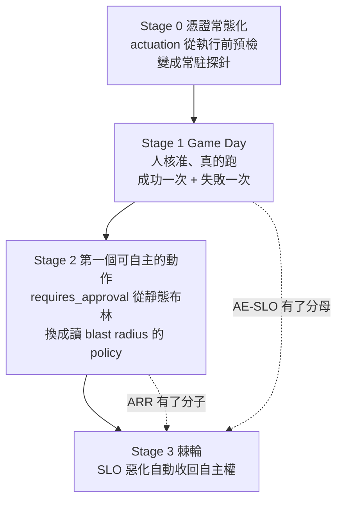

# Act 那一格：把 execute → verify → settle → rollback 走通的設計

狀態：設計稿（Day36 的素材）。寫於 2026-08-16，對照的程式碼是 `aiops-agent/service/app/`，
資料是 `otel-aiops-agent/ironman-2026/day35/cluster-snapshot.db`。

## 1. 現況：不是量不準，是分子在策略上不可達

Day35 的結論是「分母是零」。查完程式碼之後要再往下修一層：**分子在目前的設定下是不可能的。**

### 1.1 唯一那次執行，每一道閘都過了

`request_id=48e7df7697ac4034`（2026-08-08T09:02:44Z 起）的稽核鏈：

| ts (UTC) | phase | verdict | detail |
| --- | --- | --- | --- |
| 08:57:34 | proposed | ok | `autonomy=propose`, `reversible=true` |
| 09:02:44 | approved | ok | actor 是人 |
| 09:02:44 | execute | start | `k8s.rollout_undo demo/payment-service` |
| 09:02:44 | precondition | ok | `checked: 2` |
| 09:02:44 | dry_run | ok | revision 25→24, replicas 2→2, affected 2 pods, within policy |
| 09:02:45 | execute | fail | `(401) Unauthorized` |
| 09:02:45 | rollback | fail | `UnauthorizedException: (401)` |

兩件事要記住。一，讀取側的所有閘門（TOCTOU 重驗、dry-run、blast radius）都是綠的，
擋住這次的是寫入憑證。二，**rollback 用的是同一份憑證，所以它必然也 401**——
「自動回滾」在憑證失效這個故障模式下結構上不可能成功，`rollback_failed` 是唯一可能的結局。

`signals/actuation.py`（SelfSubjectAccessReview 預檢）就是這件事的產物，但它是事後補的，
那次執行沒有走過它。

### 1.2 ARR 的分子被 `requires_approval` 卡死

`registry` 目前註冊兩個動作，兩個都 `requires_approval=True`：

```
k8s.rollout_undo  reversible=True  requires_approval=True  impl=True  dry_run=True
k8s.scale         reversible=True  requires_approval=True  impl=True  dry_run=True
```

而 `governance.decide()` 在高信心之後的第一道判斷是：

```python
if action.requires_approval:
    return mk(Autonomy.PROPOSE, "high confidence but action is approval-gated")
```

它排在 calibration / DQ / actuation 三道閘**之前**。所以只要註冊表裡沒有一個
`requires_approval=False` 的動作，ARR 的分子恆為 0，跟校準做得多好、標註累積多少都無關。
Day35 那 13 筆 `autonomy=propose` 不是治理平面「每次都判斷不該放手」，是它**沒有別的選項**。

### 1.3 就算解開，AUTO 還差 13 筆人工標註

`governance_min_human_labeled_runs = 20`，叢集裡真人標註 7 筆（`source=ui`）。
而 `_SELF_LABEL_SOURCES` 明確把 `remediation-verified/-failed` 排除在外——自產標註不能解鎖 AUTO。
這條規則是對的，不要為了讓分母動起來就拿掉它。

### 1.4 所以缺的不是程式碼

`execute → verify(settle window) → auto-rollback → learn` 在 `execution.py` 裡是寫完的，
`tests/test_actuation.py`、`test_execution.py`、`test_k8s_write.py` 也都涵蓋過。
缺的是**真實輸入**，以及**一個夠低風險、可以真的放手的第一個動作**。

## 2. 設計：四階段的 staged actuation

原則：每一階段只解鎖一件事，而且每一階段都有一個可以驗收的資料庫事實。
`actions_enabled` 只在演習視窗打開，而且開關由人動手，腳本不會替你開。



### Stage 0：憑證與可執行性常態化

**先修一個比設計更前面的問題：叢集上跑的那版根本沒有這個預檢。**
`curl localhost:8000/openapi.json` 出來的路徑表裡沒有 `/actions/readiness` 也沒有 `/actions/reconcile`，
`/healthz` 連 `store` 欄位都還沒有。也就是說 actuation 預檢寫完之後從來沒有被部署過，
今天如果有人在 plugin 上按核准，它會用跟 8 月 8 號那次一模一樣的路徑走到寫入。
一個只存在於 repo 裡的防護措施，防的是 code review，不是事故。

把 actuation readiness 從「執行前才問一次」改成常駐訊號：排進健康檢查、有自己的時間序列、
超過 `actuation_max_age_seconds` 就是紅的。目標很單純：**401 這種事不該由一次事故來發現。**

驗收：連續 24 小時 actuation 的 age 都小於門檻，而且刻意撤掉 SA 權限一次，看它多久變紅。

（實作已經落地：探針進了 lifespan 的常駐 task，每一次結果寫進新的 `actuation_probes` 表，
`/healthz` 報快取判決、`/actions/readiness` 是現場探測。兩個要分開看——健康檢查上該出現的是
「這個常駐訊號還新鮮嗎」，不是每次 curl 都去打一次 API server。）

順帶要修一個結構問題：rollback 應該用**獨立於 execute 的憑證檢查**——至少在 execute 失敗後、
呼叫 rollback 之前重跑一次 SelfSubjectAccessReview，失敗就不要假裝試過，直接標
`rollback_unavailable` 並升級給人。現在的 `rollback_failed` 混了兩種完全不同的事：
回滾動作本身失敗，跟根本沒有能力回滾。

### Stage 1：Game Day——AE-SLO 的第一批分母

**演習跑在 `demo`，不是 `demo-twin`。** 寫設計稿的時候我以為 twin 可以當演習場，
實際看了一下 `demo-twin` 裡只有 loki / prometheus / tempo——Day34 蓋的是一座**訊號的**孿生環境
（同一批遙測換掉標籤重放），裡面根本沒有 payment-service 可以 rollback。
所以演習只能在 `demo` 這座 demo 環境跑，代價是它同時是前面所有文章的取數來源，
因此每次演習前後都要存一份 store 快照，演習產生的資料也要標記出來。

在 `demo` 注入 payment bad deploy，走完整條 propose → 人核准 → execute →
settle → verify → 成功/自動回滾。這是唯一能把 `executions.success=1` 寫進去的方法。

**故意跑兩種劇本**，而且第二種比第一種重要：

1. **會被修好的**：bad deploy → `rollout_undo` → decline rate 掉回 `max_value: 0.01` 以下 → `verify=pass` → SUCCEEDED。
2. **修不好的**：注入一個 rollout undo 修不掉的故障（例如 payment 的 feature flag 造成的
   decline，重點是它跟版本無關），讓 verify 必然失敗 → 觸發 auto-rollback → ROLLED_BACK。

第二種是唯一能證明「驗證失敗自動回滾」不是紙上談兵的方式，而且它產生的是一筆
**誠實的 AE-SLO 失敗樣本**——一個只跑成功劇本的演習，量出來的 AE-SLO 100% 跟現在的 0% 一樣沒有資訊。

驗收（查 `audit` 表）：`verify=pass` 至少一筆，`verify=fail` 後面接 `rollback=success` 至少一筆。

### Stage 2：第一個可自主的動作——風險判斷要有解析度

不要用「找一個比較安全的動作註冊進去」來解 1.2。真正的問題是
**風險不是動作的屬性，是 (動作, 目標, 幅度) 的屬性。**
`rollout_undo` 在 `demo` namespace、affected 2 pods、只退一版，跟它在別的 namespace
退五版，是兩件不同風險的事，但現在共用一個靜態布林。

設計：把 `ActionSpec.requires_approval` 從 `bool` 升級成一個 policy 判斷，輸入是已經算好的
blast radius（Stage 之前就存在的 `dry_run` 結果）＋ namespace ＋幅度：

- namespace 在 `execution_namespace_allowlist` 之內
- `affected_pods <= max_blast_pods` 且不是 singleton
- 幅度受限（revision 只退一版；scale 只允許 scale out 且 delta ≤ 1）

三者全中才允許進入 AUTO 評估，否則維持 `requires_approval=True`。**這不是放寬安全，
是讓同一份安全規則在窄範圍內給得出「可以」這個答案。** 順序上這一步要排在 `dry_run` 之後、
governance 之前，因為它吃 blast radius。

這一步同時把「ARR 永遠是 0」的天花板拆掉，ARR 才第一次變成一個量得到的東西。

### Stage 3：棘輪——SLO 反過來當旋鈕

Day35 說回饋箭頭「完全靠我手動接起來」。這一階段把它接上，但規則刻意不對稱：**易收難放。**

- 任何一次 `verify_failed` 或 `rollback_failed` → 立刻把該動作收回 `propose`，不需要任何統計顯著性。
- 恢復要靠證據：連續 N 次（建議 3）人核准的成功執行，才把它放回 auto-able。
- CE / DQ 惡化跨過門檻 → 同樣收回，而且要寫一筆 audit 說明是哪個 SLO 觸發的。

這就是 error budget 在這座系統裡的具體形狀：不是一個百分比看板，是一個會自己把權限拿走的機制。

## 3. 回答兩個問題

### runbook 給它？——已經有了，缺的是涵蓋與必填欄位

`runbooks/payment-bad-deploy.yaml` 已經是一份 Action Contract 了：remediation step 上帶了
`rollback`（逆操作）跟 `verify`（settle 後的 instant query ＋ `max_value: 0.01`）。
所以缺的不是 runbook 這個東西，是：

1. **涵蓋**——只有一本，只綁一個 alertname。Act 要有分母，每一種會固定重演的事故都要有一本。
   `draft_runbook.py` 已經會從標對的調查合成草稿，這條路是對的，缺的是把草稿變 active 的人工審核流程。
2. **verify 必填**——目前 `_verify_outcome()` 在沒有 verify spec 時是「樂觀跳過、回 True」。
   那等於一個沒有 verify 的 runbook 會自動拿到一筆 AE-SLO 成功。這個預設要反過來：
   沒有 verify spec 的 remediation step 不可執行，跟 `require_rollback_contract` 同一個規格。

### online 打分機制？——已經有一個，但不要用它來解鎖自主權

`_learn_outcome()` 已經把 verify 結果寫回 calibration（`source=remediation-verified/-failed`），
而且設計上刻意只把 **verify 失敗**當成 RCA 錯誤的證據（execute 失敗是基礎設施問題，不是診斷錯）。
這個區分很細緻，是對的。它預設關著（`learn_remediation_into_ce=False`），也是對的——
打開它就是讓系統自己給自己發及格證。

建議的分工：

| 訊號 | 來源 | 餵給誰 | 能不能解鎖 AUTO |
| --- | --- | --- | --- |
| verify pass/fail | 系統自產 | AE-SLO、runbook decay | 不能 |
| on-call 演習後按的「這次動作有沒有真的解決」 | 人 | AE-SLO 分子的權威來源、human label 計數 | 能 |
| plugin 上的對錯標註（現有 7 筆） | 人 | CE / 校準曲線 | 能 |

所以線上打分要**新增的是人的那一格**：每次演習結束在 plugin 上按一次。
那既是 AE-SLO 分子的權威來源，也是 human label 從 7 往 20 爬的唯一路徑。

## 4. 量測口徑要跟著改

- **AE-SLO 在 n < 5 時不要印百分比**，印 `0/1` 這種原始分數。Day35 已經吐槽過自己，
  這次直接寫進腳本，不要靠人記得。
- **ARR 的分母**目前是「產生過提案的事故指紋數」，那是腳本的口徑不是書的。要嘛改成
  偵測到的事故數，要嘛在報表上把口徑印出來。
- **演習產生的執行要標記出來**（`executions` 加一個 `drill` 欄位或用 fp 前綴）。
  演習數字跟真實事故數字混在同一個比率裡，就是 Day35 那個 RL-SLO 量到自己的手的翻版。

## 5. 誠實的風險

這是整個系列第一次讓程式真的改叢集狀態，而且因為 twin 沒有 workload，它只能發生在 `demo`——
也就是前面所有文章的取數來源。三條硬規則：`actions_enabled` 只在演習視窗打開、用完關掉；
每一次演習前後各存一份 store 快照；演習產生的告警帶 `drill=true`，算 SLO 時可以被排除。
