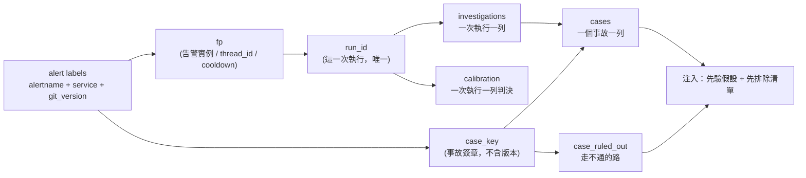

# 案例記憶：把「事故」從「那一次執行」裡拆出來

狀態：設計稿 ＋ 實作對帳（store 層與寫入端已落地，2026-08-18）。寫於 2026-08-18，對照的程式碼是 `aiops-agent/service/app/`
（`store.py` 1092 行、`investigations.py` 153 行、`webhook.py`、`agent.py`），
資料是 `otel-aiops-agent/ironman-2026/day36/snapshot-after-b-20260816T062002Z.db`。

Day32 的結論是「過去事故庫沒有活過來」，當時歸因到 `inv_query_similar` 那個
`JOIN calibration WHERE correct = 1`。查完之後要把那句話改掉：**JOIN 只是症狀，
病在 `fp` 一個欄位同時被當成四種 key 用。**

## 1. 現況：一個 fp，四個角色

`webhook.fingerprint(labels)` 是 `sha256(alertname|service|git_version)[:16]`，
而它被四個地方拿去當主鍵：

| 角色 | 誰在用 | 這個角色需要的 key 是 |
| --- | --- | --- |
| LangGraph thread_id | `run_headless(alert, thread_id=fp)` | 同一次事故的追問要落在同一條 thread |
| 告警去重 / cooldown | `_in_cooldown(fp)` | 同一個告警實例 |
| 調查紀錄的分組 | `investigations.fp` | **每一次執行各自一列** |
| 校準標註的對象 | `calibration.run_id = fp` | **每一次執行各自一列** |
| 過去事故的檢索 key | `inv_query_similar` 的 JOIN | **同一個事故，跨版本、跨次數** |

前兩個角色要的是「同一個告警實例」，後兩個要的是「這一次執行」，最後一個要的是
「這個事故本身」。三種粒度，一個欄位。

### 1.1 太窄的方向：drill 每跑一次就開一個新世界

day36 那場演習每次都部署一個新的 image tag，於是：

```
alertname                        | service         | git_version            | rows | distinct fp
payment-decline-rate-high        | payment-service |                        |    9 | 1
payment-decline-rate-high        | payment-service | v2.5.1-drill-055043    |    1 | 1
payment-decline-rate-high        | payment-service | v2.5.1-drill-055519    |    1 | 1
payment-decline-rate-high        | payment-service | v2.5.1-drill-061013    |    1 | 1
payment-decline-rate-high        | payment-service | v2.5.1-drill-061239    |    1 | 1
payment-decline-rate-high        | payment-service | v2.5.1-drill-061516    |    1 | 1
```

同一個事故、同一個服務、同一個根因，因為 `git_version` 在 key 裡，變成六個互不認識的
fingerprint。**這正是「案例記憶」最需要它們是同一筆的情況**——第二次遇到 payment 的
decline spike 時，第一次的結論該在桌上。現在它在另一個 fp 底下，查不到。

而 `git_version` 進 fingerprint 對「告警去重」那個角色是對的：換版本之後那確實是一個
該重新調查的新告警實例。兩個角色要的東西在這裡直接衝突，不是誰寫錯了。

### 1.2 太寬的方向：一個標註蓋在九個互相矛盾的結論上

反過來，`fp=383238a67e692abb` 這一格有 9 列 investigations，但 calibration 只有一列
（`cal_label` 的 UPDATE 是 `WHERE id = (SELECT id ... ORDER BY id DESC LIMIT 1)`，
一個 run_id 只有最後一列拿得到判決）。於是那次 `source='ui'` 的人工「對」，
透過 `JOIN ... ON c.run_id = i.fp` 蓋到了全部九列上：

```
383238a67e692abb | Code regression in payment-service v2.5.1-drill ... new_validator_odd_cents ... | correct=1
383238a67e692abb | Code regression in payment-service v2.5.0 ... new_validator ...                 | correct=1
383238a67e692abb | The alert was a false positive; no traffic, errors, or decline spikes ...       | correct=1
383238a67e692abb | The investigation is inconclusive as the current metrics show no active ...     | correct=1
383238a67e692abb | ... the service is healthy and the alert appears to be a transient false ...    | correct=1
```

`inv_query_similar` 的 `LIMIT 5` 會從這裡抓五列注進 prompt。**其中至少三列在說
「這是誤報、沒事」，而它們全部帶著「人判定為正確」的身分。** 這比空的事故庫糟：
空庫是沒有先驗，這是有一個帶著人工背書的錯誤先驗。

順帶一提，`eval/harness.py` 早就自己繞開了這個問題——它的 run_id 是
`f"eval-{fixture.id}-seed{seed}-{run_nonce}"`，註解寫得很清楚：「否則重複的
(fixture, seed) 會撞在一起，`cal_label` 的 UPDATE 會把判決貼到錯的實體列上」。
**修法在一個 caller 裡已經存在，只是沒有長進 schema。**

### 1.3 案例裡沒有負例

`InvestigationRecord` 存的是 `summary` / `hypothesis` / `confidence` /
`suspected_version` / `answer` / `decisions`——全部是**結論**。走過但走不通的路
（Day23 那批空結果、Day33 那三種不同的拒絕、被否證的假設分支）只活在逐字稿裡，
沒有任何欄位。所以就算檢索修好了，下一次也還是會把同樣的死路再走一遍。

## 2. 設計：三個 key，三張表



| key | 粒度 | 從哪來 | 誰用 |
| --- | --- | --- | --- |
| `fp` | 一個告警實例 | 現有 `fingerprint()`，**不動** | thread_id、cooldown、action_requests、audit |
| `run_id` | 一次執行 | `f"{fp}-{ts}-{nonce6}"` | investigations（**calibration 尚未，見 §9**） |
| `case_key` | 一個事故 | `sha256(norm(alertname)|service|symptom)[:16]`，**不含 git_version** | cases、case_ruled_out、檢索 |

`norm(alertname)` 直接沿用 Day24 那支正規化 fallback（`PaymentDeclineRateHigh` ↔
`payment-decline-rate-high`），而且照 Day24 的結論：**比中要留 warning**，
case_key 是靠正規化才合起來的那幾筆要看得出來。

`symptom` 先留空字串（等同「alertname + service 就是簽章」）。留這個欄位是因為
chat 那條路沒有 alertname，未來要用症狀向量補位；現在填空比現在就設計一套症狀分類
誠實。

## 3. Schema 草稿

照 `store.py` 現有的規矩：新表進 `_SCHEMA`（`CREATE TABLE IF NOT EXISTS`），
既有表加欄位進 `_MIGRATIONS`（純 additive，重跑安全）。

### 3.1 既有表的 additive 欄位

```python
_MIGRATIONS = [
    ...,  # 現有四條不動
    # run_id: 一次執行一個。舊列回填成 fp，讀得到但不再新增碰撞。
    "ALTER TABLE investigations ADD COLUMN run_id TEXT",
    "ALTER TABLE investigations ADD COLUMN case_key TEXT",
    "ALTER TABLE calibration ADD COLUMN case_key TEXT",
]
```

索引（進 `_SCHEMA`，跟現有 index 放一起）：

```sql
CREATE INDEX IF NOT EXISTS idx_inv_run_id  ON investigations(run_id);
CREATE INDEX IF NOT EXISTS idx_inv_case    ON investigations(case_key);
CREATE INDEX IF NOT EXISTS idx_cal_case    ON calibration(case_key);
```

`idx_inv_run_id` **刻意不是 UNIQUE**：回填時舊列的 run_id 全部是 fp，其中就有
1.2 那九列會撞。唯一性靠寫入端保證（新 run_id 帶 nonce），schema 這一層不擋，
否則 migration 會在既有 db 上炸掉。

### 3.2 `cases`：一個事故一列

```sql
CREATE TABLE IF NOT EXISTS cases (
    case_key    TEXT PRIMARY KEY,
    first_ts    TEXT NOT NULL,
    last_ts     TEXT NOT NULL,
    -- 簽章（可讀，供人 grep；權威仍是 case_key）
    alertname   TEXT,
    service     TEXT,
    symptom     TEXT NOT NULL DEFAULT '',
    occurrences INTEGER NOT NULL DEFAULT 1,   -- 這個簽章被調查過幾次

    -- 結論。只有在被非自我來源確認過之後才非 NULL。
    root_cause        TEXT,
    root_cause_source TEXT,   -- human / grader / self / NULL
    confirmed_run_id  TEXT,   -- 哪一次執行的結論被採信（可回放）
    confirmed_ts      TEXT,

    -- 怎麼收掉的。json：{"action": ..., "args": {...}, "outcome": "..."}
    resolution  TEXT,

    -- open / resolved / recurring / false_positive
    status      TEXT NOT NULL DEFAULT 'open'
);
CREATE INDEX IF NOT EXISTS idx_cases_service ON cases(service);
CREATE INDEX IF NOT EXISTS idx_cases_status  ON cases(status);
```

三個欄位值得單獨講：

**`root_cause_source`**——這是整份草稿最重要的一格。（**實作時修正**：草稿寫的
`('human','grader')` 是憑印象寫的，repo 裡實際的 `source` 字串是 `ui`（plugin 上的人）、
`manual`（CLI 的人）、`eval` / `eval-harness`（grader），自我來源是
`remediation-verified` / `remediation-failed`。允許清單改成實際值。用允許清單而不是
照抄 `governance._SELF_LABEL_SOURCES` 那種排除清單，是因為兩者的失效方向相反：
排除清單遇到「將來新增的自我標註來源」會預設放行，而這段文字是要進 prompt 的。）它取代目前那個
`JOIN calibration WHERE correct=1` 的守門：能不能進案例庫，判準不再是「有沒有被
標成對」，而是**「這個根因是誰說的」**。`self` 不夠格，理由跟
`governance._SELF_LABEL_SOURCES` 排除 `remediation-verified` 完全一樣——
自己說自己對，不能解鎖任何東西。這讓案例記憶跟校準脫鉤：**L0/L1 的知識累積不必
等到 20 筆非自我標註**，它只要求單筆的來源是誰。

**`status = 'false_positive'`**——1.2 那九列裡有一半在說「這是誤報」。誤報**也是
案例**，而且是很有用的一種（「這個告警在這個服務上，上三次都是誤報」）。但它必須
用不同的狀態存，不能混進「解過的事故」被當成先驗根因。這對應
`grading_mode` 那組 `CULPRIT` / `INCONCLUSIVE` 的區分，只是搬到案例這一層。

**`occurrences`**——`draft_runbook.py` 要的觸發條件（同一個案例重複 N 次才值得
合成 runbook）現在得掃全表算，有這個欄位就是一次 `WHERE occurrences >= 3`。

### 3.3 `case_ruled_out`：走不通的路

```sql
CREATE TABLE IF NOT EXISTS case_ruled_out (
    id        INTEGER PRIMARY KEY AUTOINCREMENT,
    case_key  TEXT NOT NULL,
    run_id    TEXT NOT NULL,        -- 是哪一次執行否證的（可回放）
    ts        TEXT NOT NULL,

    -- hypothesis: 這個原因被排除了
    -- query:      這個查法在這個環境上問不出東西
    -- action:     這個動作被護欄擋掉 / 做了沒用
    kind      TEXT NOT NULL,
    subject   TEXT NOT NULL,        -- 被排除的東西本身（一句話 / 一條查詢）
    evidence  TEXT NOT NULL DEFAULT '',  -- 為什麼排除

    -- tool_result: 工具回應直接證偽（空結果、400、拒絕）
    -- grader / human: 事後判的
    -- model: 模型自己說的 —— 記錄但預設不注入
    disproved_by TEXT NOT NULL,

    -- 環境會變。保留期到了查不到 ≠ 永遠查不到。
    still_valid  INTEGER NOT NULL DEFAULT 1,
    expires_ts   TEXT
);
CREATE INDEX IF NOT EXISTS idx_ruled_out_case ON case_ruled_out(case_key, still_valid);
```

`kind` 那三種對應這系列實際踩過的三種死路：Day21 兩次不可能成功的 trace 查詢
（`query`）、Day26 那個「自己寫沒找反證卻給 1.0」的假設（`hypothesis`）、
Day33 三種不同的拒絕（`action`）。

`disproved_by = 'model'` 預設不注入，是因為它就是 `self` 那條線的變體：
模型說「我排除了 X」而沒有工具證據，注回去只會讓下一次更早停止思考。存但不用，
等有了標註再決定要不要放行。

`expires_ts` 是給 Tempo 那個 1h 保留期用的：`query` 類的否證常常只是
「當時查不到」，把它永久釘死會讓下一次連該查的都不查。

## 4. 寫入點

| 時機 | 動作 |
| --- | --- |
| `record_investigation()` | 算 `run_id` / `case_key` 一併寫入；`cases` 做 UPSERT：`occurrences+1`、更新 `last_ts`，**不碰 `root_cause`** |
| `cal_label(source != self)` | 若判 correct 且 `grading_mode='culprit'`，把該 run 的結論升格成 `cases.root_cause`，寫 `root_cause_source` / `confirmed_run_id`；判 `inconclusive` 則 `status='false_positive'` |
| tool 回空 / 400 / 拒絕 | 寫一列 `case_ruled_out(kind='query', disproved_by='tool_result')` |
| `execution` 收到 verify 結果 | 成功 → `resolution` + `status='resolved'`；失敗 → `case_ruled_out(kind='action')` |

UPSERT 的形狀（沿用 `_write_lock` + `_connect`）：

```sql
INSERT INTO cases (case_key, first_ts, last_ts, alertname, service, symptom, occurrences)
VALUES (?,?,?,?,?,?,1)
ON CONFLICT(case_key) DO UPDATE SET
    last_ts     = excluded.last_ts,
    occurrences = cases.occurrences + 1;
```

## 5. 檢索：`case_query_similar` 取代 `inv_query_similar`

先結構化過濾，再排序，**一個 case_key 只出一列**——這一條就解掉 1.2 的重複注入。

```sql
SELECT c.case_key, c.alertname, c.service, c.root_cause, c.root_cause_source,
       c.occurrences, c.last_ts, c.resolution, c.status
FROM cases c
WHERE c.service = ?
  AND (? IS NULL OR c.alertname = ?)
  AND c.root_cause IS NOT NULL
  AND c.root_cause_source IN ('human','grader')
  AND c.status IN ('resolved','recurring')
ORDER BY c.occurrences DESC, c.last_ts DESC
LIMIT ?
```

負例分開查（同一批 case_key，`still_valid=1` 且未過期），因為它們的排序邏輯不同：
負例要的是「最近的、被工具證偽的」，不是「最常發生的」。

這一階段**不做 embedding**。結構化過濾的結果能解釋給值班的人聽（「因為上三次
payment-service 的同一個告警」），相似度排序不能，而現在的資料量（一座 demo、
兩位數的案例）也還輪不到向量。

## 6. 注入的形式：先驗 + 先排除，不是答案

```markdown
## Past cases for payment-service (reference — current evidence wins)

- payment-decline-rate-high ×6, last 2026-08-16, confirmed by human
  root cause: new_validator_odd_cents in v2.5.x rejects odd-cent charges
  resolution: k8s.rollout_undo demo/payment-service → verified

### Already ruled out on this case (don't spend budget re-checking)
- [query] Tempo search with `service_name=` → 400; use `resource.service.name`
- [query] traces older than 1h → block_retention, expect empty (expires 2026-08-16T07:00Z)
- [hypothesis] downstream DB saturation → checked, DB p99 flat during the window
```

兩條規則寫死：

1. **`leakcheck.py` 必須把案例注入也掃一次。** Day22 的教訓是會洩題的都是人手寫的
   區塊，而案例注入是唯一一個「把上次的答案原封不動放回桌上」的機制——它結構上
   就是洩題，只是這次是刻意的。所以掃描的目的不是擋，是**讓 A/B 知道自己在測什麼**。
2. **A/B 必須用案例庫裡沒有的 fixture。** 用庫裡有的題目量出來的提升，是背答案，
   不是學習。Day23 那次「分數變好但因果證不了」的處理方式（抓逐字稿看新機制有沒有
   被觸發）在這裡是必要條件，不是加分項。

## 7. 回填

一支 `store.backfill_cases()`，跑一次：

```sql
-- run_id 回填成 fp（舊列沒有更好的來源；碰撞留著，不再新增）
UPDATE investigations SET run_id = fp WHERE run_id IS NULL;

-- case_key 從 payload 現算（不含 git_version，所以 1.1 那六個 fp 會合成一筆）
-- 用 Python 逐列算 sha256 後 UPDATE，SQLite 沒有 sha256()。
```

回填**不產生任何 `root_cause`**。舊的 correct=1 標註沒有辦法對應到是哪一列
（1.2 就是這個問題），硬推等於把那個錯誤先驗固化進新表。案例庫從空的開始長，
day36 那顆快照上大概只會有 1 筆 human-confirmed——這是對的數字，比 10 筆假的好。

回填之後預期的形狀（用 day36 快照估）：

| 表 | 現在 | 回填後 |
| --- | --- | --- |
| investigations | 23 列 / 8 個 fp | 23 列 / 23 個 run_id / **3 個 case_key** |
| 檢索得到的「過去事故」 | 10 列（含 5 列誤報，全帶人工背書） | **0–1 列**（要人重判一次才有） |

## 8. 這份草稿刻意不做的事

- **不動 `fp`。** 它在 thread_id、cooldown、action_requests、audit 四個地方是對的，
  改它會動到跟案例記憶無關的四條路。
- **不做 embedding / 向量檢索。** 資料量還不到，而且會讓檢索結果不可解釋。
- **不自動從 `self` 來源升格 root_cause。** 這是 L4 的門檻偷跑進 L0，不做。
- **不刪 `inv_query_similar`。** 先並存、A/B 完再拆，否則 Day32 那個負面結果沒有對照組。
  （**已實作**：`agent._legacy_past_incident_context()` 是對照組，`case_recall_enabled` 選邊。）
- **`symptom` 先是空字串。** chat 那條沒有 alertname 的路徑因此還是只能靠 service
  匹配，跟現在一樣——這一格留白，不假裝解決了。
- **沒有 case 的合併 / 拆分。** 正規化把兩個真的不同的告警合在一起時（Day24 已經
  點名這個風險），目前只有 warning，沒有人工拆開的介面。

## 9. 實作之後的對帳（2026-08-18）

已落地：`store.py` 的兩張表 ＋ 三條 additive migration ＋ 十一支函式、
`case_memory.py`（ContextVar scope、政策邊界）、寫入端四個點
（`record_investigation` / `record_run` / `label_run` / `tools.query` 的兩處名稱死路）、
`case_memory_enabled` 開關、38 條測試（`test_store.py` 12 條、`test_case_memory.py` 14 條，
全套 479 passed）。

**一件草稿沒看到的事：`calibration.run_id` 還是 `fp`。**（§9.2 已補上，這一段留著記
當時的判斷。）

原因是 `execution.py:293` 用 `label_run(req.fp, ...)` 標註——它手上只有 `fp`
（`action_requests` 也只存 `fp`），`main.py` 的 endpoint 同理。要讓 calibration 拿到
真正的 per-run 身分，得先讓 action_requests 與 plugin 那條路都帶著 run_id 走，
那是另一組改動。

所以 §1.2 那個問題現在是**被繞過、不是被解決**：

- 已解決的那一半——**召回不再重複**。`case_query_similar` 一個 case 出一列，
  day36 那種「五列近乎相同、其中三列說沒事」的注入不可能再發生，因為召回不再經過
  investigations。
- 還在的那一半——**一筆判決仍然說不出它judge 的是哪一次執行**。`cal_label` 還是
  `WHERE id = (SELECT ... ORDER BY id DESC LIMIT 1)`，同一個 fp 跑九次，判決只落在
  最後一列上，前八列永遠是 unlabeled。這對案例庫沒有危害（`case_confirm` 只認那一列的
  結論），對校準曲線的樣本數有：**九次執行只換得一個樣本**。

`cal_latest()` 是為此加的：`label_run` 標完之後把那一列讀回來，用它上面的 `case_key`
跟 `summary` 去確認案例，而不是相信呼叫端傳了什麼——因為呼叫端不知道 UPDATE 打中了哪一列。

另外兩個實作時的決定：

- **`eval/harness.py` 沒有開 case scope。** 開了的話 fixture 的每一次跑都會在案例庫裡
  長出一筆，而那正是 §6 那條「A/B 必須用案例庫裡沒有的 fixture」要防的事。等 A/B 設計
  定案再決定要不要讓 harness 寫入自己的 store。
- **只有「名字在這個環境不存在」被記成死路**，空視窗沒有。`_prom_empty_hint` 那個
  「指標名存在但這個視窗沒東西」的分支刻意不寫入：那是關於時間的事實，記下來會變成
  「別往那邊看」。

### 9.1 召回與 leakcheck（同日稍晚）

`_past_incident_context()` 已經改讀 `cases` ＋ `case_ruled_out`，舊的那支留成
`_legacy_past_incident_context()` 當 A/B 的對照組，用 `case_recall_enabled` 選邊。

§6 那條「`leakcheck.py` 必須把案例注入也掃一次」實作出來之後，形狀跟草稿寫的不一樣。
草稿說掃描的目的是「讓 A/B 知道自己在測什麼」，但沒說掃到之後該怎麼判——而召回區塊
一定會掃中（它就是上次的答案），所以只有兩條路：擋下來（那等於禁止召回），
或安靜放行（那等於假裝這次不是開書考）。

實作選了第三條：**給它自己的判決。** `_RECALLED` 這一類印成 `RCLL`，離開碼不變，
但報表多一行 `OPEN BOOK: N recalled item(s)...`。理由是——真正要防的不是這個區塊存在，
是在不知情的情況下拿它的分數去跟別人比。

實測（種一筆確認過的案例，其他不變）：召回區塊帶著 `v2.5.0` 與
`payment_use_new_validator` 進了 prompt，掃描標成 `RCLL`，exit 0，報表寫明開書。
空案例庫時（今天的真實狀態）連區塊都不存在，輸出跟 Day22 當時一模一樣。

### 9.2 一筆判決只蓋一次執行（同日）

§9 說「太寬那半是被繞過、不是被解決」，接著就解了。卡點是兩個標註端手上都只有
fingerprint（plugin 的 endpoint、`execution.py` 的自我驗證），所以解法不是逼它們生出
run_id，是**把那次解析寫出來**：`calibration` 加 `fp` 欄位、`cal_resolve_run_id()`
精確優先再退回「這個告警最後那一次」、`action_requests` 記下提案是哪一次執行提的。

原本這個解析是意外發生的，藏在 `cal_label` 的 `ORDER BY id DESC LIMIT 1` 裡。行為一樣，
差別是現在有人為它負責，而落選的那幾次會誠實地留在 unlabeled——以前它們是「被判定為正確」。

**這不增加校準樣本。** 九次執行仍然只換一個樣本，因為只有一個人按了一次。要更多樣本
只有兩條路：更多人按，或讓 grader 批次跑（Day31 那條路）。
