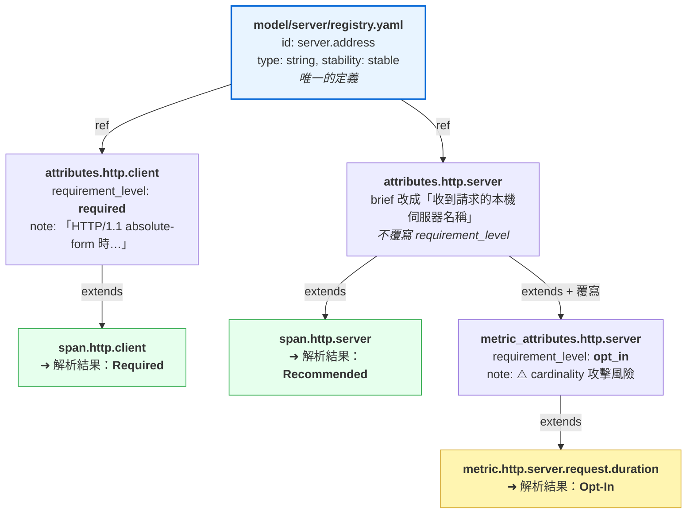
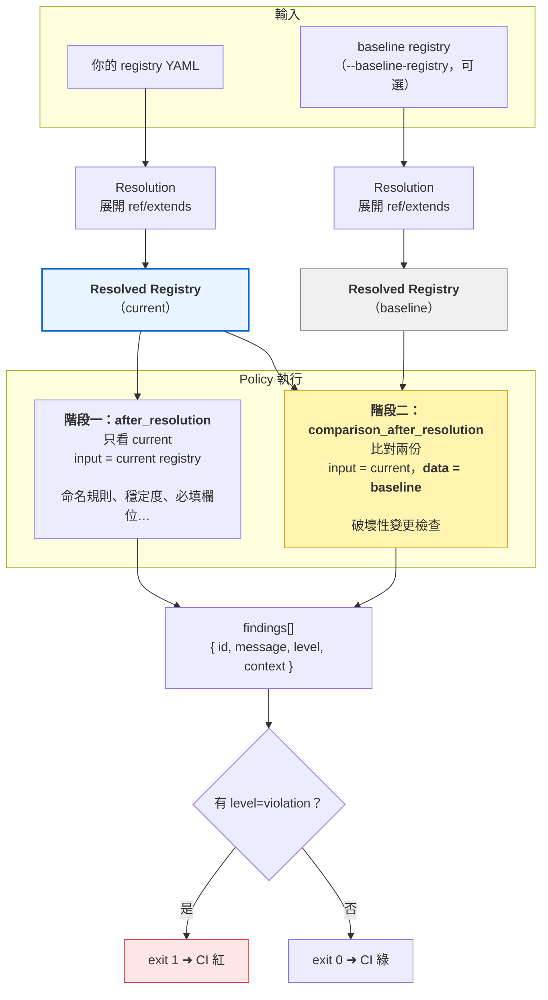
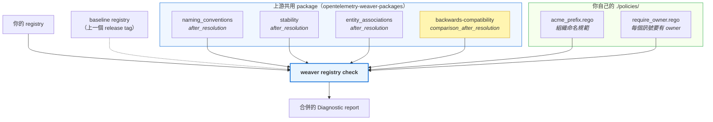
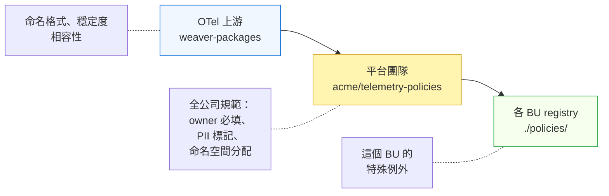

# OpenTelemetry Weaver 從零開始
## 用官方 semantic-conventions 當教材，一路走到自己的 registry 上線

> 這篇是給**完全沒碰過 Weaver** 的人寫的完整教學。
>
> 大部分 Weaver 教學（包括我以前寫的）都會自己捏一個玩具 registry。玩具的問題是：你學會了語法，但不知道真實世界長什麼樣、規模大了會遇到什麼、業界的慣例是什麼。
>
> 所以這次換個方式——**全程用 OpenTelemetry 官方的 [`semantic-conventions`](https://github.com/open-telemetry/semantic-conventions) 當教材**。它是全世界最大的 Weaver registry（984 個 group、1744 個 attribute），而且它的 CI 從頭到尾都是 Weaver 在把關。學它等於同時學會語法和業界做法。
>
> 後半段會用到 [`opentelemetry-weaver-packages`](https://github.com/open-telemetry/opentelemetry-weaver-packages)——官方在 2026 年 1 月成立的共享套件庫，把 policy 和 template 變成可以像 library 一樣引用的東西。
>
> **環境**：weaver `0.25.0`、semantic-conventions main（2026-07 當下，`1.44.0-unreleased`）、Linux。所有指令我都實跑過，輸出原樣貼上，包含失敗的那些。
>
> **你會學到**：registry 語法 → 驗證 → 自訂 policy → 產文件 → 相容性檢查 → 執行期驗證 → CI。最後你會有一個**依賴 semconv 上游、可以進 CI 的自訂 registry**。

---

## 目錄

- [Part 0 — Weaver 到底在解決什麼問題](#part-0--weaver-到底在解決什麼問題)
- [Part 1 — 安裝與指令地圖](#part-1--安裝與指令地圖)
- [Part 2 — Registry 是什麼：把 semconv 抓下來看](#part-2--registry-是什麼把-semconv-抓下來看)
- [Part 3 — 讀懂 YAML：五種訊號各看一個真實例子](#part-3--讀懂-yaml五種訊號各看一個真實例子)
- [Part 4 — v1 與 definition/2：官方正在遷移的新格式](#part-4--v1-與-definition2官方正在遷移的新格式)
- [Part 5 — check：你的第一道防線](#part-5--check你的第一道防線)
- [Part 6 — 從零蓋一個依賴 semconv 的 registry](#part-6--從零蓋一個依賴-semconv-的-registry)
- [Part 7 — 寫自己的 policy（Rego 從零開始）](#part-7--寫自己的-policyrego-從零開始)
- [Part 8 — 用官方的 policy package](#part-8--用官方的-policy-package)
- [Part 9 — 產文件與 MCP：generate、update-markdown、mcp](#part-9--產文件與-mcpgenerateupdate-markdownmcp)
- [Part 10 — 版本演進：diff、schemas、package](#part-10--版本演進diffschemaspackage)
- [Part 11 — 執行期驗證與反向工程：emit、live-check、infer](#part-11--執行期驗證與反向工程emitlive-checkinfer)
- [Part 12 — 組成 CI：抄官方的作業](#part-12--組成-ci抄官方的作業)
- [Part 13 — 常見坑總表與學習路徑](#part-13--常見坑總表與學習路徑)

---

## Part 0 — Weaver 到底在解決什麼問題

先講痛點，不然後面的東西你會覺得「為什麼要這麼麻煩」。

任何跑了一年以上的系統，telemetry 一定會長成這樣：

- A 服務叫 `http.status_code`，B 服務叫 `http_status`，C 服務叫 `statusCode`
- 有人記錄 `payment.duration` 單位是秒，另一個人是毫秒，dashboard 上兩條線疊在一起
- 某天有人把 metric 改名，三個月後才發現有五張 dashboard 和兩條 alert 早就靜靜壞掉
- 新人問「我們有哪些 metric？」，答案是「你去 Grafana 翻翻看」

這些問題的共同點是：**telemetry 的定義沒有一個「單一事實來源」，它散落在程式碼裡**。

Weaver 的主張是把它拉出來：**用 YAML 定義 telemetry schema，然後由這份 schema 去生成程式碼、生成文件、驗證資料、把關 CI。**

```text
             ┌─────────────────┐
             │  registry (YAML) │  ← 單一事實來源
             └────────┬─────────┘
                      │
    ┌─────────────┬───┴────┬──────────────┬─────────────┐
    ▼             ▼        ▼              ▼             ▼
 check         generate   diff        live-check     emit
（驗證定義）  （產碼/文件）（比對版本） （驗證真實資料）（產測試訊號）
```

OpenTelemetry 官方就是用這套工具在維護 semantic conventions——那些 `http.request.method`、`db.system.name`、`service.name` 的標準定義。所以學 Weaver 有兩個層次的收穫：**看得懂官方 semconv 怎麼運作**，以及**用同一套方法管好自己公司的 telemetry**。

---

## Part 1 — 安裝與指令地圖

### 1.1 安裝

單一 binary，沒有 runtime 依賴（Rust 寫的）：

```bash
URL=https://github.com/open-telemetry/weaver/releases/download/v0.25.0/weaver-x86_64-unknown-linux-musl.tar.xz
curl -sL -o weaver.tar.xz "$URL"

# 官方每個 asset 都附 .sha256，養成驗證的習慣
curl -sL -o weaver.tar.xz.sha256 "$URL.sha256"
sha256sum -c <(echo "$(cut -d' ' -f1 weaver.tar.xz.sha256)  weaver.tar.xz")

tar -xf weaver.tar.xz
install -m 755 weaver-x86_64-unknown-linux-musl/weaver ~/.local/bin/weaver
weaver --version
```

```text
weaver 0.25.0
```

Docker 也可以（官方 CI 用這個）：

```bash
docker run --rm -v "$PWD:/work" -w /work otel/weaver:v0.25.0 --version
```

> **macOS / Windows**：把 asset 名稱換成 `aarch64-apple-darwin` / `x86_64-pc-windows-msvc` 即可。或 `brew install weaver`（semconv repo 的 `Brewfile` 就是這樣裝的）。

### 1.2 指令地圖

```bash
weaver registry --help
```

```text
Commands:
  check            Validates a semantic convention registry.
  generate         Generates artifacts from a semantic convention registry.
  resolve          DEPRECATED - ...
  search           DEPRECATED - ...
  stats            Calculate a set of general statistics on a semantic convention registry
  update-markdown  Update markdown files that contain markers indicating the templates used
  json-schema      Generate the JSON Schema of the resolved registry documents
  diff             Generate a diff between two versions of a semantic convention registry.
  emit             Emits a semantic convention registry as example signals to your OTLP receiver.
  live-check       Perform a live check on sample telemetry by comparing it to a semantic convention registry.
  mcp              Run an MCP (Model Context Protocol) server for the semantic convention registry.
  infer            Generates a schema file by inferring the schema from a OTLP message.
  package          Packages a semantic convention registry into a self-contained artifact.
```

依「你什麼時候會用到」重新排一次。**下面每一個指令，本文都有實跑的例子**，最後一欄是它出現在哪一節：

| 階段 | 指令 | 做什麼 | 實例 |
| --- | --- | --- | --- |
| 認識 registry | `stats` | 統計摘要，第一次接觸陌生 registry 必跑 | [2.3](#23-stats第一次接觸陌生-registry-就跑這個) |
| 開發中 | `check` | 驗證語法 + 跑 policy，最常用的指令 | [Part 5](#part-5--check你的第一道防線)、[6.3](#63-跑起來)、[7.3](#73-跑起來--以及最重要的除錯技巧)、[8.2](#82-直接引用遠端-package) |
| 產出 | `generate` | 用模板產程式碼、文件、任何東西 | [Part 9](#part-9--產文件不寫模板也能有官網等級的文件) |
| 產出 | `update-markdown` | 更新既有 markdown 裡的表格區塊 | [9.2](#92-update-markdown在手寫文件裡插入生成的表格) |
| 給 AI 用 | `mcp` | 開一個 MCP server 讓 AI 查 schema | [9.3](#93-另一種消費-registry-的方式mcp給-ai-用) |
| 版本管理 | `diff` | 比對兩版之間的變化 | [10.1](#101-diff兩個版本之間發生了什麼) |
| 版本管理 | `package` | 打包成自包含發布件 | [10.3](#103-package打包發布) |
| 驗證真實資料 | `emit` | 依 schema 產生範例訊號 | [11.1](#111-跑一次) |
| 驗證真實資料 | `live-check` | 拿真的 telemetry 對 schema 檢查 | [11.1](#111-跑一次)、[11.2](#112-servicename-為什麼是-violation) |
| 反向工程 | `infer` | 從既有 OTLP 資料反推出 schema | [11.4](#114-infer反過來從既有流量產出-registry) |
| 輔助 | `json-schema` | 印出 policy / template 拿到的 input 結構 | [7.2](#72-怎麼知道-input-長什麼樣) |

> ⚠️ **`resolve` 和 `search` 已經 deprecated**。很多舊教學（含官方部落格）還在用 `weaver registry resolve`，0.25.0 已標記移除。要看 resolved 結果請改用 `generate` 或 `package`；要搜尋請改看生成的文件。

### 1.3 一個全域選項先講：`--future`

```text
--future    Enable the most recent validation rules for the semconv registry.
            It is recommended to enable this flag when checking a new registry.
```

Weaver 的驗證規則分三層：**永遠是錯**、**`--future` 才是錯**、**只是資訊**。新規則會先進第二層當警告，讓生態系有時間跟上，過一陣子才升級成硬錯誤。

**建議：新專案一開始就加 `--future`**，以免哪天升級 weaver 突然爆出一堆錯。舊專案可以先不加，之後再挑時間清。Part 5 會實際看到差別。

---

## Part 2 — Registry 是什麼：把 semconv 抓下來看

### 2.1 抓下來

```bash
git clone --depth 1 https://github.com/open-telemetry/semantic-conventions.git
cd semantic-conventions
```

registry 本體在 `model/`：

```bash
ls model/
```

```text
android      app        artifact   aspnetcore  aws        azure      browser
cassandra    cicd       cli        client      cloud      cloudevents
cloudfoundry code       container  cpu         cpython    db         deployment
destination  device     disk       dns         dotnet     elasticsearch
enduser      error      event      exceptions  faas       feature-flags
file         gcp        gen-ai     geo         go         graphql    hardware
heroku       host       http       ios         jsonrpc    jvm        k8s
kestrel      linux      log        mainframe   mcp        messaging  network
nfs          nodejs     oci        onc_rpc     openai     openshift  opentracing
oracle-cloud oracledb   os         otel        peer       pprof      process
profile      rpc        security-rule server    service    session   signalr
source       system     telemetry  test        thread     tls        url
user         user-agent v8js       vcs         webengine  zos
manifest.yaml   version.properties   README.md
```

**76 個 area 目錄**，每個是一個主題領域——`http`、`db`、`jvm`、`k8s`、`messaging`、`gen-ai` 這些你每天在 dashboard 上看到的東西，原始定義都在這裡。

隨便挑一個進去看：

```bash
ls model/http/ model/db/
```

```text
model/http:
common.yaml  deprecated  events.yaml  metrics.yaml  registry.yaml  spans.yaml

model/db:
common.yaml  deprecated  events.yaml  metrics.yaml  registry.yaml  spans.yaml
```

**檔名本身就是一套慣例，直接抄**：

| 檔案 | 放什麼 |
| --- | --- |
| `registry.yaml` | 屬性定義（這個 area 的「字典」） |
| `spans.yaml` / `metrics.yaml` / `events.yaml` | 各類訊號的定義 |
| `common.yaml` | 這個 area 內部共用的 attribute group |
| `deprecated/` | **退役的定義**，跟活的分開放（Part 10 細講） |

這個組織方式本身就是第一課：**registry 大了要按領域切目錄、按訊號類型切檔案，不要一個大檔案**。而且退役的東西不要刪，另外放。

### 2.2 `manifest.yaml`：registry 的身分證

每個 registry 根目錄都要有它：

```yaml
schema_url: https://opentelemetry.io/schemas/1.44.0-unreleased
description: Registry of core semantic conventions for OpenTelemetry.
stability: development
```

三個欄位：

- **`schema_url`** — 這份 registry 的版本識別。**注意這裡的 "schema" 不是指 registry 的 YAML 檔**，下面專門解釋。版本是 `1.44.0-unreleased`，官方在開發中就用 `-unreleased` 標記。
- **`description`** — 給人看的。
- **`stability`** — 整份 registry 的穩定度。

後面 Part 6 我們自己蓋 registry 時，manifest 還會多一個關鍵欄位 `dependencies`。

### 2.2.1 等一下，`schema_url` 裡的「schema」到底是什麼？

這是初學最容易混淆的一個點，值得單獨講清楚。**OTel 生態裡「schema」這個字被用在兩個不同的東西上**：

| | 「registry」 | 「telemetry schema」 |
| --- | --- | --- |
| 是什麼 | `model/**/*.yaml`，定義了有哪些屬性、訊號、型別 | 一個檔案，記錄**版本之間的變更**（主要是改名） |
| 在 repo 的哪 | `model/` | `schemas/1.4.0` … `schemas/1.43.0` |
| 誰吃它 | Weaver（產文件、產程式碼、驗證） | Collector 的 `schemaprocessor`、後端查詢時做翻譯 |
| 本文哪裡講 | Part 2–9（幾乎整篇） | [Part 10.2](#102-schemas跑五年之後的樣子) |

**`manifest.yaml` 裡的 `schema_url` 指向的是後者。**

而且它不是一個抽象的識別字串，**它是一個真的可以打開的網址**。試試看：

```bash
curl -sL https://opentelemetry.io/schemas/1.43.0
```

```yaml
file_format: 1.1.0
schema_url: https://opentelemetry.io/schemas/1.43.0
versions:
  1.43.0:
  1.42.0:
    metrics:
      changes:
        - rename_metrics:
            v8js.memory.heap.limit: v8js.memory.heap.space.size
  1.41.1:
  1.41.0:
    metrics:
      changes:
        - rename_metrics:
            k8s.container.cpu.limit: k8s.container.cpu.limit.desired
            ...
```

回傳的內容跟 repo 裡的 `schemas/1.43.0` 一模一樣。**這就是「telemetry schema」——一份改名歷史表**，不是屬性定義。

### 2.2.2 這個 URL 最後會出現在哪？

答案是 **OTLP 封包裡的一個專屬欄位**。看 OTLP 的 proto 定義（`trace.proto`）：

```protobuf
message ResourceSpans {
  Resource resource = 1;
  repeated ScopeSpans scope_spans = 2;

  // The Schema URL, if known. This is the identifier of the Schema that the resource data
  // is recorded in. Notably, the last part of the URL path is the version number of the
  // schema: http[s]://server[:port]/path/<version>.
  string schema_url = 3;
}
```

> 注意它是 `ResourceSpans` 和 `ScopeSpans` 上的**獨立欄位**，不是 resource 裡的一個 attribute。（我原本以為是 attribute，看 proto 才發現不是。）

所以整條鏈是這樣：

```text
你的 registry manifest.yaml
  schema_url: https://acme.example.com/schemas/0.1.0
                    │
                    │ SDK / codegen 把這個字串帶進去
                    ▼
          OTLP 封包 ResourceSpans.schema_url = "https://acme.example.com/schemas/0.1.0"
                    │
                    │ 下游收到後：「這批資料是 0.1.0 版命名的」
                    ▼
      collector schemaprocessor 去 GET 那個 URL，
      拿到改名歷史表，把舊命名自動翻譯成新命名
```

**價值在哪？**假設你在 0.2.0 把 `acme.checkout.step` 改名成 `acme.checkout.stage`。舊版服務還沒重新部署，仍在送 `acme.checkout.step`，但它的封包上標著 `schema_url = .../0.1.0`。collector 一看就知道要套用 0.1.0 → 0.2.0 的改名規則，**自動幫你轉成新名字**。你的 dashboard 只需要認得新名字。

沒有這個機制，改名就等於「舊資料全部斷掉」——這也是為什麼大家不敢改名，然後 telemetry 命名就爛在那裡十年。

**現階段的實務提醒**：`schemaprocessor` 還在發展中，不是每個後端都支援。但**把 `schema_url` 填對、把 `schemas/` 檔案維護好**幾乎沒有成本，而且是未來能用上這套機制的前提。[Part 10.2](#102-schemas跑五年之後的樣子) 會看這些檔案長什麼樣、怎麼維護。

還有一個小細節值得學：semconv 的 `-unreleased` 後綴不是手動打的。看 `RELEASING.md`——

> Publishing a release triggers the post-release workflow, which opens a pull request against main bumping the development `schema_url` in `model/manifest.yaml` to the `{major}.{minor+1}.0-unreleased` version.

**發完 1.43.0，機器人自動開 PR 把 main 的 `schema_url` 改成 `1.44.0-unreleased`。**開發中的 main 永遠標著一個「還沒發布的下一版」，這樣從 main 產出的 telemetry 不會冒充成已發布版本。這個習慣值得抄。

### 2.3 `stats`：第一次接觸陌生 registry 就跑這個

```bash
weaver registry stats -r model
```

```text
Resolved Telemetry Schema Stats:
Registry
  - 984 groups
    - 216 AttributeGroups
      - Total number of attributes: 1424
      - Total number of deprecated groups: 18 (8%)
    - 64 Entitys
      - Total number of attributes: 224
      - Stability breakdown (100%):
        - development: 54
        - release_candidate: 5
        - stable: 5
    - 32 Events
      - Total number of attributes: 131
      - Total number of deprecated groups: 10 (31%)
    - 559 Metrics
      - Total number of attributes: 1256
      - Stability breakdown (100%):
        - development: 466
        - release_candidate: 42
        - stable: 51
      - Distinct number of metric names: 538
      - Instrument breakdown:
        - counter: 132
        - gauge: 70
        - histogram: 67
  ...
    - Requirement levels breakdown:
      - conditionally_required: 217
      - opt_in: 127
      - recommended: 1134
      - required: 242
    - Stability breakdown (100%):
      - alpha: 2
      - development: 1132
      - release_candidate: 192
      - stable: 394
    - Total number of deprecated attributes: 276 (16%)

Total execution time: 0.345012828s
```

不到 0.4 秒就把上千個定義解析完，順便告訴你這份 registry 的全貌。幾個值得讀出來的訊號：

- **1744 個 attribute 裡只有 394 個是 `stable`**（23%）。semconv 大部分還在 development——這也是為什麼 OTel 常說「semconv 還在演進中」。
- **276 個 attribute 已經 deprecated**（16%）。這不是壞事，是**演進機制在運作**的證據：舊定義不刪除、標記 deprecated 保留、下游有時間遷移。
- **`recommended` 佔了 1134 個**（65%）。semconv 的預設立場是「建議」而非「強制」，`required` 只有 242 個。

我自己接手任何陌生 registry 的第一個動作就是這個。它花你 5 秒，省下半小時翻檔案。

---

## Part 3 — 讀懂 YAML：五種訊號各看一個真實例子

Weaver registry 的基本單位叫 **group**，每個 group 有個 `type`。五種：`attribute_group`、`span`、`metric`、`event`、`entity`。

這一節全部用**你每天都在看的東西**當例子——HTTP、JVM、資料庫、Kubernetes、feature flag。這些欄位你在 Grafana 或 Jaeger 上一定看過，現在來看它們的「原始定義」長什麼樣。以下每段都是 semconv 裡的**真實檔案內容**，不是我編的。

### 3.1 `attribute_group`：定義屬性 — 用 `http.request.method` 開場

`model/http/registry.yaml` 節錄。這個檔案定義了所有 `http.*` 屬性，也就是你在 trace 上看到的那些欄位：

```yaml
groups:
  - id: registry.http
    type: attribute_group
    display_name: HTTP Attributes
    brief: 'This document defines semantic convention attributes in the HTTP namespace.'
    attributes:
      - id: http.request.body.size
        type: int
        brief: >
          The size of the request payload body in bytes. This is the number of bytes transferred
          excluding headers and is often, but not always, present as the
          [Content-Length](https://www.rfc-editor.org/rfc/rfc9110.html#field.content-length) header.
        examples: 3495
        stability: development  # this should not be marked stable with other HTTP attributes

      - id: http.request.method
        stability: stable
        type:
          members:
            - id: connect
              value: "CONNECT"
              brief: 'CONNECT method.'
              stability: stable
            - id: get
              value: "GET"
              brief: 'GET method.'
              stability: stable
            - id: post
              value: "POST"
              brief: 'POST method.'
              stability: stable
            # …（省略 DELETE / HEAD / OPTIONS / PATCH / PUT / TRACE）
            - id: query
              value: "QUERY"
              brief: 'QUERY method.'
              stability: development
            - id: other
              value: "_OTHER"
              brief: 'Any HTTP method that the instrumentation has no prior knowledge of.'
              stability: stable
        brief: 'HTTP request method.'
        examples: ["GET", "POST", "HEAD"]
```

逐欄拆：

| 欄位 | 意義 | 注意事項 |
| --- | --- | --- |
| `id`（group 的） | group 識別碼 | semconv 慣例：**定義屬性的 group 一律用 `registry.` 開頭** |
| `type: attribute_group` | 這個 group 只定義屬性，不是訊號 | |
| `display_name` | 產文件時的標題 | 沒設就用 id 推導 |
| `attributes[].id` | 屬性的完整名稱 | 用 `.` 分層，全小寫 snake_case |
| `type`（屬性的） | 值的型別 | `string` / `int` / `double` / `boolean` / `string[]` / enum / `template[…]` |
| `stability` | 穩定度 | `development` < `alpha` < `beta` < `release_candidate` < `stable` |
| `brief` | 一句話說明 | 產文件用；**官方規範要求以句號結尾**（Part 8 會踩到這個坑） |
| `note` | 補充說明 | 支援 markdown |
| `examples` | 範例值 | **強烈建議填**，`emit` 和文件都會用到 |

`http.request.method` 這個 enum 有三個細節值得學：

**1. `id` 和 `value` 是不同的東西。**`id: get` 是產程式碼時的常數名（會變成 `HttpRequestMethod.GET` 之類），`value: "GET"` 才是實際寫進 telemetry 的字串。所以 `id` 要能當識別字（小寫 snake_case），`value` 則照實際協定寫。

**2. 每個 member 有自己的 `stability`。**整個 `http.request.method` 是 `stable`，但 `QUERY` 這個 member 是 `development`——因為 QUERY 是還在 draft 的新 HTTP method。**穩定度是 member 層級的**，這讓你可以在不破壞既有承諾的前提下加新選項。

**3. `_OTHER` 這個逃生口。**enum 在 telemetry 裡最大的風險是「遇到沒列舉到的值怎麼辦」——如果放任原始值進來，某個惡意 client 送奇怪的 method 就能炸掉你的 metric cardinality。semconv 的解法是留一個 `_OTHER`，不認得的一律歸進去。**你自己定義 enum 屬性時也該想這件事。**

### 3.1.1 順便講 `template[…]`：一種很好用但少見的型別

同一個檔案裡的 `http.request.header`：

```yaml
      - id: http.request.header
        stability: stable
        type: template[string[]]
        brief: >
          HTTP request headers, `<key>` being the normalized HTTP Header name (lowercase),
          the value being the header values.
        note: |
          Instrumentations SHOULD require an explicit configuration of which headers are to be captured.
          Including all request headers can be a security risk - explicit configuration helps avoid
          leaking sensitive information.

          Examples:

          - A header `Content-Type: application/json` SHOULD be recorded as the
            `http.request.header.content-type` attribute with value `["application/json"]`.
          - A header `X-Forwarded-For: 1.2.3.4, 1.2.3.5` SHOULD be recorded as the
            `http.request.header.x-forwarded-for` attribute with value `["1.2.3.4", "1.2.3.5"]`.
        examples: [["application/json"], ["1.2.3.4", "1.2.3.5"]]
```

`template[string[]]` 的意思是：**這不是一個屬性，是一整族屬性**。實際的 key 是 `http.request.header.<任意名稱>`，值的型別是 `string[]`。

什麼時候用它？**當 key 的一部分是動態的**——HTTP header 名、環境變數名、K8s label 名、自訂 tag 名。你不可能把所有 header 都列舉出來，但你想宣告「這一族 key 的命名規則和值型別」。

semconv 用了 74 個 template 屬性（`template[string]` 61 個、`template[string[]]` 13 個）。`k8s.pod.label`、`db.operation.parameter`、`process.environment_variable` 都是。

順帶一提這個 `note` 值得整段讀——它在講**安全**：預設不要抓所有 header，因為會洩漏 `Authorization` 之類的東西。**registry 不只是欄位清單，它也是規範文件**，這種「該怎麼用、不該怎麼用」的知識寫在這裡才不會流失。

> **`>` 和 `|` 的差別**：`>` 是折疊換行（多行變一行），`brief` 用它；`|` 保留換行，寫多段落 `note` 用它。這是 YAML 語法不是 Weaver 的，但初學常搞混。

### 3.1.2 `registry.` 前綴的慣例

semconv 的 `CONTRIBUTING.md` 明講：

> Attributes can only be defined inside groups with `attribute_group` type and with `id` starting with `registry.` prefix.

**定義（define）和使用（reference）要分開。**`registry.*` 的 group 是「屬性字典」，其他 group 只能 `ref` 過去用，不能重新定義。這樣同一個屬性的定義永遠只有一份——`http.request.method` 不管被 HTTP span、HTTP metric、還是別人家的 registry 引用幾次，型別和 enum 清單都只有 `registry.http` 這一處。

### 3.2 `span`：定義 trace — 用 `http.client` / `http.server`

`model/http/spans.yaml` 節錄。這就是你在 Jaeger 上看到的 HTTP span 的定義來源：

```yaml
groups:
  - id: span.http.client
    type: span
    extends: attributes.http.client
    span_kind: client
    stability: stable
    brief: >
      This span represents an outbound HTTP request.
    note: |
      **Span name:** refer to the [Span Name](/docs/http/http-spans.md#name) section.

      **Span kind** MUST be `CLIENT`.
    attributes:
      - ref: http.request.method
        sampling_relevant: true
      - ref: http.request.method_original
        requirement_level:
          conditionally_required: If and only if it's different than `http.request.method`.
      - ref: http.request.resend_count
        requirement_level:
          recommended: if and only if request was retried.
      - ref: http.request.header
        requirement_level: opt_in
      - ref: server.address
        sampling_relevant: true
      - ref: server.port
        sampling_relevant: true
      - ref: url.full
        sampling_relevant: true
        requirement_level: required
      - ref: user_agent.original
        requirement_level: opt_in
      - ref: network.peer.port
        requirement_level:
          recommended: If `network.peer.address` is set.

  - id: span.http.server
    type: span
    extends: attributes.http.server
    span_kind: server
    stability: stable
    brief: >
      This span represents an inbound HTTP request.
    attributes:
      - ref: http.request.method
        sampling_relevant: true
      - ref: http.route
      - ref: server.address
        sampling_relevant: true
      # …
```

這段把幾乎所有核心概念都用上了。

**`ref` vs `id`。**`id:` 是「我定義一個新屬性」，`ref:` 是「我引用一個已定義的屬性」。注意 `server.address`、`url.full`、`user_agent.original`、`network.peer.port` 這幾個——**它們不是 HTTP 專屬的**，分別定義在 `model/server/`、`model/url/`、`model/user-agent/`、`model/network/`。HTTP span 只是引用。

這就是好的 registry 設計：**通用概念抽到自己的 namespace，各協定去 `ref`**。所以 `server.address` 在 HTTP span、gRPC span、DB span 上是同一個屬性，你的查詢可以跨協定用。

**`ref` 時你只能覆寫使用面的欄位**（`requirement_level`、`note`、`examples`、`brief`、`sampling_relevant`），不能改型別或穩定度——型別是定義者的事。

**`requirement_level` 的四種寫法**（這段全部出現在上面）：

| 寫法 | 意思 |
| --- | --- |
| `required` | 一定要有（`url.full`） |
| `recommended` | 建議有（預設值，寫不寫都一樣） |
| `opt_in` | **預設不收**，使用者主動開啟（`http.request.header`、`user_agent.original`） |
| `conditionally_required: <條件>` | 條件式必填（`http.request.method_original`） |
| `recommended: <條件>` | 條件式建議（`http.request.resend_count`） |

後兩種的條件是**寫給人看的自然語言**，Weaver 不驗證它。價值在於進到生成的文件裡，讓實作者知道什麼時候該帶。

`opt_in` 特別值得注意——`http.request.header` 和 `user_agent.original` 都是 opt_in，原因就是 3.1.1 那個 note 講的：**預設抓會有安全和 cardinality 風險**。requirement_level 不只是「重不重要」，它也是**安全預設值**的表達方式。

**`sampling_relevant: true`** 是個很多人沒注意到的欄位。它標記「這個屬性在**採樣決策**時要看得到」。做 tail-based sampling 或 head sampling 時，你需要在 span 剛開始（還沒結束）就拿到某些屬性來決定要不要採樣——`http.request.method`、`server.address`、`url.full` 就是這種。**它是給 sampler 實作者的提示。**

**`extends`。**繼承另一個 group 的所有屬性。`span.http.client` 和 `span.http.server` 各自 extends 不同的 attribute group（client 版和 server 版），再各自補上專屬的。這是 registry 裡最有效的去重手段——**看到兩個 group 屬性列表有一半重複，就該抽出來 `extends`**。

### 3.3 `metric`：定義指標 — 用 `jvm.memory.used` 和 `http.server.request.duration`

先看最單純的，`model/jvm/metrics.yaml`：

```yaml
groups:
  - id: attributes.jvm.memory
    type: attribute_group
    brief: "Describes JVM memory metric attributes."
    attributes:
      - ref: jvm.memory.type
        requirement_level: recommended
      - ref: jvm.memory.pool.name
        requirement_level: recommended
        brief: Name of the memory pool.

  - id: metric.jvm.memory.used
    type: metric
    metric_name: jvm.memory.used
    annotations:
      code_generation:
        metric_value_type: int
    extends: attributes.jvm.memory
    brief: "Measure of memory used."
    instrument: updowncounter
    unit: "By"
    stability: stable

  - id: metric.jvm.memory.committed
    type: metric
    metric_name: jvm.memory.committed
    annotations:
      code_generation:
        metric_value_type: int
    extends: attributes.jvm.memory
    brief: "Measure of memory committed."
    instrument: updowncounter
    unit: "By"
    stability: stable
```

metric 專屬欄位：

| 欄位 | 說明 |
| --- | --- |
| `metric_name` | 實際的 metric 名稱（`id` 是 group 識別碼，兩者不同） |
| `instrument` | `counter` / `updowncounter` / `gauge` / `histogram` |
| `unit` | **UCUM 格式**，非常重要，見下 |
| `annotations` | 給下游工具的提示，Weaver 本身不解讀 |

**`instrument` 選 `updowncounter` 而不是 `gauge`**，這個選擇值得停一下。兩者在 Prometheus 眼裡都是 gauge，但語意不同：

- `updowncounter` — 值是**加減累積**出來的（配了 10MB、又配 5MB、釋放 3MB）
- `gauge` — 值是**當下量測**的快照（現在 CPU 溫度 55 度）

JVM 記憶體是前者，所以用 updowncounter。這個區別在 delta/cumulative 轉換和聚合時會有差。

**`unit` 的 UCUM 慣例**是初學最容易寫錯的地方：

- 有標準單位就用標準符號：`s`（秒）、`By`（**byte，不是 `bytes` 也不是 `B`**）、`ms`、`%`
- **沒有標準單位的「計數」用大括號**：`{request}`、`{error}`、`{connection}`
- 無因次比例用 `1`

大括號的意思是「這是註解，不是真的單位」。寫 `unit: "requests"` 會被下游工具當成一個叫 requests 的單位；寫 `{request}` 才對。semconv 的 559 個 metric 全部照這個規則。

> **`s` 而不是 `ms`**：注意 `http.server.request.duration` 和 `db.client.operation.duration` 用的都是 `s`（秒）。OTel 的慣例是**時間一律用秒**，交給後端去顯示成 ms。我踩過的坑是「YAML 寫 seconds、程式碼記錄 milliseconds」，histogram bucket 邊界對不上，`histogram_quantile` 算出來是常數。單位這件事一定要 registry 和實作對齊。

再看一個有 `extends` 鏈的，`model/http/metrics.yaml`：

```yaml
  - id: metric_attributes.http.server
    type: attribute_group
    brief: 'HTTP server attributes'
    extends: attributes.http.server
    attributes:
      - ref: server.address
        requirement_level: opt_in
        note: |
          > [!WARNING]
          > Since this attribute is based on HTTP headers, opting in to it may allow an attacker
          > to trigger cardinality limits, degrading the usefulness of the metric.
      - ref: user_agent.synthetic.type
        requirement_level: opt_in

  - id: metric.http.server.request.duration
    type: metric
    metric_name: http.server.request.duration
    annotations:
      code_generation:
        metric_value_type: double
    brief: "Duration of HTTP server requests."
    instrument: histogram
    unit: "s"
    stability: stable
    extends: metric_attributes.http.server
```

這裡有兩件事很重要：

**1. metric 和 span 用的屬性集合不一樣。**`span.http.server` 直接 extends `attributes.http.server`，但 metric 是 extends 一個**中間層** `metric_attributes.http.server`，這一層把 `server.address` 從預設值改成 `opt_in`。

為什麼？看那個 WARNING：**metric 的每個屬性都是一個維度，維度值太多就是 cardinality 爆炸**。span 帶 `server.address` 沒問題（一條 trace 就一個值），metric 帶它可能就多出幾萬條時間序列。**同一個屬性在不同訊號上的要求可以不同**——這是 registry 設計上很實務的一課。

**2. `annotations` 是給生態系的擴充點。**`code_generation.metric_value_type: double` 是在告訴 codegen「這個 histogram 請產 double 型別的 API」（`jvm.memory.used` 則是 `int`）。Weaver 核心不解讀 annotations 內容，是各家工具自己約定 key。Part 8 會看到 policy 也用 annotations 來做例外機制。

### 3.4 `event`：定義結構化事件 — 用 `feature_flag.evaluation`

`model/feature-flags/events.yaml`：

```yaml
groups:
  - id: event.feature_flag.evaluation
    type: event
    name: feature_flag.evaluation
    stability: release_candidate
    brief: >
      Defines feature flag evaluation as an event.
    note: >
      A `feature_flag.evaluation` event SHOULD be emitted whenever a feature flag value
      is evaluated, which may happen many times over the course of an application lifecycle.
      A `feature_flag.evaluation` event is emitted on each evaluation even if the result is the same.
    attributes:
      - ref: feature_flag.key
        requirement_level: required
      - ref: feature_flag.result.variant
        requirement_level:
          conditionally_required: If feature flag provider supplies a variant or equivalent concept.
      - ref: feature_flag.result.value
        requirement_level:
          conditionally_required: >
              If and only if feature flag provider does not supply variant or equivalent concept.
              Otherwise, `feature_flag.result.value` should be treated as opt-in.
      - ref: feature_flag.provider.name
        requirement_level: recommended
      - ref: error.type
        examples: ["provider_not_ready", "targeting_key_missing", "provider_fatal", "general"]
        requirement_level:
          conditionally_required: If and only if an error occurred during flag evaluation.
```

event 用 `name:`（不是 `metric_name`），對應到 OTel log record 上的 `event.name`。

**event 是「有 schema 的 log」**——這是它跟一般 log 最大的差別。你不是印一行字串，而是送一筆有固定欄位的結構化紀錄。上面這個定義就明確說了：key 必填、variant 和 value 二擇一、出錯時要帶 `error.type`。

注意 `error.type` 是 `ref` 過來的通用屬性（定義在 `model/error/`），但這裡用 `examples:` 覆寫成 feature flag 情境的值。**`ref` 時覆寫 `examples` 是很常見也很值得學的手法**——同一個屬性在不同情境下的典型值不一樣，文件才會好讀。

### 3.5 `entity`：定義實體 — 用 `k8s.pod`

`model/k8s/entities.yaml`：

```yaml
  - id: entity.k8s.pod
    type: entity
    stability: development
    name: k8s.pod
    brief: >
      A Kubernetes Pod object.
    attributes:
      - ref: k8s.pod.uid
        role: identifying
      - ref: k8s.pod.name
        role: descriptive
      - ref: k8s.pod.label
        role: descriptive
        requirement_level: opt_in
      - ref: k8s.pod.annotation
        role: descriptive
        requirement_level: opt_in
      - ref: k8s.pod.ip
        role: descriptive
        requirement_level: opt_in
      - ref: k8s.pod.hostname
        role: descriptive
        requirement_level: opt_in
```

**`role` 是 entity 的靈魂**，也是初學最容易忽略的欄位。K8s Pod 這個例子完美說明了為什麼：

- **`role: identifying`** — 參與「身分」判定。這裡是 **`k8s.pod.uid`**。
- **`role: descriptive`** — 只是描述，不影響身分。這裡是 `k8s.pod.name`、`ip`、`hostname`。

**為什麼身分是 uid 而不是 name？**因為 Deployment 滾動更新時，新 Pod 可能有相同的 name 前綴、甚至重用同一個 IP，但 **uid 一定不同**——它們是不同的 Pod。反過來 Pod 的 IP 會變、label 會被改，但只要 uid 一樣就還是同一個 Pod。

**如果你把 `k8s.pod.name` 標成 identifying，你的 o11y 後端會把兩個世代的 Pod 當成同一個**——資源使用曲線會接在一起，重啟事件會消失，事故當下你會看不到「Pod 被重建了」這個關鍵訊號。

**注意 `requirement_level: required` 和 `role: identifying` 是兩件事。**前者說「一定要有值」，後者說「這是身分的一部分」。我自己第一次寫 entity 就只寫了 `required`，結果上游 policy 直接告訴我「stable entity 沒有 identifying attribute」——因為下游要做 entity 去重、關聯、topology 建構，全靠 identity。

順帶看一下 `model/service/entities.yaml` 裡的 `entity.service`，它多了一個東西：

```yaml
  - id: entity.service
    type: entity
    name: service
    annotations:
      stability:
        # TODO https://github.com/open-telemetry/semantic-conventions/issues/1519
        policy_exceptions:
          - entity_lower_stability_attribute
    stability: stable
    attributes:
      - ref: service.name
        requirement_level: required
        role: identifying
      - ref: service.version
        role: descriptive
```

`annotations.stability.policy_exceptions` 是**官方自己在對 policy 開例外**，還留了 TODO 連到 issue。這正是好的例外用法：**在定義旁邊、有理由、有追蹤**。Part 8 細講。

### 3.6 把 `ref` / `extends` 一次講清楚：解析鏈與覆寫規則

前面各節都出現了 `ref` 和 `extends`，但它們合起來是 Weaver 最核心也最容易搞混的機制。這一節專門拆解。

#### 三個動詞

| 語法 | 意思 | 白話 |
| --- | --- | --- |
| `- id: xxx` | **定義**一個屬性 | 「我發明這個欄位，型別是這個」 |
| `- ref: xxx` | **引用**一個已定義的屬性 | 「我要用那個欄位，但在我這個情境下它是必填」 |
| `extends: <group>` | **繼承**整個 group 的屬性清單 | 「把那組全部拿過來，我再加減」 |

`ref` 和 `extends` 的差別是**顆粒度**：`ref` 一次一個屬性，`extends` 一次一整組。

#### 為什麼要分這麼細？

因為**同一個屬性，在不同訊號上的要求是不一樣的**。

`server.address` 是最好的例子。它定義在 `model/server/`，只有一份定義（型別 `string`、stability `stable`）。但它出現在三個地方，三種要求：



**這不是我推論的，是可以驗證的。**semconv 的 `docs/` 就是從這些 YAML 生成的，直接去 grep 生成結果：

```bash
grep "server.address\`\]" docs/http/http-spans.md docs/http/http-metrics.md
```

```text
docs/http/http-spans.md:155:   | [`server.address`](...) | ![Stable] | `Required`    | string | Server domain name if available without reverse DNS lookup... |
docs/http/http-spans.md:485:   | [`server.address`](...) | ![Stable] | `Recommended` | string | Name of the local HTTP server that received the request. |
docs/http/http-metrics.md:88:  | [`server.address`](...) | ![Stable] | `Opt-In`      | string | Name of the local HTTP server that received the request. |
```

**同一個屬性、一份定義、三種 requirement level、兩種 brief。**155 行是 client span、485 行是 server span、metrics 那份是 metric。完全對應上面那張圖。

而且注意 brief 也跟著鏈條走：client span 用的是**原始定義**的 brief（"Server domain name if available…"），server span 和 metric 用的是 `attributes.http.server` 覆寫過的（"Name of the local HTTP server that received the request."）——因為 metric 那條鏈是從 `attributes.http.server` 延伸下來的。

#### 覆寫規則：哪些能改、哪些不能

這是最實用的一張表。`ref` 的時候：

| 欄位 | 能否覆寫 | 為什麼 |
| --- | --- | --- |
| `requirement_level` | ✅ | 「要不要帶」是使用情境決定的 |
| `brief` | ✅ | 同一個欄位在不同情境的說法可以不同 |
| `note` | ✅ | 情境專屬的注意事項 |
| `examples` | ✅ | 不同情境的典型值不一樣（回想 3.4 的 `error.type`） |
| `sampling_relevant` | ✅ | 採樣需求是 span 層級的事 |
| `role`（entity 用） | ✅ | 身分語意是 entity 層級的事 |
| `type` | ❌ | 型別是定義者的契約，改了就是另一個屬性 |
| `stability` | ❌ | 穩定度是對外的承諾，不能在使用端偷改 |
| `deprecated` | ❌ | 同上 |

一句話記法：**「這個欄位是什麼」不能改，「我這裡要怎麼用它」可以改。**

#### 完整的解析流程

`weaver registry check` / `generate` 底下發生的事：

```mermaid
flowchart LR
    subgraph SRC["① 原始 YAML"]
        Y1["model/server/registry.yaml<br/>（定義 server.address）"]
        Y2["model/http/common.yaml<br/>（ref + extends）"]
        Y3["model/http/spans.yaml<br/>（extends）"]
        Y4["自己的 registry<br/>（ref 上游）"]
    end

    subgraph DEP["② 依賴解析"]
        D1["manifest.yaml 的 dependencies<br/>把上游 registry 抓下來<br/>（~/.weaver/vdir_cache/）"]
    end

    subgraph RES["③ Resolution"]
        R1["展開所有 ref / extends / ref_group"]
        R2["套用覆寫（後面的贏）"]
        R3["驗證：每個 ref 都要指得到<br/><i>← 打錯字在這裡被抓</i>"]
    end

    RQ["<b>Resolved Registry</b><br/>攤平、去重、每個訊號都帶著<br/>完整的 attribute 清單"]

    subgraph OUT["④ 消費端"]
        O1["Rego policy<br/>（input.registry.*）"]
        O2["Jinja template<br/>（產文件 / 程式碼）"]
        O3["live-check<br/>（比對真實資料）"]
    end

    SRC --> DEP --> RES --> RQ --> OUT

    style RQ fill:#e8f4ff,stroke:#0366d6,stroke-width:2px
    style R3 fill:#ffe6e6,stroke:#d73a49
```



三個關鍵理解：

1. **policy 和 template 看到的都是「resolved registry」，不是你寫的 YAML。**所以 rego 裡沒有 `extends` 這種東西——到那一步已經全部攤平了。這解釋了 Part 7 為什麼要用 `attr.provenance.path` 才能分辨「這是我定義的還是上游的」。

2. **`ref` 打錯字在第 ③ 步被抓**，這就是 Part 6.4 那個 `http.response.status_kode` 的錯誤來源。

3. **`--include-unreferenced` 影響的是第 ③ 步的產物**：預設只把「被 ref 到的」上游定義放進 resolved registry，加了旗標才全部帶進來。這解釋了 Part 11.2 為什麼 `service.name` 會被說「不存在」。

#### 一個實用的心法

看到重複就往上抽，抽到「只有一份定義」為止：

```text
❌ 三個 span 各自寫一遍 http.request.method、server.address、url.scheme
✅ 抽成 attributes.http.common，三個 span 都 extends 它

❌ metric 和 span 共用同一組屬性，但 metric 想把 server.address 降成 opt_in
   → 只好複製一份屬性清單
✅ 中間插一層 metric_attributes.http.server，extends 原本那組 + 覆寫那一個屬性
```

第二種模式（**中間層只為了覆寫一兩個欄位**）在 semconv 裡到處都是，是很值得學的手法。

### 3.7 五種訊號速查

| type | 關鍵欄位 | 對應到 | 本節例子 |
| --- | --- | --- | --- |
| `attribute_group` | `attributes[].id` | 屬性字典，不產生訊號 | `registry.http` |
| `span` | `span_kind`, `extends`, `sampling_relevant` | Trace 的 span | `span.http.client` |
| `metric` | `metric_name`, `instrument`, `unit` | Metric | `jvm.memory.used` |
| `event` | `name` | 結構化 Log / Event | `feature_flag.evaluation` |
| `entity` | `name`, `role` | Resource / 實體 | `k8s.pod` |

**練習**：打開 `model/db/` 看一遍。它把上面所有概念用了一次——`db.system.name` 的 enum、`db.query.text` 的安全 note、`db.client.operation.duration` 的 histogram、`db.operation.parameter` 的 template 型別。看得懂它，這一節就過關了。

---

## Part 4 — v1 與 definition/2：官方正在遷移的新格式

這件事沒有教學會講，但你一打開 semconv 就會撞到，所以一定要先知道。

semconv 的 250 個 YAML 檔裡，有 **24 個**開頭長這樣：

```bash
grep -rl "file_format: definition/2" model/ | wc -l   # → 24
head -3 model/messaging/kafka.yaml
```

```yaml
file_format: definition/2

attribute_groups:
```

**沒有 `groups:` 了。**這是 Weaver 的第二代語法，官方正在逐檔遷移。

完整看一個，`model/hardware/battery-metrics.yaml`：

```yaml
# yaml-language-server: $schema=https://raw.githubusercontent.com/open-telemetry/weaver/v0.25.0/schemas/semconv.schema.v2.json
file_format: definition/2

attribute_groups:
  - id: metric_attributes.hw.battery
    visibility: internal
    attributes:
      - ref_group: hardware.attributes.common
      - ref: hw.battery.chemistry
        requirement_level: recommended
      - ref: hw.model
        requirement_level: recommended

metrics:
  - name: hw.battery.charge
    requirement_level: recommended
    annotations:
      code_generation:
        metric_value_type: double
      naming_conventions:
        # TODO hw.battery.charge is used as a namespace by hw.battery.charge.limit
        policy_exceptions:
          - metric_namespace_collision
    stability: development
    brief: "Remaining fraction of battery charge."
    instrument: gauge
    unit: "1"
    attributes:
      - ref_group: metric_attributes.hw.battery

metric_refinements:
  - id: metric.hw.battery.status
    ref: hw.status
    attributes:
      - ref_group: metric_attributes.hw.battery
      - ref: hw.type
        note: "MUST be set to `battery`."
        examples: ["battery"]
```

v1 → v2 的四個關鍵差異：

| | v1 | definition/2 |
| --- | --- | --- |
| 結構 | 全部塞在 `groups:` 裡，用 `type:` 區分 | **依訊號類型分成頂層 key**：`attribute_groups:` / `metrics:` / `spans:` / `events:` / `entities:` |
| metric 名稱 | `metric_name:` | 直接用 `name:` |
| 繼承 | `extends:`（單一繼承） | **`ref_group:`（可多個，寫在 attributes 裡）** |
| 可見性 | 無 | **`visibility: internal`** |
| 特化 | 無 | **`metric_refinements:`** |

三個新東西值得展開：

**`visibility: internal`** — 標記「這個 group 只是內部拿來共用的，不要出現在文件裡、也不要被其他 registry 引用」。v1 時代大家用命名慣例（`attributes.xxx.common`）暗示，v2 變成語法層級的宣告。這對 policy 也有影響——上游的 stability policy README 明說：「internal groups are not part of the resolved registry and are not checked」。

**`ref_group:`** 比 `extends:` 好用的地方是可以疊多個，而且寫在 `attributes` 列表裡，跟其他 `ref` 混排，語意更一致。

**`metric_refinements:`** 是「同一個 metric 在不同情境下的特化定義」。`hw.status` 是通用的硬體狀態 metric，`metric.hw.battery.status` 是它在電池情境下的版本——限定 `hw.type` 必須是 `battery`，並補上電池專屬的屬性。v1 沒有這個概念，只能複製整個 metric 定義。

**第一行的 `# yaml-language-server:` 註解**也別忽略——它讓 VSCode / IntelliJ 直接對 YAML 做 schema 補全和即時驗證。**你自己的 registry 第一件事就該加這行**，寫 YAML 的體驗差很多。

### 那我該用哪個？

現實建議：

- **新專案用 v1 語法 + `--v2` 旗標**。`--v2` 控制的是**輸出**（resolved schema 的形狀，policy 和 template 看到的東西），跟輸入檔案是 v1 還是 definition/2 是兩件事。上游的 policy 和 template package 全部要求 `--v2` 輸出。
- **`file_format: definition/2` 輸入格式還沒穩定**，weaver 會警告（下一節會看到）。官方自己也只遷移了 24/250。等它穩了再說。

---

## Part 5 — check：你的第一道防線

`check` 是你最常用的指令。它做兩件事：**驗證語法與參照**，以及**跑 policy**（policy 下一節講，先看純驗證）。

```bash
weaver registry check -r model --v2
echo "exit code: $?"
```

```text
  ⚠ File format `definition/2` is not yet stable: model/hardware/fan-metrics.yaml
  ...
Total execution time: 0.545607584s
exit code: 0
```

**綠燈**（exit 0），只有一堆警告。0.5 秒驗證 984 個 group。

現在加上 `--future`：

```bash
weaver registry check -r model --v2 --future
```

```text
  × File format `definition/2` is not yet stable: model/hardware/memory-metrics.yaml
  × File format `definition/2` is not yet stable: model/hardware/power-supply-metrics.yaml
  × File format `definition/2` is not yet stable: model/messaging/kafka.yaml
  × File format `definition/2` is not yet stable: model/messaging/rabbitmq.yaml
```

**同樣的東西，`⚠` 變成 `×`，直接 fail。**這就是 Part 1 說的三層驗證模型：`definition/2` 目前在「`--future` 才是錯」那一層。

有趣的是**官方自己的 CI 在跑 policy 時並沒有加 `--future`**（可以去看 Makefile 的 `check-policies` target）——因為他們自己就在用 definition/2。所以：

- **你的新 registry**：加 `--future`，把未來的錯誤提早暴露
- **官方 semconv**：不加，因為他們是規則的制定者，正在自己 dogfood 新格式

### check 到底檢查什麼

沒有 policy 時，`check` 驗證的是**結構完整性**：

1. YAML 語法合不合法、欄位名對不對
2. **所有 `ref:` 是否都指向存在的屬性**（最常抓到的錯）
3. `extends:` / `ref_group:` 指向的 group 存不存在
4. enum member 有沒有重複的 id / value
5. 型別、`requirement_level`、`stability` 的值是不是合法的 enum

第 2 點是日常最有價值的。屬性打錯字在人工 review 幾乎抓不到，check 一秒抓出來——Part 6 會實際演練一次。

---

## Part 6 — 從零蓋一個依賴 semconv 的 registry

這是整篇的核心。前面都在讀別人的東西，現在來蓋自己的。

**情境**：ACME 電商要定義自己的 telemetry。我們有自己的業務屬性（`acme.checkout.*`），但也想直接用 semconv 已經定義好的 `http.response.status_code`——**不要重新發明，也不要複製貼上**。

### 6.1 目錄與 manifest

```bash
mkdir -p acme-telemetry/registry
cd acme-telemetry
```

`registry/manifest.yaml`：

```yaml
name: acme-shop
description: ACME 電商的自訂 telemetry registry
schema_url: https://acme.example.com/schemas/0.1.0
stability: development
dependencies:
  - schema_url: https://opentelemetry.io/schemas/1.43.0
    registry_path: https://github.com/open-telemetry/semantic-conventions/archive/refs/tags/v1.43.0.zip[model]
```

**`dependencies` 就是關鍵。**兩個欄位：

- `schema_url` — 上游 registry 的識別（要跟上游 manifest 裡宣告的一致）
- `registry_path` — 去哪裡拿。可以是本地路徑，也可以像這裡直接指向 **GitHub 的 release archive zip**

`[model]` 是 Weaver 的 **sub-path 語法**：zip 解開後取 `model/` 子目錄當 registry 根。這個語法在 `--registry`、`--baseline-registry`、`--policy`、`--templates` 都通用，後面會一直看到。

> **為什麼釘 `v1.43.0` 而不是 main？**因為你不希望上游今天改一行，你的 CI 明天就變色。釘在 release tag，升級是有意識的動作。

### 6.2 寫第一個定義

`registry/checkout.yaml`：

```yaml
groups:
  - id: registry.acme.checkout
    type: attribute_group
    display_name: ACME Checkout Attributes
    brief: "ACME 結帳流程的自訂屬性。"
    attributes:
      - id: acme.checkout.id
        type: string
        stability: development
        brief: "結帳工作階段的唯一識別碼。"
        examples: ['co_01HX2K']
      - id: acme.checkout.step
        type:
          members:
            - id: cart
              value: cart
              stability: development
              brief: "購物車頁"
            - id: payment
              value: payment
              stability: development
              brief: "付款頁"
            - id: other
              value: _OTHER               # ← 學 http.request.method 留逃生口
              stability: development
              brief: "其他未列舉的步驟"
        stability: development
        brief: "結帳流程所處的步驟。"

  - id: metric.acme.checkout.duration
    type: metric
    metric_name: acme.checkout.duration
    instrument: histogram
    unit: "s"                             # ← 學 semconv：時間一律用秒
    stability: development
    brief: "結帳流程耗時。"
    attributes:
      - ref: acme.checkout.step
        requirement_level: required
      - ref: http.response.status_code    # ← 以下都來自上游 semconv，我們沒定義過
        requirement_level: recommended
      - ref: error.type
        requirement_level:
          conditionally_required: 結帳失敗時必填。

  - id: span.acme.checkout
    type: span
    span_kind: server
    stability: development
    brief: "一次完整的結帳請求。"
    attributes:
      - ref: acme.checkout.id
        requirement_level: required
      - ref: http.request.method
        sampling_relevant: true
      - ref: http.route
      - ref: server.address
        sampling_relevant: true
      - ref: db.system.name
        requirement_level:
          recommended: 有查詢資料庫時。
      - ref: user.id
        requirement_level: opt_in         # ← 個資，預設不收
```

這份檔案把 Part 3 學到的東西都用了一次：

1. 沿用 semconv 的慣例：**定義屬性的 group 用 `registry.` 前綴**。
2. `enum` 的寫法——`type` 底下放 `members`，每個 member 要有 `id`（程式碼裡的常數名）、`value`（實際送出的值）、`stability`、`brief`。而且學 `http.request.method` 留了 `_OTHER` 逃生口。
3. **六個 `ref` 全部來自上游**：`http.response.status_code`、`error.type`、`http.request.method`、`http.route`、`server.address`、`db.system.name`、`user.id`。我們一個都沒重新定義。
4. `user.id` 標 `opt_in`——學 semconv 對 `http.request.header` 的處理，**個資預設不收**。
5. `sampling_relevant: true` 標在 `http.request.method` 和 `server.address`，跟 `span.http.server` 的做法一致。

**這就是自訂 registry 該有的樣子：你只定義真正屬於你業務的兩個屬性（`acme.checkout.id`、`acme.checkout.step`），其他全部站在 semconv 肩膀上。**

### 6.3 跑起來

```bash
weaver registry check -r ./registry
```

```text
Weaver Registry Check
Checking registry `./registry`
ℹ Found registry manifest: ./registry/manifest.yaml
ℹ Found registry manifest: /home/nathan/.weaver/vdir_cache/repoeFJiUH/manifest.yaml
✔ No `after_resolution` policy violation

Total execution time: 0.993862179s
```

**綠燈。**注意第二行 `Found registry manifest: .../vdir_cache/...`——weaver 去把 semconv v1.43.0 抓下來、解析、然後解析我們的 `ref: http.response.status_code`。整個過程 1 秒。

（`~/.weaver/vdir_cache/` 是遠端 registry 的快取。第一次會下載，之後就快了。）

### 6.4 證明它真的在解析上游

把 ref 打錯一個字：

```yaml
      - ref: http.response.status_kode    # 故意打錯
```

```text
[31m[1mDiagnostic report[0m:

  × The following attribute reference is not resolved for the group
  │ 'metric.acme.checkout.duration'.
  │ Attribute reference: http.response.status_kode
  │ Provenance: Some(Provenance { schema_url: SchemaUrl { url: "https://
  │ acme.example.com/schemas/0.1.0", ... }, path: "./registry/checkout.yaml" })
```

錯誤訊息把**哪個 group、哪個 ref、哪個檔案**全講了。這就是 Part 5 說的「參照驗證」在跨 registry 的情況下一樣有效。

**這一節做到的事情，就是 telemetry 治理的核心模式**：

```text
   OTel semantic-conventions（上游，釘在 v1.43.0）
                  │  dependencies
                  ▼
        acme-shop registry（你的）
        ├── 自己的業務屬性 acme.*
        └── 引用上游的標準屬性 http.*、service.*
```

你的團隊只維護自己那 20 個屬性，剩下幾千個標準屬性直接站在 OTel 肩膀上，而且**打錯字會被 CI 擋下來**。

---

## Part 7 — 寫自己的 policy（Rego 從零開始）

`check` 的內建驗證只管「合不合法」，不管「合不合你們家規矩」。組織規範要靠 **policy**。

Weaver 的 policy 用 [Rego](https://www.openpolicyagent.org/docs/latest/policy-language/)（Open Policy Agent 的語言）寫。第一次看會有點陌生，但寫 policy 只會用到它一小塊。

### 7.0 先搞懂執行模型

在寫任何 rego 之前，先看清楚**policy 到底是在什麼時間點、拿到什麼東西、跑出什麼結果**。這張圖搞懂了，後面都是細節：



從這張圖可以讀出五件事，每一件都會在後面咬你：

**1. policy 吃的是 resolved registry，不是你寫的 YAML。**
所有 `ref` / `extends` 都已經展開（Part 3.6 那張圖的產物）。所以 rego 裡沒有 `extends` 這個概念，你看到的每個訊號都已經帶著完整的屬性清單。

**2. 兩個階段用「rego package 名稱」區分，不是用 flag。**

```rego
package after_resolution              # ← 階段一
package comparison_after_resolution   # ← 階段二
```

**你寫在哪個 package 裡，就決定了它在哪個階段跑。**寫錯 package 名的下場是：規則被歸到另一個階段，可能永遠不執行。

**3. 階段二裡 `input` 和 `data` 是兩份不同的 registry。**
這個細節沒有文件寫清楚，但看上游的 `compat.rego` 就一目了然：

```rego
package comparison_after_resolution

registry_attribute_keys := { attr.key | some attr in input.registry.attributes }   # ← input = 現在

deny contains finding if {
    some attr in data.registry.attributes        # ← data = baseline（舊版）
    not registry_attribute_keys[attr.key]        # 舊的有、新的沒有 = 被刪掉了
    finding := { "id": "compatibility_removed_attribute", ... }
}
```

**`input` = 現在這版，`data` = 基準版。**記法：`input` 是「輸進來要被檢查的」，`data` 是「拿來對照的既有資料」。

**4. 沒給 baseline，階段二整個不執行。**
這是全篇最危險的陷阱。你的 `--policy` 明明收了 backwards-compatibility，但因為忘了 `--baseline-registry`，它**安靜地什麼都不做，CI 永遠綠燈**。

判斷方法是看輸出有沒有第二行：

```text
✔ No `after_resolution` policy violation                              ← 階段一有跑
✔ All `comparison_after_resolution` policies checked (2 violations)   ← 階段二有跑
```

只有第一行 = 你的相容性檢查是假的。

**5. `level` 決定 exit code。**

| level | 效果 |
| --- | --- |
| `violation` | 錯誤，exit 非零，CI 紅 |
| `improvement` | 建議，**不影響 exit code** |
| `information` | 純資訊 |

導入新規則的實務做法：**先用 `improvement` 跑一兩個 sprint**，讓大家看到訊息、把存量清乾淨，再升級成 `violation`。一上來就 violation，換來的只會是滿地的 `--no-verify`。

### 7.1 最小可用的 policy

**需求**：ACME 自己定義的屬性一律要在 `acme.` 命名空間下（引用上游的不算）。

`policies/acme_prefix.rego`：

```rego
package after_resolution

import rego.v1

# ACME 自訂規則：本 registry 定義的 attribute 一律要在 acme.* 命名空間底下
deny contains finding if {
    some attr in input.registry.attributes
    startswith(attr.provenance.path, "./registry/")   # 只管自己定義的，不管上游的
    not startswith(attr.key, "acme.")

    finding := {
        "id": "acme_attribute_namespace",
        "message": sprintf("Attribute '%s' must live under the 'acme.' namespace.", [attr.key]),
        "level": "violation",
        "context": {"key": attr.key},
    }
}
```

逐行解釋：

- **`package after_resolution`** — 7.0 講的階段一（只看當前 registry）。大多數規則都在這裡。
- **`deny contains finding if { ... }`** — 固定寫法。大括號裡每一行都是條件，**全部成立才產生一個 finding**（可以想成 AND）。
- **`some attr in input.registry.attributes`** — 迭代所有屬性。
- **`not startswith(attr.key, "acme.")`** — 條件：key 不是 acme 開頭。
- **`finding := { ... }`** — 產出結果。`id` / `message` / `level` 是必要欄位，`context` 放額外診斷資訊。

`attr.provenance.path` 那行是重點：resolved registry 裡**上游和自己的屬性混在一起**，要用 provenance（來源檔案路徑）過濾，不然你會對 semconv 的 1700 個屬性全部開罰。

### 7.2 怎麼知道 `input` 長什麼樣

這是寫 policy 最卡的地方——你不知道有哪些欄位可以用。兩個辦法：

**辦法一：問 weaver。**

```bash
weaver registry json-schema -j materialized-registry-v2
```

會印出送進 Rego / Jinja 的完整 JSON Schema。主要進入點：

```text
input.registry.attributes        # 所有屬性
input.registry.metrics           # 所有 metric
input.registry.spans             # 所有 span
input.registry.events            # 所有 event
input.registry.entities          # 所有 entity
input.registry.attribute_groups  # 所有 attribute group
```

**辦法二：用暫時的 deny 規則把整個物件 dump 出來**（這招是官方 `policies/check/AGENTS.md` 教的）：

```rego
deny contains finding if {
    some entity in input.registry.entities
    finding := {
        "id": "debug_entity",
        "message": sprintf("entity: %s", [entity]),
        "level": "violation",
    }
}
```

Rego 沒有 debugger 也沒有 print，把變數塞進 `message` 是最實用的土法。

### 7.3 跑起來 —— 以及最重要的除錯技巧

```bash
weaver registry check --v2 -r ./registry -p ./policies --display-policy-coverage
```

```text
COVERAGE REPORT:
./policies/acme_prefix.rego:
    1  package after_resolution
    2
    3  import rego.v1
    4
    5  # ACME 自訂規則：本 registry 定義的 attribute 一律要在 acme.* 命名空間底下
    6  deny contains finding if {          ← 紅
    7      some attr in input.registry.attributes      ← 綠
    8      startswith(attr.provenance.path, "./registry/")   ← 綠
    9      not startswith(attr.key, "acme.")           ← 綠
   10
   11      finding := {                    ← 紅
   12          "id": "acme_attribute_namespace",       ← 紅
   ...

✔ No `after_resolution` policy violation
```

**`--display-policy-coverage` 是寫 rego 的救命稻草**，請一開始就學會。

看懂這份報告：綠色 = 執行過，紅色 = 沒執行到。這裡第 7–9 行綠色（條件有被求值），第 11 行以後紅色（沒有任何屬性同時滿足所有條件，所以沒產出 finding）。結論：**規則有在跑，只是目前沒東西違規**。

反過來，如果連第 7 行都是紅的，代表 `input.registry.attributes` 根本是空的或不存在——那是路徑寫錯了。

> **寫 rego 最可怕的失敗模式不是「規則寫錯」，是「規則從來沒跑過」。**policy 靜靜地什麼都不做、CI 永遠綠燈，你以為有防線，其實沒有。coverage report 就是拿來戳破這個幻覺的。

### 7.4 讓它真的叫一次

加一個違規的屬性：

```yaml
  - id: registry.shop.legacy
    type: attribute_group
    brief: "舊系統遺留屬性。"
    attributes:
      - id: shop.legacy.order_no      # ← 不是 acme. 開頭
        type: string
        stability: development
        brief: "舊訂單編號。"
        examples: ['A-001']
```

```text
✔ All `after_resolution` policies checked (1 violations found)

Diagnostic report:

Violation: acme_attribute_namespace
  - Message   : Attribute 'shop.legacy.order_no' must live under the 'acme.' namespace.
  - Level     : violation
  - Context   :
    - key : shop.legacy.order_no
  - Provenance: ./registry
```

十行 rego，你就有了一條會擋 PR 的組織規範。

### 7.5 finding 物件該長什麼樣

`level` 的三種值 7.0 講過了（`violation` / `improvement` / `information`）。這裡補完整個 finding 的規格——上游 `policies/check/AGENTS.md` 有明確要求：

```rego
finding := {
    "id": "acme_attribute_namespace",        # 必填，kebab/snake case，會出現在錯誤訊息和例外機制裡
    "message": sprintf("...", [attr.key]),   # 必填，寫給人看的一句話
    "level": "violation",                    # 必填
    "signal_type": "metric",                 # 若這條 finding 針對某個訊號，一定要填
    "signal_name": metric.name,              # 同上
    "context": {                             # 選填，額外診斷資訊
        "previous_unit": "s",
        "current_unit": "ms",
    },
}
```

兩個容易寫壞的地方：

**`signal_type` / `signal_name` 要放在頂層，不要塞進 `context`。**AGENTS.md 原文：

> When a finding applies to a specific signal (metric, span, event, entity), always set the top-level `signal_type` and `signal_name` fields on the finding object. The `context` object should only contain additional diagnostic details beyond the signal identity.

工具鏈靠這兩個欄位把 finding 對應回訊號（例如在 PR 上標註位置、或做例外比對）。

**`id` 不只是給人看的**，它是例外機制的 key。Part 8.3 會看到 `policy_exceptions` 就是用 finding id 來指定要豁免哪一條。所以 id 要穩定、要有語意，不要隨手改。

---

## Part 8 — 用官方的 policy package

自己寫 policy 很好，但「metric 名稱不能跟命名空間衝突」「stable 訊號不能引用 development 屬性」這種通用規則，沒必要每家公司重寫一次。

### 8.0 先看全貌：policy 是怎麼疊起來的

`--policy` 可以給很多次，**本地目錄和遠端 package 混用**，全部的 finding 會合併成一份報告：



對應的指令長這樣（semconv 官方 Makefile 的簡化版）：

```bash
WP=https://github.com/open-telemetry/opentelemetry-weaver-packages.git

weaver registry check --v2 \
  --registry ./registry \
  --baseline-registry "https://github.com/acme/telemetry/archive/refs/tags/v1.2.0.zip[registry]" \
  --policy ./policies \
  --policy "$WP[policies/check/naming_conventions]" \
  --policy "$WP[policies/check/stability]" \
  --policy "$WP[policies/check/backwards-compatibility]"
```

**分層原則**（這是 semconv 自己 `policies/README.md` 明講的）：

| 層 | 放什麼 | 誰維護 |
| --- | --- | --- |
| **上游 package** | 通用規則：命名、穩定度、相容性 | OTel 社群 |
| **你的 `./policies/`** | 只放上游沒有的**組織規範** | 你 |

semconv 自己實踐得很徹底——它的 `policies/` 目錄**只剩一支 `brief.rego`**，其他全部委派給上游 package。README 寫：

> Only checks that are **not** available upstream are kept here:
> - `brief.rego` — requires a non-empty `brief` on every attribute and signal. This is a semantic-conventions **editorial requirement** rather than a general registry rule.

套到公司內部就是三層：



### 8.1 weaver-packages 是什麼

[`opentelemetry-weaver-packages`](https://github.com/open-telemetry/opentelemetry-weaver-packages) 是官方在 2026 年 1 月開的共享套件庫。README 開宗明義：

> Weaver packages come in two primary forms:
> - `templates`: Code generation, Documentation generation, etc.
> - `policies`: Verification and validation rules that can be applied to a repository.

```text
opentelemetry-weaver-packages/
├── policies/check/
│   ├── naming_conventions/       # 7 支 rego + 9 個測試案例
│   ├── stability/
│   ├── entity_associations/
│   └── backwards-compatibility/
├── templates/docs/markdown/      # 產文件的完整模板組
├── diagnostic_templates/json/    # 把診斷輸出成 JSON
└── buildscripts/
    ├── test_weaver_policies.sh
    └── test_weaver_templates.sh
```

四個 policy package：

| Package | 檢查什麼 | 階段 |
| --- | --- | --- |
| `naming_conventions` | 名稱格式、常數名衝突、命名空間衝突、enum 唯一性、複雜型別限制、metric brief 格式 | `after_resolution` |
| `stability` | `renamed_to` 有效性、stable entity 必須有 identity、**訊號穩定度不得高於它引用的屬性** | `after_resolution` |
| `entity_associations` | `entity_associations` 參照的 entity 要存在 | `after_resolution` |
| `backwards-compatibility` | 對照 baseline，訊號不得消失 / 改 unit / 改型別 | `comparison_after_resolution` |

### 8.2 直接引用遠端 package

不用 clone、不用複製 rego：

```bash
weaver registry check --v2 -r ./registry \
  -p 'https://github.com/open-telemetry/opentelemetry-weaver-packages.git[policies/check/naming_conventions]'
```

> ⚠️ **shell quoting 陷阱**：`[...]` 在 zsh 是萬用字元。整個參數一定要**單引號**包起來，否則你會看到莫名其妙的 `(eval):1: division by zero`。我在這裡卡了五分鐘。

跑我們的 ACME registry：

```text
✔ All `after_resolution` policies checked (1 violations found)

Violation: naming_convention_metric_brief_period
  - Message   : Non-empty metric brief '結帳流程耗時。' must end with a period (.).
  - Level     : violation
  - Context   :
    - brief : 結帳流程耗時。
  - Provenance: ./registry
```

**我明明有寫句號啊——但我寫的是全形「。」，它要的是半形 `.`。**

這不是 bug，是規則的來源不同：這條規則來自 OTel 的**英文文件編輯規範**。看一眼 rego 就知道完全沒有轉圜：

```rego
deny contains finding if {
    some metric in input.registry.metrics
    trimmed_brief := trim(metric.brief, " \n")
    trimmed_brief != ""
    not endswith(trimmed_brief, ".")
    finding := { "id": "naming_convention_metric_brief_period", ... }
}
```

**這帶出使用上游 package 最重要的一課：挑著用，不要全套照收。**

`naming_conventions` 這個 package 混了兩類規則——真正的通用規則（名稱衝突、regex 格式）和 OTel 自家的編輯規範（brief 句號）。對中文 registry 來說後者不適用。

三個選項：
1. 接受規範，brief 一律加半形句號
2. 不收整個 package，把它的 rego 挑需要的複製到自己 repo
3. 用 `diagnostic_templates/json` 把輸出轉 JSON，在 CI 裡過濾掉特定 finding id

我選 2。**上游提供的是「規則庫」，不是「規則集」。**

### 8.3 例外機制：`policy_exceptions`

有些規則你想保留、但個別案例要放行。上游的做法不是在 CI 裡加 skip list，而是**寫回 model 裡**：

```yaml
metrics:
  - name: hw.battery.charge
    stability: development
    instrument: gauge
    unit: "1"
    annotations:
      naming_conventions:
        # TODO hw.battery.charge is used as a namespace by hw.battery.charge.limit
        policy_exceptions:
          - metric_namespace_collision
```

（這段是 semconv 真實的 `model/hardware/battery-metrics.yaml`。）

規則：key 是 `<package_name>.policy_exceptions`，值是 **finding id 去掉 package 前綴**。例如 `stability_metric_lower_stability_attribute` → `metric_lower_stability_attribute`。

這個設計好在三點：

1. **例外跟著定義走**，不是藏在 CI 設定裡。改到這個 metric 的人一定會看到。
2. **例外會進 code review**，因為改 model 一定要開 PR。
3. **例外可以留註解和 issue 連結**——上面那個 TODO 就是範例。

**但邊界要講清楚：不是每條規則都吃例外。**我們 8.2 撞到的 `metric_brief_period` 就不吃。判斷方法是去看那支 rego 有沒有讀 annotation：

```rego
exceptions := { policy | some policy in metric.annotations.naming_conventions.policy_exceptions } | ...
not exceptions["metric_namespace_collision"]
```

**有這兩行才吃例外。**`naming_conventions` 的 README 明列了支援清單，目前只有 `metric_namespace_collision` 一個。

### 8.4 policy 也要有測試

如果你要認真維護自己的 policy，這一節值得看。weaver-packages 每個 package 都有測試：

```text
policies/check/backwards-compatibility/
├── compat.rego
├── README.md
└── tests/
    ├── metrics/
    │   ├── base/model.yaml                    # 基準版 registry
    │   ├── current/model.yaml                 # 改壞的版本
    │   └── expected-diagnostic-output.json    # 預期產出的 finding
    ├── spans/…  events/…  entities/…
```

`naming_conventions` 有九個測試案例，名稱直接對應 finding id，而且有一個 `all_valid` 當 **negative case**——確認乾淨的 registry 不會誤報。`stability` 甚至有 `metric_experimental_attribute_exception`，專門測**豁免機制本身**有沒有生效。

```bash
./buildscripts/test_weaver_policies.sh                            # 全部
./buildscripts/test_weaver_policies.sh --test metric_brief_period # 單一
./buildscripts/test_weaver_policies.sh --test xxx --coverage      # 加 coverage
```

**「base / current / expected-output」這個三件組是可以直接抄的測試框架。**你自己的 policy 也該這樣管——不然改 rego 之後你根本不知道有沒有回歸。

### 8.5 一個誠實的提醒：上游 package 還在 Development

每個 package 的 README 都標著：

```text
Stability: Development
Owners: @open-telemetry/specs-semconv-maintainers
```

這不是客套。舉個實例——`entity_associations` package 對複合語法會誤判：

```yaml
entity_associations:
  - all_of: [service]
  - one_of: [k8s.pod, k8s.node]
```

```text
Violation: entity_association_unknown_entity
  - Message : Unknown entity '{"all_of": ["service"]}' associated with span 'payment.process'
```

`service` / `k8s.pod` / `k8s.node` 三個 entity 我都定義了。問題在 rego：

```rego
known_entities := {entity.type | some entity in input.registry.entities}
...
    not known_entities[association]        # ← 假設 association 是字串
```

它假設每個 association 是字串，複合形式進來是 object，於是誤報。**policy 還沒跟上 weaver 的語法演進。**

而且 semconv 自己的 Makefile 裡還留著這條 TODO：

```makefile
# TODO: pin commit or tag of opentelemetry-weaver-packages and add it to renovate
# once weaver-packages is released.
```

**連官方現在都是抓 main 分支**（weaver-packages 還沒 release）。上游改一行，你的 CI 明天就可能紅。在 release 出來之前，比較保險的做法是 fork 一份、或把需要的 rego 複製進自己 repo。

---

## Part 9 — 產文件與 MCP：generate、update-markdown、mcp

Weaver 的 `generate` 用 [Jinja2](https://jinja.palletsprojects.com/) 模板把 registry 轉成任何東西——Go/Python 常數、markdown 文件、JSON schema、dashboard 定義都行。

自己寫模板要花不少時間。好消息是：**產 OTel 官網那套文件的模板，已經在 weaver-packages 裡了，可以直接用。**

```bash
weaver registry generate --v2 \
  -r ./registry \
  -t 'https://github.com/open-telemetry/opentelemetry-weaver-packages.git[templates/docs]' \
  markdown \
  ./docs
```

指令有兩個坑，我兩個都踩了：

**坑一：`-t` 要指到 target 的上一層。**最後那個 `markdown` 是 **target 名稱**，會被接成 `templates/docs/markdown`。我一開始寫成 `[templates/docs/markdown] markdown`：

```text
× Target `markdown` not found in `.../templates/docs/markdown`.
  Failed to canonicalize the path '.../templates/docs/markdown/markdown'
```

**坑二：一定要加 `--v2`。**這套模板是為 v2 resolved schema 寫的，少了會爆：

```text
× Filter 'semconv_grouped_metrics({v2: true, ...})' failed:
  cannot use null as iterable (array or object)
```

修好之後：

```text
✔ Generated file "./docs/acme/metrics.md"
✔ Generated file "./docs/acme/README.md"
✔ Generated file "./docs/acme/spans.md"
✔ Generated file "./docs/README.md"
✔ Artifacts generated successfully
```

### 9.1 看一眼產出：這才是依賴上游的真正回報

`docs/acme/spans.md` 的內容（原樣節錄，這份檔案總共 190 行）：

```markdown
<!-- NOTE: THIS FILE IS AUTOGENERATED. DO NOT EDIT BY HAND. -->
<!-- see templates/docs/markdown/span_namespace.md.j2 -->

# Acme spans

## `acme.checkout`

**Span kind:** SHOULD be `SERVER`.

**Attributes:**

| Key | Stability | Requirement Level | Value Type | Description | Example Values |
| --- | --- | --- | --- | --- | --- |
| [`acme.checkout.id`](...) |  | `Required` | string | 結帳工作階段的唯一識別碼。 | `co_01HX2K` |
| `db.system.name` |  | `Recommended` 有查詢資料庫時。 | string | The database management system (DBMS) product as identified by the client instrumentation. [1] | `other_sql`; `softwareag.adabas`; `actian.ingres` |
| `http.request.method` |  | `Recommended` | string | HTTP request method. [2] | `GET`; `POST`; `HEAD` |
| `http.route` |  | `Recommended` | string | The matched route template for the request. This MUST be low-cardinality and include all static path segments... [3] | `/users/:userID?`; `my-controller/my-action/{id?}` |
| `server.address` |  | `Recommended` | string | Server domain name if available without reverse DNS lookup; otherwise, IP address or Unix domain socket name. [4] | `example.com`; `10.1.2.80`; `/tmp/my.sock` |
| `user.id` |  | `Opt-In` | string | Unique identifier of the user. | `S-1-5-21-202424912787-...` |

**[2] `http.request.method`:** HTTP request method value SHOULD be "known" to the instrumentation.
By default, this convention defines "known" methods as the ones listed in
[RFC9110](https://www.rfc-editor.org/rfc/rfc9110.html#name-methods), the PATCH method defined in
[RFC5789](https://www.rfc-editor.org/rfc/rfc5789.html) and the QUERY method defined in
[httpbis-safe-method-w-body](https://datatracker.ietf.org/doc/draft-ietf-httpbis-safe-method-w-body/).

If the HTTP request method is not known to instrumentation, it MUST set the
`http.request.method` attribute to `_OTHER`.

If the HTTP instrumentation could end up converting valid HTTP request methods to `_OTHER`,
then it MUST provide a way to override the list of known HTTP methods. If this override is done
via environment variable, then the environment variable MUST be named
OTEL_INSTRUMENTATION_HTTP_KNOWN_METHODS and support a comma-separated list...

**[3] `http.route`:** MUST NOT be populated when this is not supported by the HTTP server framework
as the route attribute should have low-cardinality and the URI path can NOT substitute it.
...

The following attributes can be important for making sampling decisions
and SHOULD be provided **at span creation time** (if provided at all):

* `http.request.method`
* `server.address`

---

`db.system.name` has the following list of well-known values...

| Value | Description | Stability |
| --- | --- | --- |
| `actian.ingres` | [Actian Ingres](https://www.actian.com/databases/ingres/) |  |
| `aws.dynamodb` | [Amazon DynamoDB](https://aws.amazon.com/pm/dynamodb/) |  |
| `cassandra` | [Apache Cassandra](https://cassandra.apache.org/) |  |
| `clickhouse` | [ClickHouse](https://clickhouse.com/) |  |
| `mariadb` | [MariaDB](https://mariadb.org/) |  |
| `mysql` | [MySQL](https://www.mysql.com/) |  |
| `postgresql` | [PostgreSQL](https://www.postgresql.org/) |  |
| `redis` | [Redis](https://redis.io/) |  |
| ...（總共 40 個資料庫） |

---

`http.request.method` has the following list of well-known values...

| Value | Description | Stability |
| --- | --- | --- |
| `_OTHER` | Any HTTP method that the instrumentation has no prior knowledge of. |  |
| `GET` | GET method. |  |
| `POST` | POST method. |  |
| `QUERY` | QUERY method. |  |
| ...（總共 11 個 method） |
```

**停下來想一下這裡發生了什麼事。**

我在 `registry/checkout.yaml` 裡總共寫了 **6 行 `ref:`**。換來的是：

- `db.system.name` **40 個資料庫的完整 enum 清單**，每個都附官網連結和個別的 stability
- `http.request.method` **11 個 method** 加上一整段「不認得的 method 要怎麼處理、環境變數叫什麼名字」的規範
- `http.route` 那段「為什麼必須低基數、什麼是靜態路徑段」的說明
- **採樣提示區塊**——因為我在兩個屬性上標了 `sampling_relevant: true`，模板自動生出「這些屬性應該在 span 建立時就提供」的段落
- `user.id` 自動標成 `Opt-In`

這些文字沒有一個字是我寫的，全部是 OTel 社群多年累積、經過 spec review 的內容。**你的團隊文件從第一天起就有這個品質。**

而如果你當初選擇「自己定義一個 `acme.db.type` 屬性」，你會得到一個空白的說明欄，和一份沒人想維護的 40 行資料庫清單。

第一行 `DO NOT EDIT BY HAND` 也是重點——它是 Part 12 那個 CI gate 的前提。

### 9.2 `update-markdown`：在手寫文件裡插入生成的表格

`generate` 產出的是「整份都是機器寫的」文件。但實務上你常常想要**人寫說明、機器寫表格**——這時用 `update-markdown`。

semconv 官方文件全部是這個模式（`docs/http/http-metrics.md` 這種），我們自己也來做一份。

**第一步：寫一份帶標記的手寫文件**，`handwritten/checkout.md`：

```markdown
# ACME 結帳流程觀測指南

這份文件是給後端團隊看的。前面幾段是人寫的說明，下面的表格由 weaver 生成。

## 結帳 Span

每一次結帳請求都會產生一個 server span，記得在 span 建立時就帶上採樣相關屬性。

<!-- weaver .registry.spans[] | select(.type == "acme.checkout") -->
<!-- endweaver -->

## 結帳耗時 Metric

SLO 是 p95 < 3s。

<!-- weaver .registry.metrics[] | select(.name == "acme.checkout.duration") -->
<!-- endweaver -->

## 後續工作

（這段也是人寫的，weaver 不會動它。）
```

標記語法是 `<!-- weaver <選擇器> -->` … `<!-- endweaver -->`，選擇器是類 jq 的語法，從 resolved registry 裡挑出你要的那個訊號。

> ⚠️ **兩個版本的標記語法**。semconv 官方 repo 用的是舊的 `<!-- semconv <group-id> -->` / `<!-- endsemconv -->`（配它自己 `templates/registry/markdown/` 那套模板）；**weaver-packages 的新模板用的是 `<!-- weaver <選擇器> -->` / `<!-- endweaver -->`**。看教學時要注意是哪一套，兩者不通用。

**第二步：跑起來**

```bash
weaver registry update-markdown --v2 \
  -r ./registry \
  -t 'https://github.com/open-telemetry/opentelemetry-weaver-packages.git[templates/docs]' \
  --target markdown \
  ./handwritten
```

```text
✔ Registry resolved successfully
ℹ Updating: $./handwritten/checkout.md
```

檔案就地被改寫（節錄）：

```markdown
## 結帳 Span

每一次結帳請求都會產生一個 server span，記得在 span 建立時就帶上採樣相關屬性。

<!-- weaver .registry.spans[] | select(.type == "acme.checkout") -->
<!-- NOTE: THIS TEXT IS AUTOGENERATED. DO NOT EDIT BY HAND. -->
<!-- see templates/docs/markdown/snippet.md.j2 -->
<!-- prettier-ignore-start -->

**Status:** 

一次完整的結帳請求。

**Span kind:** SHOULD be `SERVER`.

**Attributes:**

| Key | Stability | Requirement Level | Value Type | Description | Example Values |
| --- | --- | --- | --- | --- | --- |
| [`acme.checkout.id`](...) |  | `Required` | string | 結帳工作階段的唯一識別碼。 | `co_01HX2K` |
| `db.system.name` |  | `Recommended` 有查詢資料庫時。 | string | The database management system (DBMS) product... | `other_sql`; `softwareag.adabas` |
| `http.request.method` |  | `Recommended` | string | HTTP request method. [2] | `GET`; `POST`; `HEAD` |
| ... |

<!-- prettier-ignore-end -->
<!-- END AUTOGENERATED TEXT -->
<!-- endweaver -->

## 後續工作

（這段也是人寫的，weaver 不會動它。）
```

**人寫的段落原封不動，標記之間被填滿。**

> **我踩到的坑**：一開始我把選擇器寫成 `select(.type == "span.acme.checkout")`（用 YAML 裡的 group id），結果**區塊生出來是空的、指令還是回綠燈**。因為 resolved registry 裡 span 的 `.type` 是 `acme.checkout`（去掉 `span.` 前綴）。
>
> **選擇器選不到東西時不會報錯，只會產出空白**——這是很容易漏掉的失敗模式。不確定的話就先跑一次 `generate`，看產出的文件標題是什麼，那個才是 `.type` 的值。

**第三步：`--dry-run` 當 CI gate**

這才是 `update-markdown` 最重要的用法。加 `--dry-run` 它只比對不寫檔：

```bash
weaver registry update-markdown --v2 -r ./registry \
  -t '...[templates/docs]' --target markdown --dry-run ./handwritten
```

我故意把生成的表格裡的 `s` 手改成 `ms`，再跑一次：

```text
  <!-- endweaver -->
  ...
Diagnostic report:

  × The update-markdown command found differences in dry-run.
```

```bash
echo $?    # → 1
```

**exit code 1。**這就是 Part 12 那個 CI gate 的實作方式，而且比 `git diff --exit-code` 乾淨（不用真的寫檔再還原）。semconv 的 `make table-check` 用的就是這一招。

### 9.3 另一種「消費 registry」的方式：`mcp`（給 AI 用）

`generate` 是把 registry 變成給人和程式看的東西。**`mcp` 則是把它變成給 LLM 查的東西**——你在寫埋點程式碼時，讓 AI 直接查「有沒有現成的屬性可以用」，而不是憑印象亂編一個 `http_status_code`。

```bash
weaver registry mcp -r model
```

它是一個 **stdio 上的 JSON-RPC server**（MCP 標準），所以通常是配置在 Claude Code、Cursor 之類的客戶端裡。但我們可以手動戳它來看看它提供什麼：

```bash
printf '%s\n' \
 '{"jsonrpc":"2.0","id":1,"method":"initialize","params":{"protocolVersion":"2024-11-05","capabilities":{},"clientInfo":{"name":"demo","version":"1"}}}' \
 '{"jsonrpc":"2.0","method":"notifications/initialized"}' \
 '{"jsonrpc":"2.0","id":2,"method":"tools/list"}' \
 | weaver registry mcp -r model
```

八個 tool：

```text
- browse_namespace :: Browse the namespace hierarchy of semantic convention attributes...
- get_attribute    :: Get detailed information about a specific semantic convention attribute by its key...
- get_entity       :: Get detailed information about a specific semantic convention entity by its type...
- get_event        :: Get detailed information about a specific semantic convention event by its name...
- get_metric       :: Get detailed information about a specific semantic convention metric by its name...
- get_span         :: Get detailed information about a specific semantic convention span by its type...
- live_check       :: Run live-check on telemetry samples against the semantic conventions registry...
- search           :: Search OpenTelemetry and custom semantic conventions...
```

實際呼叫 `search`，問「connection pool」：

```json
{
  "count": 9,
  "results": [
    {
      "key": "db.client.connection.pool.name",
      "result_type": "attribute",
      "score": 60,
      "type": "string",
      "stability": "development",
      "brief": "The name of the connection pool; unique within the instrumented application...",
      "examples": ["myDataSource"],
      "provenance": { "path": "model/db/registry.yaml" }
    },
    {
      "key": "http.connection.state",
      "result_type": "attribute",
      "score": 40,
      "stability": "development",
      "brief": "State of the HTTP connection in the HTTP connection pool.",
      "examples": ["active", "idle"],
      "provenance": { "path": "model/http/registry.yaml" }
    },
    ...
  ]
}
```

再呼叫 `get_metric` 查 `http.server.request.duration`：

```json
{
  "name": "http.server.request.duration",
  "instrument": "histogram",
  "unit": "s",
  "attributes": [
    {
      "key": "error.type",
      "type": { "members": [ { "id": "other", "value": "_OTHER", "stability": "stable", ... } ] },
      "examples": ["timeout", "java.net.UnknownHostException", "server_certificate_invalid", "500"],
      "brief": "Describes a class of error the operation ended with.",
      "note": "...The `error.type` value SHOULD be predictable and SHOULD have low cardinality..."
    },
    ...
  ]
}
```

**注意 `search` 回傳的 `provenance.path`**——它告訴你這個屬性定義在哪個檔案。AI 拿到這個就能引用出處，而不是憑空生成。

兩個實用場景：

1. **寫埋點時查「有沒有現成的」。**「我要記錄資料庫連線池的使用率，OTel 有標準屬性嗎？」——比自己 grep 快，而且它會連 `note` 裡的注意事項一起給你。
2. **把 `-r` 指向你自己的 registry。**上面示範用的是 semconv，但 `-r ./registry` 一樣可以。這樣 AI 查的就是**你們公司的**規範，寫出來的埋點程式碼自然符合你們的 schema。

第二點才是重點：**registry 從「文件」變成「AI 可查詢的知識庫」**，這是它作為單一事實來源最直接的變現方式。

---

## Part 10 — 版本演進：diff、schemas、package

registry 上線後就會開始改。這一節講怎麼安全地改。

### 10.1 `diff`：兩個版本之間發生了什麼

```bash
weaver registry diff -r model \
  --baseline-registry 'https://github.com/open-telemetry/semantic-conventions/archive/refs/tags/v1.43.0.zip[model]'
```

比對 semconv 開發中的 main 和已發布的 1.43.0：

```text
Schema Changes between `1.44.0-unreleased` and `1.43.0`

List of Changes to Registry Attributes
Added Registry Attributes:
  - Add browser.web_vital.delta
  - Add browser.web_vital.id
  - Add browser.web_vital.name
  - Add browser.web_vital.navigation_type
  - Add browser.web_vital.rating
  - Add browser.web_vital.value
  - Add messaging.kafka.cluster.id

Uncategorized registry_attributes:
  - db.redis.database_index (Note: Replaced by `db.namespace` (string).)
  - messaging.kafka.destination.partition (Note: Record string representation of
    the partition ID in `messaging.destination.partition.id` attribute.)

List of Changes to Metrics
Added Metrics:
  - Add container.paging.faults
  - Add k8s.node.filesystem.inode.count
  - Add system.process.limit
  ...

Renamed Metrics:
  - Rename k8s.node.memory.paging.faults to k8s.node.paging.faults
  - Rename container.memory.paging.faults to container.paging.faults
  - Rename k8s.pod.memory.paging.faults to k8s.pod.paging.faults

List of Changes to Spans
Added Spans:
  - Add faas.client
  - Add messaging.send.producer
  ...
```

`diff` 支援 `--diff-format json` 輸出結構化結果，可以拿去做 release notes 或貼到 PR 留言。

**注意 `Renamed Metrics` 那一段**——weaver 知道這是改名而不是「刪掉一個、新增一個」，因為 YAML 裡有宣告：

```yaml
  - id: metric.k8s.node.memory.paging.faults
    type: metric
    metric_name: k8s.node.memory.paging.faults
    deprecated:
      reason: renamed
      renamed_to: k8s.node.paging.faults
    stability: development
```

**這是版本演進的黃金守則：不要直接改名字，要保留舊定義並標記 `deprecated.renamed_to`。**這樣做有三個好處：舊定義還在（下游還能查得到）、diff 認得出這是改名、schema 檔可以自動生成轉換規則。

最有名的例子是資料庫那次大改名。`model/db/deprecated/registry-deprecated.yaml`：

```yaml
      - id: db.system
        brief: "Deprecated, use `db.system.name` instead."
        deprecated:
          reason: renamed
          renamed_to: db.system.name
        type:
          members:
            - id: other_sql
              value: "other_sql"
              brief: "Some other SQL database. Fallback only. See notes."
              stability: development
            - id: adabas
              value: "adabas"
            # …（完整保留了原本的 enum 清單）
```

如果你用過 OTel 早期版本，`db.system` 這個屬性一定很熟。它在 1.30 左右被改名成 `db.system.name`，但**舊定義到今天都還在 registry 裡**——連 enum 的所有 member 都完整保留。這樣做的價值是：三年前的 telemetry 資料裡的 `db.system`，今天還查得到它是什麼意思。

兩個可以直接抄的慣例：

**1. deprecated 的定義放獨立目錄。**semconv 的做法是 `model/<area>/deprecated/*.yaml`——`model/db/deprecated/`、`model/gen-ai/deprecated/`、`model/feature-flags/deprecated/` 都是。活的定義和退役的定義分開放，看主檔案時不會被幾百行歷史包袱干擾，但它們仍然是 registry 的一部分。

**2. `reason` 有三種，語意不同**（semconv 的使用次數）：

| reason | 意思 | 用量 |
| --- | --- | --- |
| `renamed` | 改名了，必須同時給 `renamed_to` | ~190 處 |
| `obsoleted` | 這個概念不再需要了，沒有替代品 | ~36 處 |
| `uncategorized` | 其他情況，用 `note` 說明 | ~144 處 |

`renamed` 是唯一「機器可讀」的——上游 policy 會驗證 `renamed_to` 指向的目標真的存在而且沒有也被 deprecated（Part 8 的 `stability` package）。所以**能用 `renamed` 就不要用 `uncategorized`**。

### 10.2 `schemas/`：跑五年之後的樣子

這一節接續 [2.2.1](#221-等一下schema_url-裡的schema到底是什麼) 那個「telemetry schema」——`manifest.yaml` 的 `schema_url` 指向的東西，實體就在這裡。

semconv 的 `schemas/` 目錄有 **1.4.0 到 1.43.0 共 40 個檔案**。看一下 `schemas/1.43.0`：

```yaml
file_format: 1.1.0
schema_url: https://opentelemetry.io/schemas/1.43.0
versions:
  1.43.0:
  1.42.0:
    metrics:
      changes:
        - rename_metrics:
            v8js.memory.heap.limit: v8js.memory.heap.space.size
  1.41.1:
  1.41.0:
    metrics:
      changes:
        - rename_metrics:
            k8s.container.cpu.limit: k8s.container.cpu.limit.desired
            k8s.container.memory.limit: k8s.container.memory.limit.desired
            ...
  1.40.0:
    all:
      changes:
        - rename_attributes:
            attribute_map:
              feature_flag.evaluation.error.message: feature_flag.error.message
```

幾個觀察：

- **每個檔案含完整歷史**，不是只有 delta。所以任何一個版本的檔案都足以做任意兩版之間的轉換。
- **很多版本是空的**（`1.43.0:`、`1.41.1:`）——那版沒有改名。空條目仍要保留，代表「這版存在且無變更」。
- `all:` 套用到所有訊號類型，`metrics:` 只套用到 metric。

**這些檔案是給 collector 的 `schemaprocessor` 吃的**，讓舊版 telemetry 自動翻譯成新命名。看 1.41.0 那批 k8s 改名就懂為什麼需要——這種規模的改名如果沒有機器可讀的紀錄，下游所有 dashboard 和 alert 都會無聲斷掉。

**這些檔案是人維護的，不是 weaver 生成的。**它的內容來源是 YAML 裡的 `deprecated.renamed_to` 宣告（上一節那個 `db.system` → `db.system.name`），發 release 時整理進對應的 schema 檔。所以「改名一定要用 `renamed_to`」這條規矩，最終的回報就在這裡。

semconv 用 `make schema-check` 幫它把關，做的事情很值得抄——它去**下載線上的版本，跟 repo 裡的檔案比對**：

```bash
echo -n "Ensure published schema file https://opentelemetry.io/schemas/$ver matches local copy... "
if curl --fail --no-progress-meter https://opentelemetry.io/schemas/$ver > verify$ver 2>/dev/null; then
    diff verify$ver $file && echo "OK, matches" || (echo "Incorrect!" && exit 3)
else
    echo "Not found"     # 還沒同步到官網，放行
fi
```

它同時檢查兩件事：**每個發布過的版本都要有 schema 檔**，以及**線上那份跟 repo 這份要一致**。第二點直接呼應 2.2.2——既然 `schema_url` 是一個下游真的會去 GET 的網址，那它回傳的內容就必須是可信的。

### 10.3 `package`：打包發布

要把 registry 給別的團隊用，`package` 會把它壓平成自包含工件（所有 `ref` 展開、依賴內嵌）：

```bash
weaver registry package --v2 \
  --registry ./registry \
  --resolved-registry-uri https://acme.example.com/schemas/registry-0.1.0.yaml \
  -o dist
```

```text
Packaging registry `./registry`
ℹ Found registry manifest: ./registry/manifest.yaml
ℹ Found registry manifest: /home/nathan/.weaver/vdir_cache/repoom1KND/manifest.yaml
✔ No `after_resolution` policy violation
✔ Registry packaged successfully to `dist`
```

> ⚠️ `--resolved-registry-uri` 在 0.24.0 之前叫 `--resolved-schema-uri`，而且現在是**必填**。網路上舊文章的寫法在 0.24+ 會直接 exit 1。

產出兩個檔案：

```text
dist/
├── manifest.yaml     # 這份工件是什麼
└── resolved.yaml     # 攤平後的完整內容
```

`dist/manifest.yaml`：

```yaml
file_format: manifest/2.0
schema_url: https://acme.example.com/schemas/0.1.0
description: ACME 電商的自訂 telemetry registry
dependencies:
- schema_url: https://opentelemetry.io/schemas/1.43.0
  registry_path: https://github.com/open-telemetry/semantic-conventions/archive/refs/tags/v1.43.0.zip[model]
stability: development
resolved_registry_uri: https://acme.example.com/schemas/registry-0.1.0.yaml
```

**重點在 `dist/resolved.yaml`。**我們自己只寫了 2 個屬性，但這個檔案有 **459 行**——因為所有 `ref` 都被展開、上游定義整個內嵌進來了：

```yaml
file_format: resolved/2.0
schema_url: https://acme.example.com/schemas/0.1.0
attribute_catalog:
- key: acme.checkout.id
  type: string
  examples: [co_01HX2K]
  brief: 結帳工作階段的唯一識別碼。
  stability: development
- key: acme.checkout.step
  type:
    members:
    - {id: cart, value: cart, brief: 購物車頁, stability: development}
    - {id: payment, value: payment, brief: 付款頁, stability: development}
    - {id: other, value: _OTHER, brief: 其他未列舉的步驟, stability: development}
  brief: 結帳流程所處的步驟。
  stability: development
- key: db.system.name                    # ← 上游的，連 40 個 enum member 全部內嵌
  type:
    members:
    - id: other_sql
      value: other_sql
      brief: Some other SQL database. Fallback only.
      stability: development
    - id: softwareag.adabas
      ...
```

**這就是 `package` 的意義：拿到 `dist/` 的人不需要能連上 GitHub、不需要有 semconv、不需要跑解析。**一個檔案就是完整的事實。

三個典型用途：

1. **發給下游團隊**——他們拿 `resolved.yaml` 去產程式碼，不用管你的依賴怎麼來的。
2. **當 `--baseline-registry`**——把每次 release 的 `dist/` 存起來，相容性檢查就有穩定的比較基準。
3. **離線環境 / air-gapped CI**——沒有外網也能跑。

---

## Part 11 — 執行期驗證與反向工程：emit、live-check、infer

前面全都在驗證**定義**。但定義正確不代表程式真的照著做——這才是 Weaver 最被低估的能力。

`live-check` 會啟動一個 OTLP receiver，把收到的真實 telemetry 拿去對 registry 比對。`emit` 則依 registry 產生範例訊號。兩個搭起來就能端到端試一次。

### 11.1 跑一次

開兩個 terminal。第一個跑 receiver：

```bash
weaver registry live-check -r ./registry --otlp-grpc-port 4321 --inactivity-timeout 8
```

> ⚠️ **不要用預設的 4317**。如果你本機有其他東西在送 OTLP（我踩過的實例：Claude Code 自己的 telemetry），它們會被一起吃進來，報告裡會出現一堆你沒送過的資料，甚至含個資。**demo 和 CI 一律指定專用 port**。

第二個送資料：

```bash
weaver registry emit -r ./registry --endpoint http://localhost:4321
```

```text
Emitting v1 registry `./registry`
✔ Emitted registry `./registry`
```

receiver 那邊的報告：

```text
Span span.acme.checkout `server`
    acme.checkout.id = co_01HX2K
        - [improvement] Attribute 'acme.checkout.id' is not stable; stability = development.
    db.system.name = other_sql
    http.request.method = CONNECT
    http.route = /users/:userID?
    server.address = example.com
    user.id = S-1-5-21-202424912787-2692429404-2351956786-1000
        - [improvement] Attribute 'user.id' is not stable; stability = development.

Span otel.weaver.emit `internal`
    otel.weaver.registry_path = ./registry
        - [violation] Attribute 'otel.weaver.registry_path' does not exist in the registry.

Resource
    telemetry.sdk.language = rust
        - [violation] Attribute 'telemetry.sdk.language' does not exist in the registry.
    service.name = weaver
        - [violation] Attribute 'service.name' does not exist in the registry.
    ...

Metric acme.checkout.duration `histogram`, `s`
    - [improvement] Metric 'acme.checkout.duration' is not stable; stability = development.
    Data point count=1, sum=1.0, min=1.0, max=1.0
        acme.checkout.step = cart
            - [improvement] Attribute 'acme.checkout.step' is not stable; stability = development.
        error.type = _OTHER
        http.response.status_code = 200          ← 綠色，完全合規

Samples
  - total: 24
  - by highest advice level:
    - no advice: 11
    - improvement: 4
    - violation: 9

Advisories given
  - total: 13
  - advice type:
    - missing_attribute: 9
    - not_stable: 4

Registry coverage
  - total seen: 100.0%
```

四個值得注意的地方：

1. **`db.system.name = other_sql`、`http.route = /users/:userID?`、`server.address = example.com`** ——這些值不是我編的，`emit` 是從 **registry 裡的 `examples:` 欄位**取出來的。這回頭證明了 Part 3 說的「`examples` 強烈建議填」：填了，`emit` 才產得出像樣的測試資料。

2. **`http.response.status_code = 200` 和 `db.system.name` 都是綠的**——值對、型別對、在 registry 裡。`error.type = _OTHER` 也是綠的，因為 `_OTHER` 是合法的 enum member。

3. **`acme.checkout.id` / `user.id` / `acme.checkout.step` 被標 `improvement`**——不是錯，只是提醒你「這還是 development，隨時可能改」。注意 `user.id` 也被標了，因為它在上游 semconv 裡就是 development。

4. **`Registry coverage: 100.0%`**——registry 裡的定義全部在這批資料裡出現過（因為資料就是 `emit` 依 registry 產的）。這個數字用在真實流量上才有意思：**上線後拿它看「哪些定義從來沒被真的送出來過」**，那些通常是死掉的定義。

### 11.2 `service.name` 為什麼是 violation？

這是個非常好的教學意外。`service.name` 明明是 semconv 標準屬性，我們也依賴了 semconv，為什麼說「不存在」？

因為 **weaver 預設只把「你有引用到的」上游定義帶進 resolved registry**。我們 `ref` 了 `http.*`、`db.system.name`、`server.address`、`user.id`、`error.type`，但沒有 `ref` 過 `service.name` 和 `telemetry.sdk.*`，所以它們通通沒進來。

加一個旗標就好：

```bash
weaver registry live-check -r ./registry --include-unreferenced --otlp-grpc-port 4322
```

```text
Resource
    telemetry.sdk.version = 0.32.1       ← 全部變綠
    service.name = weaver
    telemetry.sdk.language = rust
    telemetry.sdk.name = opentelemetry

Span otel.weaver.emit `internal`
    otel.weaver.registry_path = ./registry
        - [violation] Attribute 'otel.weaver.registry_path' does not exist in the registry.
        - [information] Attribute key 'otel.weaver.registry_path' collides with existing namespace 'otel'

Advisories given
  - total: 6
  - advice level:
    - improvement: 4
    - information: 1
    - violation: 1

Registry coverage
  - total seen: 1.18%
```

**violation 從 9 個掉到 1 個**（剩下那個 `otel.weaver.registry_path` 是 weaver 自己的內部屬性，本來就不在 semconv 裡）。而且還多了一條 `information`：這個 key 跟現有的 `otel` 命名空間衝突——連這都幫你抓。

但注意 **coverage 從 100% 掉到 1.18%**：分母變成整個 semconv 的一千多個屬性了。

所以怎麼選？

| 情境 | 用法 |
| --- | --- |
| 想知道「我的服務有沒有遵守**我定義的**規範」 | 不加 `--include-unreferenced`，看 coverage |
| 想知道「有沒有送出**任何不合規**的屬性」 | 加 `--include-unreferenced`，看 violation |

實務上兩個都跑，用途不同。

### 11.3 把它接到真實服務

上面用 `emit` 只是為了 demo。真實用法是把你的服務 OTLP endpoint 指向 live-check：

```bash
# terminal 1
weaver registry live-check -r ./registry --include-unreferenced --otlp-grpc-port 4321

# terminal 2：跑你的服務或整合測試
OTEL_EXPORTER_OTLP_ENDPOINT=http://localhost:4321 npm test
```

**這就是 telemetry 的整合測試。**跑完就知道你的埋點跟 schema 對不對得上，不用等資料進了 Grafana 才發現屬性名打錯。

`--fail-on <LEVEL>` 可以讓它在有 violation 時回非零 exit code，直接接進 CI。

### 11.4 `infer`：反過來，從既有流量產出 registry

前面都是「先有 registry，再驗證資料」。但如果你是**接手一個已經在跑的系統**呢？沒有 registry，只有一堆已經在送的 telemetry。

`infer` 就是幹這個的——它同樣開一個 OTLP receiver，但**不是拿來檢查，是拿來反推 schema**。

```bash
weaver registry infer --grpc-port 4341 --admin-port 8081 --inactivity-timeout 8 -o ./inferred
```

```text
The `registry infer` command is experimental and not yet stable. The generated schema
format, command options, and output may change in future versions.
Weaver Registry Infer
Starting OTLP gRPC server on 0.0.0.0:4341
OTLP gRPC server started. Waiting for telemetry...
To stop: press CTRL+C, send SIGHUP, or POST to http://localhost:8081/stop
```

把流量灌進去（這裡繼續用 `emit`，真實情況就是把服務的 OTLP endpoint 指過來）：

```bash
weaver registry emit -r ./registry --endpoint http://localhost:4341
```

```text
Received stop signal: INACTIVITY
OTLP receiver stopped. Accumulated: 4 resource attrs, 2 spans, 1 metrics, 0 events
Generated registry file: "./inferred/registry.yaml"
✔ Registry infer completed
```

產出的 `inferred/registry.yaml`（節錄）：

```yaml
file_format: definition/2
attributes:
- key: acme.checkout.id
  type: string
  examples: co_01HX2K
  brief: ''
  stability: development
- key: db.system.name
  type: string                    # ← 原本是 enum，被推成 string
  examples: other_sql
  brief: ''
  stability: development
- key: http.response.status_code
  type: int                       # ← 型別有推對
  examples: 200
  brief: ''
  stability: development
- key: http.route
  type: string
  examples: /users/:userID?
  brief: ''
  stability: development
...

metrics:
- name: acme.checkout.duration
  instrument: histogram
  unit: s
  attributes:
  - ref: acme.checkout.step
  - ref: error.type
  - ref: http.response.status_code
  brief: ''
  stability: development

spans:
- type: span.acme.checkout
  kind: server
  name:
    note: span.acme.checkout
  attributes:
  - ref: acme.checkout.id
  - ref: db.system.name
  - ref: http.request.method
  - ref: http.route
  - ref: server.address
  - ref: user.id
  brief: ''
  stability: development
```

**它推對的部分**：屬性 key、基本型別（`int` vs `string`）、metric 的 instrument 和 unit、span kind、以及「哪個訊號用了哪些屬性」的關聯。而且直接輸出 `file_format: definition/2`（Part 4 講的新格式）。

**它推不出來的部分**（這才是重點）：

| 推不出來 | 為什麼 |
| --- | --- |
| `brief` 全是空字串 | 語意只有人知道 |
| enum 被推成 `string` | 一批樣本只看得到出現過的值，看不出這是不是封閉集合 |
| `stability` 全是 `development` | 穩定度是承諾，不是觀察 |
| `requirement_level` | 看不出「這次沒帶」是可選還是漏帶 |
| `role: identifying` | 身分語意得靠人判斷（回想 Part 3.5 的 `k8s.pod.uid`） |
| `otel.weaver.registry_path` 這種雜訊 | 它照單全收，包含 SDK 自己的內部屬性 |

所以**正確的用法是：`infer` 產出的是「草稿」，不是「registry」。**

實務流程：

1. 在測試環境跑 `infer`，讓真實流量灌一陣子（`--inactivity-timeout 0` 可以讓它一直開著）
2. 把 `inferred/registry.yaml` 當起點，**人工補上 `brief`、修 enum、標 `stability` 和 `role`**
3. 刪掉 SDK 雜訊屬性
4. 把已經是 semconv 標準的（`http.*`、`db.*`、`server.*`）**改成 `ref` 上游**，而不是自己定義一份
5. 跑 `check` 確認過關

第 4 步是最有價值的——`infer` 會幫你把「這個系統到底在送哪些欄位」列成清單，然後你逐條去對照 semconv，決定哪些能收斂成標準屬性。**這份清單本身就是一次很好的 telemetry 盤點。**

> ⚠️ 這個指令官方明說 experimental，輸出格式會變。當作一次性的探索工具用，不要接進 CI。

---

## Part 12 — 組成 CI：抄官方的作業

最後一哩：把上面所有東西串成 PR gate。這一節直接抄 semconv 的作業。

### 12.1 `dependencies.Dockerfile`：工具版本的單一事實來源

semconv 有個很妙的檔案，它**不是拿來 build image 的**：

```dockerfile
# DO NOT BUILD
# This file is just for tracking dependencies of the semantic convention build.
# Dependabot can keep this file up to date with latest containers.

FROM otel/weaver:v0.25.0@sha256:bef6000b4a4be46f81242f9ee785e0ebf0604606c15f92cb54a59893a741ec0c AS weaver
FROM openpolicyagent/opa:1.18.2@sha256:cba27d3c6af2feba1e4d6e6b5e24df5b53db332420d4148a90acccd12efae6ed AS opa
FROM lycheeverse/lychee:sha-0a96dc2@sha256:2d397eb... AS lychee
```

存在的唯一理由是：**Dependabot 認得 Dockerfile 語法，會自動發 PR 升級這些 image。**Makefile 再把版本讀回來：

```makefile
VERSIONED_WEAVER_CONTAINER_NO_REPO=$(shell cat dependencies.Dockerfile | awk '$$4=="weaver" {print $$2}')
```

痛點很實際：weaver 版本散在 CI workflow、Makefile、README 三個地方，某天升級一定漏掉一個，然後你會遇到「本機綠、CI 紅」。花五分鐘加這個檔案，之後省的不只五分鐘。

### 12.2 一份可以直接抄的 Makefile

```makefile
WEAVER_PACKAGES=https://github.com/open-telemetry/opentelemetry-weaver-packages.git
LATEST_TAG := $(shell git describe --tags --abbrev=0 2>/dev/null)

.PHONY: check
check:
	weaver registry check --v2 --future \
	  --registry ./registry \
	  --baseline-registry "https://github.com/acme/telemetry/archive/refs/tags/$(LATEST_TAG).zip[registry]" \
	  --policy ./policies \
	  --policy "$(WEAVER_PACKAGES)[policies/check/stability]" \
	  --policy "$(WEAVER_PACKAGES)[policies/check/backwards-compatibility]"

.PHONY: docs
docs:
	weaver registry generate --v2 \
	  --registry ./registry \
	  -t "$(WEAVER_PACKAGES)[templates/docs]" \
	  markdown ./docs/

.PHONY: docs-check
docs-check: docs
	git diff --exit-code './docs/*' \
	  || (echo 'docs out of date — run "make docs" and commit' && exit 1)
```

三個設計說明：

**`--baseline-registry` 用最新 release tag，不是上一個 commit。**開發中的 main 本來就允許改來改去，只有跨 release 才需要相容性保證。`git describe --tags --abbrev=0` 動態抓，發新版之後不用改 Makefile。semconv 用的是同樣思路（他們用 `git ls-remote --tags | sort -r | head -1`）。

**沒有收 `naming_conventions`**——Part 8 說過，句號規則對中文 registry 不適用。挑著用。

**`docs-check` 是「生成物必須已 commit」的 gate。**CI 重跑生成，然後要求 `git diff` 是空的。它同時擋掉「改了 YAML 忘記重跑生成」和「手改了生成檔案」兩種錯誤。semconv 用的是一模一樣的手法：

```yaml
- name: verify registry tables
  run: |
    make registry-generation
    git diff --exit-code './docs/registry/*.md' || (echo 'Attribute registry markdown is out of date, please run "make registry-generation" and commit the changes in this PR.' && exit 1)
```

錯誤訊息直接告訴貢獻者該跑哪個指令——這種體貼值得學。

### 12.3 GitHub Actions

semconv 把每項檢查拆成**獨立 job**，失敗時一眼看出是哪一類問題，不用翻 log：

```yaml
name: Checks
on: [pull_request]

jobs:
  policies:
    runs-on: ubuntu-latest
    steps:
      - uses: actions/checkout@v4
        with:
          fetch-depth: 0        # ← 關鍵，見下
      - run: make check

  docs:
    runs-on: ubuntu-latest
    steps:
      - uses: actions/checkout@v4
      - run: make docs-check

  live-check:
    runs-on: ubuntu-latest
    steps:
      - uses: actions/checkout@v4
      - run: make integration-test    # 你的整合測試，OTLP 指向 live-check
```

**`fetch-depth: 0` 這行是血淚。**預設的 shallow clone 抓不到 tag，`git describe` 回空字串，於是 `--baseline-registry` 變成壞掉的 URL——或更糟：整個相容性檢查靜悄悄地沒跑。

> **關於「靜悄悄沒跑」再提醒一次**：backwards-compatibility 是 `comparison_after_resolution` 階段的 policy。**沒給 baseline，這個階段根本不執行，CI 永遠綠燈。**這是最危險的 CI 假象。判斷方法是看 check 的輸出有沒有這行：
>
> ```text
> ✔ All `comparison_after_resolution` policies checked (2 violations found)
> ```
>
> 只有 `after_resolution` 那行的話，代表你的相容性檢查沒在跑。

### 12.4 semconv 還有哪些 job 可以偷

| Job | 在防什麼 |
| --- | --- |
| `make table-check` | 用 `update-markdown --dry-run` 檢查手寫文件裡的表格是否過期 |
| `make test-policies` | 用 OPA 跑 rego 的單元測試（policy 自己壞掉） |
| `make schema-check` | `schemas/` 版本檔錯誤 |
| `make check-dead-yaml` | 找出「YAML 定義了但沒有任何文件用到」的孤兒 signal |

`check-dead-yaml` 的思路特別值得學——它用一個自訂 template target 把 registry 裡所有 signal 名稱倒成清單，再去 grep 文件：

```makefile
check-dead-yaml:
	... registry generate --registry=model --templates=... --v2 signal-groups ...
	./scripts/find-dead-yaml.sh signal-groups.txt docs/
```

**template 不一定要拿來產程式碼**，它也可以只是「把 registry 查詢成一份清單」的工具。這個角度能延伸出很多自訂檢查：找沒人用的 attribute、找沒有 examples 的欄位、產 owner 對照表。

---

## Part 13 — 常見坑總表與學習路徑

### 13.1 我在寫這篇時實際踩到的坑

| 症狀 | 原因 | 解法 |
| --- | --- | --- |
| `(eval):1: division by zero` | zsh 把 `[subdir]` 當萬用字元 | 整個參數用**單引號**包起來 |
| `Target 'markdown' not found` | `-t` 指到 target 目錄本身了 | `-t` 給上一層，target 名當位置參數 |
| `cannot use null as iterable` | 上游模板要 v2 resolved schema | 加 `--v2` |
| brief 明明有句號還是被罰 | 寫成全形「。」 | 規則要半形 `.`；或別收這條規則 |
| `service.name does not exist` | 上游未被 ref 的定義不會進來 | 加 `--include-unreferenced` |
| policy 永遠綠燈 | rego 條件從沒成立 | `--display-policy-coverage` 看紅綠 |
| rego 寫了 `input.registry` 卻抓不到 baseline | 階段二裡 `input`=現在、**`data`=baseline** | 見 [7.0](#70-先搞懂執行模型) |
| rego 規則寫了但整個階段沒跑 | `package` 名稱寫錯（決定階段的是 package 名，不是 flag） | `after_resolution` / `comparison_after_resolution` |
| policy 對上游 1700 個屬性全部開罰 | resolved registry 裡上游和自己的混在一起 | 用 `attr.provenance.path` 過濾 |
| `ref` 想改型別或 stability 卻沒效果 | 只有使用面的欄位可覆寫 | 見 [3.6 覆寫規則表](#36-把-ref--extends-一次講清楚解析鏈與覆寫規則) |
| 相容性檢查永遠綠燈 | 沒給 `--baseline-registry` | 確認輸出有 `comparison_after_resolution` 那行 |
| CI 找不到 tag | shallow clone | `fetch-depth: 0` |
| `--resolved-schema-uri` 報錯 | 0.24.0 改名了 | 改用 `--resolved-registry-uri`（必填） |
| live-check 收到不明資料 | 用了預設 4317 | 指定專用 port |
| `weaver registry resolve` 說 deprecated | 0.25.0 標記移除 | 改用 `generate` / `package` |
| 搞不清楚 `schema_url` 指的是哪個「schema」 | registry 與 telemetry schema 是兩個東西 | 見 [2.2.1](#221-等一下schema_url-裡的schema到底是什麼)：`model/` 是前者，`schemas/1.x` 是後者 |
| `update-markdown` 區塊生出來是空的、卻回綠燈 | 選擇器選不到東西**不報錯** | span 的 `.type` 沒有 `span.` 前綴；先跑 `generate` 看產出的標題 |
| 抄來的 `<!-- semconv … -->` 標記沒作用 | 兩套模板兩套標記語法 | weaver-packages 的模板用 `<!-- weaver <選擇器> -->` / `<!-- endweaver -->` |
| `infer` 產出的 enum 全變成 `string` | 樣本看不出封閉集合 | 它是草稿不是成品，必須人工補 |

### 13.2 建議的學習路徑

**第一天**（1 小時）— 裝好 weaver，clone semconv，跑 `stats`，讀 `model/http/registry.yaml` 和 `model/http/spans.yaml`，跑 `check`。目標：知道 registry 長什麼樣。

> 如果你是**接手既有系統**（已經在送 telemetry、但沒有 registry），第一天改成跑 `infer`（11.4）把現況倒出來當盤點清單，再開始蓋。

**第一週** — 照 Part 6 蓋一個自己的 registry，先只放五個屬性、一個 metric，依賴 semconv，跑通 `check`。目標：有一份能動的最小 registry。

**第二週** — 接 `generate` 產文件（用上游 template），接進 CI 跑 `check` + `docs-check`。目標：schema 變更會被 PR 擋。

**第三週** — 寫一條自己的 policy（Part 7），加 `--baseline-registry` 做相容性檢查。目標：有組織規範的 gate。

**第四週** — 接 `live-check` 進整合測試（Part 11），把 `mcp` 指向自己的 registry 掛進編輯器（9.3）。目標：從「定義正確」進到「實作正確」，而且寫埋點時 AI 查得到你們家的規範。

**進階** — codegen（產 Go/Python 常數）、`package` 發布給下游（10.3）、多 registry 治理。

### 13.3 一定要書籤的四個連結

1. [semantic-conventions](https://github.com/open-telemetry/semantic-conventions) — 最好的參考實作，卡住的時候去看它怎麼寫
2. [opentelemetry-weaver-packages](https://github.com/open-telemetry/opentelemetry-weaver-packages) — 共用的 policy 和 template
3. [semconv-syntax.md](https://github.com/open-telemetry/weaver/blob/main/schemas/semconv-syntax.md) — YAML 語法的權威文件（semconv 的 `model/README.md` 也是指向這裡）
4. [weaver releases](https://github.com/open-telemetry/weaver/releases) — 這個工具還在快速演進，破壞性變更都在 release notes 裡

---

## 小結

從零走到這裡，你手上應該有：

- 一個 **依賴 OTel semconv 上游**的自訂 registry
- 一條**自己寫的 policy** 加上**引用的上游 policy**
- 一份**自動生成、CI 會擋過期**的文件
- 一個**相容性 gate**，改壞了合不進 main
- 一個**執行期驗證**，實作跟定義對不上會被抓

三個帶得走的原則：

1. **不要重新發明屬性。**能 `ref` 上游就 `ref`，你的 registry 只該放真正屬於你業務的東西。回想 Part 9 那份文件——**六行 `ref:` 換來 40 個資料庫的 enum、11 個 HTTP method、完整的 `http.route` 低基數規範、還有採樣提示區塊**，一個字都不用自己寫。上游那一千多個定義是免費的資產，連文件都是。

2. **上游 package 是規則庫，不是規則集。**跑一次才知道哪些適合你——我這次跑出來六個 violation 是英文編輯規範（不適用）、三個是我真的寫錯（超值）、兩個是 policy 沒跟上語法（要避開）。沒跑過就接上 gate，換來的是一個團隊集體無視的假警報產生器。

3. **綠燈不等於有在檢查。**沒給 baseline 的相容性檢查、條件從沒成立的 rego，都會安靜地永遠通過。`--display-policy-coverage` 和「輸出有沒有 `comparison_after_resolution`」是你的兩個照妖鏡。

最後：**遇到不確定的寫法，去 semconv 裡 grep 一下。**984 個 group、五年的演進，你想做的事情大概率有人做過，而且做法就在那裡。
