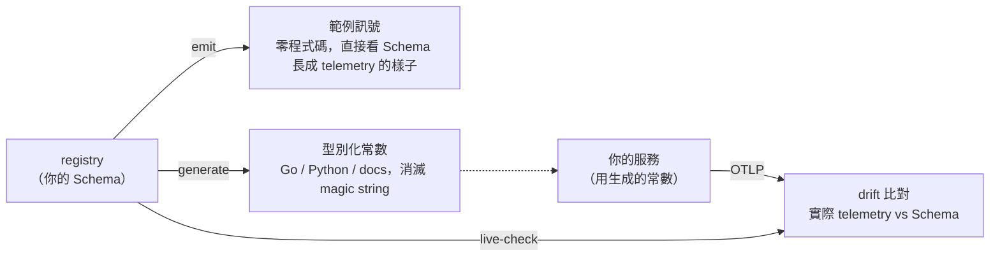
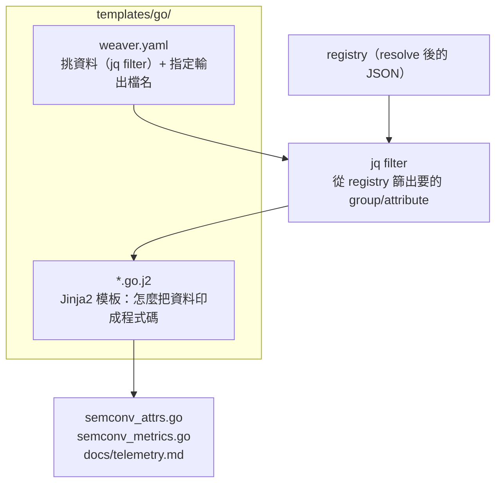

# OpenTelemetry Weaver — 第二・五篇：把 Schema 跑起來（emit／generate／live-check 實戰）

> 第二篇我們把 Schema 定義語言學透了，但每個範例都停在 `weaver registry check` 和 `resolve`——驗證「定義對不對」。
> 這篇要回答「**所以呢？**」：一份 registry 寫好之後，到底能拿來**做**什麼。
> 三個動詞貫穿全篇——`emit`（看）、`generate`（用）、`live-check`（比對）。建議開著 terminal 邊讀邊跑。

> 本篇全部指令、輸出都在 weaver 0.23.0 + 我們的電商 demo（`examples/`）實跑過，輸出原樣貼上。

---

## 為什麼這篇存在

第二篇結束時你會寫 Schema 了，但可能有個沒說出口的疑問：

> 「我把屬性、型別、enum 都定義得漂漂亮亮，`check` 也綠了——然後呢？這份 YAML 跟我服務真正打出去的 telemetry 有什麼關係？」

答案是：**registry 不是文件，是可執行的合約**。Weaver 提供三個動詞，把這份合約變成實際產出：



這三件事跑通，你就握住了「定義 → 程式碼 → 實際 telemetry」的完整迴圈——也正是下一篇 CI Merge Gate 能成立的前提。

---

## Part 1：`emit` — 零程式碼，先看 Schema 長什麼樣

最快建立直覺的方式：把 registry **直接吐成範例訊號**。不用寫一行 instrumentation：

```bash
weaver registry emit --registry ./telemetry/registry --stdout
```

`emit` 會走過每個 span／metric，拿你在 Schema 裡寫的 `examples:` 當值，組出一筆筆「如果照這份 Schema 打點，會長這樣」的訊號。實際輸出（節錄）：

```text
Weaver Registry Emit
Resolving registry `./telemetry/registry`
ℹ Found registry manifest: ./telemetry/registry/manifest.yaml
Emitting v1 registry `./telemetry/registry`

Span #0
	Name         : span.cart.add_item
	Kind         : Server
	Attributes:
		 ->  cart.item_id: String(Owned("SKU-001"))
		 ->  cart.item_price: F64(299.0)
		 ->  cart.item_quantity: I64(1)
		 ->  cart.session_id: String(Owned("sess-abc123"))
		 ->  deployment.environment: String(Owned("production"))
		 ->  git.tag: String(Owned("v1.0.0"))
```

幾個值得注意的點：

- **值從哪來**：`cart.item_price: F64(299.0)` 的 `299.0` 就是你在 `examples:` 裡寫的第一個值。這是 examples 除了「驗證型別」之外的第二個用途——**它是 emit 的素材**。所以 examples 隨便填會讓 emit 出來的訊號很假；填得貼近真實，emit 出來就是一份能拿給後端工程師看的「樣品」。
- **型別對映**：`int → I64`、`double → F64`、`string → String`——這是 Schema 型別映射到 OTLP 值型別的具體證據。型別寫錯，這裡就會錯。
- **預設送去哪**：不加 `--stdout` 時，`emit` 會用標準 OTel SDK 把訊號送到 OTLP gRPC `localhost:4317`（可用 `--endpoint` 或 `OTEL_EXPORTER_OTLP_ENDPOINT` 覆寫）。這代表你可以 `emit` 進一個真的 Collector／Jaeger，**在還沒寫任何服務程式碼前**，就先在 Grafana 裡看到 dashboard 有沒有接到資料。

> ⚠️ **emit 的 metric 值是假的**：`examples:` 只套用在 **attribute** 上——所以 span 的屬性值、metric 的屬性值都是真的（`payment.provider=stripe`），但 **metric 的 data point 數值固定是 `1.0`**：每個 counter 加 1，每個 histogram 只觀測到一筆落在第一個 bucket 的 `1.0`。這不是 bug，是 semconv 的 metric group 根本沒有「值範例」這個欄位（連寫 `value_examples:` 都會被 weaver 當未知屬性報錯）。所以 `emit` 拿來**驗 metric 結構**（instrument 型別、unit、bucket 邊界、attribute 齊不齊）很可靠，但**別拿它的數值去驗 dashboard 的 `histogram_quantile` 或 bucket 切得對不對**。

> 💡 **實務用法**：前端 dashboard 團隊常常要等後端先打點才能開工。有了 `emit`，Schema 一定稿就能先灌一批範例訊號進 staging 後端，dashboard 與告警規則可以**平行**開發。

---

### 練習 1：讓 emit 出來的訊號變真實

1. 跑 `weaver registry emit --registry ./telemetry/registry --stdout`，找出 `span.cart.add_item` 的 `cart.item_price` 值。
2. 打開 `cart-spans.yaml`，把 `cart.item_price` 的 `examples` 第一個值改掉，重新 emit，確認輸出跟著變。
3. **思考**：為什麼 `git.tag` emit 出來是 `v1.0.0`？它是在哪個檔定義的？（提示：`ref` 來自 `common.yaml`，emit 連 `ref` 進來的屬性一起展開。）

<details>
<summary>參考解答</summary>

`emit` 的值來源就是 resolve 後每個屬性的 `examples[0]`。改 `cart-spans.yaml`：

```yaml
      - id: cart.item_price
        type: double
        stability: stable
        brief: "商品單價（TWD）"
        examples: [1999.0, 299.0]   # 把第一個改成 1999.0
        requirement_level: required
```

重新 emit 後 `cart.item_price: F64(1999.0)`。`git.tag` 之所以出現，是因為 `span.cart.add_item` 裡有 `- ref: git.tag`，而 `git.tag` 在 `common.yaml` 的 `common.resource` 定義，`examples` 是 `["v1.0.0", ...]`——`emit` 跟 `resolve` 看到的是同一份展開後的資料（第二篇第 9 節），所以 `ref` 進來的屬性也會被 emit。

</details>

---

## Part 2：`generate` — 把 Schema 變成型別化常數

`emit` 是給人看的；`generate` 是給**程式**用的。它的目標是消滅 instrumentation 裡的 magic string：

```go
// ❌ 手寫字串：拼錯了沒人擋得住，重構時也搜不到
span.SetAttributes(attribute.String("payment.order_id", id))

// ✅ 用生成的常數：拼錯直接編譯失敗，IDE 還能自動補全
span.SetAttributes(semconv.PAYMENT_ORDER_ID.String(id))
```

### codegen 的三個零件

先講清楚「`weaver.yaml` 是從哪冒出來的」——等一下實跑的指令是 `weaver registry generate --templates ./templates go ...`。這裡的 `go` 是 **target**，weaver 會照慣例去 `./templates/go/` 底下找一個叫 `weaver.yaml` 的**模板設定檔**當入口。所以這個 `weaver.yaml` 不是 registry 那份（registry 的入口是 `manifest.yaml`），而是**專屬 codegen 的設定**：它住在 `templates/<target>/` 裡，一個 target 一份。看懂它裡頭的三個零件，就看懂整個 codegen：



#### 一個最容易卡住的關卡：屬性到底「定義在哪」？

讀模板時最常見的疑惑是：「`{{ attr.name }}`、`{{ attr.type }}` 這些是哪裡定義的？是 `weaver.yaml` 嗎？還是 `.j2`？」答案會讓很多概念瞬間通——**這兩個檔都沒有定義任何屬性**。屬性真正的源頭再往上一層,是你的 **registry（Schema YAML）**。三個檔各管一件事,誰都不越界:

| 檔 | 職責 | 它**不**做的事 |
|---|---|---|
| `telemetry/registry/*.yaml`（Schema） | **定義屬性本身**——`cart.item_price` 的 `type`／`brief`／`examples` 全寫在這 | — |
| `templates/go/weaver.yaml` | 從那堆屬性裡**挑**要哪些（`filter`）、印去哪個檔 | 不定義任何屬性 |
| `semconv_attrs.go.j2` | 把挑出來的屬性**排版**成 Go const | 不定義屬性、也不挑資料 |

一句話記住:**定義在 registry、挑選在 `weaver.yaml`、排版在 `.j2`。** 所以 `.j2` 檔裡其實「什麼都沒定義」——它就是一張**格式紙**:大半是固定文字,夾幾個 `{{ }}` 挖空等資料填進來。同理 `weaver.yaml` 的 filter（`.groups | map(...) | unique_by(.name) …`）從頭到尾都是**動詞**(取出、篩選、去重、排序),沒有一段在「新增」屬性——`.name`、`.attributes` 這些欄位拿得到,純粹因為 registry 早就定義好了。

舉個具體的:模板印 `{{ attr.name }}` / `{{ attr.brief }}` 能有東西,是因為 `telemetry/registry/cart-spans.yaml` 裡寫著——

```yaml
- id: cart.item_price          # → 模板的 attr.name
  type: double                 # → attr.type
  stability: stable            # → attr.stability
  brief: "商品單價（TWD）"        # → attr.brief
  examples: [299.0, 1500.0]
  requirement_level: required
```

**欄位名（`id`／`type`／`brief`…）是 registry 定的,不是模板定的。** 這也是為什麼後面會教你「先用 `{{ debug() }}` 把 `ctx` 印出來看」——手上有哪些欄位可用,是**資料**決定的,模板只能拿、不能無中生有。

順帶釐清模板裡兩個名字的來歷,因為它們長得很像但來源完全不同:

| 名字 | 誰決定的 | 是什麼 |
|---|---|---|
| `ctx` | **weaver**（= 這個 job 的 `filter` 輸出） | 餵進模板的整包資料 |
| `attr`（或 `group`、`metric`、任何名字） | **你**,在 `` 那行隨手取 | 迴圈當下的「其中一筆」,跟 Python `for x in list` 的 `x` 一樣 |

所以 `attr` 不是「定義在某個檔」,它就在 `for` 那一行誕生、迴圈結束就消失;把它改名叫 `` 再全用 `a.name`,結果一模一樣。資料的數據流整條串起來就是:

```text
telemetry/registry/cart-spans.yaml   ① 定義屬性（cart.item_price 的 type/brief 都在這）
        │  weaver resolve（把 ref／extends 全展開成一份大 JSON）
        ▼
weaver.yaml 的 filter                 ② 從 JSON 裡「挑」出要的屬性 → 成為 ctx
        ▼
semconv_attrs.go.j2                   ③ 把 ctx 裡每筆屬性「排版」成 Go const
        ▼
semconv_attrs.go                      產物
```

抓住這條鏈,下面拆 pipeline 跟模板就只是看「②怎麼挑」和「③怎麼印」的細節而已。

#### 先抓整體：一條 pipeline、三個 job

別急著看 jq——先把整個 codegen 濃縮成一句話。當你跑 `weaver registry generate`，weaver 做的事就是：

1. 打開 `templates/go/weaver.yaml`，它本質上是**一份 job 清單**；
2. 每個 job 只有三個欄位：`filter`（挑資料）、`template`（怎麼印）、`file_name`（印去哪）；
3. 對**每個 job** 跑同一條 pipeline：

```text
resolve 後的 registry JSON  ──filter（jq）──▶  ctx  ──template（.j2）──▶  寫進 file_name
```

整個 Part 2 在講的，就只是這條 pipeline 的兩端——`filter` 怎麼挑、`template` 怎麼印。我們 demo 的 `weaver.yaml` 剛好有**三個 job**：

| # | `filter` 挑出什麼 | `template` | `file_name` | 這個 job 的 `ctx` 是…… |
|---|---|---|---|---|
| 1 | 所有 span＋attribute_group 的屬性，去重、排序 | `semconv_attrs.go.j2` | `semconv_attrs.go` | 一份**屬性**清單 |
| 2 | 所有 metric group，依名稱排序 | `semconv_metrics.go.j2` | `semconv_metrics.go` | 一份**metric**清單 |
| 3 | 所有 metric＋span group | `docs.md.j2` | `docs/telemetry.md` | 一份**group**清單 |

**這張表藏著 Part 2 最關鍵、卻最少被講白的一句話：`ctx` 就是「這個 job 的 `filter` 回傳的東西」。** 同一份 registry，job 1 的 `ctx` 是攤平的屬性清單、job 2 是 metric 清單、job 3 是 group 清單——之所以三者不同，純粹是因為三個 filter 不一樣。看懂「`ctx` = filter 的輸出」，後面所有 `.j2` 裡的 `` 就都解釋得通了。

而每個 `.j2` 模板其實也只是一個 `for` 迴圈，把 `ctx` 一筆筆印成文字：

```jinja
{# job 1：把每個屬性印成一個 Go const #}

const {{ attr.name | screaming_snake_case }} = attribute.Key("{{ attr.name }}")

```

job 2 同理（迴圈 metric，每筆印 NAME／UNIT／DESC 三個 const）、job 3 同理（迴圈 group，每筆印一段 Markdown）。所以三個 job 長得幾乎一樣，差別只在「filter 餵進來的 `ctx` 是什麼」跟「模板把它印成哪種格式」。

掌握這個整體後，剩下唯一需要花腦力的，就是 job 1 的 filter——也是三個 job 裡最複雜的一個。我們把它拆開看。

#### 拆解 job 1 的 filter

```yaml
templates:
  - template: semconv_attrs.go.j2
    filter: >
      .groups
      | map(select(.type == "attribute_group" or .type == "span"))
      | map(.attributes[])
      | unique_by(.name)
      | sort_by(.name)
    application_mode: single
    file_name: "semconv_attrs.go"
```

`filter` 是 **jq 語法**，它的**輸入**是整份 `resolve` 後的 JSON（最外層 `{ registry_url, groups }`，`ref`／`extends` 全展開好了），**輸出**就是要餵進 `.j2` 模板的 `ctx`。記住分工：**`filter`（jq）決定「印什麼資料」，`.j2`（Jinja2）決定「印成什麼樣子」**——所以同一份 registry 換個 filter＋模板就能生出完全不同的檔（剛才那張表的三個 job 正是如此，各自一個 filter）。

這五行 pipeline 拿 demo 的 registry 實跑，資料量會一路收斂（demo 的 registry 共 10 個 group：3 span＋6 metric＋1 attribute_group）：

| 步驟 | jq 動作 | demo 實際結果 |
|---|---|---|
| ① `.groups` | 取出 group 陣列 | **10 個** group |
| ② `map(select(...))` | 只留 `type` 是 `attribute_group` 或 `span` 的 | **篩掉 6 個 metric**，剩 4 個：`common.resource` 與 3 個 span |
| ③ `map(.attributes[])` | 取每個 group 的 `attributes` 攤平成單一清單 | 4 個 group 的屬性加總 = **21 筆（含重複）** |
| ④ `unique_by(.name)` | 同名屬性只留一筆 | **21 → 14 筆** |
| ⑤ `sort_by(.name)` | 依名稱排序 | 最終 **14 筆**，這就是餵給模板的 `ctx` |

兩個一定要懂的「為什麼」：

- **為什麼②要排除 metric？** 這個檔（`semconv_attrs.go`）只生**屬性常數**（`CART_ITEM_PRICE = attribute.Key(...)`）；metric 的 name/unit/desc 是另一回事，由 `weaver.yaml` 裡**另一組** template（filter 為 `map(select(.type=="metric"))`）負責。這正是「filter 決定一個檔該看哪段資料」。
- **為什麼③④會冒出重複、需要去重？** 這是最容易忽略卻最關鍵的一點。實測中 `deployment.environment` 攤平後出現了 **4 次**、`git.tag` 4 次、`cart.session_id` 2 次——因為多個 span 都 `ref` 了同一個共用屬性。若不 `unique_by(.name)`，生出來的 Go 檔就會有 4 個重複的 `const DEPLOYMENT_ENVIRONMENT` → **編譯失敗**。所以 `unique_by` 不是美化，是**正確性**。`sort_by(.name)` 同理偏正確性：讓輸出順序穩定，每次重生在 git 裡 **diff 為零**（`generate` 之所以 deterministic、能當 CI 比對基準，靠的就是這個排序）。

> **引擎是什麼**：Weaver 的 codegen 由兩個 Rust 元件驅動——資料過濾用 **jaq**（`jq` 相容），模板渲染用 **MiniJinja**（Jinja2 相容，作者正是 Jinja2 原作者）。所以下面你看到的就是標準 Jinja2 語法，只是引擎是 Rust 版、跑得快、且零外部依賴（weaver 單一 binary 內建）。

#### 三分鐘認識 Jinja2 模板

Jinja2 是一種**文字模板語言**：你寫一份「大部分是固定文字、夾雜幾個特殊標記」的樣板，引擎把資料填進標記、吐出最終文字。它跟產出什麼語言無關（Go、Python、Markdown 都行），這正是「一份 registry 多語言生成」的基礎。它只有四種標記：

| 標記 | 作用 | 例子 |
|---|---|---|
| `{{ 運算式 }}` | 取值輸出 | `{{ attr.name }}` → `cart.item_id` |
| `` | 控制邏輯（迴圈、判斷） | `…` |
| `\| filter` | 管線加工：把值丟給函式轉換 | `{{ attr.name \| screaming_snake_case }}` → `CART_ITEM_ID` |
| `{# 註解 #}` | 不輸出的註解 | — |

> ⚠️ 別跟第二篇第 7 節的「**模板型別** `template[string[]]`」搞混——那是 semconv 的一種**屬性型別**（共同前綴的動態 key 字典），跟這裡的「程式碼模板引擎」是兩件完全不同的事，只是中文都叫「模板」。

對照我們 demo 的模板，逐行就能讀懂：

```jinja
                                  {# 對 ctx（filter 篩出的屬性清單）逐一跑迴圈 #}
// {{ attr.name | screaming_snake_case }} is the key for attribute "{{ attr.name }}".
// Brief: {{ attr.brief }}
const {{ attr.name | screaming_snake_case }} = attribute.Key("{{ attr.name }}")

```

兩個關鍵變數／函式：

- **`ctx`**：Weaver 餵給模板的資料，就是 `weaver.yaml` 裡 `filter:` 篩完的結果。手上到底有哪些欄位可用，`{{ debug() }}` 一印就知道（本節後面會用到）。
- **`screaming_snake_case`**：把 `cart.item_id` 轉成 `CART_ITEM_ID` 的命名 filter。它不是 Jinja2 內建，是 Weaver 透過 MiniJinja 額外注入的——這類 filter 是 codegen 最常用的擴充點（完整清單見後面「把 codegen 用滿」）。

### 那「我自己」要怎麼從零寫一套？

前面都在讀**現成**的模板；這節反過來，假設 `templates/go/` 是空的，把 job 1（屬性常數）**從零長出來**。關鍵心法只有一句：**不要憑空想 filter 和模板，先把資料印出來看，再決定怎麼挑、怎麼印。** 五步：

**① 先想清楚「要生出什麼檔」**——決定產物，就決定了兩件事：target 目錄名、輸出檔名。我們要 Go 常數 → target 叫 `go`（所以路徑是 `templates/go/`）、輸出檔 `semconv_attrs.go`。

**② 在 `templates/go/weaver.yaml` 開一個 job，filter 先放最寬**——還不知道資料長怎樣，所以 filter 先寫 `.groups`（原封不動全拿），模板先放一行 `{{ debug() }}`：

```yaml
templates:
  - template: semconv_attrs.go.j2
    filter: ".groups"          # 先全拿，待會再收斂
    application_mode: single
    file_name: "semconv_attrs.go"
```

```jinja
{# templates/go/semconv_attrs.go.j2 —— 第一版只放這行 #}
{{ debug() }}
```

**③ 跑一次 generate，用 `debug()` 看 `ctx` 到底長什麼樣**——這步是整個流程的核心。你會看到每個 group／attribute 身上**實際有哪些欄位**（`name`、`brief`、`type`、`stability`、`requirement_level`…）。**先看到資料，才知道 filter 要挑什麼、模板能印什麼**——不是反過來憑記憶猜欄位名。

**④ 根據看到的資料，把 filter 收斂成你要的形狀**——現在你知道「group 有 `type`、要的屬性在 `attributes[]` 裡、多個 span 會 `ref` 到同一個屬性」，於是 filter 一步步長出來：挑出帶屬性的 group（`select(.type=="span" or ...)`）→ 攤平成屬性清單（`map(.attributes[])`）→ 去重（`unique_by(.name)`）→ 排序（`sort_by(.name)`）。**每加一段就重跑一次 `debug()`，確認資料形狀真的變成你預期的**，這正是上面那條五行 pipeline 的由來——它不是一次寫對的，是這樣「印→看→收斂」逼出來的。

**⑤ 把 `debug()` 換成真正的 `for` 迴圈**——`ctx` 已經是乾淨的屬性清單了，模板就只是逐筆印：欄位用 `{{ attr.xxx }}` 取、命名慣例用 `| screaming_snake_case` 這類 filter 套。改 schema 後重跑 generate，diff 一看就知道對不對。

> 💡 **這套流程對「寫新語言／新格式」一體適用**：想生 Python？複製一個 `templates/python/`，filter 八成可以照抄（資料需求一樣），只改模板的印法和命名 filter（`screaming_snake_case` → 視情況換）。想生一份報表？target 換成 `report`、模板印 Markdown 就好。**filter 決定資料、模板決定格式、debug() 是你的眼睛**——掌握這三點，任何產物都是同一套打法。

### 實跑

```bash
weaver registry generate \
  --registry ./telemetry/registry \
  --templates ./templates \
  go ./generated_from_template
```

實際輸出：

```text
Generating artifacts for the registry `./telemetry/registry`
ℹ Found registry manifest: ./telemetry/registry/manifest.yaml
✔ No `after_resolution` policy violation
✔ Generated file ".../semconv_metrics.go"
✔ Generated file ".../semconv_attrs.go"
✔ Generated file ".../docs/telemetry.md"
✔ Artifacts generated successfully
```

注意指令結構：`generate --templates ./templates <target> <output>`。`<target>` 是 `./templates` 底下的子目錄名（這裡是 `go`，對應 `templates/go/`），所以同一份 registry 可以有 `go`／`python`／`docs` 多套模板並存。

生成的 `semconv_attrs.go`（節錄）：

```go
// Code generated by Weaver from telemetry/registry. DO NOT EDIT.

package semconv

import "go.opentelemetry.io/otel/attribute"

// CART_ITEM_PRICE is the key for attribute "cart.item_price".
// Brief: 商品單價（TWD）
// Type: double | Stability: stable
const CART_ITEM_PRICE = attribute.Key("cart.item_price")
```

`metric` 那套模板還會把 name／unit／description 一起生成成常數，避免在 `meter.Float64Histogram(...)` 裡又手打一次 `"payment.amount"` 和 `"{TWD}"`：

```go
const PAYMENT_AMOUNT_NAME = "payment.amount"
const PAYMENT_AMOUNT_UNIT = "{TWD}"
const PAYMENT_AMOUNT_DESC = "每筆支付的金額分佈"
```

### 把 codegen 用滿：模式、filter、偵錯

上面的 `weaver.yaml` 只用了最基本的設定，但 codegen 引擎還有幾個一定會用到的武器（以下都在 0.23.0 實跑過）：

**1. `application_mode: single` vs `each`**——`single` 把整批資料丟給模板出一個檔；`each` 則對 filter 結果的**每個元素各跑一次**，配合 `file_name` 的 Jinja 模板就能動態命名、一個元素一個檔：

```yaml
  - template: metrics_doc.md.j2
    filter: semconv_grouped_metrics       # helper filter，自動依 root namespace 分組
    application_mode: each                 # 每個 namespace 跑一次
    file_name: "metrics_{{ ctx.root_namespace }}.md"
```

實跑這份設定，demo 會生出 `metrics_cart.md` 和 `metrics_payment.md` 兩個檔——`each` 模式下 `ctx` 就是「當前這一個元素」（這裡是一個 namespace 群組，帶 `.root_namespace` 和 `.metrics`）。

**2. 內建命名 filter（多語言的關鍵）**——同一個 `cart.item_id`，換個 filter 就是另一種語言的命名慣例。實測輸出：

```text
cart.item_id -> screaming=CART_ITEM_ID  pascal=CartItemId  camel=cartItemId  kebab=cart-item-id
```

常用的有 `snake_case` / `screaming_snake_case` / `pascal_case` / `camel_case` / `kebab_case`，外加 `comment`（依語言格式化註解）、`attribute_sort`（按 requirement level 再按名稱排序）、`required` / `not_required`（按必要性篩選）。**Go 的常數用 `screaming_snake_case`、Java／C# 想要 `CartItemId` 就換 `pascal_case`、Rust 欄位要 `cart_item_id` 就用 `snake_case`**——模板邏輯不動，只換 filter，就能餵不同語言的命名慣例。

**3. helper filter**——除了自己寫 jq，Weaver 內建 `semconv_grouped_metrics`、`semconv_grouped_attributes`、`semconv_grouped_events`，直接幫你依 root namespace 把訊號分好組，省掉手刻 `group_by`。

**4. 模板行為不如預期？`{{ debug() }}`**——第二篇說過「policy 怪怪的就先 `resolve` 看展開」；模板層級的同款招式是在 `.j2` 裡塞一行 `{{ debug() }}`，它會把當下 `ctx` 的完整結構整包印出來，你立刻看到手上有哪些欄位可用：

```text
State {
    name: "d.txt.j2",
    ctx: {
        "ctx": {
            "attributes": [ { "brief": "服務部署環境", "examples": [...], "name": "deployment.environment", ... } ]
            ...
```

> **三條鐵律**：
> 1. **生成物進版控、但標 `DO NOT EDIT`**——讓 reviewer 看得到 diff，但沒人手改。
> 2. **改 Schema → 重新 generate → 一起 commit**。下一篇的 CI 會檢查「生成物有沒有跟 Schema 同步」，手改或忘記重生都會被擋。
> 3. **同一份 registry，多語言一致**。Go 服務和 Python 服務從同一份 Schema 生成常數，`payment.order_id` 不可能一邊對一邊錯。

### 那 `docs.md.j2` 到底在幹嘛？——人類文件也是生成的

前兩個 job 生的是**給程式用**的 Go 常數；第三個 job（`docs.md.j2` → `docs/telemetry.md`）生的是**給人看**的規格文件。它在回答一個每個團隊都會被問的問題：

> 「這個服務到底打了哪些 telemetry？每個欄位是什麼意思、哪些必填？」

過去這種文件得有人手寫維護在 wiki／Notion，然後**必然腐爛**——code 改了、文件忘了改，半年後沒人敢信。`docs.md.j2` 的解法是：**讓這份文件跟 Go 常數出自同一份 registry**，所以它**不可能跟實際合約不一致**。改 schema → 重跑 generate → 程式常數和文件**一起**更新。

機制上它跟前兩個 job 一模一樣（同一條 pipeline），只是模板印的不是 Go，而是 Markdown 表格——這也再次證明 Jinja 跟產出語言無關。它的 filter 挑 `metric + span` 兩種 group，模板對每個 group 印出 metadata 加一張屬性表（連「對應的 Go 常數」「必填與否」都列進去，讓讀文件的人跟讀 code 的人對得起來）：

```markdown
## 📡 Span: `span.payment.process`

**處理訂單支付流程的 Span**

| 屬性 | 值 |
|------|-----|
| Span Kind | `server` |
| Stability | `stable` |

### 屬性列表

| 屬性名稱 | Go 常數 | 類型 | 必填 | 說明 |
|---------|---------|------|------|------|
| `payment.order_id` | `PAYMENT_ORDER_ID` | `string` | ✅ 必填 | 唯一的訂單識別碼 |
| `payment.provider` | `PAYMENT_PROVIDER` | `string` | ✅ 必填 | 支付服務提供商 |
| `payment.status` | `PAYMENT_STATUS` | `string` | ✅ 必填 | 支付結果狀態 |
| `error.type` | `ERROR_TYPE` | `string` | ⬜ 選填 | 失敗時的錯誤類型 |
```
（上表為 `docs/telemetry.md` 實際輸出節錄；完整表還有 `deployment.environment`、`git.tag`、`payment.currency` 等共 7 列。）

**誰會讀它**：要接手 instrument 的後端工程師、要開 dashboard／告警的 SRE、要對齊欄位語意的 PM、剛進專案的新人——他們都不必去翻 Go code 或生 registry 的 YAML，看這份生成文件就夠。「Schema 即文件」這條線系列後面還會展開，這裡先記住：**codegen 不只生程式碼，連「描述這份 telemetry 的文件」都能從同一個事實來源長出來。**

---

### 練習 2：加一套只列 span 名稱的模板

1. 看懂 `templates/go/weaver.yaml` 裡 `semconv_metrics.go.j2` 那段的 `filter`——它怎麼只挑出 metric？
2. 在 `templates/go/` 新增一個模板 `span_names.txt.j2`，filter 只選 `type == "span"`，輸出每個 span 的 `id`。
3. 重新 generate，確認多出一個 `span_names.txt`。

<details>
<summary>參考解答</summary>

metric 那段的 filter 是 `.groups | map(select(.type == "metric")) | sort_by(.metric_name)`——`select` 就是過濾條件。仿照它，在 `weaver.yaml` 加一筆：

```yaml
  - template: span_names.txt.j2
    filter: >
      .groups | map(select(.type == "span")) | sort_by(.id)
    application_mode: single
    file_name: "span_names.txt"
```

`templates/go/span_names.txt.j2`：

```jinja
{{ g.id }}

```

重新 `generate` 後會多出 `span_names.txt`，內容是 `span.cart.add_item`、`span.payment.process` 等每行一個。重點體會：**filter 挑資料、模板決定格式**，兩者分離，所以同一份 registry 想生成什麼格式都行。

</details>

---

## Part 3：`live-check` — 實際 telemetry 真的符合 Schema 嗎？

`generate` 讓你「用對常數」，但它擋不住所有情況：第三方 middleware 自己加屬性、有人沒用生成常數硬寫字串、用了還沒更新的舊版函式庫……。要抓這些，得**拿服務真正打出的 telemetry 跟 registry 比對**——這就是 `live-check`。

它把 Weaver 變成一個 OTLP receiver：服務把 telemetry 送進來，Weaver 逐筆比對 registry，產出 advice 報告。

```bash
weaver registry live-check \
  --registry ./telemetry/registry \
  --input-source otlp \
  --otlp-grpc-address 0.0.0.0 --otlp-grpc-port 4317
```

demo 把「啟動 live-check + 跑服務 + 出報告」包成一個指令：

```bash
make live-check-go      # 啟 live-check，把 Go 服務指向它，跑完印報告
```

報告裡，**符合 Schema 的 span 是綠的**：

```text
Span cart.add_item `server`
    cart.session_id = sess-0059
    cart.item_id = SKU-002
    cart.item_quantity = 1
    cart.item_price = 1500.0
    git.tag = v1.0.0
    deployment.environment = development
```

### 一個真實會踩到的坑：`service.name` 不在 registry

同一份報告開頭其實有 violation——而且是「正常模式」就有的：

```text
Resource
    service.name = weaver-demo-service
        - [violation] Attribute 'service.name' does not exist in the registry.
    service.version = v1.0.0
        - [violation] Attribute 'service.version' does not exist in the registry.
```

這不是 bug，是個好教訓：**OTel SDK 會自動往 Resource 塞 `service.name`／`service.version`，但你的 registry 沒定義它們**，於是 live-check 判定「打出了 registry 裡沒有的屬性」。修法是把 OTel 官方的 resource 慣例 `import` 或 `ref` 進你的 registry（第二篇第 9、10 節的跨 registry 引用）——這也正說明了為什麼真實專案幾乎都得掛上 OTel semconv 依賴，而不是純自訂。

### 攔截破壞性改動

demo 的 `--broken` 模式故意把 `payment.order_id` 打成 `payment.orderId`（camelCase，正是第三篇開頭那個災難）：

```bash
make live-check-broken-go
```

live-check 立刻標紅（實測，這筆 `payment.orderId` 一口氣中了三條 advice）：

```text
Span span.payment.process `server`
    payment.orderId = ord-001
        - [violation] Attribute 'payment.orderId' does not exist in the registry.
        - [violation] Attribute 'payment.orderId' does not match name formatting rules.
        - [information] Attribute name 'payment.orderId' collides with existing namespace 'payment'
    payment.provider = stripe
```

三條訊息各說一件事：**不在 registry**（拼錯了沒人定義過）、**不符命名規則**（camelCase 違反 OTel 的 snake_case 慣例）、**撞到既有 namespace**（`payment.orderId` 跟 `payment.*` 這群屬性搶前綴）。`payment.provider` 因為打對了，沒有任何 advice。

`check` 在第二篇是「定義對不對」；`live-check` 是「打出來的對不對」。前者在你寫 Schema 時擋，後者在你跑服務時擋——兩道是不同階段的防線。

> ⚠️ **實測注意**：`--output <path>` 產生的是一個**報告目錄**（裡面有 `live_check.txt`），不是單一檔；要直接看就讓它輸出到 stdout（streaming 模式，每筆 ingest 即印）。另外 `live-check` 結報的時機——靠 `--inactivity-timeout`（多久沒新資料就收工），別用 `kill`，SIGTERM 不保證報告完整寫出。

> ☢️ **port 衝突會污染報告（實測踩到）**：`live-check` 預設監聽 `0.0.0.0:4317`，而這正是 OTLP gRPC 的慣用 port——它是個「來者不拒」的 receiver，**同一台機器上任何往 `4317` 送 OTLP 的程式都會被收進來比對**。實測中它就把本機 Claude Code 自己的遙測（`service.name=claude-code`，含 `user.email`／`session.id` 等 Log）一起吃了進去，整片標紅，報告檔還原樣寫下了那些 PII。所以：demo／CI 請用**專屬 port**（例如 `--otlp-grpc-port 4319`）或隔離網路，別直接用 `4317`；並把 live-check 的報告目錄當成**可能含 PII** 來看待。

---

### 練習 3：用 emit 餵 live-check，不用寫服務

你不必真的跑 Go 服務也能玩 live-check——`emit` 本來就會把訊號送到 OTLP，正好餵給 live-check。為了避開上面那個 `4317` 撞 port 的坑，這裡兩邊都明確指定一個專屬 port（`4319`）：

1. 一個終端機開 live-check：`weaver registry live-check --registry ./telemetry/registry --input-source otlp --otlp-grpc-port 4319`
2. 另一個終端機跑 `weaver registry emit --registry ./telemetry/registry --endpoint http://localhost:4319`（不加 `--stdout`，改用 `--endpoint` 指到同一個 port）。
3. 看 live-check 端的輸出——因為 emit 用的就是 registry 自己的 examples，**理論上應該全綠**（除了 SDK 自動加的 resource 屬性）。
4. **進階**：手動改一筆——把某個 span 的某屬性 examples 暫時改成型別不符的值，emit 過去，看 live-check 怎麼報。

<details>
<summary>參考解答</summary>

emit 自己的訊號餵給 live-check，attribute 全部來自 registry，所以 span 層級不會有 `does not exist` violation——這驗證了「emit 與 live-check 共用同一份 resolve 結果」。會看到的 violation 多半來自 emit 用的 OTel Rust SDK 自動加的 resource 屬性（`telemetry.sdk.*`、`service.name`），跟前面 Go 服務踩到的是同一類問題：**registry 沒涵蓋 SDK 自動帶的 resource 屬性**。

這個練習的價值在於體會：`emit`（產生符合 Schema 的訊號）與 `live-check`（驗證訊號符合 Schema）是一對互逆操作，串起來就是一個自我驗證的閉環——也是 CI 裡「不依賴真實服務就能煙霧測試 Schema」的技巧。

</details>

---

## 把三個動詞串起來

```text
寫好 registry（第二篇）
   │
   ├─ emit ........... 零程式碼，先看 Schema 變成 telemetry 的樣子（也能灌進 staging 給 dashboard 團隊）
   │
   ├─ generate ....... 生成型別化常數（Go/Python）+ 人類文件，消滅 magic string
   │      │
   │      └─→ 服務用生成的常數打點
   │
   └─ live-check ..... 服務打出的 telemetry 回頭跟 registry 比對，抓 drift
```

這三步把 registry 從「一份描述用的 YAML」變成「貫穿開發流程的可執行合約」。而一旦這個迴圈在本機跑得通，把它搬進 CI 就是水到渠成——

下一篇：**讓 Schema 成為你的 Merge Gate**——把 `check`（命名／breaking change policy）、`generate`（生成物同步檢查）、`live-check`（drift detection）全部接上 GitHub Actions，讓不合規的 Schema 變更**根本合不進 main**，外加 `deprecated` 的正確演進手法。

---

## 快速指令對照

```bash
# 看：零程式碼把 Schema 吐成範例訊號
weaver registry emit --registry ./telemetry/registry --stdout

# 用：生成 Go 常數 + 文件
weaver registry generate --registry ./telemetry/registry --templates ./templates go ./generated_from_template

# 比對：把 Weaver 當 OTLP receiver，驗證實際 telemetry
make live-check-go          # 正常模式（注意 service.name 那類 resource violation）
make live-check-broken-go   # 破壞模式（payment.orderId 被攔）
```
