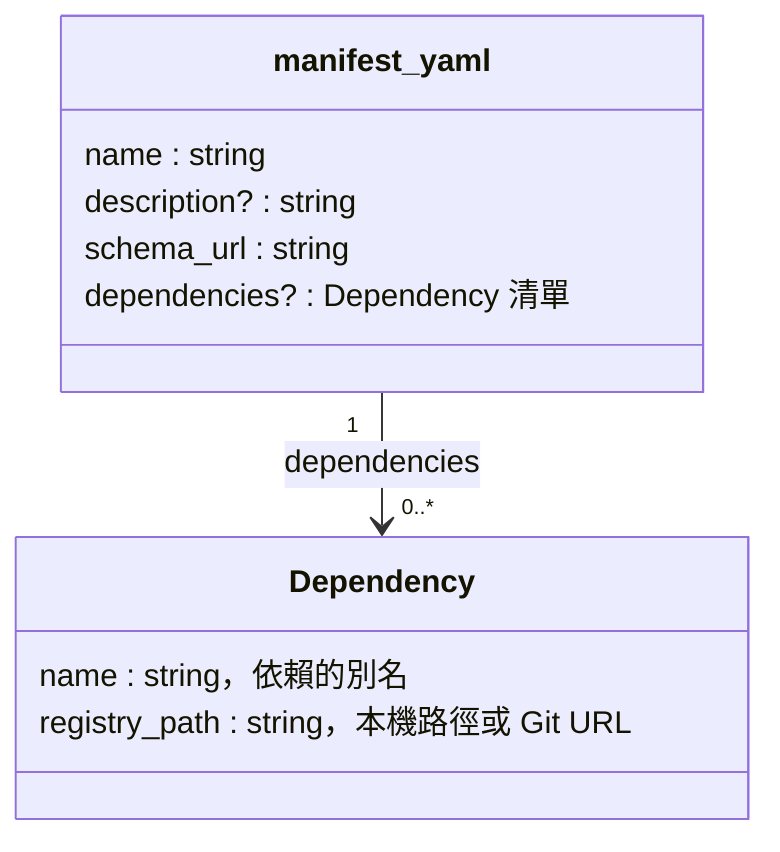
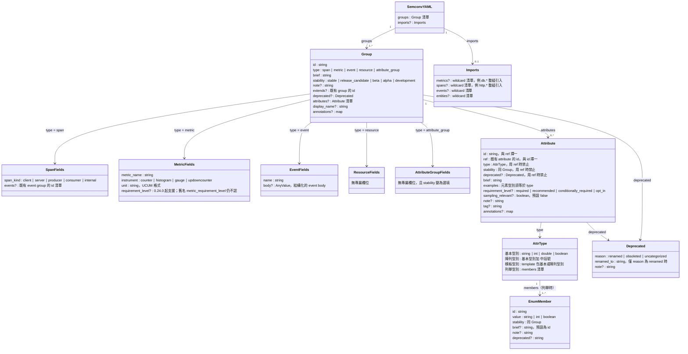
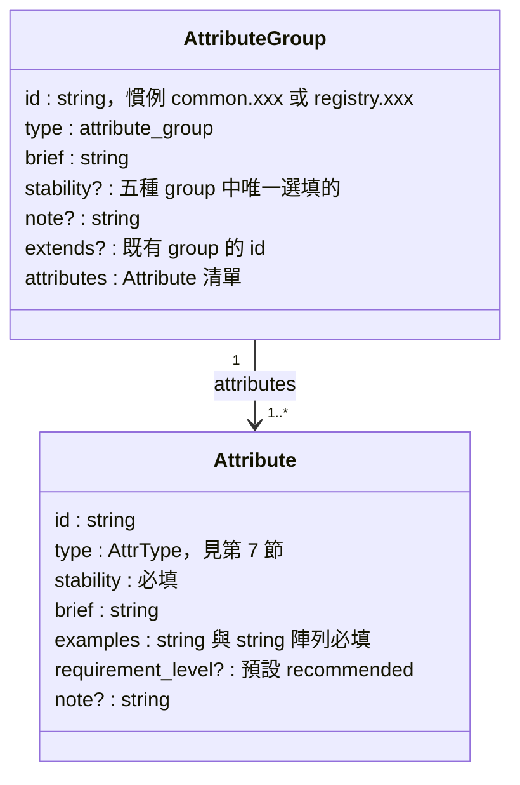
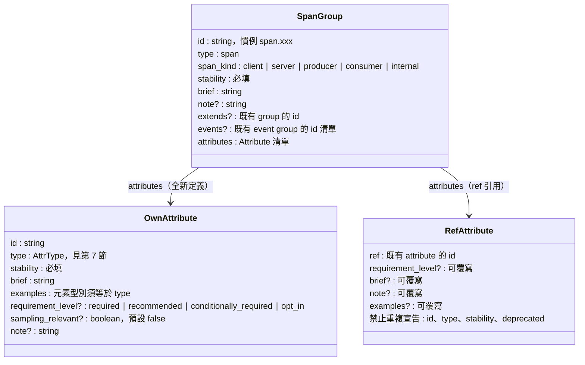
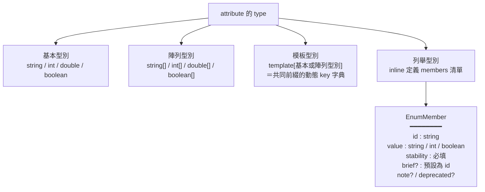
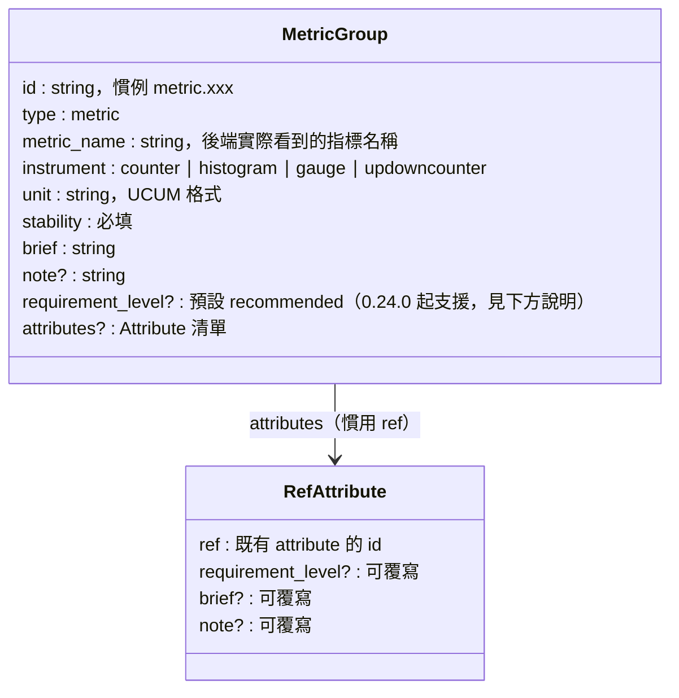
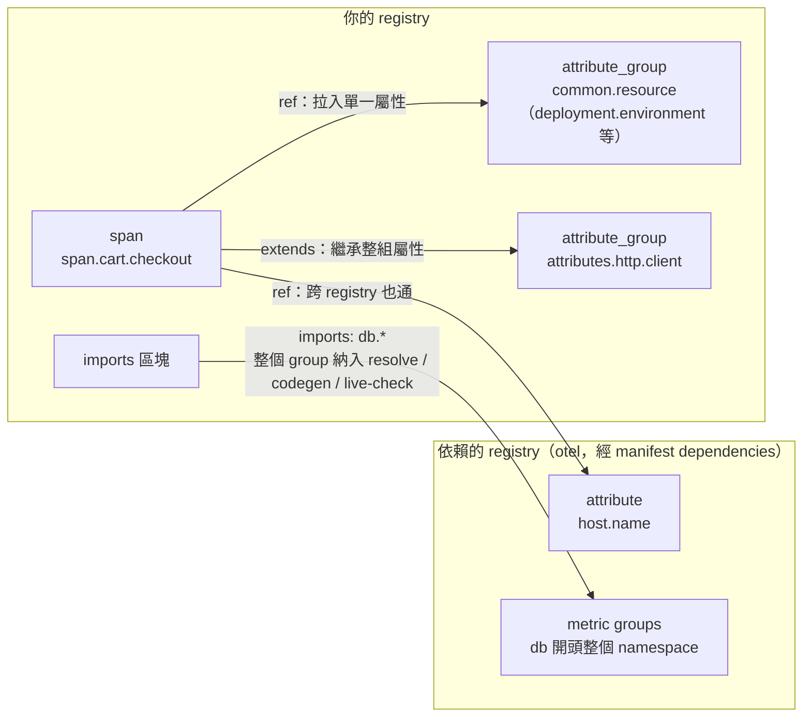

# OpenTelemetry Weaver — 第二篇：Schema 入門與實戰

> 上一篇我們快速走完 Weaver 的核心流程：定義 → 驗證 → 生成 → 監控。
> 這篇放慢腳步，把 Schema 定義語言本身學透——每個欄位的語義、型別系統、引用機制、跨 repo 依賴。
> 每一節都配練習，建議開著 terminal 邊讀邊做。CI Merge Gate 留到下一篇。

> 本篇內容對照官方的 [`semconv-syntax.md`](https://github.com/open-telemetry/weaver/blob/main/schemas/semconv-syntax.md) 與 [`define-your-own-telemetry-schema.md`](https://github.com/open-telemetry/weaver/blob/main/docs/define-your-own-telemetry-schema.md)，範例沿用我們的電商 demo。

---

## 開始之前：練習環境

```bash
# 安裝 weaver（或從 release 下載 binary）
curl -sSL https://github.com/open-telemetry/weaver/releases/latest/download/weaver-x86_64-unknown-linux-gnu.tar.xz \
  | tar -xJ --strip-components=1 -C /usr/local/bin

# clone demo repo
git clone https://github.com/your-org/weaver-demo
cd weaver-demo/examples
```

`examples/telemetry/registry/` 是一個完整可跑的 registry，本篇所有練習都以它為基礎。先確認環境正常：

```bash
make check    # 等同 weaver registry check --registry ./telemetry/registry --policy ./policies
```

通過時長這樣（實際輸出，weaver 0.24.0）：

```text
Weaver Registry Check
Checking registry `telemetry/registry`
ℹ Found registry manifest: telemetry/registry/manifest.yaml
✔ No `after_resolution` policy violation

Total execution time: 0.009s
```

看到 `✔` 且 exit code 0 就是過了。

另外強烈建議在每個 registry YAML 第一行加上：

```yaml
# yaml-language-server: $schema=https://raw.githubusercontent.com/open-telemetry/weaver/refs/heads/main/schemas/semconv.schema.json
```

VS Code 裝 Red Hat YAML 外掛後就有欄位自動補全與即時驗證，不用改任何編輯器設定。

> **關於 `--future`**：weaver 的驗證規則會隨版本愈來愈嚴。新規則不會一上線就是硬錯誤（否則所有既有 registry 升級當天集體爆紅），而是先以 warning 形式登場、未來某版才變成預設 error。`--future` 就是「我現在就採用未來的嚴格標準」的開關。
>
> 因此驗證規則其實分三層：
>
> 1. **永遠是硬錯誤**（與 `--future` 無關）：結構性違規，如裸寫 `conditionally_required`、`id` 與 `ref` 同時出現、未知欄位——任何情況都 exit 1。
> 2. **`--future` 管的過渡規則**：目前是 warning、未來會變 error，例如 `examples` 元素型別不符、string attribute 缺 `examples`、enum member 缺 `stability`。plain `weaver registry check` 對這些只印黃色警告、exit 仍是 0；加 `--future` 才升級成 error（exit 1）。
> 3. **永遠只是提示**：deprecation 等 info 訊息。
>
> 所以新 registry 與 CI 建議一律加 `--future`（OTel 官方 semconv 的 main branch 就固定開著），免得哪天升級 weaver 突然一堆紅。本篇凡是要你「讀錯誤訊息」的練習，都要跑 `weaver registry check -r <registry> --future`，否則你可能只看到 warning 卻誤以為通過。

---

## 1. manifest.yaml：Registry 的入口點

每個 registry 資料夾放一個 `manifest.yaml`，定義 registry 的 metadata 與對其他 registry 的依賴。Weaver 靠它識別你的 custom registry 並正確解析：

```yaml
# telemetry/registry/manifest.yaml
name: ecommerce-demo
description: 電商平台示範用 Telemetry Registry（購物車與支付服務）
schema_url: https://my-company.com/schemas/1.0.0
```

四個欄位的語義：

| 欄位 | 必要性 | 說明 |
|---|---|---|
| `name` | 必填 | registry 的識別名稱。被別人依賴時，對方用這個名字（或自取的別名）指到你 |
| `description` | 選填 | 給人看的描述，不影響任何解析行為 |
| `schema_url` | 必填 | registry schema 檔案託管的基礎 URL + **此版本號**。慣例是 `<base-url>/<version>`，所以升版時改結尾的版本段即可。URL 不需要真的可以連線——本地開發時它就是一個版本標識 |
| `dependencies` | 選填 | 對其他 registry 的依賴清單，每項是 `name`（別名）+ `registry_path`（位置）。本篇第 10 節詳解 |

結構圖（`?` 表示選填）：



純本地驗證時沒有它 Weaver 仍可執行（只印 info 提示），但一旦要引用 OTel 官方 semconv 或跨 registry 依賴，就必須有它——跨 repo 引用的完整玩法見本篇第 10 節。

---

## 2. Registry 的檔案結構

```
telemetry/registry/
├── manifest.yaml          ← Weaver 的入口點
├── common.yaml            ← 跨服務共用的 attribute_group
├── cart-spans.yaml        ← 購物車 span 定義
├── cart-metrics.yaml      ← 購物車 metric 定義
├── payment-spans.yaml     ← 支付 span 定義
└── payment-metrics.yaml   ← 支付 metric 定義
```

檔案怎麼切是你的自由（Weaver 會讀整個資料夾），但「共用屬性一個檔、每個服務的 span/metric 各一個檔」是好維護的切法。每個 YAML 檔的根節點都是 `groups`，裡面放一個或多個 semantic convention 定義。

### 定義語言的結構地圖

Registry 裡其實只有兩種 YAML：上一節的 `manifest.yaml`，以及 semconv 定義檔。後者的完整結構如下圖——`?` 表示選填，`Group` 依 `type` 的值多出對應的專屬欄位。先掃一眼有個整體印象就好，接下來各節會逐一展開：



兩個讀圖重點，也是新手最常犯的結構錯誤：

1. **`Attribute` 的 `id` 和 `ref` 互斥**——全新定義用 `id`（此時 `type`、`stability`、`brief`、`examples` 跟著必填）；引用既有屬性用 `ref`（此時 `type`、`stability`、`deprecated` 禁止重複宣告，詳見第 9 節）。
2. **`deprecated` 掛在 Group 和 Attribute 上，但不是 `stability` 的值**——它是獨立的結構化欄位（第 4 節）。

---

## 3. `type`：群組的五種類型

```
span            → 定義一個 trace span
metric          → 定義一個 metric 訊號
attribute_group → 定義可被引用的屬性池（不直接對應任何訊號）
resource        → 定義 resource 屬性（service.name 這類）
event           → 定義 log event（有結構化的 body）
```

`type` 省略時預設是 `span`，但 Weaver 會輸出 warning——永遠明確標示。

---

## 4. `stability`：五個層級

官方定義了五個穩定性層級，不只是 stable 跟不 stable：

| 值 | 語義 |
|---|---|
| `stable` | 生產就緒，不會有 breaking change |
| `release_candidate` | 即將 stable，只接受細微調整 |
| `beta` | 功能完整，API 可能微調 |
| `alpha` | 早期，可能有大幅改動 |
| `development` | 實驗性，隨時可能消失 |

兩個常見誤解：

1. **`deprecated` 不是 `stability` 的值**，是獨立的結構化欄位（版本演進的細節留到下一篇）。
2. `stability` 對大多數 group 與 attribute 是**必填**——只有 `attribute_group` 本身例外。

---

## 5. `attribute_group`：共用屬性池

```yaml
# telemetry/registry/common.yaml
groups:
  - id: common.resource
    type: attribute_group
    brief: "跨服務通用的資源屬性"
    attributes:
      - id: deployment.environment
        type: string
        stability: stable
        brief: "服務部署環境"
        examples: ["production", "staging", "development"]
        requirement_level: required

      - id: service.team
        type: string
        stability: stable
        brief: "負責此服務的團隊名稱"
        examples: ["payments", "cart", "auth"]
        requirement_level: recommended

      - id: git.tag
        type: string
        stability: stable
        brief: "部署的 Git 版本標籤"
        examples: ["v1.0.0", "v2.1.3-rc1"]
        requirement_level: required
```

這一型 group 的結構：



`attribute_group` 沒有任何 telemetry 訊號語義，純粹是「屬性定義的倉庫」。定義一次，之後所有 span 和 metric 用 `ref: deployment.environment` 引用，改一個地方全部生效。

---

### 練習 1：從零建一個 registry

不要用 demo 的，自己從空資料夾建一個最小 registry：

```bash
mkdir -p /tmp/my-registry
cd /tmp/my-registry
```

1. 寫一個 `manifest.yaml`（`name`、`description`、`schema_url` 三個欄位）。
2. 寫一個 `common.yaml`，定義一個 `attribute_group`，裡面放一個 `order.id` 屬性（string、stable、required，記得 `examples`）。
3. 驗證：

```bash
weaver registry check -r /tmp/my-registry
```

**加碼**：把 `order.id` 的 `stability` 那行刪掉，用 `weaver registry check -r /tmp/my-registry --future` 再跑一次，讀懂錯誤訊息——這是你之後最常見到的錯誤之一（沒加 `--future` 只會看到 warning 且 exit 0，務必加上）。再把 `examples` 刪掉試一次（string 屬性的 `examples` 是必填的）。

<details>
<summary>參考解答</summary>

```yaml
# /tmp/my-registry/manifest.yaml
name: my-registry
description: 練習用的最小 Telemetry Registry
schema_url: https://example.com/schemas/0.1.0
```

```yaml
# /tmp/my-registry/common.yaml
groups:
  - id: common.order
    type: attribute_group
    brief: "訂單相關的共用屬性"
    attributes:
      - id: order.id
        type: string
        stability: stable
        brief: "唯一的訂單識別碼"
        examples: ["ord-20260612-001"]
        requirement_level: required
```

驗證通過時 Weaver 以 exit code 0 結束。注意 `schema_url` 不需要真的存在——它是版本標識，不是下載位置。

**加碼的實際錯誤訊息**（weaver 0.24.0，都要加 `--future` 才會從 warning 變成下面的 `×` error）：

```text
# 刪掉 stability：
  × Invalid attribute definition detected while resolving '.../common.yaml'
  │ (group_id='common.order', attribute_id='order.id'). Missing stability field.

# 刪掉 examples：
  × The attribute `order.id` in the group `common.order` contains an example
  │ that will be considered invalid in the future. This attribute is a string
  │ but it does not contain any examples..
```

</details>

---

## 6. Span 定義：完整欄位解析

```yaml
# telemetry/registry/payment-spans.yaml
groups:
  - id: span.payment.process
    type: span
    span_kind: server          # client | server | producer | consumer | internal
    stability: stable
    brief: "處理訂單支付流程的 Span"
    note: "涵蓋從收到請求到第三方支付 API 回應的完整週期"
    attributes:
      - ref: git.tag
      - ref: deployment.environment

      - id: payment.order_id
        type: string
        stability: stable
        brief: "唯一的訂單識別碼"
        examples: ["ord-20240601-001", "ord-20240601-002"]
        requirement_level: required

      - id: payment.provider
        type: string
        stability: stable
        brief: "支付服務提供商"
        examples: ["stripe", "paypal", "bank_transfer"]
        requirement_level: required

      - id: payment.status
        type: string
        stability: stable
        brief: "支付結果狀態"
        examples: ["success", "failed", "pending"]
        requirement_level: required

      - id: payment.currency
        type: string
        stability: stable
        brief: "貨幣代碼（ISO 4217）"
        examples: ["USD", "EUR", "TWD"]
        requirement_level: required

      - id: error.type
        type: string
        stability: stable
        brief: "失敗時的錯誤類型"
        examples: ["insufficient_funds", "card_declined", "network_error"]
        requirement_level:
          conditionally_required: "僅在 payment.status 為 failed 時填入"
        sampling_relevant: false   # 這個屬性不需要在 span 開始時就設定
```

Span group 的結構——注意 attribute 有「全新定義」與「`ref` 引用」兩種寫法，欄位規則不同：



**`span_kind` 的語義**：
- `server`：接收 RPC/HTTP 請求的端點
- `client`：發出 RPC/HTTP 請求的呼叫方
- `producer`：把訊息放入 queue（非同步）
- `consumer`：從 queue 取出訊息處理（非同步）
- `internal`：服務內部呼叫，沒有跨越網路邊界

**`requirement_level` 的四個值**：
- `required`：必填，缺少就算 violation
- `recommended`：建議填，省略不算錯（**預設值**）
- `conditionally_required: "<條件描述>"`：條件式必填，語義強度落在 `required` 與 `recommended` 之間——條件成立卻沒填才算 violation
- `opt_in`：主動選擇才填，適合高 cardinality 或敏感資料

上面講的「算不算 violation」是**語義約定**——描述一個合規的 instrumentation 應該怎麼打點。但要分清楚：`weaver registry check` 驗證的是「定義本身」，它手上沒有任何真實 telemetry，所以**不會**因為某個 attribute 標成 `required` 卻沒出現就報錯。`requirement_level` 是給 instrumentation 作者、文件、與下游 policy 看的 metadata；真正拿真實資料來比對 required 有沒有被遵守，是上一篇 `live-check` 的範疇。

注意 `conditionally_required` 有兩個容易踩的點：

1. **它是四個值裡唯一不能裸寫的**。其他三個直接寫字串（`requirement_level: required`），但 `conditionally_required` 必須帶一段條件描述、寫成物件形式：

   ```yaml
   # ✅ 正確
   requirement_level:
     conditionally_required: "僅在 payment.status 為 failed 時填入"

   # ❌ 裸寫會被 schema 直接擋下（exit 1，連 --future 都不用加）
   requirement_level: conditionally_required
   ```

2. **那段條件文字 weaver 不會自動判斷真假**——它無法知道某筆 span 的 `payment.status` 到底是不是 `failed`。也就是說，`conditionally_required` 比 `required` 更「測不到」：連在 `live-check` 裡，工具都無法替你斷定條件何時成立。所以這串字的價值在兩處：一是「給人看的文件」，明確寫下什麼情況該填；二是 `resolve` 後它原封不動保留成 `{"conditionally_required": "..."}`，成為 **policy 的輸入**——你可以寫一條 policy 去讀這個條件做進階驗證（policy 是下一篇的主題，這裡先知道「條件描述會被保留、可被 policy 利用」即可）。

**`sampling_relevant`**：設為 `true` 表示這個屬性需要在 span **開始時**就設定（因為 sampler 要用到它來決定是否採樣）。預設 `false`。

---

### 練習 2：為訂單服務加一個 span

在練習 1 的 registry 裡新增 `order-spans.yaml`：

1. 定義 `span.order.create`，`span_kind: server`，引用（`ref`）你在 common.yaml 定義的 `order.id`。
2. 加一個新屬性 `order.total_amount`（`double`、required）。
3. 加一個 `order.coupon_code`（string），requirement level 設成「只在有套用優惠券時必填」——該用哪個值？
4. `weaver registry check -r /tmp/my-registry` 驗證通過。

**思考題**：訂單建立後發一個 Kafka 訊息給出貨服務，這個「發訊息」的 span 該用哪個 `span_kind`？出貨服務消費訊息的那端呢？（答案：`producer` / `consumer`——HTTP 的 request/response 才是 `client`/`server`。）

<details>
<summary>參考解答</summary>

第 3 題的關鍵是 `conditionally_required`：優惠券不是每筆訂單都有，但「有套用時就一定要記錄」，這正是條件式必填的語義。用 `required` 會讓沒套券的訂單被判 violation，用 `recommended` 又無法強制。

```yaml
# /tmp/my-registry/order-spans.yaml
groups:
  - id: span.order.create
    type: span
    span_kind: server
    stability: stable
    brief: "建立訂單的 Span"
    attributes:
      - ref: order.id
        requirement_level: required      # 覆寫：本 span 裡 order.id 必填

      - id: order.total_amount
        type: double
        stability: stable
        brief: "訂單總金額"
        examples: [1299.0, 599.5]        # double 的 examples 是數字，不加引號
        requirement_level: required

      - id: order.coupon_code
        type: string
        stability: stable
        brief: "套用的優惠券代碼"
        examples: ["SUMMER2026", "VIP10"]
        requirement_level:
          conditionally_required: "僅在有套用優惠券時填入"
```

</details>

---

## 7. Attribute 的型別系統

```yaml
# 基本型別
type: string
type: int
type: double
type: boolean

# 陣列型別
type: string[]
type: int[]
type: double[]
type: boolean[]

# 模板型別（動態 key 的字典）
type: template[string[]]

# 列舉型別（inline 定義）
type:
  members:
    - id: success
      value: "success"
      brief: "支付成功"
      stability: stable
    - id: failed
      value: "failed"
      brief: "支付失敗"
      stability: stable
    - id: pending
      value: "pending"
      brief: "等待確認"
      stability: stable
```

四類型別的全貌：



**Template type** 代表「有共同前綴的動態屬性字典」。例如 OTel 官方的 `http.request.header` 就是 `template[string[]]`，實際使用時會展開成 `http.request.header.content_type`、`http.request.header.authorization` 等。括號裡只能放基本型別或陣列型別，不能放 enum。

**Enum type** 的好處：Weaver policy 可以驗證實際打出的值是否在允許的 members 裡，在靜態驗證階段就攔截拼錯的 status 字串。注意每個 member 也要有自己的 `stability`，而且非 stable 的 attribute 不可擁有 stable 的 member。

### `examples` 的型別陷阱

規則一句話：**`examples` 的「每一個元素」型別要等於 attribute 的型別**。

string attribute 的三種等價寫法：

```yaml
examples: "single string"
examples: ["single string"]
examples:
  - "single string"
```

所以 `string[]` attribute 的 examples 是「**陣列的陣列**」：

```yaml
# string[] 屬性 — 正確
examples: [["a", "b"], ["c", "d"]]

# string[] 屬性 — 錯誤！元素是 string 不是 string[]
examples: ["a", "b"]
```

這是初學者最常踩的驗證錯誤，沒有之一。

---

### 練習 3：踩一次 examples 的坑

1. 在 registry 加一個 `order.item_skus` 屬性，`type: string[]`，examples 故意寫成 `["SKU-1", "SKU-2"]`。
2. 跑 `weaver registry check -r /tmp/my-registry --future`，把錯誤訊息完整讀一遍（不加 `--future` 只會是 warning）。
3. 修正成陣列的陣列，確認通過。

之後在 CI 看到同樣的錯誤訊息，你會在十秒內知道哪裡錯了。

### 練習 4：用 enum 鎖住 status

1. 把練習 2 裡假設存在的 `order.status` 定義成 enum，members 為 `created` / `paid` / `shipped` / `cancelled`。
2. 故意把其中一個 member 的 `stability` 拿掉，跑 `weaver registry check -r /tmp/my-registry --future` 看錯誤。
3. 修正後跑 `weaver registry resolve -r /tmp/my-registry` ，觀察 enum 在解析輸出裡長什麼樣子——下一篇寫 policy 時會用到這個結構。

<details>
<summary>練習 3 參考解答</summary>

`string[]` 的 `examples` 必須是「陣列的陣列」——每一個元素本身要是一個 `string[]`：

```yaml
      - id: order.item_skus
        type: string[]
        stability: stable
        brief: "訂單包含的商品 SKU 清單"
        # 錯誤寫法：examples: ["SKU-1", "SKU-2"]
        #   → 每個元素是 string 而非 string[]，型別對不上
        examples: [["SKU-1", "SKU-2"], ["SKU-3"]]   # 正確：兩筆範例，各是一個 string 陣列
        requirement_level: recommended
```

寫錯時 weaver 0.24.0 的實際輸出（加 `--future`，exit 1）：

```text
  × The attribute `order.item_skus` in the group `span.order.create` contains
  │ an example that will be considered invalid in the future. All examples
  │ SHOULD be of type `string[]`.
  │ Provenance: ".../order-spans.yaml"
```

注意這是「未來才強制」的規則——plain `weaver registry check` 只當 warning（exit 0），要看到它變成上面的 `×` error，記得加 `--future`（見開頭的說明）。

</details>

<details>
<summary>練習 4 參考解答</summary>

enum 用 inline `members` 定義；**每個 member 都要有自己的 `stability`**——拿掉某個 member（例如 `paid`）的 `stability`，weaver 0.24.0 的實際輸出（加 `--future`，exit 1）：

```text
  × Invalid attribute definition detected while resolving '.../order-spans.yaml'
  │ (group_id='span.order.create', attribute_id='order.status').
  │ Missing stability field on enum member paid.
```

正確寫法（每個 member 都帶 `stability`）：

```yaml
      - id: order.status
        type:
          members:
            - id: created
              value: "created"
              brief: "訂單已建立"
              stability: stable
            - id: paid
              value: "paid"
              brief: "已付款"
              stability: stable
            - id: shipped
              value: "shipped"
              brief: "已出貨"
              stability: stable
            - id: cancelled
              value: "cancelled"
              brief: "已取消"
              stability: stable
        stability: stable
        brief: "訂單目前狀態"
        examples: ["created", "paid"]
        requirement_level: required
```

`resolve` 之後，這個 enum 會展開成一份含所有 member 的 `members` 陣列（每筆帶 `id` / `value` / `stability`）——下一篇的 policy 就是讀這份結構，驗證實際打出的 status 值落在允許清單內。

</details>

---

## 8. Metric 定義：`instrument` 選錯會讓 query 寫不對

```yaml
# telemetry/registry/payment-metrics.yaml
groups:
  - id: metric.payment.amount
    type: metric
    metric_name: payment.amount    # Prometheus 裡看到的指標名稱
    instrument: histogram
    unit: "{TWD}"                  # 遵循 UCUM 規範，自訂單位用 {} 包住
    stability: stable
    brief: "每筆支付的金額分佈"
    attributes:
      - ref: payment.provider
      - ref: deployment.environment

  - id: metric.payment.errors
    type: metric
    metric_name: payment.errors
    instrument: counter
    unit: "{errors}"
    stability: stable
    brief: "支付失敗次數計數器"
    attributes:
      - ref: payment.provider

  - id: metric.payment.duration
    type: metric
    metric_name: payment.duration
    instrument: histogram
    unit: "ms"
    stability: stable
    brief: "支付處理耗時（毫秒）"
    attributes:
      - ref: payment.provider
      - ref: deployment.environment
```

Metric group 的結構——metric 的 attribute 幾乎都用 `ref` 引用共用池，很少現場定義：



注意 `metric_name` 和 group 的 `id` 是兩回事：`id` 是 registry 內部的識別碼（給 `extends`、policy、codegen 用），`metric_name` 才是 Prometheus / OTLP 後端實際看到的名稱。

**`instrument` 選擇指南**：

| instrument | 特性 | 適用場景 |
|---|---|---|
| `counter` | 只增不減，cumulative | 請求數、錯誤數、bytes 發送量 |
| `histogram` | 分佈，自動產生 `_bucket`/`_sum`/`_count` | 延遲、大小、金額 |
| `gauge` | 當前瞬時值，可增可減 | CPU 使用率、記憶體、溫度 |
| `updowncounter` | 可增可減，cumulative | in-flight 請求數、queue 深度、連線數 |

`counter` 和 `updowncounter` 的差別：前者永遠增加，後者可以減少。如果用錯了，Prometheus 的 `rate()` 和 `increase()` 計算就會出錯。另外注意 schema 裡寫的是「語義上的同步型別名稱」，實作時你仍可選擇對應的非同步（Observable）instrument。

**`unit` 的格式**：遵循 [UCUM](https://ucum.org/ucum) 規範。常見的：
- 時間：`s`（秒）、`ms`（毫秒）
- 大小：`By`（bytes）
- 比率：`1`（無單位）
- 自訂計數：用 `{}` 包住，如 `{requests}`、`{errors}`

**`requirement_level`**（signal 層級）：用來標示 metric **本身**是否必要（`recommended` / `opt_in`，預設 `recommended`）——注意是「整個 metric 要不要存在」，不是某個屬性。weaver **0.24.0**（#1515）起把它擴及所有 v2 signal（metric / span / event / entity）。

> ⚠️ **版本落差，實測過（欄位名才是重點）**：早期草稿與部分教學沿用官方 `semconv-syntax.md` 的舊名 **`metric_requirement_level`**——這個名字 weaver **0.24.0 仍不認得**，加上去 `weaver registry check` 會直接報 `Object contains unexpected properties: metric_requirement_level` 並 exit 1（連 `--future` 都不用，結構性硬錯誤）。0.24.0 真正吃的是 signal 層級的 **`requirement_level: recommended`（或 `opt_in`）**，我實跑 `check` 通過。所以教訓不是「這功能沒有」，而是 **spec 的欄位名跟你手上 binary 認的不一定一致**——拿不準的欄位先跑一次 `check` 最實在。

---

### 練習 5：instrument 選型

先紙上作答，四個場景各選一個 instrument：

1. 訂單服務當前正在處理中的請求數
2. 每個 API endpoint 的回應時間
3. 累計取消的訂單數
4. 購物車 Redis 的記憶體使用量

<details>
<summary>解答</summary>

1. `updowncounter`（會增也會減）
2. `histogram`（要看分佈與分位數）
3. `counter`(只增不減）
4. `gauge`（瞬時值）

</details>

然後動手：在你的 registry 定義 `metric.order.duration`（histogram、`ms`、引用 `order.id` 以外的低 cardinality 屬性——想想為什麼 `order.id` 不該當 metric label）。

<details>
<summary>參考解答</summary>

```yaml
# /tmp/my-registry/order-metrics.yaml
groups:
  - id: metric.order.duration
    type: metric
    metric_name: order.duration
    instrument: histogram
    unit: "ms"
    stability: stable
    brief: "訂單建立處理耗時"
    attributes:
      - ref: order.status            # 低 cardinality，只有四個值，適合當 label
      # 不要 ref order.id：每筆訂單都是唯一值，
      # 當成 metric label 會讓 time series 數量隨訂單量無限成長（cardinality 爆炸），
      # 拖垮 Prometheus 的記憶體與查詢效能。高 cardinality 識別碼留在 span/trace 裡才對。
```

</details>

---

## 9. 引用機制：`ref`、`extends`、`imports`

三種重用機制，作用的「粒度」不同：

| 機制 | 粒度 | 用途 |
|---|---|---|
| `ref` | 單一 attribute | 把既有屬性拉進目前的 group |
| `extends` | 整個 group 的 attributes | 繼承另一個 group 定義的所有屬性 |
| `imports` | 整個 group（含訊號語義） | 把其他 registry 的 metric/span/event 整組納入 |



### `ref`：引用與覆寫規則

`ref` 必須指向一個已存在的屬性 `id`，繼承它的 `type`、`stability`、`brief`、`examples`。需要客製時可以覆寫：

```yaml
attributes:
  - ref: deployment.environment
    # 繼承 type: string, brief, examples
    # 但把這個 span 裡的 requirement_level 從 recommended 改成 required
    requirement_level: required

  - ref: http.response.status_code
    # 繼承官方定義，但補充這個服務情境下的額外 note
    note: "payment service 的 4xx 表示用戶端錯誤，5xx 表示支付閘道問題"
```

使用 `ref` 時，`id`、`type`、`stability`、`deprecated` **不可重複宣告**，只能覆寫 `brief`、`note`、`examples`、`requirement_level`。最常見的用法正是：`ref` 一個 OTel 公定 attribute，再把 requirement level 改成 `required`。

### `extends`：整組繼承

```yaml
- id: span.http.client
  type: span
  extends: attributes.http.client   # 繼承該 group 的所有屬性
  span_kind: client
  stability: stable
  brief: "This span represents an outbound HTTP request"
  attributes:
    - ref: http.request.method      # 仍可再對個別屬性做覆寫
      sampling_relevant: true
```

### `imports`：從其他 Registry 整組引入

```yaml
groups:
  - id: span.cart.checkout
    type: span
    span_kind: server
    stability: stable
    brief: "購物車結帳 Span"
    attributes:
      - ref: host.name       # 從 otel 依賴引入的單一屬性
      - ref: cart.session_id

imports:
  metrics:
    - db.*          # 引入 otel semconv 裡所有 db.* metric
  events:
    - session.start # 引入特定 event 群組
  spans:
    - http.*        # 引入所有 http.* span 定義
```

`ref` 與 `imports` 的分工：`ref` 把單一 **attribute** 拉進你的 group 定義；`imports` 把整個 **group**（metric/event/span）原封不動納入你的 registry，讓它出現在 resolve / codegen / live-check 的範圍內。wildcard `db.*` 會把整個 `db` namespace 的 metric 都帶進來。

### `weaver registry resolve`：看 Schema 展開後的真實樣子

所有 `ref:`、`extends:`、`imports:` 展開後的完整狀態，就是 Weaver policy 引擎與模板引擎實際看到的資料：

```bash
weaver registry resolve -r ./telemetry/registry -o resolved.json -f json
```

輸出是完全展開的 JSON，每個 span 和 metric 的屬性列表都不含任何 `ref:`。之後寫 policy 或模板時行為不符預期，先跑一次 `resolve` 看展開結果——90% 的 debug 時間都在這裡找到答案。

---

### 練習 6：用 resolve 對答案

1. 對 demo registry 跑 `make diff`（內部就是 `weaver registry resolve`）。
2. 找到 `span.payment.process`，確認 `ref: git.tag` 已經被展開成完整的屬性定義（含 type、brief、examples）。
3. 在某個 `ref` 上覆寫一個 `note`，重新 resolve，確認展開結果裡的 `note` 是你覆寫的版本，不是原始定義的版本。

<details>
<summary>參考解答</summary>

resolve 後 `span.payment.process` 裡原本的 `- ref: git.tag` 不再是一行引用，而是被攤平成完整的屬性定義——`type` / `brief` / `examples` / `stability` 全部從 `common.resource` 繼承過來：

```json
{
  "name": "git.tag",
  "type": "string",
  "brief": "部署的 Git 版本標籤",
  "examples": ["v1.0.0", "v2.1.3-rc1"],
  "requirement_level": "required",
  "stability": "stable"
}
```

第 3 步覆寫 `note` 後重跑 resolve，這個屬性的 `note` 欄位會是你在 span 裡寫的版本，而非 `common.yaml` 原始定義的值——這就是「覆寫只動指定欄位、其餘繼承」的具體證據。記住：policy 與模板引擎看到的永遠是這份展開後的 JSON，不是你寫的 `ref:`。

</details>

---

## 10. 跨 Git Repo 的 Schema 引用

這是讀者最常問的問題之一：**「我們的平台團隊在另一個 repo 維護公司層級的 registry，服務的 registry 怎麼引用它？」**官方文件（`define-your-own-telemetry-schema.md`）對此有完整支援，核心就是 `manifest.yaml` 的 `dependencies`。

### 宣告依賴

```yaml
# telemetry/registry/manifest.yaml
name: ecommerce-demo
description: 電商平台示範用 Telemetry Registry
schema_url: https://my-company.com/schemas/1.0.0
dependencies:
  - name: otel        # 依賴的別名
    registry_path: https://github.com/open-telemetry/semantic-conventions@v1.40.0[model]
  - name: platform    # 公司平台團隊的 registry，在另一個 git repo
    registry_path: https://github.com/my-company/platform-telemetry@v2.3.0[registry]
```

`registry_path` 的 Git URL 語法拆解：

```
https://github.com/my-company/platform-telemetry @v2.3.0 [registry]
└──────────────── repo URL ─────────────────────┘└refspec┘└─子目錄─┘
```

- **`@<refspec>`**：釘住 Git tag、branch、甚至特定 commit。**請務必釘住版本**——否則上游 registry 一動，你的 CI 就不可重現，breaking change 會「悄悄」進來。
- **`[<子目錄>]`**：registry YAML 在 repo 裡的子目錄。OTel 官方 semconv 的 YAML 都放在 `model/` 下，所以是 `[model]`。

宣告之後，對方 registry 裡的屬性與 group 就能直接 `ref:` / `imports:`，跟本地定義無異。

### `registry_path` 不只支援 Git URL

所有接受 `-r` / `--registry` 的指令，路徑都可以是：

- 本機目錄
- 本機或遠端壓縮檔（archive）
- 遠端檔案 URL（例如已發佈的 registry manifest）
- Git URL（含 `@refspec` 語法）
- GitHub release asset URL（會自動透過 GitHub API 解析）

所以另一種跨 repo 策略是：平台團隊把 registry 打包成 release asset 發佈，下游直接依賴那個 URL——不用 clone 整個 repo，版本語義也更明確。

### 私有 repo 的認證

公司內部 registry 通常在私有 repo。在 `.weaver.toml` 用 `[[auth]]` 設定逐 URL 的 HTTP 認證，每個項目把一個 `url_prefix`（最長前綴優先）對應到一個 token 來源——字面值 `token`、環境變數 `token_env`，或 `token_command` 輔助指令（取 stdout 第一行）：

```toml
# .weaver.toml
[[auth]]
url_prefix    = "https://github.com/my-company/"
token_command = ["gh", "auth", "token"]

[[auth]]
url_prefix = "https://gitlab.my-company.com/"
token_env  = "CI_REGISTRY_TOKEN"
```

符合前綴的請求會自動帶上 `Authorization: Bearer <token>`。CI 裡用 `token_env` 接 secret，本機開發用 `token_command` 接 `gh auth token`，同一份設定兩邊通用。

### 限制

- 依賴最多 **10 層**，不可循環。官方的說法是「實務上即使在複雜的企業環境，這也不構成限制」——如果你疊到 10 層，先檢討架構。
- 多層 registry 的企業級分層設計（org → platform → team → service），我們留到本系列後面的企業實戰篇。

---

### 練習 7：掛上 OTel 官方 semconv

1. 在練習 1 的 `manifest.yaml` 加上 `otel` 依賴（如上，釘住 `v1.40.0`）。
2. 在 `span.order.create` 加一行 `- ref: host.name`，並覆寫 `requirement_level: required`。
3. `weaver registry check` 確認通過（第一次跑會下載依賴，稍等）。
4. `weaver registry resolve` 找到 `host.name`，確認它的 `type`、`brief` 來自官方定義，而 `requirement_level` 是你覆寫的 `required`。

**加碼**：把 `@v1.40.0` 拿掉再跑一次，想想沒釘版本時 CI 會發生什麼事。

<details>
<summary>參考解答</summary>

在 `manifest.yaml` 加上 `otel` 依賴，並在 span 裡 `ref` 官方的 `host.name`：

```yaml
# /tmp/my-registry/manifest.yaml
name: my-registry
description: 練習用的最小 Telemetry Registry
schema_url: https://example.com/schemas/0.1.0
dependencies:
  - name: otel
    registry_path: https://github.com/open-telemetry/semantic-conventions@v1.40.0[model]
```

```yaml
# order-spans.yaml 的 span.order.create attributes 裡新增
      - ref: host.name
        requirement_level: required     # 覆寫官方預設，本 span 強制必填
```

`resolve` 後 `host.name` 的實際展開結果（v1.40.0）：

```json
{
  "name": "host.name",
  "type": "string",
  "brief": "Name of the host. On Unix systems, it may contain what the hostname command returns...",
  "requirement_level": "required",
  "stability": "development"
}
```

`type`、`brief`、`stability` 全來自 OTel 官方定義（注意 `host.name` 在 v1.40.0 還是 `development`），但 `requirement_level` 是你覆寫的 `required`——跟練習 6 看到的覆寫行為一致，只是這次來源換成跨 repo 的依賴。（`check` 時你還會看到一行 `ℹ No registry manifest found: .../model/manifest.yaml` 的 info——這是正常的，OTel 的 `model/` 目錄本來就沒有 manifest，不影響結果。）

**加碼**：拿掉 `@v1.40.0` 後，weaver 會抓依賴的預設 branch（`main`）。問題不是當下會不會壞，而是**不可重現**——上游今天合進一個 breaking change，你的 CI 明天就無預警紅掉，而你的 registry 一行都沒改。釘版本（tag 或 commit）才能讓「依賴內容」隨 commit 凍結，breaking change 必須透過你主動升版才會進來。

</details>

---

## 本篇小結

學完這篇你應該能夠：

- 從零建立一個帶 `manifest.yaml` 的 custom registry
- 看懂並寫出 span / metric / attribute_group 的完整定義
- 避開 `examples` 型別、enum member stability 這些高頻驗證錯誤
- 用 `ref` / `extends` / `imports` 三種粒度重用定義，並用 `resolve` 驗證展開結果
- 跨 git repo 引用另一個團隊的 registry，含私有 repo 認證與版本釘選

下一篇：**讓 Schema 成為你的 Merge Gate**——用 baseline 比對 policy 攔截 breaking change、GitHub Actions 完整配置、drift detection，以及 `deprecated` 的正確演進手法。
