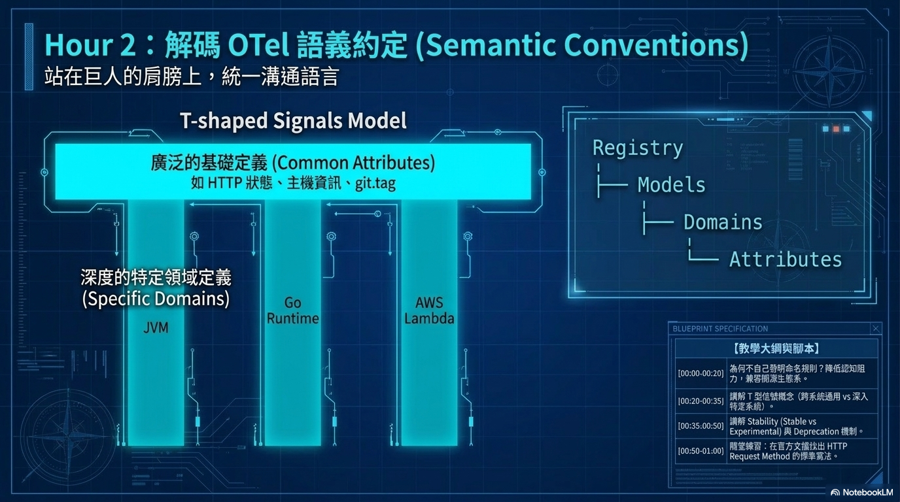

# 第五章：Weaver 模板系統

> 本章完整介紹 weaver.yaml 設定檔的所有欄位、jq filter 語法、Jinja2 模板語言在 Weaver 中的所有內建 filter，並提供 Go、Python、Markdown 的完整可執行模板範例。

---

## 5.1 模板系統的完整結構

要用 `weaver registry generate` 生成程式碼，需要以下兩種檔案：

```
templates/
└── <target>/                  # target 名稱任意，執行時作為參數傳入
    ├── weaver.yaml            # 模板設定檔（必要）
    └── *.j2                   # Jinja2 模板檔案（一或多個）
```

執行指令格式：

```bash
weaver registry generate \
  --registry ./telemetry/registry \
  --templates ./templates \
  <target>              # 對應 templates/<target>/ 目錄名稱
  ./output_dir          # 輸出目錄（選填，預設為 output/）
```

---

## 5.2 `weaver.yaml` — 模板設定檔完整說明

```yaml
# templates/go/weaver.yaml

# 控制 Jinja2 的空白處理行為
whitespace_control:
  trim_blocks: true    #  後的換行符號自動移除（讓輸出更乾淨）
  lstrip_blocks: true  #  前的縮排空格自動移除

# 模板列表（每個項目描述一個「模板 → 輸出」的映射）
templates:
  - template: semconv_attrs.go.j2   # 對應同目錄下的 .j2 檔
    filter: >
      .groups
      | map(select(.type == "attribute_group" or .type == "span"))
      | map(.attributes[])
      | unique_by(.name)
      | sort_by(.name)
    application_mode: single        # single 或 each
    file_name: "semconv_attrs.go"   # 輸出的檔名

  - template: semconv_metrics.go.j2
    filter: >
      .groups
      | map(select(.type == "metric"))
      | sort_by(.metric_name)
    application_mode: single
    file_name: "semconv_metrics.go"
```

### `whitespace_control` 選項

| 選項 | 說明 | 建議 |
|------|------|------|
| `trim_blocks: true` | `` 標籤後的第一個換行符號自動刪除 | 通常設為 true，否則生成的程式碼會有多餘空行 |
| `lstrip_blocks: true` | `` 標籤前的縮排空格自動刪除 | 通常設為 true |

### `application_mode` 的差異

| 值 | 行為 | 適用場景 |
|----|------|---------|
| `single` | filter 結果（整個 ctx）一次渲染成**一個**輸出檔 | 所有屬性彙總到一個 `semconv_attrs.go` |
| `each` | filter 結果是陣列，**每個元素**各自渲染成一個檔 | 每個 metric group 各自生成一個 `<metric_name>.go` |

`each` 模式下，`file_name` 可用 Jinja2 表達式動態命名：

```yaml
- template: per_metric.go.j2
  filter: >
    .groups
    | map(select(.type == "metric"))
  application_mode: each
  file_name: "{{ ctx.metric_name | snake_case }}.go"
  # 例如：payment_amount.go, cart_value.go
```

---

## 5.3 `filter` — jq 語法說明

`filter` 是一段 **jq** 語法，輸入是完整的 registry JSON（`{"groups": [...], "registry_url": "..."}`），輸出就是模板裡的 `ctx`。

### 常用 filter 模式

```yaml
# 取出所有 groups
filter: .groups

# 只取 metric groups，並按 metric_name 排序
filter: >
  .groups
  | map(select(.type == "metric"))
  | sort_by(.metric_name)

# 取出所有 attribute_group 和 span 的屬性，去重後排序
filter: >
  .groups
  | map(select(.type == "attribute_group" or .type == "span"))
  | map(.attributes[])
  | unique_by(.name)
  | sort_by(.name)

# 只取特定命名空間的 group
filter: >
  .groups
  | map(select(.id | startswith("span.payment")))

# 取出所有 enum 型別的屬性（用於生成常數列舉）
filter: >
  .groups
  | map(.attributes[])
  | flatten
  | unique_by(.name)
  | map(select(.type | type == "object"))
  | map(select(.type.members != null))

# 整個 registry 物件（用於需要多種 group 類型的模板）
filter: .
```

### 實際 ctx 結構對照

```json
// filter: .groups | map(.attributes[]) | unique_by(.name)
// → ctx 是 attribute 物件的陣列
[
  {
    "name": "cart.item_id",
    "type": "string",
    "brief": "加入購物車的商品 SKU",
    "requirement_level": "required",
    "stability": "stable",
    "examples": ["SKU-001", "SKU-002"]
  }
]

// filter: .groups | map(select(.type == "metric"))
// → ctx 是 metric group 的陣列
[
  {
    "id": "metric.payment.amount",
    "type": "metric",
    "metric_name": "payment.amount",
    "instrument": "histogram",
    "unit": "{TWD}",
    "brief": "每筆支付的金額分佈",
    "stability": "stable",
    "attributes": [...]
  }
]
```

---

## 5.4 Jinja2 模板語法

Weaver 使用標準 Jinja2 語法（``）。

### 基本迴圈與條件

```jinja2
{# 迭代屬性列表 #}

// {{ attr.name }} → {{ attr.brief }}


{# 條件判斷 #}

// 這是 metric，有 instrument: {{ group.instrument }}

// 這是 span，有 span_kind: {{ group.span_kind }}

// 其他類型


{# 巢狀迭代：遍歷每個 group 的屬性 #}


// {{ group.id }}.{{ attr.name }}: {{ attr.brief }}


```

### Weaver 內建的命名轉換 filter

這些 filter 專門處理 `payment.order_id` 這類帶 `.` 的屬性名稱：

| Filter | 輸入 `payment.order_id` | 輸出 |
|--------|------------------------|------|
| `screaming_snake_case` | `payment.order_id` | `PAYMENT_ORDER_ID` |
| `snake_case` | `payment.order_id` | `payment_order_id` |
| `pascal_case` | `payment.order_id` | `PaymentOrderId` |
| `camel_case` | `payment.order_id` | `paymentOrderId` |
| `lower_case` | `Payment.Order_ID` | `payment.order_id` |
| `upper_case` | `payment.order_id` | `PAYMENT.ORDER_ID` |

```jinja2
{# Go 常數名稱 #}
const {{ attr.name | screaming_snake_case }} = attribute.Key("{{ attr.name }}")
{# → const PAYMENT_ORDER_ID = attribute.Key("payment.order_id") #}

{# Python 常數名稱 #}
{{ attr.name | screaming_snake_case }}: str = "{{ attr.name }}"
{# → PAYMENT_ORDER_ID: str = "payment.order_id" #}

{# Metric 常數（metric_name 有 . 分隔）#}
{{ metric.metric_name | screaming_snake_case }}_NAME = "{{ metric.metric_name }}"
{# → PAYMENT_AMOUNT_NAME = "payment.amount" #}
```

### 其他常用 Jinja2 操作

```jinja2
{# 字串測試 #}
✅⬜

{# 陣列排序 #}


{# 判斷是否有 examples #}

// Examples: {{ attr.examples | join(", ") }}


{# 跳脫字元 #}
{{ attr.brief | e }}   {# HTML escape，用於 HTML 輸出 #}

{# 除錯：dump ctx 結構（暫時用）#}
{{ ctx | tojson }}
```

---

## 5.5 完整的 Go 模板範例

### `templates/go/weaver.yaml`

```yaml
whitespace_control:
  trim_blocks: true
  lstrip_blocks: true

templates:
  - template: semconv_attrs.go.j2
    filter: >
      .groups
      | map(select(.type == "attribute_group" or .type == "span"))
      | map(.attributes[])
      | unique_by(.name)
      | sort_by(.name)
    application_mode: single
    file_name: "semconv_attrs.go"

  - template: semconv_metrics.go.j2
    filter: >
      .groups
      | map(select(.type == "metric"))
      | sort_by(.metric_name)
    application_mode: single
    file_name: "semconv_metrics.go"
```

### `templates/go/semconv_attrs.go.j2`

```jinja2
// Code generated by Weaver. DO NOT EDIT.
package semconv

import "go.opentelemetry.io/otel/attribute"

// ─── Attribute Keys ───────────────────────────────────────────────────────────

// {{ attr.name | screaming_snake_case }}: {{ attr.brief }}
// type={{ attr.type }} stability={{ attr.stability }} requirement={{ attr.requirement_level }}
const {{ attr.name | screaming_snake_case }} = attribute.Key("{{ attr.name }}")

```

### `templates/go/semconv_metrics.go.j2`

```jinja2
// Code generated by Weaver. DO NOT EDIT.
package semconv

// ─── Metric Constants ─────────────────────────────────────────────────────────

// {{ metric.metric_name }}: {{ metric.brief }}
// instrument={{ metric.instrument }} unit={{ metric.unit }}
const {{ metric.metric_name | screaming_snake_case }}_NAME = "{{ metric.metric_name }}"
const {{ metric.metric_name | screaming_snake_case }}_UNIT = "{{ metric.unit }}"
const {{ metric.metric_name | screaming_snake_case }}_DESC = "{{ metric.brief }}"


```

---

## 5.6 完整的 Python 模板範例

### `templates/python/weaver.yaml`

```yaml
whitespace_control:
  trim_blocks: true
  lstrip_blocks: true

templates:
  - template: semconv_attrs.py.j2
    filter: >
      .groups
      | map(select(.type == "attribute_group" or .type == "span"))
      | map(.attributes[])
      | unique_by(.name)
      | sort_by(.name)
    application_mode: single
    file_name: "semconv_attrs.py"

  - template: semconv_metrics.py.j2
    filter: >
      .groups
      | map(select(.type == "metric"))
      | sort_by(.metric_name)
    application_mode: single
    file_name: "semconv_metrics.py"
```

### `templates/python/semconv_attrs.py.j2`

```jinja2
# Code generated by Weaver. DO NOT EDIT.
"""屬性常數 — 由 Weaver 從 telemetry/registry 自動生成"""
from __future__ import annotations


# {{ attr.name | screaming_snake_case }}: {{ attr.brief }}
# type={{ attr.type }} | stability={{ attr.stability }}
{{ attr.name | screaming_snake_case }}: str = "{{ attr.name }}"

```

### `templates/python/semconv_metrics.py.j2`

```jinja2
# Code generated by Weaver. DO NOT EDIT.
"""Metric 常數 — 由 Weaver 從 telemetry/registry 自動生成"""
from __future__ import annotations


# {{ metric.metric_name }}: {{ metric.brief }}
# instrument={{ metric.instrument }} | unit={{ metric.unit }}
{{ metric.metric_name | screaming_snake_case }}_NAME: str = "{{ metric.metric_name }}"
{{ metric.metric_name | screaming_snake_case }}_UNIT: str = "{{ metric.unit }}"
{{ metric.metric_name | screaming_snake_case }}_DESC: str = "{{ metric.brief }}"


```

---

## 5.7 Markdown 文件模板範例

### `templates/docs/weaver.yaml`

```yaml
whitespace_control:
  trim_blocks: true
  lstrip_blocks: true

templates:
  - template: telemetry.md.j2
    filter: >
      .groups
      | map(select(.type == "metric" or .type == "span"))
      | sort_by(.id)
    application_mode: single
    file_name: "docs/telemetry.md"
```

### `templates/docs/telemetry.md.j2`

```jinja2
# 遙測規格文件

> 本文件由 Weaver 自動生成，請勿手動修改。
> 最後更新：由 `weaver registry generate docs` 指令重新生成。

## 目錄


- [{{ group.id }}](#{{ group.id | replace(".", "-") }})


---


<a name="{{ group.id | replace(".", "-") }}"></a>
## {{ group.id }}

**{{ group.brief }}**


- **類型**：Span
- **Kind**：`{{ group.span_kind }}`

- **類型**：Metric
- **Metric Name**：`{{ group.metric_name }}`
- **Instrument**：`{{ group.instrument }}`
- **Unit**：`{{ group.unit }}`

- **Stability**：`{{ group.stability }}`

### 屬性

| 屬性名稱 | 類型 | 必填 | 說明 |
|---------|------|------|------|


| `{{ attr.name }}` | `{{ attr.type }}` | 必填 | {{ attr.brief }} |

| `{{ attr.name }}` | `{{ attr.type }}` | 建議 | {{ attr.brief }} |

| `{{ attr.name }}` | `{{ attr.type }}` | 選填 | {{ attr.brief }} |




```

---

## 5.8 執行生成並驗證

```bash
# 生成 Go 程式碼
weaver registry generate \
  --registry ./telemetry/registry \
  --templates ./templates \
  go ./generated_from_template

# 生成 Python 程式碼
weaver registry generate \
  --registry ./telemetry/registry \
  --templates ./templates \
  python ./generated_from_template

# 生成 Markdown 文件
weaver registry generate \
  --registry ./telemetry/registry \
  --templates ./templates \
  docs ./

# 預期輸出：
# ✔ Generated file "./generated_from_template/semconv_attrs.go"
# ✔ Generated file "./generated_from_template/semconv_metrics.go"
# ✔ Artifacts generated successfully
```

---

## 5.9 偵錯技巧

### 技巧一：用 `{{ ctx | tojson }}` 確認 filter 輸出

```jinja2
{# 暫時加這行到模板頭部，確認 filter 給的 ctx 長什麼樣 #}
{{ ctx | tojson }}
```

執行 generate 後查看輸出檔案，確認 ctx 的 key 名稱與你在模板中使用的一致。

### 技巧二：用 `--debug` 查看詳細執行過程

```bash
weaver registry generate \
  --registry ./telemetry/registry \
  --templates ./templates \
  --debug \
  go ./generated_from_template
```

### 技巧三：用 jq 手動測試 filter

```bash
# 先把 registry resolve 成 JSON
weaver registry resolve \
  --registry ./telemetry/registry \
  --format json > /tmp/registry.json

# 然後用 jq 測試 filter
cat /tmp/registry.json | jq '.groups | map(select(.type == "metric")) | sort_by(.metric_name)'
```

---

## 5.10 常見錯誤對照

| 錯誤訊息 | 原因 | 解法 |
|---------|------|------|
| `undefined value` | 存取 ctx 上不存在的欄位（如 `attr.id`，應為 `attr.name`）| 用 `tojson` dump ctx 確認欄位名稱 |
| `too many arguments` | filter 函式呼叫格式錯誤 | 移除不支援的 filter（如 `truncate`）|
| 生成成功但輸出目錄空白 | filter 輸出為空陣列（select 沒有匹配到任何元素）| 確認 filter jq 語法，用 `--debug` 查看 |
| 輸出有多餘空行 | `whitespace_control` 未設定 | 在 weaver.yaml 加上 `trim_blocks: true` |
| `No such file or directory` | template 檔案路徑錯誤 | 確認 .j2 檔存在於 templates/<target>/ 目錄 |

---

## 延伸閱讀

- [Jinja2 官方文件](https://jinja.palletsprojects.com/en/3.1.x/)
- [jq 手冊](https://jqlang.github.io/jq/manual/)
- [Weaver 模板範例庫](https://github.com/open-telemetry/weaver-templates)
