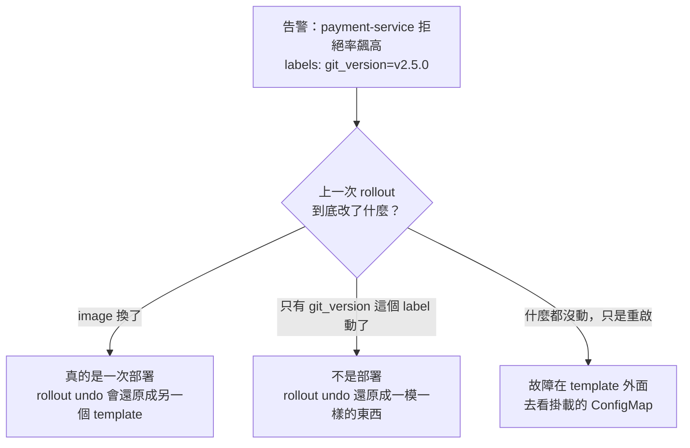
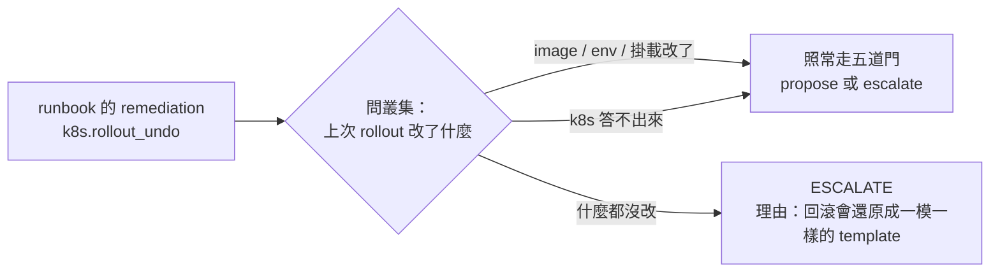

# Day35：一個對的診斷，配一個沒用的處置

> 它說對了原因
> 然後提議了一個
> 就算執行也不會有用的處置
> 而報表上這叫做一次成功的調查

昨天收在「空結果被機器擋住，而不是被一段 prompt 拜託不要走」。今天這篇是同一句話的下一個版本，只是這次被擋住的不是證據，是**動作**。

事情是從標註那批舊調查開始的。前面講校準那天說過，能填 `correct` 那個欄位的只有兩種來源，人或是在已知答案的題目上機械評分的 grader。我把七筆答案還原得回來的調查標完，錯的五筆裡有四筆是同一種錯法，而那個錯法我完全沒有預料到。

程式碼在範例 repo [`OTel_AIOps_Agent`](https://github.com/tedmax100/OTel_AIOps_Agent) 的 [`ironman-2026/day35/`](https://github.com/tedmax100/OTel_AIOps_Agent/tree/main/ironman-2026/day35)。指令都假設從 `aiops-agent/service/` 底下跑。

## 四次都怪同一個東西

那四筆的結論長得幾乎一樣：「`payment-service` 版本 x 的程式碼有 regression」。信心分別是 0.95、0.95、0.95、0.95。

而它們的共同點不是故障，是**告警上帶著一個 `git_version` 標籤**。

其中三筆是演習，劇本我自己寫的：壞掉的 flag 放進那份**沒有被改過的 pod template 所掛載的 ConfigMap**。第四筆是我自己在某個下午弄出來的事故，做法更單純，我沒有部署任何東西，只是把 ConfigMap 裡的 flag 翻成 true，再重啟 payment。

四次它都說是部署造成的。而四次都不是。

這件事嚴重在哪，看它建議的處置就知道：`rollout undo`。那個動作會忠實地把 pod template 還原成前一版，而故障根本不在 template 裡，症狀不會有任何變化。**值班的人會照著做，然後看著拒絕率一動也不動，開始懷疑自己是不是漏了什麼。**

## 這套 demo 裡，版本號是一個 label

回頭查那個 deployment 的歷史，答案有點難堪：

```
rev  git_version  image
68   v2.4.1       demo-services/payment:dev
69   v2.5.0       demo-services/payment:dev
70   v2.5.0       demo-services/payment:dev
71   v2.5.0       demo-services/payment:dev
```

四個 revision 跑的是同一個 image。`git_version` 是 pod template 上的一個標籤，不是一個不同的 build，所以「回滾到上一版」在這套環境裡不會改變任何跑起來的東西。

這是 demo 環境的簡化，真實的部署當然會換 image。但它把一個真實的問題放大得很清楚：**agent 是從標籤推論「這是一次部署」，而不是從「什麼真的變了」。** 換成一個會換 image 的環境，這個推論仍然有一半的時候是錯的——config 型的故障在真實系統裡一點都不罕見，flag、ConfigMap、外部設定中心，全都不在 pod template 裡。

從告警的角度看，這三種形狀完全一樣：



`agent` 手上原本沒有任何工具回答得了圖裡那個菱形。它有 `k8s_deployment_status`，那支回答的是「這次部署有沒有健康地跑起來」，是另一個問題。

## 第一次修法：把答案放在它拿得到的地方

於是加了一支唯讀的工具 `k8s_change_provenance`，做的事情只有一件：把最近幾個 ReplicaSet 的 pod template 拿出來比對。

比對的欄位刻意選得很窄——image、env、掛載的 ConfigMap 與 Secret。不做逐欄位的完整 diff，因為 `kubectl rollout restart` 會寫一個時間戳註記，逐欄位比會每次都報「有變化」，而那句話等於沒說。

它回的是一句話：

```
verdict: the last rollout changed nothing the process runs (at most a version label
or a restart). If behaviour changed, the cause is outside the template — check the
mounted config: configMap/payment-flags
```

加完工具，把同一個事故重造一次，發 webhook 讓它跑。這一次它的結論是：

> **A configuration change in the `payment-flags` ConfigMap enabled a new validation rule** … `k8s_change_provenance` confirms that the recent rollouts (revisions 70–73) did not involve code changes (the image remained `demo-services/payment:dev`)

同一個事故、同一組帶著 `git_version` 的告警，上一輪說是 code regression，這一輪說是 ConfigMap。而且它把工具那句話原樣引用進了結論。

看到這裡我以為今天就到這了。

## 但處置沒有跟著診斷走

同一份輸出往下捲，治理決策那一段寫著：

```
governance action=k8s.rollout_undo -> propose (high confidence but action is approval-gated)
```

它一邊說原因在 ConfigMap，一邊還是提議回滾。

原因不在模型，在 runbook。那份 `payment-bad-deploy.yaml` 的 remediation 是寫死的：

```yaml
remediation:
  - desc: Roll back payment-service to the previous version
    action: k8s.rollout_undo
```

**runbook 是照著告警匹配的，不是照著結論挑的。** 匹配的條件是 alertname 加 service，而那三種形狀的告警一模一樣，所以無論它查出什麼，端出來的處置都是同一個。診斷那條線修好了，處置那條線完全沒有動。

而這種錯法比診斷錯更難發現：報告寫得漂亮、原因也對，錯的只有最後那一格，而那一格正好是唯一會被執行的東西。

## 第二次修法：提議之前，先問叢集

所以加的第二層不在模型那邊，在提議動作的路徑上。在把 runbook 的 remediation 送進治理決策之前，先問一次叢集：這個動作在這裡有沒有可能有用。

規則目前只有一條，而它就是上面那個發現：**當最近幾次 rollout 沒有改變任何跑起來的東西，`rollout undo` 就是不適用的**，因為它會還原一個一模一樣的 template。



三件事值得說明。

第一，**這道檢查不看信心分數**。信心講的是「我對這個診斷有多確定」，適用性講的是「這個處置有沒有可能有用」，那是兩個不同的問題，而且後者不歸模型管。所以 0.95 也好、1.0 也好，一樣擋。

第二，它問的是叢集，不是那份報告的文字。如果去解析結論裡有沒有「ConfigMap」這個詞，那就等於又把判斷交回給模型的文筆。

第三，**k8s 答不出來的時候不擋**。fail-closed 在這裡是錯的：k8s 一安靜就把所有提議都吃掉，而那正是值班的人最需要它們的時候。

## 再跑一次，然後拿到一個更好的結果

改完部署，同一個事故再發一次 webhook。這一次它的結論是：

```
headless RCA done conf=0.90: Code regression in payment-service v2.5.0 causing a
spike in declined charges due to a new_validator reason.
```

**它又說錯了。** 而且這一次它從頭到尾沒有呼叫那支新工具（我去數了 `list_namespaced_replica_set` 的呼叫次數，零次）。

但治理那一段是這樣的：

```
governance action=k8s.rollout_undo -> escalate
  (the cluster says the last rollouts changed nothing the process runs, so a rollback
   restores an identical pod template; the mounted config (configMap/payment-flags)
   is where the change is)
```

兩次跑並排看：

| | 有沒有用那支工具 | 診斷 | 提議的動作 |
| --- | --- | --- | --- |
| 第一次 | 有，還引用了它的原話 | ✅ ConfigMap 造成的 | ⚠️ `rollout_undo → propose` |
| 第二次 | 沒有 | ❌ 又說成 v2.5.0 的 code regression | ✅ `rollout_undo → escalate` |

同一個事故、同一份 prompt、同一個工具清單，兩次的行為不一樣。

這張表是今天最該帶走的東西。**加一個工具，只是把正確答案放在它拿得到的地方，它拿不拿是機率問題；而那道在提議之前直接去問叢集的檢查，兩次都成立。** 兩件事都做了才是完整的，但如果只能做一件，要做的是後面那件。

順帶一提，第二次那個「診斷錯但動作對」的組合，在報表上會長成一次很奇怪的紀錄：結論是錯的，處置是安全的，值班的人拿到的是一句「這件事我建議升級給人看，因為回滾在這裡沒有用」。那句話本身是對的，而且它比那份漂亮的錯誤報告有用得多。

## 這對值班的人有什麼差別

半夜被叫起來的時候，人最沒有的東西是時間，而最容易被浪費時間的方式，就是照著一份看起來很有把握的建議做了一件沒有用的事。

那不只是浪費五分鐘。做完之後症狀沒變，人的第一個反應不是「這個建議是錯的」，是「那我是不是漏看了什麼」，於是接下來十分鐘會拿去重新查一遍已經查過的東西。**一個沒用的處置，成本不是它自己，是它讓人開始懷疑所有其他判斷。**

反過來說，那句 escalate 的理由是可以直接讀的：回滾會還原成一模一樣的 template，去看那個 ConfigMap。它沒有替人做決定，但它把人省下來的那一步指出來了。

## 今天沒做的事

- **規則只有一條。** 目前只認得「rollout undo 遇上沒動過的 template」。scale 遇到不是資源問題的事故、flag 改寫遇到根本沒有那個 flag 的服務，都還沒有對應的檢查。
- **runbook 還是照告警匹配的。** 真正乾淨的做法是讓 remediation 跟著診斷的形狀挑，而不是事後擋掉一個。那要 runbook 的資料結構先支援分支。
- **兩次跑不是一個樣本數。** 「模型有時候會用那個工具、有時候不會」這件事我只看到兩次，沒有量過比例。要量得跑一整批，而那要錢。
- **`suspected_version` 那個欄位還是 v2.5.0。** 就算它在正文裡說對了是 ConfigMap，結構化欄位還是填了版本號。下游要是有人只讀那個欄位，一樣會被誤導。

## 小結

總結來說，今天做的事是把「這個處置有沒有可能有用」從模型手上拿走，交給一次唯讀的叢集查詢。這件事的價值不在它讓 agent 變聰明，它沒有；價值在於就算 agent 這一輪表現不好，那個會被執行的東西還是安全的。

比較意外的收穫是那兩次跑的對照。我本來是想證明「加了工具就會答對」，結果第二次直接打臉，反而證明了另一件更重要的事：**能被驗證的規則要放在確定性那一層，不要指望勸模型。** 這句話這三十幾天講過三次了，一次是空結果不能當證據，一次是停止條件不能問模型，這是第三次。

> 我本來把這篇的標題想成「幫 agent 補上它缺的那個工具」。
> 寫到一半發現真正有效的那半根本不在模型這邊，只好改標題 XD
