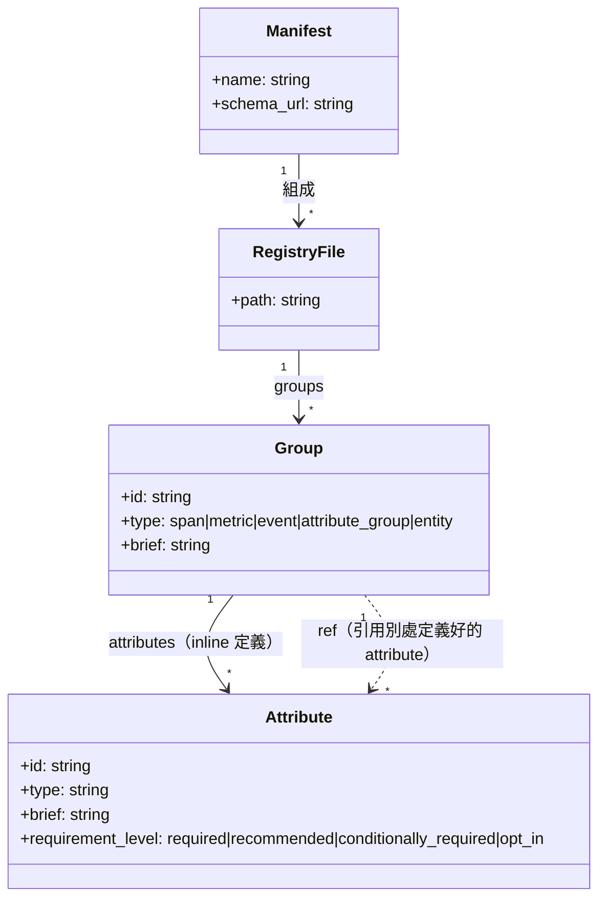
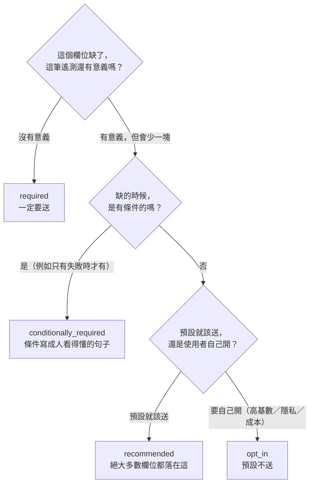
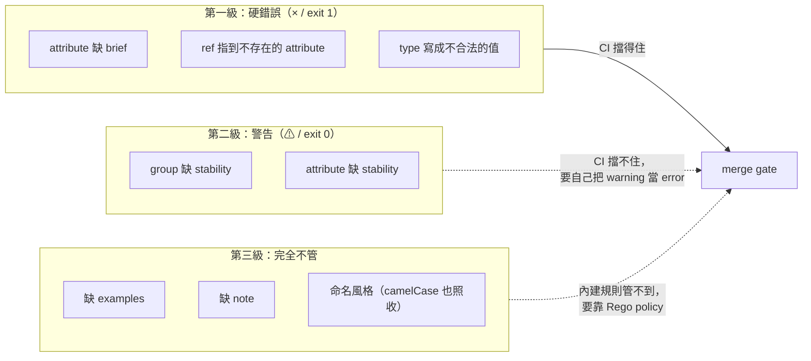
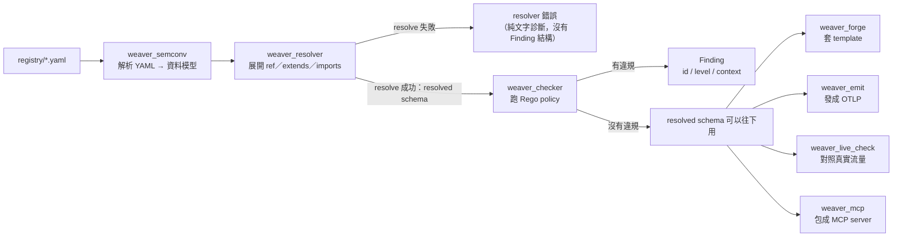
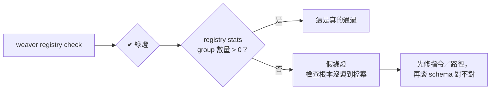

# Day7：Weaver 基礎知識——為什麼 telemetry 需要 schema

今天不碰 `demo-services` 的程式碼，但會跑指令——不是對付正式服務，是對著幾份最小的示範 registry 跑 `weaver registry check`，把 `group` 的幾種 `type` 長什麼樣、寫錯會發生什麼事，一個一個真的驗證過一次。Day1 已經示範過一次「沒有治理會長成什麼樣子」（`userId` 混 `user.id`、span name 沒語意），Day8 開始要動手用 Weaver 去攔這些問題——但在動手之前，先把「為什麼要有 schema」「Weaver 這個工具內部到底在做什麼」這兩件事講清楚，讓接下來好幾天的動手做，是在對照一張已經畫好的地圖，而不是邊做邊發明新名詞。

今天用到的七份範例 registry 跟真實跑出來的輸出都放在 submodule 的 [`day07/`](https://github.com/tedmax100/OTel_AIOps_Agent/tree/main/day07)（`examples/` 底下），這裡直接講重點跟真實輸出。

## 為什麼 telemetry 需要 schema

先講清楚一個容易混淆的地方：這裡的「schema」不是資料庫 schema（表結構、欄位型別、外鍵），是**團隊對「這個 span/metric/attribute 叫什麼、代表什麼、必不必填」的共識**。

Day1 那個反面教材的問題，本質上不是「程式碼寫錯」——`userId` 這個 attribute name 完全是合法的字串，不會讓任何 SDK 報錯，服務照樣正常運作、trace 照樣送得出去。問題在於：這個共識只存在於寫這段程式碼的人腦中，沒有被寫下來、沒有被檢查。等到第二個服務也要記錄使用者 ID，寫的人不知道團隊已經有 `user.id` 這個慣例（甚至不知道「慣例」這件事存在），於是又造了一個新名字。多個服務、多個名字、同一個語意——這時候想在 Grafana 上做一個跨服務的查詢，才發現要嘛全部改名重新部署，要嘛在查詢語法裡手動兼容五種寫法。

OpenTelemetry 官方為此定義了一套 **semantic convention**（語意慣例）：`http.method`、`db.system`、`service.name` 這類跨語言、跨服務都該長一樣的欄位名稱與型別規範。但光有官方那份是不夠的——每個團隊都有自己的業務語意（`payment.amount`、`order.status` 這種官方慣例不會涵蓋的欄位），這些自訂欄位一樣需要被治理，否則會重演 Day1 的故事，只是換成公司內部版本。

**Registry** 就是把這些 semantic convention（不管是官方的還是團隊自訂的）組織起來、可以被驗證、可以被查詢、可以拿去生成文件與程式碼的容器。而 **Weaver** 是操作這個容器的工具——它不是又一個 collector、不是又一個 SDK，它的角色更接近「telemetry schema 的編譯器與檢查器」。

## 具體長什麼樣：同一個欄位，有沒有 schema 的差別

先不談工具，只看資料本身。Day1 那個服務沒有 schema 時，`api-gateway` 送出去的 span attribute 大概長這樣——一個合法、能跑、但沒有任何附加語意的 key-value：

```json
{
  "span_name": "POST /api/orders",
  "attributes": {
    "userId": "u-5"
  }
}
```

這個 attribute 完全合法，SDK 不會抱怨，Grafana 查得到，trace 送得出去——但沒有人知道「這個欄位以後永遠都叫 `userId`」還是「這只是這個服務這次剛好這樣寫」。有沒有 schema 的差別，不在資料本身（兩種情況下 span 都送得出去），而在**有沒有一份獨立於程式碼之外、機器可讀的宣告**，講清楚這個欄位該叫什麼、什麼型別、必不必填。用 registry 的語言，這個宣告長這樣：

```yaml
# 這是「宣告」，不是程式碼——它不會讓 span 自動變成這樣，
# 但它讓 weaver 有東西可以拿來對照、檢查
groups:
  - id: span.order.create
    type: span
    span_kind: server
    brief: "建立訂單的 Span"
    stability: development   # 沒填這行，weaver 會警告「缺 stability」
    attributes:
      - id: user_id          # 團隊共識：一律用 snake_case
        type: string
        brief: "下單使用者的識別碼"
        examples: ["u-5"]
        requirement_level: required
        stability: development
```

這份 YAML 不是紙上談兵，真的存成檔案、配一份 `manifest.yaml`，拿 `weaver registry check` 跑一次（指令在 `day07/examples/` 底下跑，`-r` 後面接的是那份 registry 的目錄名——**不要寫成 `-r .`**，原因在本文最後一節「一個會騙人的綠燈」會專門講，那是我這次踩到最值得記一筆的坑）：

```
$ weaver registry check -r span-only
Weaver Registry Check
Checking registry `span-only`
ℹ Found registry manifest: span-only/manifest.yaml
✔ No `after_resolution` policy violation

Total execution time: 0.006877529s
```

乾淨通過。值得一提：第一次寫這份 YAML 時漏掉了 `stability` 這個欄位，weaver 沒有直接判失敗，而是印出兩條警告——`Invalid stability on group ... does not contain a stability field` 跟 attribute 那條一模一樣的警告，離開碼還是 0（warning 不算 violation）。這是 weaver 自己內建的驗證規則，不需要額外寫 Rego policy 就會提醒；上面這份是補上 `stability: development` 之後的乾淨版本。`stability` 是 OpenTelemetry semconv 的標準欄位，標記這個定義目前處在 `development`（還會變動）還是 `stable`（承諾不再變動）——Day14 講 breaking change 時會更仔細講這個欄位的作用。

同一個「使用者 ID」，程式碼裡怎麼寫（`userId` 還是 `user_id`）跟這份宣告怎麼寫，是兩件獨立的事——**Weaver 檢查的是宣告本身，以及宣告跟宣告之間會不會打架**，它不會直接讀取 `api-gateway` 的原始碼。Day8 會實際示範：如果程式碼跟宣告對不上，是靠哪個指令、在哪個階段抓出來。今天先記住這兩者的分工：程式碼負責「送」，registry 負責「講清楚該送什麼」。

上面那份 YAML 的巢狀結構，畫成圖是這樣（`manifest.yaml` 是整個 registry 的門面，底下可以拆成任意多個 YAML 檔，每個檔案裡放任意多個 group，一個 group 裡放任意多個 attribute，`ref` 則是讓不同 group 共用同一個 attribute 定義、不必重複寫兩次）：



`ref` 那條虛線是今天最值得記住的一個設計：`common.yaml` 裡定義一次 `deployment.environment`，`order.yaml`/`payment.yaml` 各自的 span 都可以用 `ref: deployment.environment` 引用，不必每個 group 重寫一次型別/brief/examples。這也是 Day13 要講的 registry 重用機制的雛形，今天先知道這個關係存在就好。

## `group` 到底是什麼：五種 `type`，各一個範例

上面的 `classDiagram` 把 `group` 畫成「registry 裡最基本的定義單位」，但只示範了 `span` 這一種。實際上一份 registry 是一堆 `group` 的集合，每個 `group` 用 `type` 欄位宣告自己在描述哪一種東西——同一份 registry 裡混著不同 `type` 的 group 是常態，不是例外。之後幾天會陸續碰到的幾種：

**`span`** —— 一個 trace span 該有哪些 attribute（就是前面驗證過的那份，跑法一樣不重複貼）。

**`metric`** —— 定義一個 metric，Day8 會實際用到：

```yaml
groups:
  - id: metric.app.orders.count
    type: metric
    metric_name: app.orders.count
    instrument: counter        # counter / histogram / updowncounter / gauge
    unit: "{order}"
    brief: "訂單建立總數"
    stability: development
    attributes:
      - ref: app.outcome
```

這份單獨拿去跑會失敗——`ref: app.outcome` 指到一個這個檔案裡完全沒定義的 attribute：

```
$ weaver registry check -r metric-dangling-ref
Weaver Registry Check
Checking registry `metric-dangling-ref`
ℹ Found registry manifest: metric-dangling-ref/manifest.yaml

Diagnostic report:

  × The following attribute reference is not resolved for the group
  │ 'metric.app.orders.count'.
  │ Attribute reference: app.outcome
  │ Provenance: Some(Provenance { schema_url: SchemaUrl { url: "https://
  │ example.com/schemas/day7-metric-dangling-ref/0.1.0", name_range: 8..52,
  │ version_range: 53..58 }, path: "metric-dangling-ref/metric.yaml" })

$ echo $?
1
```

這正是今天前面「Weaver 內部」那張管線圖畫的 resolver 錯誤——沒有 Finding 結構，因為根本還沒輪到 checker。要讓這份檔案真的能跑，`app.outcome` 得在某個地方（同檔案或別的檔案都可以）先被定義出來，這件事下面 `attribute_group` 範例做完之後會補上。

**`attribute_group`** —— 不是一個 signal（不是 span 也不是 metric），單純是一包共用屬性，讓別的 group 用 `ref` 引用、避免重複定義。上面圖裡那個 `deployment.environment` 就放在這種 group 底下：

```yaml
groups:
  - id: common.resource
    type: attribute_group
    brief: "跨服務通用的資源屬性"
    stability: development
    attributes:
      - id: deployment.environment
        type: string
        brief: "服務部署環境"
        examples: ["production", "staging"]
        stability: development
```

單獨測試乾淨通過：

```
$ weaver registry check -r attribute-group
✔ No `after_resolution` policy violation
Total execution time: 0.007216561s
```

**`event`** —— 定義一個 log event，Day13 會實際寫一份：

```yaml
groups:
  - id: event.payment.audit
    type: event
    name: payment.audit
    brief: "支付狀態變更的稽核 log event"
    stability: development
    attributes:
      - id: payment.audit.action
        type: string
        brief: "稽核的支付動作"
        examples: ["authorize", "capture", "refund"]
        requirement_level: required
        stability: development
```

這份第一次寫的時候漏掉了 `payment.audit.action` 的 `brief`，跑出來直接是**硬錯誤**（跟前面 `span` 缺 `stability` 只印警告不一樣）：

```
$ weaver registry check -r event
Diagnostic report:

  × Invalid attribute definition detected while resolving 'event.yaml'
  │ (group_id='event.payment.audit', attribute_id='payment.audit.action').
  │ This attribute is not deprecated and does not contain a brief field.

exit=1
```

補上 `brief` 之後（就是上面貼的版本）才會乾淨通過。這是個值得記住的區分：`stability` 缺了只警告，`brief` 缺了直接判失敗——weaver 內建的驗證規則對不同欄位的嚴格程度不一樣，不是每個缺漏都同等對待。

**`entity`** —— 定義一個「東西」的身份（例如一個 k8s pod、一個邏輯服務），Day8 會用到：

```yaml
groups:
  - id: entity.k8s.pod
    type: entity
    name: k8s.pod
    brief: "Kubernetes Pod 實體"
    stability: development
    attributes:
      - id: k8s.pod.name
        type: string
        brief: "Pod 名稱"
        examples: ["payment-7d9f-abc"]
        requirement_level: required
        stability: development
```

跟 `event` 一樣，第一版漏了 attribute 的 `brief` 也是直接失敗，補上之後乾淨通過：

```
$ weaver registry check -r entity
✔ No `after_resolution` policy violation
Total execution time: 0.007200653s
```

不管 `type` 是哪一種，結構上都是「一個 group 底下掛一堆 attribute」，差別只在 `type` 決定了這份宣告在描述 signal 本身（`span`/`metric`/`event`）、還是純粹共用的一包屬性（`attribute_group`）或身份（`entity`）。`weaver_semconv` 這個 crate（見下一節）解析的就是這五種 `type` 各自的資料模型。

有一個地方值得特別點出來：`groups:` 這個 key 本身是**一個 list**，不是「一個檔案只能放一個 group」。上面五個範例每個都只截了單一 group 方便對照 `type` 的差異，但實際寫的時候，同一個檔案通常會混著放好幾個、甚至好幾種不同 `type` 的 group——像 `order.yaml` 可能同時放了 `order` 相關的 span 跟 metric：

```yaml
# order.yaml
groups:
  - id: span.order.create
    type: span
    span_kind: server
    brief: "建立訂單的 Span"
    stability: development
    attributes:
      - ref: deployment.environment
      - id: user_id
        type: string
        brief: "下單使用者的識別碼"
        examples: ["u-5"]
        requirement_level: required
        stability: development

  - id: metric.app.orders.count
    type: metric
    metric_name: app.orders.count
    instrument: counter
    unit: "{order}"
    brief: "訂單建立總數"
    stability: development
    attributes:
      - ref: app.outcome
```

這份 `order.yaml` 用了兩個 `ref`（`deployment.environment`、`app.outcome`），單獨放在自己的資料夾裡跑一定會是 resolver 錯誤——因為這兩個 attribute 都不是在這個檔案裡定義的。把它跟前面 `attribute_group` 那份 `common.yaml`（把 `app.outcome` 也順手定義進去）放進同一個 registry 資料夾，才真的組成一份能通過的 registry：

```yaml
# common.yaml
groups:
  - id: common.resource
    type: attribute_group
    brief: "跨服務通用的資源屬性"
    stability: development
    attributes:
      - id: deployment.environment
        type: string
        brief: "服務部署環境"
        examples: ["production", "staging"]
        stability: development
      - id: app.outcome
        type: string
        brief: "業務操作的終態結果"
        examples: ["created", "declined"]
        stability: development
```

兩個檔案、一份 `manifest.yaml`，放進同一個資料夾跑：

```
$ weaver registry check -r combined
Weaver Registry Check
Checking registry `combined`
ℹ Found registry manifest: combined/manifest.yaml
✔ No `after_resolution` policy violation

Total execution time: 0.007199971s
```

這次乾淨通過——`weaver_resolver` 展開 `order.yaml` 裡的兩個 `ref` 時，去 `common.yaml` 找到了對應的定義，兩個檔案雖然分開寫，`weaver_semconv` 解析的單位卻是整份 `groups:` list 的總和，一個檔案裡有幾個 group、混了幾種 `type`，或者跨幾個檔案，對它來說沒有差別。真正決定「一個檔案該放哪些 group」的，是團隊自己的組織習慣（例如 Day8/Day6 那份 registry 是照 domain 拆檔案：`order.yaml`、`payment.yaml`、`common.yaml`），Weaver 本身不強制。

## 往下一層：attribute 自己也有很多變化

前面五種 `type` 講的是 group 這一層的變化。但實際寫 registry 時，花最多時間拿捏的其實是下一層——每一個 attribute 的 `type` 跟 `requirement_level` 要怎麼填。前面所有範例為了聚焦在 group，attribute 一律都寫 `type: string`，這會給人一個錯覺，好像 registry 只能描述字串。實際上不是。

把常見的幾種變化寫成同一個 span 群組（完整檔案在 [`day07/examples/attr-types/`](https://github.com/tedmax100/OTel_AIOps_Agent/tree/main/day07/examples/attr-types)），一次看完：

```yaml
groups:
  - id: span.order.submit
    type: span
    span_kind: server
    brief: "送出訂單的 Span，示範各種 attribute type"
    stability: development
    attributes:
      # 1) 純量：字串／整數／浮點／布林
      - id: biz.order.id
        type: string
        brief: "訂單識別碼"
        examples: ["ord-1001"]
        requirement_level: required
        stability: development
      - id: app.order.item_count
        type: int
        brief: "訂單內的品項數量"
        examples: [1, 3, 7]
        requirement_level: recommended
        stability: development
      - id: app.order.amount
        type: double
        brief: "訂單金額（以主要貨幣單位計）"
        examples: [99.5, 1200.0]
        requirement_level: recommended
        stability: development
      - id: app.order.is_gift
        type: boolean
        brief: "是否為禮物訂單"
        examples: [true, false]
        requirement_level: opt_in
        stability: development

      # 2) 陣列
      - id: app.order.sku_list
        type: string[]
        brief: "訂單內所有 SKU 的清單"
        examples: [["sku-1", "sku-2"]]
        requirement_level: opt_in
        stability: development

      # 3) enum：把合法值本身寫進 schema
      - id: app.outcome
        type:
          members:
            - id: created
              value: "created"
              brief: "訂單成功建立"
              stability: development
            - id: declined
              value: "declined"
              brief: "支付被拒絕"
              stability: development
            - id: timeout
              value: "timeout"
              brief: "下游逾時"
              stability: development
        brief: "業務操作的終態結果"
        requirement_level: required
        stability: development

      # 4) template：一整族動態 key，共用同一個型別定義
      - id: app.order.tag
        type: template[string]
        brief: "訂單上的自訂標籤，實際 key 形如 app.order.tag.<name>"
        examples: ["vip"]
        requirement_level: opt_in
        stability: development

      # 5) conditionally_required：條件寫成人看得懂的句子
      - id: app.fail_reason
        type: string
        brief: "失敗原因"
        examples: ["insufficient_funds"]
        requirement_level:
          conditionally_required: "當 app.outcome 不是 created 時必填"
        stability: development
```

```
$ weaver registry check -r attr-types
✔ No `after_resolution` policy violation

Total execution time: 0.007269841s
```

有三個地方值得特別停下來看：

**`enum` 把「合法值」也納入治理範圍。** 前面 `common.yaml` 那個 `app.outcome` 只寫 `type: string` 加兩個 `examples`，意思是「這是個字串，長得像 `created`」——但沒有任何東西擋得住有人送 `CREATED`、`Created`、`success`。改寫成 `members` 之後，這三個值變成 schema 的一部分，而不只是文件裡的建議。這件事對 AIOps 的意義更直接：LLM agent 要下 `sum by (app_outcome)` 這種查詢時，`members` 是它唯一能事先知道「這個 label 只會有這三種值」的來源，否則它只能猜，而猜錯的方式通常是憑空生一個看起來很合理的 `success` 出來。

**`template[string]` 是給「一整族 key」用的。** 像 `app.order.tag.vip`、`app.order.tag.wholesale` 這種 key 名本身是動態的，沒辦法一個一個列舉，但型別跟語意是共通的。`template[...]` 讓你定義一次，涵蓋整族。要小心的是這種欄位天生高基數，Day8 那條擋 metric label 的 policy 特別容易在這裡被觸發。

**`requirement_level` 有四級，不是「必填/不必填」二選一。** 這是初次寫 registry 最容易草率帶過的欄位，但它決定了之後 `live-check` 拿真實流量對照時，缺了這個欄位到底算違規還是算正常：



`conditionally_required` 後面接的那個字串不是註解——它會被 `registry generate` 印進文件、也會被 `registry mcp` 餵給 LLM，所以請把條件寫成人（跟模型）看得懂的完整句子，而不是 `see note`。

## 三種嚴格度：不是每個缺漏都同等對待

前面已經零散提過兩次——`stability` 缺了只警告、`brief` 缺了直接失敗。這個差異值得單獨拉出來講，因為它決定了「什麼東西擋得住 CI、什麼東西擋不住」。把 `attr-types` 這份乾淨的範例分別弄壞三次，實際跑出來的結果是這樣：

**缺 `stability`（group 層）——⚠ 警告，但離開碼是 0：**

```
$ weaver registry check -r s1
✔ No `after_resolution` policy violation
Diagnostic report:
  ⚠ Invalid stability on group 'span.order.submit' detected while resolving
  │ '"s1/attrs.yaml"'. This group does not contain a stability field.

$ echo $?
0
```

**缺 `brief`（attribute 層）——× 硬錯誤，離開碼 1：**

```
$ weaver registry check -r s2
✔ No `after_resolution` policy violation
Diagnostic report:
  × Invalid attribute definition detected while resolving
  │ '"s2/attrs.yaml"' (group_id='span.order.submit',
  │ attribute_id='app.order.item_count'). This attribute is not deprecated and
  │ does not contain a brief field.

$ echo $?
1
```

**缺 `examples`——完全不吭聲：**

```
$ weaver registry check -r s3
✔ No `after_resolution` policy violation

$ echo $?
0
```

整理成一張圖，這三層的分工是：



第三級是最需要提醒的一層：**`weaver registry check` 的內建規則不管命名風格**。你寫 `userId` 當 attribute id，只要 `brief` 有填、`stability` 有填，它一樣給你綠燈——Day1 那個反面教材如果只靠內建規則，是攔不下來的。要攔命名風格、要攔「高基數欄位不准當 metric label」這種團隊自訂的規則，得自己寫 Rego policy，那正是 Day8 會第一次看到、Day10-11 會展開講的東西。換句話說：內建規則保證的是「這份 YAML 結構正確」，不是「這份 schema 設計得好」。

OpenTelemetry 官方部落格在介紹 Weaver 時，用一句話點出這整件事的核心心態：*"treat telemetry like a public API. If you wouldn't break your app's API between releases, don't break your telemetry either."*（把 telemetry 當成公開 API 來對待——你不會隨便在兩次 release 之間打破 app 的 API，也不該隨便打破 telemetry。）這跟 Day1 的故事完全對得上：`userId` 改名這件事本身沒有錯，錯在沒有人把它當成一次「breaking change」來看待、審查、通知下游。semantic convention 就是這份「grammar」——OpenTelemetry 官方 registry 目前維護超過 900 個 attribute、涵蓋 70+ 個領域，由 9 個 special interest group 共同治理，這規模本身就說明了：光靠口頭約定或 wiki 文件是撐不住的，需要工具鏈介入。這也是為什麼官方把整套方法論稱為 **"observability by design"**——把 telemetry 的設計往左移（shift left）到開發階段，而不是等出事才回頭補。（來源：[OpenTelemetry 官方部落格](https://opentelemetry.io/blog/2025/otel-weaver/)）

## 為什麼這件事對 AIOps 特別重要：兩層不確定性疊加

這系列的主題是 AIOps with OpenTelemetry，所以這裡要多想一步：schema 一致性這件事，對「人在看 dashboard」跟對「LLM agent 在做根因分析」，重要程度是不一樣的，而且不是差在「重要一點」，是差在質變。

LLM 本身的輸出就有機率性，這件事我們已經習慣了、也發展出一整套辦法去收斂它——system prompt、few-shot、tool use、讓它去查證而不是純靠記憶回答。但這套收斂機制有一個沒有寫在任何 prompt 裡的隱藏前提：**LLM 拿去查證的那些工具回傳結果，必須是自洽、一致的**。RCA agent 做的事，本質上是「觀察多個 signal → 建立假設 → 用工具查詢驗證 → 收斂成一個 root cause」，如果它查詢時看到的證據本身就有雜訊（同一件事在不同服務裡叫不同名字），它等於是在一個地基不穩的地方做推理。

人類 SRE 遇到 `userId` 和 `user.id` 混用，會靠經驗直接看穿「這兩個其實是同一件事」，這是一種隱性的、不會說出口的 schema mapping。LLM 也會嘗試做同樣的事——但它犯錯的方式更隱蔽：它通常不會誠實地說「我不確定這兩個欄位是不是同一件事」，而是自信地把兩個不相關的欄位關聯起來，或者更糟，直接生成一個看似合理、但系統裡根本不存在的欄位名、trace id、service label。這就是 hallucination，而且是那種不會報錯、看起來邏輯通順、只有你去對照真實 schema 才會發現是假的那種。之前在 `demo-services` 上做的 benchmark 就實際踩到這件事——agent 因為沒有先做 schema discovery，直接套用它「猜測」或「記得」的欄位名去查，結果查詢語法、聚合邏輯、甚至 trace id 都出現了幻覺性的產出。

換句話說：telemetry schema 不一致，對人類只是「多花幾分鐘釐清」的成本；對 LLM agent，是把它推進一個「自己不知道自己在腦補」的區域——因為 LLM 沒有能力對「這個欄位名到底存不存在」保持懷疑，它預設所有看起來合理的字串都是可信的。這也是為什麼把 telemetry 當成 public API 治理、做到 shift-left 這件事，在 AIOps 語境下多了一層意義：傳統的 observability shift-left，是「開發階段就治理好 telemetry，別等 incident 發生才發現查不到資料」；放到 LLM agent 的脈絡裡，它變成「telemetry schema 的一致性，直接決定 LLM 能不能『看懂』系統，而不只是『看得到』系統」。我們沒辦法消除 LLM 推理本身的不確定性，但至少可以把「資料本身可不可信」這個變數先控制住——讓 LLM 犯錯的原因，被限縮在推理層面，而不是從資料層面就已經歪掉。Weaver 要做的事，就是把這個變數鎖住的工具。

## Weaver 內部：一條處理管線，不是一個黑盒子

Weaver 的原始碼是一個 cargo workspace（Rust 的 monorepo 概念），底下每個 `crates/weaver_*` 各自負責管線裡的一段。不需要懂 Rust，但看懂這張分工表，之後每天看到的指令輸出（`registry check` 的錯誤訊息長什麼樣、`registry generate` 產出什麼）都能對回是哪一段在做事：

| Crate | 負責什麼 | 對應到哪個指令 |
|---|---|---|
| `weaver_semconv` | 解析 registry YAML，定義「一個 group（span/metric/attribute_group/event）長什麼樣子」的資料模型 | 所有指令的第一步 |
| `weaver_resolver` | 處理 `ref`/`extends`/`imports` 這些繼承/重用關係，把多個 YAML 檔解析成一份「resolved」schema | `registry resolve`（**已標記 deprecated**，官方建議改用 `registry generate`/`registry package`，這裡列出是因為它是理解管線順序的關鍵步驟，不是要你實際下這個指令） |
| `weaver_checker` | 對 resolved schema 跑 Rego policy，輸出違規（Finding） | `registry check` |
| `weaver_forge` | 套 Jinja template，把 resolved schema 生成文件或程式碼 | `registry generate` |
| `weaver_emit` | 把 registry 定義的 signal 實際發送成 OTLP | `registry emit` |
| `weaver_live_check` | 拿真實 OTLP 流量對照 registry，找出 runtime 才會出現的違規 | `registry live-check` |
| `weaver_mcp` | 把 resolved registry 包裝成 MCP server，讓 LLM 能用自然語言查 | `registry mcp` |
| `weaver_search` | 支援上面 MCP/CLI 查詢用的搜尋引擎 | 被其他指令內部呼叫；`registry search` 本身也已標記 deprecated |

管線的順序基本上是固定的：`weaver_semconv` 解析 YAML → `weaver_resolver` 處理繼承關係、產出 resolved schema → 之後才分流到 `weaver_checker`（驗證）、`weaver_forge`（生成）、`weaver_emit`/`weaver_live_check`（跟真實流量對話）、`weaver_mcp`（跟 LLM 對話）。畫成圖是這樣：



這張圖今天最重要的地方是 C 節點分岔出去的兩條路：`resolve` 失敗跟 `resolve` 成功之後 `check` 失敗，是兩種完全不同的錯誤，來自管線的不同階段。Day8 會實際跑出這兩種錯誤各自長什麼樣——如果 resolve 這一步就失敗（例如 `extends` 指到一個不存在的 group），你會先看到 resolver 的錯誤，而不是 checker 的 Finding，這兩種錯誤訊息長得不一樣，來源也不一樣。

## CLI 速查表

今天不跑，但先列出來，之後幾天會陸續用到：

| 指令 | 做什麼 | 對應天數 |
|---|---|---|
| `weaver registry check` | 驗證 registry 是否符合 policy（Rego），輸出 Finding | Day8、Day10、Day11 |
| `weaver registry resolve` | 解析 `ref`/`extends`，輸出 resolved schema（JSON/YAML）——**已 deprecated**，官方導向改用下面的 `generate`/`package` | 不特別示範 |
| `weaver registry generate` | 套 template，生成文件或程式碼 | Day16 |
| `weaver registry diff` | 比較兩個版本的 registry，分類 added/renamed/updated/obsoleted/removed | Day14 |
| `weaver registry emit` | 把 registry 定義的 signal 實際發成 OTLP，用來驗證 pipeline | 之後視需要 |
| `weaver registry stats` | 統計 registry 內容（多少 group、多少 attribute） | 之後視需要 |
| `weaver registry json-schema` | 匯出 registry 的 JSON Schema，給外部工具做結構驗證 | 之後視需要 |
| `weaver registry infer` | 從真實 OTLP 流量反推、產生 schema 草稿 | Day9 |
| `weaver registry package` | 把 registry 打包成可分發的格式 | 之後視需要 |
| `weaver registry live-check` | 拿真實流量對照 registry，抓 runtime 才出現的違規 | Day12 |
| `weaver registry mcp` | 啟動 MCP server，讓 agent 用自然語言查 registry | Day15 |
| `weaver completion` | 產生 shell 自動補全設定 | 不特別示範 |

## 一個會騙人的綠燈：`-r .` 這個坑

最後講一個今天真的踩到、而且踩得很不舒服的坑——不舒服的點在於，它沒有報錯，它給你綠燈。

前面所有範例我原本都是這樣跑的：`cd` 進那份 registry 的資料夾，然後 `weaver registry check -r .`。輸出長這樣，看起來完全正常：

```
$ cd span-only
$ weaver registry check -r .
Weaver Registry Check
Checking registry `.`
ℹ Found registry manifest: ./manifest.yaml
✔ No `after_resolution` policy violation
```

它甚至老實地告訴你「找到 manifest 了」。問題是——它**一個 group 都沒讀進去**。用 `registry stats` 一問就現形：

```
$ cd span-only && weaver registry stats -r .
  - 0 groups

$ cd .. && weaver registry stats -r span-only
  - 1 groups
```

同一份檔案，只差在 `-r` 後面寫 `.` 還是寫目錄名。把七份範例全部掃一次，結論一致（weaver 0.24.1）：

| 範例 | `-r .` | `-r <目錄名>` |
|---|---|---|
| span-only | 0 groups，exit 0 ✔ | 1 group，exit 0 ✔ |
| attribute-group | 0 groups，exit 0 ✔ | 1 group，exit 0 ✔ |
| event | 0 groups，exit 0 ✔ | 1 group，exit 0 ✔ |
| entity | 0 groups，exit 0 ✔ | 1 group，exit 0 ✔ |
| combined | 0 groups，exit 0 ✔ | 3 groups，exit 0 ✔ |
| attr-types | 0 groups，exit 0 ✔ | 1 group，exit 0 ✔ |
| **metric-dangling-ref** | **0 groups，exit 0 ✔** | **診斷報告，exit 1 ✖** |

最後一列是重點：那份**故意寫錯**的 registry，用 `-r .` 跑出來是綠燈。`-r ./` 也一樣，換成絕對路徑（`-r "$(pwd)"`）或任何不是 `.` 開頭的相對路徑（`-r ../span-only`）就正常。

這件事的教訓比「記得別寫 `.`」大得多。一個永遠會過的檢查，比沒有檢查更危險——沒有檢查的時候，大家心裡知道這裡沒人把關；有一個永遠綠燈的檢查，團隊會真心相信「registry 是有被驗證過的」，然後把它接進 CI，變成一道每次都放行的閘門。這正好是這系列 Day1 那個故事的變形：問題不在於工具壞掉，而在於「以為有共識」跟「真的有共識」之間的落差沒有人去驗證。

所以之後每天，任何一份 registry 第一次接進流程時，我都會多跑一次 `registry stats` 確認 group 數量對得上，把它當成「這個檢查真的有在檢查東西」的探針：



Day8 把這條探針用在真正的 `demo-services` registry 上，第一件事就是先確認它讀到了 34 個 group，再看檢查結果。

## 今天沒做的事

沒有對 Day1 的服務跑任何一次 `weaver registry check`——那是 Day8 要做的事，今天刻意只講完「為什麼需要」跟「內部怎麼分工」，不提前劇透第一次真實輸出長什麼樣子。也沒有展開 Rego policy 或 Jinja template 的細節，那些留到真正用到的那幾天（Day10-11 講 policy、Day16 講 template）才展開，避免今天塞太多還沒有場景可以掛的名詞。

明天：回到 Day1 那個反面教材，第一次真的對它跑 `weaver registry check`，貼真實違規輸出，對照今天這張 crate 分工表，看看到底是哪一段在報錯。
