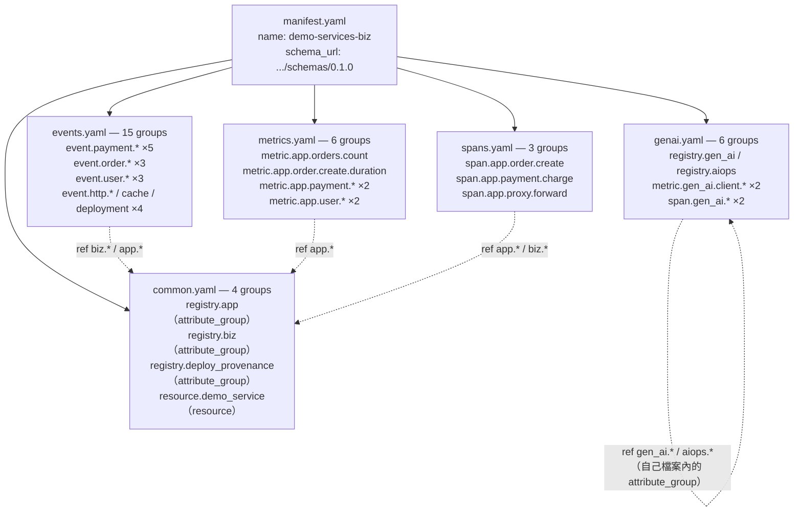
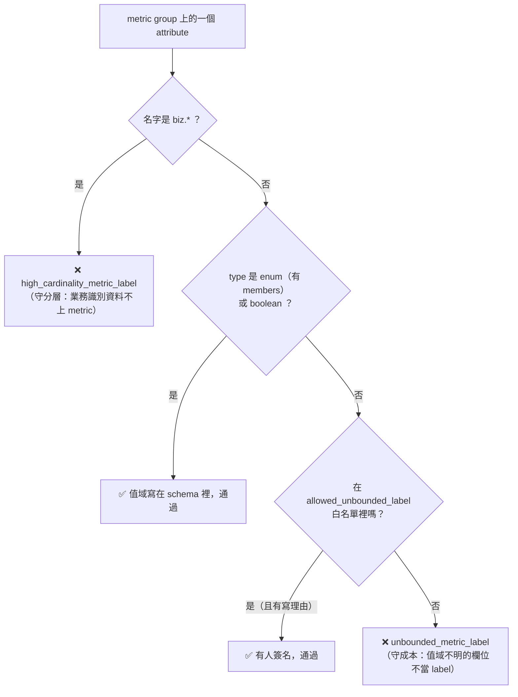
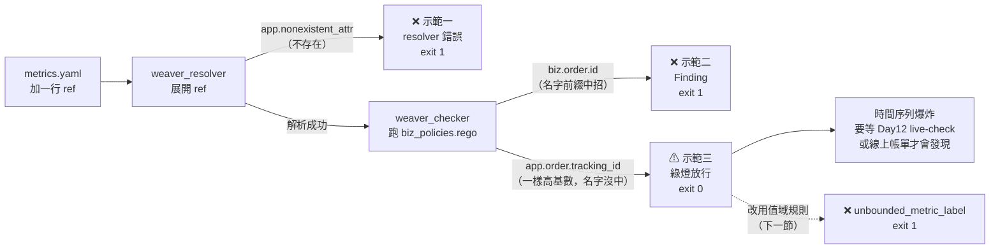
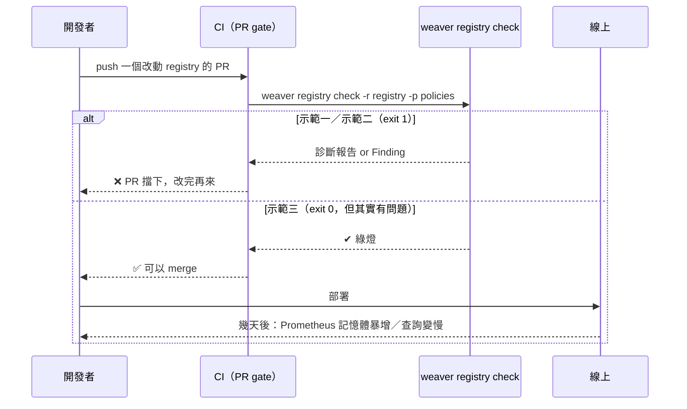

# Day8：Weaver 上手——第一次 `weaver registry check`

Day7 講完 Weaver 內部的管線分工、也列完整張 CLI 速查表，但整天沒跑過一次指令。今天要把那張地圖兌現——但今天不是從零手寫一份範例 registry，而是回去挖 Day6 留下來的東西：那次提交其實已經先把 `day06/weaver/` 建好了，一份完整的 registry（`registry/model/*.yaml`）加一條自訂 Rego policy（`policies/biz_policies.rego`）。今天要做的事，就是第一次真的對它跑 `weaver registry check`，貼真實輸出，逐條對照 Day7 講的 crate 分工——到底是 `weaver_resolver` 先解析出問題，還是 `weaver_checker` 在報錯，這兩種錯誤長得完全不一樣。

先說明一下這系列的檔案怎麼放，免得後面的路徑看起來很跳。這組服務在文章裡一直叫 `demo-services`（Day1 就是這樣介紹的），它在主 repo `o11y-bench/demo-services/` 底下持續演進；而 submodule [`OTel_AIOps_Agent`](https://github.com/tedmax100/OTel_AIOps_Agent) 存的是**每一天當下那組 stack 的完整快照**，一天一個資料夾——所以服務程式碼的實際路徑是 `day06/services/{api-gateway,order,payment,user,webapp}`，不是 `demo-services/`。今天所有指令都在 submodule 的根目錄下跑，路徑一律從 `day06/` 開始寫。

這篇文章對應的完整重現步驟在 [`day08/README.md`](https://github.com/tedmax100/OTel_AIOps_Agent/tree/main/day08)（stack 沿用 `day06/`，只新增了後面那份修正版 policy），這裡直接講重點跟真實輸出。

## 這份 registry 是「目標命名」，不是抄現在的服務

先講清楚一個容易誤會的地方：`weaver registry check` 檢查的對象是 registry 這份 schema 定義本身自不自洽，不是拿它去比對 `demo-services` 現在實際跑出來的資料。翻開 `day06/weaver/registry/model/common.yaml` 開頭的註解就寫得很白：

> 這份 registry 是**目標標準**——用的是 idiomatic、有 namespace 的命名（`app.*` 給低基數的流程屬性、`biz.*` 給業務識別碼），但現在的服務其實還在送 flat key（`status`、`reason`、`user_id`…）。

也就是說，`user_id` 在這份 registry 裡的目標寫法是 `biz.user.id`，`status`（metric label 上代表業務結果的那個）目標寫法是 `app.outcome`——每一個 attribute 定義下面都有一行 `note`，老實記著「現在程式碼裡的 flat key 叫什麼」。這個落差本身就是一張遷移清單，`day06/weaver/README.md` 整理成一張完整對照表，節錄幾行：

| 現在程式碼裡的 flat key | registry 裡的目標 attribute | 訊號 |
|---|---|---|
| `user_id` | `biz.user.id` | log/span |
| `order_id` | `biz.order.id` | log/span |
| `status`（metric label） | `app.outcome` | metric/span |
| `status`（gateway/webapp log，其實是 HTTP 整數狀態碼） | `app.upstream.status_code` | log ⚠️ 同一個字串在不同地方代表不同東西 |
| `reason` | `app.fail_reason` | metric/log/span |
| `git_repo` / `git_version`（resource） | `vcs.repository.url.full` / `service.version` | resource |

這張表最後一列值得多看一眼：`status` 在 metric label 上是「業務結果」（`created`/`declined`…），但在 `api-gateway`/`webapp` 的 log 裡卻是「HTTP 狀態碼」——同一個 key，兩種完全不同的語意，混在同一個系統裡。這正是 Day7 講的「schema 是團隊共識」最具體的反例：字串一樣不代表意思一樣，這種混淆只有回頭去讀程式碼才會發現，`registry` 把它拆成 `app.outcome`（enum）跟 `app.upstream.status_code`（int）兩個獨立定義，一次性把這個混淆攤開來。

今天先不管這整張表怎麼補齊（那牽涉到改 `o11y_shared` 跟五個服務、還會動到 Loki/Prometheus 的 label，是刻意留到後面的事），先看 `check` 這個指令本身能不能跑、跑出來長什麼樣。

## 先確認「這個檢查真的有在檢查」

Day7 最後踩到那個 `-r .` 的假綠燈之後，養成了一個習慣：任何一份 registry 第一次接進流程時，先用 `registry stats` 確認它到底讀進了幾個 group，再去看檢查結果。先做這一步：

```bash
weaver registry stats -r day06/weaver/registry
```

```
Weaver Registry Stats
Computing stats for registry `day06/weaver/registry`
ℹ Found registry manifest: day06/weaver/registry/manifest.yaml
Resolved Telemetry Schema Stats:
Registry
  - 34 groups
    - 5 AttributeGroups
    - 1 Entitys
    - 15 Events
    - 8 Metrics
    - 5 Spans
```

34 個 group，不是 0——這個檢查是真的有讀到東西。有了這個數字打底，下面那個綠燈才有意義。

順帶一提，這 34 個 group 分散在五個 YAML 檔裡，怎麼拆是團隊自己決定的（Day7 講過 Weaver 不強制）。這份 registry 選的是「照訊號種類拆」，不是照 domain：



那些虛線是重點：`common.yaml` 裡的 `registry.app` 跟 `registry.biz` 兩個 `attribute_group` 是整份 registry 的共用池，`events.yaml`／`metrics.yaml`／`spans.yaml` 幾乎都是靠 `ref` 去引用它們（`ref: app.outcome`、`ref: biz.order.id`…），而不是各自重寫一次定義。`genai.yaml` 是唯一的例外——它自己帶了 `registry.gen_ai` 跟 `registry.aiops` 兩個 attribute_group，`ref` 全部指向自己檔案內部，等於是一塊可以整包搬走的獨立區塊。Day7 那張 classDiagram 裡的 `ref` 虛線，在真實 registry 裡長的就是這個樣子——一個中心 + 一堆引用，而不是五份互相複製貼上的 YAML。

`common.yaml` 那個 `resource.demo_service` 值得單獨說一句：它的 `type` 是 `resource`，Day7 列的五種 `type` 裡沒有它。但看 stats 的分類，它被算進了 `1 Entitys`——`resource` 在 weaver 內部是被當成 entity 處理的（就是 Day7 講的「描述一個東西的身份」，只是這裡描述的是「跑這個服務的那個 process」）。這也說明 Day7 那五種不是一份封閉的清單，而是最常用的五種。

## 第一次真的跑：乾淨到有點意外

```bash
weaver registry check -r day06/weaver/registry
```

```
Weaver Registry Check
Checking registry `day06/weaver/registry`
ℹ Found registry manifest: day06/weaver/registry/manifest.yaml
✔ No `after_resolution` policy violation

Total execution time: 0.021600395s
```

加上自訂的 `biz_policies.rego`（禁止 `biz.*` 這種高基數業務識別碼被拿去當 metric label）：

```bash
weaver registry check -r day06/weaver/registry -p day06/weaver/policies
```

```
Weaver Registry Check
Checking registry `day06/weaver/registry`
ℹ Found registry manifest: day06/weaver/registry/manifest.yaml
✔ No `after_resolution` policy violation

Total execution time: 0.021600395s
```

兩次都乾淨。第一次跑就是綠燈，一開始會讓人有點懷疑「是不是根本沒認真檢查」——但這其實符合預期：這份 registry 是照目標命名新寫的，不是拿舊的 flat key 硬塞進來，自然不會撞上自己定義的規則。乾淨的 check 只證明「這份 schema 定義本身內部一致、符合規則」，完全不保證「真正跑起來的服務有照這份定義送資料」——那正是 Day12 `weaver registry live-check` 要揭穿的事：把真實 OTLP 流量丟進去比對，這時候 `user_id`、`status` 這些 flat key 就會被抓出來，變成一張真正的待辦清單。

## `stats` 的另一半：把 schema 設計攤成數字

`stats` 除了拿來當「有沒有讀到東西」的探針，輸出的後半段其實是一份設計審查報告。同一次執行的下半部：

```
Shared Catalog (after resolution and deduplication):
  - Number of deduplicated attributes: 55 (53%)
    - Attribute types breakdown:
      - boolean: 1
      - double: 1
      - enum(card:001): 2
      - enum(card:002): 6
      - enum(card:004): 1
      - enum(card:005): 2
      - enum(card:008): 1
      - enum(card:013): 5
      - enum(card:015): 1
      - int: 11
      - string: 23
      - string[]: 1
    - Requirement levels breakdown:
      - conditionally_required: 8
      - recommended: 30
      - required: 17
    - Stability breakdown (100%):
      - development: 55
```

這幾個數字每一行都能拿來問一個設計問題：

| 數字 | 讀出來的意思 | 該問的問題 |
|---|---|---|
| `deduplicated attributes: 55 (53%)` | 55 個去重後的 attribute，重用率 53% | 重用率太低代表大家在各自重寫定義；這裡一半以上被 `ref` 共用，是健康的 |
| `enum(card:xxx)` 共 18 個 | 18 個欄位把合法值寫進了 schema | 剩下 23 個 `string` 裡，有沒有其實應該是 enum 的？（Day7 講過 enum 是 LLM 唯一能事先知道 label 值域的來源）|
| `enum(card:015)` | 有一個 enum 有 15 個成員 | 15 個值的 enum 拿去當 metric label，就是 15 條時間序列起跳——這是 cardinality 預算該盯的地方 |
| `required: 17`／`recommended: 30` | 必填只佔三成 | 必填太多會讓 Day12 的 live-check 噴一堆違規；太少則等於沒有承諾。三成是個合理的起手式 |
| `development: 55 (100%)` | 沒有任何一個 attribute 是 `stable` | 完全符合現況——這份 registry 還在演進，沒有對任何人做出「不會再改」的承諾。Day14 講 breaking change 時，這個 100% 會開始鬆動 |

這張表是我之後每次改完 registry 都會重跑一次的東西：`check` 回答「合不合法」，`stats` 回答「設計得怎麼樣」，兩個問題不一樣。

## 用一份丟棄式的複製，看兩種錯誤長什麼樣

乾淨的輸出沒辦法示範 Finding 長什麼樣子，所以在 `/tmp` 複製一份、故意弄壞兩次——這兩步都只在本機操作，repo 裡的 `day06/weaver/` 本身完全沒被動過。

**第一種：resolver 階段的錯誤。** 在 `metric.app.orders.count` 這個 metric 群組裡塞一行指到不存在的屬性：`- ref: app.nonexistent_attr`，再跑一次 check：

```
Diagnostic report:

  × The following attribute reference is not resolved for the group
  │ 'metric.app.orders.count'.
  │ Attribute reference: app.nonexistent_attr
  │ Provenance: Some(Provenance { schema_url: SchemaUrl { url: "https://
  │ tedmax100.github.io/o11y-bench/demo-services/schemas/0.1.0", name_range:
  │ 8..60, version_range: 61..66 }, path: "registry/model/metrics.yaml" })
```

完全沒有「Violation」字樣，也沒有 `id`/`level`/`context` 這種 policy Finding 才有的結構——因為 `weaver_resolver` 在展開 `ref` 這一步就直接中止了，根本還沒輪到 `weaver_checker` 上場跑 Rego。

**第二種：checker 階段的 Finding。** 把剛剛那行改成 `- ref: biz.order.id`——讓一個高基數的業務識別碼被拿去當 metric label，這正是 `biz_policies.rego` 要擋的事：

```
✔ All `after_resolution` policies checked (1 violations found)

Violation: semconv_attribute
  - Message   : id=high_cardinality_metric_label, category=attribute, group=metric.app.orders.count, attr=biz.order.id
  - Level     : violation
  - Context   :
    - attr : biz.order.id
    - category : attribute
    - group : metric.app.orders.count
    - id : high_cardinality_metric_label
  - Provenance: registry
```

這次有完整的 Finding 結構了。這條 policy 背後的動機寫在 `o11y_shared/events.py` 的 docstring 裡：「不要把 order_id、user_id 這種動態 id 塞進去——每加一個都會撐大 `sum by (event)` 這類查詢的 label 空間」。`biz_policies.rego` 把這句寫在註解裡、只能靠人記得的警告，變成一條會在 `weaver registry check` 這一步就攔下來的自動化規則。

**第三種：policy 沒抓到的那一種。** 前兩個示範都是「弄壞、被抓到」，但更值得記住的是「弄壞、沒被抓到」。翻回 `biz_policies.rego` 的規則本體，它判斷的條件其實只有兩個字串比對：

```rego
deny contains high_cardinality_metric_label(group.id, attr.name) if {
	group := input.groups[_]
	group.type == "metric"
	attr := group.attributes[_]
	startswith(attr.name, "biz.")     # ← 只認名字前綴
}
```

也就是說，它擋的不是「高基數」，是「名字開頭是 `biz.`」。這兩件事在這份 registry 裡剛好重疊，因為團隊把所有業務識別碼都收進了 `biz.*` 命名空間。但只要有人繞過這個慣例，policy 就會安靜地放行。實測一次——在 `common.yaml` 定義一個一樣高基數、但掛在 `app.*` 底下的追蹤碼，然後掛到同一個 metric 上：

```yaml
# common.yaml：新增一個高基數、但沒有掛在 biz.* 底下的識別碼
  - id: registry.leak
    type: attribute_group
    stability: development
    brief: "示範用：一個高基數、但沒有掛在 biz.* 命名空間底下的識別碼"
    attributes:
      - id: app.order.tracking_id
        type: string
        stability: development
        brief: "訂單追蹤碼（每筆訂單都不同，高基數）"
        examples: ["trk-90a1f"]
```

```yaml
# metrics.yaml：把它掛到 metric.app.orders.count 上
    attributes:
      - ref: app.outcome
        requirement_level: required
      - ref: app.order.tracking_id      # ← 每筆訂單一個值
        requirement_level: recommended
```

```
$ weaver registry check -r /tmp/weaver-demo/registry -p /tmp/weaver-demo/policies
✔ No `after_resolution` policy violation

Total execution time: 0.019738844s

$ echo $?
0
```

綠燈，離開碼 0。這條 metric 現在每一筆訂單都會生出一條新的時間序列，而檢查完全沒有意見——因為它從頭到尾就沒有在看基數，只是在看名字。

這是繼 Day7 那個 `-r .` 之後，第二次踩到同一類問題的不同版本：**檢查通過，不等於東西是對的**。差別在於 `-r .` 是工具用法出錯（讀不到檔案），這次是規則本身的能力邊界（規則寫得比它宣稱要解決的問題窄）。前者可以靠 `stats` 探針發現，後者只能靠「知道自己這條規則實際在比對什麼」。命名慣例（`biz.*`）跟 policy 是一組配套：policy 只認得慣例，慣例一旦破功，policy 就跟著失效。

## 那就把規則改對：從「檢查名字」到「檢查值域」

Rego 的語法細節留到 Day10-11，但這條規則的**設計**問題今天就該解決，不然這份 registry 等於帶著一個已知的洞進 CI。

問題出在原規則問錯了問題。它問的是「這個 attribute 叫什麼名字」，但真正該問的是「**這個 attribute 的值有幾種可能**」——因為 metric label 的成本完全由值域大小決定，跟名字一點關係都沒有。

那 registry 有辦法回答「值有幾種可能」嗎？有，而且 Day7 就講過了：`enum` 的 `members`。一個寫成 enum 的 attribute，值域大小就寫在 schema 裡；一個寫成 `type: string` 的 attribute，registry 對它的值域一無所知。所以規則可以翻轉成一句話：

> **metric label 只能是值域有界的型別——enum（有 `members`）或 boolean。其他一律視為無界，除非被明確列入白名單。**

這是「預設拒絕」而不是「列舉壞東西」，跟原本那條的方向剛好相反。原規則要窮舉所有危險的命名前綴（`biz.`、然後呢？`app.*.id`？`*.tracking_id`？），永遠列不完；新規則只要窮舉**例外**，而例外是有限的、而且每一條都該有人簽名。

```rego
package after_resolution

import rego.v1

# 明確允許的無界 metric label，每一條都要寫原因。
allowed_unbounded_label := {
	"gen_ai.request.model", # 實務上有界：就那幾個 model id
}

# 值域有界的兩種情況：enum（type 是帶 members 的物件）或 boolean
bounded_label(attr) if is_object(attr.type)

bounded_label(attr) if attr.type == "boolean"

# --- 規則一：biz.* 永遠不准當 metric label（保留，見下文為什麼）---------
deny contains high_cardinality_metric_label(group.id, attr.name) if {
	group := input.groups[_]
	group.type == "metric"
	attr := group.attributes[_]
	startswith(attr.name, "biz.")
}

# --- 規則二：每個 metric label 的值域都必須有界 ---------------------------
deny contains unbounded_metric_label(group.id, attr.name) if {
	group := input.groups[_]
	group.type == "metric"
	attr := group.attributes[_]
	not bounded_label(attr)
	not allowed_unbounded_label[attr.name]
	not startswith(attr.name, "biz.")    # 已經被規則一報過了，不重複報
}

unbounded_metric_label(group_id, attr_id) := violation if {
	violation := {
		"id": "unbounded_metric_label",
		"type": "semconv_attribute",
		"category": "attribute",
		"group": group_id,
		"attr": attr_id,
	}
}
```

（`high_cardinality_metric_label` 那個建構 violation 的函式沿用原檔案，這裡沒重貼。）

`is_object(attr.type)` 這行是整條規則的支點，值得解釋一下它為什麼成立。Rego 拿到的不是 YAML 原文，是 `weaver_resolver` 展開之後的 resolved schema，在那裡一個 enum 的 `type` 是這樣的物件：

```json
{
  "name": "app.outcome",
  "type": { "members": [ { "id": "created", "value": "created", ... }, ... ] }
}
```

而一個普通字串欄位的 `type` 就是字串 `"string"`。所以「是不是 enum」在 Rego 裡就是「`type` 是不是一個物件」——不需要去解析 YAML，也不需要猜命名。

**先拿它跑示範三那個漏網的欄位：**

```
$ weaver registry check -r /tmp/weaver-demo/registry -p /tmp/weaver-demo/policies
✔ All `after_resolution` policies checked (1 violations found)

Violation: semconv_attribute
  - Message   : id=unbounded_metric_label, category=attribute, group=metric.app.orders.count, attr=app.order.tracking_id
  - Level     : violation
  - Context   :
    - attr : app.order.tracking_id
    - category : attribute
    - group : metric.app.orders.count
    - id : unbounded_metric_label

$ echo $?
1
```

抓到了。而且注意違規 id 是 `unbounded_metric_label`，不是 `high_cardinality_metric_label`——兩條規則各報各的，看訊息就知道是踩到哪一種。

**再確認規則一沒有被弄壞**（把示範二那個 `biz.order.id` 放回去）：

```
✔ All `after_resolution` policies checked (1 violations found)
  - Message   : id=high_cardinality_metric_label, category=attribute,
                group=metric.app.orders.count, attr=biz.order.id
```

還在。有人可能會問：既然規則二已經涵蓋了所有無界型別，`biz.order.id` 是 string 也會被規則二抓到，那規則一不是多餘的嗎？不是——規則一擋的是**命名空間本身**，就算哪天有人把 `biz.user.tier` 寫成一個只有三個值的 enum、技術上完全通過規則二，它一樣不該出現在 metric 上，因為 `biz.*` 這個命名空間的約定就是「業務識別資料，只放 log 跟 span」。兩條規則守的是兩件不同的事：一條守**成本**，一條守**分層**。

### 意外收穫：新規則在自己的 registry 裡抓到一個真的

最有意思的是把新規則跑在**沒有動過手腳的**那份 registry 上。如果先不加白名單：

```
✔ All `after_resolution` policies checked (2 violations found)
  - Message : id=unbounded_metric_label, group=metric.gen_ai.client.operation.duration, attr=gen_ai.request.model
  - Message : id=unbounded_metric_label, group=metric.gen_ai.client.token.usage,       attr=gen_ai.request.model
```

`gen_ai.request.model` 被抓出來了——它是 `type: string`，掛在兩個 GenAI metric 上。這不是我埋的梗，是這份 registry 從 Day6 寫下來就存在、但舊規則永遠看不到的東西（它不叫 `biz.*`）。

而這正是好規則該有的效果：它逼出一個**必須有人做決定**的問題，而不是給一個機械式的答案。這個欄位有兩條路可走：

1. **它其實應該是 enum。** 團隊實際會用的 model 就那幾個，寫成 `members` 之後值域進了 schema，Day15 的 MCP server 也能直接告訴 agent「這個 label 只有這幾個值」。
2. **它就是要保持開放，但要簽名。** 加進 `allowed_unbounded_label`，旁邊寫上理由。

我選了第二條，因為 model id 會隨供應商更新而變，寫死成 enum 反而會讓每次換模型都變成一次 registry 改版。加上白名單之後：

```
$ weaver registry check -r day06/weaver/registry -p day06/weaver/policies
✔ No `after_resolution` policy violation

$ echo $?
0
```

回到綠燈——但這次的綠燈跟本文開頭那個綠燈，意義完全不同。開頭那個是「沒有任何欄位的名字以 `biz.` 開頭」；現在這個是「每一個 metric label 的值域，要嘛寫在 schema 裡有界，要嘛有人明確簽名允許它無界」。同樣一行 `✔`，背後的保證強度差很多。

那個白名單集合本身也變成一份有用的文件——它就是「這份 registry 目前承擔的所有 cardinality 風險」的完整清單，一眼看得完，而且每一條都有署名的理由。這比散落在各處註解裡的 `# TODO: 這個可能會爆` 有用得多。



Day10-11 會回頭把這段 Rego 的語法本身講清楚（`deny contains ... if` 這個 `rego v1` 的寫法、`is_object` 這類內建函式、規則之間怎麼組合），今天先讓規則對得起它宣稱要解決的問題。

三個示範放在一起，剛好把管線上三個不同位置各踩了一次：



對照 Day7 的 crate 分工表：示範一的錯誤來自 `weaver_resolver`（`ref` 展開失敗，管線走不到後面），示範二的 Finding 來自 `weaver_checker`（resolved schema 進了 Rego runtime 才被判違規），示範三則是兩段都平安走完。同一個「多加一行 `ref`」的動作，會因為指到的東西不同而在管線的不同節點停下來——或者根本不停。

把四次執行的輸出特徵並排（policy 用的是原始版本，修正版在下一節），差異就很清楚了：

| | 有 `Violation` 字樣 | 有 `id`/`level`/`context` 結構 | 離開碼 | 誰報的 |
|---|---|---|---|---|
| 乾淨通過 | ✗ | ✗ | 0 | — |
| 示範一：`ref` 指到不存在的屬性 | ✗ | ✗（純文字診斷） | 1 | `weaver_resolver` |
| 示範二：`biz.order.id` 當 metric label | ✓ | ✓ | 1 | `weaver_checker` |
| 示範三：非 `biz.*` 的高基數欄位 | ✗ | ✗ | 0 | 沒人 |

第一列跟最後一列的輸出**一模一樣**——這正是示範三真正麻煩的地方：它不是一種比較弱的警告，它跟「完全沒問題」在輸出上無法區分。

離開碼那一欄是明天之後要接 CI 的抓手。`check` 對 CI 來說只有兩種身分：0 放行、非 0 擋下。今天三個示範對應到 merge gate 上是這樣：



右邊那條路徑就是這系列一開始講的那個故事的翻版——只是這次擋不下來的原因不是「沒有治理」，而是「治理的規則寫得比問題窄」。這也是為什麼 Day10-11 要分兩天講：一天把 Finding 的完整結構（`id`/`message`/`level`/`context`/`signal_type`）攤開講清楚、順便把 policy 寫到真的涵蓋它宣稱要擋的事，一天講怎麼把離開碼接進 CI Gate，讓攔截從「本機手動跑」變成「PR 擋下來」。

## 今天沒做的事

沒有動 `demo-services` 的服務程式碼，也沒有處理 flat key 跟目標命名之間的落差——那需要同時改 `o11y_shared` 跟五個服務，還會動到 Loki/Prometheus 的 label 跟既有的 dashboard/評分查詢，是刻意留到後面的事。也沒有深入 `biz_policies.rego` 用到的 Rego 語法細節（`deny contains ... if` 這個 `rego v1` 語法糖背後的規則機制），今天只講到看得懂輸出在講什麼；語法本身留到真正要自己寫複雜 policy 的 Day10-11。`weaver registry mcp`、`live-check` 這些跟 runtime 流量對話的指令今天也完全沒碰——今天所有的 check 都是純靜態驗證。修正版的 policy 雖然寫出來也跑過了，但沒有展開講 Rego 的語法本身（`deny contains ... if` 這個 `rego v1` 的寫法背後的規則機制、`is_object` 之類的內建函式、多條規則之間怎麼組合），今天只講到「規則該問什麼問題」這一層；語法留到 Day10-11。也沒有把它接進 CI——離開碼已經對了，但真正接上 merge gate 是 Day11 的事。

明天：不再看靜態定義，改用 `weaver registry infer` 直接對 Day1 那個服務的 OTLP 流量反推一份 schema 草稿，看看自動生成的結果會不會把 `userId`/`user_id` 這兩套並存的命名一起學進去，跟今天這份手工設計的「目標 registry」放在一起對照，會是完全不同性質的兩份 schema。
