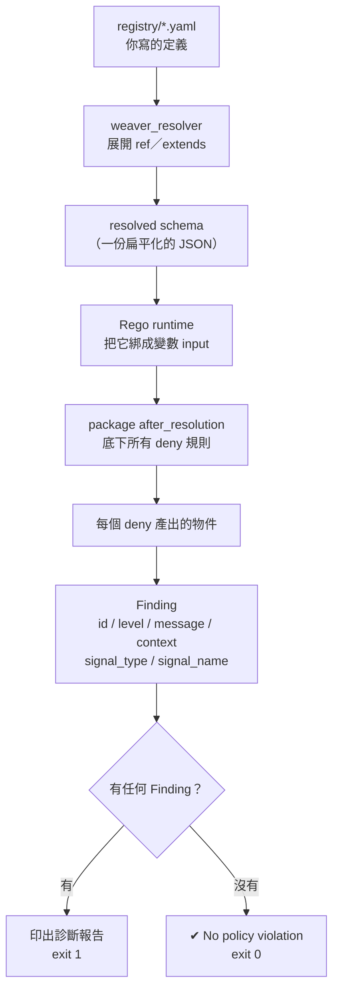
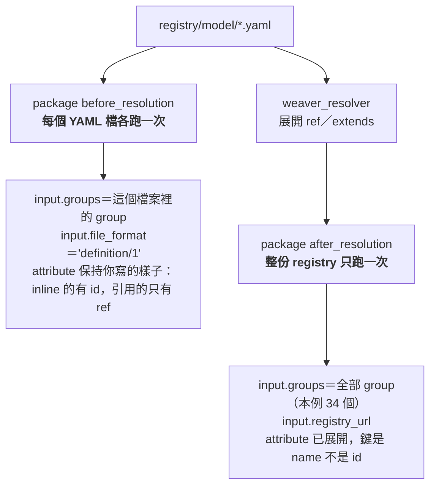

# Day10：命名漂移——用 Rego policy 把它攔下來

Day9 用 `weaver registry infer` 從真實流量反推出一份草稿，親眼看到 `userId` 跟 `user_id` 被當成兩個完全不相干的 attribute 學了進去。那份草稿停在「觀察報告」這一格，中間那段收斂——挑哪一個當 canonical、補 brief、決定必不必填——機器做不到。

今天不做那段收斂，做的是它的前一步：**先讓機器有能力指出「這裡有兩個名字在講同一件事」**。因為如果連「哪裡出問題」都要靠人一個一個看，那份 793 行的草稿根本不會有人看完。

Day8 已經示範過一次 Rego policy 攔下違規，但那條規則的內容一直沒有展開講（我把它推給了「Day10-11」）。今天把這筆帳還掉：從 policy 的輸入到 Finding 的輸出，整條路徑走一遍。

Rego 是這整套治理機制裡最陡的一段，所以中間會有一節專門講**weaver 實際用到的那一小塊 Rego**——兩個 package 各自看得到什麼（實測把 `input` 整包印出來對照）、哪些關鍵字真的會用到、哪些內建函式可用、以及為什麼網路上大部分 Rego 範例貼進來會直接被拒絕。文件沒寫、但一定會踩到的行為，也一併記下來。

程式碼在 submodule 的 [`day10/`](https://github.com/tedmax100/OTel_AIOps_Agent/tree/main/day10)（一份刻意留著漂移的 registry ＋ 一份 `naming.rego`），這裡直接講重點跟真實輸出。

## 命名漂移為什麼靠 code review 擋不住

先回到 Day1 那個場景，把它講得更精確一點。

前端工程師送 `userId`，後端在 FastAPI 那層加了 alias 悄悄轉成 `user_id`——這個 PR 的標題是「支援新的下單欄位」，測試會過，功能正常。**它在 review 的時候，不會以「命名問題」的形式出現在任何人面前**，它出現的形式是「一個功能開發的 PR」。

這是命名漂移跟一般 bug 最大的差別。一般 bug 有失敗訊號：測試紅了、服務掛了、使用者抱怨了。命名漂移的訊號是零——兩個名字都合法、都能跑、都送得出去、Grafana 都查得到。它唯一的症狀要等到很久以後才出現：某天有人要做一個跨服務的查詢，才發現要嘛全部改名重新部署，要嘛在查詢語法裡手動兼容五種寫法。

那為什麼不靠 review 就好？因為 review 這件事有一個結構性的限制：**review 的人看得到這個 PR 改了什麼，看不到整個系統目前已經有什麼**。一個 reviewer 要抓到「這個新的 `userId` 跟三個月前另一個服務的 `user_id` 撞了」，他得先記得那個 `user_id` 存在。服務數量一多，這件事就從「認真一點就做得到」變成「不可能」。

Day2 講「缺語意」的三種樣子時，第一種就是這個：**同一個概念，兩個名字**。當時的結論是「語意是一份共同的約定，不是任何一個服務單獨能決定的東西」。今天要做的，就是把這份約定從「大家心裡都知道」變成「一份機器每次 PR 都會核對的規格」——關鍵不在於規則多聰明，而在於**它有整份 registry 的視野，而人沒有**。

## 結構：一條 policy 從輸入到輸出

在寫規則之前，先把 `weaver registry check -p policies` 這條路徑上的資料流搞清楚。Day7 那張 crate 分工圖畫的是整個 Weaver，今天放大 `weaver_checker` 這一格：



有三件事值得從這張圖裡讀出來。

**第一，Rego 看到的不是你寫的 YAML，是 resolved schema。** 這個差別很重要：你在 YAML 裡寫的 `- ref: app.outcome`，到了 Rego 眼中已經是一個完整展開的 attribute 物件了，`ref` 這個字根本不存在。實際長這樣：

```json
{
  "id": "metric.app.orders.count",
  "type": "metric",
  "attributes": [
    {
      "name": "app.outcome",
      "type": { "members": [ { "id": "created", "value": "created" }, ... ] },
      "brief": "Terminal outcome of a business operation.",
      "requirement_level": "required"
    }
  ]
}
```

注意 attribute 的鍵是 `name` 不是 `id`（group 才是 `id`）——這是寫第一條規則時最容易卡住的地方。而 Day8 那條「值域有界」規則的支點 `is_object(attr.type)`，也是因為在這裡 enum 的 `type` 是物件、字串欄位的 `type` 是字串 `"string"`。

**第二，`package after_resolution` 這行決定規則什麼時候跑。** 還有一個 `before_resolution`，在 `ref` 展開之前跑，看得到原始的 YAML 結構。今天所有規則都用 `after_resolution`，因為命名檢查要看的是最終每個 group 上實際掛了哪些 attribute。

**第三，只有 `deny` 這個名字會被收集。** 這點下面會用實測說明，因為它推翻了我原本的一個假設。

## Rego 速成：weaver 只用到這門語言的一小塊

Rego 是這整套治理機制裡學習曲線最陡的一段——它是宣告式的、沒有 for 迴圈、`not` 的語意跟你想的不一樣，而且網路上大部分範例是舊語法、貼進來會直接被拒絕。

好消息是：**weaver 只用到 Rego 的一小塊**。把下面這些搞懂，寫得出 90% 會用到的規則。

### 一份 weaver policy 的骨架

```rego
package after_resolution        # ① 決定「什麼時候跑」，名字不能亂取

import rego.v1                  # ② 選用（引擎本來就是 v1），寫了比較清楚

# ③ 主角：deny 是唯一會被收集的規則名
deny contains my_finding(group.id, attr.name) if {
	group := input.groups[_]                  # ④ 迭代
	attr := group.attributes[_]
	regex.match(`[a-z][A-Z]`, attr.name)      # ⑤ 條件（全部要成立）
}

# ⑥ 輔助函式：組出固定形狀的 violation 物件
my_finding(group_id, attr_id) := violation if {
	violation := {
		"id":       "my_rule_id",
		"type":     "semconv_attribute",
		"category": "naming",
		"group":    group_id,
		"attr":     attr_id,
	}
}
```

六個位置各自的規矩：

| | 元素 | 規矩 |
|---|---|---|
| ① | `package` | 只有 `before_resolution` / `after_resolution` 有效。**打錯不會報錯，會給你綠燈**（下面詳述） |
| ② | `import rego.v1` | 選用。引擎本來就是 v1，但**舊語法會被拒絕** |
| ③ | `deny` | 唯一會被收集的規則名。叫 `violation`、`warn`、`allow` 都不會有任何效果 |
| ④ | `[_]` | 「對每一個都試一次」，不是「取第 0 個」 |
| ⑤ | 規則主體 | 所有條件是 **AND**；要 OR 就寫成兩條同名規則 |
| ⑥ | 輔助函式 | 純粹是為了可讀性，把物件直接寫在 `deny` 裡也可以 |

### 兩個 package，看到的東西完全不一樣

這是寫 weaver policy 最需要先搞清楚的一件事，也是決定「這條規則要寫在哪」的依據。實測把 `input` 整包印出來對照：



拿 Day8 那份有 5 個 YAML 檔、34 個 group 的 registry 實測，印出「每次呼叫看到幾個 group」：

```
# package before_resolution
一次呼叫看到 4 個 group，format=definition/1     ← common.yaml
一次呼叫看到 15 個 group，format=definition/1    ← events.yaml
一次呼叫看到 6 個 group，format=definition/1     ← metrics.yaml
一次呼叫看到 6 個 group，format=definition/1     ← genai.yaml
一次呼叫看到 3 個 group，format=definition/1     ← spans.yaml

# package after_resolution
KEYS=["groups", "registry_url"] groups=34        ← 只有一次，全部都在
```

attribute 的形狀也不一樣。同一個 registry，`before_resolution` 看到的是**你手寫的原樣**：

```
group=registry.order   attrKeys=["annotations","brief","examples","id","note","requirement_level","stability","type"]
group=span.order.create attrKeys=["annotations","ref"]        ← ref 還在，沒有被展開
```

`after_resolution` 看到的則是展開後的效果，`ref` 這個字根本不存在、鍵從 `id` 變成 `name`。

所以選哪個 package 的判準很清楚：

| 你想檢查的事 | 用哪個 | 為什麼 |
|---|---|---|
| 命名風格、撞名、缺 namespace | `after_resolution` | 要看**實際生效**的名字，含被 ref 進來的 |
| metric label 的值域／基數（Day8） | `after_resolution` | `ref` 展開後才知道這個 metric 實際掛了什麼 |
| 「不准 inline 定義，一律要用 ref」 | `before_resolution` | 只有展開前才分得出 inline 跟 ref |
| 「每個檔案都要有某個 group」 | `before_resolution` | 它是**按檔案**跑的，天生就有檔案的概念 |
| 跨檔案的一致性（例如全域撞名） | `after_resolution` | `before_resolution` 一次只看得到一個檔案 |

最後一列特別容易踩：**`before_resolution` 看不到別的檔案**，所以任何「兩個東西撞在一起」的規則寫在那裡都不會成立。Day10 這條 `duplicate_concept` 之所以放 `after_resolution`，就是這個原因。

### 真正會用到的關鍵字

Rego 語言本身很大，但寫 weaver policy 反覆用到的其實就這幾個：

| 關鍵字／語法 | 意思 | 典型用法 |
|---|---|---|
| `x := input.groups[_]` | **迭代**：對每個 group 各試一次 | 所有規則的第一行 |
| `some g in input.groups` | 同上，較新的寫法，可讀性好一點 | 跟 `[_]` 二選一 |
| `a := b` | 賦值（宣告新變數） | 慣用，優先於 `=` |
| `not <表達式>` | 「這個表達式**無法成立**」 | `not contains(name, ".")` |
| `every g in xs { … }` | 全稱：每一個都要滿足 | 「所有 metric 都必須有 unit」 |
| `x in xs` | 成員判斷 | 白名單比對 |
| `[e \| some g in xs]` | comprehension，把巢狀結構**攤平成集合** | 全域撞名檢查的關鍵 |
| `default x := false` | 給規則一個預設值，避免 undefined | 布林旗標 |
| 同名規則寫兩次 | **OR** | 「是 enum 或是 boolean 都算安全」 |

其中最反直覺的兩個，值得單獨記：

**`not` 不是布林取反，是「無法成立」。** 在有迭代的情境下差很多——`not group.attributes[_].name == "x"` 的意思是「不存在任何一個叫 x 的 attribute」，不是「每個都不叫 x」。單一布林值的情況（像 `contains()` 的回傳）才跟直覺一致。

**要 OR 就寫兩條同名規則。** Rego 沒有 `||`，Day8 那條「enum 或 boolean 都算有界」就是這樣寫的：

```rego
bounded_label(attr) if is_object(attr.type)      # enum
bounded_label(attr) if attr.type == "boolean"    # boolean
```

兩條都叫 `bounded_label`，任何一條成立就算成立。

### 內建函式：實測都能用

weaver 內嵌的是自己的 Rego 引擎，不是 OPA 本體，所以不能假設所有 OPA 內建函式都在。實測跑過一輪，寫 policy 會用到的都可用：

| 類別 | 函式 |
|---|---|
| 字串 | `startswith` `endswith` `contains` `lower` `upper` `split` `replace` `sprintf` |
| 正則 | `regex.match` |
| 型別 | `is_object` `is_string` `is_array` `count` |
| 物件 | `object.get`（可給預設值）`json.marshal` `walk` |
| 版本 | `semver.compare` |

`is_object` 是 Day8 那條值域規則的支點（enum 的 `type` 是物件、`"string"` 是字串），`semver.compare` 則在 Day14 比 registry 版本時會派上用場。

### 語法版本：網路上的範例大多貼不動

Rego 在 v1 改了語法，而 weaver 的引擎**只吃 v1**。舊寫法直接被拒絕：

```rego
# ❌ v0 寫法（2023 年以前的教學、大部分 StackOverflow 答案都長這樣）
deny[f] {
	input.groups[_].type == "span"
	f := { ... }
}
```

```
× Invalid policy file, error: `if` keyword is required before rule body
```

這個錯誤訊息算好的——它直接告訴你缺 `if`。改成 v1 就好：

```rego
# ✅ v1 寫法
deny contains f if {
	input.groups[_].type == "span"
	f := { ... }
}
```

`import rego.v1` 這行實測**加不加都能跑**（引擎本來就是 v1），`import future.keywords` 也接受。建議還是寫上 `import rego.v1`，一來明示意圖，二來拿去給 OPA 或 `conftest` 跑時行為一致。

### package 名字打錯：又一個假綠燈

最後這個是今天測出來最陰的一件事。把 package 從 `after_resolution` 改成 `mypolicy`，其他一字不改：

```
$ weaver registry check -r registry -p policies
✔ No `after_resolution` policy violation

$ echo $?
0
```

**綠燈、離開碼 0、沒有任何警告。** weaver 不會說「你這個 package 我不認得」，它只是安靜地不去執行它。

更麻煩的是連 `--display-policy-coverage` 都**什麼都不印**：

```
$ weaver registry check -r registry -p policies --display-policy-coverage
（coverage 區段完全空白）

# 對照：package 正確時
COVERAGE REPORT:
policies/naming.rego has full coverage
```

反過來說，這就是驗證方式：**coverage 報告裡有沒有列出你那個 `.rego` 檔，就是「這份 policy 到底有沒有被執行」的探針**——地位等同 Day7 用 `registry stats` 的 group 數量當 registry 的探針。

這是這系列第三次撞到同一個模式了（Day7 的 `-r .`、Day8 只比對名字的 policy、今天的 package 打錯）。共通結構是：**工具用「什麼都沒發生」來表達「你設定錯了」**，而「什麼都沒發生」跟「一切正常」在輸出上長得一模一樣。所以每接一個新的檢查機制，第一件事都該是問「我要怎麼確認它真的在跑」，而不是「它有沒有報錯」。

## 三條規則，一條比一條難

拿一份刻意保留漂移的最小 registry 當靶子（`day10/registry/`），裡面同時放了 `userId`、`user_id`、`status`、`biz.order.id` 四個 attribute：

```yaml
groups:
  - id: registry.order
    type: attribute_group
    stability: development
    brief: "訂單相關屬性——刻意保留命名漂移"
    attributes:
      - id: userId                 # 前端工程師照 JS 慣例寫的
        type: string
        stability: development
        brief: "下單使用者的識別碼（前端送進來的寫法）"
        examples: ["u-5"]
      - id: user_id                # 後端照 Python 慣例寫的
        type: string
        stability: development
        brief: "下單使用者的識別碼（後端內部的寫法）"
        examples: ["u-4"]
      - id: status                 # 沒有 namespace 的裸名字
        type: string
        stability: development
        brief: "訂單狀態"
        examples: ["created"]
      - id: biz.order.id           # 命名合規的對照組
        type: string
        stability: development
        brief: "訂單識別碼"
        examples: ["ord-1001"]
```

先跑一次不帶 policy 的 check，確認基準：

```
$ weaver registry check -r registry
✔ No `after_resolution` policy violation

$ weaver registry stats -r registry
  - 2 groups
```

2 個 group（不是 0，Day7 那個假綠燈的探針習慣），乾淨通過。**weaver 的內建規則對 `userId` 完全沒有意見**——它有 `brief`、有 `stability`、型別合法，該有的都有。這正是 Day7 講的第三級：內建規則保證「這份 YAML 結構正確」，不保證「這份 schema 設計得好」。

### 規則一：抓 camelCase

最直覺的一條。resolved schema 裡每個 attribute 的 `name` 拿去比對正則：

```rego
package after_resolution

import rego.v1

deny contains camel_case_attribute(group.id, attr.name) if {
	group := input.groups[_]
	attr := group.attributes[_]
	regex.match(`[a-z][A-Z]`, attr.name)
}

camel_case_attribute(group_id, attr_id) := violation if {
	violation := {
		"id": "camel_case_attribute",
		"type": "semconv_attribute",
		"category": "naming",
		"group": group_id,
		"attr": attr_id,
	}
}
```

`input.groups[_]` 那個底線是 Rego 的核心語法：它不是「取第 0 個」，是**「對所有 group 都試一次」**。兩層 `[_]` 疊起來，就是「對每一個 group 的每一個 attribute 都試一次」，任何一組讓後面條件成立的，就產出一個 violation。這也是 Rego 讀起來跟一般程式語言最不一樣的地方——沒有 for 迴圈，迭代是宣告出來的。

```
$ weaver registry check -r registry -p policies
✔ All `after_resolution` policies checked (2 violations found)

  - Message : id=camel_case_attribute, category=naming, group=registry.order,   attr=userId
  - Message : id=camel_case_attribute, category=naming, group=span.order.create, attr=userId

$ echo $?
1
```

抓到了，但**同一個 `userId` 被報了兩次**——一次在定義它的 `registry.order`，一次在 `ref` 它的 `span.order.create`。這不是 bug，是前面講的「Rego 看到的是 resolved schema」的直接後果：`ref` 已經被展開，那個 attribute 現在真的同時存在於兩個 group 裡。實務上這反而有用，因為它告訴你這個壞名字的**影響範圍**有多大——改名要動幾個地方，數字就在那裡。

### 規則二：抓「同一個概念，兩個名字」

這是今天真正的目標，也是 formatter 或一般 linter 永遠做不到的一條。`userId` 跟 `user_id` 分開看都沒問題（如果團隊規範就是 camelCase，`userId` 甚至是對的），問題只在它們**同時存在**。

作法是正規化之後比對：把底線跟點拿掉、轉小寫，`userId`、`user_id`、`user.id` 都會變成 `userid`。

```rego
normalized(name) := lower(replace(replace(name, "_", ""), ".", ""))

all_attr_names contains attr.name if {
	group := input.groups[_]
	attr := group.attributes[_]
}

deny contains duplicate_concept(a, b) if {
	a := all_attr_names[_]
	b := all_attr_names[_]
	a < b                              # 只報一次，不要 (a,b) 跟 (b,a) 各報一次
	normalized(a) == normalized(b)
}
```

`all_attr_names` 那三行是 Rego 裡很常用的一個模式：先用一條規則把散落在巢狀結構裡的東西**收集成一個集合**，後面的規則就可以在這個扁平集合上做兩兩比對。沒有這一步，你會發現很難在一條規則裡同時拿到「兩個不同 group 裡的兩個 attribute」。

`a < b` 這行也值得說一句。少了它，同一組會被報兩次（`userId <-> user_id` 跟 `user_id <-> userId`），而且 `a` 跟自己比也會成立。字串比大小在這裡不是為了排序，純粹是拿來**去掉對稱重複**的一個慣用手法。

```
  - Message : id=duplicate_concept, category=naming, group=(registry-wide), attr=userId <-> user_id
```

這一條抓到的東西，是 Day1 那個壞味道第一次以**機器可讀的形式**被指出來。而且注意它的 `group` 欄位是 `(registry-wide)`——這個違規不屬於任何一個 group，它是整份 registry 的性質。這正是前面說的「規則有整份 registry 的視野，而人沒有」的具體樣子。

### 規則三：強制 namespace

最後一條最簡單，但影響最大：attribute id 必須至少有一個點。

```rego
deny contains missing_namespace(group.id, attr.name) if {
	group := input.groups[_]
	attr := group.attributes[_]
	not contains(attr.name, ".")
}
```

`not` 在 Rego 裡的行為要小心：它是「這個表達式無法成立」而不是「布林值取反」，在有 `[_]` 迭代的情境下這兩者不一樣。這裡因為 `contains` 回傳單一布林值，用起來跟直覺一致。

三條規則一起跑，這份 registry 總共噴出 9 個違規：

```
$ weaver registry check -r registry -p policies
✔ All `after_resolution` policies checked (9 violations found)

  - id=missing_namespace,     group=registry.order,     attr=status
  - id=missing_namespace,     group=span.order.create,  attr=status
  - id=camel_case_attribute,  group=registry.order,     attr=userId
  - id=missing_namespace,     group=registry.order,     attr=userId
  - id=camel_case_attribute,  group=span.order.create,  attr=userId
  - id=missing_namespace,     group=span.order.create,  attr=userId
  - id=duplicate_concept,     group=(registry-wide),    attr=userId <-> user_id
  - id=missing_namespace,     group=registry.order,     attr=user_id
  - id=missing_namespace,     group=span.order.create,  attr=user_id

$ echo $?
1
```

四個 attribute 裡只有 `biz.order.id` 完全乾淨——它有 namespace、是 snake_case、沒有跟任何人撞名。這份輸出就是一張可以直接開工的遷移清單，而它是機器產的，不是誰花一個下午對著 793 行草稿看出來的。

## Finding 的完整結構

`--diagnostic-format json` 可以把 Finding 的原始結構印出來，這是接 CI（明天的事）之前一定要先看懂的東西：

```json
{
  "diagnostic": {
    "message": "Policy violation: id=missing_namespace, category=naming, group=registry.order, attr=status, provenance: registry",
    "ansi_message": "  × Policy violation: id=missing_namespace, ..."
  },
  "error": {
    "type": "policy_violation",
    "provenance": "registry",
    "violation": {
      "type": "PolicyFinding",
      "id": "semconv_attribute",
      "level": "violation",
      "message": "id=missing_namespace, category=naming, group=registry.order, attr=status",
      "context": {
        "id": "missing_namespace",
        "category": "naming",
        "group": "registry.order",
        "attr": "status"
      },
      "signal_name": null,
      "signal_type": null
    }
  }
}
```

對照一下我在 Rego 裡寫的那個物件，會發現一個**很容易搞混的對應關係**：

| Rego 裡寫的 | 跑出來變成 | 說明 |
|---|---|---|
| `"type": "semconv_attribute"` | Finding 的 **`id`** | 不是 `type`！這是最反直覺的一條 |
| 整個物件 | Finding 的 **`context`** | 包含你寫的 `id`、`category`、`group`、`attr` |
| `"id": "missing_namespace"` | `context.id`，以及 `message` 的開頭 | 這是**你的**規則 id |
| （沒得寫） | `level`，恆為 `"violation"` | 見下一節 |
| （沒得寫） | `signal_type` / `signal_name`，恆為 `null` | 見下一節 |

所以同一個字 `id`，在 Rego 裡跟在 Finding 裡指的是兩個不同的東西。實務上你在 CI 上要抓的是 `context.id`（`missing_namespace`），不是頂層的 `id`（`semconv_attribute`，所有 Finding 都一樣）。

## 三個實測出來的行為（文件沒寫）

寫這三條規則的過程中，撞到三件事，每一件都會讓人卡上一段時間，所以完整記下來。

### 一、`level` 寫了也沒用——check 只有一種嚴重度

OpenTelemetry Weaver 的文件裡有一套三級嚴重度：`information` / `improvement` / `violation`。很自然會想在 Rego 裡這樣寫，讓「camelCase」只算建議、「撞名」才算違規：

```rego
f := {"id": "...", "type": "semconv_attribute", "category": "naming",
      "group": g.id, "attr": "x", "level": "improvement"}
```

實測結果：**`level` 這個欄位被完全忽略，輸出永遠是 `Level: violation`。** 三種值試過都一樣。

再退一步，試著用規則名稱來分級（`deny` 之外再定義 `violation`、`improvement`、`information` 三組規則），結果更乾脆——**只有 `deny` 會被收集**，另外三個名字寫了等於沒寫，一個 Finding 都不會產生。

那那套三級嚴重度是哪裡來的？答案在 `live-check`：

```
$ weaver registry live-check --help
      --advice-policies <ADVICE_POLICIES>
          Advice policies directory. Set this to override the default policies
```

`registry check` 跟 `registry live-check` 用的是兩套不同的 policy 機制。前者只有 `deny`、只有 `violation` 一級；三級嚴重度屬於後者的 **advice** 系統，那也是 `signal_type` / `signal_name` 這兩個欄位會被填上的地方（check 階段永遠是 `null`，因為靜態定義沒有「哪一筆遙測」這個概念）。這條線 Day12 講 live-check 時會走一次。

實務上的結論：**在 `registry check` 這一階段，policy 是一個二元的閘門——違規就是違規，沒有「建議」這種中間狀態。** 想要分級，只能靠拆成兩個資料夾、跑兩次 check，一次的離開碼進 CI 當硬性擋，另一次只印出來給人看。

### 二、`type` 只能是 `semconv_attribute`，寫錯會整份 policy 被丟掉

我原本以為 violation 物件的 `type` 是給人分類用的自由字串，所以在寫 span 相關規則時很自然地寫了 `"type": "semconv_span"`。結果：

```
  × Invalid policy file 'registry', error: Violation evaluation error:
  │ invalid type: map, expected A policy violation)
  help: Check the policy file for syntax errors.
```

這個錯誤訊息有兩個地方會誤導人。第一，它說「檢查語法錯誤」，但語法完全沒問題——問題是那個字串的值。第二，它說 `Invalid policy file 'registry'`，指的是 registry 而不是那個 `.rego` 檔名，很難據此定位。

實測所有值：

| `type` 的值 | 結果 |
|---|---|
| `semconv_attribute` | ✅ 唯一可用 |
| `semconv_metric` / `semconv_span` / `semconv_event` | ❌ 整份 policy 檔被拒絕 |
| `semconv_group` / `semconv_registry` / 任何自訂字串 | ❌ 整份 policy 檔被拒絕 |

而且必填欄位少一個也是同樣下場（整份被拒絕，不是那一條規則失效）：`id`、`type`、`category`、`group`、`attr` 五個一個都不能少。多寫的欄位則會被安靜忽略（這就是為什麼 `level` 寫了沒反應）。

所以 violation 物件的合約，實際上是這樣一個固定形狀：

```rego
{
	"id":       "<你的規則 id，自由命名>",
	"type":     "semconv_attribute",     # 固定，唯一合法值
	"category": "<自由分類字串>",
	"group":    "<group id，或任何你想放的字串>",
	"attr":     "<attribute 名稱，或任何你想放的字串>",
}
```

`group` 跟 `attr` 雖然名字這樣叫，但 weaver 不會去驗證它們真的存在——規則二那個 `(registry-wide)` 跟 `userId <-> user_id` 就是硬塞進去的字串，照樣正常輸出。這給了一點彈性，但也代表**打錯字不會有人提醒你**。

### 三、`--display-policy-coverage`：確認規則真的被執行過

Day7 那個 `-r .` 假綠燈的教訓是「檢查通過不代表檢查有在做事」。policy 這一層有對應的探針：

```
$ weaver registry check -r registry -p policies --display-policy-coverage
COVERAGE REPORT:
policies/naming.rego has full coverage
```

一條規則如果從來沒有被觸發過（例如條件寫錯，永遠不成立），這裡會看得出來。寫完一條新規則之後，最好的驗證方式還是**先故意寫一份會違規的 registry，確認它真的噴出來**，再把規則放進 CI——不然你接進 CI 的可能是一條永遠沉默的規則，那跟 Day8 那個「規則寫得比問題窄」是同一類問題的另一個版本。

## 回到 AIOps：這件事對 agent 的影響

最後把今天的東西接回主軸。

一個 RCA agent 拿到「使用者 `u-5` 的訂單失敗了」這個問題，它要做的第一件事是把使用者 id 對應到查詢條件。如果系統裡 `userId` 跟 `user_id` 並存，它面對的是三個都不好的選項：查 `userId` 漏掉一半資料、查 `user_id` 漏掉另一半、或者兩個都查然後自己合併——而第三個選項要成立，前提是**它得先知道這兩個欄位是同一件事**，而這件事沒有寫在任何地方。

Day7 講過，LLM 犯錯的方式很隱蔽：它不會說「我不確定這兩個欄位是不是同一件事」，它會自信地選一個查下去，然後基於半份資料做出一個看起來很合理的結論。這比查不到資料還糟——查不到會報錯，查到一半不會。

今天那條 `duplicate_concept` 規則的價值就在這裡：它不只是「幫團隊維持整潔」，它是在**把一個 agent 必然會踩、而且踩了不會報錯的坑，提前在 PR 階段清掉**。Day1 說每個決定在當下都是局部最優解，時間拉長才變成全域的爛攤子——policy 做的事，就是把「全域」這個視野，在每一次局部決定發生的當下就補上去。

## 今天沒做的事

沒有把這三條規則接進 CI——離開碼已經是 1 了，但真正變成「PR 上的紅字」還需要 GitHub Actions 的 workflow 跟 `--diagnostic-format gh_workflow_command`，那是明天整天的事。

也沒有真的去修那份 registry。今天產出的是一張遷移清單，不是遷移本身；把 `userId` 收斂掉會動到 `o11y_shared` 跟五個服務，還會動到 Loki/Prometheus 的 label 跟既有的 dashboard，是刻意留到後面的事。

`before_resolution` 只講了它看得到什麼、什麼時候該用它，沒有真的寫一條規則出來——今天三條規則都需要展開後的全域視野，硬塞一個 `before_resolution` 的例子會變成為了示範而示範。等 Day13 開始拆多檔案、多 registry 的時候，「不准 inline 定義、一律要用 ref」這類規則才會有真實的場景可以掛。

三級嚴重度也只講到「check 這一階段沒有」，沒有展開 live-check 的 advice 系統實際怎麼寫——那要有真實流量才有東西可以 advise，留給 Day12。

明天：把今天這三條規則接進 GitHub Actions，讓違規直接變成 PR 上的 annotation，附一個真的被擋下來的 PR。從「本機跑得出來」到「沒有人能繞過」，中間差的就是這一步。
