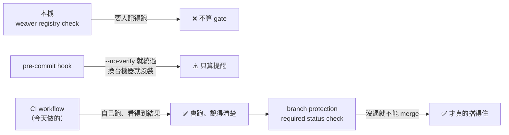
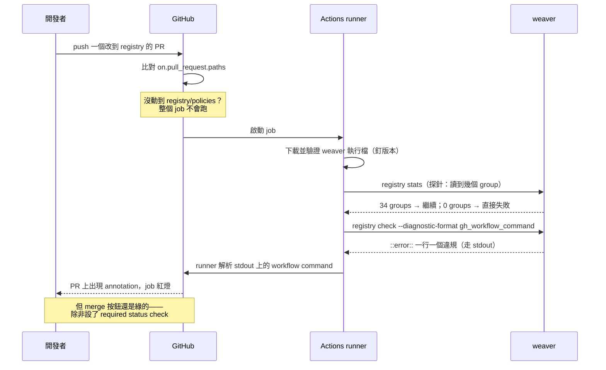

# Day11：把 `weaver check` 接進 CI Gate

Day10 那三條 naming policy 已經會動了：9 個違規、離開碼 1、`userId <-> user_id` 這個從 Day1 埋到現在的壞味道終於被機器指出來。

但它現在只存在於**我的筆電上**。

這句話聽起來像小事，其實是整個治理故事最關鍵的一道坎。Day1 那段結論說得很清楚：沒有治理的系統，不是因為沒人在乎品質，而是因為「命名一致性」從來沒有被指派給任何一個人、任何一段自動化流程去把關。一條需要人記得去跑的規則，並沒有把這件事指派給任何人——它只是把「要記得檢查命名」換成了「要記得跑 weaver」，責任還是壓在同一個會忘記的人身上。

今天要做的事，就是把這條規則從「跑得出來」變成「繞不過去」。

workflow 檔案在 submodule 的 [`.github/workflows/telemetry-schema.yml`](https://github.com/tedmax100/OTel_AIOps_Agent/blob/main/.github/workflows/telemetry-schema.yml)，這裡直接講重點跟實測結果。

## 「跑得出來」跟「繞不過去」差在哪

先把 gate 這個詞講清楚。一個檢查要真的成為治理機制，得同時滿足三件事，缺一個就會退化成「有裝但沒用」：

1. **它會自己跑**——不需要任何人記得
2. **它擋得住**——失敗時，這個改動不能進 main
3. **它說得清楚**——失敗時，作者不用來問你就知道要改什麼

這三件事對應到三個不同的地方，而且**很容易只做到前一兩件**。



最容易漏掉的是最後那一格。**CI 紅了不等於 merge 不了**——GitHub 預設是「紅燈只是紅燈」，PR 上的 merge 按鈕還是綠的、還是按得下去。要讓紅燈真的擋住，得另外去 branch protection 把這個 job 設成 required status check。這一步不在任何 YAML 裡，是 repo 設定，也是最常被忘記的一步：workflow 寫得再漂亮，少了它就只是一個「會發紅字的建議」。

至於 pre-commit hook，它的定位值得說一句：它不是 gate，是**縮短回饋迴圈的工具**。放在本機的好處是快（不用等 CI 兩分鐘），壞處是任何人都能 `--no-verify` 繞過、換一台機器就沒裝。合理的分工是兩層都放——本機那層讓你快點知道，CI 那層讓你繞不過去。今天只做 CI 這層。

## 結構：一次 PR 到一條紅字，中間發生什麼



這張圖裡有兩個地方是實際跑過才知道的（`stdout` 那條線、以及最後那個註記），下面會單獨拆開講。

## workflow 逐段拆解

完整檔案不長，一段一段看它在解決什麼問題。

### 觸發條件：只在動到治理資產時跑

```yaml
on:
  pull_request:
    paths:
      - "day10/registry/**"
      - "day10/policies/**"
      - ".github/workflows/telemetry-schema.yml"
```

治理閘門如果在每個無關的 PR 上都花兩分鐘，很快就會有人來問「可不可以關掉」。`paths` 讓它只在真正動到 registry 或 policy 時才啟動。

把 workflow 檔案自己也列進去，是為了避免一個很尷尬的情況：有人改壞了這份 workflow，而因為他沒動到 registry，這個改動不會觸發自己，就這樣合進去了。

### 安裝：一定要釘版本

```yaml
env:
  WEAVER_VERSION: v0.24.1
  WEAVER_TARGET: weaver-x86_64-unknown-linux-musl
```

```yaml
- name: Install weaver
  run: |
    set -euo pipefail
    base="https://github.com/open-telemetry/weaver/releases/download/${WEAVER_VERSION}"
    curl -sSLf -O "${base}/${WEAVER_TARGET}.tar.xz"
    curl -sSLf -O "${base}/${WEAVER_TARGET}.tar.xz.sha256"
    sha256sum -c "${WEAVER_TARGET}.tar.xz.sha256"
    tar -xf "${WEAVER_TARGET}.tar.xz"
    sudo install "${WEAVER_TARGET}/weaver" /usr/local/bin/weaver
    weaver --version
```

三個決定值得說明：

**釘死版本，不要用 latest。** weaver 還在 0.x，內建的驗證規則會隨版本變嚴——Day14 會重現一次 0.23.0 對一個完全合法的欄位直接 hard error 的踩坑。用浮動版本，等於讓你的 CI 隨時可能因為上游發了新版而變紅，而且是在一個跟這次 PR 完全無關的地方變紅。升級 weaver 應該是一個獨立的、有人看著的 PR。

**用 musl 而不是 gnu。** 這個是踩出來的：`weaver-x86_64-unknown-linux-gnu` 需要 GLIBC 2.38/2.39，在稍舊一點的環境（我的機器是 2.35）直接跑不起來：

```
./weaver: /lib/x86_64-linux-gnu/libc.so.6: version `GLIBC_2.38' not found
```

`ubuntu-latest` 目前是 24.04、glibc 2.39，gnu 版剛好可以跑——但這是運氣，不是保證。musl 是靜態連結的，在同一台機器上直接就動了。跑 self-hosted runner 或釘 `ubuntu-22.04` 的話，這個差別是會不會動的差別。

**驗 sha256。** 這是從 GitHub release 抓一個可執行檔進 CI，官方有附 `.sha256`，就順手驗一下。注意校驗檔裡寫的是檔名，所以下載時要用 `-O` 保持原檔名，`sha256sum -c` 才對得上。

### 探針：先確認檢查真的有在檢查

```yaml
- name: Probe — registry 真的有被讀進來
  run: |
    groups=$(weaver registry stats -r "$REGISTRY" \
             | grep -oE '[0-9]+ groups' | head -1 | cut -d' ' -f1)
    echo "resolved ${groups} groups"
    if [ "${groups}" -eq 0 ]; then
      echo "::error::registry 解析出 0 個 group——檢查根本沒讀到檔案，這不是通過"
      exit 1
    fi
```

這一步是 Day7 那個 `-r .` 假綠燈的直接產物。當時的結論是「一個永遠會過的檢查，比沒有檢查更危險」——那個結論放進 CI，就是這五行。

想像一下沒有它會發生什麼：有人重構目錄結構、`REGISTRY` 路徑寫錯了，`weaver registry check` 找不到東西、乖乖回報 0 groups 然後給綠燈，CI 全綠，從此這個 gate 就是裝飾品，而且**沒有任何人會發現**——因為它的症狀就是「一直都很順利」。

這也是一個可以推廣的習慣：**任何自動化檢查都該有一個「我確實檢查了 N 個東西」的斷言**，而不是只看它有沒有報錯。

### 檢查：`--diagnostic-stdout true` 不能省

```yaml
- name: weaver registry check
  run: |
    weaver registry check \
      -r "$REGISTRY" -p "$POLICIES" \
      --diagnostic-format gh_workflow_command \
      --diagnostic-stdout true
```

`--diagnostic-format gh_workflow_command` 會把 Finding 印成 GitHub Actions 的 workflow command 格式：

```
::group::Policy violation report
::error file=registry, title=semconv_attribute::message=id=missing_namespace, category=naming, group=registry.order, attr=status
::error file=registry, title=semconv_attribute::message=id=camel_case_attribute, category=naming, group=registry.order, attr=userId
::error file=registry, title=semconv_attribute::message=id=duplicate_concept, category=naming, group=(registry-wide), attr=userId <-> user_id
...
::endgroup::
```

至於 `--diagnostic-stdout true`——下一節專門講它，因為少了它整件事會安靜地失效。

### 失敗時補一次人看得懂的輸出

```yaml
- name: 完整診斷（失敗時才跑）
  if: failure()
  run: weaver registry check -r "$REGISTRY" -p "$POLICIES"
```

看起來多餘（同一個指令跑兩次？），但它補的是一個真實的洞，第三節會說明。

## 三個實測出來的陷阱

這三個都是接的過程中真的撞到的，每一個都會讓 gate 安靜地失效——不是報錯，是**看起來正常但沒有作用**。

### 一、診斷訊息預設走 stderr，而 GitHub 只讀 stdout

這是今天最值錢的一個發現。實測：

```
$ weaver registry check ... --diagnostic-format gh_workflow_command 2>/dev/null | grep -c "::error"
0

$ weaver registry check ... --diagnostic-format gh_workflow_command 2>&1 >/dev/null | grep -c "::error"
9
```

九行 `::error::` **全部走 stderr**。而 GitHub Actions runner 只解析 **stdout** 上的 workflow command——所以在預設設定下，那些 `::error::` 不會變成 annotation，只會變成 log 裡的一堆看起來很像註解的紅字。

從結果上看，這個失效非常隱蔽：job 還是紅的（離開碼是 1），log 裡還是看得到違規內容，一切「看起來都對」。但 PR 頁面上不會有任何 annotation，而 PR 頁面正是作者唯一會看的地方——他得自己點進 Actions、展開 log、往下捲，才看得到你以為會直接跳到他臉上的東西。

解法就是加上 `--diagnostic-stdout true`：

```
$ weaver registry check ... --diagnostic-format gh_workflow_command --diagnostic-stdout true 2>/dev/null | grep -c "::error"
9
```

**這件事沒有寫在 `--diagnostic-format` 的說明裡**——`--diagnostic-stdout` 是一個獨立的選項，說明只寫「送到 stdout 而不是 stderr」，不會告訴你不加它整個 annotation 機制就是壞的。兩個選項要一起用，這是實測才知道的組合。

### 二、annotation 落不到程式碼的行上

看一下 annotation 的實際內容：

```
::error file=registry, title=semconv_attribute::message=id=missing_namespace, ...
```

`file=registry`——這是 `-r` 傳進去的那個**目錄名**，不是實際出問題的 `model/drift.yaml`。而且完全沒有 `line=`。

後果是：GitHub 找不到這個路徑對應的檔案，所以 annotation 不會像 lint 錯誤那樣**內嵌在 PR diff 的那一行旁邊**，只會出現在 PR 頁面上方的摘要區。它還是看得到、還是有用，但少了「直接指到那一行」這個最好的部分。

另外 `title` 永遠是 `semconv_attribute`——這正是 Day10 講的那個錯位：你在 Rego 裡寫的 `type` 變成 Finding 的頂層 `id`，而 annotation 的 title 取的就是它。所以九條 annotation 的標題長得一模一樣，能區分它們的資訊全在 `message` 裡。

實務上的意思是：**別指望 annotation 能取代 log**。它適合當「這個 PR 有 9 個 schema 問題」的提示，細節還是得看完整輸出——這也是下一個陷阱要補的洞。

### 三、resolver 錯誤在 gh 格式下完全不會產生 annotation

Day7、Day8 反覆強調過 resolver 錯誤跟 checker Finding 是兩種不同的東西。這個差別在 CI 上會咬人一口。

拿一份 `ref` 指到不存在 attribute 的 registry（Day7 那個 `metric-dangling-ref` 的翻版），用 gh 格式跑：

```
$ weaver registry check -r <壞掉的 registry> --diagnostic-format gh_workflow_command

::group::Diagnostic report

::endgroup::

$ echo $?
1
```

一個**完全空的 group**。離開碼是 1，CI 會紅，但 PR 上什麼都沒有——連 log 裡都沒有，因為 gh 格式把原本那段人看得懂的診斷替換掉了。同一份 registry 用預設的 ansi 格式跑，訊息是完整的：

```
  × The following attribute reference is not resolved for the group
  │ Attribute reference: does.not.exist
```

也就是說：**`gh_workflow_command` 只實作了 policy Finding 的轉譯，沒有實作 resolver 錯誤的轉譯。** 如果你的 workflow 只跑 gh 格式那一次，作者會拿到一個紅燈加一片空白，然後來問你「這是怎樣」。

所以那個 `if: failure()` 的第二步不是多餘的：

```yaml
- name: 完整診斷（失敗時才跑）
  if: failure()
  run: weaver registry check -r "$REGISTRY" -p "$POLICIES"
```

它只在失敗時跑，成本是零，換來的是「任何一種失敗，log 裡都一定有一份人看得懂的說明」。

三個陷阱合起來看，是同一件事的三個切面：

| 陷阱 | 表面現象 | 實際後果 |
|---|---|---|
| 診斷走 stderr | job 紅了、log 有內容 | PR 上沒有 annotation |
| `file=registry`、沒有 `line=` | 有 annotation | 落不到 diff 的那一行 |
| resolver 錯誤空 group | job 紅了 | 完全沒有任何說明 |

**沒有一個會讓你看到錯誤訊息。** 它們的症狀都是「好像成功了、但少了點什麼」——跟 Day7 那個假綠燈、Day8 那條只比對名字的 policy，是同一個家族的問題。這也是為什麼我養成了一個習慣：任何自動化機制接好之後，一定要**故意讓它失敗一次**，確認失敗的樣子跟你想的一樣，而不是只確認成功的樣子。

## 讓紅燈真的擋得住

最後回到開頭那三件事裡的第二件。workflow 寫完、annotation 也出來了，但這時候 PR 上的 merge 按鈕**還是可以按**。

要讓它真的擋住，得去 repo 的 Settings → Branches → branch protection rule，把 `registry-check` 這個 job 加進 **Require status checks to pass before merging**。這一步刻意不在 YAML 裡——GitHub 的設計就是「跑什麼」由 repo 內容決定、「什麼算必要」由 repo 管理者決定，兩者分開。

這個分工其實有它的道理：如果「什麼檢查是必要的」也寫在 repo 裡，那任何有 write 權限的人都可以在同一個 PR 裡把 gate 關掉再繞過它。分開之後，關掉 gate 這件事需要另一個層級的權限，而且會留下設定變更的紀錄。

**但也因此，這一步是最容易被忘記的一步**——workflow 檔案進了 repo、CI 跑起來了、annotation 也漂亮，看起來大功告成，實際上還是一道推得開的門。

## 回到 AIOps：gate 守住的到底是什麼

把今天的東西接回主軸。

Day10 講過，一個 RCA agent 面對 `userId`/`user_id` 並存時，會自信地選一個查下去，基於半份資料給出看起來合理的結論。今天這道 gate 的作用，用一句話講就是：**它讓「系統裡有兩個名字在講同一件事」這件事，從此不可能再增加一個。**

這裡有一個時間上的不對稱，值得單獨點出來。治理的成本跟時間點關係極大：

- 在 PR 階段攔下來，成本是改一行 YAML
- 合併之後才發現，成本是改程式碼、重新部署、而且舊資料已經送出去了
- 等到 agent 因為它做出錯誤判斷才發現，成本是先花時間搞懂 agent 為什麼錯（而它不會告訴你它腦補了）、再回頭做上面那兩件事

Day1 那句「每一個決定在它發生的當下都是局部最優解」也可以反過來說：**每一個攔截，在它發生的當下成本都是最低的**。CI gate 做的事，就是把攔截點推到成本最低的那一刻。

而 Day10 的規則加上今天的 gate，合起來才構成 Day2 說的那件事——把語意這份共同約定，從「存在每個資深工程師腦子裡、靠口耳相傳」變成「一份機器每次 PR 都會核對、而且核對不過就進不來的規格」。少了今天這一半，Day10 那三條規則只是一個寫得很好的建議。

## 今天沒做的事

沒有實際貼一個被擋下來的 PR 截圖。workflow 本身跟三個陷阱都是本機實測過的（安裝步驟、探針、gh 格式輸出、離開碼），但把它推上去開一個示範用的 PR、讓 Actions 真的跑一次紅燈，是一個會留在公開 repo 上的動作，留給下一次補。

也沒有做 pre-commit hook 那一層。前面說過它不是 gate、是縮短回饋迴圈的工具，價值在於省掉等 CI 的兩分鐘，但概念上今天已經涵蓋了，實作留給有需要的人自己加。

沒有處理 `weaver registry diff`——「這個 PR 改壞了既有的定義」跟今天檢查的「這份定義自不自洽」是兩個不同的問題，需要拿 PR 的版本跟 main 的版本互比，那是 Day14 講 breaking change 時要接上的另一種 gate。

最後，今天這道 gate 守的仍然只有**靜態定義**。registry 寫得再對，都不保證服務真的照它送資料——`user_id`、`status` 這些 flat key 現在還大剌剌地在線上跑著，而今天的 CI 對此一無所知。

明天：`weaver registry live-check` 接上 collector，把真實 OTLP 流量丟進去跟 registry 比對，補上這個盲點。順便，Day10 那套沒有生效的三級嚴重度（`information`/`improvement`/`violation`），明天會在 advice 系統裡看到它真正的樣子。
