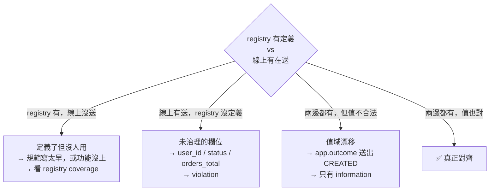
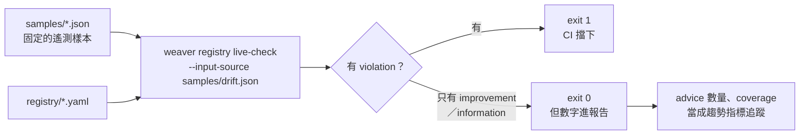

# Day12：`live-check`——補上 CI 看不到的那一半

Day11 那道 gate 現在是全綠的。registry 自洽、policy 全過、CI 會自己跑、離開碼是 0。

而此時此刻，`api-gateway` 正在送 `user_id`，`order-service` 正在送 `status`，`orders_total` 這個 metric 名字跟 registry 裡的 `app.orders.count` 一個字都對不上。

**這兩件事同時為真，而且不衝突。** Day8 第一次跑 check 拿到綠燈時就講過一次，今天要把它變成可以量測的東西。

程式碼跟樣本檔在 submodule 的 [`day12/`](https://github.com/tedmax100/OTel_AIOps_Agent/tree/main/day12)，這裡直接講重點跟真實輸出。

## CI 的盲點：定義對，不代表行為對

`weaver registry check` 檢查的問題是「**這份定義自不自洽**」。它從頭到尾只讀 YAML，不知道你的服務存不存在、有沒有在跑、送了什麼。所以「registry 寫得很漂亮」跟「服務照著送」之間，有一整片它看不到的地帶。

這片地帶裡有三種不同的落差，而且處理方式完全不同：



第二種是最直覺的——Day1 埋的那些壞味道都在這一類。但第一種跟第三種同樣重要，而且**只有拿真實流量去比對才看得出來**：

- 第一種（定義了沒人用）是治理的反向風險。一份 200 個 attribute 的 registry，如果實際只有 20 個在用，那份規範的可信度是有問題的——它描述的是一個想像中的系統。
- 第三種（值域漂移）正是 Day2 講的「同一個名字，語意隨時間漂移」。欄位名沒變、schema 沒變、CI 全綠，但值悄悄多了一種。這種漂移連 `registry diff` 都看不出來，因為 registry 根本沒動。

`live-check` 要回答的就是這三個問題。

## 不用把服務跑起來也能重現

Day9 的 `infer` 是一個常駐的 OTLP 接收器，要先把服務跑起來才有東西可看。`live-check` 預設也是這樣，但它多了一個對寫文章跟寫 CI 都很有用的選項：

```
--input-source <INPUT_SOURCE>
    Where to read the input telemetry from. {file path} | stdin | otlp [default: otlp]
```

**可以直接餵一個 JSON 檔**。這代表「線上流量長什麼樣」可以被固定成一份檔案，變成一個可重複、可進 CI、不需要任何服務在跑的測試——這件事的價值等一下會回頭講。

樣本格式官方文件沒有明講，是試出來的。第一次我照直覺寫成一個物件：

```
× Fatal error during ingest. Failed to parse JSON from file ...:
│ invalid type: map, expected a sequence at line 1 column 1
```

要的是陣列。包成陣列之後，第二個錯誤更有用：

```
× Fatal error during ingest. Failed to parse JSON from file ...:
│ unknown variant `name`, expected one of `attribute`, `span`,
│ `span_event`, `span_link`, `resource`, `metric`, `log`
```

錯誤訊息直接把**支援的七種樣本型別**列出來了。所以格式是「一個陣列，每個元素用型別當外層的鍵」：

```json
[
  {"span": {"name":"POST /api/orders","kind":"server","attributes":[
    {"name":"user_id","value":"u-5"},
    {"name":"order_id","value":"ord-1001"},
    {"name":"status","value":"created"},
    {"name":"userId","value":"u-7"}
  ]}},
  {"span": {"name":"span.app.order.create","kind":"server","attributes":[
    {"name":"biz.user.id","value":"u-5"},
    {"name":"app.outcome","value":"created"}
  ]}},
  {"span": {"name":"span.app.order.create","kind":"server","attributes":[
    {"name":"app.outcome","value":"CREATED"}
  ]}},
  {"metric": {"name":"orders_total","instrument":"counter","unit":"{order}"}}
]
```

這四個樣本刻意各代表一種情況：第一個是 Day1 的現況（flat key 加 `userId`/`user_id` 並存），第二個完全照 registry 寫，第三個名字對但值是 `CREATED` 不是 `created`，第四個是 metric 名字沒治理。

```bash
weaver registry live-check -r day06/weaver/registry --input-source day12/samples/drift.json
```

## 真實輸出：三種嚴重度終於登場

```
Span POST /api/orders `server`
    user_id = u-5
        - [violation] Attribute 'user_id' does not exist in the registry.
        - [improvement] Attribute key 'user_id' must include a namespace (e.g. '{namespace}.{attribute_key}')
    order_id = ord-1001
        - [violation] Attribute 'order_id' does not exist in the registry.
        - [improvement] Attribute key 'order_id' must include a namespace (e.g. '{namespace}.{attribute_key}')
    status = created
        - [violation] Attribute 'status' does not exist in the registry.
        - [improvement] Attribute key 'status' must include a namespace (e.g. '{namespace}.{attribute_key}')
    userId = u-7
        - [violation] Attribute 'userId' does not exist in the registry.
        - [improvement] Attribute key 'userId' must include a namespace (e.g. '{namespace}.{attribute_key}')
        - [violation] Attribute key 'userId' does not match name formatting rules.

Span span.app.order.create `server`
    biz.user.id = u-5
        - [improvement] Attribute 'biz.user.id' is not stable; stability = development.
    app.outcome = created
        - [improvement] Attribute 'app.outcome' is not stable; stability = development.

Span span.app.order.create `server`
    app.outcome = CREATED
        - [improvement] Attribute 'app.outcome' is not stable; stability = development.
        - [information] Enum attribute 'app.outcome' has value 'CREATED' which is not documented.

Metric orders_total `counter`, `{order}`
    - [violation] Metric does not exist in the registry.
```

Day10 找了半天沒找到的那套 `information` / `improvement` / `violation`，就在這裡。當時的結論是「`registry check` 的 policy 只有 `deny`、`level` 恆為 `violation`，三級嚴重度屬於 live-check 的 advice 系統」——現在它以最直接的方式證實了。

而且這個分級不是裝飾，它**決定離開碼**：

```
# 有 violation 的樣本
$ weaver registry live-check ... --input-source drift.json ; echo $?
1

# 只有 improvement / information 的樣本
$ weaver registry live-check ... --input-source clean.json ; echo $?
0
```

這就補上了 Day10 那個「check 只是二元閘門」的缺口。同一套機制，違規會擋、建議不會擋，你可以在 CI 上要求「不准有 violation」，同時讓 improvement 只是一份看板上的技術債清單。

### 六種內建 advice type

報告最後會把 advice 依型別統計，這幾個就是內建的全部：

| advice type | 等級 | 意思 | 對應到這系列的哪個坑 |
|---|---|---|---|
| `missing_attribute` | violation | 這個 attribute 在 registry 裡不存在 | Day1 的 flat key（`user_id`/`status`）|
| `missing_metric` | violation | 這個 metric 在 registry 裡不存在 | `orders_total` vs `app.orders.count` |
| `invalid_format` | violation | 名字不符合命名規則 | `userId`——Day10 那條 camelCase 規則的內建版 |
| `missing_namespace` | improvement | 名字沒有 namespace | Day10 規則三的內建版 |
| `not_stable` | improvement | 用到還在 `development` 的定義 | Day8 stats 顯示的 `development: 100%` |
| `undefined_enum_variant` | information | enum 送出一個沒定義過的值 | Day2 的「語意隨時間漂移」 |

有兩件事值得停下來看。

**第一，`missing_namespace` 跟 `invalid_format` 是內建的。** Day10 我親手寫了 Rego 去抓 camelCase 跟缺 namespace——live-check 這邊不用寫就有了。這不代表 Day10 白做：那三條規則跑在 **PR 階段的定義上**（擋的是「別把壞名字寫進 registry」），這裡跑在 **runtime 的真實資料上**（抓的是「程式碼實際送了壞名字」）。同樣一條規則，守在兩個不同的時間點，攔到的是不同的東西。

**第二，`not_stable` 對「完全正確」的資料也會叫。** 上面那個一字不差照 registry 送的 `biz.user.id`，一樣拿到一條 improvement——因為整份 registry 都還是 `development`（Day8 那張 stats 表的最後一列：`development: 55 (100%)`）。這條 advice 的意思不是「你送錯了」，而是「你正在依賴一個還沒承諾穩定的定義」。它會一直叫到 Day14 開始把定義標成 `stable` 為止，所以它本質上是一份**技術債的即時提醒**，不是錯誤。

### Registry coverage：一個很少被問的問題

報告最後還有一個容易被滑過去的數字：

```
Registry coverage
  - total seen: 3.77%
```

這是前面那三種落差裡的**第一種**——這份 registry 定義的東西，實際上只有 3.77% 在這批流量裡出現過。

這個數字單獨看沒有意義（樣本只有四筆），但接上真實流量之後它會變成一個很有用的治理指標。一份 registry 如果長期 coverage 只有 20%，代表兩件事之一：要嘛規範寫得太早、涵蓋了一堆還沒實作的東西；要嘛有一整塊服務根本沒把遙測送到這裡來。兩種都是「這份規範描述的不是真實系統」的訊號，而且**除了 live-check 沒有別的方法會告訴你**。

## 兩個坑

### 一、預設 port 是 4317，會吃到別人的遙測

`live-check` 不給 port 參數時，實測直接綁在 `0.0.0.0:4317`：

```
$ ss -tlnp | grep weaver
LISTEN 0 128 0.0.0.0:4317 0.0.0.0:* users:(("weaver",pid=626467,fd=3))
LISTEN 0 128 0.0.0.0:4320 0.0.0.0:* users:(("weaver",pid=626467,fd=10))
```

4317 是 OTLP/gRPC 的標準 port，也就是**本機所有 OTel 相關工具的預設值**。Day9 提過一次要避開它，今天講清楚為什麼。

我第一次跑 live-check 時，報告裡出現了一批我完全沒印象的 span 和 log。追下去才發現：那是我當下正在用的 coding agent 自己的遙測——它也設定了 OTLP 輸出到預設的 4317，而 live-check 就在那裡等著。更糟的是，那些 log 裡帶著 `user.email` 這種 PII，就這樣進了報告。

三個層面的問題：**污染**（報告裡混進不屬於這個系統的資料，統計數字全部失真）、**PII**（那份報告如果存檔、進 CI artifact、貼進 issue，就是一次資料外洩）、**看不出來**（live-check 不會告訴你「這批資料來自另一個程序」，它一視同仁地收）。

這跟 Day9 那個 `span.otel.weaver.emit`（emit 自己的 span 被 infer 學進去）是同一件事的放大版：**OTLP 接收器沒有能力分辨「我要治理的系統」跟「剛好也在送資料的東西」**。

所以習慣是：跑 live-check 或 infer 一律指定一個不會撞的 port，而且綁在 localhost：

```bash
weaver registry live-check -r day06/weaver/registry \
  --otlp-grpc-address 127.0.0.1 --otlp-grpc-port 14317 --admin-port 14320
```

順帶一提 `--admin-port` 預設是 4320，`/stop` 端點掛在上面，預設不活動 10 秒就會自己停。

### 二、`--advice-policies` 是覆蓋，不是疊加

想加一條自己的 advice 規則時，會很自然地以為 `--advice-policies` 是「再加上這個目錄的規則」。它不是。help 寫得其實很誠實，只是很容易看過去：

```
--advice-policies <ADVICE_POLICIES>
    Advice policies directory. Set this to override the default policies
```

**override**。實測：同一份樣本，加上一個內容不生效的 advice 目錄，前後對照——

```
# 不給 --advice-policies
  - advice type:
    - invalid_format: 1
    - missing_attribute: 4
    - missing_metric: 1
    - missing_namespace: 4
    - not_stable: 3
    - undefined_enum_variant: 1

# 給了一個沒有有效規則的目錄
  - advice type:
    - missing_attribute: 4
    - missing_metric: 1
    - not_stable: 3
    - undefined_enum_variant: 1
```

`invalid_format` 跟 `missing_namespace` **消失了**，五條 advice 不見，而且沒有任何警告。

這個對照還順便揭露了一件事：內建的六種 advice 其實分成兩層。`missing_attribute`、`missing_metric`、`not_stable`、`undefined_enum_variant` 是寫死在 weaver 裡的，`--advice-policies` 動不到；而 `invalid_format` 跟 `missing_namespace` 是用 Rego 實作的**預設 advice policy**，一旦你指定了自己的目錄，它們就被整個換掉。

於是這變成這系列第四次撞到同一個模式了：

| 天 | 現象 | 真正的意思 |
|---|---|---|
| Day7 | `-r .` 給綠燈 | 一個 group 都沒載入 |
| Day8 | policy 給綠燈 | 規則只比對名字前綴，沒在看基數 |
| Day10 | package 打錯給綠燈 | 這份 policy 從來沒被執行 |
| Day12 | advice 少了兩種 | 預設 advice policy 被你的目錄覆蓋掉了 |

**四次的共通點都是：工具用「安靜」表達「你設定錯了」。** 所以每次接上一個新機制，第一件事都該是先量一個基準（幾個 group、幾條 advice、coverage 多少），之後任何一次數字掉下來，才有東西可以比。

## 把它接進 CI：從「跑一次看看」到「不會再退步」

前面提到 `--input-source` 吃檔案這件事的價值，在這裡兌現。

把一組代表性的遙測樣本存成檔案進 repo，live-check 就從「臨時跑一次的診斷工具」變成一個**回歸測試**：



這樣一來，「哪些欄位還沒遷移」不再是一份會過期的 wiki 文件，而是一個每次 PR 都會重算的數字。而且方向是雙向的：改壞 registry 會讓樣本噴出新的 violation，改進服務則會讓 violation 數量下降——**遷移進度變成可以看著它歸零的東西**。

這也是 CI 這條線上，繼 Day11 之後的第二層：Day11 守的是「別把壞定義寫進來」，今天守的是「別讓實際行為離規範更遠」。

## 回到 AIOps：agent 需要的是哪一種保證

把今天的東西接回主軸。

Day10 講過 agent 面對 `userId`/`user_id` 並存時會怎麼腦補。但那時談的是**registry 裡有兩個名字**。今天的角度不一樣：registry 裡只有 `biz.user.id` 一個名字，寫得乾乾淨淨，CI 全綠——**而線上一筆 `biz.user.id` 都沒有**。

對一個要讀 registry 來決定查詢條件的 agent 來說，這是更危險的一種情況。Day15 會讓 agent 透過 MCP 直接查 registry，如果那份 registry 描述的是一個「應然」而不是「實然」的系統，agent 會非常有信心地產生一個語法完全正確、但查不到任何資料的查詢——然後根據空結果做出「這個服務沒有問題」的結論。

**空結果跟「沒有問題」在資料上長得一模一樣**，這又是同一個家族的問題，只是這次踩到的是 agent 而不是工程師。

所以 registry coverage 這個數字，對 AIOps 來說的意義比對人來說大得多：**它衡量的是「這份規範可不可以被信任成系統的描述」**。人看到查詢沒結果會起疑、會換個欄位再試一次；agent 不會，它會把空結果當成一個事實。這也是為什麼 live-check 不能只是一個上線前跑一次的工具，而該是持續在跑的東西——它守的是 registry 這份治理資產本身的可信度。

## 今天沒做的事

沒有真的把 live-check 接上 collector 常駐。今天全部用 `--input-source` 的檔案模式，好處是可重現、可進 CI、不會吃到別人的遙測；接上 collector 讓它長時間收線上流量是另一種用法，需要處理取樣、報告輪替、以及上面那個 PII 問題，留到有實際場景時再展開。

沒有寫出一條自訂的 advice policy。試了幾個 package 名字都沒有讓自訂規則生效，而只憑猜測寫一段「應該是這樣」的 Rego 貼上來，違背這系列只貼真實輸出的原則。已經確認的是 `--advice-policies` 會覆蓋掉預設的兩條 Rego advice——**怎麼正確地寫一條新的，還沒解出來，之後補**。

也沒有處理那張 flat key 遷移表。今天只是把「還差多少」變成一個機器每次都會重算的數字，真正動 `o11y_shared` 跟五個服務，還是後面的事。

明天：從零定義一組自己的 semantic convention（`payment-events.yaml`），再疊一層 team-specific registry 在 base 之上——`manifest.yaml` 的 `dependencies`、`schema_url`、多團隊分層會撞在哪，以及 `before_resolution` 那個 package 終於有場景可以用了。
