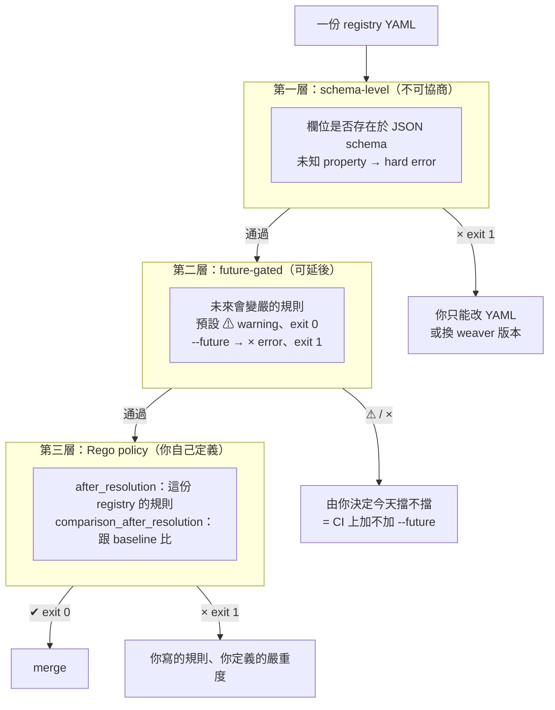
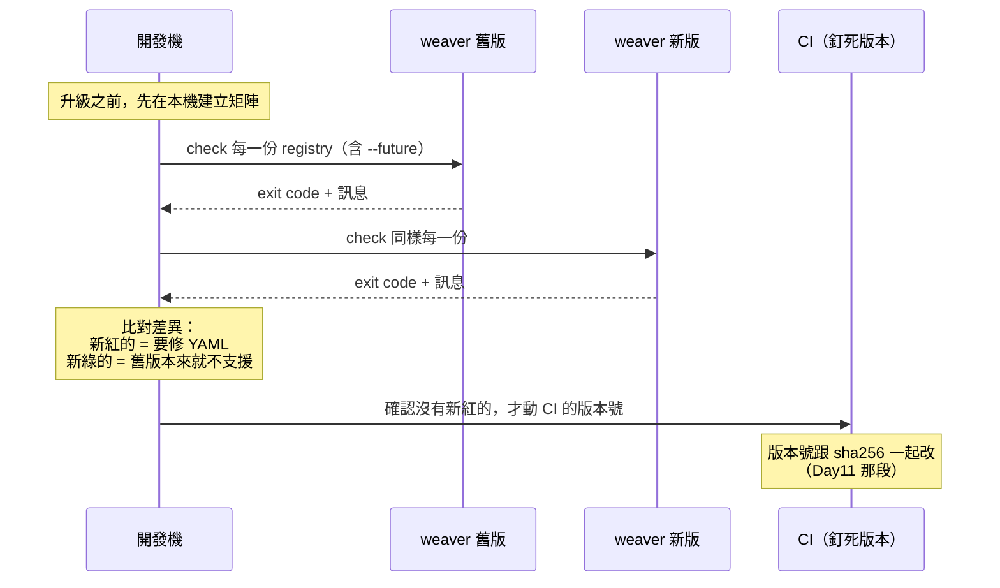
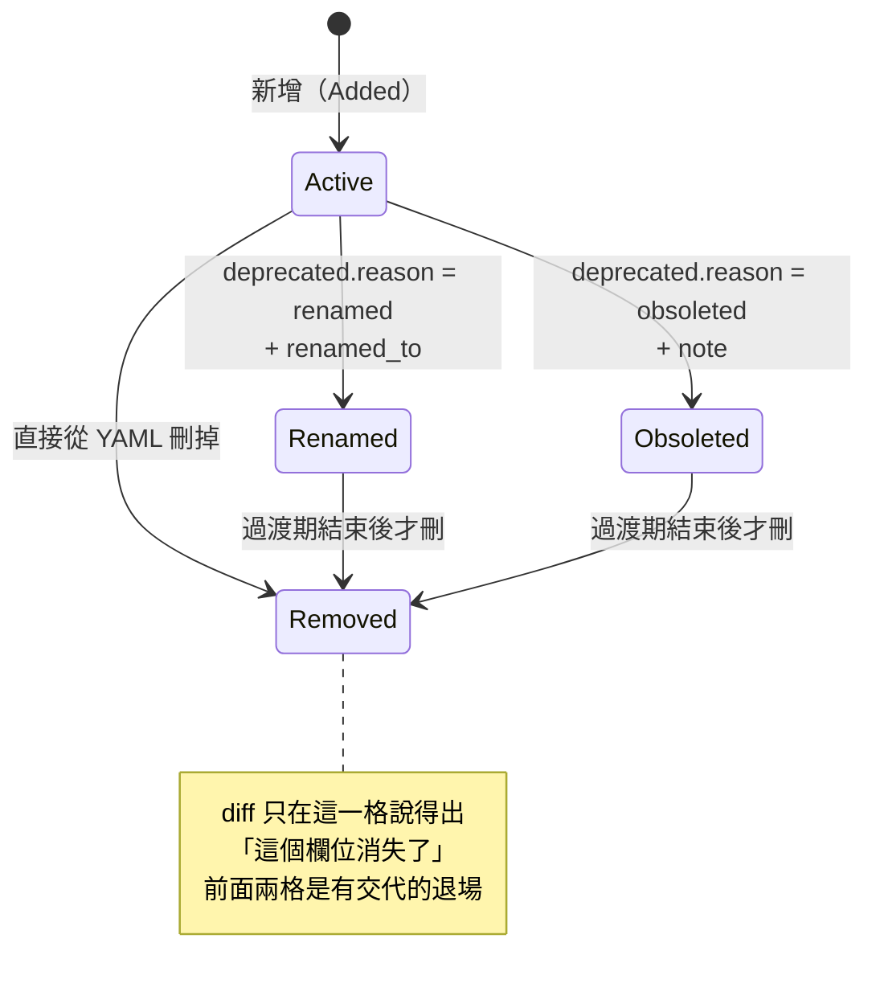
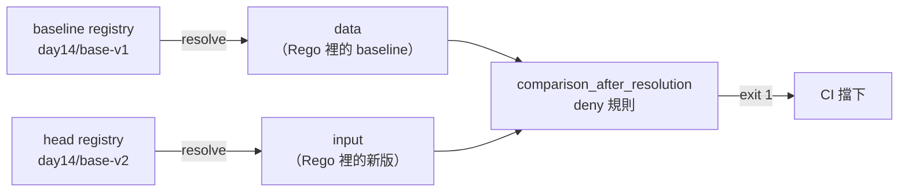

# Day14：breaking change——三層驗證模型與 registry diff

Day13 把 registry 疊成了多層，結尾留了一個問題沒回答：**base 改一個欄位，`diff` 能不能告訴你哪些團隊會被打到。**

今天要回答它，但答案不太好聽，而且在回答之前得先承認一件更基本的事：在這套工具鏈裡，「breaking change」不是一個來源，是兩個。

第一個來源是你自己改 registry。平台團隊把 `payment.id` 改名成 `payment.transaction_id`，這件事對所有 `ref: payment.id` 的團隊、對所有已經送出去的遙測、對所有寫在 dashboard 跟 alert 裡的欄位名，全部有影響。

第二個來源是**工具自己升版**。這個更陰險，因為它不在你的 PR 裡。試著把時間拉回一個很日常的當下：某天你更新了 CI 上的 weaver 版本號——可能只是因為想用新指令、可能只是 renovate 開了一個 PR——然後一份三個月來都是綠燈的 registry 突然紅了，錯誤訊息指著一個你根本沒改過的欄位。或者更糟的方向：**你把版本往下釘**（Day11 那個「釘死版本」的建議照做了，只是釘錯了數字），然後 Day13 那份分層架構直接 panic。

這兩個來源合起來，需要的不是「更嚴格的檢查」，而是**知道每一種檢查在哪一層生效、哪一層是可以協商的**。這就是今天要拆的三層驗證模型。

而在拆之前先把位置站好：今天所有決定都是**平台團隊的決定，成本卻大部分落在產品團隊身上**。CI 要不要加 `--future`、什麼算 breaking change、base 改名之後給多長的遷移期——這些沒有一個是產品團隊能自己選的，但每一個都會變成他們某天早上被擋下來的那個 PR。這種「決定權跟成本不在同一邊」的結構，是平台工程裡最容易把事情做壞的地方：規則本身可能完全正確，但如果被擋的人看不懂訊息、不知道該找誰、不知道自己有多少時間可以改，那道 gate 最後會被繞過，而不是被遵守。所以今天每一層除了「它擋什麼」，都要順便看「它擋下來的時候，對方能不能自己走出去」。

程式碼在 submodule 的 [`day14/`](https://github.com/tedmax100/OTel_AIOps_Agent/tree/main/day14)（四個版本的 base registry ＋ 兩條 policy），環境是 weaver `0.24.1`，另外留了一份 `0.23.0` 的 binary 做版本對照。

## 結構：三層，各有各的談判空間

weaver 對一份 registry 的「不合法」有三種完全不同的處理方式，而它們的差別不在嚴重程度，在**誰有權決定**。



三層的分工可以用一句話記：**第一層是 weaver 說不行，第二層是 weaver 說「以後不行」，第三層是你說不行。** 大部分團隊只用到第一層——因為那是唯一不用做任何設定就會生效的一層，也因此大部分團隊對「什麼是 breaking change」的定義，其實是被工具預設值決定的，而不是自己想過的。

換成平台工程的語言，這三層剛好對應**強制、預設、建議**這三種規則強度，而三者的差別在於「誰擁有它」以及「產品團隊能不能協商」：

| 層 | 規則強度 | 誰擁有 | 產品團隊能不能協商 | 平台團隊的維護成本 |
|---|---|---|---|---|
| schema-level hard error | 強制 | 上游工具（weaver 作者） | 不能，只能改 YAML 或換版本 | 零，但也零彈性 |
| `--future` | 預設 | 平台團隊（決定 CI 加不加） | 可以爭取「這一輪先不加」 | 一個時程決定＋一次存量清理 |
| Rego policy | 建議到強制之間 | 平台團隊（可按團隊分級） | 可以，因為規則是你寫的 | 每條規則都要自己維護、自己解釋 |

這張表最值得注意的是第三列跟第五列的關係：**彈性跟維護成本是成正比的。** 第一層完全不用維護，因為它也完全不給你選；第三層能精準表達你們團隊的領域知識，代價是那些規則從此是你們的資產，工具升版時可能要重寫（今天最後那個 `--v2` 沒做的事就是這個風險）。

這也是為什麼「全部往第三層堆」不是答案。paved road 的重點不是路上關卡多，是**預設那條路最好走**——一條規則能靠第二層免費拿到，就不要自己寫一條 Rego 去維護它。

下面三段各打一層。

## 第一層：hard error 沒有商量空間，連合法欄位都可能中槍

先講最讓人不舒服的那個實測。

`metric_requirement_level` 這個欄位，在 semantic convention 的規格文件裡是有的——它的用途很具體：一個 attribute 在 span 上是 `required`，但作為 metric 的 dimension 只是 `recommended`（因為每加一個 dimension 都是 cardinality 成本）。這是**同一個 attribute 在不同 signal 上要有不同要求**的正規表達方式：

```yaml
  - id: metric.payment.duration
    type: metric
    metric_name: payment.duration
    instrument: histogram
    unit: s
    stability: development
    brief: "支付請求耗時"
    attributes:
      - ref: payment.outcome
        requirement_level: required
        metric_requirement_level: recommended   # ← 規格裡有這個欄位
```

實測：

```
$ weaver registry check -r day14/breaking
ℹ Found registry manifest: day14/breaking/manifest.yaml

Diagnostic report:

  × The following YAML snippet does not match any of the allowed schemas.
  │ (Variant 1):
  │ - Object contains unexpected properties: metric_requirement_level. These
  │ properties are not defined in the schema.
  │ (Variant 2):
  │ - Missing required property: "id".
  │ - Missing required property: "type".
  │ - Object contains unexpected properties: metric_requirement_level, ref.
  │ These properties are not defined in the schema.

$ echo $?
1
```

`0.23.0` 跟 `0.24.1` 兩個版本、加不加 `--future`，四種組合全部一樣是 exit 1。**規格寫得出來的東西，工具收不進去。**

錯誤訊息的形狀值得單獨看一眼，因為這是第一層錯誤的典型長相：它不會說「`metric_requirement_level` 目前不支援」，它會把兩個 variant 的失敗理由**都**印出來——Variant 1 是「ref 形式的 attribute」，Variant 2 是「inline 定義的 attribute」。weaver 拿你這段 YAML 去試每一種允許的形狀，全部失敗，然後把所有失敗理由攤給你。所以你會看到「Missing required property: `id`」這種完全誤導的一行：它不是在要求你補 `id`，它只是在說「如果你想寫成 inline 定義，那你少了 `id`」。

這種訊息在 CI 上讀起來特別痛苦，因為真正有用的資訊只有第一行那個 `unexpected properties`，其他都是雜訊。實務上的處理方式只有兩種：拿掉那個欄位，或者接受這份 registry 過不了 CI。**沒有第三條路**——這一層沒有 flag、沒有 policy 可以放行，也不會因為你加 `--future` 或不加而改變。這跟 Day11 那些「安靜失效」的坑正好是另一個極端：這個錯誤非常大聲，只是它擋的東西是對的。

把這件事換算成平台成本，它比看起來貴。一個產品團隊的工程師照著規格文件寫了 `metric_requirement_level`，CI 紅了，訊息叫他補一個 `id`——他補了，錯誤沒變，然後他來問你。**這一次來回大概二十分鐘，而它會在每一個獨立發現這個欄位的團隊身上各發生一次。** 這是那種不會出現在任何儀表板上的平台成本：規則是對的、工具是對的，但診斷訊息沒有把「下一步該做什麼」講出來，於是每個使用者的困惑都變成平台團隊的一次人工客服。

能做的事其實不多，但都不是「等上游修訊息」：把這類已知的工具限制寫進 registry 範本的註解裡（Day17 那份新服務 checklist 的用途之一），或者在 CI 的失敗輸出後面附一行團隊自己的 FAQ 連結。**判斷一道 gate 是否可規模化的標準很簡單：被擋的人能不能不找你就走出去。** 這一層目前的答案是不能，所以差額得由平台團隊用文件補上——這也是「治理成本包含平台團隊自己的成本」最具體的一種形式。

順帶把 Day7 那條線接起來：這也是為什麼「照著規格文件寫 YAML」不等於「registry 會過」。規格是給人跟給多個實作看的，weaver 是其中一個實作，兩者之間的落差不會有人跟你講——你只會在 CI 上撞到。

## 第二層：同一句診斷，`⚠` 跟 `×` 只差一個 flag

第二層是 `--future`。它的說明只有一句「Enable the most recent validation rules」，但實際行為比這句話有意思得多。

`day14/future/` 這份 registry 裡放了三個違規，各代表一種很常見的寫法：`deprecated` 寫成字串（舊版 semconv 的寫法是 `deprecated: "use x instead"`，新的結構化寫法是 `deprecated: {reason: renamed, renamed_to: x}`）、attribute 少了 `stability`、`string` 型別的 attribute 沒給 `examples`。預設跑：

```
$ weaver registry check -r day14/future
✔ No `after_resolution` policy violation

Diagnostic report:

  ⚠ The `deprecated` property in `demo.renamed_old_style` is invalid.
  │ Unstructured deprecated note is not supported on attributes.
  │ Provenance: "day14/future/model/m.yaml"

  ⚠ Invalid attribute definition detected while resolving
  │ '"day14/future/model/m.yaml"' (group_id='registry.future_demo',
  │ attribute_id='demo.no_stability'). Missing stability field.

  ⚠ The attribute `demo.no_examples` in the group `registry.future_demo`
  │ contains an example that will be considered invalid in the future. This
  │ attribute is a string but it does not contain any examples..

$ echo $?
0
```

第三句的措辭最誠實，它直接把「將來會變嚴」寫進訊息裡。加上 flag 之後：

```
$ weaver registry check -r day14/future --future
  × The `deprecated` property in `demo.renamed_old_style` is invalid.
  │ Unstructured deprecated note is not supported on attributes.
  ... （三句一模一樣的診斷，只有符號從 ⚠ 變成 ×）

$ echo $?
1
```

**同一句話，只有開頭那個符號不一樣。** 這是第二層的定義性特徵：不是「有沒有偵測到」，是「偵測到之後算不算失敗」。也就是說預設模式並沒有「比較不嚴格」——它一樣做了全部檢查、一樣把結果印給你，只是不擋。這比「預設關閉某些規則」危險，因為訊息在 CI log 裡看起來跟其他 `ℹ` 一樣像雜訊，而 exit 0 讓沒有人需要去讀它。

四種組合的完整對照（另外附一個對照組：group id 不以 `registry.` 開頭——這個在官方 semconv repo 是慣例，但 weaver 兩個版本、加不加 flag 都不管）：

| 案例 | 0.23.0 預設 | 0.23.0 `--future` | 0.24.1 預設 | 0.24.1 `--future` |
|---|---|---|---|---|
| `deprecated` 寫成字串 | ⚠ exit 0 | × exit 1 | ⚠ exit 0 | × exit 1 |
| 缺 `stability` | ⚠ exit 0 | × exit 1 | ⚠ exit 0 | × exit 1 |
| string 缺 `examples` | ⚠ exit 0 | × exit 1 | ⚠ exit 0 | × exit 1 |
| group id 不叫 `registry.*` | exit 0 | exit 0 | exit 0 | exit 0 |
| `metric_requirement_level`（第一層） | × exit 1 | × exit 1 | × exit 1 | × exit 1 |

這張表有兩個要拿走的結論。第一，**這三條規則在兩個版本間是穩定的**——`--future` 不是「這一版新加的東西」，而是一個長期存在的預告區。第二，也因此，**CI 上該不該加 `--future`，是一個真正的治理決定，不是技術細節**：加了，你的 registry 提前對齊未來的規則，代價是今天就得補完所有 `examples`；不加，你會在某個未來版本把預告區轉正的那天，一次收到全部帳單。

我的建議是新 registry 一律加。理由跟 Day10 講 policy 時一樣：**規則越晚生效，違規的存量越大，而存量夠大的時候，規則就會被繞過而不是被遵守。**

但既有 registry 就不能這樣一句話帶過，因為那不是技術決定而是排程決定，而做這個決定的人不是要補 `examples` 的人。實際的做法是把它當成一次有期限的遷移，而不是一個開關：先在不擋的模式下把違規數量數出來（`--future` 跑一次、看有幾個 `×`），照數量決定給多長的時間，公告一個日期，日期到了才在 CI 上加上那個 flag。**這裡的關鍵不是給多久，是「有沒有給一個日期」**——沒有日期的規則會一直是建議，而某天有人為了趕上線把它從建議變成豁免，之後就再也回不去了。

這也順便回答一個常被問的問題：為什麼不乾脆讓每個團隊自己決定加不加。因為 registry 是共用的資產，一份缺 `examples` 的 attribute 對所有下游都少了一份資訊（下一節會講為什麼 agent 特別吃這個），**它的成本不落在寫它的那個團隊身上**。這種外部性正是平台團隊該把決定收回來自己做的判準：影響只在自己團隊內的，交給團隊；成本會外溢到別人身上的，平台統一決定並負責提供遷移期。

`examples` 這條規則還有一個 AIOps 上的理由，值得單獨說：Day7 講 `enum` 的 `members` 是 LLM 唯一能事先知道 label 值域的來源；`examples` 在非 enum 的欄位上扮演的是同一個角色的弱化版——它是 agent 唯一能猜到「這個欄位長什麼樣」的線索。一個沒有 `examples` 的 `string` attribute，對 LLM 來說跟「這裡有一個字串」一樣沒有資訊量。weaver 把它列進未來會變嚴的規則，方向是對的。

## 工具升版也是 breaking change：一個 exit 134

現在講第二個 breaking change 來源。

Day13 第三個陷阱的結論是：`ref` 只看得到直接依賴，所以三層架構下，**用到的每一層都得列成直接依賴**。那份修好的 `squad/manifest.yaml` 長這樣：

```yaml
dependencies:
  - name: commerce-division
    registry_path: day13/division
  - name: payments-base          # ← 隔一層的也要自己列
    registry_path: day13/base
```

在 `0.24.1` 上，它是綠燈。把同一份 registry 交給 `0.23.0`：

```
$ weaver-0.23.0 registry check -r day13/squad
Weaver Registry Check
Checking registry `day13/squad`
ℹ Found registry manifest: day13/squad/manifest.yaml

thread 'main' (376199) panicked at crates/weaver_resolver/src/loader.rs:212:17:
not yet implemented: Multiple dependencies is not supported yet.

$ echo $?
134
```

**不是診斷訊息，是 panic。** exit code 134 是 SIGABRT，Rust 的 `todo!()` 直接把 process 打掉——沒有 Diagnostic report、沒有 provenance、`--diagnostic-format gh_workflow_command` 也產不出任何 annotation（回指 Day11 第三個坑：CI 紅了但 PR 上什麼都沒有，這次連 `::group::` 都沒有）。

這件事的意義比「舊版有 bug」大得多：**Day13 那個陷阱的解法，本身是一個有版本下限的東西。** 多依賴支援是 `0.24` 才進來的，所以那篇文章裡「把所有祖先都列出來」的建議，在 `0.23.x` 上不只是沒用，是會讓 CI 以一個沒有人看得懂的方式爆掉。

跑一次跨版本的全量對照，把手上所有 registry 都餵給兩個版本：

| registry | 0.23.0 | 0.24.1 | 差異來自 |
|---|---|---|---|
| `day13/base`（單層） | exit 0 | exit 0 | — |
| `day13/team`（兩層，一個依賴） | exit 0 | exit 0 | — |
| `day13/team-collision` | exit 0 | exit 0 | 兩版都是那個安靜的綠燈 |
| `day13/squad`（三層，兩個依賴） | **exit 134** | exit 0 | 多依賴支援 |
| `day14/base-v1` / `base-v2` | exit 0 | exit 0 | — |
| `day14/breaking` | exit 1 | exit 1 | 第一層 hard error |

所以「升級 weaver 之前該怎麼測」的答案，其實就是這張表怎麼生出來的：**把兩個版本的 binary 都留在手上，對你所有的 registry 跑一次矩陣，比對 exit code。** 不是讀 CHANGELOG——CHANGELOG 不會告訴你「你那份三層 registry 在舊版會 panic」，只有跑過才知道。



這也讓 Day11 那個「釘死 weaver 版本」的建議多了一層具體理由。當時的理由是「0.x 的內建規則會變嚴」——那是第一層跟第二層的事。今天多了一個：**功能會往回消失**。版本號不只決定嚴格程度，還決定你的 registry 結構本身合不合法。

這個 panic 在平台的角度上還有一層意義，跟第一層那個誤導訊息是同一類問題的極端版本：**exit 134 沒有任何一句話是給使用者看的。** 沒有 provenance、沒有「請升級到 0.24」、沒有 annotation，只有一行 Rust 的檔名跟行號。一個產品團隊的人在 CI 上看到這個，能做的判斷是零——他不會知道問題在 manifest 的依賴列表，更不會想到問題在 weaver 的版本。這種失敗形式會百分之百變成一張 support ticket，而且解法只有平台團隊知道。

所以「weaver 版本」這件事的擁有權必須是明確的：**版本號、sha256、以及那個跨版本矩陣，都是平台團隊的資產，產品團隊不該有機會自己選版本**——不是因為不信任他們，是因為選錯的代價是一個沒有人看得懂的 panic。反過來說，平台團隊也因此欠一個義務：升級之前得自己跑過那張矩陣，不能等產品團隊的 CI 幫你測。

## `registry diff`：五種變更分類，跟三個它看不到的東西

處理完工具升版，回到第一個來源：registry 自己改版。

做一組真實的版本演進。`base-v1` 是 Day13 那份的擴充版（四個 attribute、一個 event），`base-v2` 對它做了五種變更，故意一次湊滿文件上列出的所有分類：

```yaml
# base-v2/model/payment-events.yaml
      # renamed: payment.id -> payment.transaction_id
      - id: payment.id
        type: string
        stability: development
        deprecated:
          reason: renamed
          renamed_to: payment.transaction_id
        brief: "支付交易識別碼"
        examples: ["pay-1001"]
      - id: payment.transaction_id      # added
        type: string
        stability: development
        brief: "支付交易識別碼（改名後的正式欄位）"
        examples: ["pay-1001"]

      # obsoleted: 還在，但宣告不要再用
      - id: payment.gateway
        type: string
        stability: development
        deprecated:
          reason: obsoleted
          note: "金流商改由 server.address 表達，不再需要獨立欄位"
        ...

      # removed: payment.retry_count 整個消失（v1 有、v2 沒有）
```

```
$ weaver registry diff -r day14/base-v2 --baseline-registry day14/base-v1

Schema Changes between `0.2.0` and `0.1.0`

List of Changes to Registry Attributes
Added Registry Attributes:
  - Add payment.method
  - Add payment.transaction_id

Renamed Registry Attributes:
  - Rename payment.id to payment.transaction_id (Note: Replaced by `payment.transaction_id`.)

Obsoleted registry_attributes:
  - payment.gateway (Note: 金流商改由 server.address 表達，不再需要獨立欄位)

Removed registry_attributes:
  - payment.retry_count

List of Changes to Events
Added Events:
  - Add payment.refunded
```

這份報告該給的都給了：`0.2.0` 跟 `0.1.0` 是從兩份 `manifest.yaml` 的 `schema_url` 尾巴取出來的（Day13 說那個 `0.1.0` 還只是裝飾，今天它終於有用途了）；attribute 跟 event 分開列；rename 有指向新名字；obsolete 有把 `note` 帶出來。`--format json` 跟 `--format markdown` 都可以，markdown 那份可以直接貼到 PR 說明或 release note 裡，這是 `diff` 最實用的用法。

**注意 `deprecated` 的三個 reason 帶來的三種不同待遇**：`renamed` 進 Renamed 區、`obsoleted` 進 Obsoleted 區、而什麼都不寫、直接把欄位刪掉，才會進 Removed 區。也就是說 Removed 這一區的語意其實是「**沒有交代就消失**」——它不是一個中性的分類，是一個指控。



到這裡 `diff` 看起來很稱職。接下來是今天的重點。

### diff 看不到的三件事

再做一份 `base-v3`，這次**只改性質、不動名字**。三個改動，每一個在真實團隊裡都會有人以為「這不算 breaking change」：

- `payment.retry_count` 的 `type` 從 `int` 改成 `string`
- `payment.outcome` 的 `brief` 補上值域說明
- `event.payment.authorized` 上的 `payment.gateway` 從 `recommended` 提升成 `required`

```
$ weaver registry check -r day14/base-v3
✔ No `after_resolution` policy violation
$ echo $?
0

$ weaver registry diff -r day14/base-v3 --baseline-registry day14/base-v1

Schema Changes between `0.3.0` and `0.1.0`


Total execution time: 0.010083165s
```

**空白。** 不是「沒有 breaking change」，是**一個變更都沒報**。用 JSON 格式看更清楚，五個分類全是空陣列：

```json
{
  "head": { "semconv_version": "0.3.0" },
  "baseline": { "semconv_version": "0.1.0" },
  "changes": {
    "entities": [], "metrics": [], "events": [], "spans": [],
    "registry_attributes": []
  }
}
```

還有第四份 `base-v4`，只做一件事：把 `payment.outcome` 這個 enum 的 `declined` member 拿掉。

```
$ weaver registry diff -r day14/base-v4 --baseline-registry day14/base-v1

Schema Changes between `0.4.0` and `0.1.0`

```

也是空白。

所以 `diff` 的能力邊界很清楚：**它比對的是「有哪些東西」，不是「這些東西長什麼樣」。** 名字層級的增刪改它都看得到，名字底下的內容它完全不看。

而這件事的難處在於，被漏掉的那幾種，剛好是後果最嚴重的幾種：

| 變更 | 對下游的實際後果 | `diff` | `check` |
|---|---|---|---|
| 欄位改名（有 `renamed_to`） | 有交代，可漸進遷移 | ✅ 報 | 綠燈 |
| 欄位直接刪除 | 下游 `ref` 解不到，硬錯誤 | ✅ 報 | 下游會紅 |
| **型別 `int` → `string`** | 既有 dashboard／PromQL／eval fixture 全錯，但沒人會紅 | ❌ 靜音 | 綠燈 |
| **enum 少一個 member** | 既有資料變成非法值；agent 的值域認知錯誤 | ❌ 靜音 | 綠燈 |
| `requirement_level` 提升 | 既有 producer 全部變成不合規 | ❌ 靜音 | 綠燈 |

型別改變這一格值得多說一句。`int` 改成 `string` 在 registry 裡是一行 YAML，在下游是：所有對這個欄位做算術的 PromQL 全部失效、所有 `histogram_quantile` 的 label 比對失效、所有拿它當數字排序的 dashboard panel 變成字典序。這是那種**改的人覺得無所謂、用的人要修一整天**的變更，而它在整條工具鏈上完全不留痕跡。

## 第三層：用 `comparison_after_resolution` 把 diff 的洞補起來

`check` 有一個 Day11、Day13 都沒用到的旗標：`--baseline-registry`。加上它之後，輸出多了一行：

```
$ weaver registry check -r day14/base-v2 --baseline-registry day14/base-v1
✔ No `after_resolution` policy violation
✔ No `comparison_after_resolution` policy violation
```

**`comparison_after_resolution` 是第三個 policy package**，Day10 講過的那兩個（`before_resolution`／`after_resolution`）之外的第三個。它就是第三層驗證的入口：diff 看不到的東西，這裡自己寫規則抓。

### 先搞清楚 input 是誰

文件沒說這個 package 的 input 長什麼樣，所以先寫一條 probe policy 把兩邊都印出來：

```rego
package comparison_after_resolution
import rego.v1

input_names := {a.name | some g in input.groups; some a in g.attributes}
data_names := {a.name | some g in data.groups; some a in g.attributes}
```

```
- Message : attr=input={"payment.gateway", "payment.id", "payment.method",
                        "payment.outcome", "payment.transaction_id"}
- Message : attr=data={"payment.gateway", "payment.id", "payment.outcome",
                        "payment.retry_count"}
- Message : attr=input_url=day14/base-v2 data_url=day14/base-v1
```

答案是：**`input` 是新版，`data` 是 baseline**，兩邊都是完整的 resolved schema。所以 attribute 的鍵是 `name` 不是 `id`（Day10 那條「resolved 之後 `ref` 展開成 `name`」的規律，在這裡兩邊都適用）。



### 三條規則，對上面那張表的三個靜音格

```rego
package comparison_after_resolution

import rego.v1

# 只看 attribute_group（屬性池）那一份定義。signal group 上的同名 attribute 是
# ref 展開的副本，requirement_level 不同會讓 rule 產生多個輸出而整份 policy 被拒。
head_attrs[a.name] := a if {
	some g in input.groups
	g.type == "attribute_group"
	some a in g.attributes
}

baseline_attrs[a.name] := a if {
	some g in data.groups
	g.type == "attribute_group"
	some a in g.attributes
}

type_name(t) := t if is_string(t)
type_name(t) := "enum" if is_object(t)

# 1. 直接消失：baseline 有、新版連 deprecated 都沒留
deny contains finding("attribute_removed", name, "在新版中完全消失，且沒有留下 deprecated 記錄") if {
	some name, _ in baseline_attrs
	not head_attrs[name]
}

# 2. 型別改掉：同一個名字，兩個版本的 type 不一樣
deny contains finding("attribute_type_changed", name, sprintf("型別從 %s 改成 %s", [old, new])) if {
	some name, a in baseline_attrs
	b := head_attrs[name]
	old := type_name(a.type)
	new := type_name(b.type)
	old != new
}

# 3. enum 值域縮小：拿掉 member 會讓既有資料變成非法值（加 member 不會）
deny contains finding("enum_member_removed", name, sprintf("enum 少了 %v", [gone])) if {
	some name, a in baseline_attrs
	b := head_attrs[name]
	is_object(a.type)
	is_object(b.type)
	old := {m.value | some m in a.type.members}
	new := {m.value | some m in b.type.members}
	gone := old - new
	count(gone) > 0
}
```

`type_name` 那兩行是 Day13 那條撞名規則直接搬過來的（同名規則寫兩次 = OR，順便處理 enum 的 `type` 是物件、其他是字串）。第三條規則的方向性是刻意的：**只抓 member 減少，不抓 member 增加**——`base-v2` 給 `payment.outcome` 加了 `pending_review`，那對既有資料是相容的，抓它只會製造噪音。這種「什麼算 breaking、什麼不算」的判斷，正是第三層存在的意義：第一層跟第二層沒辦法幫你做這個判斷，因為它不是通則，是你的領域知識。

三個版本各跑一次：

```
$ weaver registry check -r day14/base-v2 --baseline-registry day14/base-v1 -p day14/policies
✔ All `comparison_after_resolution` policies checked (1 violations found)
  - Message : id=attribute_removed, category=breaking_change, group=(registry),
              attr=payment.retry_count: 在新版中完全消失，且沒有留下 deprecated 記錄
$ echo $?
1

$ weaver registry check -r day14/base-v3 --baseline-registry day14/base-v1 -p day14/policies
  - Message : id=attribute_type_changed, category=breaking_change, group=(registry),
              attr=payment.retry_count: 型別從 int 改成 string
$ echo $?
1

$ weaver registry check -r day14/base-v4 --baseline-registry day14/base-v1 -p day14/policies
  - Message : id=enum_member_removed, category=breaking_change, group=(registry),
              attr=payment.outcome: enum 少了 {"declined"}
$ echo $?
1
```

三個原本 `diff` 完全靜音、`check` 一律綠燈的版本，現在全部 exit 1。

這三條規則加起來大概三十行 Rego，但它們是**平台團隊從此要養的東西**，這筆帳要先算清楚。往好的方向看：這是唯一能把「我們團隊認為什麼算 breaking change」寫成可執行形式的地方，而且它一旦寫下來，就不再需要靠 code review 時有人剛好記得——這正是治理能規模化的部分。往壞的方向看：規則是用 resolved schema 的形狀寫的，工具改變那個形狀（`--v2`）時它們會壞掉，而且壞掉的方式是安靜的（`Invalid policy file` 那一行很容易被當成雜訊，還記得那個「All policies checked (1 violations found)」的誤導嗎）。

所以第三層要克制。判準是**這條規則有沒有表達到只有你們知道的事**：「enum 拿掉 member 算 breaking、加 member 不算」是領域知識，值得自己維護；而「string 要有 examples」不是，那是通則，第二層已經免費給你了。今天寫的三條規則之所以值得，是因為它們補的洞是 `diff` 的能力邊界，不是 `diff` 的懶惰。

另外注意這三條規則的訊息形狀：`attr=payment.retry_count: 型別從 int 改成 string`——它把「哪個欄位、從什麼變成什麼」都寫進去了。這是刻意的，理由就是前面那句「被擋的人能不能不找你就走出去」。第一層那個誤導訊息你改不了，但第三層的訊息一百分之百由你決定，**寫成 `deny breaking change` 或寫成上面那樣，是同樣的實作成本、完全不同的平台成本**。

### 兩個 regorus 語法坑

照 Day10 的慣例，寫規則的過程本身也有內容。weaver 內建的 Rego 引擎是 regorus，不是 OPA 本體，有些寫法在 OPA playground 上跑得動、在這裡會被整份拒絕：

第一個，**partial object rule 不能有多個輸出**。`head_attrs` 最初的版本沒有 `g.type == "attribute_group"` 那一行，結果：

```
  × Invalid policy file 'day14/base-v2', error: Violation evaluation error:
  │ --> day14/policies/breaking.rego:13:1
  │ 13 | baseline_attrs[a.name] := a if {
  │ error: rules must not produce multiple outputs)
```

原因是同一個 attribute 名字在 resolved schema 裡會出現多次——`registry.payment` 裡那份原始定義，加上每個 signal group 上 `ref` 展開的副本，而副本的 `requirement_level` 不一樣，所以「同一個 key 對應到不同的 value」，整條 rule 直接無效。修法就是只看 `attribute_group`。這其實也是 Day13 那個「只 ref、不 inline」習慣的另一個好處：屬性池那一份是唯一的權威定義，比對版本時只該看它。

第二個，**函式主體裡的 comprehension 加上 `if` 守衛會排不出執行順序**。原本想寫成：

```rego
enum_values(a) := {m.value | some m in a.type.members} if is_object(a.type)
```

得到的是：

```
  × error: statements not scheduled in query {query:?}
```

`statements not scheduled` 是 regorus 的排程器放棄了——它看不出 comprehension 跟守衛條件誰先跑。解法就是把 comprehension 搬進 `deny` 的 body，把 `is_object` 檢查寫成前置條件（上面第三條規則的最終形態）。

這兩個坑的共通點是**錯誤發生在 policy 載入階段，而 weaver 會照樣印出「All policies checked (1 violations found)」**——那個 1 是政策檔本身的錯誤被算成一個 violation，不是你的規則抓到東西。這個訊息形狀很容易讓人誤以為規則生效了。判斷方法是看有沒有 `Invalid policy file` 那一行。

## 回答 Day13 的問題：下游團隊會不會被通知

繞了一圈，回到開頭那個問題。`base` 從 `0.1.0` 升到 `0.2.0`（`payment.id` 改名、`payment.gateway` obsoleted），一個還在用舊欄位的下游團隊會怎樣？

```yaml
# team-on-v2/manifest.yaml
dependencies:
  - name: payments-base
    registry_path: day14/base-v2      # 依賴指到新版

# team-on-v2/model/checkout.yaml
      - ref: payment.id          # base 0.2.0 已經把它改名成 payment.transaction_id
        requirement_level: required
      - ref: payment.gateway     # base 0.2.0 已經標成 obsoleted
        requirement_level: recommended
```

```
$ weaver registry check -r day14/team-on-v2
ℹ Found registry manifest: day14/team-on-v2/manifest.yaml
ℹ Found registry manifest: day14/base-v2/manifest.yaml
✔ No `after_resolution` policy violation
$ echo $?
0

$ weaver registry check -r day14/team-on-v2 --future
✔ No `after_resolution` policy violation
$ echo $?
0
```

**綠燈，連 `--future` 都綠。** 下游同時引用了一個被改名的欄位跟一個被宣告淘汰的欄位，兩件事都是平台團隊明確用 `deprecated` 交代過的，而下游的 CI 什麼都不會說。

所以 Day13 那個問題的答案是：**`diff` 只會告訴改的人他改了什麼，不會告訴用的人他該改什麼。** 這兩件事之間沒有任何自動連線——deprecation 是一個宣告，不是一個通知。

這是今天在平台工程上最重要的一格，因為它決定了「演進的責任在哪一邊」。工具的預設答案是責任在下游：平台團隊改完、`deprecated` 寫好、release note 發出去，義務就結束了；至於哪些團隊在用舊欄位、他們什麼時候會發現，工具不管。而下游那邊看到的是綠燈——**他們沒有任何訊號告知自己正踩在一個已經被淘汰的欄位上，直到某天那個欄位真的被刪掉，CI 才會紅。**

這種安排在少數幾個團隊時還能運作（用 Slack 喊一聲就好），團隊數一多就必然失效，失效的方式是「有兩個團隊一直沒改，於是那個 attribute 三年都刪不掉」。這就是治理債的長相：不是有人違規，是**沒有人被告知，而通知這件事沒有被做成機制**。

要讓責任分配變得可運作，得把它拆成兩邊各自可執行的動作：

| 誰 | 該做什麼 | 對應的機制 |
|---|---|---|
| 平台團隊 | 改版時必須留 `deprecated`，不准直接刪 | `attribute_removed` 規則（今天寫的第一條） |
| 平台團隊 | 提供一份「誰還在用舊欄位」的清單 | 對所有下游 registry 跑 `deprecated_usage.rego` |
| 平台團隊 | 給一個刪除日期，日期到了才真的刪 | `deprecated.note` 裡寫明日期 |
| 產品團隊 | 自己的 CI 要能看見自己在用 deprecated 欄位 | 下面這條 `after_resolution` policy |

第二列值得特別說：**同一條 `deprecated_usage.rego`，平台團隊拿去對所有下游 registry 跑一次，就是一份遷移追蹤清單**，不需要另外做工具。這是治理資產能複用的一個好例子——規則寫一次，在產品團隊的 CI 裡是一道 gate，在平台團隊手上是一份報表。

補法還是在第三層，但這次是 `after_resolution`（下游自己的 registry，不需要 baseline）：

```rego
package after_resolution
import rego.v1

signal_group_types := {"event", "span", "metric"}

deny contains {
	"id": "uses_deprecated_attribute",
	"type": "semconv_attribute",
	"category": "upgrade",
	"group": group.id,
	"attr": sprintf("%s (deprecated: %s)", [attr.name, attr.deprecated.reason]),
} if {
	some group in input.groups
	group.type in signal_group_types
	some attr in group.attributes
	attr.deprecated
}
```

```
$ weaver registry check -r day14/team-on-v2 -p day14/policies/deprecated_usage.rego
✔ All `after_resolution` policies checked (2 violations found)
  - Message : id=uses_deprecated_attribute, category=upgrade,
              group=event.checkout.completed, attr=payment.gateway (deprecated: obsoleted)
  - Message : id=uses_deprecated_attribute, category=upgrade,
              group=event.checkout.completed, attr=payment.id (deprecated: renamed)
$ echo $?
1
```

這條規則能成立的關鍵是 `deprecated` 這個結構會**跟著 `ref` 一起展開到下游**——下游的 resolved schema 裡，`payment.id` 這個 attribute 帶著 base 寫的 `reason: renamed`。也就是說資料是齊的，缺的只是有人去看它。

而這也是為什麼第二層那條「`deprecated` 不能寫成字串」的規則值得認真對待：**字串形式的 deprecated 沒有 `reason`、沒有 `renamed_to`，上面這條規則就寫不出來。** 結構化不是為了整齊，是為了讓下一層有東西可以查。這條線從第二層一路連到第三層，是今天三層模型最實際的一個例子。

配套的 CI 接法就是 Day11 那份 workflow 多兩個步驟——注意 baseline 要從 git 拿（`git worktree` 或 `git show` 把 base branch 的 registry 撈出來），以及 Day13 第一個坑仍然適用（`registry_path` 綁 cwd，一律從 repo 根目錄跑）：

```yaml
      - name: Breaking change gate（跟 main 上的 registry 比）
        run: |
          git worktree add /tmp/baseline origin/main
          weaver registry check \
            -r day14/base-v2 \
            --baseline-registry /tmp/baseline/day14/base-v2 \
            -p day14/policies \
            --future \
            --diagnostic-format gh_workflow_command \
            --diagnostic-stdout true

      - name: 把 diff 貼到 PR
        if: always()
        run: |
          weaver registry diff -r day14/base-v2 \
            --baseline-registry /tmp/baseline/day14/base-v2 \
            --format markdown >> "$GITHUB_STEP_SUMMARY"
```

`diff` 那一步刻意不擋（`if: always()`、不看 exit code）——**`diff` 的角色是報告，`policy` 的角色是門。** 今天最容易犯的錯，就是把 `diff` 當成 gate 用：它對三種最危險的變更是靜音的，而且不管報出什麼都 exit 0。

而這兩個步驟該放在誰的 repo 裡，是一個要想過的問題。breaking change gate 只對 base registry 有意義（它比對的是 base 的兩個版本），所以它屬於平台團隊自己的 repo——**平台團隊要先讓自己被同一套規則擋住**，這比擋別人重要。`deprecated_usage.rego` 那條相反，它要在每個產品團隊的 CI 裡跑，也就是說平台團隊得把它**發佈**出去，而不是複製貼上到十個 repo 裡（複製貼上的版本會在第一次規則更新之後就分岔）。發佈的機制是 Day13 沒做完、今天也還沒做的那一半：`registry_path` 指向 git URL，讓 policy 跟 registry 一起被版本化地取用。

上線順序也照前面 `--future` 那個模式：新規則先用 `continue-on-error: true` 跑一輪，數出存量、公告日期，到期才轉成真的擋。**一條上線第一天就擋住半數 PR 的規則，會在第二天被拿掉。**

## 回到 AIOps：版本演進對 agent 的三個影響

Day15 開始要讓 agent 透過 MCP 直接查 registry。今天這些東西在那個場景下的影響，比在人的場景下更嚴重，因為人至少會覺得奇怪。

**第一，agent 拿到的定義是哪一版，它不知道。** `schema_url` 裡有版本號，但 agent 查一個 attribute 時拿到的是解析後的定義，沒有「這是 0.2.0 的說法」這個上下文。如果它讀的是 `0.2.0` 而系統跑的還是 `0.1.0` 的 code，它會用 `payment.transaction_id` 去查一個實際上還叫 `payment.id` 的欄位——然後查不到，然後（照 Day10 那個模式）它不會說「我不確定」，它會換一個名字再猜一次。

**第二，enum 值域縮小是 agent 最致命的一種變更。** 這是 Day7 那條線的延伸：`members` 是 LLM 唯一能事先知道 label 值域的來源。`declined` 從 enum 裡消失之後，agent 對「`payment.outcome` 可能有哪些值」的認知就少了一個——它不會再去查 `outcome="declined"` 的資料，即使歷史資料裡滿滿都是。**它不會漏報成錯誤，它會漏報成「沒有異常」**，而這是最難察覺的失敗模式。這也正好是 `diff` 靜音的那一格。

**第三，型別改變會讓 eval fixture 悄悄變成錯的。** 這件事會在 Day28 那個 eval harness 上具體咬人：fixture 裡寫著「這個欄位是數字、agent 應該對它做 rate()」，registry 那邊改成了 string，fixture 還是綠的（因為它比對的是 agent 的行為，不是 registry），但實際跑起來的查詢全錯。**測試通過但測的是舊世界**，這比測試失敗糟得多。

三個影響指向同一個結論，也是今天三層模型真正的用途：**breaking change 的判斷標準，不能只考慮「人會不會被打到」，要考慮「agent 會不會靜默地推理錯」。** 而後者的門檻低很多——一個 `brief` 的措辭改動、一個 `examples` 的增減，對人是無關緊要的整理，對把 registry 當知識來源的 agent 是輸入變了。第三層那些規則要抓到什麼程度，取決於你打算讓 agent 多信任這份 registry。

這件事跟前面那些平台工程的判準是同一條鏈，只是走到了尾端：**平台團隊把治理做成好用的介面（訊息看得懂、有遷移期、規則發佈得出去）→ 產品團隊真的照做 → registry 對每個欄位只有一個答案且跟真實資料一致 → agent 的推理才有依據。** 中間任何一環是靠「有人記得在 review 時提醒」，這條鏈就斷了，而斷掉的症狀不會出現在治理指標上，會出現在 Day28 那個 eval 分數上。

反過來說，這也給了「為什麼要投資這些看起來很枯燥的東西」一個比合規更好的理由。一份沒有人維護的 registry，對人來說是查起來有點過時的文件——人會自己去看程式碼補正。**對 agent 來說它是唯一的事實來源，沒有補正這個動作。** 所以「能不能自動化」跟「能不能被 agent 消費」在這個系列裡是同一個標準的兩種說法：兩者都要求規則是明確的、資料是一致的、演進是有交代的。

## 今天沒做的事

沒有把 `entities`、`metrics`、`spans` 這三個 diff 分類跑出真實輸出。JSON 那份輸出裡它們是存在的（五個 key 之一），但今天的範例 registry 只有 attribute 跟 event，`metric` 那份因為 `metric_requirement_level` 卡在第一層根本過不了 check。`metric` 的版本演進（尤其是 `unit` 改變跟 `instrument` 改變算不算 breaking）值得單獨測，但那需要一份能過 check 的 metric registry，留著。

沒有測 `--v2` 這個旗標。它會同時影響 template 輸出跟 policy 的 input 形狀——也就是說今天寫的兩條 policy 在 `--v2` 下可能整個要重寫（欄位名可能不同）。這件事對「policy 是不是一份會隨工具版本壞掉的資產」有直接影響，但要講清楚得先把 v1/v2 schema 的差異攤開，那是另一天的量。

沒有處理「registry 改了，但已經送出去的遙測怎麼辦」。今天全部在 build time——registry 對 registry 比較。真實系統裡 Loki 裡躺著三個月的 `payment.id`、Prometheus 裡有一年的 `payment_gateway` label，改名這件事對它們是無效的。runtime 那一側的對帳是 `live-check` 的守備範圍（Day12 做過一次），但「新舊欄位並存期間怎麼查詢」這個問題，會在 Day19 講拓撲對帳、以及 Series 2 講 Signal Plane 的時候真正變成主題。

沒有真的建立一次遷移期。上面那張責任分配表裡，平台團隊那三格只有第一格（不准直接刪）今天做成了可執行的規則，另外兩格——「跑出誰還在用舊欄位的清單」跟「給一個刪除日期」——都還只是說法。前者其實只差一個把 `deprecated_usage.rego` 對多個下游 registry 跑一輪的腳本，不難但需要有多個真實的下游 registry 才有意義；後者則需要一個地方放那個日期，而 `deprecated.note` 是自由文字，要能被 policy 檢查（例如「過期的 deprecation 必須被清掉」）就得先約定格式。這兩件事是把治理從「有規則」推進到「有節奏」的關鍵，但它們的形狀取決於團隊怎麼運作，寫成通則會變空話，所以留白。

沒有做真正的跨 repo 發布。Day13 說「真正的發布跟版本控制留到 Day14」，今天只做到了版本控制那一半——四份 registry 是四個本機目錄，`schema_url` 裡的版本號是手寫的，沒有用 git tag、沒有用 GitHub release、`registry_path` 也還是本機相對路徑。這一半兌現了，發布那一半沒有：weaver 支援 `registry_path` 指向 git URL 或 release archive，那才是跨團隊分發的正式做法。之所以又推遲，是因為它需要真的開一個 registry repo 跟一套 release 流程，跟今天要講的「怎麼判斷一個變更是不是 breaking」是兩件獨立的事，混在一起會兩邊都講不清楚。

明天：`weaver registry mcp`——讓 agent 用自然語言直接查 registry。這是全系列第一次把 Weaver 跟 AI agent 具體接在一起，治理資產從「一份人看的文件、一道 CI 的門」變成「一個 agent 可以呼叫的工具」。今天那三個影響會馬上變成很具體的問題：agent 查到的定義，是哪一版的。
