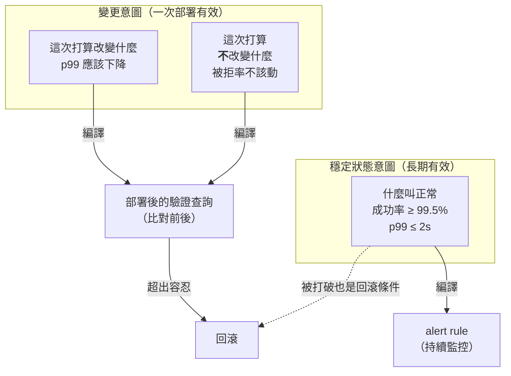
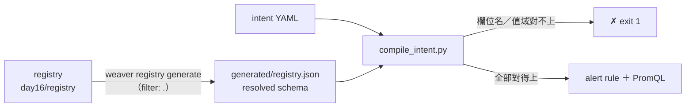

# Day16：機器可讀的「意圖」，與從 schema 生出型別安全的常數

Day15 讓 agent 讀懂了「這個欄位是什麼」。今天要處理它還讀不到的兩件事：**這個系統現在應該處於什麼狀態**，以及**這次變更打算改變什麼**。

先講為什麼這是兩件事，而不是一件事的兩種說法。

試著把時間拉回一次很典型的 on-call。凌晨兩點，一條 alert 響了：`payment service CPU > 80% for 5m`。你被叫起來，看了一眼 dashboard，CPU 確實是 85%，然後你花二十分鐘做的事情是**重建這條 alert 當初想保護的東西**——85% 是問題嗎？如果同時 latency 沒變、成功率沒變、佇列沒有積，那 85% 可能只是有人跑了一個批次作業。這條 alert 記錄了一個門檻，但它沒有記錄**為什麼是 80%**、**它在保護誰**、以及**不處理會怎樣**。

那些資訊當初是存在的。設定這條 alert 的人心裡有一個完整的因果鏈：CPU 高 → 處理變慢 → 付款超時 → 使用者付不了錢。但寫進系統的只有鏈條最上游那個技術指標，中間那三段都留在他腦子裡，而他兩年前就離職了。

**這就是「意圖」這個概念要解決的問題：規則被保存了下來，意圖沒有。** 而在 AIOps 的語境下這件事會變得更嚴重，因為一個 agent 拿到的東西比人更少——人至少能問隔壁同事、能猜、能從歷史工單裡拼湊；agent 只有你餵給它的東西。你給它一條 `CPU > 80%`，它能做的推理就只有「CPU 高於 80%」這件事本身。

今天要做的就是把那三段補回來，而且**寫成 pipeline 跟 agent 可以直接消費的形式**，不是寫成 wiki 上一段給人看的說明。文章分兩半：前半是意圖怎麼寫、怎麼驗證；後半用 `weaver registry generate` 收口——因為意圖要能被驗證，前提是它引用的欄位名跟值域來自同一份 registry，而 template engine 正是讓 registry 直接變成程式碼的機制。

程式碼在 submodule 的 [`day16/`](https://github.com/tedmax100/OTel_AIOps_Agent/tree/main/day16)：三份意圖 YAML（兩份正確、兩份故意寫壞）、一支把意圖編譯成 PromQL 與 alert rule 的腳本、一組 Jinja template 跟它生出來的程式碼。registry 疊在 Day14 的 `base-v2` 之上，環境是 weaver `0.24.1`。

## 對照組：規則、門檻、意圖

先把三個很容易混在一起的東西分開。同一件事的三種寫法：

```yaml
# ① 規則（rule）——只有條件跟動作
- alert: HighCPU
  expr: rate(process_cpu_seconds_total[5m]) > 0.8
  for: 5m
```

```yaml
# ② 門檻加上一點註解——好一些，但註解是給人看的
- alert: HighCPU
  expr: rate(process_cpu_seconds_total[5m]) > 0.8
  for: 5m
  annotations:
    summary: "CPU 偏高，可能影響付款"      # 「可能」是什麼意思？影響到什麼程度算要處理？
```

```yaml
# ③ 意圖（intent）——先寫「什麼算正常」，門檻是它的產物
- id: payment-success-rate
  statement: "結帳付款的成功率不得低於 99.5%"
  why: >-
    低於這條線代表有一批使用者付不了錢而且會直接離站，是營收損失而不是效能問題。
    99.5% 是從去年的 decline 分佈推回來的：正常的 declined 幾乎都是額度不足與風控攔截。
  signal:
    metric: payment.attempts
    dimension: payment.outcome
    good_values: [authorized, pending_review]
  objective:
    ratio_min: 0.995
    window: 5m
  on_violation:
    severity: page
    first_check: "看 declined 是不是集中在單一 payment.method 或單一金流商"
```

三者的差別不在資訊量，在**方向**。①②是從系統的內部狀態出發（CPU 是一個原因），③是從使用者的體驗出發（付不了錢是一個結果）。這個方向差異決定了它能不能被自動消費：

| | 規則 | 門檻＋註解 | 意圖 |
|---|---|---|---|
| 條件可執行 | ✅ | ✅ | ✅（編譯出來） |
| 為什麼是這個數字 | ❌ | 散文 | 結構化欄位 |
| 違反時第一步查什麼 | ❌ | ❌ | `first_check` |
| agent 能不能判斷嚴重度 | 只能看門檻 | 要讀散文 | `severity` ＋ `why` |
| **欄位名能不能被驗證** | ❌ | ❌ | ✅（指向 registry） |

最後一列才是今天真正的重點，也是這系列前十五天的東西在這裡收成的地方。**一份意圖如果引用了不存在的 metric、不存在的維度、或不在 enum 值域裡的值，它就不是機器可讀的意圖，只是一段長得很像 YAML 的散文。** 而要能檢查這件事，你需要一份可信的 registry——Day1 到 Day14 做的正是這個。

## 兩種意圖：穩定狀態與變更

意圖有兩種，時間尺度完全不同。



穩定狀態意圖就是上面那份，它會被編譯成 alert rule，長期生效。變更意圖是一次性的，長這樣：

```yaml
apiVersion: intent.o11y/v1
kind: ChangeIntent
metadata:
  service: payment
  registry: day16/registry
  change_id: PAY-4471
spec:
  summary: "把金流商的 HTTP timeout 從 3s 降到 1s，逾時改為重試一次"
  rationale: >-
    金流商的 p99 是 600ms，3 秒的 timeout 實際上只是讓失敗變慢。
    縮短之後失敗會更快被看見，重試一次能吃掉偶發的網路抖動。
  expected:
    - id: latency-drops
      statement: "p99 應該下降"
      signal: { metric: payment.duration, dimension: payment.outcome }
      direction: down
      window: 30m
  unchanged:
    - id: decline-rate-flat
      statement: "被拒率不應該改變——如果變了，代表重試把不該重試的請求重試了"
      signal: { metric: payment.attempts, dimension: payment.outcome, values: [declined] }
      tolerance_ratio: 0.10
      window: 30m
  rollback_if:
    - "decline-rate-flat 超出容忍範圍"
    - "payment-success-rate 這條穩定狀態意圖被打破"
```

**`unchanged` 那一段是整份文件裡最有價值的東西**，而它也是實務上最少被寫下來的。`expected` 大家都會寫（不然為什麼要改），但「這次改動**不該**動到什麼」通常只存在於改的人的直覺裡。

而對 agent 來說，這一段是它唯一能判斷「一個指標的變化是預期的還是意外的」的依據。想想線上出事那一刻的處境：p99 下降了、被拒率上升了。沒有變更意圖，agent 看到的是兩個同時發生的變化，它得自己猜哪個是好事；有了變更意圖，這兩個變化一個落在 `expected`、一個落在 `unchanged` 的容忍範圍之外，判斷立刻變成查表。**這就是 Day2 講的「缺語意」在變更這個維度上的具體形狀。**

## 編譯：意圖要能長出可執行的東西，否則它只是文件

「機器可讀」這件事很容易嘴巴上說，所以今天要有一個實際的消費者。`day16/compile_intent.py` 做兩件事：**拿 registry 驗證意圖**，然後**把它編譯成 PromQL 與 alert rule**。



先看成功的路徑：

```
$ python3 day16/compile_intent.py day16/intent/steady-state.yaml
# SteadyStateIntent ← day16/intent/steady-state.yaml
# registry: day16/registry（2 metrics、1 enums）

# payment-success-rate: 結帳付款的成功率不得低於 99.5%
- alert: payment-success-rate
  expr: |
    (sum(rate(payment_attempts_total{payment_outcome=~"authorized|pending_review"}[5m]))
      / sum(rate(payment_attempts_total[5m]))) < 0.995
  for: 5m
  labels:
    severity: page
  annotations:
    intent: "結帳付款的成功率不得低於 99.5%"
    why: "低於這條線代表有一批使用者付不了錢而且會直接離站，是營收損失而不是效能問題。 99.5% 是從去年的 decline 分佈推回來的：正常的 declined 幾乎都是額度不足與風控攔截。"
    first_check: "看 declined 是不是集中在單一 payment.method 或單一金流商"

# payment-latency: 付款請求的 p99 不得超過 2 秒
- alert: payment-latency
  expr: |
    (histogram_quantile(0.99, sum by (le) (rate(payment_duration_bucket[5m])))) > 2
  for: 5m
  labels:
    severity: ticket
  annotations:
    intent: "付款請求的 p99 不得超過 2 秒"
    why: "超過 2 秒之後結帳頁的放棄率會開始上升；這條線是產品端給的，不是從系統容量推的。"
    first_check: "先確認是所有 outcome 都變慢，還是只有 declined 變慢"

# ✔ 2 條意圖全部對得上 registry
```

注意產出物的形狀：**`why` 跟 `first_check` 被搬進了 alert 的 annotations。** 這是「意圖機器可讀」最直接的兌現——那個凌晨兩點被叫起來的人（或那個要做 RCA 的 agent）拿到的不再只是一個門檻，而是連著理由跟第一步該查什麼。這兩段文字從來不是新資訊，只是它們原本存在別人的腦子裡，現在存在一個會跟著 alert 一起送到現場的欄位裡。

`payment_outcome=~"authorized|pending_review"` 這一段也值得看一眼：它是從意圖裡的 `good_values` 展開的，而那三個值的合法性是拿 enum members 檢查過的。**「成功」的定義沒有被寫在查詢裡，是從 registry 推出來的**——所以哪天 `pending_review` 這個狀態被拿掉，這條意圖會編譯失敗，而不是安靜地繼續算一個錯的比率。

變更意圖編出來的是驗證查詢，不是 alert：

```
$ python3 day16/compile_intent.py day16/intent/change.yaml
# ChangeIntent ← day16/intent/change.yaml

# expected[latency-drops]: p99 應該下降
# 期望方向：down（跟部署前的同一條查詢比）
histogram_quantile(0.99, sum by (le) (rate(payment_duration_bucket[30m])))

# unchanged[decline-rate-flat]: 被拒率不應該改變——如果變了，代表重試把不該重試的請求重試了
# 容忍變化：±10%（超過就回滾）
sum(rate(payment_attempts_total{payment_outcome=~"declined"}[30m]))
  / sum(rate(payment_attempts_total[30m]))

# ✔ 2 條意圖全部對得上 registry
```

一次部署要跑哪幾條查詢、每一條的判準是什麼、超過就回滾——這些原本寫在 runbook 裡（或根本沒寫），現在是從變更意圖直接算出來的。**部署流程不需要知道 payment 這個服務的任何事，它只需要知道怎麼跑這份意圖。**

### 兩個故意寫壞的意圖

編譯器最重要的功能不是編譯，是**拒絕**。兩份故意寫壞的意圖，各對應一種真的會發生的錯誤：

```yaml
      signal:
        metric: payment.attempts
        dimension: payment.status        # ← registry 裡沒有這個維度
        good_values: [AUTHORIZED]        # ← 大小寫不符
```

```
$ python3 day16/compile_intent.py day16/intent/steady-state-broken.yaml
✗ 意圖與 registry 不一致：objectives[payment-success-rate]:
  'payment.attempts' 沒有 'payment.status' 這個維度（有的是：payment.method, payment.outcome）
$ echo $?
1

$ python3 day16/compile_intent.py day16/intent/steady-state-broken2.yaml
✗ 意圖與 registry 不一致：objectives[payment-success-rate]:
  'payment.outcome' 沒有 'AUTHORIZED' 這個值（enum members：authorized, declined, pending_review）
$ echo $?
1
```

這兩個錯誤不是我編出來湊範例的，它們是**我自己的 agent 實際犯過的兩種錯**。`payment.status` 是那種 LLM 覺得「這個欄位應該叫這個名字」而生成出來的合理猜測（Day15 第三個坑那個 `not found` 之後自己命名的行為）；`AUTHORIZED` 大寫則是我在真實 RCA 任務上踩過的坑——agent 用 `level="ERROR"` 去撈 Loki，而資料裡全都是 `INFO`，於是它得到零筆結果，然後往「系統正常」的方向推理下去。

**這兩種錯的共通點是：如果沒有人檢查，它們都會產生一個語法完全正確、跑得起來、而且永遠回傳零筆的查詢。** 一條永遠不會觸發的 alert 跟一條不存在的 alert，在 dashboard 上長得一模一樣。今天這個編譯器把它們變成 exit 1，而它能做到這件事的唯一原因是**意圖裡的欄位名有一個權威來源可以對**。

這也是為什麼意圖檔案裡要有 `registry:` 那一行 metadata。它不是裝飾，是宣告「這份意圖的欄位名以哪一份 registry 為準」——而按照 Day14 的教訓，那份 registry 還會演進，所以這條線之後要接的是版本（`schema_url`），不只是路徑。

## 後半：讓 registry 直接變成程式碼

意圖能被驗證，靠的是 `day16/generated/registry.json`——那份 resolved schema 是 `weaver registry generate` 產出來的。既然 template engine 已經在手上，就順便把它最實用的用途做完：**把 registry 生成程式碼，讓服務端也不用手打字串。**

一組 template 的設定長這樣（`day16/templates/python/weaver.yaml`）：

```yaml
whitespace_control:
  trim_blocks: true
  lstrip_blocks: true

templates:
  # 1. 欄位名稱常數
  - template: semconv_attrs.py.j2
    filter: >
      .groups | map(select(.type == "attribute_group"))
      | map(.attributes[]) | unique_by(.name) | sort_by(.name)
    application_mode: single
    file_name: "semconv_attrs.py"

  # 2. enum 值域：只有 type 是物件（有 members）的才算
  - template: semconv_enums.py.j2
    filter: >
      .groups | map(select(.type == "attribute_group"))
      | map(.attributes[]) | map(select(.type | type == "object"))
      | unique_by(.name) | sort_by(.name)
    application_mode: single
    file_name: "semconv_enums.py"

  # 3. 整份 resolved registry 的 JSON：給 intent compiler 當事實來源
  - template: registry.json.j2
    filter: .
    application_mode: single
    file_name: "registry.json"
```

`filter` 是 JQ，`application_mode: single` 表示整個 filter 的結果一次餵給 template（對照 `each`：每個元素跑一次、產生多個檔案）。第三筆那個 `filter: .` 加上一行 `{{ ctx | tojson(2) }}` 就把整份 resolved schema 倒出來——**這是我今天覺得最好用的一招**：不需要學 template 語法，就能拿到一份給任何語言消費的 JSON。

```
$ weaver registry generate -r day16/registry --templates day16/templates \
    python day16/generated --include-unreferenced true
✔ Generated file "day16/generated/semconv_enums.py"
✔ Generated file "day16/generated/registry.json"
✔ Generated file "day16/generated/semconv_attrs.py"
✔ Artifacts generated successfully
```

（`--include-unreferenced true` 又出現了。Day13 是 `stats` 的數字、Day15 是 MCP 查不到欄位，今天是**生成物會少掉繼承來的定義**——這個預設值到目前為止在三個不同的子命令上各咬了一次。）

生出來的常數檔：

```python
# Code generated by Weaver. DO NOT EDIT.
"""registry 裡的 attribute 名稱常數。程式碼不再手打字串。"""

# 處理這筆交易的金流商代號 —— DEPRECATED（obsoleted）
PAYMENT_GATEWAY: str = "payment.gateway"
# 支付交易識別碼 —— DEPRECATED（renamed → payment.transaction_id）
PAYMENT_ID: str = "payment.id"
# 支付方式
PAYMENT_METHOD: str = "payment.method"
# 支付的終態結果
PAYMENT_OUTCOME: str = "payment.outcome"
# 支付交易識別碼（改名後的正式欄位）
PAYMENT_TRANSACTION_ID: str = "payment.transaction_id"

ALL_ATTRIBUTES: frozenset[str] = frozenset({ ... })

ATTRIBUTE_TYPES: dict[str, str] = {
    "payment.gateway": "string",
    "payment.id": "string",
    "payment.method": "string",
    "payment.outcome": "enum[authorized|declined|pending_review]",
    "payment.transaction_id": "string",
}

DEPRECATED_ATTRIBUTES: dict[str, str] = {
    "payment.gateway": "obsoleted",
    "payment.id": "renamed → payment.transaction_id",
}
```

還有 enum 檔，這個是今天後半的重點：

```python
from enum import StrEnum


class PaymentOutcome(StrEnum):
    """支付的終態結果"""

    AUTHORIZED = "authorized"    # 授權成功
    DECLINED = "declined"    # 被拒絕
    PENDING_REVIEW = "pending_review"    # 轉人工審核
```

實際跑一次：

```
$ cd day16/generated && python3 -c "
from semconv_enums import PaymentOutcome
from semconv_attrs import PAYMENT_OUTCOME, DEPRECATED_ATTRIBUTES, ALL_ATTRIBUTES
print('constant:', PAYMENT_OUTCOME)
print('legal:', [m.value for m in PaymentOutcome])
print('ok:', PaymentOutcome('declined'))
try:
    PaymentOutcome('DECLINED')
except ValueError as e:
    print('raises:', e)
print('payment.status in registry?', 'payment.status' in ALL_ATTRIBUTES)"

constant: payment.outcome
legal: ['authorized', 'declined', 'pending_review']
ok: declined
raises: 'DECLINED' is not a valid PaymentOutcome
payment.status in registry? False
```

**`PaymentOutcome('DECLINED')` 直接 raise。** 這一行是今天兩半合起來的地方：Day15 那份 before 程式碼裡的 `outcome.upper()`，如果值域是從這個 enum 來的，那個 bug 在寫的當下就不可能發生——它不是被檢查出來，是**被結構排除掉**。同一個道理，`payment.status` 這種 agent 猜出來的欄位名，只要程式碼用的是常數而不是字串，它連 import 都過不了。

這是「規則變成結構」跟「規則靠檢查」的差別，也是 Day14 那個三層驗證模型往前再走一步：**第一層是工具說不行、第三層是你的 policy 說不行，而生成物讓某些錯誤變成「說不出來」。**

### 生成物的 diff，把 Day14 的靜音區補起來

還有一個副作用，我做完才發現它其實是今天最實用的東西。

Day14 花了一整篇證明 `weaver registry diff` 對三種最危險的變更是靜音的：型別改變、`brief` 改動、enum member 被拿掉。三份 registry 跑出來的 diff 報告都是空白。

但如果 registry 被生成成程式碼，那些變更就會出現在**生成物的 diff** 裡。拿 Day14 那幾份 registry 各生成一次，然後 diff：

```
$ diff gen-base-v1/semconv_attrs.py gen-base-v3/semconv_attrs.py
9c9
< # 支付的終態結果
---
> # 支付的終態結果（authorized/declined/pending_review）
11c11
< # 這筆交易重試了幾次
---
> # 這筆交易重試了幾次（含首次嘗試）
27c27
<     "payment.retry_count": "int",
---
>     "payment.retry_count": "string",
```

```
$ diff gen-base-v1/semconv_enums.py gen-v4/semconv_enums.py
11d10
<     DECLINED = "declined"    # 被拒絕
```

`int` → `string`、`brief` 的改動、`DECLINED` 這個 member 消失——**Day14 那三個 `diff` 一句話都不說的變更，全部出現在這裡。**

原因很簡單：`diff` 比對的是「有哪些東西」，而生成物是「這些東西長什麼樣」的一份逐字投影。只要投影裡包含了那個屬性（我在 template 裡多加了 `ATTRIBUTE_TYPES` 那一段，就是為了讓型別進到投影裡），git 就會幫你 diff 它。

所以這裡有一條很值得帶回團隊的實務結論：**把生成物 commit 進版控。** 不是因為它不能被重新生成，而是因為 commit 之後，registry 的任何實質變更都會變成一個 reviewer 看得見的 diff——包括工具自己的 `diff` 指令看不見的那些。Day14 那條 `comparison_after_resolution` policy 是「主動去抓」，這個是「被動也會露出來」，兩者互補：policy 能擋，生成物的 diff 能讓人**理解**。而且它連 `payment.retry_count` 這種欄位消失都會直接變成下游的 import 錯誤——一個沒有人能忽略的失敗。

## 平台工程：意圖該由誰寫

今天的東西比前幾天更容易做成一個沒有人用的框架，所以幾個所有權問題要先答清楚。

**誰寫意圖。** 一定是產品團隊，不能是平台團隊。理由在那份意圖檔案本身：`why` 那一段（99.5% 是從去年的 decline 分佈推回來的）、`first_check` 那一段（先看 declined 有沒有集中在單一金流商）——這些是領域知識，平台團隊寫不出來，寫出來也一定是錯的。平台團隊該提供的是**格式、編譯器、跟一份範本**，然後閉嘴。這跟 Day14 那條線一致：影響只在自己團隊內的，交給團隊。

**產品團隊要付多少成本。** 這一項今天答得比 Day15 差。Day15 那個 MCP 是零成本（`.mcp.json` 放進 repo 就結束），今天要團隊坐下來寫一份 YAML，而且要寫出 `why`——那是真正花時間的部分，也是最容易被寫成廢話的部分（「因為這很重要」）。所以務實的做法是**別要求一次寫完**：從已經存在的 alert 開始，一條一條反推它的意圖，寫不出 `why` 的那些，本身就是一個發現（那條 alert 可能該刪掉）。**把「補意圖」當成一次盤點，不是一次新的文件工程。**

**強制、預設、還是建議。** 意圖不該是 merge gate，至少一開始不該。可以擋的是**格式**——編譯不過就不准 merge（就是上面那兩個 exit 1），這個判斷是確定性的、訊息也講得清楚該改什麼。至於「每個服務都必須有意圖檔案」，那是 Day17 那份新服務 checklist 的一欄，用 checklist 推，不要用 gate 擋。**擋一個「你還沒想清楚什麼算正常」的 PR，只會讓人隨便填一個數字進去。**

**演進的責任。** 意圖引用 registry 的欄位名，所以 registry 一改版，意圖可能就失效了——而這次失效是**好的**那種：編譯器會 exit 1，明確指出哪一條意圖指向了不存在的東西。這正好補上 Day14 結尾那個缺口的一角：當時的問題是「base 改版之後，誰還在用舊欄位」沒有機制回答；`deprecated_usage.rego` 抓的是下游 registry，今天這個編譯器抓的是**下游的意圖**。兩者加起來，registry 的消費端就有兩條可以自動掃的路徑了。

## 回到 AIOps：意圖是 agent 的判準，不是它的輸入

最後把今天放回整條線。Day2 講 AIOps 九宮格的時候提過一個概念：agent 要能判斷，前提是它有一個「應該是什麼樣」的參照。今天做的就是那個參照，而它跟前面幾天的東西合起來，剛好構成 agent 做一次判斷需要的三種資料：

| 資料 | 回答什麼問題 | 哪一天做的 |
|---|---|---|
| registry | 這個欄位是什麼、值域有哪些 | Day13–15 |
| 拓撲 | 誰呼叫誰、影響會傳到哪 | Day18–19 |
| **意圖** | **這樣算不算不正常、該不該叫人** | **今天** |

三者缺一個，agent 的輸出就會退化成一種很好認的形狀：缺 registry 它會猜欄位名；缺拓撲它會把上游的症狀當成根因；**缺意圖它會描述現象但不敢下結論**——你會拿到一段「CPU 是 85%，latency 是 1.2 秒，成功率是 99.2%」的複述，而不是「這件事要叫人」。

而今天這個編譯器還帶了一個我原本沒預期的性質：它讓意圖變成**可以被 eval 的東西**。既然一份意圖能編譯出「這個情境該不該告警」的確定性判準，那它就能當成 Day28 那個 eval harness 的 ground truth——不需要人工標註「這次算不算 incident」，意圖已經寫清楚了。這條線今天不展開，但它是後面 Series 2 講校準（calibration）時的起點。

## 今天沒做的事

沒有把編譯出來的 alert rule 真的餵給 Prometheus。輸出的 YAML 是照 alerting rule 的格式產的，但沒有實際 `promtool check rules` 過、也沒有在跑著的 Prometheus 上驗證過它會不會觸發。這一步不難但需要真實的 metric 資料（那個 `payment_attempts_total` 目前在任何地方都不存在），所以留到 Series 2 把 demo stack 接上來的時候一起做。

沒有處理 histogram 的 bucket 邊界。`payment-latency` 那條意圖編出了 `histogram_quantile(0.99, ...)`，但這個查詢正不正確取決於 bucket 邊界有沒有涵蓋 2 秒這個門檻——我自己在這個 stack 上踩過一次很痛的坑：`*_duration_seconds` 記的是秒，卻用了預設的毫秒 bucket，於是 `histogram_quantile` 回傳一個恆定的假值，看起來完全正常。**一份意圖可以完全對得上 registry，編譯出來的查詢卻回傳一個假數字**——這是「schema 對了不等於資料對了」的又一個版本，而它會在 Series 2 講資料可信度時變成主題。

沒有做意圖檔案自己的 schema 驗證。`compile_intent.py` 檢查的是「欄位名對不對得上 registry」，但它假設 YAML 的結構是對的——少一個 `objective` 區塊就會直接 KeyError，錯誤訊息是 python 的堆疊而不是一句人看得懂的話。真要當成一個平台交付物，這裡需要一份 JSON Schema（或者，更符合這系列的精神：用 Rego 寫，跟 registry 的 policy 用同一套工具）。這件事沒做是因為它會讓文章的重點從「意圖是什麼」變成「YAML 驗證怎麼寫」，但它是把今天的東西推上生產前必補的一格。

沒有用 `weaver registry package`。它是官方用來發佈 resolved registry 的正式做法，但它要求 `--v2`（不加就直接告訴你 `Packaging is only supported for v2 registries`），而 v2 schema 會同時改變 template 跟 policy 看到的資料形狀——Day14 就把 `--v2` 列成沒做的事了，今天用 `filter: .` 自己倒一份 JSON 繞過去。這個繞法的代價是那份 JSON 是 v1 形狀、沒有版本資訊在裡面，也就是說 `compile_intent.py` 現在無法判斷自己讀的是哪一版 registry——Day15 那個 `provenance.source` 的問題，換一個地方又出現了一次。

明天：治理環境收尾，新服務上線 checklist。把 Day3 到今天所有的東西壓縮成一份可執行的清單（CI job 範本、registry 範本、`.mcp.json` 範本），並且新增兩欄——「這個服務有沒有宣告意圖」跟「它的 registry 有沒有對應的 MCP 可查」。這是 Series 1 第一階段的最後一天。
