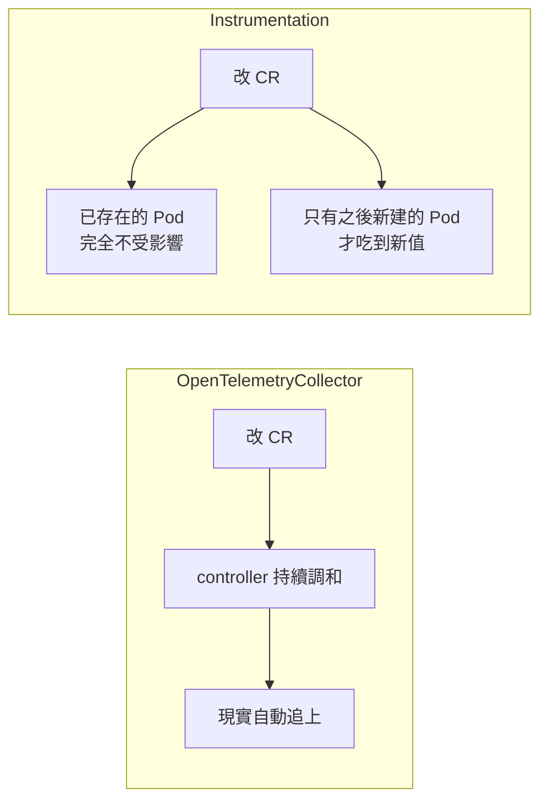
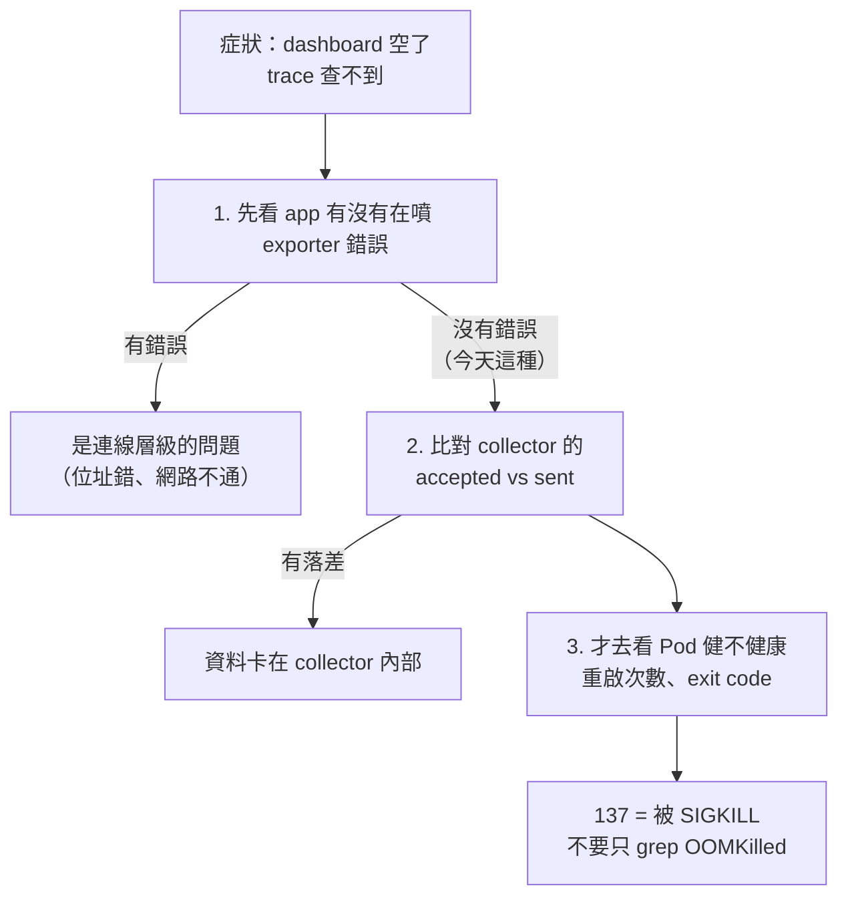

# Day4：注入了不代表送達

> 注入成功了
> 服務也全綠
> 使用者也沒抱怨
> 然後你的 trace 沒了

昨天裝完 OpenTelemetry（以下簡稱 OTel）Operator，刻意留了一個空白：`Instrumentation` CR 宣告了，但沒接到任何一個 Pod 上，五個服務還是靠自己 Dockerfile 裡的 `opentelemetry-instrument` 在跑。

今天我們來把這個空白填上，然後做一件更重要的事。

因為「把 instrumentation 注入進去」這件事做完之後，很容易產生一種錯覺：資料從此會安全地送到後端。今天後半段就是要親手戳破這個錯覺，把 collector 壓垮一次，看著資料悄悄消失，而**五個服務全部健康、使用者完全無感、app 的 log 一行錯誤都沒有**。

然後補上那個我原本設定裡漏掉的東西，再壓一次，看同一個故障怎麼從「無聲」變成「有一個數字可以查」。

程式碼在範例 repo [`OTel_AIOps_Agent`](https://github.com/tedmax100/OTel_AIOps_Agent) 的 [`ironman-2026/day04/`](https://github.com/tedmax100/OTel_AIOps_Agent/tree/main/ironman-2026/day04)。指令都假設你在那個 repo 的根目錄下跑。

## 改動只有兩處

挑 `api-gateway` 一個服務來換。

Dockerfile 拿掉 `opentelemetry-instrument` 這個包裝指令，變回最單純的 `uvicorn`：

```dockerfile
# 這裡刻意不寫 opentelemetry-instrument，
# 改由 Operator 的 webhook 用 PYTHONPATH + init container 注入
CMD ["uvicorn", "api_gateway.main:app", "--host", "0.0.0.0", "--port", "8000"]
```

k8s manifest 在 Pod template 加一個 annotation：

```yaml
template:
  metadata:
    annotations:
      instrumentation.opentelemetry.io/inject-python: "python-instrumentation"
```

值填的是昨天那份 `Instrumentation CR` 的名字，指定要用哪份 instrumentation inject CR。同一個 namespace，所以不用寫 `demo/python-instrumentation`，直接寫名稱就好。

除此之外，`23-api-gateway.yaml` 裡原本那一串 `OTEL_SERVICE_NAME`、`OTEL_EXPORTER_OTLP_ENDPOINT`、`OTEL_RESOURCE_ATTRIBUTES` 我一個字都沒動。這是刻意的，因為我想知道這些值在 webhook 手裡會不會被蓋掉。

重新 build、apply、重啟之後：

```console
$ kubectl -n demo get pods -l app=api-gateway
NAME                           READY   STATUS     RESTARTS   AGE
api-gateway-5866859f9b-9pnpg   0/1     Init:0/1   0          10s
```

`Init:0/1` 這一格，就是昨天講的「webhook 在 Pod 建立的當下改寫它的 spec」在真實世界的樣子。一個我沒有寫過的 init container，正在跑。

## webhook 到底塞了什麼進去

等 Pod Ready 之後 `kubectl get pod -o yaml`，不用猜，直接讀。


先看那個 init container：

```yaml
initContainers:
  - name: opentelemetry-auto-instrumentation-python
    image: ghcr.io/open-telemetry/opentelemetry-operator/autoinstrumentation-python:0.64b0
    command: ["cp", "-r", "/autoinstrumentation/.", "/otel-auto-instrumentation-python"]
    volumeMounts:
      - { mountPath: /otel-auto-instrumentation-python, name: opentelemetry-auto-instrumentation-python }
```

它做的事很單純：把一整包預先裝好的 Python auto-instrumentation 套件複製到一個跟主容器共用的 `emptyDir` 裡，然後結束。它不執行任何 app 邏輯，純粹就是把檔案準備好。

主容器多出來的東西才是重點：

```
PYTHONPATH = /otel-auto-instrumentation-python/opentelemetry/instrumentation/auto_instrumentation:/otel-auto-instrumentation-python
```

這一行解釋了為什麼 Dockerfile 不用寫 `opentelemetry-instrument` 也能動。Python 直譯器啟動時本來就會找 `PYTHONPATH` 裡的模組，而 `auto_instrumentation` 這個套件用的是 Python 的 `sitecustomize` 機制，直譯器一啟動就自動把 SDK 設好、把 FastAPI 跟 httpx 的 instrumentor 掛上去，不需要在 `CMD` 裡包一層指令去手動觸發。

> 注入的形式是跟著語言走的。Python 是 `PYTHONPATH`，Java 是 `-javaagent`，.NET 又是另一套。webhook 只負責「把對的東西塞進 Pod spec」，至於塞什麼，是每個語言各自的機制。

再來是我原本猜會被蓋掉、結果**沒有被蓋掉**的東西：

```
OTEL_SERVICE_NAME           = api-gateway                            # 我寫的值，原封不動
OTEL_EXPORTER_OTLP_ENDPOINT = http://otel-collector.demo.svc:4318    # 我寫的值，原封不動
```

webhook 的邏輯是「補齊沒有的，不動已經存在的」。這兩個我在 manifest 裡本來就寫了，它看到容器已經有這個環境變數就跳過。

真正被動過手腳的是 `OTEL_RESOURCE_ATTRIBUTES`。我原本寫的是：

```
service.namespace=demo,deployment.environment=demo,service.version=$(GIT_VERSION),git_repo=$(GIT_REPO),git_version=$(GIT_VERSION)
```

注入之後變成：

```
service.namespace=demo,deployment.environment=demo,service.version=$(GIT_VERSION),git_repo=$(GIT_REPO),git_version=$(GIT_VERSION),k8s.container.name=gateway,k8s.deployment.name=api-gateway,k8s.namespace.name=demo,k8s.node.name=$(OTEL_RESOURCE_ATTRIBUTES_NODE_NAME),k8s.pod.name=$(OTEL_RESOURCE_ATTRIBUTES_POD_NAME),k8s.replicaset.name=api-gateway-5866859f9b,service.instance.id=demo.$(OTEL_RESOURCE_ATTRIBUTES_POD_NAME).gateway
```

不是覆蓋，是接在後面。webhook 額外注入了幾個透過 Downward API 取值的環境變數，再把 `k8s.pod.name`、`k8s.node.name`、`k8s.replicaset.name`、`service.instance.id` 這些我完全沒寫過的 k8s 拓撲屬性接上去。

**中央治理跟團隊字定義，並不是互斥的，而是疊加的。** Operator 幫每個 Pod 補上 k8s 身份，我自己的 `git_repo` 跟 `git_version` 也留著。昨天說「叢集裡早就有答案，只是沒有人把它端出來」，這裡就是第一次真的端出來了一點：Pod 在哪個節點、屬於哪個 ReplicaSet，現在變成 span 上的屬性，而不是要事後去反查。

## 那些值是誰決定的：`Instrumentation` CR 才是控制面

上面看到的那一堆東西（init container 用哪個 image、`PYTHONPATH` 指到哪、要不要補 k8s 屬性），全部來自那份 CR。它才是平台團隊真正的施力點，值得攤開來看一次它能管什麼。

昨天那份 CR 我只寫了三行，但它的 schema 遠不只這樣。

```console
$ kubectl explain instrumentation.spec
FIELDS:
  exporter                     <Object>     # OTLP 送去哪
  propagators                  <[]string>   # 用哪些 context 傳播格式
  sampler                      <Object>     # 採樣策略
  resource                     <Object>     # 統一附加的 resource attribute
  env                          <[]Object>   # 所有語言共用的環境變數
  imagePullPolicy              <string>
  initContainerSecurityContext <Object>
  defaults                     <Object>

  java / python / nodejs / dotnet / go / apacheHttpd / nginx   <Object>
```

分成兩層很清楚：上面那些是跨語言共用的決定，下面七個是各語言各自的設定。每個語言區塊裡長這樣：

```console
$ kubectl explain instrumentation.spec.python
FIELDS:
  image                 <string>     # 用哪個版本的 auto-instrumentation
  env                   <[]Object>
  resourceRequirements  <Object>     # init container 要多少資源
  volumeClaimTemplate   <Object>
  volumeLimitSize       <Object>
```

有幾個欄位對平台團隊來說份量特別重。

**`sampler` 是一個一行改完全公司的開關。** 它的 `type` 是列舉，有八個值能選：

```
always_on / always_off / traceidratio / parentbased_always_on
parentbased_always_off / parentbased_traceidratio / jaeger_remote / xray
```

想像一個很常見的情境：Tempo 的儲存成本上升，決定把採樣從全收改成 10%（或者臨時想把某服務的採樣從 10% 變成 100% 為了 troubleshooting 用）。在沒有這個 CR 的世界裡，這代表要通知幾十個團隊各自去改自己的設定，然後追蹤誰改了誰沒改，這件事會拖幾個月。有 CR 的話：

```yaml
spec:
  sampler:
    type: parentbased_traceidratio
    argument: "0.1"
```

改一份 YAML，所有掛了 annotation 的服務下次重啟就吃到新設定。**這就是昨天那個判準「成本會不會隨團隊數線性成長」的具體樣子**，同一件事在兩種做法下的成本差距是幾個月跟五分鐘。

**`python.image` 是版本漂移真正被治住的地方。** 不過我那份 CR 根本沒寫 `image`。

回頭看前面那個 init container，它的 image 是 `autoinstrumentation-python:0.64b0`。那個版本號不是我決定的，是 Operator 內建的預設值。所以嚴格講，昨天講的「SDK 版本沒人管」今天只解決了一半：版本從「散在每個團隊的 Dockerfile 裡」變成「由 Operator 的預設值決定」，確實收斂了，但決定權還不在我手上。要真的握住它得明寫：

```yaml
spec:
  python:
    image: ghcr.io/open-telemetry/opentelemetry-operator/autoinstrumentation-python:0.64b0
```

釘住之後，升級版本這件事才變成一個可以被 review、被排程、被 rollback 的動作，而不是「升 Operator 的時候順便被換掉了」。

> 這種「你以為你在管，其實是預設值在管」的狀況，我覺得比完全沒管更危險。因為它看起來是治理過的。而且你去 review 那份 CR 的時候，它還很乾淨、很好看 XD

**`resource` 跟 `env` 是給全公司訂共同底線的地方。** 想讓每個 span 都帶 `deployment.environment`、想讓所有服務用同一組 propagator，寫在這裡一次，不用去拜託每個團隊在自己的 manifest 補。

### 一個平台團隊一定會踩的坑：改了 CR，什麼事都沒發生

`Instrumentation` 走的是 admission webhook，**它只在 Pod 建立的那一刻起作用**。

所以你把 sampler 從 `always_on` 改成 `traceidratio`、apply 上去、`kubectl get instrumentation` 顯示新值 —— 然後線上的採樣率一點變化都沒有。因為那些 Pod 是舊的，它們身上的環境變數是建立當下就寫死的。

這跟 Collector 那種「改了 CR，controller 自動把現實拉過去」的直覺剛好相反。`OpenTelemetryCollector` 是持續調和的，`Instrumentation` 是一次性蓋章的。



所以平台團隊改這份 CR 的時候，改完只是第一步，還得規劃一次滾動重啟，並且知道**在重啟完成之前，叢集裡是新舊設定並存的**。如果你正在調查一個跨服務的問題，這段期間看到的採樣率會是混合的。

### 而且團隊隨時可以推翻你

前面提過 webhook 的邏輯是「補齊沒有的，不動已經存在的」。這件事換個角度看，其實是一個治理層面的設計決定：

**CR 給的是預設值，不是強制值。** 任何一個團隊只要自己在 manifest 裡寫死 `OTEL_SERVICE_NAME` 或 `OTEL_EXPORTER_OTLP_ENDPOINT`，webhook 就會讓路。今天 `api-gateway` 那兩個沒被蓋掉的環境變數，就是這條規則的實證。

這是好事還是壞事，要看你想達成什麼。它讓「預設那條路最好走，但要走別條也走得掉」變成可能，團隊有特殊需求時不用來求平台開特例。代價是**平台團隊沒辦法從這份 CR 推斷全公司的實際狀態**。你以為大家都在用 10% 採樣，但某個團隊三個月前為了 debug 自己覆蓋掉了，而這件事不會有任何地方通知你。

要知道實際狀態，只能反過來從遙測資料本身去對帳。這個問題後面談 registry 跟一致性檢查時還會回來。

## before / after：同一條下單流程各截一次 trace

切換前後，各對 `webapp → api-gateway → order-service → user/payment-service` 這條下單流程送一次真實請求，把 `trace_id` 從 log 撈出來直接查 Tempo。

Before（Dockerfile 裡的 `opentelemetry-instrument`）：

```
api-gateway     POST /api/orders   {http.route: /api/orders, user_id: u-1}
order-service   POST /api/orders   {http.route: /api/orders}
user-service    GET /api/users/{user_id}/authcheck
payment-service POST /charge
webapp          POST /api/{path:path}
```

After（annotation 注入，這次故意送 `userId` 而不是 `user_id`）：

```
api-gateway     POST /api/orders   {http.route: /api/orders, userId: u-4}
order-service   POST /api/orders   {http.route: /api/orders}
user-service    GET /api/users/{user_id}/authcheck
payment-service POST /charge
webapp          POST /api/{path:path}
```

服務數、span 數、`http.route` 完全一樣。span name 還是 FastAPI 的 route template，而不是「checkout」這種業務語意。

### 換到了什麼、沒換到什麼

這是今天最容易被誤會的地方。**annotation 注入換掉的是「誰負責遞送 instrumentation」，不是「自動抓到多少東西」。**

換掉的那部分很實在。Dockerfile 不用再寫 `opentelemetry-instrument`，各團隊不用自己記得要不要升級這個 wrapper、要不要跟上新的 semantic convention。這件事現在是平台團隊透過一份 `Instrumentation` CR 宣告一次，所有掛上 annotation 的服務吃到同一份版本、同一份設定。昨天講的「各自安裝」變成「中央調和」，今天終於有一個看得到 diff 的案例。

沒換掉的那部分也得講清楚。FastAPI 跟 httpx 這些通用函式庫的 auto-instrumentation，本來就只抓得到 HTTP method、route template、status code 這些技術語意層面的東西。想要業務語意，或想要「把呼叫端原始的 key 標到 span 上」這種特定需求，還是得自己寫程式碼呼叫 `trace.get_current_span().set_attribute(...)`。那段程式碼不管用哪種注入方式都得自己寫，也都會照常運作，因為它是 app 自己在跟 OTel API 對話。

> **業務語意**，還是需要產品團隊透過 OTel API 去使用跟產生。但產品團隊不用再去多了解 OTel SDK 的機制，因為這部份已經由 auto-instrument 給自動注入實做完成。

換句話說，annotation 覆蓋不到的地方不是「這次少抓到了什麼」，而是「這東西從一開始兩種方式都沒幫你抓」。

我覺得這件事必須明講，因為如果只截一張 before/after 長得一樣的圖，讀者很容易得到「反正一樣，那何必裝 Operator」的結論。真正的價值在維運層面，不在單次 trace 的內容上。

## 延伸：換一種語言，annotation 會長什麼樣

今天的示範只有 Python。但 annotation 驅動注入這件事本身是通用的，小弟公司內另一個混語言的環境剛好把差異示範得很清楚，值得記一下。

**Java 要兩個 annotation，缺一不可。**

```yaml
# 重點是指名要注入 Java 語言，跟指定的 CR 名稱。
annotations:
  instrumentation.opentelemetry.io/inject-java: "opentelemetry-operator-system/java"
  sidecar.opentelemetry.io/inject: "opentelemetry-operator-system/sidecar"
```

這裡的拓撲是 app 送 OTLP 到本機 sidecar，sidecar 再轉發到中心化後端，跟今天 `api-gateway` 直接送到叢集內 Service 不一樣。而因為掛了 sidecar，一個 Pod 至少有兩個容器，webhook 沒辦法保證猜對要幫哪個容器注入 agent，所以還要多加一個：

```yaml
  instrumentation.opentelemetry.io/container-names: "<app container 名稱>"
```

沒填這個不會報錯，只是 agent 沒被注入，資料悄悄不出現。這跟今天 `OTEL_SERVICE_NAME` 不被覆蓋的「因為已存在所以跳過」不一樣，這裡是「因為猜不到目標，直接放棄」，成因不同但一樣安靜。

**PHP-FPM 證明了注入不需要語言本身支援。**

PHP 沒有 Operator 支援的自動注入，能用的只有 sidecar：

```yaml
annotations:
  sidecar.opentelemetry.io/inject: "opentelemetry-operator-system/sidecar-php-fpm"
```

sidecar 模式只是幫你把一個 collector process 塞進同一個 Pod，app 端要自己用 SDK 把 OTLP 送到 `localhost`。跟 Python 那種「webhook 直接改寫 app process」是完全不同的手段，只是同樣靠 annotation 觸發。

PHP-FPM 還有一個長駐 process 不會碰到的問題：每個 request 都是全新的短命 process，SDK 只能送 delta metrics，沒辦法自己維護 cumulative 狀態。這個環境的做法是在 sidecar 內用 `deltatocumulative` processor，把多個短命 worker 送出的 delta 疊成正確的 cumulative 再送出去。

所以選哪種注入手段不是治理團隊說了算，是被語言的 process 模型決定的。有沒有 auto-instrumentation agent、是不是長駐 process，這兩個問題直接決定一個新語言加入時該走哪條路。

## 空結果的第三種真相

前面一路在講「注入了什麼、沒注入什麼」，都預設了一件事：只要 webhook 把東西塞進去，資料就會安全送到後端。

現在把 Day1 那個場景拿回來對照。那隻 agent 下了一句查詢，拿到空結果，然後它得判斷這代表什麼：

| 它看到的 | 可能的真相 |
|---|---|
| `result: []` | 這段時間系統真的很正常 |
| `result: []` | 我 label 寫錯了，這句查詢本來就撈不到東西 |
| `result: []` | **資料從來就沒有送到後端** |

Day1 談的是前兩種，今天要加上第三種。而第三種最惡劣，因為前兩種至少你去翻 schema 還查得出來，第三種**完全沒有留下痕跡**：沒有錯誤訊息、沒有告警、服務全綠、使用者也沒抱怨。

這件事對 agent 的殺傷力比查詢寫錯大得多。查詢寫錯頂多是查不到；但如果那段時間的資料根本沒進來，agent 會很有信心地告訴你「這段時間沒有異常」。它沒有說謊，它只是站在一塊有洞的地板上，而**沒有任何東西告訴它那裡有洞**。

> 監控服務要是在需要排查問題時，卻掉資料或是不可用。會讓產品團隊對於這些監控服務或 OTel 喪失掉不少信心。

所以今天要把這個洞挖出來看一次。做法是把 collector 的記憶體 limit 主動調低，看著它被壓垮，然後量三件事：資料掉了多少、app 端有沒有察覺、使用者有沒有感覺。

> 這個實驗我是用 `kubectl set resources` 直接壓 collector 的 Deployment 跑的。如果你的 collector 是昨天那樣由 Operator 管理的 CR，改的地方是 `spec.resources`，失效的樣子一模一樣。

### 先量一個基準

這一步不能省。沒有基準，後面所有數字都沒有意義。

在 ~300 rps 的負載下，先給足記憶體（limit 512Mi），讓它穩定跑一段時間：

```console
$ kubectl -n demo top pod -l app=otel-collector
NAME                              CPU(cores)   MEMORY(bytes)
otel-collector-59c7d7d548-mqw9r   34m          81Mi
```

然後讀 collector 自己的遙測端點（`:8888/metrics`），間隔 60 秒取兩次差值：

```
=== 健康狀態，60 秒 ===
  收到 146,956 spans
  送出 149,024 spans
  失敗 0
```

收到跟送出幾乎相等，失敗是 0。（送出略多於收到，是因為前一輪佇列裡的東西在這 60 秒內被排掉了。）

同時查 Tempo 每 10 秒進來多少 trace，當作使用者視角的基準：

```
健康期 10 秒窗: 1602 / 1599 / 1596 / 1608 traces
```

很穩定，每 10 秒大約 1600 條。

### 只動一個變因

負載不變，只把 limit 從 512Mi 壓到 64Mi：

```bash
kubectl -n demo set resources deployment otel-collector \
  --limits=memory=64Mi --requests=memory=32Mi
```

不到 20 秒就死了：

```console
$ kubectl -n demo describe pod -l app=otel-collector
    State:          Terminated
      Reason:       Error
      Exit Code:    137
    Last State:     Terminated
      Reason:       Error
      Exit Code:    137
    Restart Count:  3
```

我們能看到 `Reason: Error` 加 `Exit Code: 137`。

137 就是 128 + 9，也就是行程被 `SIGKILL` 砍掉。真正動手的是核心的 OOM killer，但這個叢集回報時把它歸類成一般的 `Error`。如果你的排查腳本是去 grep `OOMKilled` 這個字，這次它會什麼都抓不到。**判斷依據要看 exit code 137，不是那個字串。**

### 資料掉了多少

同樣是 10 秒窗，同樣的負載：

```
壓垮前  1596  1608 traces
壓垮後  1322  1022  0 traces
```

不是斷崖式歸零，是滑下去的。從 1600 掉到 1322，再掉到 1022，最後歸零。

原因是 collector 沒有一次就死透，它在 crashloop：起來、吃流量、被砍、再起來。每一輪活著的那幾秒還是能送出一些東西，所以曲線是斜的。這比直接歸零更難察覺，因為 dashboard 上看起來只是「有點少」，而不是「壞了」。

### 而 app 那邊呢

這才是今天最想給你看的東西。

```console
$ kubectl -n demo logs -l app=api-gateway --tail=300 | grep -icE "failed to export|export.*error|connection refused"
0

$ kubectl -n demo get pods -l 'app in (api-gateway,order-service,payment-service,user-service,webapp)'
  api-gateway       1/1  Running  restarts=0
  order-service     1/1  Running  restarts=0
  payment-service   1/1  Running  restarts=0
  payment-service   1/1  Running  restarts=0
  user-service      1/1  Running  restarts=0
  webapp            1/1  Running  restarts=0

$ curl -o /dev/null -w "HTTP %{http_code}  %{time_total}s" http://localhost:8002/api/users
  HTTP 200  0.023s
  HTTP 200  0.021s
  HTTP 200  0.010s
```

**exporter 錯誤 0 筆。五個服務零重啟。使用者拿到 200，延遲十幾毫秒。**

整個系統從使用者的角度看完全健康。只有一件事不對：你的 trace 沒了。

會這樣是因為 SDK 的 `BatchSpanProcessor` 設計上就是「盡力而為」。它不會為了送遙測而阻塞業務流程，佇列滿了就丟，丟了也不會吵。這在設計上完全正確，你不會希望觀測系統掛掉的時候把線上服務一起拖下水。但代價就是**資料的消失是無聲的**。

> 我實際踩過的版本比這個更難查：那次不是 collector 掛掉，是它撐住了但一直在丟資料。dashboard 上的曲線只是「有點稀疏」，值班的人看了一眼覺得「大概是離峰吧」，就這樣過了好幾天。

### 還有一件事：要診斷它的資料，跟它一起消失了

crashloop 期間我想再讀一次 collector 的 `:8888/metrics` 看那兩個計數器，結果連不上，因為容器根本沒活著。

更糟的是，我去 Prometheus 查歷史值，發現：

```
otelcol_receiver_accepted_spans_total  → (無資料)
otelcol_exporter_sent_spans_total      → (無資料)
```

**這套 stack 從頭到尾沒有人在抓 collector 自己的 metrics。**

所以我手上唯一能用的證據，是我在它還活著的時候手動 port-forward 抓下來的那兩個數字。事故當下要回頭問「它到底是什麼時候開始丟資料的」，答案是查不到。

這就是「可觀測性系統本身也需要被觀測」最具體的樣子。而昨天 Operator 幫我們生的那個 `otel-collector-monitoring` Service，開在 `8888`，正好就是要拿來接這件事的。它一直都在，只是沒有人接。

## 那該怎麼辦：讓無聲的失敗變成有聲的

講到這裡都還只是診斷。但這題其實有標準答案，而我的設定裡剛好沒放，這也是它會直接被砍的原因之一。

翻回我那份 collector config，`processors` 只有兩個：

```yaml
processors:
  batch:
    timeout: 5s
  resource:
    ...
```

少了 `memory_limiter`。這個 processor 存在的目的就是今天這件事：它定期檢查自己用了多少記憶體，超過軟門檻就**主動拒收**新資料並回報上游，讓 collector 自己踩煞車，而不是一路吃到被核心砍死。

加上去：

```yaml
processors:
  memory_limiter:
    check_interval: 1s
    limit_percentage: 75          # 吃到容器 limit 的 75% 就硬拒收
    spike_limit_percentage: 15    # 軟門檻再往下 15%，用來吸收突波
  batch:
    timeout: 5s

service:
  pipelines:
    traces:
      processors: [memory_limiter, batch]   # 一定要放在最前面
```

順序很重要，`memory_limiter` 要放在 pipeline 的第一個。放在 `batch` 後面就沒意義了，因為資料已經先被收下來堆在記憶體裡。

然後同樣的 64Mi、同樣的負載再跑一次。這次 collector 沒死：

```console
$ kubectl -n demo get pods -l app=otel-collector
otel-collector-57cfd6b7c8-tjmst   1/1   Running   0   37s

$ kubectl -n demo describe pod -l app=otel-collector | grep "Restart Count"
    Restart Count:  0
```

而且它開始講話了：

```
warn  memorylimiter  Memory usage is above soft limit. Refusing data.  {"cur_mem_mib": 43}
info  memorylimiter  Memory usage after GC.                            {"cur_mem_mib": 38}
info  memorylimiter  Memory usage back within limits. Resuming normal operation.
```

計數器上也有了：

```
otelcol_receiver_accepted_spans   15,388
otelcol_receiver_refused_spans    26,225      ← 這個數字之前根本不存在
otelcol_exporter_sent_spans       15,388
otelcol_exporter_send_failed_spans     0
```

**26,225 個 span 被拒收。** 資料一樣掉了，掉得還不少，但這次它是一個查得到、可以設告警、可以畫在圖上的數字。

連 app 那一側都終於有反應了：

```console
$ kubectl -n demo logs -l app=api-gateway --tail=300 | grep -icE "failed to export|429|refused"
3
```

因為 collector 是明確回一個「我拒收」給 client，而不是直接消失，SDK 那邊就記錄得到。

兩次實驗擺在一起看：

| 同樣 64Mi、同樣負載 | 沒有 `memory_limiter` | 有 `memory_limiter` |
|---|---|---|
| collector | `exit 137`、重啟 3 次、CrashLoopBackOff | Running，重啟 0 次 |
| 掉了多少資料 | **查不到**（連它的 metrics 端點都死了） | `refused_spans` = 26,225 |
| Tempo 每 10 秒 trace | 1322 → 1022 → **0** | 19 → 671 → 960（降級但沒斷） |
| app 端 log | **0 筆** | 3 筆 export 錯誤 |
| collector 自己的 log | 無（行程被 SIGKILL） | 明講 `Refusing data` |

重點不是「加了就不會掉資料」。**兩邊都掉了資料，差別在第二種掉得有聲音。**

而「掉了多少」這件事，在第一種情況下不存在於任何地方，在第二種情況下是 `otelcol_receiver_refused_spans` 這個查得到的數字。同一個故障，一個沒辦法推斷，一個可以。

> 這也解釋了為什麼 `memory_limiter` 在官方文件裡被列為「強烈建議所有 production 部署都要加」。我這份 demo config 沒加，是因為它一路是從最小可行的設定長出來的，沒有人回頭檢查過。這種「不加也不會有人跟你講」的東西，正是治理該處理的：它應該是新服務上線 checklist 上的一條，而不是等某天出事才有人想起來。

## 排查的順序，跟直覺是反的

把上面的東西整理成一條排查路徑：



大部分人踩到「資料變少」的第一反應是去查 app，因為症狀是在 app 這一側浮現的：dashboard 空了、trace 查不到。但今天這個案例裡，app 完全是無辜的。它把 span 交出去了，是 collector 在半路把它吃掉。

**症狀出現的地方，不一定是問題發生的地方。**

> 排查問題時，需要常常反思一下，現在這展現的是併發症狀？還是問題的跟因。

而值班時最麻煩的還不是查錯方向，是這種故障**沒有任何東西會叫你**。服務健康、告警沒響、使用者沒抱怨。等到有人真的需要那段 trace 去查一個事故時，才發現那段時間是空的，而且補不回來。

回到開頭那張表。今天做完之後，「空結果的第三種真相」不再是一個假設，它是我按了一行指令就複製出來的狀態，而且複製的過程中，整個系統沒有產生任何一個可以拿來判斷這件事的訊號。

## 今天沒做的事

| 今天碰到的 | 留給後面 |
| --- | --- |
| `otel-collector-monitoring` 那個 `:8888` 端點沒有人在抓 | 讓 collector 自己的 metrics 進 Prometheus，這樣「什麼時候開始丟的」才查得到 |
| `memory_limiter` 是我事後補的，沒有任何機制會提醒下一個人 | 變成新服務上線 checklist 上的一條 |
| `python.image` 目前是 Operator 的預設值在決定 | 明寫版本，讓升級變成可以被 review 的動作 |
| CR 給的是預設值，團隊隨時能覆蓋，平台看不到實際狀態 | 從遙測資料本身反過來對帳 |
| span name 還是 `POST /api/orders`，沒有業務語意 | 這個要等到有一份寫下來的共同約定才動得了 |

## 小結

總結來說，今天的分享其實跟 AIOps 沒太多關係，但是透過 OTel operator 能快速且以統一的形式，替各部門的服務快速注入 OTel 產生 signal 的能力。對於沒接觸過得部門來說，trace 是他們很容易為之一亮的事物。且至少有全鏈路覆蓋的 trace，會對於我們之後利用 trace 資料做成`靜態的系統圖譜 model` 會更方便。至於今天那個把 collector 壓垮的實驗，它證明的其實是另一件事：注入這條路走通了，不代表資料真的有走完。

另一件事情是動手「把監控系統壓垮，體驗一次資料無聲蒸發的恐怖現場」**。但至少 Sidecar OTel collector 會有 `refused_spans` 指標，能夠快速的讓工程師或是 agent 知道沒資料是因為被拒收了。所以平台團隊是能針對這指標做統一的監控跟告警的，等於主動的替各服務安裝了一個「會大聲求救的警報器」。


> 「症狀出現的地方，不一定是問題發生的根因。」
> 這個 OOM 實驗我原本以為會看到一堆紅通通的錯誤訊息，結果 app 那邊是 0 筆 :(
> 最安靜的故障往往最貴。

