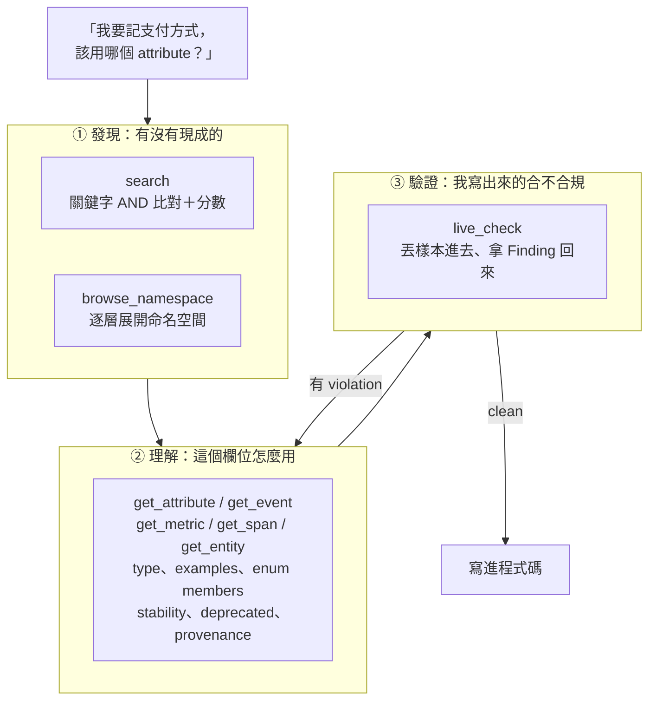
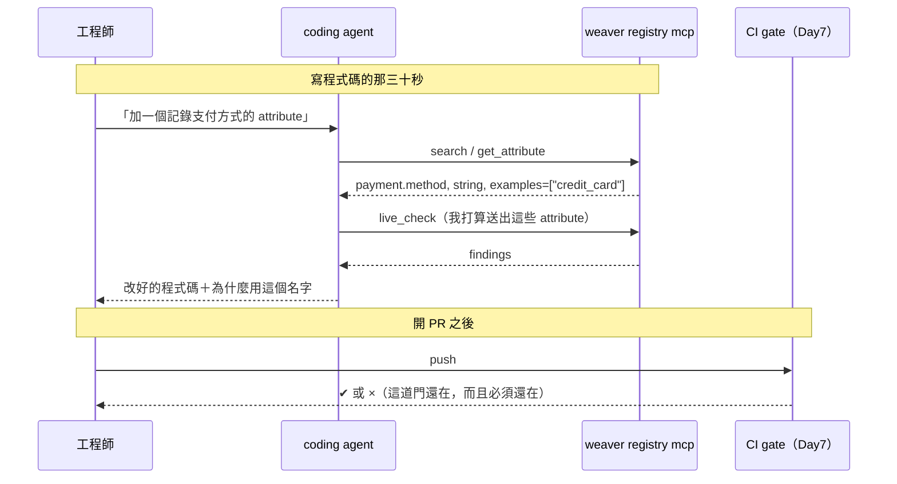
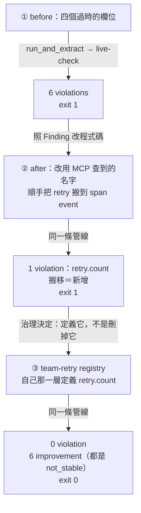

# Day10：`weaver registry mcp`——讓 agent 直接查 registry

前面十四天做出來的東西，全部是給兩種對象用的：**人**（registry 是一份文件、`diff` 是一份 release note）跟 **CI**（policy 是一道 gate）。今天要加第三種對象。

先把場景拉回一個很具體的當下。一個工程師要在 payment service 上加一個欄位，記下這筆交易是被哪種方式支付的。他會怎麼做？

照經驗，他不會去翻 registry。他會做兩件事之一：打開隔壁那個服務的程式碼，看看那邊怎麼命名，複製過來；或者直接問 coding agent「幫我在這個 span 上加一個記錄支付方式的 attribute」。前者產出的是 `paymentMethod`（因為隔壁那個服務三年前是這樣寫的），後者產出的是 `payment.method_type` 或 `payment_method`——LLM 會給你一個看起來很合理的名字，而它合理的依據是它讀過的公開程式碼，不是你們的 registry。

**這就是 Day1 那份命名漂移報告的生產機制。** 不是有人故意違規，是在「要決定一個欄位叫什麼」的那三十秒裡，registry 不在現場。

Day7 那道 CI gate 會擋下他，這是好事，但要注意 gate 介入的時間點：**他已經寫完、測完、開了 PR 之後。** 從平台工程的角度看，這是最貴的一種介入方式——一次來回至少半小時，而且被擋下來的人當下的感受是「這個平台在跟我作對」，即使規則完全正確。

所以今天要做的事，是把同一份治理資產搬到那三十秒裡面去：**`weaver registry mcp` 讓 registry 從「一份文件、一道門」變成「一個 agent 可以呼叫的工具」。** 這是全系列 AIOps 軸線正式登場的起點，也是 paved road 這個概念第一次有具體形狀——不是路上多一道關卡，是預設那條路上有路標。

程式碼在範例 repo [`OTel_AIOps_Agent`](https://github.com/tedmax100/OTel_AIOps_Agent) 的 [`day15/`](https://github.com/tedmax100/OTel_AIOps_Agent/tree/main/day15)：一支不需要 LLM 就能驅動 MCP server 的探針腳本（`mcp_probe.py`）、兩份 before/after 的 instrumentation 範例、一支把**真實送出的 span** 轉成 live-check 樣本的腳本（`run_and_extract.py`），以及最後一輪才長出來的 `team-retry/` registry。registry 主要用 Day9 那份 `base-v2`，環境是 weaver `0.24.1`。

## 結構：八個工具，三種職責

先修正一件事。官方文件跟部落格提到這個 server 時，講的是 `search`／`get`／`live_check` 三個 tool。實測 `0.24.1`，`tools/list` 回來的是**八個**：

```
$ python3 day15/mcp_probe.py day14/base-v2      # 只跑 initialize + tools/list
browse_namespace | ['prefix']            | required= None
get_attribute    | ['key']               | required= ['key']
get_entity       | ['type']              | required= ['type']
get_event        | ['name']              | required= ['name']
get_metric       | ['name']              | required= ['name']
get_span         | ['type']              | required= ['type']
live_check       | ['output', 'samples'] | required= ['samples']
search           | ['limit', 'query', 'stability', 'type'] | required= None
```

`get` 被拆成了五個（attribute／entity／event／metric／span，剛好對應 registry 的 group 類型），另外多了一個 `browse_namespace`。八個工具照職責分成三組，而這三組剛好對應一個工程師在寫 instrumentation 時的三個動作：



第三組是今天最關鍵的一組，因為它讓整件事變成一個**閉環**：agent 不只是查資料，它可以把自己剛寫出來的東西送回去驗證，然後根據結果改。前兩組只是把文件變得比較好查，第三組才讓 agent 有辦法自己知道對不對。

跟 CI gate 對照一下時間軸，就能看出這兩件事不是替代關係：



**MCP 是建議層，CI 才是門。** 這個分工不能反過來——理由後面那節會講，因為它同時是一個平台工程決定跟一個安全決定。

## 操作：不需要 LLM 也能測 MCP server

先講一件實務上很有用的事。這個 server 走 **stdio 上的 JSON-RPC**，所以你不需要接任何 LLM 就能完整測它——`day15/mcp_probe.py` 就是一支六十行的 python，spawn 一個 `weaver registry mcp`、送 `initialize`、送 `tools/list`、再送你指定的 `tools/call`，把回應原封不動印出來。

這件事對治理很重要：**你要能在沒有 LLM 的情況下驗證這個工具回答了什麼**，否則你永遠分不清「agent 講錯」跟「registry 教錯」。今天後面幾個坑，全部是靠這支腳本挖出來的，一次 LLM 呼叫都沒用到。

握手長這樣：

```
$ python3 day15/mcp_probe.py day14/base-v2
=== initialize
{
  "result": {
    "protocolVersion": "2024-11-05",
    "capabilities": { "tools": {} },
    "serverInfo": { "name": "rmcp", "version": "1.6.0" },
    "instructions": "MCP server for OpenTelemetry semantic conventions. Use 'search'
                     to find conventions, 'get_*' tools to get details, and
                     'live_check' to validate samples."
  }
}
```

`instructions` 那一段值得注意：它會被塞進 agent 的 context，是 server 對 agent 的第一句話。也就是說**這個 server 對 agent 的「使用說明」是寫在工具本身裡的**，不是寫在你們的 wiki 裡——這件事在後面第一個坑會變成重點。

要接上真的 coding agent，一份 `.mcp.json` 就夠了：

```json
{
  "mcpServers": {
    "semconv": {
      "command": "weaver",
      "args": ["registry", "mcp", "-r", "day14/base-v2", "--include-unreferenced", "true"]
    }
  }
}
```

`--include-unreferenced=true` 那個參數為什麼是必要的，是今天第四個坑，先記著。

### 發現：search 回來的東西比預期多

```
$ ... '[{"name":"search","arguments":{"query":"payment"}}]'
{
  "count": 7,
  "results": [
    { "key": "payment.method", "type": "string", "examples": ["credit_card"],
      "brief": "支付方式", "score": 80, "result_type": "attribute", ... },
    { "key": "payment.outcome", "score": 80, "result_type": "attribute",
      "type": { "members": [
        { "id": "authorized", "value": "authorized", "brief": "授權成功" },
        { "id": "declined",   "value": "declined",   "brief": "被拒絕" },
        { "id": "pending_review", "value": "pending_review", "brief": "轉人工審核" } ] } },
    { "name": "payment.authorized", "result_type": "event", "score": 80, ... },
    ...
  ]
}
```

兩個重點。第一，**enum 的 `members` 是整組帶出來的**——Day5 說過那是 LLM 唯一能事先知道 label 值域的來源，今天它終於有了消費者：agent 在寫 `set_attribute("payment.outcome", ...)` 的那一刻，就知道合法值只有這三個，不需要猜、也不需要去 grep 歷史資料。

第二，每一筆有 `score`，而且 `result_type` 混合了 attribute 跟 event。分數不是裝飾，後面第二個坑會看到它在做一件很重要的事。

`type` 跟 `stability` 兩個 filter 都實測有效：

```
$ ... '[{"name":"search","arguments":{"query":"payment","type":"event"}}]'
{ "count": 2, ... }        # 只回 payment.authorized / payment.refunded，且每個 event 內嵌它的 attribute 清單

$ ... '[{"name":"search","arguments":{"query":"gateway","stability":"stable"}}]'
{ "count": 0, "results": [], "total": 0 }    # 我們整份 registry 都是 development
```

`stability: "stable"` 這個 filter 對正在寫程式碼的 agent 是有意義的——「只給我不會再變的欄位」。但注意在自訂 registry 上它幾乎一定回 0 筆，因為自己寫的東西通常都還是 `development`（Day8 那份 base 也是）。**這是一個在官方 semconv 上很好用、在自訂 registry 上會讓 agent 以為什麼都沒有的參數。**

### 理解：`get_attribute` 把 Day9 的 deprecation 交代帶出來了

```
$ ... '[{"name":"get_attribute","arguments":{"key":"payment.id"}}]'
{
  "key": "payment.id",
  "type": "string",
  "examples": ["pay-1001"],
  "brief": "支付交易識別碼",
  "stability": "development",
  "deprecated": {
    "reason": "renamed",
    "renamed_to": "payment.transaction_id",
    "note": "Replaced by `payment.transaction_id`."
  },
  "provenance": { "path": "day14/base-v2/model/payment-events.yaml" }
}
```

這一筆輸出把 Day9 的兩個結論同時兌現了。**結構化的 `deprecated` 終於有了第二個消費者**——Day9 說它的價值是「讓下一層有東西可以查」，當時的下一層是 Rego policy，今天多了一層：agent 拿到的不只是「這個欄位存在」，而是「這個欄位已經改名了，新名字叫什麼」。這是那條「`deprecated` 不准寫成字串」的第二層規則，第二次證明自己值得。

`provenance` 那一格也不是裝飾：它告訴 agent 這個定義來自哪個檔案。當 agent 要解釋「我為什麼用這個名字」時，它可以指出出處，而不是說「根據我的理解」。**可追溯的答案跟聽起來很有信心的答案，在治理上是兩件完全不同的事。**

### 驗證：`live_check` 是今天真正的重點

`live_check` 收一組 telemetry sample，回一組 Finding。樣本格式支援 attribute／span／span_event／span_link／resource／metric／log，最小單位是單一 attribute：

```
$ ... '[{"name":"live_check","arguments":{"output":"findings_only","samples":[
     {"attribute":{"name":"paymentId","type":"string","value":"pay-1001"}},
     {"attribute":{"name":"payment.id","type":"string","value":"pay-1001"}},
     {"attribute":{"name":"payment.transaction_id","type":"string","value":"pay-1001"}},
     {"attribute":{"name":"payment.outcome","type":"string","value":"DECLINED"}},
     {"attribute":{"name":"payment.retry_count","type":"int","value":2}}
   ]}}]'
```

五個樣本，回來的 Finding 幾乎是前面十四天的總複習：

```json
{
  "findings": [
    { "name": "paymentId", "findings": [
      { "id": "missing_attribute", "level": "violation",
        "message": "Attribute 'paymentId' does not exist in the registry." },
      { "id": "missing_namespace", "level": "improvement",
        "message": "Attribute key 'paymentId' must include a namespace (e.g. '{namespace}.{attribute_key}')" },
      { "id": "invalid_format", "level": "violation",
        "message": "Attribute key 'paymentId' does not match name formatting rules." } ] },

    { "name": "payment.id", "findings": [
      { "id": "deprecated", "level": "violation",
        "message": "Attribute 'payment.id' is deprecated; reason = 'renamed', note = 'Replaced by `payment.transaction_id`.'." },
      { "id": "not_stable", "level": "improvement",
        "message": "Attribute 'payment.id' is not stable; stability = development." } ] },

    { "name": "payment.transaction_id", "findings": [
      { "id": "not_stable", "level": "improvement", ... } ] },

    { "name": "payment.outcome", "findings": [
      { "id": "not_stable", "level": "improvement", ... },
      { "id": "undefined_enum_variant", "level": "information",
        "message": "Enum attribute 'payment.outcome' has value 'DECLINED' which is not documented." } ] },

    { "name": "payment.retry_count", "findings": [
      { "id": "missing_attribute", "level": "violation",
        "message": "Attribute 'payment.retry_count' does not exist in the registry." },
      { "id": "extends_namespace", "level": "information",
        "message": "Attribute key 'payment.retry_count' collides with existing namespace 'payment'" } ] }
  ],
  "samples_with_findings": 5,
  "total_samples_checked": 5
}
```

逐條對回前面幾天：`paymentId` 那三條就是 Day6 那條 camelCase／缺 namespace 的 Rego 規則，只是這次不用自己寫；`payment.id` 那條 `deprecated` 正是 Day9 結尾「下游還在用被改名的欄位」那個綠燈，在這裡變成 `violation`；`payment.retry_count` 是 Day9 從 v1 到 v2 被刪掉的那個欄位——**registry 的版本演進，第一次直接反映成對程式碼的一句話**。

`undefined_enum_variant` 那一條要單獨講。`DECLINED` 大寫送進去，registry 裡寫的是 `declined`，這種大小寫不符是我在真實 RCA 任務上實際踩過的坑（agent 用 `level="ERROR"` 去撈 Loki，資料裡是 `INFO`，於是它得到零筆結果然後往「系統正常」的方向推理）。`live_check` 抓到了，很好——但它的 level 只有 **`information`**。這是今天最值得放在心上的一格：**對人來說「值域大小寫不符」確實只是個小提醒，對後面要拿這個欄位去查詢的 agent 來說，它是會讓整條推理鏈歸零的錯誤。** 內建 advice 的分級是照通用情境定的，不是照你的 agent 的脆弱點定的。這一格的修法是 Day7 那個 `--advice-policies`（`registry mcp` 也吃這個參數），今天沒做，留給後面。

三個 level（`violation`／`improvement`／`information`）在這裡完整出現，也正好補上 Day7 那條線：Day6 發現三級嚴重度在 `check` 階段不存在、Day7 證明它屬於 `live-check` 的 advice 系統，今天是它第一次**被 agent 消費**。而 agent 要對哪些 level 動作，是一個得由平台團隊決定的事——因為看下一節那份「改好的」程式碼就知道，`clean` 不等於零 Finding。

### 閉環：讓 agent 自己修掉不合規的程式碼

`day15/samples/` 放了兩份程式碼。before 是那種很典型、每一行都情有可原的寫法：

```python
        span.set_attribute("paymentId", f"pay-{order_id}")      # 沒有 namespace、camelCase
        span.set_attribute("payment.gateway", "stripe")          # base 0.2.0 已 obsoleted
        span.set_attribute("payment.outcome", outcome.upper())    # 值域大小寫不符
        span.set_attribute("payment.retry_count", retries)        # base 0.2.0 已移除
```

四行、四種不同的問題，而且沒有一行是「寫錯」——`paymentId` 是隔壁服務的慣例、`payment.gateway` 半年前是對的、`.upper()` 是為了 dashboard 好看、`retry_count` 是上一版 registry 有的欄位。**這正是治理要處理的東西的真實長相：不是違規，是過時。**

上面那份 `live_check` 輸出的五個樣本，就是這四個欄位（加一個對照組）。但這裡要多做一步，而這一步是今天最值得抄走的做法：**不要手打樣本，從真的送出去的 span 上抽。**

`day15/run_and_extract.py` 做的就是這件事——它設一個 `InMemorySpanExporter`、載入 handler、真的呼叫 `charge()` 兩次（一筆成功、一筆被拒），然後把收到的 span 轉成 weaver 的樣本格式：

```
$ python3 day15/run_and_extract.py before
span name=charge kind=internal
  paymentId = 'pay-1001'  (str)
  payment.gateway = 'stripe'  (str)
  payment.outcome = 'AUTHORIZED'  (str)
  payment.retry_count = 0  (int)
span name=charge kind=internal
  paymentId = 'pay-1002'  (str)
  payment.gateway = 'stripe'  (str)
  payment.outcome = 'DECLINED'  (str)
  payment.retry_count = 2  (int)
```

**這支腳本不知道 handler 裡寫了哪些欄位名。** 它讀的是 exporter 收到的東西，所以接下來被檢查的，就是程式碼真的送出的東西——中間沒有一層「我以為它會送這些」的轉述。加上 `--samples` 就變成可以直接餵給 weaver 的 JSON，而 `live-check` 收 stdin：

```
$ python3 day15/run_and_extract.py before --samples \
    | weaver registry live-check -r day14/base-v2 --input-source stdin

Span charge `internal`
    paymentId = pay-1001
        - [violation] Attribute 'paymentId' does not exist in the registry.
        - [improvement] Attribute key 'paymentId' must include a namespace (e.g. '{namespace}.{attribute_key}')
        - [violation] Attribute key 'paymentId' does not match name formatting rules.
    payment.gateway = stripe
        - [violation] Attribute 'payment.gateway' is deprecated; reason = 'obsoleted', note = '金流商改由 server.address 表達，不再需要獨立欄位'.
        - [improvement] Attribute 'payment.gateway' is not stable; stability = development.
    payment.outcome = AUTHORIZED
        - [improvement] Attribute 'payment.outcome' is not stable; stability = development.
        - [information] Enum attribute 'payment.outcome' has value 'AUTHORIZED' which is not documented.
    payment.retry_count
        - [violation] Attribute 'payment.retry_count' does not exist in the registry.
        - [information] Attribute key 'payment.retry_count' collides with existing namespace 'payment'
...
Samples
  - total: 10
  - by highest advice level:
    - no advice: 2
    - improvement: 2
    - violation: 6

Advisories given
  - total: 18
  - advice type:
    - deprecated: 2
    - extends_namespace: 2
    - invalid_format: 2
    - missing_attribute: 4
    - missing_namespace: 2
    - not_stable: 4
    - undefined_enum_variant: 2

$ echo $?
1
```

跟前面 MCP 版本的結果一致（同一套 advice 引擎），但多了兩樣東西：**exit code**（`live-check` 會回 1，所以它也可以當 CI 的一道門，這是 MCP 那條路沒有的），以及**統計摘要**——`by highest advice level` 那三行是「有幾個樣本最嚴重到哪一級」，跟下面 `advice type` 的分佈合起來，是一份可以貼到 PR 上的量化報告。

agent 拿到這些 Finding 之後要做的判斷只有三件，而且每一件的答案都已經在別的 MCP 回應裡了：`missing_attribute` 要換成什麼（`search` 找替代品）、`deprecated` 換成什麼（`renamed_to` 就寫在 Finding 裡）、`undefined_enum_variant` 的合法值是什麼（`members` 在 `search` 結果裡）。改完的版本：

```python
        span.set_attribute("payment.transaction_id", f"pay-{order_id}")  # renamed_to 指定的新名字
        span.set_attribute("payment.method", "credit_card")              # 取代 payment.gateway
        span.set_attribute("payment.outcome", outcome)                   # enum members 裡的原樣值
        # payment.retry_count 在 registry 裡已不存在：改記在 span event 上，不再當 attribute
        if retries:
            span.add_event("payment.retried", {"retry.count": retries})
```

### 跑第二輪：手打樣本會漏掉你自己剛加的東西

再跑一次同一條管線，這次是 after：

```
$ python3 day15/run_and_extract.py after --samples \
    | weaver registry live-check -r day14/base-v2 --input-source stdin

Span charge `internal`
    payment.transaction_id = pay-1001
        - [improvement] Attribute 'payment.transaction_id' is not stable; stability = development.
    payment.method = credit_card
        - [improvement] Attribute 'payment.method' is not stable; stability = development.
    payment.outcome = authorized
        - [improvement] Attribute 'payment.outcome' is not stable; stability = development.

Span charge `internal`
    ...
    Span event payment.retried
        retry.count = 2
            - [violation] Attribute 'retry.count' does not exist in the registry.

$ echo $?
1
```

**還是 exit 1**，而且原因是一個我自己剛加進去的欄位：`retry.count`。

這一格值得停下來看，因為它正是「從真實 span 抽樣本」跟「手打樣本」的差別。這篇文章第一版是用手打的樣本清單驗證的——我列了改好之後的三個 attribute，得到「只剩 `not_stable`」的漂亮結果。但那份清單裡沒有 `retry.count`，因為**我打的是我腦子裡那份改動，不是程式碼真的送出的東西**。那行 `add_event` 就是把一個欄位從 attribute 搬到 span event 上，名字也順手改了，而我在驗證的時候完全忘了它的存在。

**「把欄位搬到別的地方」在治理上不是搬移，是新增。** 這是這個坑的一般形式，而它會發生在每一個「重構一下遙測結構」的 PR 裡：搬去 span event、搬去 resource attribute、拆成兩個欄位、合併成一個 JSON——這些在寫的人眼裡是同一份資料換個位置，在 registry 眼裡全部是沒有定義的新欄位。手打樣本永遠抓不到這種東西，因為手會打的正是你記得的那部分。

### 跑第三輪：合規的修法是改 registry，不是改程式碼

那 `retry.count` 該怎麼辦？有兩條路，而選哪一條是一個治理決定，不是編碼決定。

第一條是把它刪掉——`add_event` 拿掉，這個訊號就不記了。程式碼一改就綠，但你損失了一個真的有用的訊號（重試次數對排查支付失敗很有價值）。**用「讓 CI 變綠」當理由刪掉遙測，是治理最容易造成的損害。**

第二條是承認它是一個新欄位，然後**把它定義出來**。base 之所以移除 `payment.retry_count`，是因為平台團隊認為重試次數不該是 payment 的 attribute；那團隊要保留這個訊號，正確的做法就是 Day8 那套分層——在自己這一層定義，而且用自己的 namespace，不要重新定義一個 base 已經拿掉的名字（Day8 第二個陷阱：那會製造一個沒有人用的孤兒）：

```yaml
# day15/team-retry/manifest.yaml
name: payment-team
schema_url: https://example.com/schemas/payment-team/0.1.0
dependencies:
  - name: payments-base
    registry_path: day14/base-v2

# day15/team-retry/model/retry.yaml
groups:
  - id: registry.retry
    type: attribute_group
    stability: development
    brief: "重試相關的團隊自訂屬性"
    attributes:
      - id: retry.count
        type: int
        stability: development
        brief: "這筆請求已經重試過幾次（不含首次嘗試）"
        examples: [2]

  - id: event.payment.retried
    type: event
    name: payment.retried
    stability: development
    brief: "一次支付重試"
    attributes:
      - ref: retry.count
        requirement_level: required
```

```
$ weaver registry check -r day15/team-retry
✔ No `after_resolution` policy violation

$ python3 day15/run_and_extract.py after --samples \
    | weaver registry live-check -r day15/team-retry --input-source stdin --include-unreferenced=true

Span charge `internal`
    payment.transaction_id = pay-1001
        - [improvement] Attribute 'payment.transaction_id' is not stable; stability = development.
    payment.method = credit_card
        - [improvement] Attribute 'payment.method' is not stable; stability = development.
    payment.outcome = authorized
        - [improvement] Attribute 'payment.outcome' is not stable; stability = development.
Span charge `internal`
    ...
    Span event payment.retried
        retry.count = 2
            - [improvement] Attribute 'retry.count' is not stable; stability = development.

$ echo $?
0
```

**exit 0，但 Finding 沒有歸零——剩下六條 `improvement`。** 因為整份 registry 都是 `development`，每個欄位都會拿到一條 `not_stable`。這件事決定了這個閉環能不能自動化：如果你叫 agent「改到沒有 Finding 為止」，它會追一個永遠達不到的目標，然後開始做一些你不會喜歡的事（把欄位改掉、把 event 註解掉、或宣稱已經修好）。**正確的指示是「改到 `violation` 歸零為止」**，而這句話得由平台團隊寫進 agent 的指令裡——工具不會幫你決定哪一級算失敗，這跟 Day9 第二層那個「CI 要不要加 `--future`」是完全同一種決定。好消息是 `live-check` 的 exit code 已經幫你把界線畫在同一個地方（只有 `violation` 會讓它回 1），所以「照 exit code 走」是一個站得住腳的預設。

三輪跑完，這個閉環的完整形狀是：



而第三輪那個轉折是今天最重要的一句話：**閉環的出口有兩個，一個是改程式碼，一個是改 registry。** 一個只會改程式碼的 agent（或工程師），碰到「這個欄位還沒被定義」時只有一條路——把它刪掉，讓 gate 變綠。這正是治理做壞掉的樣子：規則沒有被違反，但系統的可觀測性被規則吃掉了一塊。

### 順便發現的：`live_check` 只認得 attribute

上面那些輸出裡有一件事一直沒被提到：**span 的名字從來沒有被檢查過。**

`base-v2` 裡沒有任何 `type: span` 的 group，而我們送進去的 span 叫 `charge`——一個 registry 裡完全不存在的名字。用一個更誇張的名字驗證：

```
$ echo '[{"span":{"name":"totally.unknown.span","kind":"internal","attributes":[
      {"name":"payment.method","type":"string","value":"credit_card"}]}}]' \
    | weaver registry live-check -r day14/base-v2 --input-source stdin

Span totally.unknown.span `internal`
    payment.method = credit_card
        - [improvement] Attribute 'payment.method' is not stable; stability = development.

Samples
  - by highest advice level:
    - no advice: 2
    - improvement: 1
```

`totally.unknown.span` 得到的 advice 是**零條**。同樣的道理，第二輪那個 `payment.retried` event 在還沒被定義的時候，被抓到的是它裡面的 `retry.count`，**event 的名字本身沒有被說一句話**。

所以 advice 系統的覆蓋範圍是：**未定義的 attribute 是 `violation`，未定義的 signal 名稱是沉默。** 這個不對稱在實務上的意義是，`live-check` 抓不到「多了一個沒人宣告的 span」或「span 名字打錯字」——而後者在真實系統裡很常見（`chekout` 這種 typo 會產生一條全新的、永遠不會被 dashboard 查到的 span）。要抓這種東西，得靠 Day15 那個拓撲對帳（拿真實 Tempo 的 call graph 去對宣告過的服務與操作），不是靠 registry 的 advice。這也是為什麼那一天要單獨存在。

## 四個實測出來的坑

### 一、`search` 是關鍵字 AND 比對，不是語意搜尋

這是今天最容易讓人失望的一個，而它直接打在「用自然語言查 registry」這個賣點上。

```
$ ... '[{"name":"search","arguments":{"query":"how do I record the payment amount"}}]'
{ "count": 0, "results": [], "total": 0 }
```

零筆。而同一份 registry 上：

| query | count | 說明 |
|---|---|---|
| `payment` | 7 | 所有 `payment.*` 加兩個 event |
| `pay` | 7 | 前綴比對，分數同樣是 80 |
| `transaction` | 1 | 只中 `payment.transaction_id` |
| `交易` | 3 | **中文也會比對到 `brief`** |
| `outcome` | 1 | key 比對 |
| `payment method` | 1 | 兩個詞都在 → 中 |
| `payment amount` | 0 | `amount` 不存在 → 整句落空 |
| `how do I record the payment amount` | 0 | 同上 |

規律很清楚：**多個詞是 AND，任何一個詞找不到就是零筆。** `payment amount` 明明有一半命中，回來的卻不是「payment 相關的有這些、amount 沒有」，而是什麼都沒有。

要公平地說，這件事工具自己講了。`search` 的 tool description 裡明明白白寫著 `Query terms are AND-matched (all must appear)` 跟 `Use short queries like 'http.request', 'db system'`。所以嚴格說這不是 bug，是**契約寫在工具描述裡，而遵守契約的責任在 agent 身上**。

這個責任的分配方式，是 MCP 這類介面跟傳統 API 最不一樣的地方，也是平台團隊要習慣的新事情：**tool description 就是介面契約，而它的執行者是一個會不會照做要看機率的東西。** 傳統 API 的參數格式寫錯會直接報錯，這裡不會——agent 送一整句自然語言進去，會得到一個語法完全正確、`isError: false`、`count: 0` 的回應。零筆結果的意思是「沒有這個欄位」還是「你的查法不對」，工具不會告訴你。

實務上的處理方式有兩層。工具那一層你改不動（description 是 weaver 寫死的），能改的是**你自己給 agent 的指令**：在專案的 `CLAUDE.md`／system prompt 裡寫明「查 semconv 時一次只查一到兩個關鍵字，零筆時換一個詞再試，不要把整句問題丟進去」。這聽起來很土，但它是目前唯一有效的做法，而且它有一個很重要的副作用——**它把「agent 會怎麼用這個工具」變成一份可以 review、可以版本控制的文件**，而不是每個人各自碰運氣。

### 二、`browse_namespace` 不標 deprecated，`search` 會標而且會降權

這一個比第一個危險，因為它不會給你零筆，它會給你一個看起來完全合理的錯答案。

`base-v2` 裡有五個 attribute，其中 `payment.id` 已經改名、`payment.gateway` 已經 obsoleted。`browse_namespace` 看到的是：

```json
{
  "prefix": "payment",
  "attributes": [
    { "key": "payment.gateway",        "brief": "處理這筆交易的金流商代號",   "stability": "development" },
    { "key": "payment.id",             "brief": "支付交易識別碼",             "stability": "development" },
    { "key": "payment.method",         "brief": "支付方式",                   "stability": "development" },
    { "key": "payment.outcome",        "brief": "支付的終態結果",             "stability": "development" },
    { "key": "payment.transaction_id", "brief": "支付交易識別碼（改名後的正式欄位）", "stability": "development" }
  ],
  "total_attribute_count": 5,
  "max_depth": 1
}
```

**五個等權的候選，沒有任何一個字提到有兩個已經退役。** 而 `payment.id` 跟 `payment.transaction_id` 的 `brief` 幾乎一樣，前者還比較短、比較像正式名稱。一個 agent（或一個人）從這份清單裡挑「支付交易識別碼」該用哪個，挑錯的機率不低於一半。

同一份 registry，`search "payment"` 的結果卻是對的：

| key | score | 有沒有 `deprecated` |
|---|---|---|
| `payment.method` | 80 | — |
| `payment.outcome` | 80 | — |
| `payment.transaction_id` | 80 | — |
| `payment.authorized`（event） | 80 | — |
| `payment.refunded`（event） | 80 | — |
| `payment.gateway` | **8** | `reason: obsoleted` |
| `payment.id` | **8** | `reason: renamed`, `renamed_to: payment.transaction_id` |

**分數從 80 掉到 8，而且 deprecation 整包帶出來。** `search` 不只知道哪些欄位退役了，還主動把它們排到最後面——這是一個設計得很好的行為，只要 agent 用的是 `search`。

所以同一個 server、同一份 registry，兩個工具給出兩種真相。這件事的實務結論很直接：**在給 agent 的指令裡指定用 `search`，並且要求它在寫下任何欄位名之前先 `get_attribute` 確認一次。** `browse_namespace` 適合人拿來探索一個陌生的命名空間，不適合當成挑欄位的依據。

再往上拉一層看，這是 Day9 那句「deprecation 是一個宣告，不是一個通知」在 agent 介面上的重演。平台團隊該做的事都做了——`deprecated` 寫得完整、`renamed_to` 指得清楚、`note` 也寫了。**但這些資訊要真的抵達使用者，取決於他走進來的是哪一個入口，而入口的行為不一致。** 治理資產的品質不只看它記了什麼，還要看每一條讀取路徑會不會把它讀漏。

### 三、查不到的東西回 `isError: false` 加一句散文

```
$ ... '[{"name":"get_attribute","arguments":{"key":"payment.amount"}}]'
{
  "result": {
    "content": [ { "type": "text", "text": "Attribute 'payment.amount' not found in registry" } ],
    "isError": false
  }
}
```

注意 `isError` 是 **false**。從 MCP 協定的角度，這次呼叫成功了；「找不到」是一個正常的結果，而且是**一句自然語言**，不是一個結構化的 `{"found": false}`。

這件事對 agent 的影響，比它看起來大。一個結構化的 `found: false` 是一個 agent 幾乎不可能誤讀的訊號；一句散文則要經過同一個會做創意解釋的推理過程。而根據 Day6 那個模式——**LLM 犯錯的方式很隱蔽，它不會說「我不確定」，它會選一個然後往下推理**——最可能的失敗長相不是它讀不懂那句話,而是它讀懂了、然後決定「registry 裡沒有這個欄位，那我自己取一個合理的名字吧」。於是你得到 `payment.amount`，一個從來沒有被定義過、但在 agent 的說明裡被講得像是查到的欄位。

我在自己的 RCA agent 上踩過形狀一樣的坑：工具回了空結果，agent 沒有停下來說查不到，而是沿著一個自己編出來的前提往下走。**空結果跟編造之間的距離，比想像中短。**

所以這裡的處理方式跟第一個坑一樣落在指令那一層，而且是一條硬規則：**任何欄位名要寫進程式碼之前，必須先出現在某一次 `get_attribute` 的成功回應裡；`not found` 就是停下來問人，不准自己命名。** 這條規則的另一半在 CI——就算 agent 真的編了一個名字出來，Day7 那道 gate 會擋住它。這也正是「MCP 是建議層、CI 才是門」的具體理由：**建議層的可靠度是機率性的，所以門不能拆。**

### 四、分層 registry 在 MCP 上預設是空的

Day8 那個 `--include-unreferenced` 的坑，在這裡有一個更嚴重的版本。

拿 Day8 那份 team registry（自己一個 event，其他 attribute 全部 `ref` base 的）掛上 MCP server：

```
$ python3 day15/mcp_probe.py day13/team '[
    {"name":"browse_namespace","arguments":{}},
    {"name":"get_attribute","arguments":{"key":"payment.outcome"}},
    {"name":"search","arguments":{"query":"checkout"}}]'

browse_namespace {} -> { "sub_namespaces": [], "attributes": [], "total_attribute_count": 0, "max_depth": 0 }

get_attribute {"key":"payment.outcome"} -> Attribute 'payment.outcome' not found in registry

search {"query":"checkout"} -> { "count": 1, "results": [ { "attributes": [
    { "key": "payment.id", "brief": "支付交易識別碼", "requirement_level": "required", ... },
    { "key": "payment.outcome", "type": { "members": [ ... ] }, "requirement_level": "required", ... } ] ... } ] }
```

三個回應互相矛盾：`browse_namespace` 說這份 registry 有 **0 個 attribute**，`get_attribute` 說 `payment.outcome` **不存在**，而 `search` 回來的那個 event **內嵌了 `payment.outcome` 的完整定義，連 enum members 都在**。

原因就是 Day8 那個預設值：`--include-unreferenced` 預設 `false`，依賴裡的 attribute 不算這份 registry 的內容。當時的症狀只是 `stats` 少算幾個 group，影響是「CI 探針的數字要想清楚」；搬到 MCP 上，症狀變成 **agent 問它要用的那個欄位存不存在，得到「不存在」**。而它下一步會做什麼，第三個坑已經講過了。

修法就是掛 server 的時候加上那個參數：

```
$ python3 day15/mcp_probe.py day13/team '[{"name":"get_attribute","arguments":{"key":"payment.outcome"}}]' \
    --include-unreferenced=true

{
  "key": "payment.outcome",
  "type": { "members": [ { "id": "authorized", ... }, { "id": "declined", ... } ] },
  "brief": "支付的終態結果",
  "stability": "development",
  "provenance": {
    "source": "https://example.com/schemas/payments-base/0.1.0",
    "path": "day13/base/model/payment-events.yaml"
  }
}
```

而這一步順手回答了 Day9 留下的那個問題：**「agent 讀到的定義是哪一版？」——`provenance.source` 就是答案。** 那個 `https://example.com/schemas/payments-base/0.1.0` 是 base 的 `manifest.yaml` 裡的 `schema_url`，跨層引用時會被帶進 provenance（沒有分層的單一 registry 只有 `path`，沒有 `source`）。

所以 Day8 那句「`schema_url` 裡那個 `0.1.0` 還只是個裝飾」，到今天為止已經兌現兩次：Day9 用它當 `diff` 的版本標籤，今天它是 agent 唯一能看到的版本資訊。**一個只有寫下去、沒有人讀的欄位，跟一個藏著兩個下游功能的欄位，在 YAML 裡長得一模一樣。** 這也是為什麼 registry 範本裡那些「看起來沒用」的欄位不該被省略——你不知道哪一個下游會需要它。

## 平台工程：這個 server 該由誰跑

技術上這是一行指令的事，但「誰跑、跑哪一份、怎麼更新」這三個問題決定了它是一個平台能力還是一個個人技巧。

**誰維護。** 這個 server 沒有中央部署的必要（走 stdio，跟著開發者的 agent 一起啟動），但**它的設定必須是平台團隊發佈的**。理由就是上面第四個坑：漏掉 `--include-unreferenced=true`，agent 得到的答案是「這個欄位不存在」；而這個參數該不該加，取決於這份 registry 有沒有分層——這是產品團隊不該需要知道的事。所以交付物是一份帶進 repo 的 `.mcp.json`（跟 Day7 那份 workflow 一樣，屬於平台團隊維護、產品團隊只是取用的東西），不是一段貼在 wiki 裡的指令。

**產品團隊要付多少成本。** 這是今天這個機制最漂亮的地方：接上它要做的事是零——`.mcp.json` 已經在 repo 裡，agent 啟動時自己會發現它。沒有新概念要學、沒有新指令要記，甚至不需要知道 registry 存在。對照 Day7 那道 gate（被擋了才知道有規則），這是同一份治理資產的兩種投遞方式，而**成本差在「使用者需不需要先知道它存在」**。這正是 paved road 的判準：不是規則變寬鬆了，是使用者不必為了合規多做動作。

**失敗的時候能不能自救。** 這一項今天答得不好，得誠實記著。`count: 0` 跟 `not found` 都是「成功但沒東西」，訊息裡沒有任何一句提示下一步（要不要換關鍵字、要不要看命名空間、這份 registry 是不是掛錯了）。所以自救的能力得靠外部補：agent 指令裡寫明零筆時的重試策略，以及一句「連續查不到就停下來問人」。**這是一個平台團隊要自己補文件的洞，跟 Day9 第一層那個誤導的錯誤訊息是同一類成本。**

**強制、預設、還是建議。** MCP 是**建議**層，而且必須留在建議層。這不只是因為 LLM 不可靠（雖然那是主要理由），還因為一道靠 LLM 判斷的 gate 是不可重現的——同一份程式碼今天過、明天不過，而你沒有辦法解釋為什麼。Day7 那道 CI gate 的價值正在於它的判斷是確定性的。**把 MCP 加進來之後，門的位置沒有變，變的是走到門前的人手上有沒有地圖。**

**演進的責任在哪一邊。** 這一項今天有一個真正的進展。Day9 的結論是 deprecation 只是宣告、不是通知，下游沒有任何訊號；今天 registry 一改版，所有掛著這個 server 的 agent **下一次查詢就會拿到新的定義**，不需要任何人去通知任何人。這是「通知」這件事第一次有了機制——但只有一半：它是**拉取式**的，只有在有人剛好要改那段程式碼、而且剛好透過 agent 去查的時候才會發生。已經寫好、沒有人再碰的程式碼，還是躺在那裡用著舊欄位。另一半（主動掃出「誰還在用舊欄位」）仍然是 Day9 那條 `deprecated_usage.rego` 的工作。**拉取式的通知會讓活躍的程式碼自己跟上，存量則需要另外一套機制去清。**

## 回到 AIOps：兩種 agent，同一份 registry

今天這個 agent 是 **coding agent**，它消費 registry 的時機是 build time——寫程式碼的那三十秒。而這個系列後面要做的 RCA agent 消費的是 decision time——線上出事的那三十秒。兩者用的是同一份 registry，但問的問題完全不同：

| | coding agent（今天） | RCA agent（Series 2） |
|---|---|---|
| 時機 | build time | decision time |
| 問的問題 | 「這個概念該用哪個欄位名」 | 「這個欄位有哪些合法值、我該怎麼查」 |
| 最需要的欄位 | `key`、`deprecated.renamed_to`、`examples` | `type.members`（值域）、`unit`、`requirement_level` |
| 錯誤的後果 | 一個命名漂移，CI 會擋 | 一條推理鏈靜默歸零，沒有人會擋 |

最後一列是重點。今天這個 agent 犯錯有兩層保險（`live_check` 會說、CI 會擋），所以 MCP 對它來說是「讓事情更順」；而 decision time 的 agent 犯錯**沒有任何一道門**——它查了一個大小寫不符的 enum 值、得到零筆結果、然後回報「系統正常」，這個過程從頭到尾都是綠燈。

這也是為什麼 `undefined_enum_variant` 只有 `information` 這件事今天要特別點出來：**內建 advice 的分級是照「人寫程式碼」的情境定的。** 同一個問題對兩種 agent 的嚴重度差一整級，而調整這個分級是平台團隊的工作（`--advice-policies`），不是工具的預設值能替你做的決定。

往回看整條線，今天算是把 Day1 到 Day9 的治理資產第一次接上了消費端：Day5 的 `enum members` 有了讀者、Day8 的 `schema_url` 有了用途、Day9 的 `deprecated` 有了第二個消費者、Day7 的三級 advice 有了 agent 這個新的受眾。**治理資產的價值不在於它被寫下來，在於有多少條路徑會去讀它**——而每接上一個消費端，前面那些「看起來只是為了整齊」的規則就多一個具體的理由。

## 今天沒做的事

沒有量測 agent 的遵守率。今天證明的是「工具會給出正確答案」，完全沒有證明「agent 真的會去用它、而且照著用」。第一個坑那條「一次只查一兩個關鍵字」的指令，實際上有多少比例的對話會照做？agent 在 `live_check` 回報 `violation` 之後，是真的改名字，還是把那行註解掉？這些都是 Day24 那個 eval harness 該回答的問題，而且它們需要的正是那種「同一個任務跑很多次、看分佈」的量測方式，不是一次示範。**在有那份數字之前，今天所有結論的正確說法都是「這個工具讓對的事情變得可能」，不是「這樣就不會漂移了」。**

沒有把 `--advice-policies` 接上去。`registry mcp` 吃這個參數，也就是說 Day7 那套自訂 advice 可以直接套進 agent 的驗證迴路裡——最想做的一條是把 `undefined_enum_variant` 從 `information` 升到 `violation`，因為對後面的 decision-time agent 來說它就是致命的。沒做的原因是那會變成一整篇「怎麼設計給 agent 的 advice 分級」，而那個題目的前提是先有 Day24 的數字證明哪一級真的會影響結果，不然只是換一個我自己的主觀分級去取代工具的主觀分級。

沒有同時掛多份 registry。真實情況通常是「官方 semconv ＋ 自己的 registry」兩份都要查，而今天只掛一份自訂的——後果在文章裡看得到：`search "gateway"` 加上 `stability: "stable"` 回零筆，因為自訂 registry 裡沒有任何 stable 的東西。同時掛兩個 MCP server 技術上可行（`.mcp.json` 裡列兩筆），但 agent 要怎麼決定先查哪一份、兩邊都有同名欄位時聽誰的，這是一個新問題，而它其實是 Day8 那個分層問題在 agent 介面上的翻版。

沒有測遠端 transport。今天全部走 stdio，server 跟 agent 在同一台機器上。如果要做成中央服務（例如讓 CI 或線上的 agent 也查得到），要面對的是認證、快取、以及「registry 更新之後多久生效」這些完全不同的問題。

明天：機器可讀的「意圖」——今天讓 agent 讀懂了「這個欄位是什麼」，但它還讀不到「這個系統現在應該處於什麼狀態、這次變更打算改變什麼」。三個對照範例（日常營運意圖、變更意圖、穩定狀態意圖），以及用 template engine 從 schema 生出型別安全的常數，讓「意圖機器可讀」這件事有一個具體的程式碼收口。
