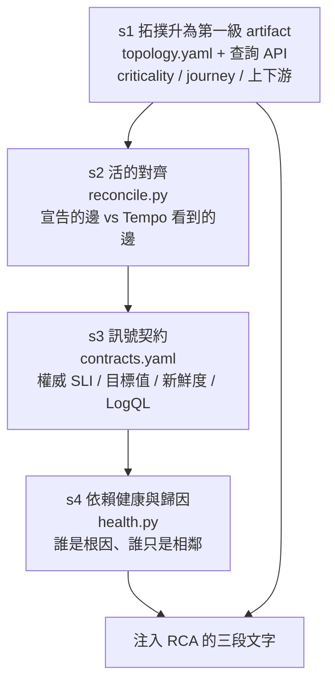
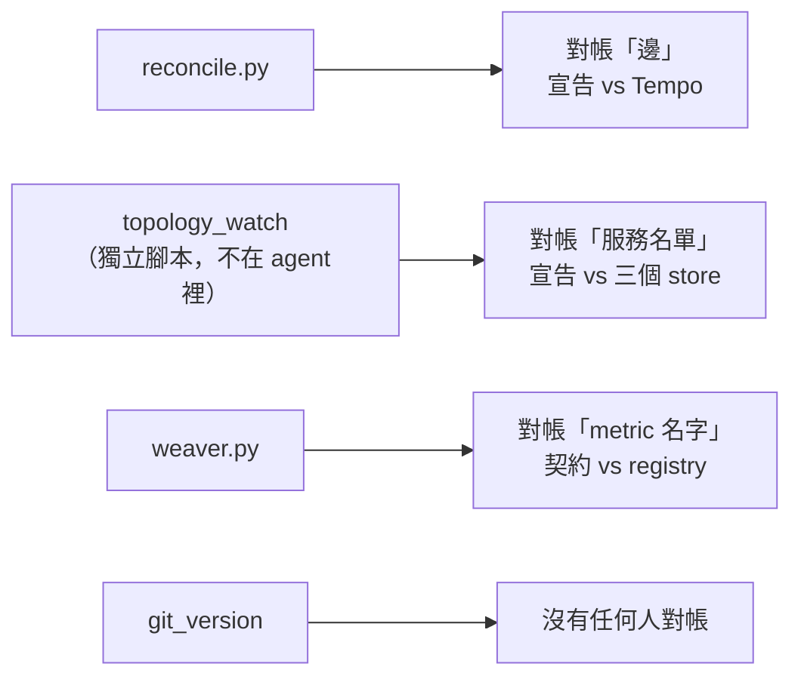

# Day19：這一階段做到哪裡，沒做到哪裡

> 寫一份宣告很便宜
> 貴的是持續證明它還準
> 中間那段沒有人做的話
> 它會慢慢變成一份謊話

昨天把 CEL（Context Enrichment Layer，情境豐富層）的三個職責跟溯源攤開來講，也貼了一份決策級遙測該長什麼樣的 JSON，並且說明那個物件現在沒有任何一支程式會吐出來。今天把帳算清楚：這一階段實際蓋出來的東西，對照那四項，逐一打勾或留白。

會這樣收尾是因為概念日很容易變成一種漂亮的空話。講完 enrichment、correlation、projection、grounding，讀者很自然會以為這個 repo 就是照這樣做的。它不是。

## 先看蓋了什麼

第二階段的程式碼在 `app/signals/`，八個模組（加一個 `__init__.py`）1545 行，六份對應的測試檔 69 條（這是寫這篇那天數的，後面幾天還會再長）。設計稿把它切成四個階段，代號 s1 到 s4：



（圖裡那個 SLI 是 Service Level Indicator，服務水準指標，也就是「用哪一句查詢判斷這個服務好不好」；RCA 是 root cause analysis，根因分析，agent 被叫去做的那件事。）

四個階段全部唯讀，這是設計稿一開始就定下的鐵律：整個第二階段不能有任何副作用。這個限制回頭看是對的，它讓每一段都可以單獨上線、單獨驗證，而且錯了也只是 context 難看，不會壞掉任何東西。

## 逐項對照

| CEL 的職責 | 這一階段做到的 | 判定 |
| --- | --- | --- |
| enrichment：baseline | 只有 `attribution` 那條邊有（s4.2 拿 current 比 offset 前） | 部分 |
| enrichment：trajectory | 沒有。`signals/` 裡沒有任何算趨勢、斜率的東西 | 缺 |
| enrichment：topology context | s1 全做到，而且是宣告加對帳兩層 | 有 |
| enrichment：change context | 沒有。`git_version` 只是一個被搬運的欄位 | 缺 |
| correlation | 沒有。三段文字各自生成、各自注入 | 缺 |
| projection | 沒有，一行都沒有 | 缺 |
| grounding | 權威查詢可以重跑、log 帶著 trace ID；但注入的那段話本身沒有任何識別碼 | 半 |

四項裡沒有一項是完整的：enrichment 四格只有拓撲那一格做滿，grounding 一半，correlation 跟 projection 整格空白。加起來大概一項半。下面把每一項的證據攤開。

### enrichment：只有一條邊有 baseline

補基準線這件事，`signals/` 裡只有一個地方在做：

```console
$ grep -rn "baseline\|trajectory\|trend\|slope\|forecast" app/signals/*.py | cut -d: -f1 | sort -u
app/signals/health.py
```

而且 `health.py` 裡那個 baseline 不是給 SLI 用的，是給 `attribution` 那條邊用的。也就是說「order-service 歸因到 payment 的失敗量比三十分鐘前漲了沒」有基準線，但「payment 的拒絕率 55% 算不算異常」沒有。後者靠的是契約裡宣告的一個固定目標值 `declined_rate < 1%`。

固定目標值跟基準線不是同一件事。目標值回答「這個數字合不合格」，基準線回答「這個數字對這個服務、這個時段來說正不正常」。**一個半夜流量只有白天十分之一的服務，用同一個目標值判斷，白天漏報、半夜誤報。**

trajectory 更乾脆，完全沒有。系統現在有辦法說「payment 的拒絕率是 55%」，沒有辦法說「它從 2% 一路爬上來，爬了二十分鐘」。而後面那句話對值班的人來說資訊量大得多，它同時回答了「什麼時候開始的」跟「還在惡化嗎」。

change context 那格是最尷尬的一格，因為它看起來像有做。`topology.yaml` 每個節點都帶著 `git_version`，看起來就是變更情境。但那個欄位從來沒有被拿去對照任何東西，下一節就是在講這件事。

### correlation：三段文字，各自為政

前面那個模組關係圖已經畫出結論了：`context.py`、`health.py`、`dq.py` 三個各自生一段文字，各自注入。沒有任何一個地方問過「這三段講的是不是同一件事」。

這不是抽象的缺點，它已經咬過兩次。一次是同一條邊在呼叫方跟被呼叫方各出現一個 ⚠，另一次是標題說 100% 而底下掛著兩個警告。**那兩個 bug 我當時是各自修掉的，但它們的成因是同一個：沒有一層負責把散落的判斷收成一個一致的說法。**

### projection：一行都沒有

沒什麼好講的，這個系列從一開始就沒有打算做。理由是推估要有意義，得先有校準。一個沒有被驗證過準確度的預測，比沒有預測更危險，因為它會讓人採取行動。校準機制是另一個層次的東西，不是這個階段收得完的。

### grounding：一半

這一項比想像中好，但也只有一半。

好的那半是契約帶來的。注入給 agent 的每一條 SLI 都附上權威的 PromQL，log 也附上權威的 LogQL。這代表 agent 講出來的任何結論，都可以有人把那句查詢複製出來重跑一次，看看數字對不對。這是很實用的一種溯源，而且成本幾乎是零。

Loki 那邊更完整。隨手撈一筆 `payment.declined`，它自己就帶著 trace 的識別碼。這裡要注意它在 Loki 裡的形狀跟服務 stdout 印出來的那份 JSON 不一樣：走 OTLP 進來之後，log 的本體只剩一句話，其他全部變成 structured metadata：

```console
$ curl -sG localhost:3100/loki/api/v1/query_range --data-urlencode \
    'query={service_name="payment-service"} | event="payment.declined"' ...

body: "declined by new validator"
  event:        payment.declined
  reason:       new_validator_odd_cents
  order_id:     o-25779
  git_version:  v2.5.0
  otelTraceID:  e18757726d5af93fe9fabd3d9d82adee
  span_id:      6a6aeadc9c010352
```

（那個欄位叫 `otelTraceID` 不叫 `trace_id`，是 OTLP 進 Loki 之後被改名的，寫查詢的時候會踩到。）從這一行可以直接跳到那一條 trace。這是三種訊號裡唯一一種本來就走得回去的。

缺的那半是：**注入的那段話本身沒有身分。** 它是一段散文，裡面的每一個數字都沒有標記它是什麼時候、用哪一句查詢、在哪個視窗算出來的。agent 讀完之後如果說「payment 拒絕率 55%」，沒有任何機制可以從那句話走回產生它的那次查詢。前面那個兩個 replica 疊成一條 series 的坑會沒有人發現，根本原因就在這裡。

## 一個現行的 silent decay

[《代理式可靠性工程》（Agentic Reliability Engineering，簡稱 ARE）](https://learning.oreilly.com/library/view/agentic-reliability-engineering/0642572294809/) 第三章列了五種「從 dashboard 上看不見」的失效模式，第一種叫 `silent decay`：宣告當初是對的，然後系統變了，宣告沒跟上，而且沒有任何東西會叫。

寫這篇的時候我順手對了一下宣告的版本跟實際跑的版本：

```console
$ grep git_version aiops-agent/service/app/signals/topology.yaml
  git_version: v4.0.0     # api-gateway
  git_version: v3.1.2     # order-service
  git_version: v2.4.1     # payment-service
  git_version: v1.3.0     # user-service
  git_version: v5.2.0     # webapp

$ curl -sG localhost:9090/api/v1/query --data-urlencode \
    'query=count by (service_name, git_version) ({__name__=~".+"})'
  api-gateway      v4.0.0
  order-service    v3.1.2
  payment-service  v2.5.0     ← 宣告寫 v2.4.1
  user-service     v1.3.0
  webapp           v5.2.0
  aiops-agent      v0.0.1     ← 它自己也在噴指標，而拓撲裡沒有它
```

五個宣告的服務裡四個對得上，payment 對不上。而它是這整個階段所有實測都繞著跑的那個服務。（多出來的 `aiops-agent` 就是前面提過那個「沒被宣告卻活著」的服務，agent 自己。）

問題不在那個數字錯了，在於**這一階段有三條對帳路徑，沒有一條覆蓋這個欄位**：



這裡順帶要補一句：那三條路徑裡只有兩條真的住在 agent 裡（`reconcile.py` 跟 `weaver.py`），對服務名單那一條是隨文附的獨立腳本，agent 執行時完全不會碰到它。所以「三條」這個說法其實已經有點寬容了。

我去 grep 過整包程式碼，`git_version` 在 `signals/` 底下出現在三個地方，但沒有一個是在讀它：

```console
$ grep -rn "git_version" app/signals/*.py
app/signals/topology.py:45:    git_version: str = ""          # 定義這個欄位存在
app/signals/compile.py:56:    git_version: str = ""           # 從各服務的宣告搬進來
app/signals/compile.py:123:            git_version=f.git_version,
app/signals/health.py:328: "correlate with git_version (sum by git_version,reason) ..."
```

前三筆是定義跟搬運，第四筆是一句寫給 agent 看的文案。**沒有任何一行程式碼把這個宣告的值拿去跟任何東西比對。**

而諷刺的地方在這裡。`health.py` 判定一個服務是根因的時候，結論那句話是這樣寫的：

```
it is the LIKELY ROOT CAUSE, not a symptom. Do NOT dismiss this as normal;
correlate with git_version (sum by git_version,reason) to find which deploy
introduced it.
```

**系統叫 agent 拿 `git_version` 去找是哪次部署造成的，而系統自己宣告的那個 `git_version` 是過期的。** 好在這句話是叫 agent 去查指標上的 label（那個是真的），不是去讀宣告，所以實務上不會出錯。但這個巧合不是設計出來的，是運氣。

這個漂移怎麼發生的也很典型。那個欄位住在 `demo-services/services/payment/signal.yaml`，是服務團隊自己擁有的宣告，手工維護。payment 從 v2.4.1 發到 v2.5.0 的時候，沒有任何一道關卡問過「你的 signal.yaml 要不要跟著改」。

## 訊號斷崖：這個系列沒有實例

五種失效模式裡，前面幾天各自撞到過四種：

| 失效模式 | 這個系列的實例 |
| --- | --- |
| silent decay | 上面那個 `git_version`；還有寫好卻從來沒被呼叫過的對帳程式 |
| stale topology | 宣告了六條邊只觀察到五條；以及沒被宣告卻活著的那個服務 |
| ambiguous semantics | 大小寫對不上的 `level`、`{service=}` 跟 `{service_name=}` 之爭 |
| signal flood | 平鋪掃描零事故給二十個候選，事故時十一條在講同一件事 |
| signal cliff | 沒有 |

`signal cliff`（訊號斷崖）是 flood 的反面：團隊把訊號修剪得太乾淨，砍掉了那些「目前沒有任何決策用得到」的訊號，於是遇到沒見過的失效模式時，agent 手上沒有任何能區分這次跟別次的東西，只能亂做或全部升級。

最接近的候選是 api-gateway 完全沒有 error SLI 這件事。效果確實很像：真的出事的時候，那個節點在依賴健康分析裡是一片空白。

但它不算實例，因為成因反過來了。api-gateway 不是被修剪掉的，是從來沒有裝過。它是一個薄轉發層，寫契約的當下判斷「這裡沒有自訂指標」完全合理。**訊號斷崖真正危險的地方，是那個砍掉訊號的決定在當下看起來是對的**：有人做了「這條指標沒有任何決策在用，砍掉省成本」的判斷，而且他是對的，直到出現一個沒人預料過的失效模式。

我沒有這種案例，因為這個 demo 從頭到尾在加東西，沒有經歷過任何一次「為了降成本砍訊號」的決策。這個反模式要真的長出來，需要的是時間跟成本壓力，不是一座跑了兩個月的 demo。

書裡給的解方也值得抄下來：決策級訊號集要對著 agent **可能**需要做的決策空間去設計，不是只對著它今天在做的決策。留一小批目前沒人用的訊號不是浪費。

## 誰的帳，誰來還

從平台工程的角度，今天這份對照表其實是一份技術債清單，而它有一個共同點：**缺的四項裡有三項，缺的原因不是「難做」，是「沒有人擁有」。**

baseline 跟 trajectory 要有人決定「正常長什麼樣」。這件事不能是產品團隊各自填一個數字，因為那會退化成每個服務一套標準；也不能純靠平台團隊算，因為平台團隊不知道哪些波動是業務性的。correlation 更明顯，它天生只能發生在看得到全部訊號的那一層。

而那個過期的 `git_version` 是同一個問題的另一種形狀：它有人擁有（服務團隊），但沒有人負責檢查。**宣告加對帳是一組的，只做前者等於把「這份宣告還準不準」這個問題丟給未來的自己。** 這一階段對邊、對服務名單、對 metric 名字都寫了對帳，唯獨對版本沒寫，而版本是變得最快的那一個。

補的方式也不用很聰明。三條對帳路徑已經在跑了，多一個欄位進去比對，就是幾行程式碼的事。難的從來不是那幾行，是有人想到要做。

## 今天沒做的事

沒有補那個 `git_version` 對帳。今天只是把它找出來、確認沒有人在檢查它。要修得決定紅燈的定義：宣告落後一版該不該擋，還是只該提醒。

沒有動 correlation。要做得先讓三段文字變成三個物件，那是一次不小的重構，而且會影響注入格式，得配著 agent 那一側一起改。

`trust` 那一段還是沒有。前面那個兩個 replica 疊成一條 series 的坑，現在依然只存在於文章裡，程式碼沒有任何地方會發現它。

也沒有量這一整個階段對 agent 實際表現的影響。從頭到尾都是在看注入的文字本身，沒有跑一次完整的評測去比對加了 Signal Plane 前後的分數差。這件事欠第三次了，而它大概是這一階段最該補的一項。

## 小結

總結來說，這一階段最有用的產出其實不是那 1545 行程式碼，是三條對帳路徑。宣告本身很便宜，任何人都可以寫一份 YAML 說自己的服務長什麼樣；貴的是持續證明那份宣告還準。而今天找到的那個過期版本號正好說明了為什麼：**沒有對帳的宣告，會在沒有人發現的情況下慢慢變成一份謊話。**

對照表上兩個空白格我不打算粉飾。projection 是刻意不做的，correlation 是還沒做的，這兩件事的性質不一樣，混在一起講會讓讀者以為都是取捨。

接下來要換一個角度，從「資料準備好了沒」轉到「拿到這些資料的那個 agent 到底怎麼做決定」。

> 逐項打勾這種事，勾到自己那一格是空的時候特別難下筆。
> 但空著不寫，讀者會以為我做完了 :(
