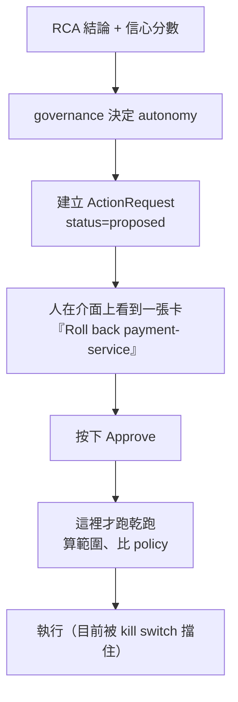

> 一句「建議回滾」
> 跟一句「回滾會換掉 demo 這兩個 pod，回到 revision 24」
> 差的不是禮貌，是對方能不能決定

前面幾天都在處理「agent 講的話可不可信」。今天換一邊：假設它講對了，接下來那句「你可以做什麼」要長什麼樣子，人才有辦法在凌晨三點按下去。

這條線的終點在這系列裡是明確劃線的：**只做估算跟建議，不做自主執行。** 「能不能讓它自己動手」是下一個系列的題目。

今天的主角是 `blast_radius.py`，動手之前 218 行，一個從頭到尾沒有 import 任何寫入 API 的模組。

程式碼在範例 repo [`OTel_AIOps_Agent`](https://github.com/tedmax100/OTel_AIOps_Agent) 的 [`ironman-2026/day24/`](https://github.com/tedmax100/OTel_AIOps_Agent/tree/main/ironman-2026/day24)。

## 先看它算出什麼

`乾跑`（dry-run）做的事很單純：讀現在的 Deployment 跟 ReplicaSet，推算「如果真的做下去，會換掉幾個 pod、從哪一版到哪一版、有沒有跨 namespace」。八個提案跑一輪：

```console
roll back the suspect deploy
  footprint: target demo/payment-service, revision 25→24, replicas 2→2, affected 2 pod(s)
  policy   : ALLOW — within policy (affected 2 pod(s), ns demo)

roll back a single-replica service
  footprint: target demo/user-service, revision 3→2, replicas 1→1, affected 1 pod(s), singleton
  policy   : REFUSE — target is a singleton (single replica) — denied by policy

roll back something that isn't there
  footprint: dry-run unavailable: no Deployment named 'typo-service' in demo
  policy   : REFUSE — dry-run unavailable (…); fail-closed

roll back in kube-system
  footprint: target kube-system/coredns, revision 1→None, replicas 1→1, affected 1 pod(s), singleton
  policy   : REFUSE — namespace kube-system is protected

scale 2 -> 4     ALLOW — within policy (affected 2 pod(s), ns demo)
scale 2 -> 60    REFUSE — affected pods 58 exceeds max 5
scale to zero    REFUSE — scaling to zero takes the service fully down
```

注意每一列都有兩層：**上面那行是事實，下面那行是判斷。** 事實不帶立場（會換掉兩個 pod），判斷才吃 policy（兩個在允許範圍內）。這個分法很重要，因為 policy 是可以按團隊調的，而事實不行。

三個「拒絕」的原因也不同性質。`typo-service` 那個是**讀不到叢集**，policy 直接 fail-closed（算不出範圍就一律拒絕，而不是當成沒問題放行），因為在看不見的情況下動手正是這道門要防的事。`kube-system` 那個是黑名單擋的，跟數字無關。`scale 2 -> 60` 那個則純粹是量的問題：58 個 pod 會被換掉，超過設定的上限 5。

## 它真的沒有動任何東西

模組開頭那句「never mutates」我不想只是相信它，所以第二段直接量：連跑六次乾跑（三次 undo、三次 scale to 60），前後比對 Deployment 的 `generation` 跟 `resourceVersion`。

```console
  before: replicas=2 generation=28 resourceVersion=606260
  after : replicas=2 generation=28 resourceVersion=606260
  6 dry-runs later, the object is unchanged
```

`resourceVersion` 這個欄位很適合當證據，因為它只要物件被寫過就會變，連 no-op 的 patch 都會。

> 這種驗證看起來很多餘，畢竟程式碼裡就是沒有寫入 API。但唯讀是一個承諾，而承諾要有辦法被檢查。哪天有人手滑在乾跑裡加了一個 `patch`，這條斷言會比 code review 早一步發現。

## 一個拒絕理由，把人推去撞另一道牆

跑到 `scale to zero` 那列的時候我看到這個：

```
scale to zero
  footprint: …, replicas 2→0, affected 2 pod(s), singleton, scales to zero — takes the service fully down
  policy   : REFUSE — target is a singleton (single replica) — denied by policy
```

footprint 那行講對了（歸零會讓服務完全停掉），但 policy 的拒絕理由是「這是 singleton」。原因是 `singleton` 的定義寫成「目標副本數 ≤ 1」，而 0 也滿足。

這句話沒有說謊，但它會把人帶去錯的地方：**看到「不准對 singleton 動手」，很自然會想「那我改成 1 總行了吧」**，然後撞上另一次拒絕，理由才是真的 singleton。治理那一段講過的判準在這裡完全適用，一道門擋下來之後，訊息要能讓對方自己走出去，不然平台團隊就得親自去解釋每一次拒絕。

修法是把歸零排在 singleton 前面，給它自己的理由：

```
scale to zero   REFUSE — scaling to zero takes the service fully down
```

## 真正的斷點不在這裡

乾跑本身跑得好好的。問題是它在整條鏈的哪一段被呼叫。

把「診斷 → 建議」整條線接起來跑一次真的 RCA（root cause analysis，根因分析），同一個事故，只有 alertname 的拼法不同：

```console
as the alert rule names it: alertname='PaymentDeclineRateHigh'
runbook matched: None
decisions      : 0
action requests: 0

as the runbook declares it: alertname='payment-decline-rate-high'
runbook matched: payment-bad-deploy
decisions      : 1
  - k8s.rollout_undo → propose (high confidence but action is approval-gated)
action requests: 1
  - k8s.rollout_undo status=proposed args={'deployment': 'payment-service', 'namespace': 'demo'}
    footprint at proposal time: None
```

兩件事同時掉出來。

**第一，`PaymentDeclineRateHigh` 比不到 runbook，而且沒有人講話。** Day21 那次跑出來 runbook 是 `None`，當時我寫「告警名字是隨手編的所以比對不到」就跳過了。今天把兩種拼法並排才看清楚代價：比不到 runbook，就沒有自動診斷、沒有 remediation、沒有 action request，agent 最後只會給你一段分析然後閉嘴。整條「下一步建議」是被一次字串比對關掉的，而它安靜得像本來就沒有建議可給。

真實環境更容易踩到，因為 alert rule 的名字歸 SRE 或產品團隊管，runbook 的 trigger 歸平台團隊管，兩邊各自寫、各自覺得自己的寫法很自然。

所以今天加了正規化的 fallback 比對：把大小寫、底線、連字號都拿掉之後再比一次。但**比中了要吵**：

```
runbook payment-bad-deploy matched alertname 'PaymentDeclineRateHigh' only after
normalization (trigger says 'payment-decline-rate-high') — align the alert rule
or the runbook trigger
```

還有一種更討厭的情況：名字對上了、trigger 的 label 對不上（runbook 寫 `service_name: payment-service`，告警來的是 `order-service`）。這種以前也是安靜地回 `None`，現在會留一行說「有一本同名的 runbook，但它的 trigger label 跟這個告警對不起來」。

**能自己修好，靠的不是把門開大，是讓門知道自己剛剛擋了誰。**

## 第二，範圍是在人同意之後才算的

上面那行 `footprint at proposal time: None` 才是今天真正的收穫。

原本的流程是這樣：



也就是說，**人做決定的時候，手上只有動作的名字；範圍是在他點頭之後才算出來的。** 而 `_check_blast_radius` 是有可能直接 abort 的，那個 abort 發生在使用者已經表達同意之後。

那張卡上寫「Roll back payment-service」，回滾兩個 pod 跟回滾六十個 pod 是同一句話。要判斷它的人，剛好是唯一沒有拿到數字的人。

改法很直接：提案的當下就跑一次乾跑，把範圍跟 policy 判決一起存進 ActionRequest。

```python
async def _proposal_footprint(action: str, args: dict) -> dict | None:
    """The read-only dry-run for a proposal, at the moment it is proposed.

    "Next step" is only a suggestion if it comes with its size. Rolling back two
    pods in one namespace and rolling back sixty are the same sentence and a very
    different decision, and the on-call is the one who has to tell them apart.
    """
```

現在同一次 RCA 產出的提案長這樣：

```console
action requests: 1
  - k8s.rollout_undo status=proposed args={'deployment': 'payment-service', 'namespace': 'demo'}
    footprint at proposal time: {'target': 'demo/payment-service', 'current_revision': '25',
      'target_revision': '24', 'current_replicas': 2, 'target_replicas': 2, 'affected_pods': 2,
      'singleton': False, 'cross_namespace': False, 'in_protected_namespace': False,
      'available': True, 'policy_ok': True,
      'policy_reason': 'within policy (affected 2 pod(s), ns demo)'}
```

執行前那次乾跑沒有拿掉，兩次都要跑。它們的職責不一樣：**提案那次是給人看的，執行那次是防 TOCTOU 的**（time-of-check to time-of-use，檢查完到真的動手之間，狀態已經變了）。從人看到卡片到他按下同意，中間可能過了十分鐘，叢集會在這十分鐘裡繼續動。所以提案時的數字是「我建議的時候長這樣」，執行時的數字才是「真的要動之前長這樣」，兩個都需要。

## 對值班的人來說差在哪

我自己被半夜的 approve 按鈕嚇過。當下那種心情是：這個東西看起來很合理、時間又緊、系統說它有八成把握，那就按吧。事後回想，我根本不知道按下去會發生什麼，只知道它叫「回滾」。

現在那張卡至少會寫：換掉兩個 pod、從 revision 25 回到 24、不跨 namespace、在 policy 範圍內。這四件事沒有一件是判斷，全部是現在就查得到的事實。**agent 負責把事實擺齊，決定還是人做的**，這也是這系列對「下一步建議」能做到的極限。

反過來說，如果那張卡上寫的是「影響 58 個 pod」，你按下去之前大概會先問一句「等一下，為什麼是 58」。那句「等一下」就是這天所有工作的目的。

## 今天沒做的事

- **卡片上還沒有把範圍畫出來。** 資料已經存進 ActionRequest 了，但 Grafana plugin 那一側還是只渲染動作名字，這一段是前端的工，今天沒動。
- **只有兩種動作有乾跑。** `k8s.rollout_undo` 跟 `k8s.scale`，各有一支估算函式。restart、delete pod、改 HPA 這些都還沒有，而沒有乾跑的動作會直接跳過這道門（`_check_blast_radius` 回 `True`）。
- **affected pods 是唯一的量尺。** 這條線量的是「幾個 pod 會被換掉」，量不到「這個服務在哪條使用者旅程上」。第二階段的拓撲裡其實有 tier 跟 journey，但這道門沒有讀它。
- **正規化比對可能會擋住真的不同的告警。** 兩個名字只差一個底線但其實是兩回事的情況，現在會被比在一起，只留一行 warning。要更嚴謹得讓 runbook 自己宣告它接受哪些別名。

## 小結

總結來說，今天最花時間的不是把乾跑寫好，它本來就在，而且該擋的都擋得住。花時間的是發現它被放在流程裡的位置不對：範圍是在人點頭之後才算的，等於把唯一需要這個數字的人排除在外。另外一個 alertname 的拼法差異，讓整條「診斷 → 建議」在 demo 上其實從來沒有真的跑通過，而我在 Day21 看到 `runbook: None` 的時候，還以為那只是我的告警名字亂取。

> 「這個機制有沒有在跑」跟「這個機制放在對的位置」是兩個問題。
> 我這幾天連續在第二個問題上跌倒 XD
