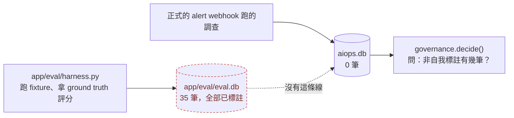
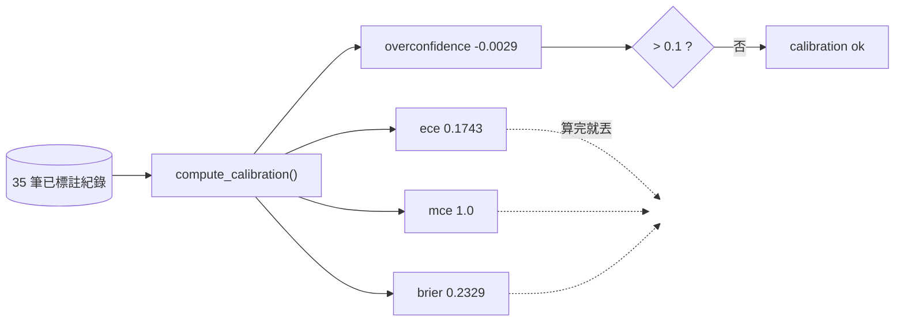
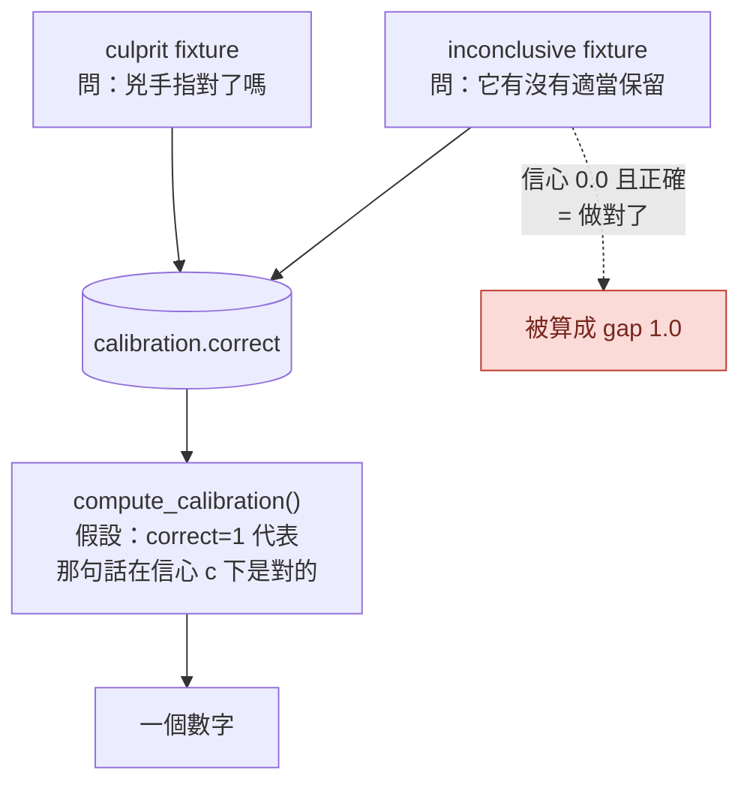

# Day31：整體過度自信 -0.0029，而它是 -0.28 跟 +0.205 加起來的

> 治理平面問的是一個是非題
> 這隻 agent 的信心可不可信
> 而它讀的是一個平均數
> 平均數最擅長的事情就是把兩種相反的錯誤變成沒有錯誤

昨天量到的那行是 `non-self=0`，結論是這隻 agent 沒有任何外部標註，所以自主權在校準那一格永遠解不開。今天原本的計畫是去產出那批標註、把數字推過 20，然後畫出第一張校準曲線。實際做下來，兩件事都跟我想的不一樣：資料早就存在，而畫出來的曲線說那個綠燈不該亮。

程式碼在範例 repo [`OTel_AIOps_Agent`](https://github.com/tedmax100/OTel_AIOps_Agent) 的 [`ironman-2026/day31/`](https://github.com/tedmax100/OTel_AIOps_Agent/tree/main/ironman-2026/day31)。

## 標註要從哪裡來

先講為什麼這件事卡住。`label_run()` 這個函式在這個 repo 裡有三個呼叫點：`main.py` 的一個 HTTP endpoint（人在 plugin 上按對／錯）、`calibration.py` 的 CLI（一次標一筆）、還有 `execution.py` 的自我驗證（agent 執行完之後自己回頭查一下）。

第三個那條路產出來的標註，來源會寫成 `remediation-verified` 或 `remediation-failed`，而昨天量過了，那兩個字串正好是 `_SELF_LABEL_SOURCES` 排除掉的東西。前兩條路是人工的，一次一筆，要湊 20 筆得有人坐在那裡按 20 次。

所以我需要一個批次的、而且判斷來源不是 agent 自己的入口。這在 o11y-bench 那邊是現成的：整個 benchmark 的重點就是拿事先寫好的 ground truth 去評一次 RCA（Root Cause Analysis，根因分析）對不對。我打算把它接成第四個入口。

然後我打開 `app/eval/harness.py`，看到它的 docstring 這樣寫：

```
Grading reuses `calibration.grade_against_truth` (service + optional version
match) so the harness stays decoupled from how correctness is judged. Each run is
also inserted+labeled into the calibration store, so a harness pass produces the
dense, unbiased CE data that production alone never gathers.
```

第四個入口早就存在了，而且是我自己在 eval 那幾天寫的。那為什麼昨天量出來是 0？答案在同一支檔案往下二十行：

```python
DEFAULT_STORE = _HERE / "eval.db"  # separate from prod aiops.db unless overridden
```

eval harness 每跑一次 fixture，就把那一輪的信心值插進去、再用 ground truth 標上對錯，全部寫進 `app/eval/eval.db`。而 `governance.decide()` 去問標註數的時候走的是 `store.cal_count_by_source()`，那個函式沒指定 path 就吃 `settings.store_path`，預設值是 `aiops.db`。兩個檔案，沒有任何一條路把它們接起來：



打開來看，eval 那邊有 35 筆，全部都有標註：

```
by source/correct:
  {'source': 'eval-harness', 'correct': 0, 'n': 15}
  {'source': 'eval-harness', 'correct': 1, 'n': 20}
```

**這個分開存是對的，不是 bug。** eval 跑的是合成的事故、用的是 fixture 裡寫死的答案，如果它們默默混進正式的歷史紀錄，那「這隻 agent 過去表現如何」這句話就被污染了。我當初那行註解寫得很清楚，也寫了 `unless overridden`。問題是那個 override 從來沒有人做，而橋不存在這件事在任何地方都不會亮紅燈。

> 這個形狀在 Series 1 出現過好幾次了，只是那時候的主角是 label 名字不一致。今天換成兩個資料庫檔案，本質沒變：兩邊各自都正常，直到有一個東西需要同時讀懂兩邊。

## 橋要怎麼搭才不算作弊

接下來的問題比寫程式難：那 35 筆到底該不該算數。讓治理平面直接去讀 `eval.db` 最省事，但等於把合成事故的成績直接當成營運歷史；把紀錄複製過去、順手把來源洗成 `manual` 之類的，這個我連想都不該想。我做的是第三種：複製過去，**但把 `source` 原封不動留著**，讓那 35 列在資料庫裡永遠標著 `eval-harness`，誰去查都看得出來這批是哪裡來的。

```bash
# 從範例 repo 的根目錄跑
python3 ironman-2026/day31/promote_labels.py           # 先看會搬什麼
python3 ironman-2026/day31/promote_labels.py --apply
```

幾個刻意的設計：只搬已經有標註的（`correct IS NOT NULL`）、`source` 保留、同一個 `run_id` 已經在目標裡就跳過（可以重複跑）、預設是乾跑，`--apply` 是唯一會寫東西的參數。最後一項是這系列一路的預設值：會改變狀態的東西不要是預設行為。

```
source .../app/eval/eval.db
  35 labeled record(s) with source='eval-harness'
  0 already present in the target, 35 to promote

before
  target     labeled=0   non-self=0   overconfidence=None
  k8s.rollout_undo   -> propose  calibration unproven (0 labeled run(s) < 20); autonomy withheld

promoted 35 record(s)

after
  target     labeled=35  non-self=35  overconfidence=-0.0029
  k8s.rollout_undo   -> propose  calibration ok (overconfidence -0.0029, 35 runs)
```

`calibration unproven` 變成 `calibration ok`，兩道校準門都開了。而再跑一次昨天那支探測，**判斷結果一模一樣，還是 PROPOSE**，因為擋在前面的是 `requires_approval`，校準那格根本不是決定去向的那一格。今天做的事情把三道鎖裡的第二道打開了，門一樣不會動。

我覺得這個結果比「終於變成 AUTO」有用得多。如果昨天沒有先去量那個順序，今天我會在這裡卡很久，反覆檢查標註是不是沒寫進去、`source` 是不是打錯，因為畫面上的結論一個字都沒變。

## 那 35 筆到底有多少資訊量

這一段要先講清楚，因為數字很容易讓人放心。門檻寫的是 20 筆，我搬過去 35 筆，看起來很寬裕。但那 35 筆長這樣：

| fixture | 跑了幾次 |
| --- | --- |
| `payment-decline-service` | 15 |
| `order-service-discover-before-query` | 10 |
| `user-service-no-incident` | 10 |

三個 fixture，兩個日子跑出來的。這隻 agent 累積的「外部判斷」是三個場景各跑十幾次，而不是三十五個不同的事故。它證明的是在這三題上的穩定度，跟「它面對沒看過的事故有多可靠」是兩件事。那個門檻設定叫 `governance_min_human_labeled_runs`，單位是 run，因為 `run` 是這個系統裡唯一數得出來的東西，但真正該問的是`獨立事故數`（白話講就是「你考過幾種題型」，不是「你同一題寫了幾遍」）。這兩個數字在這裡差了一個數量級。

還有一件事設定的名字會誤導人。`eval-harness` 之所以算「非自我標註」，是因為 `_SELF_LABEL_SOURCES` 是一份黑名單而不是白名單。harness 的判斷是拿 fixture 裡寫死的 truth 去比對，確實不是 agent 自己說了算，所以它通過 ARE（Agentic Reliability Engineering，代理式可靠性工程）§6.2 那條約束的字面要求。但錯誤訊息裡那句 `insufficient human/grader labels` 有個 `human`，而這 35 筆沒有任何一筆是人看過的。

> 我沒有把 `eval-harness` 加進黑名單，也沒有改那句訊息。改了就等於今天什麼都沒推進，而它現在是不是該算數，我覺得是可以爭論的。爭論本身寫下來比我單方面決定有用。

## 那個關卡到底讀了什麼

標註進去了，`compute_calibration()` 第一次有東西可算。它一次給四個數字：

- `ECE`（Expected Calibration Error，期望校準誤差）：把紀錄按信心值分箱，每一箱算「說的」跟「做到的」差多少，再按箱子大小加權平均。**差距取絕對值**，所以不會抵銷。
- `MCE`（Maximum Calibration Error）：所有箱子裡最糟的那一箱。
- `Brier score`：每一筆的 `(信心 − 對錯)²` 平均，愈低愈好。
- `overconfidence`：整體平均信心減掉整體正確率。這個沒有取絕對值，正的代表話說太滿，負的代表低估自己。

而 `_calibration_verdict()` 只讀最後那一個：

```python
overconf = calib.get("overconfidence")
if overconf > settings.governance_max_overconfidence:
    return False, f"overconfident by {overconf:+} > ..."
```

前面三個算完就丟掉。這個選擇有它的道理，`overconfidence` 是唯一一個帶方向的，而治理真正怕的是話說太滿那一側；但它同時也是唯一一個**會抵銷**的。跑一次腳本就看得到差別：

```bash
python3 ironman-2026/day31/calibration_report.py
```

```
[1] the aggregate over every row, which is what the gate used to read
  labeled=35  overconfidence=-0.0029  tolerance=0.1
  ece=0.1743  mce=1.0  brier=0.2329
```

同一批資料，`overconfidence` 是 `-0.0029`，容忍值是 0.1，過得非常輕鬆，剛剛那句 `calibration ok` 就是這樣來的。而 `ECE` 是 `0.1743`，如果關卡讀的是這個數字、門檻一樣是 0.1，它會直接被擋下來。同一批紀錄，換一個統計量就換一個結論。



## 第一張可靠度圖

把分箱印出來，`-0.0029` 是怎麼來的就很清楚了：

```
[2] the reliability diagram behind that one number
  band        n    stated  actual  gap
  [0.0,0.1)  2    0.0     1.0     1.0    ->
  [0.1,0.2)  4    0.1     0.0     0.1    <-
  [0.3,0.4)  2    0.3     0.0     0.3    <-
  [0.6,0.7)  12   0.6     0.5833  0.0167
  [0.7,0.8)  6    0.7     0.8333  0.1333 ->
  [0.8,0.9)  6    0.8     0.5     0.3    <-
  [0.9,1.0)  3    0.9     1.0     0.1    ->
  (<- stated above actual = overconfident;  -> stated below actual = underconfident)
```

箭頭是我加的，`<-` 是話說太滿、`->` 是低估自己。七個箱子裡兩種方向交錯出現，加起來就互相吃掉了。

有一箱要特別看：`[0.8,0.9)`，6 筆，說 0.8、實際只對一半。0.8 剛好是 `governance_conf_high`，也就是走到 AUTO 那條路的門檻。**這隻 agent 最不可信的信心區間，正好就是決定要不要放手的那一格。**

至於 `MCE` 是 1.0，來自最上面那一箱：信心 0.0、正確率 1.0。它說「我不知道」，然後被判定為對。這在校準的數學裡是最大可能誤差，但直覺上它一點都不危險。這個矛盾就是今天真正的題目。

> 值班的人在意的從來不是 ECE 那個數字，是「它跟我說 0.8 的時候我該不該相信」。分箱表回答得了這個問題，一個總分回答不了。

## 三個場景，三種完全不同的行為

再往下切一層，按 fixture 分開看：

```
[3] the same rows, per fixture
  payment-decline-service (culprit)      n=15  conf=0.72   acc=1.0    overconf=-0.28    ece=0.28
  user-service-no-incident (inconclusive) n=10  conf=0.34   acc=0.3    overconf=+0.04    ece=0.44
  order-service-discover-before-query (inconclusive) n=10  conf=0.57   acc=0.2   overconf=+0.37  ece=0.37
```

三行三種故事。`payment-decline-service` 15 跑 15 中，全對，而信心平均只有 0.72，這是低估自己，過度自信是 `-0.28`：這一題它其實會做，只是不敢講。`order-service-discover-before-query` 10 跑 2 中，正確率 0.2，信心平均 0.57，過度自信 `+0.37`，遠遠超過容忍值，這才是危險的那一個。`user-service-no-incident` 的過度自信只有 `+0.04`，看起來是三個裡面最健康的，但它的正確率是 0.3，這一格等一下要單獨講。

把 `-0.28` 跟 `+0.37` 混在一起平均，就會得到接近零的東西。那個 `-0.0029` 不是「校準得很好」，是兩個相反方向的毛病剛好一樣大。

## 兩種 `correct`，不是同一種對

這是今天最該記住的一段，而且它不是統計問題，是語意問題。

eval 的 fixture 有兩種評分模式。`culprit` 模式問的是「它有沒有指對兇手」；`inconclusive` 模式是給沒有真的出事的告警用的，問的是「它有沒有適當地保留」，判定條件寫在 fixture 裡：

```yaml
expect: inconclusive
max_confidence: 0.6        # correct iff the agent hedges at/below this
forbid_services:
  - payment-service
  - order-service
```

兩種模式的結果，寫進的是資料庫裡**同一個 `correct` 欄位**。而 `compute_calibration()` 的數學假設只有一種：`correct=1` 代表「它用信心 c 講的那句話是對的」，所以信心愈高、正確率也愈高才叫校準良好。

放到 `inconclusive` 那邊，這個假設整個反過來。一筆信心 0.0、`correct=1` 的紀錄，意思是「它正確地拒絕亂猜」，那是我們希望看到的行為；但校準的數學讀到的是「它只給了 0.0 卻答對了」，算出 gap = 1.0。這隻 agent 做對了事情，然後在校準表上被記了一筆最大誤差。前面那個 MCE 1.0 就是這樣來的。



這個形狀在 Day2 講過，只是那時候的例子是 `status` 欄位多了一個 `retrying`：欄位名稱沒變，值域的意義變了，而所有讀它的東西都不知道。今天輪到我自己寫的 `correct` 欄位。

拆開來算，數字會變成這樣：

```
[4] split by grading mode
  culprit ('blame was right')            n=15  conf=0.72   acc=1.0    overconf=-0.28    ece=0.28
  inconclusive ('it hedged')             n=20  conf=0.455  acc=0.25   overconf=+0.205   ece=0.405

  culprit only (what the gate does now)  -> propose  calibration unproven (15 labeled run(s) < 20); autonomy withheld
```

只算「指對兇手」那 15 筆，關卡的回答是標註不夠、自主權保留。而前面那個 `calibration ok`，靠的正是把 20 筆量著另一件事的紀錄一起算進去，才湊出 35 筆跟那個接近零的平均數。這兩個回答的差別不是統計上的細節，是它們根本在回答不同的問題。

前面說那 35 筆只有三個 fixture、資訊量比數字看起來少。這句話還要再收緊一次：三個 fixture 裡，只有一個在量校準曲線假設的那件事，而它只有 15 筆。

不過我不覺得那 20 筆沒有價值，反而它們量到的東西比另外 15 筆更接近 Day1 的原始問題。`order-service-discover-before-query` 這個 fixture 的註解寫著它就是為了那次失敗寫的：agent 用寫死的 schema 去查 log、拿到三次空結果、然後還是報了一個數字。10 跑 2 中的意思是，這個毛病現在還在，只是它現在會在信心 0.6 左右犯，而不是 1.0。`user-service-no-incident` 那 10 筆更值得看，它的過度自信在三個 fixture 裡最漂亮，但十次裡有七次它沒有適當保留，其中一次還用 0.8 的信心去指認一個沒有出事的服務的鄰居。**一個看起來校準良好的數字，底下是一個十次有七次亂指的行為。**

Day26 那次我抱怨過它在推論裡自己寫「沒有找到反證」卻給 1.0。今天有了 35 筆之後可以講得更精確一點：在它真的會的那一題上，它其實低估自己（0.72 對上 1.0 的正確率）；在它不會的那兩題上，它高估自己。它不是普遍地太有自信，它是分不出自己會不會。這兩件事需要的處理完全不同，而只看一個總分的話，兩者都看不到。

## 寫完之後補的：讓那個欄位自己說它在回答什麼

上面那段本來停在「不知道 `inconclusive` 那批該怎麼算」。寫完之後我還是把它做掉了，因為 `inv_query_similar()` 那句 SQL 讓我有點不安：

```sql
SELECT i.payload FROM investigations i
JOIN calibration c ON c.run_id = i.fp
WHERE ... AND c.correct = 1
```

過去事故庫撈的是 `correct = 1`。照現在的標法，「在一個沒出事的告警上正確地保留」會被當成一次**成功解決的過去事故**撈出來餵給 agent。目前還沒發作，因為 eval 那批沒有寫進 `investigations` 表，但接下來要做的實驗正是要讓那張表有東西。

做的事情很小，一個欄位：calibration 表加上 `grading_mode`，記下這一列的 `correct` 到底在回答哪個問題。誰知道就誰填，harness 從 fixture 的 `expect` 拿、plugin 上人按對錯的那條路填 `culprit`，其他一律留 NULL。然後 `compute_calibration()` 多一個 `modes` 參數，`governance_calibration_modes` 預設 `["culprit"]`，NULL 不算數（不知道就不算，跟這系列一路的預設一樣）。

`inconclusive` 那 20 筆沒有被丟掉，它們改用一個不套校準數學的數字來報：

```
[5] the inconclusive rows, reported as what they actually measure
  hedged appropriately on 5/20 non-incidents (rate 0.25), mean stated confidence 0.455
```

20 次裡有 5 次適當保留。這個數字比 `+0.205` 那個假的過度自信誠實得多，而且它就是 Day1 那個問題的直接度量。改完之後關卡的回答是：

```
culprit only (what the gate does now)  -> propose  calibration unproven (15 labeled run(s) < 20); autonomy withheld
```

**綠燈變回紅燈，而且是「還沒量夠」那一種紅燈。** 今天上半段開的那道鎖，下半段又鎖回去了，理由是它本來就不該開。這兩句紅燈的差別值得記一下：`calibration unproven` 是還沒開始量，補標註就會變；`overconfident by +X` 是量完了而結論是不該信。它們在程式碼裡是兩個不同的回傳值，這個設計是對的。

真正沒有被分開的是綠燈那一側。`calibration ok` 這句話可能代表信心真的可信，也可能代表兩種相反的毛病剛好抵銷，而這兩件事在畫面上、在資料庫裡、在那句 `calibration_note` 裡長得一模一樣。

## 誰有資格決定哪些紀錄算數

平台工程的角度今天落在兩個很小的地方，而它們是同一個問題的兩端。

一端是那條橋的維護成本。我做的是一次性的複製，而 eval harness 以後每跑一次還是會寫進 `eval.db`，也就是說這兩個數字從今天起就開始分岔，要它們對得上得有人記得再跑一次 `promote_labels.py`。一個要靠人記得的步驟，就是一個遲早會被忘記的步驟，而它被忘記的時候，症狀是治理平面用一份過時的校準紀錄在做授權判斷，畫面上沒有任何東西會說「這份紀錄停在兩個月前」。

另一端是 `compute_calibration()` 吃的是 `load_records()` 的全部，除了今天補的 `modes` 之外沒有任何過濾參數。要算什麼、不算什麼，這個決定其實有好幾個維度：

- 評分模式：今天講的那個，`culprit` 跟 `inconclusive` 不是同一種對
- 新鮮度：三個月前的紀錄還算數嗎
- fixture 的多樣性：同一題跑十次，算十筆還是一筆
- 來源：`eval-harness` 到底該不該算「非自我」

四個問題裡我今天只回答了第一個，其餘三個現在的答案都是「全部算」，因為沒有人被問過。

這是那種「不做決定也是一種決定」的地方，而它的代價要等到有人真的想放手的那天才會出現。到那天，做決定的人會發現他手上唯一的旋鈕是 `governance_max_overconfidence` 那個數字，而調它並不能解決上面任何一個問題。順帶一提，這也是「產品團隊要付多少成本」的一個例子：如果哪天有第二隻 agent、或別的團隊接進來，他們要做的第一件事不是接 API，是搞懂自己的 eval 結果要寫到哪個檔案才會被算進去，而這件事目前只寫在一行程式碼註解裡。

> 舉個現實案例，這跟只看單元測試涵蓋率的團隊是同一種病。涵蓋率 85% 這個數字本身沒有錯，錯的是拿它回答「這份程式碼可不可靠」，而那個問題它答不了。今天這個 `-0.0029` 就是 AIOps 版本的涵蓋率。

## 今天沒做的事

- **沒有真的跑一輪 o11y-bench 的 grader。** 那需要把整套 stack 起來加 LLM（Large Language Model，大型語言模型）呼叫，今天搬的是六月跟八月已經跑出來的紀錄，所以這批標註的新鮮度是既定的。
- **沒有做自動同步。** 一次性的腳本，要靠人記得再跑。
- **關卡還是只讀 `overconfidence`，沒有改讀 ECE。** 這是另一個獨立的決定，跟 `grading_mode` 一起改的話，數字動了會分不出是哪一個造成的。
- **沒有補 fixture。** 唯一在量校準的那個 fixture 只有 15 筆，離門檻還差 5 筆，而補的方式不該是把同一題再跑五次。
- **`_SELF_LABEL_SOURCES` 跟那句 `human/grader` 的訊息都沒改。** 上面那段 blockquote 講了為什麼。
- **沒有畫圖。** 上面那張分箱表是純文字的，做成真的可靠度圖是 plugin 那邊的事。
- **信心是怎麼產生的完全沒碰。** 今天只量它準不準，沒有動 playbook 裡那段要求 agent 自評的規則。

## 小結

總結來說，今天實際做的事情跟計畫差很多：要產出的資料早就存在，缺的是一條沒有人接過的路；接上去之後關卡從紅變綠，而拆開那個綠燈之後它又變回紅的。中間繞了一圈，換到的東西是一張分箱表，而它比原本那個總分有用得多：這隻 agent 在它真的會的題目上低估自己、在不會的題目上高估自己，兩件事在一個平均數裡剛好抵銷成一個很好看的數字。

比較實際的收穫是，它讓「要不要放手」這個問題有了一個可以討論的具體對象。在 0.8 那一格它只對一半，而 0.8 正好是自主權的門檻，這句話比「校準良好」具體得多，也比較容易讓一個團隊在會議上真的做出決定。至於那個補上去的欄位，它把系統從「綠燈，但理由是假的」換成「紅燈，理由是還沒量夠」，後者比較難看，但它是可以靠做事解決的。

> 我原本以為今天會寫一篇「數字不好看，所以還不能放手」的文章。
> 結果數字好看得要命，難寫的變成怎麼解釋它為什麼不算數 XD
