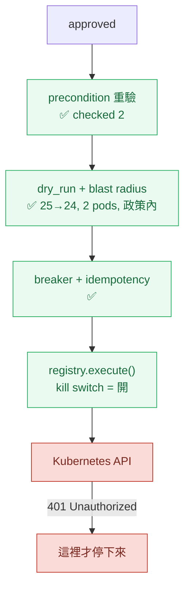
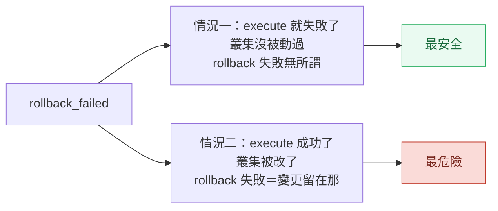
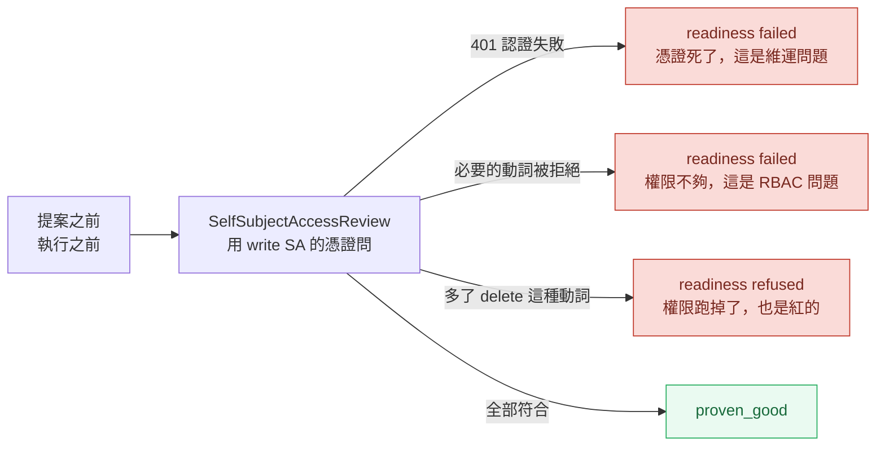
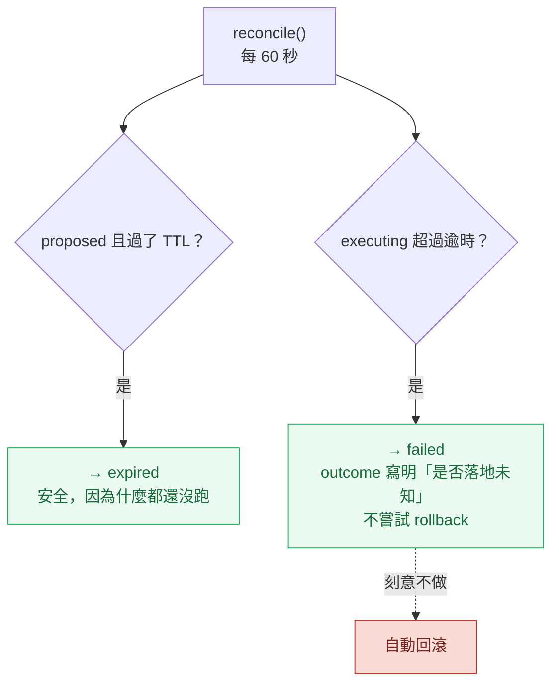

# Day33：我準備了一整天要按的那顆開關，已經開了 46 天

> 我以為今天的重頭戲是把 `actions_enabled` 設成 true
> 結果它一直是 true
> 而擋住真實變更的那個東西
> 不是我蓋的任何一道門

昨天把過去事故庫的接縫修好，那條路要等下一輪真的跑才有東西。今天做的是這八天真正的那件事：**讓它動一次**，然後在同一天把每一道門弄壞給它看。

程式碼在範例 repo [`OTel_AIOps_Agent`](https://github.com/tedmax100/OTel_AIOps_Agent) 的 [`ironman-2026/day33/`](https://github.com/tedmax100/OTel_AIOps_Agent/tree/main/ironman-2026/day33)。今天前半在真實叢集上跑，後半不需要叢集也不需要 LLM。

## 開場就被打臉

我打開叢集裡那份 Deployment，準備把環境變數改掉：

```console
$ kubectl -n demo get deploy aiops-agent -o jsonpath='{range .spec.template.spec.containers[0].env[*]}{.name}={.value}{"\n"}{end}' | grep ACTIONS
ACTIONS_ENABLED=true
```

它是 true。而且旁邊那個 write RBAC 的 token secret 是 46 天前建的，也就是說**這顆開關從 6 月 22 號就開著**，而我這八天一直用「那是一組沒有人按過的開關」在講它。

那 46 天裡它做了什麼？把 pod 裡那份資料庫撈出來看：

```console
== action_requests by status ==
  {'status': 'aborted',  'action': 'k8s.rollout_undo', 'n':  1, 'ts': '2026-06-22T15:12:31Z'}
  {'status': 'proposed', 'action': 'k8s.rollout_undo', 'n': 10,
   'lo': '2026-06-22T15:47:44Z', 'hi': '2026-08-06T14:08:43Z'}

executions: 0
```

十筆提案躺在 `proposed`，最舊的 46 天前，`executions` 表是空的。

先講那十筆。它們的 TTL 是 900 秒，也就是全部早就過期了，而 `list_requests(status="proposed")` 照樣把它們撈出來，plugin 那頁照樣把它們畫成待處理。**Day30 那個「過期是被動的、要有人來敲門才會算」的發現，這裡有 46 天份的真實證據。** 當時我是在暫存 SQLite 上量出來的，今天看到的是它在一個跑了一個半月的環境上長成什麼樣子：一份十筆的待辦清單，每一筆都是舊世界算出來的建議，而畫面上沒有任何東西會說。

## 那一筆 `aborted` 是怎麼來的

剩下那一筆有完整的稽核軌跡，而且它比我預期的有用得多：

```console
2026-06-22T15:12:31Z  proposed       ok     system
2026-06-22T15:15:26Z  approved       ok     nathan-smoke-test
2026-06-22T15:15:26Z  execute        start  system
2026-06-22T15:15:26Z  precondition   ok     system   {"checked": 2}
2026-06-22T15:15:26Z  dry_run        abort  system
      blast_radius: target demo/payment-service, revision 17→16, replicas 1→1,
                    affected 1 pod(s), singleton
      reason: target is a singleton (single replica) — denied by policy
```

**這條管線在它第一次遇到真實輸入的時候就紅了，而且紅得完全正確。** 前置條件重驗過了兩項，乾跑算出影響範圍，然後 `deny_singletons` 這條政策把它擋下來：payment-service 當時只有一個副本，回滾它等於整個服務中斷。

我當時只是隨手做了一次 smoke test 就跑去做別的事，沒有把這條軌跡讀完。今天讀完才發現，這八天我一直在說的「防護網從來沒有紅過」，其實紅過一次，只是我沒去看。

而今天 payment-service 是兩個副本。也就是說，同一條路今天再走一次，那道門不會再擋。

## 今天再跑一次

```console
$ kubectl -n demo get deploy payment-service -o jsonpath='rev={...revision} replicas={.spec.replicas}'
rev=25 replicas=2
```

發一個真的告警進去，等它產出提案，然後按核准：

```console
2026-08-08T08:57:34Z  proposed       ok     system
2026-08-08T09:02:44Z  approved       ok     day33-live
2026-08-08T09:02:44Z  execute        start  system
2026-08-08T09:02:44Z  precondition   ok     system   {"checked": 2}
2026-08-08T09:02:44Z  dry_run        ok     system
      blast_radius: target demo/payment-service, revision 25→24, replicas 2→2,
                    affected 2 pod(s)
      reason: within policy (affected 2 pod(s), ns demo)
2026-08-08T09:02:45Z  execute        fail   system
      error: (401) Reason: Unauthorized
2026-08-08T09:02:45Z  rollback       fail   system
      error: UnauthorizedException: (401) Reason: Unauthorized
```

四道唯讀的門全部放行，影響範圍算得清清楚楚（25→24、兩個 pod、在政策內），然後在真的要動叢集的那一毫秒，**Kubernetes 回了 401**。

自動回滾接著觸發，也是 401。那一列的最終狀態是 `rollback_failed`，而 Deployment 從頭到尾停在 revision 25，什麼都沒發生。

## 擋住它的不是我蓋的任何一道門

追下去，401 的原因是那個 ServiceAccount token：

```console
$ 解開 pod 裡掛的那份 token
iss= kubernetes/serviceaccount
exp= None          ← 沒有到期時間
sub= system:serviceaccount:demo:aiops-agent-write
```

它是一個舊式的、不會過期的 token。既然不會過期，它為什麼會被拒絕？因為那個 k3d 叢集中間被重建過，API server 的簽章金鑰換了，而 Secret 裡那串位元組還是舊叢集發的。**它不是過期，是它效忠的那個政府倒了。**

這件事最刺的地方是：從 6 月 22 號到今天，這個 agent 手上握著一張早就無效的通行證，而**沒有任何一個地方會說**。RBAC 沒有健康檢查，那張 token 也不會自己回報「我簽不出去了」。要不是我今天真的按下去，它可以再躺 46 天。



綠色那幾格是這八天在讀、在改、在寫測試的東西，它們今天全部放行，而且放行得有道理：影響範圍真的在政策內。紅色那格不是我蓋的，也不是任何人為了這個場景選的，它是一張因為叢集重建而失效的憑證。

**我今天沒有讓一個真實變更發生，而讓它沒發生的是一個意外。** 這件事寫出來有點難看，但它正好是這系列一路在講的那句話最極端的版本：一個從來沒有紅過的防護網，跟一個不存在的防護網，證據等級是一樣的。今天我終於讓那張網接到球了，然後發現接住球的是網子後面那面牆。

> 這個形狀我在別的地方看過：一個團隊的權限申請流程走得很嚴謹，結果真正擋住誤操作的是那個一直沒人修好的 VPN。等到 VPN 修好那天，才發現流程從來沒有真的擋過任何東西。

## `rollback_failed` 這個名字有問題

修 token 之前我先盯著那個終局狀態看了一下，愈看愈不安。

今天這一列是 `rollback_failed`，而它的實際意思是「執行沒成功，所以什麼都沒改，然後回滾也沒成功，但那不重要因為沒東西要滾」。這是**最安全的結果**。

而同一個狀態的另一種意思是：「執行成功了，叢集被改了，然後回滾失敗了，所以那個變更現在留在那裡而且沒有人在管」。這是**最糟的結果**。

值班的人早上打開清單，兩者長得一模一樣。



要分辨得去翻稽核軌跡，看那個 `execute` 是 `fail` 還是 `ok`。資訊都在，只是不在人第一眼會看到的那個欄位。今天沒有改它，因為改狀態機的名字要動到 plugin 跟現有的九條測試，我不想在同一天做兩件事。

## 修好 token 之後：換一道門擋

把那個 Secret 刪掉重建（讓 token controller 用現在這座叢集的金鑰重新簽一次），重啟 agent，再發一次一模一樣的告警，再按一次核准：

```console
status= aborted
outcome= idempotent: target already acted on for this incident (48e7df7697ac4034)
```

**冪等那道門把它擋下來了。** `idem_key` 是 `k8s.rollout_undo|demo/payment-service|383238a67e692abb`，動作、目標、事故指紋三個都一樣，所以第二次不准動。這條規則是對的，告警風暴會對同一件事發十次通知，而回滾這種動作不該做十次。

但它同時暴露一件事：第一次那個嘗試**根本沒有成功**，401 擋在最後一毫秒，叢集完全沒被動過。而冪等的紀錄不管這個，它只認「這個 key 被用過了」。所以一次暫時性的失敗會讓這個事故**永遠不能再重試**，而它給的理由是 `already acted on`，跟事實正好相反。

這跟上面 `rollback_failed` 是同一種病：**把「試了但沒發生」跟「發生了」歸成同一類。**

不死心，我改了標籤再發一次：

```console
{"accepted":[],"skipped":[{"fingerprint":"383238a67e692abb","reason":"cooldown"}]}
```

第三道門。webhook 的去重冷卻期是 600 秒，而指紋只由部分標籤算出來，我多加的那個 `run` 標籤根本沒進去。

於是今天的成績是：**四道門，三種不同的拒絕，一次都沒有執行成功。**

## 讓那張憑證變成一個會過期的訊號

手動把 Secret 刪掉重建，這件事修的是這一次。下一次呢？

授權那一關前面本來掛著兩道檢查，問的是**該不該做**（這隻 agent 的信心可不可信）跟**這張地圖是不是真的**（DQ，data quality，資料品質）。今天證明了還缺第三道，而它問的是最基本的那件事：**我們現在還動得了嗎。**

這件事之所以會被漏掉，是因為權限在直覺裡是一個靜態事實：RBAC 設好了就是設好了。但它其實跟這系列處理過的每一種訊號一樣會腐爛，只是腐爛的時候不會有人通知你。拓撲宣告會過期，所以拿真實 trace 去對帳；注入的知識會屬於別座環境，所以拿 live store 去解析。**一張 RBAC 授權也是一份宣告，而沒有對帳的宣告終究會變成謊言。**

憑證這種宣告還有一個更麻煩的性質：它只在被用到的那一瞬間才會被觀測。而這一張大概每幾個禮拜才被用一次，所以它的死亡可以安靜地躺好幾個禮拜。

用來對帳的東西 Kubernetes 本來就有，`SelfSubjectAccessReview`：拿寫入身分去問 API server「我可不可以在 demo 這個 namespace 上 patch deployments」。它不改任何東西，而且它是一個真的、需要認證的呼叫，所以一張死掉的 token 會在授權判斷之前就先撞 401。一次請求同時回答了兩個問題：這個身分還是真的嗎，以及它還被允許做那件事嗎。



兩個設計選擇值得講。

第一，**401 記成 `error` 而不是「被拒絕」**。它們在報表上都是紅的，但一張死掉的 token 跟一個少給的權限是兩種完全不同的工單，去修的也是不同的人。把兩者擠成同一句話，就是這篇前面在罵 `rollback_failed` 的那個毛病。

第二，**多出來的權限也算紅的**。如果哪天這個寫入身分拿到了 `delete`，那不是好消息，那代表 RBAC 漂離了整套爆炸半徑政策當初假設的前提。這條檢查是雙向的：少了不行，多了也不行。

順便修掉一個更小但同一類的東西：那個 write client 是 module 級的快取，第一次建好之後就不再重讀 token 檔。kubelet 輪替綁定 token 是就地覆寫檔案的，所以輪替之後那個 client 會繼續拿舊的字串去打，直到 pod 重啟為止。現在它會比對檔案的 mtime，變了就重建。

## 讓時間也能推動那個狀態機

回到開場那十筆。它們每一筆都早就過了 900 秒的 TTL，而清單照樣把它們畫成待處理，因為 `_expire_if_stale()` 全專案只有 `approve()` 一個呼叫點。沒有人去按，就沒有人去問它過期了沒有。

開關關著的時候這只是一份難看的清單。開關開著之後，同一個形狀有一個更糟的版本：一列被認領到 `executing`、然後那個 process 死掉的請求。executor 只找 `approved`，`approve()` 只找 `proposed`，兩邊都碰不到它，所以它會用「執行中」的身分永遠躺在那裡。而 `executing` 剛好是冪等那道門認定「這個目標已經被動過」的狀態，所以那個事故從此再也不能重試。

補的東西是一支背景調和，六十秒跑一次。而它的設計重點不在做了什麼，在**刻意不做什麼**：



那條虛線是這段唯一重要的規則。一列卡在 `executing` 的請求，我們不知道那個寫入到底有沒有落地，而一支在這種情況下自己去回滾的背景工作，可能把「也許什麼都沒發生」變成「確定發生了某件事」。**調和只能把紀錄改成誠實，不能替人做決定。** 所以逾時的那列一律轉 `failed`，`outcome` 直接寫「executor 沒有回報，變更是否落地未知，沒有嘗試回滾」，然後留給人。

調和做的每一件事都以 `reconciler` 這個 actor 進稽核帳本。一個會在沒有人看著的時候改狀態的東西，如果自己不留下痕跡，那它就是這套系統裡第二個隱形的行為者，而這整套設計的前提就是不要有隱形的行為者。

順手把 Day30 量到的另一個不一致也補了：`reject()` 沒有 TTL 檢查而 `approve()` 有。同樣兩列過期的提案，一列變 `expired` 留下原因，另一列變 `rejected` 而且記上按下去那個人的名字，稽核軌跡上是兩個不同的故事，但事實是同一個。

> 那十筆躺了 46 天的提案，服務起來六十秒之內就自己清乾淨了。看著它們一次消失其實有點空虛，畢竟前面我花了兩天在寫它們為什麼還在 XD

## 後半：把每一道門都弄壞一次

上面那些是被動撞到的。真正該做的是主動去撞，而且要能重複跑。所以寫了一支 `regress_guards.py`，形狀跟 Day12 那支 `regress.sh` 一樣：每一條寫死「餵什麼進去」跟「預期它拒絕，理由要包含哪個字串」，全綠 exit 0，任何一道門放行 exit 1。

```bash
# 從範例 repo 的根目錄跑
python3 ironman-2026/day33/regress_guards.py -v
```

```
governance
  PASS  irreversible action never goes autonomous, even at confidence 1.0
  PASS  confidence below the low threshold escalates
  PASS  an approval-gated action is never AUTO
  PASS  overconfidence 0.25 > 0.1 downgrades AUTO to PROPOSE
        propose: overconfident by +0.25 > 0.1; autonomy narrowed
  PASS  50 self-produced labels do not unlock AUTO
        propose: insufficient human/grader labels (0 < 20); self-produced labels cannot unlock AUTO
  PASS  50 inconclusive-graded labels do not unlock AUTO
        propose: curve saw 0 eligible row(s); calibration unproven (0 labeled run(s) < 20); autonomy withheld
  PASS  labels with no recorded grading mode do not unlock AUTO
  PASS  [control] 50 culprit-graded grader labels DO reach AUTO
calibration curve
  PASS  offsetting errors do not unlock AUTO, even though the mean passes
        propose: mean -0.0182 is inside tolerance; accuracy 0.5 at confidence ≥ 0.8 (n=10) < 0.7;
                 autonomy withheld in the band it would be exercised in
  PASS  labels that never reach the decision band do not unlock AUTO
        propose: only 0 labeled run(s) at confidence ≥ 0.8 (need 3); no evidence in the band
                 where AUTO is granted
  PASS  [control] a thin bin is skipped, said so, and does not block AUTO
        auto: calibration ok (...), 1 bin(s)/1 run(s) too thin to count
actuation readiness
  PASS  a credential that was never checked is not ready
  PASS  a 401 reads as an authentication failure, not as a denied permission
        write credentials did not authenticate against the cluster (ApiException: Unauthorized)
  PASS  a permission checked long enough ago is a permission being assumed
  PASS  a denied required permission is not ready, and names the rule
  PASS  a write credential that gained delete is refused, not congratulated
        write credential holds 1 permission(s) the safety design forbids (delete apps/deployments in demo)
  PASS  a dev kubeconfig cannot prove anything about the deployed identity
  PASS  [control] healthy credentials are proven-good and do reach AUTO
  PASS  a dead credential narrows autonomy before anything is proposed
lifecycle reconciliation
  PASS  a proposal past its TTL expires with nobody knocking
  PASS  [control] a proposal still inside its TTL is left alone
  PASS  an executing row whose executor vanished is written off, not left running
        failed: executor never reported back (process restart?); whether the change landed is unknown
  PASS  and it is NOT rolled back, because whether the write landed is unknown
  PASS  [control] an execution still inside the settle window survives a pass
  PASS  rejecting a lapsed proposal expires it instead of recording a human decision
blast radius
  PASS  an unreadable dry-run fails closed
  PASS  a protected namespace is refused
  PASS  a namespace off the allowlist is refused
  PASS  an action crossing namespaces is refused
  PASS  scale-to-zero is refused, and says so instead of blaming singleton
  PASS  a single-replica target is refused
  PASS  more than 5 affected pods is refused
  PASS  a rollback with no previous revision is refused
  PASS  [control] a 2-pod rollback inside demo is allowed
breaker
  PASS  [control] a fresh breaker allows
  PASS  2 consecutive failures trip the target breaker
  PASS  a tripped breaker stays open on the next check
  PASS  only an explicit human reset closes it again
  PASS  3 executions in 3600s trips the global rate limit

39/39 guards behaved as specified
```

有六條標著 `[control]`，它們是**故意寫成應該放行**的。這件事我覺得比其他三十三條都重要：**一個什麼都拒絕的守門，跟一個什麼都不拒絕的守門，一樣沒用。** 如果我只寫拒絕的案例，那把 `evaluate_policy` 改成 `return False, "no"` 也能讓這份清單全綠。

另外幾條值得單獨講：

「scale-to-zero 被拒絕，而且理由要講對」那條，測的不是它擋不擋，是**它擋下來之後說了什麼**。副本數縮到零的目標同時也是單副本，所以兩條規則都會擋，而如果訊息說的是「因為它是單副本」，值班的人會跑去把副本數設成 1，然後被同一道門用另一個理由再擋一次。程式碼裡把 scale-to-zero 那條排在 singleton 前面就是為了這個。

「熔斷之後只有人能關」那條，測的是它**不會自己好**。連續失敗兩次之後 breaker 打開，再檢查一次還是開的，只有明確呼叫 reset 才會關回去。一個會自己復原的熔斷器在 flapping 的場景下等於沒有。

而「調和不會去回滾」那條，是今天新加的六條裡唯一一條斷言**某件事不該發生**的。它去翻稽核帳本，確認那一列被寫成 `failed` 的請求底下沒有出現任何 `rollback` 事件。這種寫法比較囉唆，但一個背景工作最危險的行為是它多做了一步，而多做的那一步不會讓任何測試變紅，除非有人專門去問。

## 這八天的門，誰在按

平台工程的角度今天很好講，因為證據齊了。

這八天做出來的四道門，今天全部通過測試，也全部在真實輸入上放行了。**它們是對的，而且是必要的，但它們沒有一道是最後那道。** 最後那道是 RBAC，一個 Kubernetes 自己提供的、跟這整套治理設計完全無關的東西。

我覺得這不是壞消息，是分工。應用層的治理負責回答「這件事該不該做、範圍多大、憑什麼相信這隻 agent」，那些問題 RBAC 答不了。而「這個身分現在有沒有權限」是基礎設施的事，那件事應用層也不該自己重做一遍。問題出在中間：**沒有任何一個地方在檢查那張憑證還有沒有效**，於是一個安全機制在無聲失效的狀態下，替一個沒有人打算依賴它的地方擋了 46 天的班。

這條線在這系列出現過太多次了：Day2 那個空陣列、Day31 那段從來沒被評估到的校準邏輯、Day32 那個沒人寫的表。今天是它最貴的一種形狀：**一個沒有人在看的成功狀態**。

而今天補上去的兩支東西，講白了都只是在同一個位置放一個會問問題的人。憑證那支負責問「我還動得了嗎」，而且那個答案有保鮮期：超過 900 秒沒問過就算過期，被當成沒有證據，不是當成沒問題。調和那支每六十秒問一次「有沒有哪一列的狀態已經跟時間對不上了」。兩支都不聰明，也都沒有讓 agent 變強一點點。它們只是把「要靠人記得去看」換成「有東西會定期去看」，而這座系統這八天欠的幾乎每一筆帳，形狀都是前者。

## 今天沒做的事

- **沒有一次真的成功執行。** 三種拒絕都是對的拒絕，但這代表 `execute → verify → settle window → 驗證失敗自動回滾` 這段的後半，今天仍然沒有被真實輸入走過。要走完得等冷卻期過、換一個事故指紋，那是下一次的事。
- **`rollback_failed` 跟 `already acted on` 兩個訊息都沒改。** 它們把「試了但沒發生」跟「發生了」講成同一件事，今天只量出來。
- **提案上的 `blast_radius` 是 null。** 人在按核准的時候，看不到影響範圍，那個數字要等到執行當下才算出來。Day24 那天的整個主張是「建議回滾不是建議，回滾會換掉這兩個 pod 才是」，而它現在沒有走到人眼前。
- **憑證檢查沒有告警。** 它現在會讓治理平面收手、也會擋下執行，但沒有任何東西會在半夜主動說「那張憑證死了」。從紅燈到有人知道，中間還是缺一段。
- **調和的逾時是拍的。** `executing_timeout_seconds` 設成 600 秒，理由只是「比 settle window 加 rollout 久一點」。真正該用的是認領當下的時間戳，而 `action_requests` 沒有那個欄位，所以現在拿 `created_ts` 當下限，這讓那個逾時只能設得很鬆。
- **`regress_guards.py` 那六條新的也沒進 CI。** 跟前面每一支一樣。

## 小結

總結來說，今天原本要證明的是「這顆開關按下去會發生什麼」，實際證明的是三件別的事：那顆開關已經開了 46 天而我不知道；我蓋的四道門在真實輸入上全部放行且放行得有道理；真正擋住變更的是一張因為叢集重建而失效的憑證，而那件事沒有任何地方會說。

後半補的兩支東西都不大。憑證那支是一個 `SelfSubjectAccessReview`，調和那支是一個六十秒的迴圈，兩支加起來沒有讓任何分數變好，也沒有讓那次執行成功。它們換到的是這兩件事以後會自己說話：憑證死掉的時候治理平面會收手，提案過期的時候不用等人來按。

比較有用的還是那 39 條。前半是運氣，一次真實的按下去只能證明「這一次發生了什麼」；後半是可以重複跑的，而且裡面那六條 `[control]` 讓它不會退化成一份「全部拒絕就算過」的清單。這八天講了很多次防護網，今天它終於有一份自己的回歸測試。

> 我花了半小時在想要不要把 401 那段寫進去，因為它讓整篇的高潮變成一個運維事故。
> 後來想想，這系列從第一天開始就是在寫我以為的跟實際量到的差在哪，今天只是差得比較大 XD
> 而那十筆躺了 46 天的提案，補上調和之後六十秒就清光了。前面兩天寫它們為什麼還在，花的時間比修它久得多。
