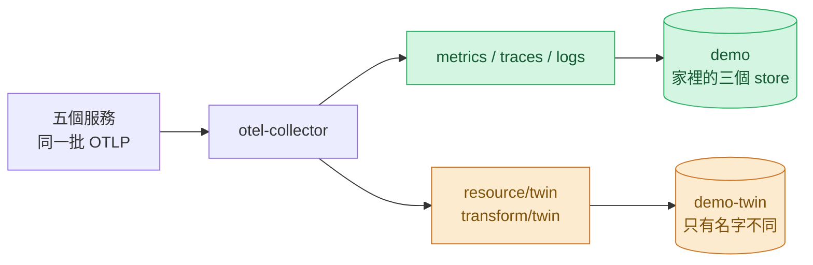
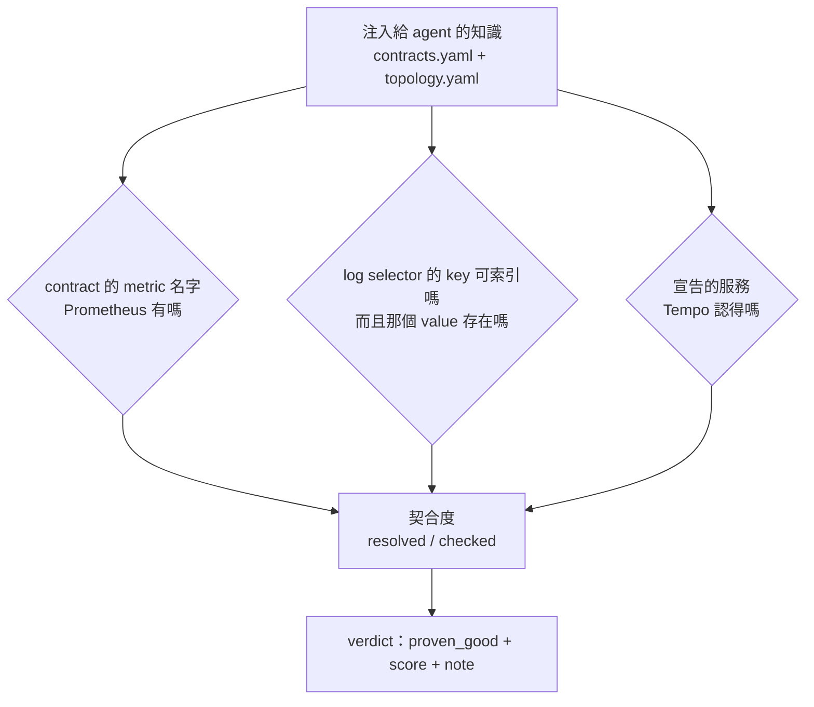

# Day34：同一座叢集，只把名字換掉，自主權就該收回來

> 一份屬於另一座環境的知識
> 跟一份對的知識
> 在 agent 手上長得一模一樣
> 因為錯的那份不會報錯，它只會查回空的

昨天在真實叢集上按下核准，我蓋的四道門全部放行，最後擋住變更的是一張因為叢集重建而失效的憑證。今天回頭補一個更早就欠著的洞。

Series 1 最後一天量到一件事：同一組題目、同一支評分器，帶著錯環境治理資產的 agent 考 3.5 分，完全不帶治理資產考 2.5 分，而為那座環境寫的第一版考 5.5 分。當時的結論是`治理是環境的函數`。這句話從那天到今天，一直只是一句結論：**系統裡沒有任何地方在問「我手上這份知識，屬不屬於我現在指著的這座環境」。**

程式碼在範例 repo [`OTel_AIOps_Agent`](https://github.com/tedmax100/OTel_AIOps_Agent) 的 [`ironman-2026/day34/`](https://github.com/tedmax100/OTel_AIOps_Agent/tree/main/ironman-2026/day34)。叢集那一側的改動在 demo-services 的 `k8s/` 底下。今天不花 LLM（Large Language Model，大型語言模型）呼叫。

## 先承認那句結論的證據是髒的

要補這個洞，我第一個念頭是再蓋一座環境來測。想了一下發現不對，因為原本那個比較本身就是被混淆的：

| | demo-services（k3d） | Day1 那座 stack image |
| --- | --- | --- |
| 指標命名 | OTel semconv 風格，`service_name` | `http_requests_total`、`job` |
| Kubernetes API | 有 | 沒有，k8s 工具全部退化成 unavailable |
| 資料 | 真的服務打出來的 | 生成器烘出來的，形狀不一樣 |

所以「掉了 2 分」裡面，有多少是命名知識錯了、有多少是工具少一半、有多少是資料形狀不同，**當時分不出來，現在也分不出來**。再蓋第三座，這個混淆會照樣跟著搬過去。

要讓那句結論變成可以量的東西，得先把變因收成一個。

## 孿生環境：只准改名字

做法是同一支 collector 多開三條 pipeline，改名之後送到另一套 Prometheus/Loki/Tempo。服務是同一批、流量是同一批、事故是同一個、拓撲是同一張。



改名規則是我編的，模仿一個從來沒導入 semconv（semantic conventions）的團隊：

| | 家裡 | 孿生 |
| --- | --- | --- |
| resource 屬性 | `service.name` | `svc.name`（原本那個被刪掉） |
| metric 名字 | `payment_charges_total` | `acme_payment_charges_count_total` |
| Loki 可索引標籤 | `service_name="payment-service"` | `service_name="unknown_service"` |
| Tempo | `resource.service.name` 有六個值 | 零個值 |

collector 那段長這樣，兩個 processor 加三條 pipeline：

```yaml
processors:
  resource/twin:
    attributes:
      - key: svc.name
        from_attribute: service.name
        action: insert
      - key: service.name
        action: delete
  transform/twin:
    metric_statements:
      - context: metric
        statements:
          - replace_pattern(name, "_total$", "_count")
          - set(name, Concat(["acme", name], "_"))
```

孿生那三個 store 是拿原本那三份 manifest 換 namespace 產生的，我在檔頭寫了重生指令。這件事有點瑣碎但很重要：孿生只要有一個地方是手改的，它就會慢慢長成第二個變因，那今天整個實驗就白做了。

> 這種「只改一個變因」的紀律，我以前只在寫效能測試的時候在意過。這次體會到它在治理實驗上一樣重要：一個講不清楚自己控制了什麼的量測，跟一句感想的份量是一樣的。

## 量什麼：契合度

有了靶子，接下來要決定量什麼。agent 手上那份注入的知識其實很具體：每個服務的 SLI（Service Level Indicator，服務水準指標）該用哪條 metric、權威的 PromQL 怎麼寫、log 的 selector 鍵是哪一個、拓撲上有哪些服務。這些全部都是關於某一座環境的名字，所以問題可以收成三個各自去問一個 store 的問句：



寫的時候先去翻有沒有現成的東西，結果又撞到那個熟悉的形狀：`contract.py` 裡有一支 `validate_against_live()`，docstring 寫著「這份契約引用了哪些不存在於 live metrics 的名字」，也就是上面三格裡的第一格。它有測試、邏輯是對的，而它除了自己那支 dev CLI 之外沒有任何呼叫端。

這是這系列第四次遇到同一件事了：機制寫好了、測試也有、就是沒有人接上去。

## 1.0 對 0.0

把 agent 自己那支模組分別指向兩座環境。兩邊各三個 store，所以要開六個 port-forward，家裡那組用 1 開頭的埠（`19090`／`13100`／`13200`）、孿生用 2 開頭（`29090`／`23100`／`23200`），完整指令在那個資料夾的 `README.md`：

```bash
# 從範例 repo 的根目錄跑
python3 ironman-2026/day34/probe_env_fit.py --env both
```

```
[home] prom=http://localhost:19090 loki=http://localhost:13100 tempo=http://localhost:13200
  metrics   6/6  resolved   fit 1.00
  logs      5/5  resolved   fit 1.00
  traces    5/5  resolved   fit 1.00
  -> {"proven_good": true, "score": 1.0, "note": "injected knowledge resolves here (16/16)"}

[twin] prom=http://localhost:29090 loki=http://localhost:23100 tempo=http://localhost:23200
  metrics   0/6  resolved   fit 0.00
  logs      0/5  resolved   fit 0.00
  traces    0/5  resolved   fit 0.00
      ✗ metric order_create_duration_seconds (order-service)
      ✗ metric orders_total (order-service)
      ✗ (+14 more)
  -> {"proven_good": false, "score": 0.0, "note": "only 0/16 of the injected knowledge resolves
     against these stores (metric order_create_duration_seconds (order-service)); the catalog may
     belong to another environment"}
```

十六項知識，家裡全中，孿生全滅。而這兩座環境的服務、流量、事故、拓撲完全一樣。

跑出來有兩件事是我寫的時候沒想到的，而它們比那個 0.00 有意思。

**孿生那邊的 Prometheus 一樣有 34 個指標名。** 兩邊都是用 `/api/v1/label/__name__/values` 數的，數量一模一樣。所以那個 0.00 不是「這裡沒資料」，是「我背的名字在這裡一個都叫不動」。這個區分在報表上很容易被讀成同一件事，而它們的處置完全不同：前者要去看資料為什麼沒進來，後者要去換一份知識。

**Loki 那格是只檢查 key 會漏掉的那一種。** 我原本以為 `service.name` 被刪掉之後 `service_name` 這個標籤就會消失，實際上 Loki 會自己填一個值：

```console
$ curl ".../loki/api/v1/label/service_name/values?start=…&end=…"
{"status":"success","data":["unknown_service"]}
```

標籤還在、還是可索引的，所以一個只問「這個 key 存在嗎」的檢查會拿到綠燈。要問到對的答案，key 跟 value 都得檢查。這件事我是把兩座環境的回應貼在一起看才發現的，不是設計出來的。

## 接到那道門上

一支印數字的腳本不會改變任何行為，所以這個 verdict 要走到會擋人的地方。新的 `envfit.py` 做三件事：

- 量完之後放進 module 級的快取，不要每次調查都重打那三個 store（跟拓撲對帳那個 drift 用的是同一個模式）
- 收成 `{proven_good, score, note}` 這個形狀，因為那正是治理平面讀 DQ 時認得的介面
- 然後 `dq_verdict()` 把它排在所有 DQ 維度的最前面問

排最前面的理由很直接：如果 catalog 屬於另一座環境，那後面那些維度量的是另一個系統。

保守的方向也講清楚。沒量過、量測過期、某個 store 不回答，這三種都算 `unproven`，而不是算成 fit 0.0。這兩者在治理上是不同的意思：0.0 是「我確定這份知識不屬於這裡」，`unproven` 是「我不知道」。而「打不通就放行」跟「打不通就當它壞掉」，兩個都不是對的答案。

拿一個合成提案（可逆、不需核准、信心 0.95、校準紀錄乾淨）去問真的 `decide()`，只把環境這一維餵給它：

```
[home]  -> gate (environment dimension only): auto     high confidence, reversible,
                                              calibration + data-quality proven-good
[twin]  -> gate (environment dimension only): propose  high confidence but
                                              data-quality (DQ) not proven-good

home fit 1.0 -> auto   vs   twin fit 0.0 -> propose
```

**同一組提案、同一份校準紀錄、同一座叢集的同一批服務，只有名字不同，自主權就從放手變成保留。**

那個合成提案把校準門檻歸零，是為了隔離變因：真實 store 現在只有 7 筆標註，校準那道鎖本來就會先擋下來，那樣就看不出環境這一維有沒有作用了。腳本裡有註解寫明這只是為了做實驗，不是建議正式環境這樣跑。

到這裡，「治理是環境的函數」不再是回顧時的感想，它是一個會改變治理判決的數字。

## 那個差點讓整件事白做的 bug

寫完之後跑 lint，ruff 指著 agent 那支新的 refresh 函式說 `F821 Undefined name 'time'`。

那個函式要比對「上次量到現在多久了」，用了 `time.time()`，而 `agent.py` 從來沒有 `import time`。它會拋 `NameError`，然後被我自己寫的那個 broad `except` 接住，記一行 warning。

```python
    except Exception as e:
        logger.warning("env fit refresh failed: %s", e)
```

也就是說：**契合度永遠不會被計算，而 `dq_verdict()` 會一直回「沒量過」，畫面上什麼都很正常。** 我今天做的所有東西，會在上線的第一秒就變成一個永遠不會亮的燈，而測試不會抓到（測試直接呼叫模組，不走 agent 那條路）。

這個形狀在這系列出現過太多次了，只是這次接住球的是 linter。我把它寫出來，因為它剛好證明了今天這篇的主張：一個機制的失敗方式如果是安靜的，那麼有沒有一個東西會替你出聲，就是它有沒有用的分水嶺。

## 值班的時候差在哪

半夜三點，如果 agent 被指向一座它不認識的環境（換了叢集、接了另一個團隊的 stack、或者只是有人改了 metric 命名），在今天以前會發生的事是：它照著契約下查詢、每一句都回空的、然後拿著三個空結果去寫一份語氣完整的結論。這件事第一天就發生過一次，那次它生出了一個 814。

今天之後，治理平面會在提案上寫「這座環境上只有 0/16 的知識叫得動，這份 catalog 可能屬於別座環境」，然後把自主權收回來。**值班的人拿到的不是一個更好的答案，是一句「我可能不認識這裡」。** 這句話比一份漂亮的錯結論有用得多，因為它讓人知道要先去修什麼。

要誠實補一句：現在只有治理平面會因此收手，**agent 手上那份 catalog 還是照樣被注入**。它拿著錯的名字，只是它的建議不會被自動執行。那一步要動到 prompt 組裝，今天沒做。

## 誰擁有這個數字

平台工程的角度，這個機制的歸屬有一條很清楚的線。

契合度的量法跟門檻是平台團隊的：問哪三個 store、什麼叫做「知識」、掉到多少要收手（`dq_min_env_fit` 預設 0.9）。而契合度掉下來的原因通常是產品團隊那一側的：某個服務改了 metric 名字、某個團隊沒有照 semconv 送 resource 屬性。所以這道門紅的時候，訊息必須指名第一個沒對上的東西是什麼，不然它會變成一張給平台團隊的工單。這也是為什麼 `note` 裡帶著 `metric order_create_duration_seconds (order-service)` 這種具體的東西，而不是一句 `environment fit failed`。

強制程度上，它是預設而不是強制：它不會擋下任何提案，它只是不給自主權。這個選擇是刻意的。一個環境剛接上來、契合度還沒量過的時候，agent 應該還能給建議（人可以自己判斷），只是不能自己動手。

成本要老實講：孿生環境多了三個 pod 跟一份 collector config，而那是實驗設施，不是生產設施。真正要付的持續成本是每次跑之前多三個唯讀查詢，以及一份「哪些東西算知識」的清單要跟著契約一起維護。

## 今天沒做的事

- **契合度低的時候，catalog 還是照樣注入。** 治理會收回自主權，但 agent 拿到的提示沒有變成「這裡的名字你不認識，先 discover」。這件事要動 prompt 組裝，而且改了之後得量，不然分不出有沒有用。
- **沒有跑 2×2 的分數。** 家裡／孿生 × 帶 catalog／不帶 catalog 那四格才是真正回答「錯的知識比沒有知識更糟嗎」的實驗，那要花 LLM 呼叫。
- **契合度沒有歷史。** 跟拓撲對帳一樣，只有「這一次量到什麼」，沒有「連續幾次掉下來」。而環境相依這種東西，一次掉下來很可能只是某個服務在重啟。
- **孿生沒有自己的告警規則。** 那邊的 alert rule 名字沒改，所以 runbook 比對那條路在孿生上還沒被測過。
- **`dq_min_env_fit` 那個 0.9 是拍的。** 它沒有經過任何實驗，只是一個看起來合理的地板。

## 小結

總結來說，今天做的事情不多：一座只改了名字的孿生環境，跟一個把「我認不認識這裡」變成數字的檢查。真正花時間的是想清楚要控制什麼變因，因為原本那句「治理是環境的函數」的證據裡混了三件事，而混著的結論沒辦法變成機制。

比較實際的收穫是那個 1.0 對 0.0：同一座叢集、同一批流量、同一個事故，只有名字不一樣，治理判決就從 AUTO 變成 PROPOSE。這讓「換一座環境要重來一次」這件事，從一句要靠人記得的提醒，變成一個 agent 每次跑之前都會自己問的問題。至於那份錯的 catalog 該不該繼續注入，我還沒答案，那要等四格分數跑出來。

> 今天最有價值的一行程式碼是 `import time`，而它是 linter 幫我寫的。
> 我做了一個專門偵測「安靜失效」的機制，然後差點讓它自己安靜地失效 XD
