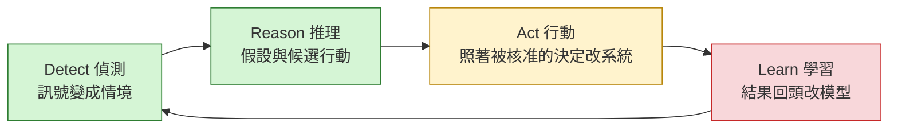
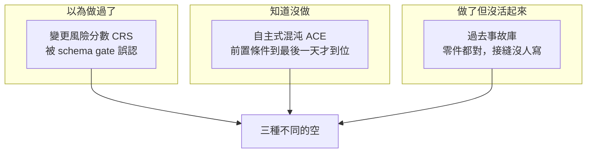

# Day37（番外）：對著一本書的目錄，把三十六天的帳算一次

> 一份做完的東西
> 跟一份自以為做完的東西
> 差別不在它填了幾格
> 在它知不知道自己空著哪幾格

昨天那場演習是這系列第一次真的改叢集狀態，四個護欄的語意在那一次被修正，而那四個問題全部只在真的按下去的時候才現形。系列到那邊就完賽了，所以今天這篇是番外，沒有指令可以跑、沒有輸出可以貼，想看動手的可以直接跳過。

今天要做的事情只有一件：把 [《代理式可靠性工程》（Agentic Reliability Engineering，簡稱 ARE）](https://learning.oreilly.com/library/view/agentic-reliability-engineering/0642572294809/) 的目錄攤開，一章一章對照這三十六天實際做出了什麼。這本書我在系列裡引用了十次以上，`決策級遙測`、`silent decay`、`信任天花板`、五個旗艦 SLO（Service Level Objective，服務水準目標）都是從它借來的詞，但讀者拿到的一直是零星的引號，從來沒有一張全圖。這篇是還那筆帳。

書本身是 O'Reilly 的 Early Release，內容還會變；中文的部分我讀的是[非官方中文翻譯](https://tedmax100.github.io/agentic-reliability-engineering-zh-tw/)，下面指章節的時候都以英文原書的章序為準。

> 先說一件我猶豫過的事。用一本書的目錄當量尺，很容易寫成「你看我全都做到了」的自誇文，或者反過來變成「這本書講得很理想但現實做不到」的酸文。這兩種我都不想要。真正有用的是第三種：**照著做，然後把撞牆的位置標出來。** 這系列一路的做法就是這個，今天只是把三十六個散落的撞牆點收在同一張表上。

## 第六章今天不重講

先排除一格。ARE 的第六章是整本書的架構章，四個`平面`（訊號、推理、執行、治理）、三份契約（訊號契約、候選行動、行動契約）、授權光譜、人在迴圈的三種位置、五級成熟度模型，這些在系列裡已經有一整天在講了，就是 Series 2 開場那天（〈建議之後呢〉）。那天不是摘要，是把書的每一格貼回這個 repo 的檔案上，然後標出哪幾格是空的。

所以今天不重講第六章。要展開的是**第一部那四章**，也就是這系列從頭到尾在用、卻從來沒有正面介紹過的語言基礎；第二部則直接進對帳。

## 第一部：這系列一直在用、但沒介紹過的四個詞

### 認知天花板：自動化擴展的是執行，不是判斷

第一章的立場只有一句話：SRE（Site Reliability Engineering，網站可靠性工程）現在撞到的天花板不是工具不夠、也不是流程不夠成熟，是**自動化這些年擴展的一直是執行，不是判斷**。你可以把部署自動化、把擴容自動化、把 runbook 寫成腳本，但「現在該不該做這件事」這個判斷，還是塞在一個人的腦子裡，而人的數量不會隨系統複雜度成長。書把這個瓶頸叫`認知天花板`（cognitive ceiling），並且主張下一步不是再加一層自動化，是讓判斷本身可以被擴展。這就是它給 ARE 的定義。

配套的詞是`迴圈之上的人類`（above-the-loop human）。人不是被移出流程，是換位置：從「每一次都要按核准」搬到「事前設計政策與契約」。

這一章對這系列來說是最尷尬的一章，因為它講的是動機，而動機我在第一天就用另一種方式講過了（一隻查得動 Prometheus 的 agent，只拿 4.5 分），只是我當時沒有這個詞。**人的角色怎麼移這件事，整個系列其實只碰到一半**：三個授權層級（自動執行、產生提案、直接升級給人）寫進了治理模組，但所有提案最後都停在同一個位置等人按，也就是說這套系統目前只認識「迴圈之中」那一種人。

### 意圖：被遺漏的抽象層

第二章有一節我讀的時候整個坐直，叫〈意圖：被遺漏的抽象層〉。它的主張是：我們寫了一堆規則講「該做什麼」（CPU 超過 80% 就擴容），卻很少有地方宣告「什麼應該為真」（這個服務的結帳成功率不該低於 99.5%，而且它的下游只有這兩個）。前者是動作，後者是`意圖`（intent），而 agent 需要的是後者。因為只有知道目標是什麼，它才有辦法在規則沒有涵蓋到的情況下自己推。

這一格系列裡有直接對應，就是講機器可讀的意圖那天：把只存在於人腦裡的判斷（哪些告警重要、這個欄位為什麼存在）搬進 registry，讓它在被改壞的時候會出聲。那天的收穫是意外的，生成物的 diff 順手補上了 `registry diff` 看不見的三種變更。

同一章還給了`信任邊界`跟`受政策約束的決策`：agent 的推理不該是自由生成，而是在一組政策約束下選擇。這句話在昨天那場演習裡有很具體的形狀，因為 agent 講得出來的行動只有註冊表裡那兩個。

### 第三章：五種在 dashboard 上看不見的失效

第三章是這本書跟這系列重疊最多的一章，它講的是`代理式可觀測性`。核心區分是「可見性」不等於「理解」不等於`決策就緒`（decision readiness）：傳統可觀測性是為了人的注意力設計的，代理式系統要為後果設計。

它列了五種失效模式，共同點是**在 dashboard 上完全看不見**。這五種我對了一次：

| 書上的失效模式 | 這系列有沒有真的撞到 |
| --- | --- |
| 靜默腐化 silent decay | 有。`topology.yaml` 裡 payment-service 掛著 `git_version: v2.4.1`，而叢集上早就不是那個版本，沒有任何一個地方在檢查它 |
| 過時拓撲 stale topology | 有。那張圖有一版是照檔名排出來的，不是照呼叫關係排的，換一個資料夾那支工具就開始漏 |
| 模糊語意 ambiguous semantics | 有，而且是前半段的主軸。命名漂移、`enum` 的值域、schema 是團隊共識而不是觀察結果，講的都是這件事 |
| 訊號洪流 signal flood | 有。一個 100% 配兩個驚嘆號那天，降噪的做法不是少講，是多給一個 `caller_samples` 的數字 |
| 訊號斷崖 signal cliff | **沒有。** 逐項打勾那天就承認過這系列沒有實例，今天還是沒有 |

四比一。而那個沒有的，我到現在也造不出一個誠實的例子，因為訊號斷崖要的是「一段時間之內訊號整片消失」，這座 demo 的規模還沒大到會自然發生。

真正的空格在另一個地方。第三章結尾給了五項可量測的`代理式 SLI`（Service Level Indicator，服務水準指標）：訊號完整性、語意一致性、時間保真度、血緣可得性、結果歸因。**這五項我一項都沒有當成 SLI 量過。** 有幾項其實有材料，語意一致性有 registry 的檢查結果、結果歸因有校準那批標註。但材料不等於指標，指標要有定義、有分母、有一條線。這是這篇對帳裡我覺得最可惜的一格，因為它是唯一一個「離做到很近，但就是沒做」的。

> 順便講一個我讀到會心一笑的詞：`自信地錯誤`（false confidence）。這系列第一天那隻 agent 就是這個，三個空結果，然後講出一段很完整的結論。後來校準那幾天更明顯，它在自己的推論裡寫著「沒有找到反證」然後給了 1.0 的信心。我看到那份報告的時候想笑又笑不太出來 XD

### 第四章：DRAL 四拍，跟它們的分數

第四章是自我修復，主張是「自我修復的系統不是會復原的系統，是會學習的系統」。它把整件事拆成四拍，叫 DRAL：偵測（Detect）、推理（Reason）、行動（Act）、學習（Learn）。四拍互相增強，缺一拍整個迴圈就不轉。

圖裡四個框的顏色就是這三十六天的成績單。`Detect` 那一拍最厚，整個第二階段都在做（拓撲、訊號契約、對帳）；`Reason` 那一拍也走完了，有假設樹、有信心分數、有排序過的候選行動、有影響範圍的乾跑；`Act` 那一拍到最後一天才第一次真的發生，而那一次的四個護欄語意是錯的；`Learn` 那一拍是紅的，理由後面會講。

同一章給了五個旗艦 SLO，那是這系列倒數第二天的驗收題目，答案我照抄一次：自主解決率 0%（十三筆行動請求的 `autonomy` 欄位全部是 `propose`）、決策品質 0/0 算不出來、推理延遲十一筆裡有八筆共用同一個時間戳（那量到的是我那天下午重放了幾次）、行動有效性 0/1、校準誤差在叢集那七筆真人標註上是 0.5643，門檻是 0.1。

這五個裡面有一個在最後一天動了。昨天那場演習跑完之後，行動有效性變成演習三筆中一筆有效，而真實事故那一格仍然是 0/0，兩邊都因為樣本數不到五而拒絕印出比率。其餘四個到完賽為止沒有變。

## 第二部：對帳表

第二部六章是工作流程篇，這裡不逐章展開，直接給對帳。表格裡不寫日號，寫的是那天的篇名，因為順序調過好幾次，寫日號的話這張表明年就開始騙人。

| 章 | 這本書在講什麼 | 這三十六天填了什麼 | 覆蓋 |
| --- | --- | --- | --- |
| 五 | 第二部導讀 | — | 略 |
| 六 | 四個平面、三份契約、信任天花板 | 〈建議之後呢〉整天在講，是唯一一篇正面搬架構的 | 已寫 |
| 七 | 代理驅動的事故應變管線 | 覆蓋最高的一章：情境覺知（整個第二階段）、信心評分與三道鎖、爆炸半徑與候選行動、自主執行、成熟度定位。但**事後學習那一節是空的** | 高 |
| 八 | 從變更到信心：變更風險分數 CRS | 幾乎空白 | 空 |
| 九 | 自主式混沌 ACE | **整章零覆蓋**，全書唯一 | 全空 |
| 十 | 情境豐富層 CEL 與預測性訊號 PRS | CEL 逐項對照過，四項職責做到一項半；PRS 跟事前控制那半章完全沒動 | 半 |

把第一部那四章也算進來，全書十章的成績是：兩章高覆蓋而且有實測、三章做了一半、兩章幾乎空白、一章完全零覆蓋，剩下兩章是架構章跟導讀。

比覆蓋率更有意思的是**空格的分佈**：第一部（訊號、觀測基礎）做得最實，第二部越往後越空，而空掉的順序剛好是 DRAL 的後兩拍。這不是巧合。訊號跟推理是唯讀的，做錯了最多是報告難看；行動跟學習要真的碰到生產系統，而一碰到，成本、風險、還有「誰扛」這三件事就一起長出來了。

> 這裡有一個平台團隊會很有感的推論。這系列前半段之所以推得動，是因為治理那些東西（registry、CI（Continuous Integration，持續整合）gate、policy）產品團隊接上去之後自己就有好處，schema 有人幫你檢查、程式碼有人幫你生。而後半段的行動與學習，得先有人願意把叢集的寫入權限交出來。前者是介面問題，後者是信任問題，**而信任問題不會因為你把介面做得更好就消失**。

## 三個空格，性質完全不一樣

對帳表上三個難看的地方，我想分開講，因為把它們混成一句「還有很多沒做」會讓讀者以為都是取捨。

**第八章那格是「以為做過了」。** 書講的是`變更風險分數`（Change Risk Score，簡稱 CRS）：把意圖敏感度、當下系統健康、爆炸半徑、歷史波動性四個維度算成一個即時分數，然後用護欄政策把分數帶對應到具體的交付行為（直接推、金絲雀、先影子後晉升、擋下來）。這系列有 CI gate、有會自己跑的上線 checklist，看起來很像，但那些檢查的是 schema 對不對，跟「現在這個時間點推這個變更適不適當」是兩件事。**前者是靜態的，後者要讀當下的系統狀態。** 我一開始列這張表的時候是把這格打勾的，後來翻回去看才發現我在騙自己。

**第九章那格是完全沒做。** 自主式混沌（Autonomous Chaos Engineering，簡稱 ACE）主張把脆弱度當成第一等訊號，讓混沌代理自己挖假設、自己排優先序，然後用`驗證即程式碼`把假設變成可執行的檢查，外加五項不可妥協的安全原語（範圍限縮、中止標準、速率限制、強制冷卻、人類升級）。這一章我連一個實驗都沒跑過。誠實講，它需要的前置條件正是我到最後一天才第一次做到的那件事：讓程式真的改叢集狀態。連一次計畫內的回滾都要花一整天修護欄，跑主動注入故障的時候還沒到。

**第四拍那格最微妙：做了，但沒有活起來。** agent 組 prompt 的時候會撈「這個服務過去被判定正確的調查」貼進去，那就是學習迴圈最原始的形狀。實際去看是一個 JOIN，兩張表，兩個不同的寫入者，而唯一會產出標註的那條路上只有一半有人寫，所以那個查詢一直回 0 筆。修完之後它會在下一輪真的跑起來的時候有東西，但截至完賽，**過去事故庫從來沒有影響過任何一次判斷**。

第一種最危險，因為它會讓人停止找。第二種其實最健康，知道自己沒做的事情不會傷到你。第三種是這系列後段反覆出現的形狀，每個零件單獨看都是對的、也都有測試，壞的一直是零件跟零件中間那條沒有人擁有的接縫。

## 這對值班的人有什麼差別

講了一整篇的目錄對帳，落回半夜三點被叫起來的那個人身上，差別在哪。

差在**他能不能知道自己手上這隻 agent 現在停在哪一格**。一隻停在偵測與推理的 agent，值班的人要用的方式是「拿它整理好的情境當起點，但每一個結論都自己再驗一次」；一隻已經跨過去會動手的 agent，值班的人要用的方式完全不同，他得知道剛剛那三分鐘裡系統自己做了什麼、可不可逆、以及在什麼條件下它會停手。這兩件事搞混的後果不對稱：把顧問當執行者，最多是浪費時間；把執行者當顧問，是在一個已經在改東西的系統上做第二個互相衝突的處置。

而這篇對帳表真正的用途就是這個。它不是給我打分數用的，是給用這套系統的人一份「現在可以信到哪裡」的說明書。書裡那句「五個旗艦 SLO 真正的用途不是給人看，是給治理平面當旋鈕」，我到最後也還沒把旋鈕接上去，全部都是我手動讀數字，所以這份說明書現在也還是人工維護的。

## 今天沒做的事

- **五項代理式 SLI 一項都沒有變成真的指標。** 材料有一半在手上，缺的是定義跟分母，留給後面。
- **第八章的 CRS 沒有做任何實作**，連一個把當下系統狀態餵進交付決策的原型都沒有。
- **第九章整章空著。** 主動注入故障這件事，得等行動那一拍的護欄語意先被真實輸入洗過幾輪。
- **訊號斷崖還是沒有實例**，這是這系列第二次記這筆帳。
- **這篇本身沒有任何可執行的產物。** 它是一份對帳，不是一支腳本，所以它會過期，過期的方式跟那個 `git_version` 一模一樣。

## 小結

總結來說，今天這篇沒有讓任何東西變好，它只是把三十六天散落的撞牆點收在一張表上，然後發現那些洞的分佈其實很有規律：唯讀的部分做得完整，會動手的部分做得很淺，而最淺的那幾格全部落在需要有人把權限交出來的地方。這件事我在動筆之前沒有想清楚，是排完表才看出來的。

對讀者比較實際的用途，大概是這張表可以直接拿去對自己的團隊。不用照著這系列做一遍，把十章的格子畫出來，然後老實回答哪幾格是「以為做過了」，光是這一步就會抓到東西，因為那一格對我來說是變更風險分數，被一道長得很像的 schema 檢查蓋住了整整三十六天。

> 寫完這篇最大的收穫，是發現我引用一本書引用了十幾次，卻是到今天才第一次把它的目錄從頭讀到尾 QQ
>
> 至於那唯一一章零覆蓋的自主式混沌，我現在的心情是：也好，總得留一點事情下次做。
