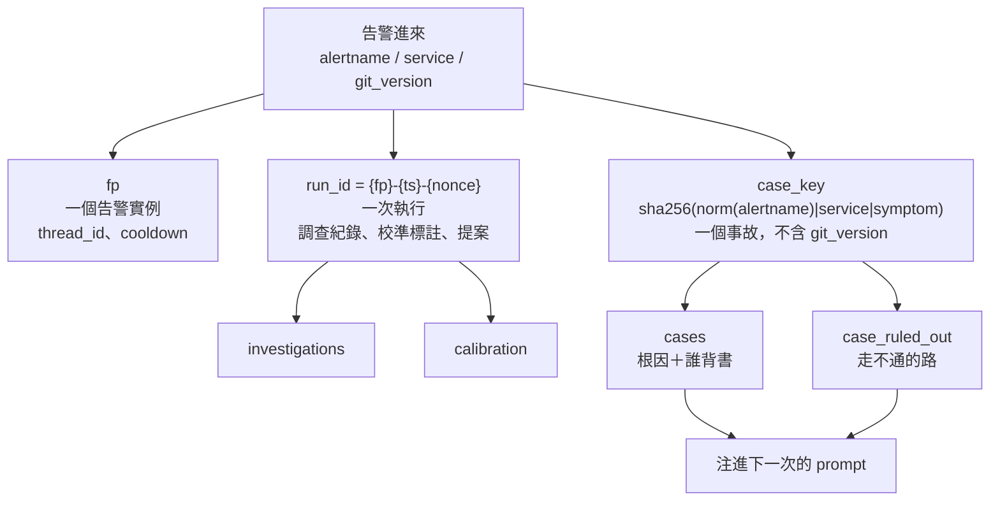
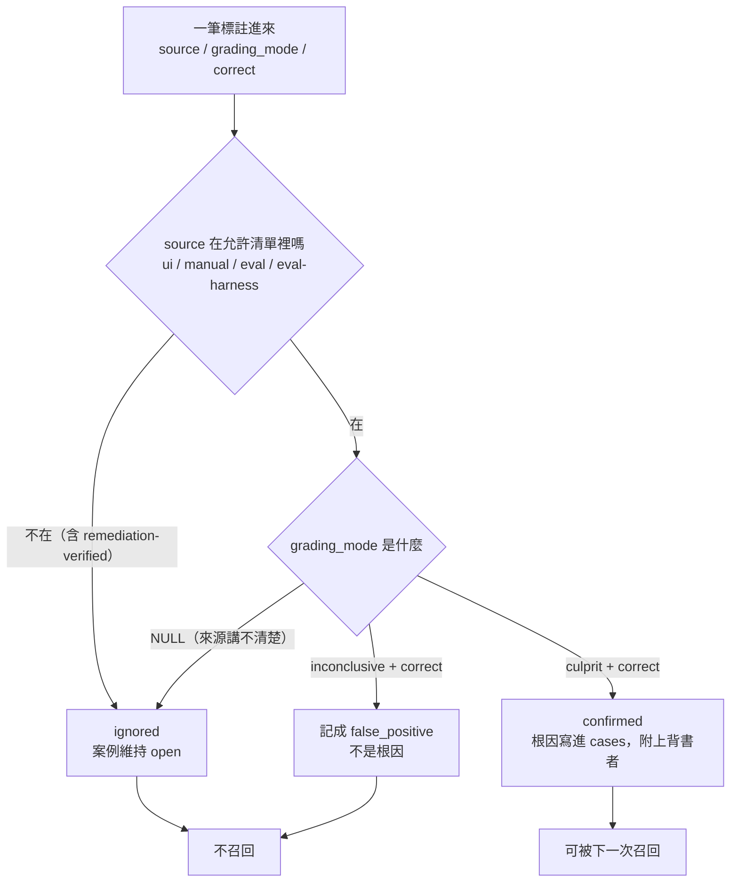
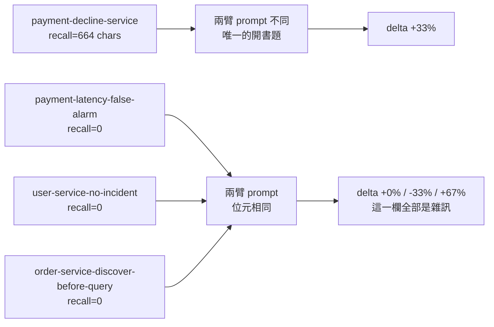

# Day38（番外）：案例記憶的第一版，跟它量出來的雜訊底線

> 一隻記得上次怎麼修的 agent
> 跟一隻背過答案的 agent
> 從分數上看起來一模一樣
> 所以我今天做的第一件事
> 是先讓報表自己講出它在考哪一種試

前一篇番外把三十六天攤在《代理式可靠性工程》（Agentic Reliability Engineering，簡稱 ARE）的目錄上對帳，其中一格空得特別刺眼：這隻 agent 每查完一次事故，那次的推理就散掉了，下一次同樣的告警進來，它從零開始重查一遍。系列雖然完賽了，但這格我一直想補，所以今天是另一篇番外，補的是**過去案例的記憶**。

程式碼在範例 repo [`OTel_AIOps_Agent`](https://github.com/tedmax100/OTel_AIOps_Agent) 的 [`ironman-2026/day38/`](https://github.com/tedmax100/OTel_AIOps_Agent/tree/main/ironman-2026/day38)，設計稿另外寫在 `doc/aiops-agent-case-memory.md`。驗證環境：day36 那場演習留下的 SQLite 快照，加上 2026-08-18 跑的 24 次真實 RCA（Root Cause Analysis，根因分析）。

先說結論的形狀，免得讀者以為今天是個成功故事：機制做完了、測試從 466 條長到 495 條、A/B 也真的跑了，然後那個 A/B 什麼都證明不了。而它證明不了的原因，才是今天最有用的那筆資料。

## 那句「過去事故庫是空的」，歸因錯了一層

系列中段查過一次「為什麼注進 prompt 的過去事故永遠是零筆」，當時的答案是撈資料的那個 JOIN 條件太嚴，並且順手補了 eval harness 對調查紀錄的寫入。這個答案不算錯，但它停在症狀上。真正的病在更下面一層：`fp` 這個欄位同時被當成四種 key 在用。

`webhook.fingerprint(labels)` 算出來的東西是 `sha256(alertname|service|git_version)` 取前 16 碼，然後它被四個地方拿去用，而那四個地方要的粒度不一樣：

| 誰在用 | 用來做什麼 | 它要的粒度 |
| --- | --- | --- |
| `run_headless(alert, thread_id=fp)` | LangGraph 的對話 thread | 一個告警實例 |
| `_in_cooldown(fp)` | 告警去重、冷卻 | 一個告警實例 |
| `investigations.fp` | 調查紀錄 | **一次執行** |
| `calibration.run_id = fp` | 校準標註 | **一次執行** |
| `inv_query_similar` 的 JOIN | 過去事故檢索 | **一個事故，跨版本跨次數** |

三種粒度，一個欄位。所以它同時太窄也太寬，剛好 day36 那場演習留下的快照兩種都拍到了。

> 這種 bug 我覺得比邏輯寫錯難抓很多。程式碼每一行單獨看都對，`fp` 每一次被使用也都符合它當初被發明時的意思，壞的是這五個使用者對「這是什麼的 ID」有五種默契，而沒有任何一個地方寫下來過。

### 太窄：演習每部署一次就開一個新世界

演習每跑一輪換一個 image tag，而 `git_version` 在 fingerprint 裡面，於是同一個事故裂成六個 fingerprint：

```
git_version=(none)                   rows=9  fp=1
git_version=v2.5.1-drill-055043      rows=1  fp=1
git_version=v2.5.1-drill-055519      rows=1  fp=1
git_version=v2.5.1-drill-061013      rows=1  fp=1
git_version=v2.5.1-drill-061239      rows=1  fp=1
git_version=v2.5.1-drill-061516      rows=1  fp=1
-> 6 fingerprints, 1 case_key: 1c2866de3a58ada9
```

要注意的是，`git_version` 進 fingerprint 對「去重」這個用途來說是**對的**：換了版本，那確實是一個該重新查一次的新告警，不該被冷卻擋掉。所以這裡不是誰寫錯了，是兩個角色要的東西直接衝突。

### 太寬：兩筆判決撐起十列「先例」

另一邊更糟。標註人工判決的 `cal_label` 那句 SQL 是 `WHERE id = (SELECT id ... ORDER BY id DESC LIMIT 1)`，一個 run_id 只有最後那一列拿得到判決；而檢索用的 `JOIN ... ON c.run_id = i.fp` 又會把那一列的判決攤到同一個 fp 底下的每一列調查上。快照裡的實際狀況：

```
rows the old JOIN calls precedent: 10
human verdicts actually recorded:  2
of those rows, ones that concluded there was no incident: 3
  - [ui] Code regression in payment-service v2.5.1-drill ... new_validator_odd_cents ...
  - [ui] The alert was a false positive; no traffic, errors, or decline spikes were detected ...
  - [ui] Code regression in payment-service v2.5.0 introduced a new_validator_odd_cents ...
```

`LIMIT 5` 會從這十列裡抓五列注進 prompt，其中包含在說「這是誤報、沒事」的那幾列，而且全部帶著「人判定為正確」的身分。**這比空的事故庫還糟**：空庫只是沒有先驗，這是有一個帶著人工背書的錯誤先驗。

順帶一提，eval harness 早就自己繞過去了，它的 run_id 寫成 `eval-<fixture>-seed<n>-<nonce>`，旁邊還留了一行註解說不這樣的話判決會貼到錯的實體列上。修法在其中一個 caller 裡已經存在三個月，只是沒長進 schema。

## 三個 key，各自對上自己的角色



`fp` 一行都沒動，它對它原本的兩份差事從來沒錯過。新加的是 `run_id`（一次執行）跟 `case_key`（一個事故，跨版本跨次數）。落到 schema 上是兩張新表（`cases`、`case_ruled_out`）加五條 additive migration，`store.py` 多了十一支函式。

有一個小地方我特別在意：`case_key` 裡面那個「告警名稱正規化」不能有第二份定義。系列中段踩過一次 trace id 的 regex 在三個地方各寫一份、其中兩份是錯的，所以這次直接把 `runbook.py` 裡的 `_norm` 升成公開的 `norm_alertname`，`store.case_key()` 呼叫同一支。**「這兩個是不是同一個告警」這種判斷，多一份實作就是多一種未來會分岔的可能。**

## 誰的話可以變成先例

案例庫這種東西最危險的不是查不到，是查到了一筆假的。因為這段文字會直接進 prompt，而模型看到「人判定為正確」四個字不會去質疑它。

所以「誰有資格把一筆根因寫進案例庫」只有一個地方能決定，就是 `case_memory.confirm_from_label()`，而且它用的是**允許清單**（`ui`／`manual`／`eval`／`eval-harness`），不是照抄治理模組那份排除自我標註來源的清單。兩者的失效方向相反：排除清單遇到將來新增的標註來源會預設放行，允許清單遇到不認得的來源會忽略。這段文字要進 prompt，所以我要的是後者。



探測腳本把五種來源各跑一次：

```
[5] who may write a root cause
    remediation-verified   mode=culprit       -> ignored         status=open
    ui                     mode=inconclusive  -> false_positive  status=false_positive
    ui                     mode=None          -> ignored         status=open
    ui                     mode=culprit       -> confirmed       status=resolved
    eval-harness           mode=culprit       -> confirmed       status=resolved
    retrievable precedent: 2
```

這五列是整份改動的核心。第一列是 agent 自己執行完之後自我驗證說「我修好了」，判 correct 也寫不進根因，自證不能變成先例。第二列的 `inconclusive` 上面那個 correct，意思是「它正確地誰都沒怪」，所以記成 `false_positive` 而不是記一筆根因。第三列 `grading_mode` 是 NULL，來源講不清楚，fail closed。

> 我原本覺得這節有點過度設計，直到把快照裡那三筆「誤報、沒事」的紀錄印出來看。那三筆如果進了案例庫，下一次同樣的告警來，agent 會拿著「上次人確認過這是誤報」開場。它不會查得比較慢，它會查得比較有信心地錯 QQ

## 死路要記，但只記名字不存在那種

案例記憶的另外一半是走不通的路。這隻 agent 有一半的 tool call 預算是花在重發一條上次就問不出東西的查詢上。

死路是在工具層被發現的，而工具層不知道自己在查哪一個事故。與其把 case key 塞進十幾支工具的 signature，這裡走的是 ContextVar 開一個 scope，跟 `tools.query` 帶著那個釘住的時鐘是同一個做法。

真正要小心的是**記什麼**。目前只記兩種：Prometheus 說「沒有這個指標名」、Loki 說「這不是可索引的標籤」。**空視窗一律不記**，因為那是一個關於時間的事實，把它記成死路，等於告訴下一次執行「別往那邊看」。同樣的道理，Tempo 查不到帶著 TTL（Time To Live，存活時間），因為那通常是保留期造成的，釘死了下次連該查的都不查：

```
[6] dead ends
    outside a scope: False
    recalled inside the TTL: ['trace lookup older than the retention window',
                              'PromQL referencing http_requests_total']
    recalled after it      : ['PromQL referencing http_requests_total']
```

還有一條：模型自己說的「我排除了 X」會存下來，但永遠不召回。沒有工具證據的自證注回去，只會讓下一次更早停止思考。

## 召回長什麼樣子，以及它為什麼算洩題

注進 prompt 的東西分成兩半：

```markdown
## Past cases for this service (reference — current evidence wins)
- PaymentDeclineRateHigh (×6, last 2026-08-16, confirmed by ui)
  root cause: new_validator rejects odd cents
  resolved by: k8s.rollout_undo

### Already ruled out here — do not spend budget re-checking
- [query] LogQL stream selector on service (not an indexable stream label in this Loki)
```

兩半的排序邏輯不一樣。根因是「一直在發生」所以值得召回，死路是「最近才被否證」所以那個環境比較可能還是現在這個。我自己的預期是，真正會改變行為而不改變答案的是下半那段，它省掉的是這次執行本來要浪費在重發無效查詢上的預算。

問題來了。系列中段做過一支 `leakcheck.py`，掃所有人手寫進 prompt 的區塊有沒有洩題，而召回區塊結構上就是「把上次的答案原封不動放回桌上」，拿答案詞去掃一定會中。它中是因為它在運作，不是因為它壞了。但也不能像其他區塊那樣安靜放行，因為**有召回的那一次執行是開書考，它的分數跟沒有召回的不可比**。

所以給它第三種判決。空的案例庫底下：

```
[ok  ] injected #1: ## Label vocabulary (compiled from the Weaver registry)
[ok  ] injected #2: ## Runbook: payment-bad-deploy ...
no answer tokens in anything handed to the model.
```

種一筆確認過的案例之後，同一支腳本：

```
[RCLL] injected #2: ## Past cases for this service (reference — current evidence
...
OPEN BOOK: 1 recalled item(s) from the case library are in this prompt. Whatever this
run scores is not comparable to a run without them — an A/B has to use a fixture the
library has never seen.
```

離開碼還是 0，沒有意外洩題，但報表上寫明了這是哪一種考試。要防的從來不是這個區塊存在，是在不知情的情況下拿它的分數去跟別人比。

## 回填之後是 0 筆，而 0 才是對的數字

`backfill_cases()` 跑在 day36 那顆真快照上：

```
[4] after backfill
    backfill_cases: {'run_id': 23, 'case_key': 23, 'cases': 3}
    payment-decline-rate-high              occurrences=14  status=open  source=None
    payment-decline-rate-high-wrong-test   occurrences=8   status=open  source=None
    payment-decline-rate-high-v2           occurrences=1   status=open  source=None
    retrievable precedent: []
```

23 列調查回填成 3 個事故，可召回的先例是零。以前那個 JOIN 說有十列。

零是對的。舊的那些 `correct=1` 說不出它 judge 的是哪一次執行，而那正是這整張表要修的 bug；硬把它們升格，等於把一個已知錯誤的先驗固化進新的 schema。所以回填只搬結構，不搬判決，案例庫從空的開始長。

> 這種決定寫進 commit message 的時候特別不舒服，因為它讓一個「我做完了」的功能，在展示的時候輸出一個空陣列。但把那十列升上去我大概三天後就會忘記它們是假的。

## 一筆判決只蓋一次執行

「太寬」那一半，繞過檢索之後就不會再污染 prompt，但判決本身仍然說不出它在講哪一次執行。要真的解掉，卡點是**兩個標註端手上都只有 fingerprint**：plugin 上的 `POST /investigations/{fp}/label`，跟自我驗證那條路。

做法不是逼它們生出 run_id，是把那次解析寫出來。`calibration` 多一個 `fp` 欄位，`run_id` 從此固定是一次執行、`fp` 是分組；`cal_resolve_run_id(ident)` 精確的 run_id 優先，比不到就解析成「這個告警最後那一次」，而且它回傳的字串跟傳進去的不一樣，呼叫端看得出來剛剛有人做了一個選擇。

實測九次執行同一個 fp、一筆人工判決：

```
labeled = {'fp1-run-8': 1}          # 不是九列都是
list_investigations -> [correct=True]，run_id=fp1-run-8
```

代價要講清楚：這不會讓校準樣本變多。九次執行還是只換到一個樣本，因為只有一個人按了一次。差別在於現在那一筆說得出它在講哪一次，另外八次誠實地留在 unlabeled，而以前它們是「被判定為正確」。

原本這個解析是**意外發生**的，藏在 `ORDER BY id DESC LIMIT 1` 裡面。行為其實一樣，但沒有任何地方說有人在做選擇，落選的那幾次也永遠不會被標到。

## A/B 跑了：四個 fixture、兩臂、24 次真實 RCA

2026-08-18，四個 fixture 各跑 3 個 seed、開關召回各一輪，資料是同一顆已經開著的 stack 容器，所以兩臂打的是位元相同的資料。

跑之前先量了一件事，這件事後來變成整個實驗的重點：四個 fixture 裡**只有一個拿得到召回**。

```
payment-service  PaymentHighDeclineRate       recall=664 chars
payment-service  PaymentChargeLatencyHigh     recall=0 chars
user-service     UserServiceLatencyWarning    recall=0 chars
order-service    OrderErrorRateWarning        recall=0 chars
```



也就是說另外三題，兩臂的 prompt 一個位元組都沒有差。然後結果長這樣：

```
OPEN BOOK — the case library already answers these fixtures:
  payment-decline-service: 1 case(s) recalled

fixture                             recall off   recall on    delta
payment-decline-service                   67%        100%     +33%
user-service-no-incident                  33%          0%     -33%
order-service-discover-before-query         0%         67%     +67%
payment-latency-false-alarm                0%          0%      +0%
```

`order-service-discover-before-query` 這一題，兩臂的輸入完全一樣，動了 67 個百分點。`user-service-no-incident` 動了 33 個百分點。開書的那題只動了 33 個百分點，比雜訊還小。

所以這次實驗真正的產出不是那個 `+33%`，是它自己量出來的**雜訊底線：3 個 seed 之下至少 ±67 個百分點**。這比「召回沒有幫助」有用得多，後者是一個沒有力量的結論，前者是一把尺：任何用 3 個 seed 量出來、小於 67 個百分點的 A/B 差異，都不能拿來說事。要談召回有沒有用，得先把這個底線壓下去。

> 補記：這句話後來被自己的資料打臉了。往後幾天我去查「那要加到幾個 seed」，才發現 RCA 那顆模型是 `temperature=0`，而 eval 的 seed 只換 thread id、根本沒進到模型呼叫裡。翻遍紀錄，同一次執行裡的三個 seed 有 26/27 次給出**一模一樣的判定**。所以 `-n 3` 買到的是三份相關的重複，不是三個樣本，而會跳的那個變異住在「兩次執行之間」。壓底線要靠重跑，不是靠加 seed。

系列中段量過「同一份程式碼連跑三次總分在 2.5 到 3.5 之間跳」，那時只能說「它會跳」。這次因為有三題結構上不受影響，跳的幅度第一次有了一個下界。

> 我本來想寫的那個標題是「案例記憶讓分數從 67% 升到 100%」。截圖都想好了 XD
> 停下來的原因只是隨手多印了一行 `recall=N chars`，發現另外三題根本沒吃到召回，然後它們跳得比會吃到的那題還兇。

## 對照題六次全錯，而原因不在召回

A/B 最容易做出來的假結論是「開了召回分數變高」，所以必須有一題是**案例庫答不出來、但又離得夠近**的。隨便找一個沒資料的服務當對照，只證明了沒有召回就沒有召回。真正要抓的失效是：payment-service 的事故一旦成為案例，這個服務的每一個告警都離「被塞一份 v2.5.0 是元凶」只差一次比對放寬。

這座 stack 剛好給了材料。延遲是平的，而且「壞掉的」那一版反而比較快：

```
sum by (git_version) (increase(payment_charge_duration_seconds_sum[6h]))
  / sum by (git_version) (increase(payment_charge_duration_seconds_count[6h]))
v2.4.1  0.05894514767932489
v2.5.0  0.04062898751733703
```

於是 `payment-latency-false-alarm`：同一個服務、不同的 alertname、`expect: inconclusive`，誠實的答案是「延遲沒有動」。這題還需要一個新的判準，因為原本那條「不准怪錯服務」抓不到這個失效：告警指名 payment-service，答案也講 payment-service，服務是對的，錯的是它把延遲掛在一個從別的症狀繼承來的版本上。所以 fixture 多了 `forbid_versions`：

```
primed answer (conf 0.5, payment-service, v2.5.0) -> correct=False
honest hedge  (conf 0.5, payment-service, None)   -> correct=True
overconfident (conf 0.9, nobody named)            -> correct=False
```

結果這題六次全錯，兩臂一樣：

```
arm  run                              conf  correct
off  payment-latency-false-alarm s0   0.7   0
off  payment-latency-false-alarm s1   0.7   0
off  payment-latency-false-alarm s2   0.8   0
on   payment-latency-false-alarm s0   0.7   0
on   payment-latency-false-alarm s1   0.9   0
on   payment-latency-false-alarm s2   0.7   0
```

六次的 `suspected_version` 全部是 v2.5.0，摘要清一色是「Code regression in payment-service version v2.5.0 caused increased latency」這種句子。而關掉召回的那三次，prompt 裡連一個字的案例都沒有。

**這個失效跟召回無關，它的來源是環境本身。** 這座 demo 只有一個響亮的事故，`reason="new_validator_odd_cents"` 就長在 Prometheus 的 label 上、查得到，於是這個服務的任何告警都會被歸到它頭上。我原本拿這題當「召回會不會污染別的告警」的對照組，結果它先抓到一個更基本的問題：不需要案例記憶，這隻 agent 就已經在做「把手邊唯一認識的事故套到新症狀上」這件事。案例記憶只會讓這件事更順手，所以那條 `forbid_versions` 留著是對的，只是它現在擋的是一個比我預期更早出現的失效。

另外，`user-service-no-incident` 三次全掛在同一個流程檢查上：

```
x user-service-no-incident seed0 — discover_before_retry: query_prometheus came back
  empty, retried query_prometheus without discovering
```

查回空的就換一支工具再查，沒有先去 discover。這系列第一天挖出來的坑，今天還在。

## 今天沒做的事

- **A/B 跑了，但沒有結論。** 雜訊底線 ±67 個百分點蓋過了唯一那題的 +33%。要有結論得先把底線壓下去（後來查出來那不是加 seed 能解的，見上面那則補記）。
- **「一個響亮事故蓋住一切」沒有處理。** 對照題六次全錯的原因在環境不在召回，這需要的是第二個獨立的事故劇本，不是改 schema。留給後面。
- **eval harness 依然刻意不開 case scope。** 開了的話 fixture 每跑一次就在案例庫長一筆，第二輪就自動變成開書考。
- **沒有案例的合併／拆分介面。** 正規化把兩個真的不同的告警併在一起時，目前只會印一行 warning。
- **`symptom` 恆為空字串。** 從 chat 進來、沒有 alertname 的那條路徑，還是只能靠 service 匹配。
- 探測腳本沒有斷言，也沒進 CI。

## 小結

總結來說，今天做的東西講白了就是「把一個欄位拆成三個」，聽起來實在不像一天的份量，而且做完之後可召回的先例是零筆、A/B 也沒跑出任何能宣稱的東西。但這裡面有兩件事我覺得帶得走。一是**一個 ID 被三種粒度共用的時候，它不會報錯，它會安靜地給出一個看起來很合理的答案**，那十列「人工背書」的先例就是這樣長出來的；如果沒有把快照印出來一列一列看，我會直接在上面蓋案例庫。二是量一個非確定性系統的改動時，先量雜訊底線比先量效果重要，因為雜訊底線是那把尺，沒有尺的話 +33% 跟 +67% 看起來一樣有說服力。

至於案例記憶本身有沒有用，老實說現在還不知道，只知道要怎麼問這個問題、以及要花多少次執行才問得起。這對後面要收斂那幾個 SLO（Service Level Objective，服務水準目標）來說反而比較實際，因為它把「要花多少次執行才問得起這個問題」從一個模糊的感覺變成一筆算得出來的帳。

> 寫這篇的時候我一直想把那個 `+33%` 放進標題，畢竟它是全篇唯一一個往上的數字。
> 結果最後標題裡連一個百分比都沒留下，只留了「一個欄位兼四份差事」^^
