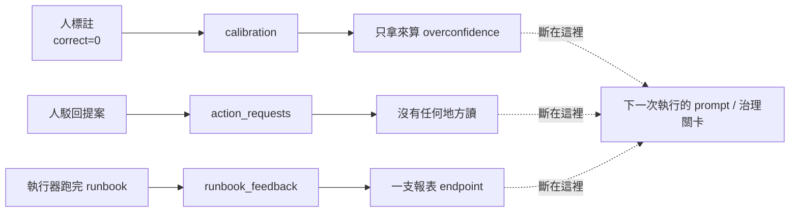
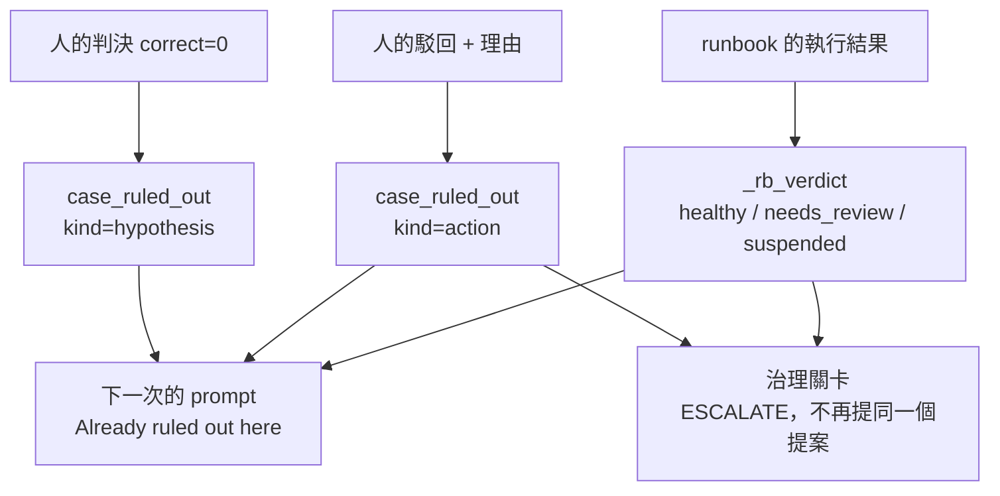
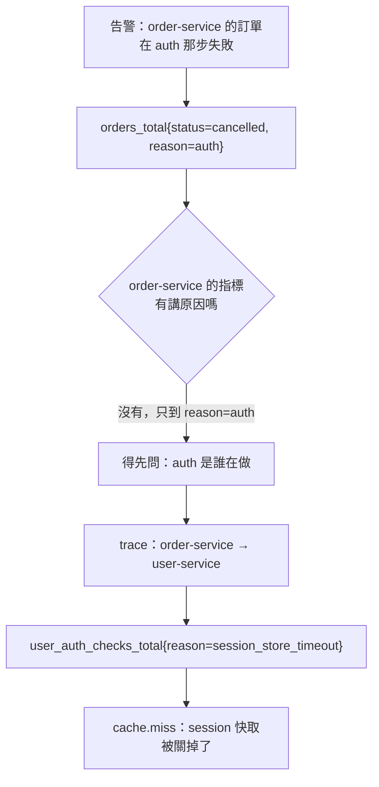

# Day39（番外）：讓 agent 學人做過的事，以及一個為了被答錯而生的事故

> 一個人跟 agent 說「這個判斷是錯的」
> 這句話值多少
> 取決於它被寫進哪張表
> 而昨天為止
> 它被寫進一張沒有人會讀的表

前一篇番外做了案例記憶：agent 每查完一次事故，那次的結論、還有走不通的路，都會留下來給下一次用。做完之後我拿它去跑 A/B，結果什麼都證明不了，因為 3 個 seed 之下的雜訊底線就有 ±67 個百分點。

那篇的重點因此變成那把尺，而不是那個功能。但收尾的時候有一句話我一直放不下：**人做的事，一件都沒被記下來。** agent 學自己，人在旁邊標了半天，系統只是安靜地收著。今天補的就是這件事，順便補一個讓它有機會被量出來的環境。

程式碼在範例 repo [`OTel_AIOps_Agent`](https://github.com/tedmax100/OTel_AIOps_Agent) 的 [`ironman-2026/day39/`](https://github.com/tedmax100/OTel_AIOps_Agent/tree/main/ironman-2026/day39)。驗證環境：本機 k3d 叢集（2026-08-19 實測）、重新烘過的 `demo-services-o11y-stack` image，對著它跑的兩輪 fixture（各 15 次真實 RCA，報表在 `day39/eval-20260819.txt`），以及最後那次介入 A/B（6 次，`day39/ab-intervention-20260819.txt`）。測試從 495 條長到 532 條。

先講清楚今天的形狀：四條回饋通道接上了、第二個事故劇本做出來也驗過了、烤進 stack image 了，然後拿整套 fixture 跑了兩輪真實的 RCA（Root Cause Analysis，根因分析），拿到 0% 跟 60%，最後再拿人的介入去打一次 A/B。**那個 A/B 的結果是負的，而且它指著一個我沒預期的方向。** 那一段在最後面。

## 三條寫了沒人讀的表

先把現況攤開。人跟這套系統互動的地方只有三個，全部都有紀錄，全部都沒有回到下一次的判斷：

| 人做了什麼 | 系統記了什麼 | 下一次執行知道嗎 |
| --- | --- | --- |
| 在 plugin 上標「這個診斷是錯的」 | `calibration` 一列 `correct=0` | ❌ |
| 駁回一個提案 | `action_requests.status='rejected'` | ❌ |
| （執行器自己）跑完一份 runbook | `runbook_feedback` 一列 | ❌ |

第三列不是人做的，但它跟前兩列是同一種病。`runbook_feedback` 從執行器寫好那天就在收資料，讀它的只有一支健康報表 endpoint，所以一份連續三次驗證失敗的 runbook，下一次照樣以權威的語氣被貼進 prompt 裡。



## 「你錯了」是這套系統最貴的一筆資料

先講第一條。`confirm_from_label()` 這支函式的註解，我當初是這樣寫的：

> a wrong run teaches nothing at this layer: knowing the answer was wrong is not knowing the answer.

這句話對 `cases.root_cause` 那個欄位是對的，對整個案例是錯的。「有人真的看過這件事，然後說 payment 那個版本不是元凶」。這是整套系統會產出的最貴的一筆證據，一個人花時間看完逐字稿才有的。把它丟掉，等於允許下一次執行毫無阻力地走回同一個錯誤答案。

所以它進去了，但進的是**死路那半，不是知識那半**。一個被推翻的假設，跟一條在這個環境問不出東西的查詢，本來就是同一種東西：兩者都不告訴你答案是什麼，都告訴你不要往哪裡走。

```
[1] a human says "wrong", and the case keeps it
    root_cause after a wrong verdict: None
    ruled out [hypothesis] payment v2.5.0 new_validator rejects odd cents
              evidence: latency was flat on v2.5.0 — 0.041s vs 0.059s
              disproved_by: human
```

`root_cause` 還是 `None`，因為判錯確實沒有告訴我們答案。但那個假設現在掛在案例上，帶著那個人打的那句話。

誰有資格否證，用的是跟根因那半一模一樣的**允許清單**形狀：

```
[2] who may disprove — and what an unfamiliar source gets
    ui                     culprit        -> recorded  (a person, on a run that blamed someone)
    eval-harness           culprit        -> recorded  (the grader)
    remediation-verified   culprit        -> ignored   (the run grading its own fix)
    some-new-bot           culprit        -> ignored   (a source nobody has heard of)
    ui                     inconclusive   -> ignored   (a person, on a run that blamed nobody)
```

前四列的道理跟前一篇一樣：這段文字最後會進 prompt，所以不認得的來源要忽略而不是相信，agent 自己驗證自己的修復更不算數。

最後一列是唯一需要想一下的。一個判錯的 `inconclusive`，意思是「它該怪人的時候卻誰都沒怪」，桌上根本沒有假設可以推翻。而**那時候人寫的更正說明就是答案**，把它記在「已排除」這個標題底下，比什麼都不記還糟。

> 更正說明我最後決定存成 evidence，不升格成根因。那是一個自由文字框，可能是答案、可能是提示、也可能是「見 thread」，而 `root_cause` 是下一次執行會當成定論來讀的欄位。要宣告根因，應該要有一個明講「我要宣告根因」的地方。

## 一次拒絕，不該讓人再打第二次

第二條。`reject(request_id, actor)` 以前只有這兩個參數，也就是說「人為什麼不准這次 rollout」這個資訊在系統裡不存在。下一次提一模一樣的提案是必然的，那不是模型固執，是紀錄只允許這樣。

現在它多一個 `reason`，而且那句話會變成事故上的一條死路：

```
[3] a declined action, and the proposal that is not made again
    status=rejected  decision_note='we roll forward here, never back'
    next run's gate: ESCALATE — a person declined this on 2026-08-19: we roll forward here, never back
    same action, another target  bound: False
    another action, same target  bound: False
```

判 ESCALATE 而不是 PROPOSE，是因為 ESCALATE 的語意本來就是「交回給人，連動作都不要預填」。留在 PROPOSE 只會讓人再打一次同樣的拒絕，而第二次拒絕比第一次少了資訊，它講的是我們的固執，不是那個動作。

後兩列是邊界。綁的是 `(動作, 目標)` 這一對，不是動作本身：「不要重啟 payment」不是在講重啟別的東西。

plugin 那邊也順手補完了。核准／駁回這兩個 endpoint 從寫好到現在，介面上一直沒有按鈕，人要按只能 `curl`。現在按鈕接上去了，駁回會跳一個對話框問理由，而且對話框自己會說明為什麼值得填：不填的話，案例只學到「有人說不行」。

### 一個沒有預期到的接縫

這段是我覺得最值得寫的。單元測試全綠之後，我用 `TestClient` 打了一次真的 API，結果駁回沒有留下任何死路。

原因是：提案是在調查進行中產生的，而 `investigations` 那一列是在調查結束時才寫。我本來讓駁回靠 `run_id` 去反查它屬於哪個事故，那就變成一個在讀「稍後才會出現的資料」的查詢。一次跑到一半掛掉的執行、或是人按得夠快的情況，理由就無處可歸。

改法是把 `case_key` 在提案產生的當下就釘在 `action_requests` 上，`run_id` 反查降級成舊資料的 fallback。**人什麼時候按那個按鈕完全不受我們控制，所以不能依賴一列稍後才出現的資料。**

> 這個接縫我是真的沒想到。單元測試我寫了五條、全綠，因為測試裡我很自然地把提案建在 scope 裡面，那是我腦中的「正常流程」。真實世界的問題從來不是正常流程 QQ

## runbook 的成績單

第三條。`runbook_feedback` 現在被兩個地方讀：prompt（貼 runbook 的時候附一行成績單）跟治理關卡。

判準只有一份（`store._rb_verdict`），報表跟關卡共用。一個頁面說這份 runbook 沒事、治理平面卻當它停用，比兩邊都錯還糟。

```
[5] a runbook's own record, read twice
    never executed         insufficient_data  proven_good=False gate=propose  0 recorded execution(s) — too few to rate
    one failure, one run   insufficient_data  proven_good=False gate=propose  1 recorded execution(s) — too few to rate
    three clean            healthy            proven_good=True  gate=propose  3/3 verified clean
    failing verification   needs_review       proven_good=False gate=propose  verify_failed 75% (3/4) — the symptom survived the fix
    its undo did not work  suspended          proven_good=False gate=escalate rollback_failed x1 — this runbook's undo did not work
```

`rollback_failed` 不看比率是刻意的：那裡重要的不是幾成，是逃生門被試過而且沒有用。一個可逆的動作之所以被允許，前提就是它撤得掉。反過來，一次失敗除以一次執行等於 100%，那是謠言不是量測，這條規則本來只寫在演習那天的報表規則裡，現在寫進程式，順帶修正了舊的健康報表（以前 1/2 會印成 50%）。

不過 `gate` 那一欄從頭到尾沒有出現 AUTO，而那不是這道門的功勞。目前 registry 裡每一個動作都是 `requires_approval=True`，而且乾淨的資料庫上 human-label 下限本來就沒過。所以今天真正改變結果的只有 `suspended` 那一列，`needs_review` 那條降級路徑在現在的設定下量不到。



## 沒有東西是永遠成立的

前三條接上之後才長出來的債。以前只有 agent 自己的死路會累積，現在人的否決也會，而「不要在營業時間 rollout」這種話永遠不會過期。

```
[6] nothing here is true forever
    recalled now:                       1
    recalled past the age cutoff:       0
    a person retracts it:               {'cases': 1, 'dead_ends': 1}
    recalled after the retraction:      0
    occurrences kept:                   1
```

三件事。死路 30 天、案例 90 天，因為舊的那個明確 TTL（Time To Live，存活時間）只蓋到寫入當下就知道會短命的那種，人寫的那些一個都沒有。召回區塊印出日期，因為那條年齡線是一刀切，不是「線以內都還成立」的保證。最後是 `POST /cases/{key}/forget`：年齡線只處理慢慢飄移，環境是禮拜二重建的、政策是禮拜二改的，得有人能在禮拜二講這句話。撤回清掉根因跟死路，`occurrences` 留著，事故發生過這件事不在爭議範圍。

下一次執行實際看到的東西長這樣：

```
[4] what the next run is handed
    ## Past cases for this service (reference — current evidence wins)

    ### Already ruled out here — do not spend budget re-checking
    - [action] k8s.rollout_undo on demo/payment-service (not during business hours) — ruled out by a person [2026-08-19]
    - [hypothesis] payment v2.5.0 new_validator rejects odd cents (latency was flat on that version) — ruled out by a person [2026-08-19]
```

寫這段的時候還修掉一個安靜的 bug：死路原本是用召回到的案例的 key 去撈的，也就是說要先有一個確認過根因的案例，死路才召回得到。而人的否證正好發生在「還沒有人答對」的時候，所以這條路一天都不會通。

## 第二個事故：為了被答錯而生的那一個

上面四節做完，還是量不出效果。而擋在量測前面的不只是 seed 數量，還有環境。

前一篇那個對照題六次全錯，我原本以為是召回污染，查完才發現關掉召回的三次錯得一模一樣。原因是這座 demo 只有一個響亮的事故：payment 拒絕奇數分，而 `reason=new_validator_odd_cents` 就長在 Prometheus 的 label 上。原因、症狀、答案全在同一個服務裡，於是 agent 可以答對，但從來沒有往告警指名的服務外面看過一眼。環境本身在教它這個習慣。

所以加第二個劇本，形狀刻意跟第一個相反：

| 劇本 | 壞的東西 | 告警在哪 | 原因在哪 |
| --- | --- | --- | --- |
| `bad-validator` | payment 拒絕奇數分 | payment-service | payment-service |
| `session-cache` | user-service 的 auth check 掉進慢的 session store | **order-service** | **user-service** |



治理先行，這是這系列一路的做法：新的詞彙要先進 Weaver registry，程式碼才准發出來。`app.fail_reason` 多一個 `session_store_timeout`、新增 `app.cache.name`、`user_auth_checks_total` 從「不帶任何 attribute」變成帶 outcome 跟 reason（以前「auth 在失敗」這句話光看指標根本講不出來），並把一直掛著 `reserved — not yet emitted` 的 `event.cache.miss` 真的接上。

旗標改成每個請求讀一次，從自己的 ConfigMap 掛進去，所以不用重啟。第一個劇本要重啟 payment，那會讓 pod rollout 跟故障落在同一分鐘，延遲圖表就有兩種解釋。

活的叢集上實測（下面這些數字是 `verify_incident.py` 直接打 Prometheus 跟 Loki 撈出來的，不是估的）：auth check 的 p95 從大約 1ms 變成 **0.483s**，order-service 的 p95 跟著變成 **0.483s**，大約 9% 的訂單掛在 auth 那步。25 筆訂單從 0.39 秒變成 7.6 秒，關掉之後回到 0.44 秒。

> 加一個事故劇本的成本比我想的高：要動 registry、動服務碼、動 k8s manifest、動 stack 的資料產生器，還要重新烘一次 image。但這筆錢一定得花。一座只有一個事故的 demo，量出來的分數講的是那個事故，不是那隻 agent。

## 三個只有真的跑過才會知道的坑

### 一、lint 自己把 bug 種回去

`flags.py` 有一行 `except json.JSONDecodeError, OSError:`。這是 [PEP 758](https://peps.python.org/pep-0758/) 的寫法，Python 3.14 收，3.12 不收。而這個 repo 跑 3.14、service 的 image 是 `python3.12-bookworm-slim`。所以它在我這邊 parse 得過、lint 得過，然後 rollout 上去直接 CrashLoopBackOff。

我加上括號，跑 `ruff format`，**它把括號拿掉了**。因為根目錄的 ruff 設定寫著 `target-version = "py314"`，格式化器認為那個括號多餘。

```
except (json.JSONDecodeError, OSError):   # 我修好的
except json.JSONDecodeError, OSError:     # ruff format 之後
```

這個 bug 是檢查工具自己種回去的，而且每一道檢查都是綠的。修法是給 demo-services 自己的 ruff 設定，`extend` 根目錄那份再把 `target-version` 改成 `py312`，跟它真正跑的 runtime 對齊。

> 這件事我覺得比那個語法本身有意思：**工具鏈的假設跟執行環境的假設不一致的時候，檢查全綠不代表任何事情。** 而且它壞的方向剛好是最難察覺的那種，因為出事的地方離改動的地方隔了一次 docker build。

### 二、`increase()` 回報 0，而事故正在發生

第一次跑驗證腳本，第 3 段是這樣的：

```
user_auth_checks_total by outcome, 15m
    status=authorized                                             77.138
    reason=session_store_timeout status=error                      0.000
```

而同一個視窗的 Loki 有 8 筆 `user.auth_failed`，raw counter 也確實是 8。

原因是我剛重新 build 過 image，pod 重啟讓 counter 歸零，那個視窗裡的樣本長這樣：

```
13, 13, 13, 13, 8, 8, 16
```

`increase()` 處理得了 reset，但當它落在只看得到 `8, 8` 那段平的區間時，答案就是 0。

**這對值班的人為什麼危險**：`0.000` 跟「沒有這回事」長得一模一樣，而它旁邊那一列 `status=authorized` 有一個很漂亮的數字，看起來整個查詢是健康的。一隻 agent 走到這一步拿到 0，最合理的下一步就是回頭去怪 order-service 自己，而那正是這個劇本要考的東西。

這跟這個 repo 記過的另外兩個坑是同一類：histogram 的預設毫秒 bucket 讓 `histogram_quantile` 回傳一個看起來很像真的常數、Loki 的 `count_over_time` 配 `query_range` 讓總量膨脹一百多倍。**共通點都是查詢成功、數字錯誤、沒有任何東西會抱怨。**

### 三、我的探測腳本一開始是錯的，而且錯得有意義

探測腳本第一版跑出來，駁回沒有綁住任何東西。查下去發現是我把提案寫在 case scope 外面，而 `create_from_decision` 是從 scope 讀它屬於哪個事故的。

有趣的是這不是 bug，那是一個合法的狀態：從 chat 進來的那條路徑就會產生沒有 scope 的提案。真實路徑是在 scope 裡面，所以產品行為是對的，錯的是探測腳本。**寫探測腳本的價值有一半在這裡：它逼你把「真實路徑到底長怎樣」講清楚一次。**

## 兩個事故同時活著，就等於沒有事故

最後一段是把第二個劇本烤進 stack image。這件事本來只是「讓 fixture 可重現」，做下去才發現有一個非做不可的決定。

第二個事故不能跟第一個一樣「一直持續到資料結尾」。因為**兩個都活在 `now` 的事故，從任何單一告警的角度看是分不開的**——每一個查詢視窗都同時包含兩者，一題 fixture 通過了，你沒辦法確定它答的是哪一個。

所以 session-cache 是一個有結束時間的窗（資料結尾往前 7 小時到 5 小時），而 fixture 的 `startsAt` 多了一個相對寫法：

```yaml
startsAt: now-6h
```

不能寫絕對時間，因為資料結尾是跟著 `O11Y_SCENARIO_TIME_ISO` 動的。所以 fixture 只說「我的事故在多久以前」，時鐘還是 stack 的。

`wait_ready` 也跟著改成每個事故各檢查一支 counter。只查一支的話，一顆用舊 generator 建的 image 會回報 ready，然後那題 fixture 失敗，看起來就像 agent 答錯了。

烤好的資料（24 小時，結束在 `2026-08-19T14:59:39Z`）：

```
                        窗內        接近資料結尾
auth p95                0.482s      0.005s
order p95               0.483s      0.024s
session_store_timeout   26.4        0.0
orders cancelled/auth   26.4        3.1   （這是基線的偶發失敗）
```

Loki 在同一個窗有 177 筆 `cache.miss` 配 27 筆 `order.cancelled`，Tempo 也查得到那些從 webapp 開始、錯在 user-service span 上的 trace。

## 跑了兩輪，0% 跟 60%，而兩個都不是在講 agent

環境弄好之後終於可以跑了。5 題 fixture 各 3 個 seed，15 次真實 RCA，第一輪的結果是這樣：

```
aiops-agent eval — 5 fixture(s), 15 run(s), overall correct 0%

  fixture                              correct   service   version   conf
  payment-decline-service                0% (0/3)    100%     100%   0.70
  user-service-no-incident               0% (0/3)      0%    n/a     0.83
  order-service-discover-before-query    0% (0/3)      0%    n/a     0.80
  payment-latency-false-alarm            0% (0/3)      0%    n/a     0.80
  order-service-auth-degradation         0% (0/3)      0%    n/a     0.60

  regression vs baseline:
    ▼ payment-decline-service: 100% → 0%
```

全軍覆沒，而且那題本來 100% 的也掛了。但這個 0% 拆開來是三種不同的東西。

### 一、它答對了，然後被判準判死

`payment-decline-service` 那一列，`service` 100%、`version` 100%，三個 seed 的摘要都是「Code regression in payment-service v2.5.0 caused increased declines due to new_validator_odd_cents」。答案一個字都沒錯。

它敗在流程檢查：

```
x payment-decline-service seed0 — queried: 1 successful of 1 call(s)
```

`queried_min: 2` 要求至少兩次成功的工具呼叫，而它**只查了一次就答對了**。那條規則當初寫下來是要擋「一次都沒查就開始掰」，結果它擋到的是「一次就命中」。

我把它改成 1。`grounded`（引用的 trace ID 必須真的在工具結果裡出現）跟 `discover_before_retry` 已經在守「憑空回答」那條線了。至於「一次查詢到底夠不夠格算一次調查」，那其實是在吵 schema catalog 洩了多少答案給它，而那是關於環境的爭論，流程檢查不是吵這個的地方。

### 二、另外兩題是我自己弄壞的

這個比較難堪。`user-service-no-incident` 問的是「面對一個真的沒事的服務，agent 會不會忍住不亂猜」。而在我動手之前，user-service 在烘好的 stack 裡**根本沒有任何資料**。那題之所以會過，是因為它問的是一個空的服務。

我加第二個事故的時候順手給了 user-service baseline 流量，還很自然地放了 0.5% 的偶發 auth 失敗（因為真實的 auth check 就長那樣）。於是 agent 讀到那些失敗，說「v1.3.0 有 code regression 造成 transient 認證失敗」，信心度 0.83。照著資料看，它不算亂講。壞掉的是題目。

`order-service-discover-before-query` 同理，它現在真的找得到東西了，但信心度 0.8 超過那題設的 0.75 上限。

修法我選了改環境而不是改判準：烘好的 generator baseline 失敗率設成 0，`series` 從 11 掉到 10。**活的服務保留那 0.5%**，因為活叢集是 demo、烘好的是量尺，而一個對照組沒有真的安靜，它就不是對照組。

### 三、第二輪：60%，以及唯一一個有意義的 0%

```
aiops-agent eval — 5 fixture(s), 15 run(s), overall correct 60%

  payment-decline-service              100% (3/3)    100%     100%   0.90
  user-service-no-incident             100% (3/3)    100%    n/a     0.60
  order-service-discover-before-query  100% (3/3)    100%    n/a     0.60
  payment-latency-false-alarm            0% (0/3)      0%    n/a     0.60
  order-service-auth-degradation         0% (0/3)      0%    n/a     0.70
```

剩下兩個 0%，都是本來就設計成很難的那兩題，而新那題的失敗方式正是它被造出來要抓的：

```
1. code regression in the order-service, related to authentication failures
2. high rate of order cancellations due to payment declines
3. the payment-service is experiencing declined and gateway errors
```

三個 seed、三個不同的錯答案。一個怪 order-service 自己，兩個怪 payment。**而答案是 user-service。**「不往告警指名的服務外面看」跟「把手邊唯一認識的事故套上去」，兩種它都表演了一次。

而且三次都掛在同一條流程檢查上：

```
discover_before_retry: query_loki_logs came back empty, retried query_loki_logs without discovering
```

查回空的，就換個寫法再查一次，沒有先去問「這個環境到底有哪些欄位」。這系列第一天挖出來的那個坑，今天還在，只是這次它踩在一個不離開原服務就答不出來的事故上。

> 老實說第一輪跑出 0% 的時候我第一個念頭是「完了，我把什麼東西改壞了」。結果查下去發現，改壞的東西有一半是**題目**不是程式。這大概是這幾天最有用的一課：加一個事故到共用環境裡，等於默默改寫了每一題既有 fixture 的前提，而沒有任何東西會提醒你 XD

baseline 也存下來了（100/100/100/0/0）。**這才是這兩輪真正的產出**：在這之前那個檔案裡只有一題，任何改動都沒有東西可以比。

## 然後我量了那四條通道，結果它指著反方向

分數的事情處理完，終於可以問今天真正想問的問題：人的那筆介入，到底有沒有讓下一次變好。

實驗設計上最難的一關是不要作弊。agent 那三次錯答案是「order-service 自己的 code」「payment 的拒絕」「payment-service」，而一個讀過逐字稿的人當然知道答案是 user-service。要是我把那個答案寫進案例裡，下一次執行就是在背答案，量到的是檢索不是推理。

所以我種的是最弱的那種介入：只寫否證，不寫答案。兩條「這條路我走過了，是空的」，而且沒有任何一條提到 user-service：

```
### Already ruled out here — do not spend budget re-checking
- [hypothesis] payment-service declines causing the cancellations
  (the cancellations are tagged reason=auth, not reason=payment) — ruled out by a person
- [hypothesis] a code regression in order-service itself
  (read the order-service diff for the window, nothing shipped) — ruled out by a person
```

這就是一個同事站在你後面會講的話：「不是 order 的 code，我看過了。」它不告訴你答案，它只是把一條死路劃掉。

同一題、同一顆容器、同一份資料，兩臂只差這個區塊。結果是這樣：

```
fixture                             recall off   recall on    delta
order-service-auth-degradation           100%          0%    -100%
```

```
OFF (3/3, conf 0.8)  The order-service experienced a spike in orders failing with the
                     reason 'auth'. This spike is concentrated on git_version v1.8.2...

ON  (0/3, conf 0.6)  Code regression in order-service v1.8.2 causing auth failures.
```

**看到的那一臂，回答的就是它被告知已經排除的那句話。** 一字不差，三個 seed 全部一樣，而且信心度從 0.8 掉到 0.6。它對那個「叫它不要浪費預算去查」的東西沒什麼把握，然後還是講了出來。

否定沒有跟著文字一起活下來。**提到一個東西，就是把它放進模型的工作記憶裡**，前面掛幾個「已排除」都一樣。

> 這個結果我盯著看了很久，因為它跟直覺完全相反。人講「不是 A」的時候，聽的人腦中留下的是「不是 A」；模型讀到「不是 A」，留下的好像是「A」。我沒有能力證明這是不是普遍現象，但在這個 fixture 上它三次都這樣 XD

### 這個數字有多硬，跟它哪裡軟

硬的地方是機制看得見，不是只有一個 delta。三個 seed 輸出一模一樣、信心度往下掉、答案精準命中被否證的那一句，這是文字層面的證據。而且 −100 個百分點超過我自己量出來的 ±67 個百分點雜訊底線。

軟的地方我得寫在旁邊：同一題的 OFF 臂，在同一天稍早那次整套跑是 0/3，這次是 3/3，程式碼一個字沒改。 所以「這隻 agent 解不解得開這題」本身就不穩定，那個 −100 是同一次跑之內的比較（兩臂打同一顆容器、同一份資料），不是一個跨次成立的宣稱。

`OPEN BOOK` 橫幅照樣跳了，而它是對的：這次執行確實被交了一個人從上一次嘗試學到的東西。報表自己講出它在考哪一種試，這件事在這裡終於有了實際用途。

### 問題在格式，不在「該不該記」

我想強調這個結論的形狀：實驗打到的不是「人的判決不值得留」，是**「Already ruled out: X」這個寫法把 X 送進了模型的注意力**。

而這條線其實可以分兩半，一半有救、一半沒救：

- **可以機械執行的那種死路**（重複的查詢、被駁回的動作），根本不需要模型配合。駁回那條現在就是這樣做的：它綁在治理關卡上，模型不同意也沒用。
- **被推翻的假設**沒辦法機械執行，因為它不是一次工具呼叫。而今天量到的是，把它用講的反而有害。

所以我傾向的下一步是把被推翻的假設從「事前的 prompt」搬到「事後的驗證」：agent 給出答案之後，拿案例上的否證去比對，命中就要求它重新檢視。同一份資訊，換一個時間點使用，而且它 fail closed，模型要是真的落在被否證的答案上，你是抓到它，而不是祈禱它避開。

這座系統剛好有現成的地方可以掛：rubric 那個節點在 trace ID 對不上的時候就是這樣把答案打回去重寫的。

不過這是一次實驗、三個 seed、一題 fixture，而且 OFF 臂自己還在跳。所以上面那段是下一個要做的實驗，不是一個已經成立的結論。

### 補記：那個「加 seed」的建議是錯的

寫到這裡我本來要收尾，結論是「先把 seed 加到能壓住 ±67 個百分點再說」。動手算之前先去查了一件事：那 100 個百分點到底是模型在跳，還是兩次跑的資料不一樣。

資料先排除了。generator 開頭就是 `random.seed(42)`，兩次 boot 的抽樣序列一樣，差別只是整段時間軸平移。

然後我去看了 seed 到底改變什麼。答案是：**只換 LangGraph 的 thread id 跟校準的 run id，根本沒有進到模型呼叫裡。** 而 RCA 那顆模型是 `temperature=0`。也就是說三個 seed 是同一個請求送三次，它們之間如果有差，那是供應商沒做到位元決定性，不是在對什麼分布取樣。

翻遍 eval store 裡所有跑過的紀錄：

```
[1] multi-seed runs recorded: 27
    every seed produced the same text    : 17/27
    every seed produced the same verdict : 26/27

[2] the runs whose seeds disagreed on the verdict
    user-service-no-incident @1786022110: [1, 0]
```

文字有 17/27 完全相同，而**判定有 26/27 完全相同**。分數看的是判定不是句子，所以 `-n 3` 花了三倍的錢，買到的接近一份樣本。

那個會把 3/3 變成 0/3 的變異，住在**兩次執行之間**，而加 seed 到不了那裡。

> 這個我覺得是這幾天最貴的一課，因為它不是一個 bug，是一個我從來沒檢查過的假設。「n 個 seed」這個詞長得就很像統計學，我用了好幾天、還把它寫進兩篇文章的結論裡，才想到去看那個參數到底接到哪裡 QQ

要真的取樣，兩條路：eval 跑在 `temperature > 0`（但那就是在量另一個系統，因為線上是 0），或者承認取樣單位是「一次完整執行」，把 `-n` 的預設降下來、改成重複跑整輪。我傾向後者，不過那會改變過去每一個數字的意思，所以先記在這裡，還沒動。

## 今天沒做的事

- **那個 −100% 沒有被複驗。** 一次實驗、一題 fixture，而且對照臂自己在同一天跳過 0/3 跟 3/3。要說「注入否證會反過來提示模型」，得換題目、重跑幾輪再打一次。
- **「搬到事後驗證」只是個提案。** 上面那段是我讀完逐字稿的判斷，一行程式碼都還沒寫。
- **取樣單位還沒改。** 上面那則補記量出 `-n` 買到的是相關的重複，但 harness 還是照舊，因為改它會改變過去每一個數字的意思。
- **`increase()` 那個 0 沒有被擋下來。** 我寫進文件了，但 fixture 的流程檢查裡沒有任何一條會在 agent 讀到 0 的時候要求它去對照日誌或 raw counter。
- **`needs_review` 那條降級路徑量不到**（上面第三節）。
- **plugin 沒在真的 Grafana 裡點過。** 駁回理由的輸入框驗到型別、lint、API 契約為止。
- **年齡線 30 天／90 天是憑感覺挑的**，沒有任何量測支撐。
- **eval 的流程檢查沒回饋給 agent。** 它連續三次犯同一個錯，報表寫下來，agent 不知道。這是最後一條沒接的通道。
- **匹配還是硬的。** `symptom` 恆為空字串，換一個 alertname 就學不到。放寬的兩種直覺做法都是反方向的，這個留給後面。

## 小結

總結來說，今天做的事情用一句話講就是「把三張寫了沒人讀的表接回去」，加上一個為了讓 agent 答錯而設計的事故。分數從 0% 到 60%，但那兩個數字都不是在講 agent 變好或變壞，是在講我的題目跟環境對不對得起來。

但有三件事我覺得帶得走。一是**一句「你錯了」值多少，取決於它被寫進哪張表**。同一個人花同樣的時間標註，資料落在 `calibration` 就只是一個統計樣本，落在案例上才會改變下一次的行為，而這兩者的成本差距只有幾十行程式碼。二是量測的前提不只是樣本數，還有環境：一座只有一個響亮事故的 demo，會安靜地訓練出一隻「把手邊唯一認識的事故套到所有症狀上」的 agent，而你在分數上看不出來，因為它答對了。

三是**把人的話寫進系統，跟把人的話用對，是兩件事**。我花了大半天把四條通道接回去，接完第一次量，量到的是它指著反方向。那不是白做，因為那條資訊確實被留下來了，只是我一開始就假設「注進 prompt」是唯一的用法，而那個假設沒有被檢查過。

實際用途上，這幾天做的東西最直接的價值是把「加事故」「換注入格式」「重跑幾輪」變成三筆算得出來的帳，而不是三句感覺。而其中一筆，是在我準備照著自己的建議付錢之前，才發現帳單上的品項寫錯了。

> 我原本想像的畫面是：人標了一次，下一次 agent 就少走一條冤枉路。
> 實際跑出來是它照著那條冤枉路走進去，還一路唸著「這條已經排除了」XD
