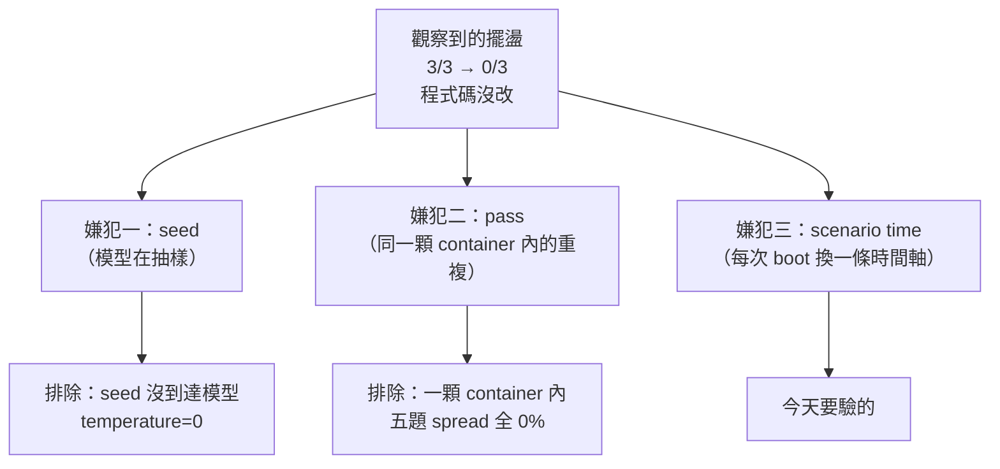

# Day40（番外）：把時鐘當成變數，然後承認尺量不到東西

> 一個論證聽起來越順
> 就越該去跑一次
> 因為它唯一的證據
> 是它自己聽起來很順

前一篇番外的最後補記，推翻了我自己前兩天的結論：`-n 3` 那個「三個 seed」根本沒有進到模型呼叫裡，它只換 LangGraph 的 thread id 跟校準的 run id，而底下那顆做 RCA（Root Cause Analysis，根因分析）的模型是 `temperature=0`。所以三個 seed 是同一個請求送三次，不是在對什麼分布取樣。

那篇因此收在一個**論證**上，不是一個結果。論證長這樣：真正被觀察到的那個擺盪（`order-service-auth-degradation` 這題的對照組，前一個實驗 3/3、下一個實驗 0/3，中間程式碼一個字都沒改）發生在**兩次 invocation 之間**，而每次 invocation 都用 `scenario_time = now` 重開一顆 container。generator 開頭就是 `random.seed(42)`，所以兩次 boot 烤出來的資料結構完全一樣，差別只有整條時間軸平移。而那些絕對時間戳在告警裡、在釘住的時鐘裡、在 agent 算的每一個查詢視窗裡。

聽起來很順。所以更該去跑一次。

程式碼在範例 repo [`OTel_AIOps_Agent`](https://github.com/tedmax100/OTel_AIOps_Agent) 的 [`ironman-2026/day40/`](https://github.com/tedmax100/OTel_AIOps_Agent/tree/main/ironman-2026/day40)。驗證環境：本機 k3d 叢集（2026-08-20 實測）、`demo-services-o11y-stack:latest`，四次完整 boot 各跑一個 pass（完整輸出在 `day40/clock-20260820.txt`），最後再對整套 fixture 跑一輪（`day40/suite-20260821.txt`）。

先講今天的形狀，免得你讀到一半以為我在藏：**這個實驗沒有量到東西，而過程中撞到的那個 bug 比實驗本身有價值。** 兩件事我都照實寫。

## 一、實驗設計：只動一個變數

前面幾天追雜訊，一層一層剝下來已經排除了兩個嫌犯，今天要驗的是第三個：



`spread` 就是同一題在不同條件下最高分減最低分，單位是百分點（pp）。前一天量到的雜訊底線是 ±67 個百分點，那個數字大到任何功能的效果都會被蓋掉，所以才要一路追。

實驗設計很簡單，簡單到有點無聊：**固定 image、固定 fixture、固定 store、固定程式碼，只動 scenario time。**

```bash
python3 ironman-2026/day40/probe_clock_sensitivity.py --only order-service-auth-degradation
```

四個時鐘刻意不是相鄰的四分鐘，而是走過一整個劇本日：不同小時、不同分鐘、其中一個跨過 UTC 午夜。

```
  clock 2026-08-19T04:11:00Z
  clock 2026-08-19T12:37:00Z
  clock 2026-08-19T21:53:00Z
  clock 2026-08-20T00:29:00Z
```

每個時鐘一次完整 boot 加一個 pass，所以四個時鐘就是四顆 container、四輪 API 呼叫，要算錢的。probe 用一個獨立的 store（`clock-probe.db`），不會寫進正式那份紀錄。

## 二、第一次跑，四次 boot 全部失敗

```console
=== scenario time 2026-08-19T04:11:00Z ===
booting demo-services-o11y-stack:latest…
  stack did not produce queryable incident data in time
```

四次都一樣。第一反應當然是環境壞了，重烤 image、重開叢集那套流程在腦中已經排好隊。

但 container 是活的。日誌寫著 `=== Environment Ready ===`，generator 也很得意地印了 `charges=11520 orders=8640 traces=6476 logs=41041`，`/api/v1/label/__name__/values` 拿去問，`user_auth_checks_total` 也真的列得出來。資料在裡面，只是問不到。

問題在 `stack.wait_ready()` 用的是 instant query，而 Prometheus 的 instant query 只看得到**5 分鐘 lookback** 以內的樣本。烤好的資料結束在 scenario time 那一刻，所以拿牆上時鐘去問，除非 scenario time 剛好就是現在，否則回來的永遠是 `"result":[]`。

**這個 readiness 檢查，只有在「scenario time ≈ now」的時候才會過。而那正是這個實驗要動的那個變數。**

以前不會踩到，是因為以前每一次 `--stack` 都沒帶 `--scenario-time`，預設值就是 now。修法很短，把 scenario time 一路帶進 readiness 查詢就好：

```python
def wait_ready(scenario_time: str | None = None, *, timeout: float = 180.0, ...):
    # `scenario_time` must be the one the stack was booted with. An instant query
    # only sees the last 5 minutes, so asking with the wall clock finds nothing.
```

同一顆 container，修完前後：

```
now  : False
clock: True
```

> 這種 bug 我覺得最討厭的地方，是它回報的那句話長得跟真的環境故障一模一樣。`stack did not produce queryable incident data in time`，你要嘛去重烤 image，要嘛去調 timeout，這兩條路都會走很久，而且都通不到答案 QQ

### 這對值班的人為什麼危險

這不是一個實驗腳本的小毛病，它是一個很常見的形狀：**一道前置檢查，它的正確性依賴一個從來沒被寫下來的假設，而那個假設剛好等於你手上唯一沒動過的變數。**

值班的時候，這種東西長成的樣子是：某條 readiness probe、某支 health check、某個「資料有沒有進來」的看板，平常永遠是綠的，因為它跟被監測的東西共用同一個前提。等到那個前提第一次改變（換了時區、換了 retention、換了一個補跑歷史資料的排程），它會在那一天回報一句聽起來像基礎設施壞掉的話，然後把排查的人推向完全錯誤的方向。

它跟這系列前面記過的 histogram 預設 bucket、Loki `count_over_time` 那兩個坑是同一類：**查詢成功、回應有結構、數字或判斷是錯的，而且沒有任何東西會抱怨。** 差別只在這次錯的是一個布林值。

## 三、四個時鐘，判決 spread 0pp

修完之後四次 boot 都過了，跑出來的東西是這樣：

```
  order-service-auth-degradation      0/1   0/1   0/1   0/1   mean 0.0%  spread 0.0pp

  Widest spread across clocks: 0.0pp.
```

四次全錯。這句話**不能**讀成「時鐘沒有影響」。四個 0 之間量不出任何差別，是因為這題四次都貼在地板上，而不是因為它穩定。

底下的分項其實一直在動：

| 時鐘 | 指對服務 | confidence | 掛掉的流程檢查 |
| --- | --- | --- | --- |
| 04:11 | ❌ | 0.80 | 查詢只發了一次就收工 |
| 12:37 | ❌ | 0.70 | （沒觸發） |
| 21:53 | ✅ | 0.70 | `query_loki_logs` 空手而回，沒 discover 就重試 |
| 00:29 | ✅ | 0.80 | `query_prometheus` 空手而回，沒 discover 就重試 |

所以時鐘會改變 agent 走的路、改變它最後指的服務、改變它在哪一步撞牆。**但改不動最終判決，因為判決在這題上從來沒離開過地板。**

第三列跟第四列那個「指對服務」是 100%，判決卻還是 0，是因為評分同時看服務跟根因描述，服務指對了但原因講錯，一樣不算。

誠實的說法是：這次實驗**沒有證實**那個論證，也沒有推翻它。它只證明了在一個四次都答錯的 fixture 上，這個實驗設計問不出問題。要問得出來，得挑一題目前不在地板上的，而現在唯一穩定 100% 的是 `payment-decline-service`，那題是開書考（system prompt 裡的 schema catalog 把答案寫進去了，前面某一天記過這件事）。

## 四、整套跑一次，那個擺盪自己又出現了

實驗做完，順手把整套 fixture 跑一輪當基線更新：

```
aiops-agent eval — 5 fixture(s), 5 run(s), overall correct 40%

  payment-decline-service              100% (1/1)   conf 0.80
  user-service-no-incident             100% (1/1)   conf 0.60
  order-service-discover-before-query    0% (0/1)   conf 0.65
  payment-latency-false-alarm            0% (0/1)   conf 0.60
  order-service-auth-degradation         0% (0/1)   conf 0.70

  regression vs baseline:
    ▼ order-service-discover-before-query: 100% → 0%
```

總分跟前一天一樣是 40%，但**組成整個換了一輪**，而這中間程式碼只動了上面那個 readiness 查詢：

- `user-service-no-incident` 從 0%（三次 `OutputParserException`）變成 100%
- `order-service-discover-before-query` 從 100% 掉到 0%

第二列就是前一天在追的那個擺盪，換一題再演一次：一條完全沒被碰過的程式碼路徑，兩次 invocation 之間 100% → 0%。這次連時鐘都不是刻意動的（照舊 `now`）。

而它掛掉的原因，報表自己講得很清楚：

```
failed process checks (the answer may still read fine):
  x order-service-discover-before-query seed0 — discover_before_retry:
    query_tempo_traces came back empty, retried query_prometheus without discovering
```

把這一行跟第三節那張表的後兩列擺在一起看：

| 出現的地方 | 空手而回的是 | 然後 agent 做了什麼 |
| --- | --- | --- |
| 時鐘 21:53 | `query_loki_logs` | 沒 discover，改參數重試 `query_prometheus` |
| 時鐘 00:29 | `query_prometheus` | 沒 discover，改參數重試 `query_prometheus` |
| 整套跑 | `query_tempo_traces` | 沒 discover，改參數重試 `query_prometheus` |

三次不同的 fixture、三個不同的資料源（Prometheus / Loki / Tempo），同一個失敗形狀：**查詢回空、不去 discover 一次標籤、換個參數再猜一次。** 那是這系列很前面就寫下來的老問題，繞了這麼多天，它還在原地。

所以這幾題的成績目前**主要由「空結果之後 agent 怎麼辦」決定，而不是由抽樣決定**。這句話同時解釋了第二節那四個 0，跟這一節這個 100→0。

> 我承認我對這個結果有一點高興，因為它把「要不要再花錢加抽樣」這個問題直接關掉了。但也只有一點點，因為它同時說的是：前面三天追的那把尺，攔在它前面的根本不是尺的問題 XD

## 五、這條線到此為止

三天追下來，雜訊被剝成三層：


**再往下調抽樣設計，是在打磨一把量不到東西的尺。** 擋在量測前面的已經不是抽樣，是 agent 在第二個劇本上答不對，而它答不對的原因，第四節那張表寫得很清楚。

從平台的角度看，這件事的形狀是這樣：一套 evaluation harness 是平台團隊提供給「改 agent 的人」的介面，而它今天回報的東西有一半在講它自己（readiness 假失敗、seed 沒接到模型、pass 不是抽樣單位）。一個要靠維護者自己去讀原始碼才知道該不該相信的分數，跟沒有分數的差距沒有想像中大。這幾天真正的產出不是那個 0.0pp，是**把「這個數字什麼時候可以信」寫下來了**。

## 今天沒做的事

- **時鐘敏感度沒有結論。** 要有結論，得挑一題目前不在地板上的，或是等 `order-service-auth-degradation` 先能答對。這件事留給後面。
- **`--repeat` 跟 `-n` 的成本效益已經量過，但預設值沒改。** 改它會改變過去每一個數字的意思。
- **readiness 那個 bug 沒有回歸測試。** 修的是 `stack.py`，而要驗到它需要一顆真的 container。
- **probe 沒有斷言、沒進 CI**，跟前一篇的探測腳本一樣，它是給人看的，不是給關卡用的。
- **「空結果之後不 discover」一行都沒修。** 今天只是第三次量到它。

## 小結

總結來說，今天這篇的實驗本身是失敗的：四個時鐘、四次 boot、spread 0.0pp，什麼都沒量到，因為題目本身趴在地板上。

不過過程中撞到的那個 readiness bug 我覺得比實驗值錢。它的形狀是「一道檢查依賴一個沒被寫下來的假設，而那個假設剛好是你今天要動的變數」，這在真的值班環境裡到處都是，只是平常不會有人去動那個變數，所以永遠不知道。

實際用途上，這三天最後留下來的是一句可以拿去跟人講的話：在這座 demo 上，agent 的分數變動主要不是模型在跳，是它遇到空結果時不去 discover 標籤、直接換參數再猜。這句話能被講出來，是因為同一個形狀在三個不同的資料源上各出現一次。要修的東西因此變得很具體，而不是「感覺 agent 不太穩」。

> 我花了三天做一把尺，做完發現要量的東西根本沒站上去。
> 好消息是尺是準的，壞消息是我現在知道它是準的了 XD
