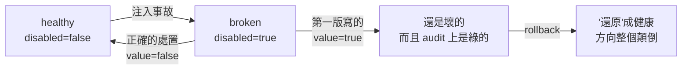
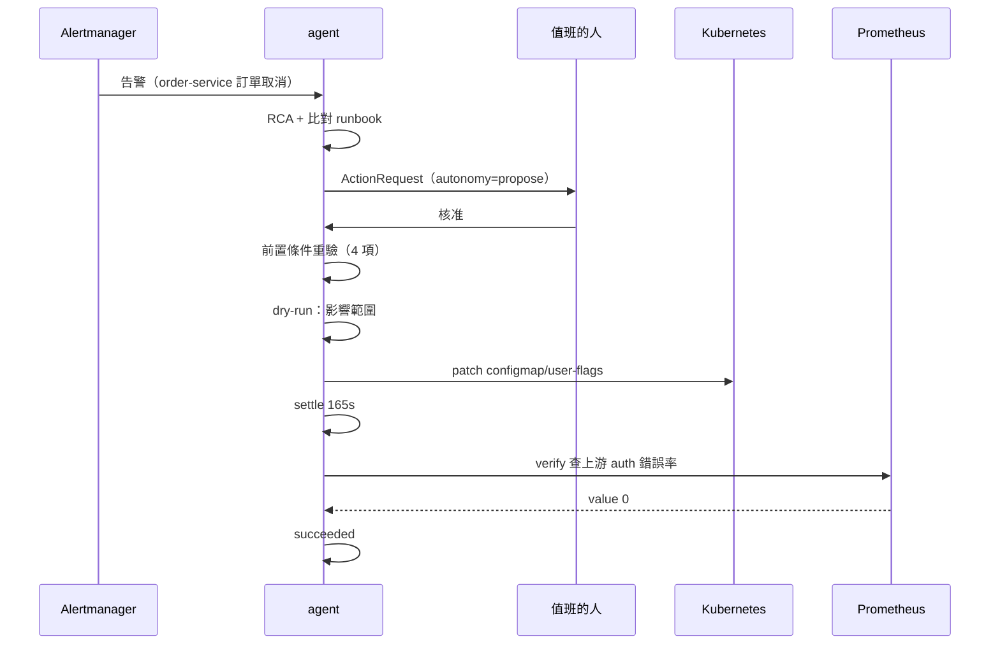
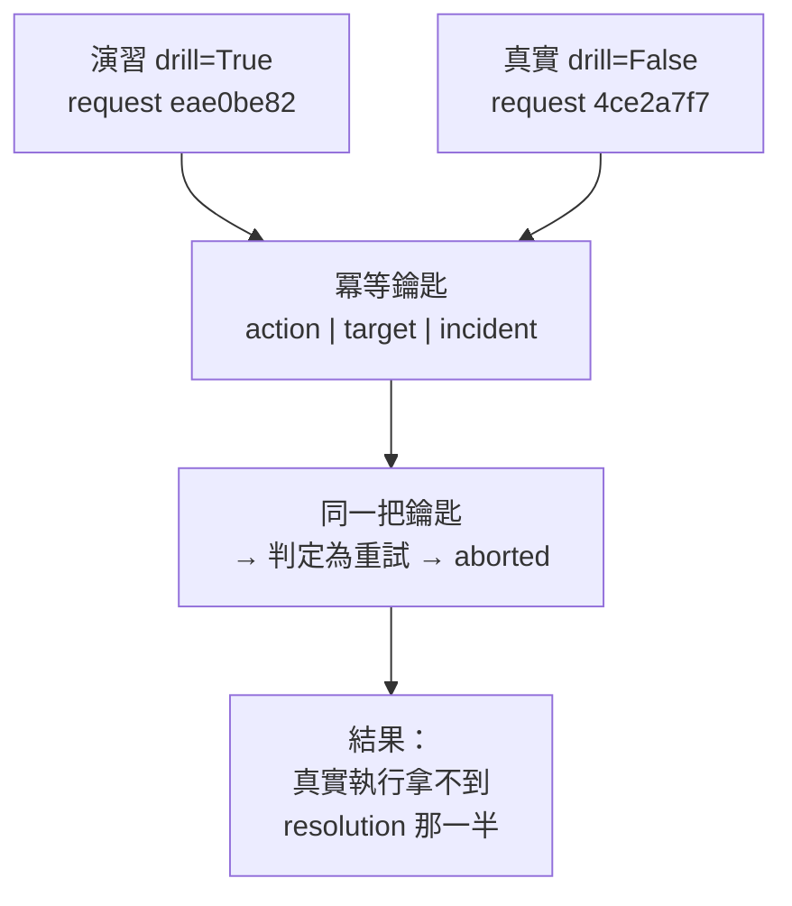
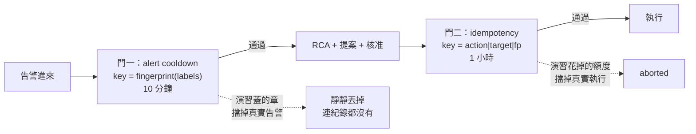

# Day41（番外）：把第二個事故跑完一圈，然後看它到底記住了什麼

> 一個會學習的系統
> 第一次真的跑起來的時候
> 學到的第一件事
> 是錯的
> 而它記得非常清楚

前一篇停在一個結論：agent 的分數變動主要不是模型在跳，是它遇到空結果時不去 discover 標籤。那是**診斷**那一半的事。今天換另一半：**處置**。

前面某一天把迴路關起來過一次，一個事故、一個動作，從告警一路走到執行跟驗證。但那次有個現在回頭看很明顯的問題：**沒有人檢查事後寫下了什麼。** 而從那之後蓋上去的每一層，案例記憶、人的否證、runbook 成績單、`cases.resolution`，全部都站在那一次之上。

第二個事故（session-cache，告警在 order-service、原因在 user-service）到今天為止**根本沒有入口**：沒有 runbook，也沒有一個修得好它的動作。它的原因是一個旗標不是一個版本，所以既有的 `k8s.rollout_undo` 在這裡不只是錯，是**不適用**。

程式碼在範例 repo [`OTel_AIOps_Agent`](https://github.com/tedmax100/OTel_AIOps_Agent) 的 [`ironman-2026/day41/`](https://github.com/tedmax100/OTel_AIOps_Agent/tree/main/ironman-2026/day41)。驗證環境：本機 k3d 叢集（2026-08-20 與 08-22 實測），六次完整跑，輸出分別在 `drill-20260821.txt`（第一輪，假綠燈）、`drill-20260821b.txt`（第二輪，真的）、`nodrill-20260821.txt`（第一次真實執行，被排練擋下來）、`nodrill-20260822.txt`（修完之後，`resolution` 的第一筆），以及 `drill-20260822.txt` 跟 `nodrill-20260822b/c.txt`（兩道門的驗證）。每一輪跑之前跟跑之後都對 store 拍了快照，`.db` 檔也在資料夾裡。

先講今天的形狀：**迴路合起來了，四個 bug 是在合起來的過程中被抓到的，而其中最後那個是我第一次沒數完。** 每一個我都寫。

## 一、能真的修好它的那個動作

`k8s.configmap_flag_set`。demo 的服務每個請求讀一次掛進去的旗標檔，所以在這座叢集上「處置」真正的形狀就是翻旗標：不重啟、不換 image。

三個刻意的決定，每個都是為了擋一種特定的災難：

- **read-modify-write 單一 key。** strategic merge 會把 `flags.json` 整條字串換掉。真正危險的不是 patch 失敗，是 patch 成功、順手把別人一小時前設的另一個旗標還原了。
- **文件裡沒有的旗標直接拒絕。** 一個因為我們寫進去才存在的旗標，不會有任何程式在讀它，所以它翻不翻都不會修好任何事，只會讓 audit trail 上多一筆看起來很有作為的紀錄。
- **dry-run 的影響範圍是「誰掛了這張 map」。** ConfigMap 的 patch 不直接碰到任何一個 pod，所以它的 blast radius 只能算、不能假設。共用的時候寫進 notes，「這張旗標不只是你的」是核准前必須看到的一句話。

RBAC（Role-Based Access Control，角色權限控制）用 `resourceNames` 把寫入權限釘在 `payment-flags` / `user-flags` 兩張上。整個 namespace 放行 `patch configmaps` 會連 collector 的 pipeline 設定跟兩份 datasource 設定一起送出去。

### 旗標的方向差點寫反

`user_session_cache_disabled` 是 **true 代表故障中**（快取關掉、每次 auth check 都掉進慢的 session store），`false` 才是健康。

第一版 runbook 的處置我寫的是 `value: true`。核准下去等於**再按一次故障開關**，而 rollback 會把系統「還原」成健康的狀態。



現在方向釘在測試裡，理由寫在旁邊。而 rollback 依然是**回到壞掉的狀態**，這是對的：undo 的意思是把系統放回值班的人剛剛在看的那個狀態，不是憑空生出第三種沒人見過的組態。

> 這個我踩過的地方在於，一個布林旗標的命名有沒有否定詞，會直接決定我寫 runbook 的時候會不會寫反。`disabled` 這種名字讀起來永遠要在腦中轉一次，而我那次沒轉 :(

## 二、runbook 替 agent 跨過那一跳

`session-cache-timeout.yaml`。它的 diagnostics 自己走到上游：先確認取消集中在 auth 而不是 payment，然後直接查 `user_auth_checks_total{status="error"}`。

留在 order-service 上的每一項檢查都會是健康的，這就是這個事故的形狀，也是 agent 到今天為止跨不過去的那一步（它會回答「order-service 自己的程式碼」然後停下來）。**所以這一跳由 runbook 帶，不留給推理。**

這個取捨要講清楚：把跨服務那一跳寫死在 runbook 裡，等於承認 agent 現在推不出來。它換到的是一次可執行的處置，付出的是「這份知識不會泛化到第三個事故」。我選這個，是因為一個推不出來但能被 runbook 帶著走完的迴路，至少會留下可以檢查的紀錄；而一個推不出來又沒有 runbook 的事故，連錯在哪裡都不會被寫下來。

另外兩個決定：

**沒有提供 `k8s.scale`。** 多幾個 replica 一起等同一個慢的 session store 不是修好。而一個 verify 過不了的動作，失敗的時候會往案例記憶裡寫一件假的事。

**verify 讀上游的訊號，不讀告警自己的指標。** 訂單停了告警就會安靜，但「呼叫器不叫了」跟「auth check 恢復了」是兩個不同的主張。這條在後面第四節會變得非常重要。

## 三、第一次演習：全綠，而且是假的

```
[16:26:15]   request b15df9e51c06424b action=k8s.configmap_flag_set autonomy=propose status=proposed
[16:26:15] approving b15df9e51c06424b (the human in human-in-the-loop)
[16:29:06] terminal state: succeeded  outcome=executed and verified

  phase          verdict      detail
  proposed       ok           {"action": "k8s.configmap_flag_set", "autonomy": "propose", ...}
  approved       ok           {"trace_id": "1e5cb1ec978ac76f8a1aad8ef33fac24"}
  precondition   ok           {"checked": 4}
  dry_run        ok           {"blast_radius": "target demo/user-flags, ..."}
  execute        success      {"result": "{'action': 'configmap_flag_set', ...}"}
  verify         settle       {"settle_seconds": 165}
  verify         pass         {"detail": "value 0 ≤ max_value 0.01"}
```

告警到提案 15 秒，八個 phase 全綠，終端狀態 `succeeded`。

而這座叢集的 Prometheus 當時**一個 demo 指標都沒有**。30 個 metric 全是 agent 自己的 `gen_ai_*` 遙測，沒有 `orders_total`、沒有 `user_auth_checks_total`。

因為我的腳本沒有流量。前一次做迴路演習的時候特地寫了一個 Traffic thread，我這支漏掉了。沒有請求就沒有訂單、沒有 auth check，counter 從來沒被建立過。事故注入了，但**沒有任何東西在壞**。

### 那面綠燈揭出來的 bug

```python
elif rt == "vector":
    if not result:
        val = 0.0        # 「沒有 series = 這個指標是 0」
```

空的 instant vector 被讀成 0，`0 ≤ 0.01`，門開了。

**這對值班的人為什麼危險**：指標改名、scrape target 掛掉、label 被丟掉、relabel 規則改錯，每一種都會讓這道門在它是「一個錯誤的動作」與「案例記憶學到這個動作有效」之間唯一那道防線的時候，全部放行。而且它不會抱怨，audit trail 上是漂漂亮亮的一行 `verify pass`。

真實情境裡這件事的樣子是：凌晨兩點，agent 提了一個處置，值班的人看到 dry-run 的影響範圍還算小就按了核准，三分鐘後系統回報「已執行並驗證通過」，於是這個人回去睡了。而那個「驗證通過」的意思其實是「我看不到那個指標」。

這跟這系列記過的另外兩個坑是同一類（histogram 用預設 bucket 回傳一個假的常數、Loki 的 `count_over_time` 配 `query_range` 把數字膨脹一百多倍）：**查詢成功、數字錯誤、沒有任何東西會抱怨。** 差別在於前兩個只會讓人看到一張錯的圖，這個會放行一次真實的寫入。

修法是 fail-closed：沒有 series 就代表這個查詢看不到症狀，那它就不能宣稱症狀停了。runbook 如果真的需要，可以用 `empty_ok: true` 明講「沒有資料就是我要的訊號」，但那要寫出來，不能是預設。

順手修的第二個藏在帳本裡。executions 上的 `target` 是 `demo/`，尾巴是空的，因為 scope key 只認 `deployment` 這一種，ConfigMap 動作填不進去。結果是整個 namespace 的每個旗標共用**一個斷路器作用域跟一把冪等鑰匙**：其中一個跳閘會把其他全部封住，兩次不同的翻轉會被當成互為重試。現在是 `demo/user-flags#user_session_cache_disabled`。

（這一段的數字都是從 `store-before-*.db` 跟 `store-after-*.db` 兩顆快照直接查出來的，不是從日誌推的。腳本每一輪跑前跑後各拍一次，就是為了事後可以這樣對。）

## 四、第二次演習：這次症狀真的在

腳本補上流量，而且**注入之後、發告警之前**先確認症狀真的存在：

```
[16:34:59] symptom is observable: orders_total and user_auth_checks_total both have series
[16:35:00] alert posted (startsAt=2026-08-20T16:34:59Z, drill=True)
[16:35:20]   request eae0be82321c4f12 action=k8s.configmap_flag_set autonomy=propose status=proposed
[16:38:10] terminal state: succeeded  outcome=executed and verified
```

這次的 `verify pass` 是真的。門已經改成空結果不放行，所以它讀到的那個 `value 0` 來自一條真的存在、而且在處置之後歸零的 series。旗標翻回去、auth 錯誤率掉到 0、`succeeded`。



那個 `settle 165s` 不是隨便挑的：verify 的查詢往回看 120 秒，所以等待時間必須長過那個視窗，否則會撈到處置前的樣本，然後得到一個混了兩種狀態的平均值。

**第二個事故第一次走完整條迴路。** 到這裡為止，今天原本要做的事做完了。

## 五、然後看它記住了什麼，這才是重點

前面那一次演習之所以沒抓到 bug，是因為沒有人去看事後寫下了什麼。所以這次腳本最後多了一段，把案例攤開來：

```
  case key on the request: ffa6ab9638c72564
  occurrences: 2   status: open
  root_cause : (none — nobody has confirmed one)
  resolution : (empty — nothing recorded what fixed it)
  ruled out  : [query] PromQL referencing orders_total, reason
  ruled out  : [query] PromQL referencing reason, user_auth_checks_total
  ruled out  : [query] PromQL referencing reason        (x5)
  ruled out  : [query] PromQL referencing status
```

`resolution` 是空的，這是**設計如此**：演習模式下 `remember_resolution()` 直接 return，排練一個自己注入的故障不是關於真實事故的證據。

但上面那幾列 `ruled out` 不是設計如此。下一次執行拿到的召回區塊長這樣：

```
### Already ruled out here — do not spend budget re-checking
- [query] PromQL referencing reason (no such metric in this Prometheus)
- [query] PromQL referencing status (no such metric in this Prometheus)
- [query] PromQL referencing user_authcheck_duration_seconds_bucket (no such metric ...)
- [query] PromQL referencing reason, user_auth_checks_total (no such metric ...)
```

`reason` 跟 `status` **是 label 不是指標**，這個 Prometheus 裡當然沒有一條叫 `reason` 的 series。而 `user_auth_checks_total` 是這個事故的答案所在。

也就是說，這套系統剛剛學會了「不要去查那個寫著答案的指標」，理由是一個它自己算錯的判斷。

原因在指標名稱的抽取：

```python
_PROM_METRIC_RE.findall('sum by (reason) (rate(orders_total{status="cancelled"}[5m])))')
# → ['orders_total', 'reason']
```

`by (...)` 裡面是 **label 名字**，`{...}` 裡面也是。它們被當成指標名，於是「這裡沒有這個指標」這個判斷永遠成立。而這個判斷被歸類為**環境屬性**（相對於「這個時間窗沒東西」那種暫時性的空手而回），所以它會被寫進案例，跨執行留著。

分類的邏輯本身是對的：一個名字不存在，確實是關於環境的事實，值得長期記住。錯的是餵給它的東西。

修法是抽取之前先把 grouping 子句跟 label matcher 這兩塊拿掉，`by` / `without` / `on` / `ignoring` / `group_left` / `group_right` 都算。

**這一條比 verify 那條更值得記住。** verify 的假綠燈只影響一次執行，一次錯誤的放行；而寫進案例記憶的錯誤死路會**跨執行累積**，而且它長得跟真的一模一樣：同樣的表格、同樣的日期、同樣權威的語氣。前一篇量到的那個 −100 個百分點已經說過，「Already ruled out: X」這個寫法本身就會把 X 送進模型的注意力，而現在連 X 是什麼都是錯的。

> 一個會學習的系統，最貴的不是它學得慢，是它學得很快而且很有自信。這九列死路裡沒有任何一列帶著「這是推出來的」的標記，它們跟人親手標的否證在同一張表、同一種格式裡 ^^

## 六、第一次真的按下去，被自己的排練擋下來

演習跑完，我把 `--no-drill` 打開跑了一次。這是這套系統第一次在非排練模式下走這條路，也是 `cases.resolution` 那半唯一會被碰到的機會。

```
[16:45:01] alert posted (startsAt=2026-08-20T16:45:01Z, drill=False)
[16:45:11]   request 4ce2a7f7f8844cf5 action=k8s.configmap_flag_set autonomy=propose status=proposed
[16:45:11] approving 4ce2a7f7f8844cf5 (the human in human-in-the-loop)
[16:45:16]   status: aborted
[16:45:16] terminal state: aborted
           outcome=idempotent: target already acted on for this incident (eae0be82321c4f12)
```

`eae0be82321c4f12` 是十分鐘前那次**演習**的請求編號。

前置條件過了、dry-run 過了，然後冪等檢查說：這個目標在這個事故上已經被動過了，這是重試，不要再執行一次。

冪等鑰匙是我在第三節才剛修好的那把（`動作|目標|事故`）。它做的事完全正確，錯的是它的組成裡**沒有「這是不是排練」這一格**。



這件事的兩面都要講。往好的方向看，這道門擋住了一次重複的寫入，而它擋的時機是在核准之後、執行之前，也就是它該在的位置。往壞的方向看，**排練跟真的走同一條記憶**，所以在同一個事故上排練過，就等於把真實執行的路封起來了。而正因為排練刻意不寫 `resolution`，被擋掉的那一次也就永遠拿不到寫 `resolution` 的機會。

腳本自己也是這樣講的，因為我在寫的時候就決定讓它對「沒有跑成預期」這件事出聲：

```
[16:45:16] RESULT: NOT as designed — expected succeeded, got aborted
[16:45:16]         That is a finding, not a script bug. Write it down before re-running.
```

我沒有再跑一次去繞過它。要繞過很容易（換一個 alert 的時間戳就換一個事故編號），但那樣量到的就不是這套系統真實的行為了。

## 七、修完之後才發現，同一個病有兩層

後來我把那一格補上了。修法很短：演習的鑰匙加一個 `|drill` 後綴。

後綴加在**演習那一側**是刻意的。正式請求的鑰匙維持原樣，因為帳本裡已經存在的每一把鑰匙都是舊格式，改動正式那側等於順手把過去所有的去重紀錄作廢，那是把一個 bug 換成另一個。

改完部署上去，先跑一輪演習，再在冪等窗內跑真實那次。結果是：**真實那次連 RCA 都沒被叫起來。** 不是被擋，是連一列 investigation 都沒有寫。

原因在更前面：

```python
def fingerprint(labels: dict) -> str:      # alertname | service | git_version
alert_cooldown_seconds: int = 600
```

告警進來的第一件事是去重，key 是 `fingerprint(labels)`，而 fingerprint 不吃 `drill` 這個 label。cooldown 十分鐘寬。演習在 15:26:40 蓋了章，真實告警 270 秒後到，被當成同一個告警重複發，直接丟掉。



**我第一次只數到門二，就以為數完了。** 而擋住的是門一，它在更前面，所以門二那個修法根本等不到人來測。

cooldown 的 key 因此也加上同樣的後綴。但 `fp` 本身**刻意不動**：它同時是 LangGraph 的 thread id 跟案例檢索的 key，切開它會讓排練查到的東西對它所排練的那個事故隱形，那正是前一篇番外記過的「太窄」那個毛病，我不想為了修一個而製造另一個。

再跑一次，鑰匙自己把結果講完了：

```
15:42:16  2eae7c48  ...|2b0a13c99c8f670a          aborted   superseded_by 92690e75（真實）
15:40:17  0ac80e85  ...|2b0a13c99c8f670a|drill    aborted   superseded_by 7ebc84ac（演習）
15:26:48  7ebc84ac  ...|2b0a13c99c8f670a|drill    succeeded
15:15:52  92690e75  ...|2b0a13c99c8f670a          succeeded
```

15:42 那次真實告警**通過了 cooldown**，提案有被建出來，這是修之前沒發生過的事。它最後仍然 aborted，但這次 `superseded_by` 指的是 15:15 那次真實執行，不是一次排練。一小時內對同一個事故同一個目標做第二次真實處置，本來就該擋。同樣一個 `aborted`，理由從錯的變成對的。

而 15:15 那一次，寫下了這套系統成立以來的第一筆 `resolution`：

```
resolution : {"action": "k8s.configmap_flag_set", "runbook_id": "session-cache-timeout",
              "request_id": "92690e7562a54af8", "verified": true}
retracted  : 9 dead end(s) kept as history, not recalled
```

`root_cause` 還是 `None`，這是對的：修好了不等於診斷對了，那要有人標。

> 這一段的教訓我覺得不是「少寫了一格」。是**排練跟真的在這套系統裡共用了幾條路徑，我只數到一條就以為數完了**。該問的問題是「一次排練會在哪些地方被誤認成真的」，而不是「哪一把 key 少了欄位」。前者會讓你去把整條路徑走一遍，後者只會讓你修好眼前那一個 :(

## 今天沒做的事

- **沒有跑出一張「演習之後、真實那次全綠」的完整截圖。** 要那個畫面得等一小時讓真實那側的冪等窗過期。上面那段是靠鑰匙的形狀跟 `superseded_by` 指到誰來證明的，我覺得夠硬，但它不是一次一路綠到底的執行。
- **`fp` 一個欄位兼好幾份差事那件事沒動。** 這次只在 cooldown 這一格加了「排練 vs 真的」這個區分，前一篇番外那張「三種粒度、一個欄位」的表本身還在那裡。
- **這座叢集上每個事故都是注入的。** 所以 `resolution` 那一筆嚴格說是「一次真實執行修好了一個我自己注入的故障」。排除排練是對的，但「等一個真的事故」在這裡不是一個計畫，這個取捨腳本做成一個有預設值的旗標，沒有替我決定。
- **`k8s.scale` 仍然可以被提案在這個事故上。** runbook 沒提供它，不代表治理關卡會擋它。
- **第二輪的 RCA 到底答對了沒有，這裡沒有量。** 今天量的是處置迴路，不是診斷正確率，而診斷正確率正好是前一篇停下來的地方。
- **verify 的 `empty_ok` 沒有任何一份 runbook 在用**，所以那條分支只有單元測試走過。

## 小結

總結來說，今天做的事情用一句話講就是「幫第二個事故補上入口，然後真的按下去」。迴路合起來了，第二個事故第一次從告警走到驗證通過。

但今天真正的產出是四個 bug，而它們有一個共同的形狀：**都是在「事後檢查系統寫下了什麼」的時候才浮出來的，沒有一個會讓任何一次執行變紅。** verify 讀到空結果當成 0，audit 上是綠的；PromQL 的 label 被當成指標名，案例記憶長得很正常；冪等鑰匙少一格，它甚至是**對的**行為，只是後果不是我要的；而告警的 cooldown 少同樣一格，症狀是一次調查完全不存在，沒有任何一張表會記下「這裡本來該有一次調查」。

這件事對做這類系統的人的意思是，自動處置的品質門檻不在「它敢不敢動手」，在「它動完手之後留下的紀錄，經不經得起有人真的打開來看」。一個沒有人看的 audit trail，跟沒有 audit trail 的差別，只在出事之後開會的時候比較好看。

實際用途上，這幾天最能搬走的是那個習慣本身：每一輪跑前跑後各拍一次 store 快照，然後跑完印一段「這個事故學到了什麼」。就是這一段，把一個八個 phase 全綠的成功演習，變成兩個 bug。

> 我原本以為今天最難的是讓它敢按下去。
> 結果最難的是按完之後，看懂它到底以為自己做了什麼。
> 而且我還數錯了一次門的數量 XD
