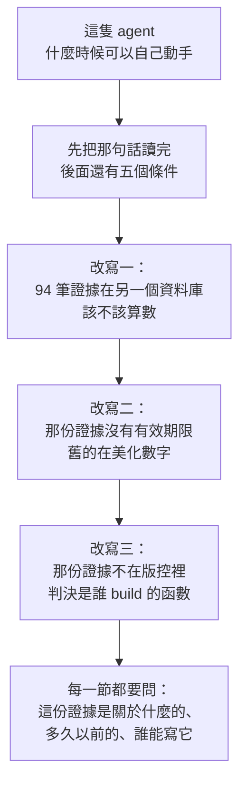
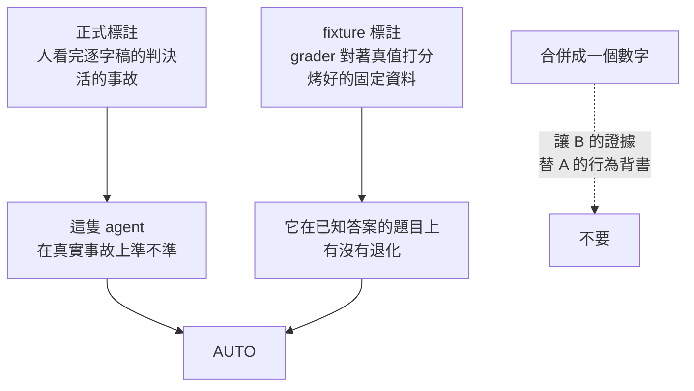

# Day42（番外）：問「它為什麼還不能自己動手」，然後發現問題不在它身上

> 一道關卡只會告訴你
> 它第一個看不順眼的東西
> 而那通常是最便宜的那個
> 不是最重要的那個

前一篇把第二個事故的處置迴路跑完了：告警 → runbook → 提案 → 人核准 → 執行 → 驗證，全綠。但那條路上每一次都有人按下核准，一次都沒有例外。

先補一句背景，因為這幾天的東西是疊在它上面的。這套系統決定「一個動作要不要人點頭」的時候，autonomy 有三級：`ESCALATE`（連按鈕都不給，直接丟回給人）、`PROPOSE`（生一張提案，等人核准）、`AUTO`（自己執行）。而 `AUTO` 前面掛著四道關卡，每一道都要「有紀錄證明它是好的」才放行，分別問四個不同的問題：**校準**（這隻 agent 的信心可不可信）、**資料品質**（它看到的那張系統圖是不是真的）、**執行就緒**（寫入憑證現在還能不能用）、**runbook 健康**（這套程序自己的紀錄說它修不修得好）。四道全過，才輪到 AUTO。

這套系統送出過 24 筆處置提案，`autonomy` 欄位**清一色是 `propose`**，`AUTO` 一次都沒觸發過。而治理給的理由，從第一天到今天都是同一句：

```
calibration unproven (7 labeled run(s) < 20); autonomy withheld
```

聽起來像文書工作。多標幾筆就好了嘛。

我今天要做的事情很單純：**把那句話後面的東西全部讀出來。** 結果那個答案被改寫了三次，而三次都不是關於 agent 聰不聰明。

程式碼在範例 repo [`OTel_AIOps_Agent`](https://github.com/tedmax100/OTel_AIOps_Agent) 的 [`ironman-2026/day42/`](https://github.com/tedmax100/OTel_AIOps_Agent/tree/main/ironman-2026/day42)，改的是 agent 服務自己的 `governance.py`、`config.py` 跟 `eval/`。驗證環境：本機 k3d 叢集（2026-08-23 實測），探測腳本唯讀，完整輸出在 `day42/gates-20260823.txt`，測試從 585 條長到 606 條。

今天這一天的形狀，用一張圖講完比較快：



## 一、關卡只回報它第一個看不順眼的東西

先看那個探測跑出來的東西。AUTO 前面不是一道門，是六個條件串聯：

```
production curve  (labels from people, on live incidents)
  FAIL  labeled runs                       want >= 20        got 7
  FAIL  human/grader labels                want >= 20        got 7
  FAIL  mean overconfidence                want <= 0.1       got 0.3929
  PASS  labeled runs at conf >= 0.8        want >= 3         got 5
  FAIL  accuracy in that band              want >= 0.7       got 0.2
  FAIL  worst bin off by                   want <= 0.25      got 0.8167 ([0.8,0.9))
```

那句「7 < 20」是真的，它只是**第一個**失敗，而且是六個裡面最便宜的一個。

第五條才是要看的：**agent 說信心 0.8 以上的時候，五題對一題。** 門檻要 0.7，實際 0.2。

那七筆標註攤開來長這樣：

```
conf 0.2   correct=True    ← 沒把握，答對了
conf 0.2   correct=False
conf 0.8   correct=False   ← 這三筆都把原因說成 database connection
conf 0.8   correct=False
conf 0.85  correct=False
conf 0.95  correct=True
conf 0.95  correct=False
```

信心 0.2 的時候二題對一題（50%），信心 0.8 以上的時候五題對一題（20%）。在這份樣本上，**信心跟正確率是反向的**。

所以「多標幾筆就能開 AUTO」這個推論整個是錯的。補標註不會打開任何東西，它只會把後面那三個失敗量得更精確。

> 這個我踩過，而且踩得很典型：一道關卡的錯誤訊息就是它的介面，而我讓它只講第一句話。前面講治理的時候寫過「失敗的時候，錯誤訊息夠不夠讓對方自己修好」，那時候講的是產品團隊被擋下來的情境。結果我自己被自己的關卡擋了幾個月，也一樣沒去讀完 XD

## 二、有 94 筆標註在另一個資料庫裡

第一次改寫。

eval harness 每跑一輪 fixture，都會拿 grader 對著已知真值打分，然後把結果寫進 calibration。問題是它寫的是 `app/eval/eval.db`，跟正式的 `/data/aiops.db` 是兩個檔案。

```
正式 store：  7 筆，全部 source='ui'
eval store： 94 筆，全部 source='eval-harness'
```

而 `eval-harness` **不在** `_SELF_LABEL_SOURCES` 那份排除清單裡。按這套系統自己的規則，它是算數的外部證據（grader 不是 agent 自己驗自己），只是治理從來沒看到它。

那要不要合併？我算了一下合併之後會發生什麼：

| | 現在（7 筆） | 併入之後（101 筆） | 門檻 |
| --- | --- | --- | --- |
| 標註總數 | 7 | 101 ✓ | 20 |
| overconfidence | +0.393 | +0.242 | ≤0.1 |
| 帶內正確率 | 0.20 (n=5) | 0.486 (n=35) | ≥0.7 |

**前兩道門會立刻開。** 而那正是我決定不合併的理由。

合併等於讓「在烤好的固定資料上跑出來的成績」，去替「對一個活的叢集寫入」背書。而前一篇番外剛好量過那個背書值多少：同一題 fixture，只換 scenario time 重開一顆 container，100% → 0%，程式碼一個字都沒改。



所以做法是**分開計、都要過**。`regression_verdict()` 就是開頭那四道之後的第五道，形狀刻意跟前面幾道一模一樣（`{proven_good, note}` 兩個欄位），`decide()` 現在五道全過才給 AUTO。同一把尺、兩份證據。

刻意做成同一個形狀是有理由的：這五道問的是五件不同的事，但它們對呼叫端應該長得一樣，不然每加一道就要動一次 `decide()` 的骨架。而**回報的時候又必須分得開** —— PROPOSE 的理由會講明是哪一道擋的，不然值班的人只知道「被擋了」，不知道該去修哪一份證據。

有兩個測試專門釘住這件事的兩個方向，其中比較重要的是這個：**一份乾淨的 fixture 成績單，不能救一條爛掉的正式曲線。** 那就是分開計的全部意義。

## 三、那份 fixture 證據在美化數字

第二次改寫，而這個是我沒預期的。

接好之後我順手看了一下，發現新加的這道門是五道裡**唯一沒有有效期限**的。DQ 有 `dq_max_reconcile_age_seconds`，actuation 有 `actuation_max_age_seconds`，兩個都會 stale、都會在 note 裡講自己多久前查的。這道新的沒有，於是它在讀七週的 label 池。

把同一條曲線用不同的時間窗算一次：

```
    window  labeled   overconf  band n  band acc  worst bin
        7d       32     0.4156      12    0.8333  0.7 ([0.7,0.8))
       14d       32     0.4156      12    0.8333  0.7 ([0.7,0.8))
       30d       41     0.2683      16     0.875  0.5571 ([0.7,0.8))
       60d       47     0.1936      18    0.8889  0.5 ([0.7,0.8))
       all       47     0.1936      18    0.8889  0.5 ([0.7,0.8))
```

**窗開越大，數字越好看。** 六月底那批 label 對應的 agent 跟現在這隻不是同一份程式碼，它們卻還在投票說它校準得很好，而且把平均 overconfidence 從 0.42 一路稀釋到 0.19。

這個結果讓一個決定變得很簡單：收窄時間窗會讓這道門**更難過**，不是更好過。所以加 freshness 不會有「我是不是在幫自己開門」的疑慮。

`governance_fixture_max_age_days = 14`。挑這個數字的理由我寫在 config 旁邊：那是現有紀錄上還撐得過 20 筆樓層的最短窗（32 筆），同時把六月那批甩掉。老實說時間只是代理指標，真正該用的 key 是「產生這些 label 的程式碼版本」，而 calibration 那張表沒有這個欄位。

順帶一個反直覺的：帶內正確率其實一路都是過的（0.83–0.89），擋住 fixture 這側的是 overconfidence 跟最差 bin 偏離。也就是說 agent 在 fixture 上答得還行，但它對自己的把握程度估得很爛。

### 這對值班的人為什麼危險

一個沒有有效期限的品質紀錄，會在一個很難察覺的時機咬人：**系統剛改壞的那幾天。**

那正是紀錄裡「舊的好資料」最多、「新的壞資料」最少的時候。平均值會很漂亮，而漂亮的來源是幾個月前那個已經不存在的版本。如果這個平均值控制的是「要不要讓機器自己動手」，那它會剛好在最不該放行的那一週放行。

這跟這系列前面記過的那幾個坑是同一家族（histogram 用預設 bucket 回傳假常數、Loki 的 `count_over_time` 配 `query_range` 膨脹一百多倍、空的 instant vector 被讀成 0）：**查詢成功、數字錯誤、沒有任何東西會抱怨。** 只是這次錯的那個數字，是用來決定要不要相信一台機器的。

## 四、然後我發現那份證據根本不在版控裡

第三次改寫，這個最難看。

```
aiops-agent/service/.gitignore:8:app/eval/eval.db
```

而 `Dockerfile` 那行是 `COPY app /app/app`。

所以那個檔案會被烤進 image，**只因為它剛好在我這台機器的硬碟上**。換一台電腦、CI、或任何人 clone 之後 build，image 裡根本沒有這個檔，這道門就回 `no fixture record to read; autonomy withheld`。

fail-closed，所以不危險。但**這道門的判決是「誰 build 的 image」的函數**，而且沒有人看得出來。它拒絕的訊息，跟「證據不夠好」長得沒兩樣。

這正是這個系列從第一天罵到現在的那種東西，只是這次是我自己寫的 :(

證據因此搬進 `app/eval/fixture_record.jsonl`，94 列、17KB，進版控。`eval.db` 退回成 harness 自己的工作檔。只留曲線算得到的欄位，run 的散文拿掉（不然 diff 沒法讀），`run_id` 留著因為它帶 fixture 名字，那是 diff 對人有意義的原因：

```json
{"confidence": 0.8, "correct": true, "grading_mode": "culprit",
 "run_id": "eval-payment-decline-service-seed1-1782834034",
 "source": "eval-harness", "ts": "2026-06-30T15:41:28Z"}
```

兩個後果我想強調，因為它們是目的不是副作用：

**「誰能寫解鎖 AUTO 的證據」變成「誰能 merge 一個 commit」。** 這是我在選路線的時候最在意的一件事。另一個方案是把這份資料放進叢集的 PVC、讓 harness 跑完直接推上去，隨時新鮮。但那樣一來，任何能寫那個檔案的人就能開 AUTO，等於在治理旁邊開一條後門。用 commit 當通道，這件事就自動落回既有的 code review 流程，不用再發明一套權限。

**image 自帶自己的成績單。** 這個版本的 agent，配這個版本賺到的 label，那正是這道門在問的事，也是為什麼它不從外面抓一份更新的來讀。

`python -m app.eval run` 跑完會 append 新 label、印一行「去看 diff」，然後停在那裡，不會替你 commit。`--no-record` 留給那種不該替任何事背書的實驗。

驗證的方式是把工作樹複製一份、**把 `eval.db` 拿掉**、在那份上跑 gate：

```
gate on a checkout with NO eval.db:
  note = fixtures: overconfident by +0.4156 > 0.1; autonomy narrowed (newest label 2d ago)
  labeled = 32
```

一樣的數字。以前這個情境會回「沒有紀錄可讀」。

> 這一段讓我想到一件不太舒服的事：這套系統花了很多天在檢查遙測資料可不可信、runbook 有沒有紀錄、寫入憑證還能不能用，然後**它自己用來決定要不要放權的那份證據，躺在一個 `.gitignore` 裡面**。要求別人拿出證據的人，通常是最後一個檢查自己證據的人 ^^

## 今天沒做的事

- **AUTO 還是沒開，而且短期內不會開。** 這是「分開計、都要過」的直接後果，選這條路的時候就知道，不是意外。
- **正式那側的 7 筆標註沒有增加。** 要開 AUTO 仍然得有人在 plugin 上標到 20 筆以上，而且準確度要比現在好很多，而後面那件事不是標註能解決的。
- **那六個門檻沒有一個有量測支撐。** 我今天只確認了現值離它們有多遠，沒有回答「0.7 這個數字為什麼是 0.7」。
- **兩側共用同一組門檻。** 目前是刻意的「同一把尺」，如果之後想給 fixture 側不同標準，得拆成兩組。
- **`regression_verdict()` 每次提案都重讀一次紀錄**，沒有快取，跟 DQ、actuation 那種有 refresh 機制的不一樣。檔案小所以先不管。
- **那條 0.486 的曲線一行都沒修。** 而它的成因在前一篇停下的地方：agent 遇到空結果不去 discover 標籤。

## 小結

總結來說，今天什麼功能都沒做，只是去讀了一句我看了幾個月的錯誤訊息的後半段。而讀完之後，「這隻 agent 什麼時候可以自己動手」這個問題的答案改寫了三次，三次都不是關於 agent。

第一次是**證據放在哪個檔案，決定了它算不算數**。同一批 grader 標註，寫進 `eval.db` 就是零，接上治理就變成一個要慎重決定要不要採信的東西。第二次是**沒有有效期限的品質紀錄，會在系統剛改壞的時候最好看**。第三次是那份證據躺在 `.gitignore` 裡，於是一道關卡的判決變成了誰 build 的函數。

而讓這三件事被看見的，是一個更小的習慣：**把錯誤訊息讀完**。那句「7 < 20」擋了我幾個月，而它後面還有五條，其中一條說的是這隻 agent 越有把握就越容易錯。

對做這類系統的人，我覺得最能搬走的是中間那件事的形狀：自主權不是一個開關，是一條證據鏈，而鏈子上每一節都要問「這份證據是關於什麼的、多久以前的、誰能寫它」。這三個問題我今天各答錯了一次。

實際用途上，這幾天留下最有用的東西是那支探測腳本。它把「為什麼還不能自主」從一句錯誤訊息，變成一張六條的表——而那張表裡有五條，是我原本以為只有一條的時候看不見的。

> 我本來以為這一天會是「把 AUTO 打開」。
> 結果是我花了一整天，讓它拒絕得更有道理一點 XD
