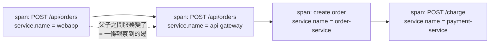
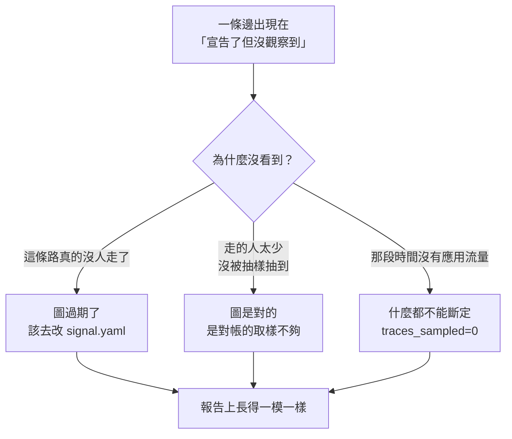
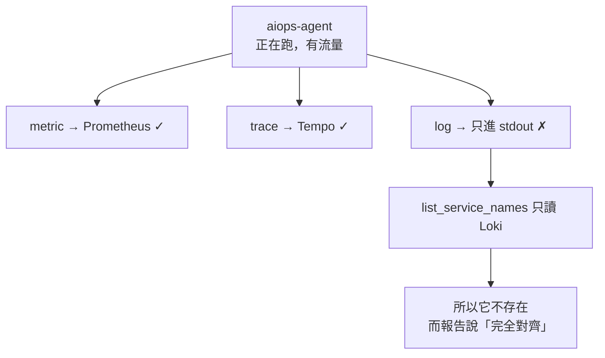
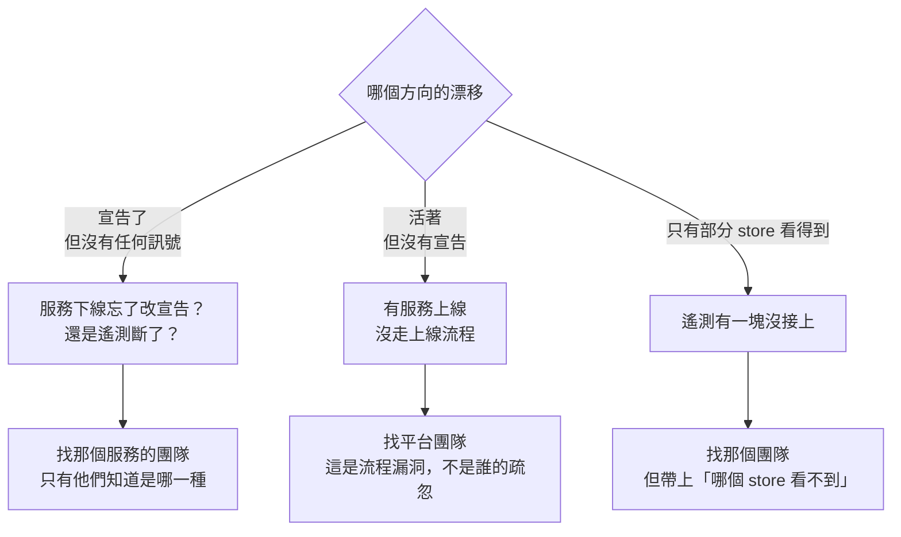
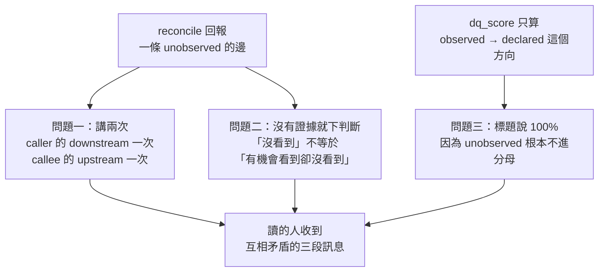
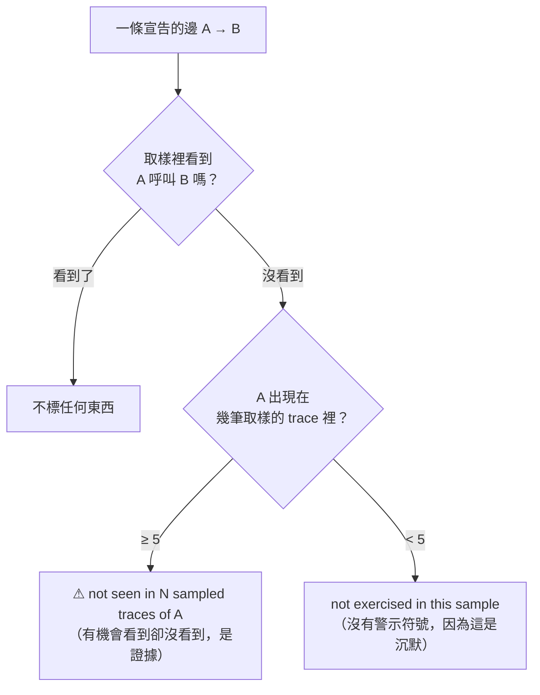

# Day14：那張圖準不準，跟一份 100% 的報告為什麼是壞的

> 一張沒有人驗過的架構圖
> 跟一張畫錯的架構圖
> 在會議室的投影幕上長得一模一樣

昨天那張九宮格，中間「對帳」那一欄三格全是空的，而其中一格的具體長相是這樣：

```console
$ uv run python -c "from app.signals.reconcile import get_last_drift; print(get_last_drift())"
None
```

那個 `None` 是對帳結果的快取。沒有人跑過對帳，它就一直是 `None`，而負責算 DQ（Data Quality，資料品質）的那支 `dq.py` 拿不到它的時候，只會回一句 `topology not reconciled against live traces; DQ unproven`。這句話的意思不是圖畫錯了，是從來沒有人去驗過。今天就是去驗那一次，而驗完會發現要問的其實是兩個問題：那些邊對不對，以及**那張圖上該有誰**。

程式碼在範例 repo [`OTel_AIOps_Agent`](https://github.com/tedmax100/OTel_AIOps_Agent) 的 [`ironman-2026/day14/`](https://github.com/tedmax100/OTel_AIOps_Agent/tree/main/ironman-2026/day14)。要跑的 `reconcile.py` 是 agent 服務自己的原始碼，我一個字都沒改，這個資料夾裡放的是「跑之前該先確認什麼」的兩支工具。驗證環境是 k3d 叢集 `demo` namespace 裡的 Tempo 2.6.0、Loki 3.2.0 跟 Prometheus v2.55.0，底下的輸出都是對著這座 stack 真的跑出來的，最近一次重跑是 2026-08-16。

## 一張沒人對過的圖，比沒有圖更危險

`topology.yaml` 宣告了六條邊：誰呼叫誰。agent 拿它來決定「這個服務的錯誤該怪它自己，還是怪它下游」。

問題是這種宣告的圖有一個很難察覺的失效模式。它不會壞掉，它只會慢慢跟現實脫節。某個團隊上週把同步呼叫改成走訊息佇列了，某個服務三個月前就沒有人在打了，而那份 YAML 一個字都不會變。**沒有圖的時候 agent 會說「我不知道依賴關係」，有一張過期的圖，它會很有自信地把你指向一個早就不存在的方向。**

所以這張圖必須是一份持續跟遙測對齊的東西，不是一頁 wiki。而要對齊，得先回答一個問題：怎麼從 trace 裡看出一條邊。

答案比想像中簡單，而且不需要任何額外的埋點。用 httpx 加 FastAPI 的自動注入時，服務 A 呼叫服務 B，A 會產一個 CLIENT span，B 會產一個 SERVER span，而 B 的 SERVER span 的 parent 就是 A 的 CLIENT span。也就是說，`service.name` 剛好在呼叫的那一刻改變。



所以判斷條件只有一行：一個 span 的服務跟它 parent 的服務不一樣，那就是一條觀察到的邊。

```python
for sid, svc in svc_of.items():
    psvc = svc_of.get(parent_of.get(sid))
    if psvc and svc and psvc != svc:
        edges.add((psvc, svc))
```

把一批 trace 這樣掃過去，取聯集，就得到「觀察到的邊」的集合。跟宣告的那六條做集合運算，就是兩份清單：宣告了但沒觀察到，以及觀察到但沒宣告。

## 第一次跑，六條邊全滅

```console
$ uv run python -m app.signals.reconcile
topology v1.0.0 reconciled against 0 traces
  declared=6 observed=0 dq_score=None
  declared but not observed (stale or low traffic):
      api-gateway → order-service
      api-gateway → payment-service
      api-gateway → user-service
      order-service → payment-service
      order-service → user-service
      webapp → api-gateway
```

六條邊，一條都沒觀察到。如果照字面讀，這份報告在說「你宣告的整張圖跟現實完全對不上」。

而它其實只是在說沒有流量。`traces_sampled` 是 0，那一行就寫在最上面，但它排在報告的第一行、字很小，而下面那六條紅通通的邊佔了整個畫面。`dq_score` 給的是 `None` 而不是 `0.0`，這個區分是對的（沒有資料，跟資料顯示一致性為零，是兩件事），但這個區分只活在那個回傳值裡，沒有活在人看到的畫面上。

會沒有流量，是因為 `reconcile` 在搜尋的時候套了一個過濾器 `{ trace:duration > 5ms }`。這個過濾器是必要的，我寫了一支小工具去看那段時間 Tempo 裡到底有什麼：

```console
$ python3 ironman-2026/day14/tempo_probe.py http://localhost:3210 120
http://localhost:3210 → Tempo 2.6.0 (rev e85bbc57d)
  last 120s: 31 traces
    slowest seen           : 0ms
    survives the >5ms filter: 0
    ⚠ reconcile would sample 0 traces here and report every declared
      edge as unobserved. That is 'no traffic', not 'the graph is wrong'.
```

兩分鐘裡 31 筆 trace，最長連 1 毫秒都不到，全部是 kubelet 打的 `GET /health` 跟 `GET /healthz`。沒有應用流量的時候，Tempo 裡就只剩下健康檢查，而且它們不跨服務，一條邊都貢獻不了。不濾掉它們，那個取樣上限會被探針吃光。**但同一個過濾器，在沒有應用流量的時候會把畫面清成全空，而全空跟「圖全錯」在報告上長得一模一樣。**

在拿到這個結論之前我先繞了一大圈：`kubectl port-forward` 把 Tempo 轉到本機 3200，curl 得到回應、reconcile 拿到 0 筆、collector 說它送出了四萬多個 span 而且零失敗、Tempo 的 log 說它正在寫 block，每一個元件都說自己沒事，資料卻不在。真相是那句 port-forward 根本沒成功（`bind: address already in use`），本機 3200 早就被另一座 k3d 叢集的 load balancer 佔著，那座叢集裡也有一個 Tempo，版本 2.10.3，資料本來就停在兩小時前。兩個東西共用一個埠號，失敗的那個安靜地退場，而活著的那個照常回答問題。我後來把「這個位址上的 Tempo 到底是哪一版」加進那支探針工具的第一行輸出，就是因為這件事：**一個對帳工具在報告差異之前，得先能證明它在跟正確的對象講話。**

> 這是這個系列第幾次遇到「空結果沒有錯誤訊息」我已經數不清了。第一天是 Prometheus 回 `status: success` 加空陣列，這次是一個對帳報告的空集合。形狀完全一樣：查詢成功、結果是空的、而空的原因有兩種，工具不告訴你是哪一種。

## 那條邊到底存不存在

灌了 70 秒的流量再跑一次，這次像樣了：

```console
topology v1.0.0 reconciled against 50 traces
  declared=6 observed=5 dq_score=1.0
  declared but not observed (stale or low traffic):
      api-gateway → payment-service
```

取樣 50 筆 trace，宣告六條、觀察到五條，`dq_score` 是 1.0。那個 1.0 的意思要看清楚，它算的是「觀察到的邊裡面，有幾成是宣告過的」。1.0 代表沒有任何一條真實流量走在圖上沒有的路徑上，這是刻意選的方向，因為`未宣告的邊`是比較危險的那一種：它代表有人加了一個依賴而沒有人知道。

剩下那條 `api-gateway → payment-service` 是宣告了但沒觀察到。到這裡，一份正常的排查會停在「這條邊大概是舊的，去問問看還有沒有人在用」。我沒有停在那裡，因為那個括號裡寫著 `stale or low traffic`，兩種可能塞在同一個清單裡。

先去翻原始碼，api-gateway 確實有這條路（`POST /api/payments` 直接代理到 payment 的 `/charge`），只是 `load.sh` 的端點組合裡沒有直接打它，付款都是經由 order-service 進去的。手動打了十二次之後再跑，結果沒變，還是 `unobserved`。於是我去 Tempo 裡撈一筆真的走過那條路的 trace，把同一個函式套上去：

```console
$ uv run python -c "
import asyncio, httpx
from app.signals.reconcile import edges_from_trace
async def m():
    async with httpx.AsyncClient() as c:
        r = await c.get('http://localhost:3210/api/traces/<那筆 trace id>')
        print('edges in that one payment trace:', sorted(edges_from_trace(r.json())))
asyncio.run(m())
"
edges in that one payment trace: [('api-gateway', 'payment-service')]
```

**那條邊看得見，是對帳沒有看到它。** 問題出在取樣：`reconcile` 預設抓 50 筆 trace，而那段時間 Tempo 裡的 trace 由結帳流量主導，我那十二筆付款請求根本沒被抽中。同一份程式碼、同一個視窗、同一座 stack，只把取樣數往上調：

```console
max_traces=50   sampled=50   observed=5  dq=1.0  unobserved=[('api-gateway', 'payment-service')]
max_traces=100  sampled=100  observed=5  dq=1.0  unobserved=[('api-gateway', 'payment-service')]
max_traces=300  sampled=300  observed=6  dq=1.0  unobserved=[]
```

50 跟 100 說這條邊死了，300 說一切正常。而預設值是 50。

這三個數字別當成常數看。今天重跑一次，一樣先打十五筆付款進去，50、100、300 全部都說沒看到，一路調到 600（那個十分鐘的視窗裡其實只撈得到 474 筆）才觀察到六條邊。**會變的不是那條邊，是它在那個視窗裡佔多少比例**，而那正是這件事最麻煩的地方：同一份程式碼、同一張圖，答案取決於你什麼時候問。



三種原因，一種呈現。而它們的處置完全相反：第一種要去改宣告，第二種要去改對帳的參數，第三種什麼都不該做。而那份 `-m app.signals.reconcile` 印出來的報告，**把一個統計取樣的結果用一個斷言的語氣印出來**：`observed` 的意思是「這個視窗裡至少有這幾條」，不是「總共就這幾條」；`unobserved` 的意思是「我沒看到」，不是「它不存在」。但這兩個詞印在同一張畫面上，讀起來的份量是一樣的。

公道話得講，這個模組本身其實留了東西給後面用。`TopologyDrift` 裡有一個 `caller_samples`，記的是每個服務出現在幾筆取樣的 trace 裡，所以「api-gateway 跑了 40 次都沒走這條邊」跟「api-gateway 根本沒被抽到」在資料上是分得開的。分不開的是那份 CLI 的輸出，它把這個欄位整個略過了。

> 稀有路徑本來就是最難用取樣看到、也最值得知道的東西。錯誤處理的分支、降級的備援路徑、只有月底才會走的結算流程，全部都是低流量高風險。而一個照流量比例取樣的對帳，剛好對它們最盲。

## 那更前面的問題：這張圖上該有誰

上面整件事有個前提我沒有質疑過：那張圖上的五個服務，是誰決定的。

答案是我。`topology.yaml` 裡那五個節點，是五個服務各自的 `signal.yaml` 編出來的，而那五份檔案是人寫的。如果有第六個服務跑起來卻沒有人寫那份宣告，這整套東西不會有任何反應。

agent 服務裡本來就有一個函式在做這件事，`list_service_names()`，讀的是 Loki 的 `label/service_name/values`，而 `topology.py` 也早就有一支 CLI 把它接起來了。跑一次：

```console
$ uv run python -m app.signals.topology validate
topology v1.0.0 aligns with 5 live services
```

宣告五個，活著五個，完全對齊。這是第一個答案，而它是錯的。

> 順帶一提，那個 `start`／`end` 不是可有可無的。Loki 的 label values 端點沒給時間範圍會回一個空陣列而不是報錯，這個坑我在別的地方踩過一次。又是同一個形狀：查詢成功、結果是空的、沒有任何東西說你少給了參數。

會去懷疑，是因為前面翻 Tempo 的時候看到過一個不在那五個裡面的名字。所以我把同一個問題分別問了三個 store：

```console
$ curl -s ".../loki/api/v1/label/service_name/values" | jq -c .data
["api-gateway","order-service","payment-service","user-service","webapp"]

$ curl -s ".../api/v1/label/service_name/values" | jq -c .data
["aiops-agent","api-gateway","order-service","payment-service","user-service","webapp"]

$ curl -s ".../api/v2/search/tag/resource.service.name/values" | jq -c '[.tagValues[].value]|sort'
["aiops-agent","api-gateway","order-service","payment-service","user-service","webapp"]
```

Loki 說五個，Prometheus 說六個，Tempo 說六個。多出來的那個是 `aiops-agent`，也就是這個系列從第一天用到現在的那隻 agent 自己。它跑在同一個 namespace 裡、有 trace、有 metric，就是沒有 log 進 Loki。我把視窗拉到七天，Loki 還是沒看過它。

原因查得到：demo 那組服務共用一份 `o11y_shared/logging.py`，裡面把 OTLP 的 logger provider 接起來了；agent 服務沒有這個東西，它的 log 只進 stdout。所以這不是資料掉了，是這個服務從一開始就沒有把 log 送進來，而它的另外兩種訊號都好好的。



`list_service_names()` 沒有 bug，它做的事情跟它的 docstring 一字不差，「Loki 裡現在有哪些 `service_name`」。問題出在呼叫它的那一行，把這個答案當成了「現在有哪些服務」。這兩句話在五個服務都乖乖送三種訊號的時候是同一件事，在第六個服務只送兩種的時候就不是了。而**偏偏是那些不完整的服務最需要被發現**，因為「這個服務沒有送 log」本身就是一件該有人知道的事。

所以現在這個檢查有一個很難看的性質：一個服務越不合規，它越不容易被這個檢查抓到。這跟前面那份上線 checklist 的第八項是同一種諷刺，那次是命名寫錯的服務躲過了值域檢查，這次是不送 log 的服務躲過了存在性檢查。

## 那就三個都問，然後多一個離開碼

改法本身沒什麼技術含量，把三個 store 都問一遍，取聯集：

```console
$ python3 ironman-2026/day14/topology_watch.py \
    --topology aiops-agent/service/app/signals/topology.yaml \
    --loki ... --prom ... --tempo ... --lookback 6h

# topology watch — declared 5, lookback 6h
  loki        sees  5: api-gateway, order-service, payment-service, user-service, webapp
  prometheus  sees  6: aiops-agent, api-gateway, order-service, payment-service, user-service, webapp
  tempo       sees  6: aiops-agent, api-gateway, order-service, payment-service, user-service, webapp
  ~ 'aiops-agent' is missing from loki but present in others
  ✗ live 'aiops-agent' is not declared (seen by prometheus, tempo)
```

`exit=1`。而只問 Loki 的版本，也就是一開始那個答案，`exit=0`。同一座叢集、同一個時間、同一份拓撲，一個說有漂移，一個說完全對齊。

那行 `~` 是我後來才加的，它單獨列出「有些 store 看得到、有些看不到」的服務。這一行本身就是一個訊號：一個服務只出現在三分之二的 store 裡，通常代表它的遙測有一塊沒接上，而不是它半死不活。這個資訊比最後那行漂移判定更早、也更可行動。

前面抱怨過對帳報告把三種原因塞進同一個畫面，這支腳本至少把最後一種拆出來了：

```console
$ python3 ironman-2026/day14/topology_watch.py \
    --topology aiops-agent/service/app/signals/topology.yaml \
    --loki http://localhost:9999 --lookback 6h

  ! loki did not answer (<urlopen error [Errno 111] Connection refused>) — treating it as no evidence
# topology watch — declared 5, lookback 6h
  no source answered; cannot tell alignment from silence

$ echo $?
2
```

| 碼 | 意思 | 排程上該怎麼反應 |
| --- | --- | --- |
| 0 | 宣告的跟活著的一致 | 什麼都不用做 |
| 1 | 有漂移 | 通知擁有那個服務的團隊 |
| 2 | 問不到，什麼都不能斷定 | 通知平台團隊，這是監控自己壞了 |

2 跟 0 分開是這支腳本唯一真正重要的設計。**把「查不到」算成「沒有漂移」，這個排程就變成一個永遠不會響的告警**，而那正是這個系列從第一天追到現在的那個形狀，只是這次它會發生在一個沒有人盯著的 cron 裡。

而一放上排程，`--lookback` 這個參數的性質就變了。手動跑的時候它只是「我想看多久以前」，排程跑的時候它變成一條規則：一個服務多久沒有訊號，就算它死了。六小時對這組 demo 服務很夠，但對一個只有月底跑的結算服務，六小時的視窗每天都會把它報成死的，然後那個團隊會在兩週內學會忽略這個通知。這跟前面那個取樣問題是同一件事的另一個版本，低頻的東西最容易被誤判成不存在，而低頻不代表不重要。

> 這個參數該設多少，答案不在平台團隊手上。只有那個服務的團隊知道自己的正常閒置週期有多長，所以合理的設計大概是讓它跟著服務走，寫進各自那份 `signal.yaml`，而不是一個全公司一體適用的數字。今天沒有做到這一步。

## 誰擁有宣告，誰擁有對帳，誰收到通知

從平台工程的角度，這裡有幾條界線要畫清楚。

那六條邊的宣告是**產品團隊擁有的**，寫在各自服務的 `signal.yaml` 裡，每個服務只宣告自己打出去的邊，這個設計讓新加服務不用去改一份公用檔案。而對帳這件事剛好相反，它必然是**平台團隊的**，因為它要跨所有服務去看 Tempo，任何單一團隊都拿不到全貌。所以介面是：平台團隊提供對帳，產品團隊收到「你宣告的這條邊我沒看到」的通知，然後由他們決定那是該刪的舊邊還是流量太低。平台團隊不該替他們決定，因為只有那個團隊知道那條路是不是只有月底才會走。

而漂移有兩個方向，該找的人不一樣：



「活著但沒有宣告」多半根本不是漂移，是有一個服務上線的時候沒有走上線流程，那是平台團隊的流程漏洞。今天這個 `aiops-agent` 剛好是這一種，而它的擁有者是我自己，這其實蠻公平的。

至於通知該長什麼樣，那行 `seen by prometheus, tempo` 是刻意留的。收到通知的人第一個問題一定是「你憑什麼說它活著」，先把證據放進訊息裡，可以省掉一輪來回。同樣的道理套回對帳報告上，那句 `stale or low traffic` 把判斷丟回給讀的人卻沒給他判斷需要的東西，至少得補上「這條邊上一次被觀察到是什麼時候」跟「這次取樣涵蓋了多少比例的流量」。

## 值班的時候會怎樣

把這件事放回凌晨三點。agent 說「order-service 在噴錯，但它的下游 payment-service 是健康的，所以問題應該在 order-service 自己」。

先說清楚沒有那麼糟的部分：這條邊不會因為對帳沒看到就從圖上消失。`context.py` 注給 agent 的還是那張宣告的圖，只是在那條邊後面掛一個標記，而且它掛得比我預期的細。caller 有被抽到夠多次，才會寫 `(⚠ not seen in 40 sampled traces of order-service)`，抽到的次數太少就只寫 `(not exercised in this sample)`，因為一個「通常是錯的」警告會連帶讓真的那幾個一起被略過。

問題在那個標記進到 prompt 之後會被讀成什麼。一個 LLM 看到「這條依賴在四十筆 trace 裡都沒出現」，很容易就把它當成「這條路現在沒在走」，然後在排序候選根因的時候把 payment 往後放。它不會憑空刪掉一個分支，但它會照著一份被取樣扭曲過的權重去推理，而那段推理讀起來一樣完整、一樣肯定。

真正該補的是把 `dq_score` 跟那份 `unobserved` 清單也送到值班的人面前，至少你會知道「這個判斷是建立在一張有一條邊沒被驗證的圖上」。這個資訊現在算得出來，`context.py` 也真的會把它寫進注入的標頭，但前提是有人跑過對帳。而今天之前，沒有人跑過，所以那段標頭是空的，整張圖看起來就跟驗過一樣。

## 圖準了，但太吵

對帳跑得動、邊也對得上之後，那個資料品質判定第一次拿到 `proven_good: True`。照理說可以往前走了，但我把注入給 agent 的那段 context 印出來，看到這個：

```
Topology data-quality (last reconcile, 30 traces): declared/observed agreement 100%.

### api-gateway
- downstream (dependencies — could be blocking this): order-service,
  payment-service (⚠ declared, not seen in recent traces), user-service

### payment-service
- upstream (callers — degrade if this fails):
  api-gateway (⚠ declared, not seen in recent traces), order-service
```

**標題那行說一致性 100%，往下兩行就有兩個 ⚠。** 而那兩個 ⚠ 講的是同一條邊。

今天處理的就是這件事。程式碼在範例 repo [`OTel_AIOps_Agent`](https://github.com/tedmax100/OTel_AIOps_Agent) 的 [`ironman-2026/day16/`](https://github.com/tedmax100/OTel_AIOps_Agent/tree/main/ironman-2026/day16)，改的是 agent 服務自己的 `reconcile.py` 跟 `context.py`。底下的輸出都是真的跑出來的，最近一次重跑是 2026-08-16，環境是那座 k3d 上的 demo stack，取樣 30 筆 trace。

## 為什麼一份「正確」的報告會是壞的

先講清楚這不是 bug。那三行每一行單獨看都是對的：對帳確實觀察到的邊全部都有宣告（所以 100%）、`api-gateway → payment-service` 確實沒在取樣裡出現、而那條邊確實同時是 api-gateway 的下游跟 payment-service 的上游。

問題是它們擺在一起之後，讀的人會拿到三個互相打架的訊息。而這裡的「讀的人」是一個模型，它不會停下來問「這個 100% 跟這兩個驚嘆號是不是在講同一件事」，它只會把整段當成事實照單全收。

這是可觀測性裡那個老問題換了一個位置。告警疲勞不是因為告警錯了，是因為**大部分告警是對的但不重要，於是值班的人學會了全部略過**，然後真的那一次也跟著被略過。同一件事發生在注入給 agent 的 context 裡，代價一模一樣：一個大部分時候是雜訊的 ⚠，會讓那個符號整個貶值。

前面查過那條 `api-gateway → payment-service` 的來歷，它是活的，前面撈到過一筆真的走過那條邊的 trace，只是它太稀有，這批取樣沒抽到。所以現在這個 ⚠ 有很高的機率根本不是漂移，是取樣的產物。

## 三個問題，各自的成因

拆開來看是三件不同的事。



**問題一**是純粹的呈現。一條邊有兩個端點，而 `_annotate()` 對上游跟下游都套用了，於是同一個事實被講成兩次，讀起來像兩個獨立的問題。

**問題二**比較本質。原本的判斷條件只有一行：這條邊在不在 `unobserved_edges` 裡。但「我沒看到 A 呼叫 B」有兩種完全不同的來源：A 在取樣裡跑了三十次，每次都沒呼叫 B；或者 A 根本沒出現在取樣裡。前者是證據，後者是沉默。而報告把它們寫成同一句話。

**問題三**是前面就量出來的那件事：`dq_score` 算的是「觀察到的邊裡有幾成是宣告過的」，`unobserved` 那個方向不進分母。所以一份宣告了六條邊、只有一條在跑的圖，分數照樣是 100%。這個設計本身沒錯（未宣告的邊是比較危險的那一種），錯的是報告沒有講出這個分數不涵蓋什麼。

## 讓「沒看到」帶著證據

先補證據。`reconcile.py` 在掃 trace 的時候，順手記下每個服務出現在幾筆取樣的 trace 裡：

```python
def services_from_trace(raw: dict) -> set[str]:
    """Every service that appears anywhere in one trace. Used to tell 'this
    caller ran and never made the call' apart from 'this caller never ran'."""
    seen: set[str] = set()
    for batch in raw.get("batches", []):
        service = _otlp_service(batch.get("resource", {}))
        if service and any(ss.get("spans") for ss in batch.get("scopeSpans", [])):
            seen.add(service)
    return seen
```

原本掃 trace 的那個迴圈只做 `observed |= edges_from_trace(raw)`，現在多一行把這個集合裡的每個服務各加一次計數。這個東西是免費的，同一批 trace 已經抓回來了，只是原本只從裡面挑邊。跑起來長這樣：

```console
unobserved: [('api-gateway', 'payment-service')]
caller_samples: {'webapp': 30, 'api-gateway': 30, 'order-service': 19,
                 'user-service': 17, 'payment-service': 5}
```

api-gateway 出現在三十筆 trace 裡，一次都沒呼叫 payment-service。**這是一句有份量的話，而原本的報告只會說「沒看到」。**

於是 `context.py` 那個標記函式就有東西可以判斷了：

```python
def _annotate(edge: tuple[str, str], drift: TopologyDrift | None) -> str:
    if not drift or not any((e.caller, e.callee) == edge for e in drift.unobserved_edges):
        return ""                       # 這條邊有被走到，什麼都不用標
    caller = edge[0]
    seen = drift.evidence_for(caller)   # caller 出現在幾筆取樣的 trace 裡
    if seen >= _MIN_CALLER_EVIDENCE:
        return f" (⚠ not seen in {seen} sampled traces of {caller})"
    return " (not exercised in this sample)"
```

呼叫方被跑過夠多次，才給 ⚠，而且把次數寫進去；不夠的時候退成一句沒有警示符號的描述。門檻現在是 5，這個數字沒有什麼理論根據，就是一個「至少要多看幾眼才算數」的下限。



> 這個門檻應該要跟著取樣總數走才對，抓 30 筆跟抓 300 筆時的「夠多次」不會是同一個數字。我先寫成常數，因為要把它做對得先有取樣涵蓋率，而那個東西前面就欠著了。

## 一條邊只講一次

第二個改動只有一行，把上游那側的標記拿掉：

```python
up = topo.upstream(svc)
if up:
    # Deliberately unannotated: the same edge is already flagged on the
    # caller's own downstream line, and saying it twice reads as two
    # independent problems.
    rendered = ", ".join(up)
```

選擇留在呼叫方那側，是因為**呼叫方才是那條邊的擁有者**。前面設計那份 `signal.yaml` 的時候就是這樣決定的，每個服務只宣告自己打出去的邊。既然宣告的責任在呼叫方，那「這條邊沒被走到」的通知也該出現在呼叫方的區塊裡，這樣看到的人跟能處理的人是同一個。

## 讓分數承認自己漏了什麼

第三個改動是在 DQ（data quality，資料品質，就是前面那個 `dq_verdict()` 在判的東西）那行後面補一句，只在「分數滿分但有邊沒被走到」的時候出現：

```
declared/observed agreement 100%. That score only grades edges seen in
traffic; 1 declared edge(s) were not exercised in this sample and are
marked below.
```

這句話做的事情是把標題跟底下的標記接起來，而不是讓它們互相打臉。讀到這裡的模型現在知道：100% 是一個單向的分數，另一個方向的東西寫在下面。

## 改完之後

同一座 stack、同一批流量、同一次對帳：

```
Topology data-quality (last reconcile, 30 traces): declared/observed agreement 100%.
That score only grades edges seen in traffic; 1 declared edge(s) were not
exercised in this sample and are marked below.

### api-gateway
- downstream (dependencies — could be blocking this): order-service,
  payment-service (⚠ not seen in 30 sampled traces of api-gateway), user-service

### payment-service
- upstream (callers — degrade if this fails): api-gateway, order-service
```

⚠ 從兩個變一個，而且那一個帶著它的證據。payment-service 那個區塊乾淨了，因為那條邊不歸它管。

差別不在字數，在於**現在每一個符號都還有意義**。前面那版讀完之後，一個合理的反應是「這裡有兩個警告但分數是滿分，大概都可以不用理」；這一版讀完之後，那個 ⚠ 是一句具體的話：api-gateway 跑了三十次，沒有一次走過這條路。

四條測試釘住這幾個行為：三條是新加的，另外一條是原本那條「有沒有標出來」的斷言被改嚴，現在連那句話的內容跟次數都一起釘。其中兩條是專門盯著退化的：

```python
def test_context_withholds_warning_without_evidence(monkeypatch):
    """The caller barely ran, so its unused edges are silence, not drift."""

def test_context_does_not_repeat_the_edge_on_the_callee(monkeypatch):
    """The same missing edge must be stated once, on the caller's side."""
```

整包 325 條通過（這是寫這篇那天的數字，後面幾天還會一直往上加，你現在照著跑只會更多）。

## 誰決定什麼東西該被標出來

從平台工程的角度，今天做的事其實是在替產品團隊過濾。

那段 context 是平台團隊產的，讀它的是 agent，而最後為結論負責的是被叫醒的那個人。中間沒有任何一個環節會有人說「這個警告不重要，別理它」，所以**「什麼東西值得被標出來」這個決定，只能在產生它的地方做**。這跟前面那道 CI gate 的判準是同一件事的反面：那次講的是被擋下來的人要能自己修好，這次講的是不該擋的東西就不要擋。

而這裡有一個平台團隊很容易做錯的選擇。把所有查到的東西都端出去，看起來比較「透明」，也比較安全，因為漏掉東西的責任比較大。但那等於把過濾的工作推給下游，而下游是一個沒有上下文的模型跟一個半夜被吵醒的人。**願意把不確定的訊號降級成一句不帶警示符號的描述，是平台團隊在替這兩者承擔一部分判斷責任。**

## 今天沒做的事

- **對帳跟那支 watch 都沒有排程。** 今天全部是手動敲的，而一個要靠人記得跑的資料品質檢查，跟前面那些「寫好了但沒有在跑」的東西是同一個問題。
- **沒有處理取樣，也沒有處理歷史。** 一條邊這次沒被走到、跟連續三天沒被走到，現在還是同一句話，而後者才是真的該有人去看的。要做到後者，對帳結果不能只活在記憶體裡。
- **`unobserved` 沒有帶上時間。** 一條邊上次被觀察到是十分鐘前還是三個月前，是決定要不要動手刪它的關鍵，現在這兩者在報告上完全一樣。
- **沒有量「取樣涵蓋率」。** 要判斷 50 筆夠不夠，得先知道那個視窗裡總共有多少筆。`_MIN_CALLER_EVIDENCE = 5` 這個常數也是拍腦袋的，它應該跟涵蓋率連動。
- **沒有處理服務改名。** 一個服務從 `user-service` 改叫 `identity-service`，這支腳本會報成一個死掉加一個新增，而不是一次更名。
- **沒有量這個改動對 agent 實際輸出的影響。** 今天全部是看那段注入的文字本身，沒有跑一次完整的根因分析去比對改前改後的結論差在哪。

## 小結

總結來說，今天做的事是把一支寫好很久的程式跑起來，然後把同一個問題問了三次而不是一次。跑之前我以為結果會是「圖大概八成準」，跑完拿到的是三個不同的答案，取決於取樣數設成多少；而那個「完全對齊」的綠燈，是因為我問的那個 store 剛好是唯一看不到第六個服務的那一個。

後半段更彆扭一點：圖準了之後，那份報告反而變得不能看。而修法不是少講，是多講一個數字。`caller_samples` 的資料早就在手上，同一批 trace 掃過去的時候順手數一下就有，它把「沒看到」從一句判斷變成一句有證據的話。少掉的不是資訊，是那個沒有依據的警示符號。

兩件事合起來是同一個教訓：**一個對帳工具說「這裡有差異」的時候，你還是得有辦法去驗證那個差異本身**；而一個沒有講清楚自己邊界的正確數字，在報告裡跟一個錯的數字造成的後果差不多。

> 那一個多小時，我對著一座根本不相干的 Tempo 做根因分析。查得很認真，方法也沒錯，就是查錯了那一台 XD
> 後面那個 100% 我也盯了很久，一直想它到底哪裡不對。它沒有不對，是我問的問題比它答的大 QQ
