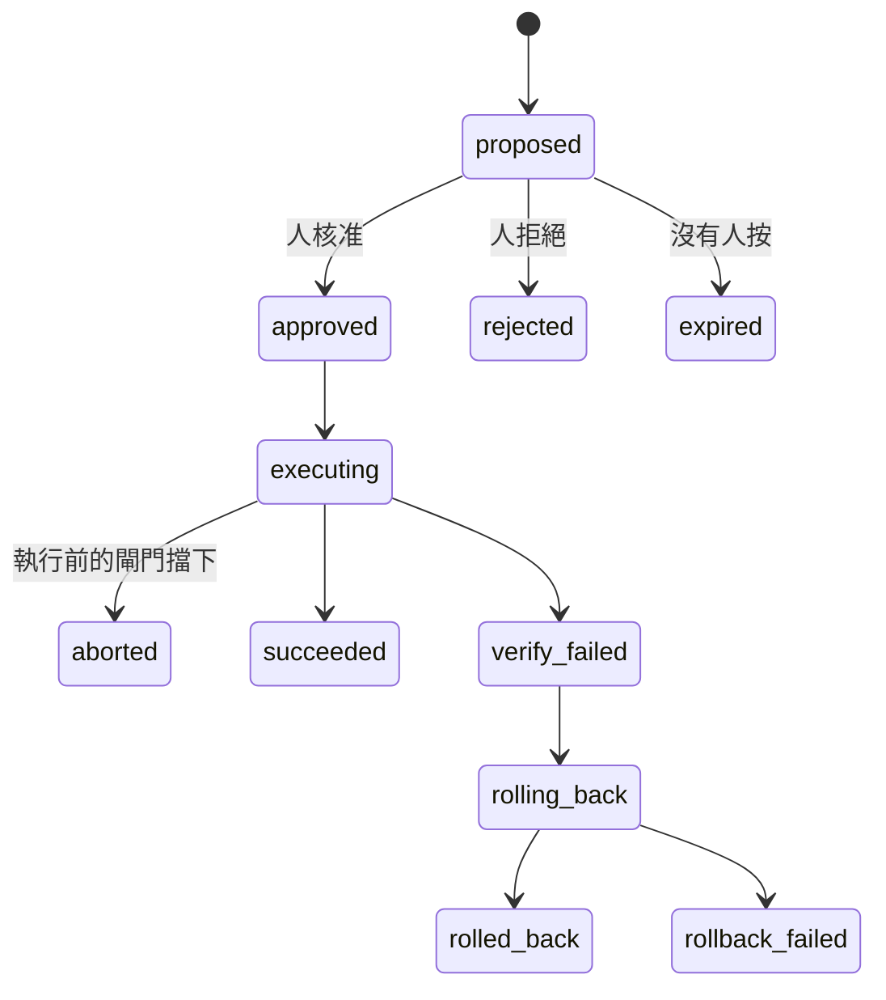

# Day27：提案不是一句話，是一列會自己走完的狀態

> 「建議回滾 payment-service」是一句話
> 一句話沒有狀態、不會過期
> 也沒有辦法在事後回答
> 那天到底是誰按的

昨天把四個平面跟那條從建議到自主的光譜攤開，收在一張狀態圖上，圖裡唯一一條不需要任何人做任何事就會走到的路叫`已過期`。今天把那張圖真的做出來，看它在資料庫裡長什麼樣子。

程式碼在範例 repo [`OTel_AIOps_Agent`](https://github.com/tedmax100/OTel_AIOps_Agent) 的 [`ironman-2026/day27/`](https://github.com/tedmax100/OTel_AIOps_Agent/tree/main/ironman-2026/day27)。

## 為什麼是一列資料，不是一支腳本

最直覺的做法是讓 agent 判斷完之後直接呼叫一支腳本。這條路上藏著三個問題，而且三個都只在**壞掉的那天**才會出現。

第一，腳本沒有身分。事後想問「上週四那次回滾是誰決定的、根據哪一次調查」，只能去翻 log，而 log 是 agent 自己寫的，agent 自己說自己當時很有把握，這句話沒有證據力。

第二，腳本沒有時效。判斷的那一刻跟動手的那一刻中間隔了多久，腳本不知道。一個十五分鐘前算出來的「現在可以回滾」，在告警風暴裡可能已經是上一個世界的事。

第三，也是最貴的一個：腳本會被重複呼叫。同一個告警在十分鐘內連續打進來三次，就會有三次判斷、三次呼叫，而 `kubectl rollout undo` 連按三次的結果不是「回滾三次」，是回到三個版本之前。

所以提案在這套系統裡不是一句話，是資料庫裡的一列，有主鍵、有狀態、有到期時間、有動作對象。`actions.py` 只放型別化的動作註冊表，`action_requests.py` 管這列資料的生命週期，兩者刻意分開：**能做什麼**跟**現在准不准做**是兩個不同的問題，壓在一起就是昨天講的那種「執行跟治理被壓成一格」。

## 註冊表：agent 講得出口的動作只有三個

`GET /actions` 回的是這個 build 的契約，不是它的接線：

```json
{
  "actions": [
    {"name": "k8s.configmap_flag_set", "reversible": true, "requires_approval": true, "executable": true, "has_dry_run": true},
    {"name": "k8s.rollout_undo",       "reversible": true, "requires_approval": true, "executable": true, "has_dry_run": true},
    {"name": "k8s.scale",              "reversible": true, "requires_approval": true, "executable": true, "has_dry_run": true}
  ],
  "actions_enabled": true
}
```

三個動作，全部可逆、全部需要核准、全部有乾跑。這個清單短得有點誇張，但那是刻意的：agent 能提的動作只有被寫進註冊表的那幾個，它沒有辦法自己組一句 `kubectl` 出來。自然語言在這裡被擋在門外，因為`型別化的動作`是後面每一道檢查的前提，你沒辦法對一段任意字串算影響範圍。

`executable` 跟 `actions_enabled` 分開回報也有原因。前者是「這個 build 有沒有實作」，後者是「這個部署准不准跑」。兩個都是 false 的時候從外面看起來一模一樣，但一個要改程式、一個只要改環境變數。

## 狀態機的真實長相



叢集裡那張帳現在是 28 列，攤開來長這樣：

| 狀態 | 筆數 |
| --- | --- |
| `aborted` | 10 |
| `expired` | 10 |
| `succeeded` | 5 |
| `rolled_back` | 2 |
| `rollback_failed` | 1 |

`autonomy` 欄位 28 列全部是 `propose`，自主那一格到現在一次都沒有觸發過。

這張表最值得看的是**成功只有五筆，而被擋下來的有十筆**。被擋下來不是壞事，那正是這一層要做的事；真正的問題在旁邊那個 10，那是沒有人按的數量，跟被擋下來的一樣多。

## 執行之前的四道閘門，跟它們各自擋下了什麼

核准不等於執行。`execute` 這個階段開始之後，還有四件事會讓它在碰到叢集之前停下來。這四道全部寫進 audit，所以可以直接數：

| 閘門 | 問的問題 | 實際擋下 |
| --- | --- | --- |
| 前置條件重驗 | 核准當下的症狀，現在還在嗎 | 18 次通過 |
| 乾跑與影響範圍 | 這個動作會動到幾個東西 | 3 次擋下 |
| 冪等 | 同一件事是不是已經有人在做了 | 6 次擋下 |
| 熔斷 | 這個目標最近是不是一直失敗 | 1 次擋下 |

冪等那六筆全部長同一個樣子：

```
idempotency abort  {'superseded_by': '92690e7562a54af8',
                    'idem_key': 'k8s.configmap_flag_set|demo/user-flags#user_session_cache_disabled|...'}
```

`idem_key` 是`動作|對象|告警指紋`三段組成的。三段缺一不可：只有動作會把不同服務的回滾當成同一件事，只有對象會把兩個不同事故對同一個 deployment 的處置合併，只有指紋則根本沒有對象概念。有了這把 key，告警風暴打進來三次，第二第三次會在 `superseded_by` 上指回第一次，然後停手。

熔斷那一筆是這樣紅的：

```
breaker abort  {'reason': 'breaker open for demo/payment-service
                (2 consecutive failures on demo/payment-service)'}
```

門檻是同一個目標連續失敗兩次就跳開，另外還有一個一小時三次的頻率上限。這道門保護的不是叢集，是**人**：一個一直失敗又一直重試的自動化，會把值班的人淹沒在通知裡，而且每一則都長得一樣。

現在 `GET /actions/breaker` 回的是 `{"open": []}`，沒有任何目標處在熔斷狀態。這種空結果很容易被當成「這個機制沒在跑」，所以那一筆歷史紀錄比現值有用得多。

## 授權會過期，而且過期是預設

`approval_ttl_seconds` 預設 900，十五分鐘。超過就自己走到 `expired`，不需要任何人做任何事。

一開始我覺得這個設計有點嚴格，直到把那十筆過期的提案攤開看時間分佈才改觀。它們不是在十五分零一秒的時候擦邊過期的，是**根本沒有人打開過**。也就是說 TTL 在這裡沒有擋掉任何一個「本來想按但太慢」的人，它擋掉的是十次「沒有人在看」。

這裡有一個很容易寫錯的細節：過期必須是**寫進資料庫的狀態轉換**，不能只是查詢時的一句 `WHERE created_ts > now() - 900`。差別在事後。前者留下一列「這件事被提出來過、沒有人理它」的紀錄，後者只是讓那列資料安靜地從查詢結果裡消失，而那正是你最需要知道的一件事。

> 我一開始真的是用查詢條件寫的。改成狀態轉換是因為某天想回答「這個月有幾個提案沒人看」，發現這個問題在原本的設計下**問不出來** QQ

## 一個名字說錯了話：`rollback_failed`

跑完幾輪之後，帳上出現一筆 `rollback_failed`，而它的故事是這樣：動作執行時 401、回滾也 401，因為那張憑證根本沒有寫入權限。

```
execute  fail  {'error': '(401)\nReason: Unauthorized ...'}
rollback fail  {'action': 'k8s.rollout_undo', 'error': 'UnauthorizedException: (401) ...'}
```

問題是 `rollback_failed` 這個名字讀起來像「我們動了它，然後收不回來」，值班的人看到會立刻去確認現場被改成什麼樣子。實際上什麼都沒有發生，兩次呼叫都在認證那一關就被打回來了。

同一個狀態名蓋住了兩種完全不同的現場：**改到一半收不回來**，跟**從頭到尾沒碰到**。這兩種在半夜三點的處置方式差得非常遠。狀態機的名字不只是給程式看的，它是值班的人第一眼會讀到的那句話，取錯名字等於在事故當下說謊。

## 這對值班的人有什麼差別

把提案做成一列有狀態的資料，值班的人拿到的是三個原本要自己補完的東西。

**這次會動到什麼。** 乾跑會先算出影響範圍（`revision 58→57, replicas 1→1, affected 1 pod(s), singleton`），這句話比「建議回滾」有用得多，因為它同時回答了「這是不是唯一一個副本」。

**這件事是不是已經有人在做。** 冪等那六筆擋下的就是這個。沒有它的話，兩個人同時看到同一個告警、同時按下核准，系統會老老實實做兩次。

**事後問得出來。** 每一筆都有核准的人、時間、以及當時的判斷來源。這是自主那一格的前提：一個沒辦法還原「當時為什麼准」的系統，不該被放到不用問人的位置。

## 今天沒做的事

- **五道門一道都還沒接上。** 今天講的四道閘門全部發生在核准**之後**，管的是「這次執行安不安全」。決定「這件事需不需要人核准」的那五道門是另一組東西，留給後面。
- **驗證只看一個 PromQL 條件。** `verify` 現在是拿一條查詢比一個閾值（`value 3.407 > max_value 0.01`），符合就算修好。這個判準太窄，留給後面。
- **失敗之後的清理是我手動做的。** 熔斷跳開之後要重置、卡住的 `executing` 要收，這些都還沒有自動化。

## 小結

總結來說，今天把「建議」變成了一列會自己走完的資料。這件事的價值不在自動化程度，而在**每一個轉換都留下了可以事後問的東西**：誰按的、什麼時候、當時算出來的影響範圍是多少、以及為什麼中途停下來。

帳上那 28 列裡最刺眼的還是那個 10。被閘門擋下的十筆是機制在工作，沒有人按的十筆是機制在空轉，兩個數字一樣大，但只有後者是我造成的。

> 那筆 `rollback_failed` 我盯著看了很久，一直覺得哪裡不對勁。
> 後來發現不對勁的不是系統，是我給那個狀態取的名字 XD
