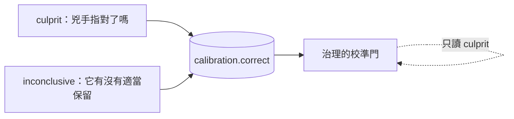

# Day29：第一道門，那個 0.9 憑什麼算數

> 信心分數是推理平面自己講的
> 治理平面沒有義務相信它
> 這句話聽起來很酸
> 但它是整道門的全部內容

昨天那輪演習跑完，agent 對同一個事故給的信心是 0.65。前一天的真實那輪，同一個事故、同一份處置程序，它給 0.9。同一件事差了 0.25，而如果自主權是掛在信心門檻上的，這 0.25 就是「要不要叫醒一個人」的差別。

今天處理五道門裡的第一道：**憑什麼相信那個數字**。

程式碼在範例 repo [`OTel_AIOps_Agent`](https://github.com/tedmax100/OTel_AIOps_Agent) 的 [`ironman-2026/day29/`](https://github.com/tedmax100/OTel_AIOps_Agent/tree/main/ironman-2026/day29)。

## 校準：把「它說幾分」跟「它到底對不對」對起來

`校準`（calibration）這個詞在機器學習裡有很精確的意思，值得先講清楚，因為它跟直覺的「準確率」不是同一件事。

一個模型宣稱信心 0.9 的那些判斷裡，如果大約九成是對的，它就是校準良好的。注意這跟「它很準」無關：一個只有六成正確率的模型，只要它在自己會錯的時候老實給 0.6，它就是校準良好的，而且**是可以拿來做決策的**。反過來，一個八成正確率但每次都喊 0.99 的模型，比前者危險得多，因為沒有辦法用它的分數區分「這次可以放手」跟「這次要看一下」。

自主權要的其實不是高正確率，是**可以被讀的分數**。

三個數字負責量這件事：

- `ECE`（expected calibration error）：把判斷照信心分箱，每箱算「宣稱的信心」跟「實際正確率」的差，再按箱的大小加權平均。0 是完美。
- `MCE`（maximum calibration error）：所有箱裡最糟的那一箱。平均值會互相抵銷，這個不會。
- `Brier score`：把每一筆的 `(信心 − 是否正確)²` 平均起來。它同時懲罰不準跟不老實。

這三個都需要一份東西才算得出來：**被標註過的紀錄**。

## 標註要從哪裡來，而且橋要怎麼搭才不算作弊

agent 每跑完一次調查，就往 `calibration` 表寫一列：它的信心、它的結論摘要、以及一個空的 `correct` 欄位。那個欄位要等別人來填。

「別人」是誰，是這道門真正的設計問題。

最省事的做法是讓系統自己填。執行平面本來就會驗證自己的處置有沒有效，把那個驗證結果當成「這次判斷是對的」寫回去，資料量立刻變多。這條路我沒有走，而且在程式裡把它擋死了：有一組來源被列為`自我標註`，它們寫進去的判決永遠不會被算進解鎖自主權的那份證據裡。

理由很簡單。執行平面驗證的是「症狀有沒有消失」，推理平面宣稱的是「我知道為什麼」。這兩件事在同一次事故裡經常同時成立，但它們不是同一個命題，而且用前者去證明後者，等於**讓系統自己說自己判斷得很好**。一套能靠自己的話解鎖自己權限的系統，那道門就不是門了。

所以能填那個欄位的只有兩種來源：讀過逐字稿的人，以及在已知答案的題目上機械評分的 grader。這兩種都在系統外面。

## 兩種 `correct`，不是同一種對

這是我在這道門上踩過最深的一個坑。

有些告警查完之後的正確答案是「沒有事故」。agent 如果老老實實說「我沒找到問題」，那是**對的行為**，應該被記一筆 `correct=1`。

問題是校準的數學讀不懂這件事。一筆信心 0.0、`correct=1` 的紀錄，在數學眼裡是「它只給了 0.0 卻答對了」，於是算出一個 gap = 1.0，也就是最大可能的校準誤差。這隻 agent 做對了事，然後在成績單上被記了一筆滿分的錯。

當時的 MCE 就是被這種紀錄撐起來的。

修法不是改數學，是承認**那個 `correct` 欄位一直在回答兩個不同的問題**：



所以資料表多了一欄 `grading_mode`，由標註的人（或 grader）填，說明這一筆的 `correct` 在回答哪一個問題。校準的門只讀 `culprit` 那一種，因為 ECE 那套數學假設的正是「宣稱的信心對應到指對兇手的機率」。

那批 `inconclusive` 的紀錄沒有被丟掉，它們回答的是另一個很有用的問題（這隻 agent 會不會在沒事的時候硬要指認一個兇手），只是那個問題要用另一把尺量。

> 我第一次把兩種混在一起算的時候，得到一個 MCE 1.0 的可靠度圖，還很認真地在想「它到底怎麼會錯得這麼徹底」。錯的是我拿一把尺量了兩種東西 QQ

## 現在這條曲線長什麼樣子

把排練排除掉、只留 `culprit`，今天的真實曲線是這個樣子：

```
Calibration over 4 labeled run(s) (of 18 recorded):
  ECE   = 0.1875
  MCE   = 0.3
  Brier = 0.1731
  accuracy 0.75 vs confidence 0.5625 → overconfidence -0.1875
  reliability:
    bin            n   conf    acc    gap
    [0.2,0.3)    2  0.200  0.500  0.300
    [0.9,1.0)    2  0.925  1.000  0.075
```

四筆。這個數字很難看，而它難看是有原因的，那個原因不在這一天，在後面講「量錯三次」那一天。

先看得懂這張表要怎麼讀。`overconfidence` 是負的，代表它整體偏保守：實際正確率 0.75，自己只喊 0.5625。最下面那兩箱說得更清楚，信心 0.9 以上那兩次全對，信心 0.2 那兩次對了一半。

用直覺講：**它在最有把握的時候是對的，在沒把握的時候比自己說的還行**。這對自主權來說是好消息，但四筆撐不起任何結論。

## 門檻不是一個數字，是四個

那道門要放行，需要同時滿足：

| 條件 | 要求 | 現在 |
| --- | --- | --- |
| 被標註過的判斷 | ≥ 20 | 4 |
| 其中出自人或 grader | ≥ 20 | 4 |
| 在信心 ≥ 0.8 這個區間的樣本數 | ≥ 3 | 2 |
| 那個區間的正確率 | ≥ 0.7 | 1.0 |

最後兩列是我覺得這道門設計得最對的地方：**只看會被用到的那個區間**。

自主權是在信心 0.8 以上才給的，所以在 0.3 那一段校準得再好也不能證明什麼——那些判斷永遠不會走到這道門前面。一個系統如果拿全域平均當通過條件，就會發生「靠一大堆低信心的正確判斷，去替高信心區間的胡說八道背書」。

所以現在這道門是紅的，而它紅的理由是`區間裡只有兩筆`，不是`正確率不夠`。這兩句話在報表上都是紅燈，但它們要的東西完全不一樣：一個要人去標，一個要 agent 變強。

## 這對值班的人有什麼差別

沒有校準的信心分數，值班的人只能用經驗值去折算。「它說 0.9 大概等於七成吧」這種折算每個人心裡的係數都不一樣，而且沒有辦法交接。

有了校準，那個分數變成一句可以查證的話：**這隻 agent 過去講 0.9 的時候，二十次裡對了幾次**。這句話可以寫進交接文件，可以被新來的人讀懂，也可以在它退步的時候被發現。

反過來說，這也是為什麼「自我標註不算數」這條規則不能通融。如果分數的可信度是系統自己認證的，那句可以交接的話就退回成「它說它很準」。

## 今天沒做的事

- **只有四筆。** 剩下的路很清楚：去標。目前有十幾筆非排練的高信心調查躺著等人看，而它們才是能動這個數字的東西。
- **另外四道門還沒接。** 校準只回答「它準不準」，不回答「它讀的資料是不是真的」「它現在還動得了東西嗎」，那些留給後面。
- **`inconclusive` 那批還沒有自己的門。** 那把尺已經分出來了，但還沒有人用它訂過任何門檻。

## 小結

總結來說，今天這道門要的不是一個更高的分數，是**一個可以被查證的分數**。校準做的事情就是把「它說幾分」跟「它後來對不對」放在同一張表上，然後老實承認現在那張表只有四列。

那四列裡最有意思的是負的過度自信。這套系統目前的問題不是它太敢講，是**沒有人在它講完之後告訴它對不對**。

> 「校準」這個詞我一開始以為是要去調模型的溫度參數之類的。
> 結果九成的工作量是在吵「誰有資格說它錯了」XD
