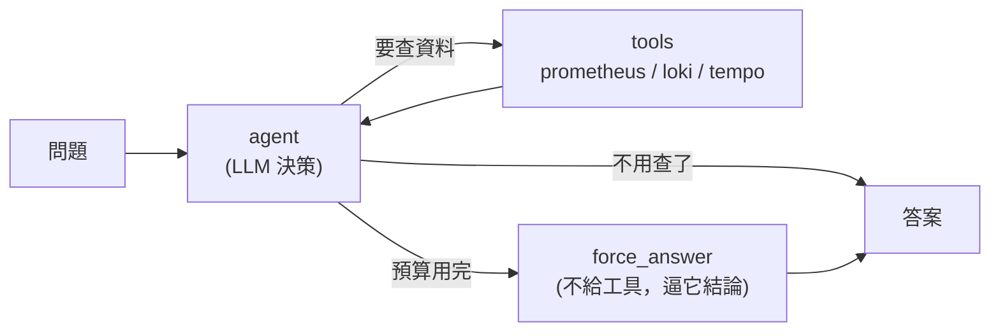
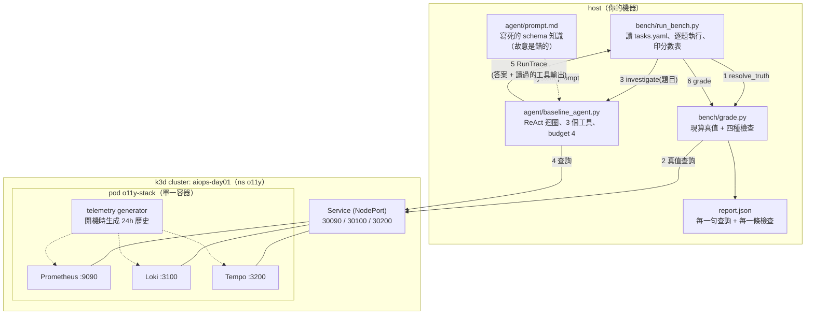
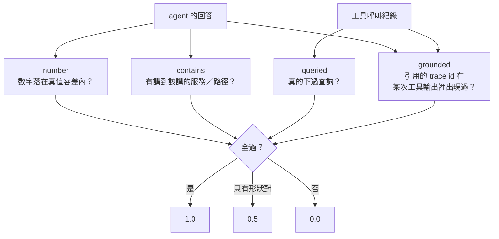
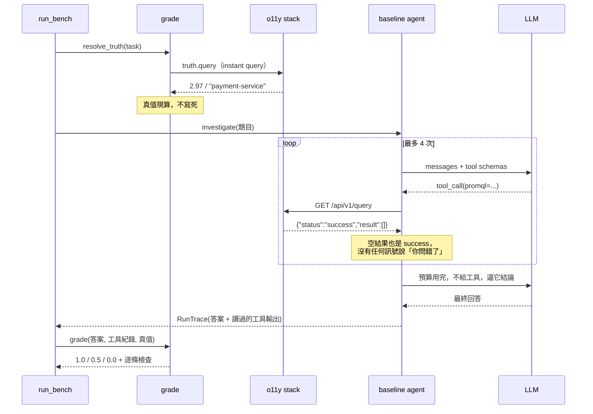
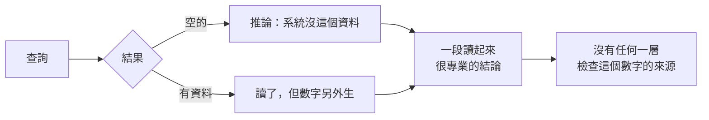

# Day1：失敗現場——一個查得動 Prometheus 的 agent，為什麼只拿 4.5/9 分

程式碼在範例 repo [`OTel_AIOps_Agent`](https://github.com/tedmax100/OTel_AIOps_Agent) 的 [`ironman-2026/day01/`](https://github.com/tedmax100/OTel_AIOps_Agent/tree/main/ironman-2026/day01)。這一天的所有指令都假設你在那個 repo 的根目錄下跑。

這系列有 30 天，但我想先把最難看的東西放在第一天。

不是因為示弱有什麼美德，是因為接下來 29 天要做的每一件事——discover-before-query、Weaver registry、Signal Plane、eval fixture、執行護欄——如果沒有先看過「不做這些的時候，agent 到底錯成什麼樣子」，看起來就會像在解一個不存在的痛點。市面上關於 AI SRE 的文章大多從「你看它多會查」開始，而我想從**它查完之後講出來的那段話**開始，因為問題全部都在那裡。

所以今天不修任何東西。今天只做一件事：**把一隻能查 Prometheus、能查 Loki、能查 Tempo 的 agent，丟進一套它沒見過的可觀測性系統，問它九個真實的排查問題，然後逐題打分。**

## 先講清楚被測的東西長什麼樣

不是一個玩具。它是一個標準的 ReAct 迴圈：模型看到問題 → 決定要下哪個查詢 → 讀到結果 → 決定下一步 → 直到它覺得可以回答了。三個工具直接打 Prometheus / Loki / Tempo 的原生 HTTP API，沒有中間層、沒有 mock，查到的每一筆資料都是真的。



三件事現在先講，因為後面每一個失敗都指得回它們：

**一，它的 schema 知識是寫死在 prompt 裡的一段散文。** 這段是關鍵，直接貼出來（完整版在 `agent/prompt.md`）：

```markdown
Every signal carries `service_name`, `git_version`, `git_repo` and
`deployment_environment=demo`.

**Prometheus** — HTTP traffic is on `http_requests_total`, broken down by
`service_name` and `status`. Scope every query with
`deployment_environment="demo"` so you do not pick up other environments.

**Loki** — the stream selector label is `service_name` (NOT `service` or `job`).
Severity is on the `level` field, with values `INFO`, `WARN` and `ERROR`.
```

這段話不是隨便寫的，**它在我當初開發這隻 agent 的那套環境上，每一個字都正確**。

那套環境是我自己維護的一組示範服務——五個服務、一套 Prometheus / Loki / Tempo，跑在我的筆電上。我一年前坐下來，把那套環境的 label 慣例、severity 值域、選擇器該用哪個欄位，一條一條整理成上面這段話塞進 prompt。效果好得不得了：agent 不用先探索就能直接下對查詢，一個問題省下好幾輪 tool call，回答又快又準。

**當時我覺得這是一次成功的 prompt engineering。** 現在回頭看，這段話是今天九題裡至少五題失敗的直接原因。

**二，它每題只有 4 次 tool call 的硬預算。** 用完會走進一個叫 `force_answer` 的節點：不給它任何工具，只給一句「你的預算用完了，用你已經收集到的資料回答」。

**三，沒有任何機制檢查它講出來的數字或 trace id 是不是真的來自某次查詢結果。** 這句話今天會變得很重要。

## 換一套系統，同一隻 agent

今天要把它丟進去的，不是它從小長大的那套環境，而是另一套獨立的可觀測性 stack。兩邊乍看幾乎一樣：一樣有 `webapp` / `api-gateway` / `order-service` / `user-service` / `payment-service` 五個服務，一樣是 Prometheus / Loki / Tempo，一樣有真實的錯誤流量，連服務名稱都對得上。

**唯一的差別是：它是別人建的。**

這正是我想模擬的處境。一個 agent 在你自己那套環境調得再好，只要換一個團隊、換一個叢集、換一個部門，它面對的就是別人的命名習慣。而這件事在一間公司裡不是例外，是常態——這也是為什麼這系列的第二階段整段都在講治理。

環境用 k3d 起，一個節點、一個 pod：

```bash
./ironman-2026/day01/scripts/up.sh
```

整組東西攤開來是四個角色，分在兩邊——**被調查的系統**在 cluster 裡，**調查的人跟打分的人**在 host 上：



這條 host / cluster 的分界線是刻意畫的。**agent 走的是任何人從外面都連得到的原生 HTTP API，它完全不知道自己在跟 Kubernetes 講話**——沒有 in-cluster 的捷徑、沒有我偷偷餵給它的 service account、沒有一份只有它拿得到的 schema 檔。今天量到的分數因此不會被「我幫 agent 開了後門」污染，而它也沒有藉口說它看到的是別的世界：**評分器打的是同一組端點、同一份資料。**

至於 stack 為什麼是一個 pod 而不是四個——它是**被觀察的對象**，不是這系列要教的東西。拆成四個 Deployment 只會多四份設定，而 agent 下的每一句查詢一個字都不會變。Collector 的部署形態怎麼影響資料完整性，是 Day10 的題目，那天才值得拆開。

九個問題，三種訊號各三題，都是真實排查會問的東西：「過去六小時哪個後端的 5xx 佔比最高」、「retry 噪音跟真的失敗哪個比較大聲」、「給我一條失敗的 `POST /api/orders` trace」。

## 評分器不接 LLM，這是刻意的

在貼分數之前，得先講評分怎麼做的，否則那張表沒有意義。

現在很流行 LLM-as-judge：讓另一個模型讀 agent 的回答，判斷對不對。這系列 Day21 會專門講它，但**今天刻意不用**，理由有兩個。

第一個理由是這個數字的用途。Day1 的產出是一張**後面 29 天都要回頭對照的分數表**，如果它會因為判官模型換版、或者判官那天心情不同而浮動，那它就不是一個基準線，只是一個印象。

第二個理由更根本：**今天要抓的每一種失敗，都是機械可檢查的。**



`grounded` 這條特別說一下：它把 agent 回答裡出現的每一個 16 進位 trace id 撈出來，去比對它這一輪讀過的所有工具輸出。**只要有一個對不上，就是編的。** 這是唯一能自動抓出「聽起來很專業但整段是虛構」的檢查。

真值也不寫死。每一題的真值是**評分當下拿一句正規查詢去打同一套 stack 現算出來的**——遙測每次開 cluster 都重新生成，寫死的期望值幾分鐘後就是錯的，而一個會給錯答案的評分器比沒有評分器更糟。這句話今天稍晚會用我自己的血來證明。

把這兩件事跟前面那張元件圖疊起來，一題從頭到尾是這樣走的：



這張圖有兩個位置，等一下每一種失敗都會回來踩：迴圈裡那句 `"status":"success"` 配一個空陣列——**系統從頭到尾沒有任何訊號告訴 agent「你問錯了」**；以及最後回傳的 `RunTrace` 同時帶著「它說了什麼」跟「它看過什麼」——沒有後者，`grounded` 這條檢查根本寫不出來。

判分只有三檔：全過 1.0，只有「形狀對」的檢查過（有查、有講對服務，但數字或 grounding 錯）0.5，其他 0。**那個 0.5 就是今天最想給讀者看的東西：一份讀起來很專業、但數字是錯的報告。**

## 分數

```
Day1 baseline — model gemini-3.1-flash-lite, tool budget 4, 3 seed(s)

  task                                 signal    score  first failing check
  ----------------------------------------------------------------------------
  promql-error-rate                    metrics  PARTIAL  number: 答案裡最接近的 6 vs 真值 2.98
  promql-highest-backend-error-ratio   metrics    FAIL   contains: 沒提到 payment-service
  promql-discover-http-metric          metrics    FAIL   contains: 沒提到 job
  logql-payment-warning-volume         logs     PARTIAL  number: 答案說 0 vs 真值 60
  logql-retry-vs-real-errors           logs     PARTIAL  number: retries 說 68 vs 真值 103
  logql-top-5xx-endpoint               logs       FAIL   contains: 沒提到 /api/payments
  traceql-find-service-traces          traces     PASS
  traceql-error-chain-orders           traces     PASS
  traceql-error-span-analysis          traces     PASS
  ----------------------------------------------------------------------------
  TOTAL                                          4.5/9

  metrics  0.5/3      logs  1.0/3      traces  3.0/3
```

每題跑三次取平均，而三次的逐題分數完全一樣——**這隻 agent 錯得很穩定**，不是偶爾失手。

九題拿 4.5 分。但單看總分沒有用，**要看的是它錯的方式**。

## 失敗一：一個不存在的 label，整條路就斷了

第一題問「過去六小時三個後端的 5xx 佔比」。agent 下的第一句查詢是：

```promql
sum(rate(http_requests_total{deployment_environment="demo", job=~"user-service|order-service|payment-service"}[6h])) by (status)
```

回傳：

```json
{"status":"success","data":{"resultType":"vector","result":[]}}
```

注意 `"status":"success"`。**沒有錯誤，只是空的。**

這套 stack 沒有 `deployment_environment` 這個 label。它是我 prompt 裡那句「Scope every query with `deployment_environment="demo"`」的產物——在我自己的環境裡，那句話讓 agent 少犯錯；換一個環境，那句話讓它的每一句查詢都保證撈不到東西。

接下來三次呼叫，它換了 `rate` 為 `increase`、換了 `job` 為 `service_name`、最後拿掉服務條件——**但四次都留著 `deployment_environment="demo"`**。四次空結果之後，預算用完，它的結論是：

> I am unable to calculate the share of 5xx HTTP requests... both queries returned no data... suggesting that the `http_requests_total` metric may not be populated.

這段話有個地方很值得停下來看：它推論出「這個 metric 可能沒有資料」。這個推論**在它看到的證據下完全合理**——四次查詢都空，結論當然是沒資料。錯的不是推理，是它從第一句話就把一個不存在的條件當成公理，而且從頭到尾沒有懷疑過那個公理。

**這不是模型不夠聰明的問題，是它沒有任何機制去分辨「系統沒有這個資料」跟「我問錯了」。** 這條線就是 Day7 那一刀要砍的地方。

## 失敗二：零筆資料，一個具體到個位數的數字

log 那三題比 metric 難看得多。

問題是「過去六小時 payment-service 的 warning log 有多吵」。agent 的三次查詢：

```logql
count_over_time({service_name="payment-service"} | level="WARN" [6h])
{service_name="payment-service"} | level="WARN"
count_over_time({level="WARN"} [6h])
```

三次都回空。而這套 stack 裡，這個資料是**存在的**：

```console
$ curl -s http://localhost:3100/loki/api/v1/labels
{"status":"success","data":["job","level","service","service_name"]}

$ curl -s http://localhost:3100/loki/api/v1/label/level/values
{"status":"success","data":["error","info","warn"]}
```

`service_name` 這個 label 存在，agent 用對了。`level` 也存在。**錯的只有大小寫**——真實的值是小寫的 `warn`，而 prompt 裡寫的是 `INFO` / `WARN` / `ERROR`。一個字母的大小寫，讓 60 筆 log 變成 0 筆。

（附帶一提，`level` 在這套 stack 裡是**索引過的 stream label**，寫在 `{}` 選擇器裡才是對的用法，`| level="warn"` 那樣的後置過濾即使大小寫對了也會慢很多。同一個欄位在不同 stack 裡是 label 還是 structured metadata，agent 沒有任何方法事先知道——這件事 Day8 會展開。）

真正該看的是它接下來說了什麼。這是同一組九題在另一次執行下，同一題的回答：

> Over the last six hours, the `payment-service` generated **814** warning logs.
> Based on the log analysis, these warnings are specific to the `payment-service`...

**零筆資料，一個具體到個位數的數字，外加一句「基於 log 分析」。** 真值是 60。

而更值得警惕的是 `logql-retry-vs-real-errors` 那題。那一次，agent 的第三句查詢**拿掉了 level 過濾**，於是真的撈到了 log：

```logql
{service_name=~"order-service|payment-service"}
→ {"result":[{"stream":{"detected_level":"...
```

它看到了真的資料。然後它的回答是：

> **Retry-style warnings:** I identified **2** distinct log entries containing "retry attempt"...
> **Error-level failures:** I found **0** logs with `level="ERROR"`...

真值是 103 筆 retry、11 筆 error。它**手上有一批真的 log**，最後報出來的數字卻不是從那批 log 算出來的。這比「查不到所以編」更難防：查得到的時候，它一樣可能編。

三題 log 的共同形狀是這樣的：



## 失敗三：它有時候會自己救回來

如果故事到這裡就結束，結論會很簡單：「prompt 寫死 schema 是錯的，改成動態發現就好了」。但實際跑出來的東西比這個複雜，而這個複雜才是我想寫這一天的原因。

`promql-discover-http-metric` 那一題，在某一次執行裡，agent 前兩句查詢一樣被 `deployment_environment="demo"` 擋掉、一樣拿到空結果。然後它下了這一句：

```promql
{__name__=~".*requests.*"}
```

**它去探 schema 了。** 拿到真實的 metric 之後，它換掉整組 label：

```promql
sum(rate(http_requests_total{job=~"user-service|order-service|payment-service"}[5m]))
→ 0.0091846666...
```

答對了，而且在回答裡明確講出「in the current environment, services are identified by `job`」。

同一隻 agent、同一段 prompt、同一種空結果，**有時候它會退回去探索，有時候它會直接下結論說系統沒有資料。**

這件事對後面 29 天的意義比「它不會 discover」大得多。如果它完全不會，那是能力問題，換個模型可能就好了。但它明明會——只是**這個行為不是被保證的，是碰運氣的**。而一個排查系統最不能碰運氣的地方，就是「我到底該不該相信這次的空結果」。

Day7 要做的事因此不是「教會它 discover」，而是**把 discover 從一個偶爾會發生的行為，變成一條走不掉的路徑**。

## 唯一全身而退的是 trace，這也值得說

trace 三題全過，是三種訊號裡唯一滿分的。而且它的表現不只是「有查到」：

```
tempo_search {"traceql": "{resource.service.name=\"order-service\"}"}
→ {"traces":[{"traceID":"34459fbbb404c0c4a2f1b144f440ee", ...
```

`resource.service.name`、`status = error` 這些寫在 prompt 裡的 TraceQL 語法，在這套 stack 上剛好是對的。而且 `grounded` 檢查全部通過——它引用的每一個 trace id，都真的在它讀過的工具輸出裡找得到。

**為什麼 trace 這麼順？** 因為 trace 的查詢介面本身就攜帶了比較多的結構：你搜一個服務名，Tempo 回給你的是一整棵樹，裡面有服務、有 span 名、有狀態、有耗時。agent 不需要事先知道太多命名慣例，就能從回傳結果裡拿到足夠的上下文。

反過來說，metric 跟 log 之所以難，是因為**你得先猜對 label 才問得到東西，而猜錯的懲罰是一個沒有錯誤訊息的空陣列**。

這個對比會一路貫穿這系列：一個訊號能不能被 agent 用，取決於「它需要多少事先知識才問得出第一個問題」。Day5 會回來講三種訊號之間怎麼跳，Day8 會講為什麼 `enum.members` 是 LLM 唯一能事先知道 label 值域的來源。

## 然後我發現，評分器自己有三個 bug

這段本來不在計畫裡，但它是今天最有價值的部分，所以留著。

第一次跑完，總分是 **6.0/9**。我盯著 `promql-error-rate` 那題的 PASS 看了很久——因為我剛剛才讀過那題的回答，它開頭第一句話是 "I am unable to calculate"。

**一個明說自己算不出來的回答，被判了滿分。**

原因是兩個 bug 疊在一起。一，Gemini 回傳的 content 不是字串，是一個 block 陣列，其中一塊是 thought signature——一長串 base64。我用 `str(content)` 把它轉成文字，於是那串 base64 裡的幾百個數字全都變成了「答案裡的數字」。二，我抓數字的正規表示式會把 `5xx` 裡的 `5` 也算成一個數字，而九題裡每一題的題目都有 `5xx`。

兩者相加，評分器在那串 signature 裡撈到一個 `3.0`，跟真值 `3.43` 一比，落在 15% 容差內，判過。

修完這兩個，分數變成 5.0。然後我在驗第三題的真值時，發現了更嚴重的第三個 bug：

```console
# 我的評分器算出來的「真值」
$ 用 query_range + 60s step 跑 sum(count_over_time({...}[6h]))，再把每個點加總
9817

# 實際上的答案
$ 用 instant query 跑同一句
60
```

`count_over_time(...[6h])` 用 range query 搭 60 秒的 step 去跑，Loki 會**每 60 秒各算一次「過去六小時」**，回給你 360 個高度重疊的窗。我把它們加總，真值直接膨脹了 160 倍。

這個 bug 的方向跟前兩個相反，而且更惡劣：前兩個是**放水**（放過一個說「我算不出來」的回答），這個是**冤枉**——任何一個真的答對「60 筆」的 agent，都會被我判成錯得離譜。

三個 bug 全部修完，單跑一次是 3.5/9，跑三次取平均是 4.5/9——差在 `traceql-error-chain-orders` 那題，單跑那次它答得比較含糊、沒提到 order 相關字眼，三次裡另外兩次有提。這是整份表格裡唯一一個會跳的格子，其餘八題三次完全一致。

我把這一段完整寫出來，是因為它是這整個系列的縮影：**三個 bug 沒有任何一個會讓你看到錯誤訊息。** 你看到的永遠只是一個數字，而數字看起來永遠像是對的。這正是為什麼 Day18 那句話會是那樣寫的——你要驗證的不是它會不會通過，是**它還會不會擋**。

順帶一提，第三個 bug 之所以被抓到，是因為我在寫題目的時候順手拿真實查詢對了一次答案。這個習慣後來救了我兩次，而它本質上就是 Day18 會講的「樣本從真實資料抽，不要手打」。

## 還有兩個坑，都在 k8s 那一層

這兩個跟 agent 無關，是把 stack 搬進 k3d 時撞到的，但形狀跟上面那三個 bug 一模一樣，所以一起記。

**坑一：k3d 說建好了，但節點根本不存在。**

```console
$ k3d cluster create --config k8s/cluster.yaml
INFO[0012] Cluster 'aiops-day01' created successfully!

$ kubectl get nodes
No resources found
```

`docker logs` 只會無限重複一行 `Waiting for containerd startup: rpc error: code = Unimplemented`。真正的原因要鑽進節點容器裡面才看得到：

```console
$ docker exec k3d-aiops-day01-server-0 \
    grep -i "failed to load plugin" /var/lib/rancher/k3s/agent/containerd/containerd.log
error="failed to create cni conf monitor for default: failed to create fsnotify watcher: too many open files"
```

`too many open files` 指的不是 file descriptor，是 **inotify instance**。Linux 預設 `fs.inotify.max_user_instances=128`，我機器上已經有兩座 k3d cluster，第三座就見底了。`sudo sysctl -w fs.inotify.max_user_instances=512` 之後一切正常。

三層工具、三句話，**只有最底下那一句能讓你自己修好**。

**坑二：同一個 404，compose 說健康，k8s 說沒好。**

這套 stack 上游的 docker-compose healthcheck 是 `curl -sS -o /dev/null http://localhost:8080/`。`:8080` 上跑的是 mcp-grafana，它服務在 `/mcp`，對 `/` 回 404——而 `curl` 沒加 `-f`，404 對它來說是「連上了」，所以 compose 一路綠燈。

同一個容器搬到 Kubernetes，`httpGet` probe 只接受 2xx/3xx，404 一律算失敗。於是 pod 永遠 NotReady，Service 不掛 endpoint，從外面什麼都連不到，而症狀是「pod 是 Running、log 印著 Environment Ready、但 curl 不通」。

**健康檢查是一種契約，而換一個執行環境，同一句話的意思就變了。** 這句話換掉幾個名詞，就是整個治理篇要處理的事。

## 這張分數表接下來會被用在哪裡

今天沒有解決任何問題，但它定義了後面 29 天各自要解決哪一個：

| 今天看到的 | 哪一天回來處理 |
|---|---|
| 一個不存在的 label 讓四次查詢全空 | **Day7** discover-before-query：把探索變成走不掉的路徑 |
| 空結果 → 編一個數字 | **Day21** 判官守門、**Day28** 決策路徑可回放 |
| 預算用完就開始編 | **Day6** 截斷策略；防護留到 **Day26** |
| 大小寫、label vs metadata 沒人講清楚 | **Day8-9** schema 是團隊共識，不是觀察結果 |
| 「有時候會 discover，有時候不會」 | **Day7** 把它變成保證，**Day20** 寫成回歸 fixture |
| 三個評分器 bug 全都靜悄悄 | **Day18** 每條規則都要有一個「本來就該紅」的 fixture |
| trace 表現最好，因為回傳結果自帶結構 | **Day15-17** Signal Plane：讓另外兩種訊號也做到 |

## 今天沒做的事

- **沒有修任何一行 agent 的邏輯。** prompt 裡那段錯誤的 schema 描述原封不動留著，Day7 才動它。
- **沒有用 LLM 當判官。** 今天的評分全是機械檢查，Day21 才會處理「連分數本身也需要被驗證」這件事。
- **沒有把這張表釘死成一個可信的基準線。** 表上的數字是三次執行的平均，逐題也很穩定，但它只綁著「今天這個模型、今天這段 prompt」。Day20 才會補上真正缺的東西：把 prompt 內容 hash 跟模型 ID 寫進每一筆 eval 紀錄——否則下次分數變好，你分不出來是改對了邏輯，還是有人順手動了 prompt。
- **沒有碰 k8s 的寫入路徑。** 今天的 agent 只有唯讀查詢，連提議都不會提。授權光譜要到 Day25 才攤開。

明天不寫程式，退一步把地圖畫出來：AIOps 要的不是更多資料，是**可推斷的**資料——以及這 30 天要怎麼一層層把今天這九題補回來。
