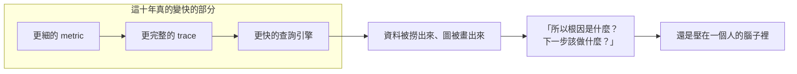
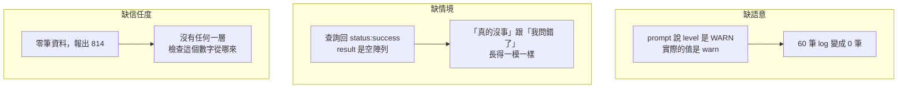

# Day2：AIOps 要的不是更多資料，是可推斷的資料

> 資料一直都夠多
> 少的是「`這個欄位到底代表什麼`」這件事
> 有被寫下來過

昨天那隻 agent 拿了 4.5/9。先淺聊一下**它到底是哪裡不夠？**

這個問題重要，是因為它有一個很順口、但會把後面整個系列帶偏的答案：「模型不夠強，換一隻好一點的就好了」。昨天的紀錄不支持這個說法。我想先把這件事講清楚，再畫出後面的地圖。不然接下來每天裝一個工具、寫一份 registry，讀者只會看到一堆零散的東西，不知道它們合起來要解決什麼。

## 如果你去問十個工程師「AIOps 是什麼」

你大概會拿到十種答案。有人說「裝一個 AI 幫你看 dashboard，順便幫你查 log 做摘要」，有人說「自動化腳本外面包一層聊天介面，你打字問它系統怎麼了」，也有人直接說「就是行銷詞，換個包裝賣同一套監控」。


這些答案都不算錯，市場上確實有一大堆產品長這樣。但它們有一個共同點：**全部在講介面長什麼樣子，沒有一個在講資料本身。** 而昨天那 4.5 分告訴我們的，恰恰是問題出在資料那一端。

要講清楚為什麼，得先回頭看監控這件事是怎麼一路走到今天的。

## 監控是為人設計的，這件事一直沒變

最早的監控系統很單純：一張 dashboard、幾個告警閾值，CPU 超過 80% 就叫醒值班的人。這在服務只有幾個的時候運作得很好。閾值是人設的，告警觸發之後也是人去看、去判斷、去處理，整條鏈路上每一步都有一個活人的判斷力在把關。

問題是系統會長大。服務從幾個變幾十個、幾百個，呼叫鏈越疊越深，閾值型告警開始出現那個經典副作用：**告警疲勞**。同一個根因同時炸出十幾個下游服務的告警，值班的人半夜被叫醒十次，有九次是同一件事的不同症狀。人力不會跟著服務數一起長，於是「能不能讓機器先幫忙看一輪」變成一個很自然的需求。

這波需求被市場接住之後，走向了一個岔路：「AI 幫你看」這句話本身太好賣，於是力氣都花在讓介面看起來很聰明，而不是讓機器真的看得懂資料。



[《代理式可靠性工程》（Agentic Reliability Engineering，簡稱 ARE）](https://tedmax100.github.io/agentic-reliability-engineering-zh-tw/)那本書開頭有個說法我覺得講得很準：SRE（Site Reliability Engineering）這個角色長期卡住的地方，從來不是技術或流程不夠成熟，而是一個持續擴大的`認知瓶頸`——系統已經成長到超出人類能在即時狀態下可靠推理的範圍，而再多的自動化都移不掉它。書裡那句標語是這樣寫的：**它擴展的是執行力，不是判斷力**。

上面那張圖就是這句話的形狀。過去十年可觀測性領域做的每一件事，本質上都在讓左半邊變快，但右半邊那個判斷的動作從頭到尾沒有被搬走過。告警疲勞是這個天花板最直接的症狀：閾值設定的依據往往不是「怎樣的閾值能做出最好的決策」，而是「一個人一個晚上能承受幾次被吵醒」。那是為了保護人的注意力預算而妥協出來的數字。

而 LLM 出現之後，很多人（包括我 QQ）以為判斷那一格終於可以外包了。昨天的九題就是我拿來驗證這件事的第一次嘗試。

> 我曾經以為有了 AI，很多排查新興問題的動作跟修復系統的事情都能交給 AI，但實施下去發現想的太美好了。


## 那 AIOps 這幾年到底在演進什麼

其實 AIOps（Artificial Intelligence for IT Operations）不是這兩年才有的東西，它已經發展好幾年了。這個詞最早是 Gartner 在 [Market Guide for AIOps Platforms](https://www.servicenow.com/community/s/cgfwn76974/attachments/cgfwn76974/blog/2438/5/market_guide_for_aiops.pdf) 裡定義下來的：結合大數據平台與 machine learning，去增強整個 IT 維運（監控、自動化、服務台）的一套實踐與工具。

報告裡那個經典的三段式架構是 Observe - Engage - Act。Observe 是持續把混合雲環境的 log、metric、trace 跟 topology 收進來，用演算法過濾雜訊、標出異常；Engage 是把告警跟跨系統的資料關聯起來做 root cause analysis，再把帶著情境的診斷結果推給該負責的人；Act 則是觸發自動化腳本、runbook 或接進 ITSM 流程去做初步修復。


這套架構今天看起來還是對的。真正變掉的是中間那一格是誰在做。

### 那「現在的 AIOps」是什麼

如果 Gartner 那份報告代表的是 AIOps 1.0（演算法驅動的時代），那 2024 年之後大家在講的東西已經不太一樣了，通常被叫做 AIOps 2.0：LLM 跟 agent 自己來。它不再只是一個在後台默默跑統計模型、幫你把一百則告警收斂成五則的工具，而是會自己推理、能用自然語言對話、會動態呼叫工具（MCP/Tool）的東西。


我自己覺得這波轉變裡真正有意義的有兩點。

一個是**可解釋性**。1.0 的深度學習模型算出一個異常分數 0.87，然後呢？值班的人不知道它為什麼是 0.87，也就不敢照著它做決定，久了那個分數就變成另一種被忽略的告警。LLM 至少會把推論鏈（Chain-of-Thought，CoT）攤開來講：「A 服務先 OOM，導致下游 B 服務的 API 逾時」。這句話人看得懂，看得懂就能反駁。

另一個是**落地門檻**。1.0 要針對 log 異常、指標預測、告警收斂各自訓練專用模型，那需要資料科學人力；2.0 這一套用 prompt 加幾個工具就能先跑起來，力氣可以花在把自己團隊的 **SOP** 寫清楚。（這深入下去會跟職責邊界有關，這系列不細談，但是團隊若要落地 AIOps engine，這部份是必要去設計的）

至於「純 LLM 直接跑 bash 修好系統」那種講法，我是不太買單的。現在比較站得住腳的架構都是雙層的：底層採集跟操作交給明確的程式碼、規則引擎跟 API，要 100% 精準；上層才交給模型去做意圖理解、log 語意摘要跟排查策略。人也還在迴圈裡——從「人主導、AI 提示」往「agent 主導排查並提出決策、人審核」移動，最後才可能在少數高信任場景做到 autonomous healing。

| 構面 | AIOps 1.0 | 現在的 AIOps |
| --- | --- | --- |
| **核心技術** | 統計學習、LSTM、Random Walk、K-Means | LLM、RAG、Multi-Agent、MCP |
| **交互方式** | 靜態 dashboard、系統告警通知 | 自然語言對話、互動式診斷報告 |
| **可解釋性** | 低（黑盒模型，難以釐清推論邏輯） | 高（有 CoT 推理鏈，可以解釋原因） |
| **落地門檻** | 高（需要大量演算法調參與資料科學人才） | 中低（prompt + MCP 快速接入，重點在業務 SOP） |
| **自動化程度** | 靜態指令腳本觸發 | 動態任務拆解、跨系統工具自主調用 |

> 這張表右邊那欄，市面上的產品幾乎每一格都寫得出來。但它整欄都在講 agent 那一端的能力，沒有任何一格在講「它讀到的資料長什麼樣」。昨天那 4.5 分就是在這個空白處掉下去的。

看完這張表，回頭看昨天那份成績單會有點尷尬：我那隻 agent 該有的 2.0 特徵其實都有了，CoT 有、工具調用有、自然語言報告也有。它還是錯了一半。所以問題肯定不在這張表列的任何一格。


## 回顧昨天那隻 agent，缺的是哪三樣東西

現在把「看圖表的人」換成一個 machine consumer（agent 或 LLM），問題就浮出來了。ARE 這本書裡有個比喻很傳神：機器代理讀這一整套為人設計的觀測堆疊時，**表現得就像一個極為聰明的新人第一天上班**。反應快、邏輯清楚，但完全沒有`組織脈絡`：不知道這個服務三個月前出過類似的事，不知道這個 team 的命名習慣跟隔壁 team 不一樣。

拆開來看，缺的是三件事。而昨天的九題，剛好三樣各示範了一次：



**缺語意**：昨天 prompt 裡寫著 `level` 的值是 `INFO` / `WARN` / `ERROR`，而那套 stack 裡實際上是小寫的 `warn`。一個字母的大小寫，讓 60 筆 log 在 agent 眼裡變成 0 筆。`deployment_environment` 那個根本不存在的 label 更徹底，它讓四次查詢全部保證撈不到東西。

**缺情境**：Prometheus 跟 Loki 對「你指到一個不存在的 label」的回應，是 HTTP 200 加一個空陣列。所以「這段時間真的沒有 5xx」跟「我把 label 名字寫錯了」這兩件事，在 agent 眼裡是同一個畫面。它沒有任何線索可以分辨。

**缺信任度**：面對三個空結果，它報出 814 這個精確到個位數的數字，還加一句「根據 log 分析」。整條路徑上沒有任何一個環節會去問「你這個數字是從哪一次查詢的哪一行算出來的」。

三件事的共同點是：**沒有一件事情，是把模型換大換更強就會消失的。** 一個更強的模型，一樣不知道那套 stack 用小寫的 `warn`，那個資訊根本不在它拿得到的任何地方。這就是為什麼我說「換個模型就好」是一個會把整個設計帶偏的答案。

寫完這三點之後我才回去翻書，發現 ARE 那本書的 Ch§2.6 早就列過一份失效模式清單：`靜默腐化`、`過時拓撲`、`模糊語意`、`訊號洪流`、`訊號斷崖`。我那個 `warn` 就是`模糊語意`，空陣列那件事介於`靜默腐化`跟`訊號斷崖`之間。兩邊是各自長出來的，能對得上這件事讓我比較安心一點——至少不是我這套 stack 特別爛。書裡還多講了一句我沒想到的：這裡面最危險的不是查不到資料，是**自信地錯誤**的訊號，因為 agent 會拿著它做出看起來很合理、實際上有害的行動。昨天那個 814 就是這個形狀。

比較刺的是後面那句：這些失效在 dashboard 上沒有任何可見跡象。值班的人不會看到一個紅燈說「這個數字是假的」，他看到的是一份格式完整、語氣肯定的診斷。所以書把這一整類問題歸成`設計失敗`而不是工具失敗，我同意——工具再換一輪，這幾種長相還是會在。

## 「缺語意」到底缺的是什麼

這三塊裡，`缺語意`聽起來最抽象，但它是最基礎、也最先要處理的一塊，我想多花點篇幅講，因為後面講到治理基礎建設時，本質上都在補這一塊。

> 沒有語意，資料只是量測；有了語意，它才成為證據。（ARE Ch§2.2）

先把「語意」從「格式」裡拆出來。一個 attribute 能不能被解析、型別對不對、JSON schema 過不過，這是`格式`；機器很擅長檢查格式，大部分工具本來就在做。但「這個 attribute 代表的`意思`，是不是跨服務、跨團隊都指同一件事」，這就是**語意**，格式檢查完全抓不到︰廣義點白話點講`無歧義`（你說的黑不是黑，你說的白是什麼白）。

語意出問題有三種典型長相：

第一種，**同一個概念兩個名字**。`order-service` 裡叫 `user_id`，另一層叫 `userId`，指的是同一個使用者。一個 agent 照字面比對，會把它們當成兩個不相干的欄位，除非有人先把這個對應關係寫下來，否則它沒有能力知道這兩個字串在講同一件事。昨天那個 `job` vs `service_name` 就是這個問題最直接的版本：兩套 stack 用不同的 label 表達「哪個服務」，而 agent 手上那份 prompt 記的是另一套的答案。

第二種，**同一個名字，語意隨時間漂移**。一個 `status` 欄位一開始只有 `success` / `failed`，後來某個服務為了描述「正在重試中」加了 `retrying`，卻沒有通知下游。那些用「非 `success` 就是失敗」寫死的告警規則，從此把還在重試、根本還沒失敗的請求算成失敗。欄位名稱沒變，但它背後代表的意義變了。這種漂移比改名更難察覺，連 schema diff 這種工具第一時間都看不出「值域的意義」被動過。

第三種，**資料點只有技術語意，沒有業務語意**。`POST /api/orders` 精準描述了發生什麼 HTTP 動作，卻完全沒講這在業務上是什麼事。而 agent 要做的判斷往往得先落在業務層次（這是不是一次結帳失敗？），再往下才查技術細節。

這三種長相指向同一件事：**語意是一份共同的約定，不是任何一個欄位、任何一個服務單獨能決定的東西。** 一個團隊自己內部怎麼命名，只要自己看得懂，永遠都不算錯；但只要這份資料要被別的服務讀、被別的團隊查、被一個 agent 拿來跨服務關聯，命名跟意義一不一致就從「個人喜好」變成了治理問題。

這裡有個容易被忽略的角度：昨天那個場景之所以會發生，不是因為誰做錯了什麼。兩套 stack 各自都很正常，各自的團隊都活得好好的，label 叫 `job` 還是 `service_name` 從來沒有困擾過任何人，直到有一個東西需要同時讀懂兩邊。這就是為什麼這件事往往得由平台團隊來做：沒有任何一個產品團隊有動機、也有立場去統一另一個團隊的命名。

> 舉個現實案例，最怕的就是不復盤、不盤點技術債，一直疊床架屋的團隊。命名這件事在那種團隊裡不會有人反對統一，但也永遠不會有人真的去做，因為它從來不是任何一張票的驗收條件。

## 那要準備成什麼樣子？

ARE 這本書把「為機器決策而設計的資料」叫做 `decision-grade telemetry`，中文我照它的譯法叫`決策級遙測`，定義是「為了讓代理據以行動而打造的遙測資料，而不是為了讓人類盯著看而打造的」。

書裡給的例子很短但很有效。一個延遲訊號原本長這樣：

```
checkout.latency.avg = 142ms
```

決策級的版本會多帶端點、這是哪一段使用者旅程、關鍵性層級、百分位分布，還有上游依賴當下的健康狀態。同一次量測，但第二種讀完可以直接問下一個問題，第一種只能拿去畫一條線。

寫成具體的樣子大概是這樣：

```json
{
  "metric": "checkout.request.duration",
  "endpoint": "POST /api/checkout",
  "journey": "checkout",
  "criticality": "tier-1",
  "value": { "p50": 98, "p95": 142, "p99": 810, "unit": "ms" },
  "window": "2026-08-08T03:10:00Z/PT5M",
  "sample_count": 4820,
  "baseline_p95": 105,
  "depends_on": [
    { "service": "payment", "health": "degraded", "p95": 640 },
    { "service": "inventory", "health": "ok", "p95": 12 }
  ],
  "owner": "team-orders",
  "exemplar_trace_id": "4bf92f3577b34da6a3ce929d0e0e4736"
}
```

同一筆量測，讀完可以直接接著問下一句：p99 810ms 但 p50 才 98ms，代表這不是全面變慢而是`長尾`（少數請求特別慢，多數人其實沒感覺）；p95 對 baseline 是 142 比 105，漲了但沒有到爆炸；而 `depends_on` 裡 payment 已經 degraded 且 p95 640ms，那條路就直接指出去了。最後那個 `exemplar_trace_id` 是給下一步用的——不用再去猜要拿什麼條件去 Tempo 搜，直接跳到一個真的慢掉的請求。

回頭看 `142ms` 那一行：它沒有一個欄位能回答上面任何一個問題。不是因為它量錯了，是因為當初準備這個數字的人，預設讀它的是一個知道 checkout 正常是幾毫秒、知道 payment 上週剛換過版的工程師。那些事情沒有一件被寫進資料裡。

> 這裡我要先扣自己一分：這種格式不是免費的。維度多一倍，series 就多一倍，帳單也是 ^^ 所以實務上不會每個 metric 都這樣做，只有最關鍵那批工作流程值得。

細節後面會展開，今天只需要先看一眼它跟現在的東西差在哪：

| | 為人設計的遙測 | 決策級遙測 |
|---|---|---|
| 讀的人 | 帶著組織背景知識的工程師 | 第一天上班的聰明新人 |
| 欄位叫什麼 | 每個團隊自己順手就好 | 是一份寫下來、可被核對的共同約定 |
| 服務之間的關係 | 事後靠 trace 反推 | 依賴關係圖本身就是第一級資料 |
| 查不到東西時 | 人會自己起疑、換個問法 | 得有東西明講「你問錯了」，而不是回一個空陣列 |
| 誰擁有這份資料 | 通常沒寫，靠問人 | 是結構化欄位的一部分 |
| 一個判斷可不可信 | 靠讀的人自己的經驗判斷 | 得有機制可以驗證，而不是模型說了算 |

右邊那欄沒有一項是「更多資料」。**都是同一批訊號，換一種準備方式。** 這就是今天標題那句話的意思。

順著這個角度，昨天還有一個結果可以回頭看：trace 那三題是唯一滿分的。原因其實不是 Tempo 比較高級，是它的回傳結果自帶結構，你搜一個服務名，拿回來的是一整棵樹，裡面有服務、有 span 名、有狀態、有耗時。agent 不需要事先知道太多命名慣例，就能從結果裡拿到足夠的`上下文內容`。

> 越豐富的上下文內容，往往伴隨著更多的儲存成本跟網路頻寬。這個帳單老闆看得到 ^^

換句話說，trace 那三題已經有一點決策級遙測的樣子了，而 metric 跟 log 還沒有。**這不是一個遙不可及的目標，是三種訊號裡已經有一種做到了。** 後面會專門處理這件事，讓另外兩種訊號也自帶足夠的上下文。

> 所以在 [o11y 2.0 中提出 wide structured log](https://www.honeycomb.io/blog/time-to-version-observability-signs-point-to-yes)，不再把這些 signal 分開儲存，而是集中儲存，這樣才能夠一次調用就返回足夠上下文內容的 signal。

## 順便，「可靠性」該怎麼衡量也得改

有了這幾個名詞，可以重新問一個問題：當系統裡開始有機器代理在做判斷時，可靠性還能只看 uptime 嘛？

昨天那份報告如果只看結果，它是「agent 回答了九個問題」，每一題都有輸出、沒有 crash、沒有 timeout。但其中有一題的答案是憑空生出來的 814。**結果指標完全看不到這件事。**

所以真正該問的是「系統在通往這個結果的路上，沿途每一個判斷的品質好不好」。

ARE 在 §2.8 給了五項可以直接量的指標，它叫`代理式 SLI`（Service Level Indicator，服務水準指標）：訊號完整性、語意一致性、時間保真度、血緣可得性、結果歸因。它連目標值都寫死了，例如最關鍵那批工作流程的訊號完整性要 98%、語意一致性 99.9%、血緣可得性 100%。

這五項的共同點是**它們量的是資料，不是 agent**。昨天那份成績單量的是 agent 答對幾題，而這五項問的是「它拿到的東西夠不夠格被拿來判斷」。以昨天那個 stack 來說，語意一致性那項根本不用量就知道是紅的——兩套 stack 用 `job` 跟 `service_name` 講同一件事。後面會做的資料品質分數，本質上就是把這幾項變成一個真的跑得出來的數字。

> 昨天那個評分器是這個視角最陽春的第一版：它只問 agent 答得對不對，不問資料本身有沒有問題。這兩件事後面會分開來量。

## 小結

總結來說，這系列想完成並分享的是「讓 agent 讀懂決策級事件、給出有信心分數的判斷、給出下一步建議」，前半段先不碰「自主執行」跟「自我校正」。因為那牽涉到授權層級、信任天花板、校準誤差的量測，東西太多了，也通常要到企業真的落地才會慢慢碰到這些問題，得等前面這些都到位了講起來才誠實。往回收一句，接下來每一天做的事，都是在把一份只給人看的可觀測性資料，一步步變成一份機器不用腦補也能拿來判斷的資料。

> 今天沒有半行程式碼，純文戲 :)
> 明天開始就要動手了，先從「讓所有服務照同一套設定送資料」這件事開始。
