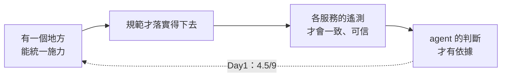
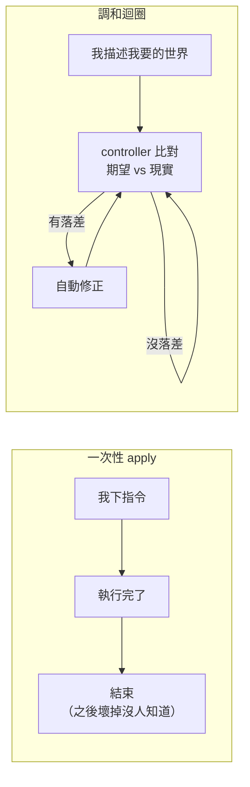

# Day3：OTel Operator，把「持續維護」從人身上搬到迴圈裡

> 一次性的 apply 是下指令
> 宣告式的 CR 是一個不會停下來的承諾
> 差別要等到某個東西被改壞的那天才看得出來

昨天講到，語意是一份共同的約定。一個團隊自己怎麼命名永遠不算錯，但只要資料要被別人讀，命名一不一致就變成治理問題。

看到今天的標題你可能會想：不是在講 AIOps 嗎，怎麼突然跳到一個 Kubernetes operator？

我先把這條因果鏈講白，因為接下來好幾天都會待在這一段：



Day1 那隻 agent 會把 60 筆 log 看成 0 筆，是因為它猜的 label 值跟那套 stack 對不上。要讓這種事不再發生，得先讓「所有服務照同一套規範送資料」這件事真的做得到。而在幾十個服務的規模下，這靠公告跟好意是達不成的，得有一個機制。

所以順序是這樣：先有施力點，才有規範；先有規範，資料才一致；資料一致，agent 的判斷才有東西可以站。中間任何一環是靠人盯著，這條鏈就斷了。

今天不會出現任何 agent，一次都不會。這是刻意的，這幾天在蓋的是後面那隻 agent 要站的地板。

那就進到今天的問題：**約定寫好了，怎麼送到幾十個服務上？**

這件事沒有想像中理所當然。Day1 那兩套 stack 會用不同的 label 表達「哪個服務」，不是因為誰不願意統一，而是它們各自安裝、各自維護，中間根本沒有一個東西在盯著。你就算寫出一份完美的 registry，只要每個服務的 OpenTelemetry（以下都簡稱 OTel）設定還是各自散在自己的 Dockerfile 裡，那份 registry 就只是一份沒有施力點的文件。

而且這種差異不是一次性的，它會持續長出來。OTel 一直在演進，SDK 一直在出新版；而每個服務自己在映像檔裡打包 `opentelemetry-instrument`、自己釘版本、自己決定什麼時候升級，那升級這件事實際上就永遠不會發生。產品團隊只會用，不會花時間盯著框架的 changelog，這很合理，那本來就不是他們的工作。再加上專案換手、人來來去去，接手的人只知道照著上一版的 Dockerfile 抄。**於是各服務之間的差異愈積愈多，而沒有任何一個地方看得到全貌。**

這就是中央平台團隊需要一個統一施力點的原因。不是為了管控，是因為沒有施力點的話，連「現在到底有幾種版本在跑」都答不出來。

> 這件事我後來想通一個判準：如果一個問題的答案是「去問各個團隊」，那它就是平台團隊該做而沒做的事。

所以今天不碰 schema，先把施力點做出來，讓環境本身變成宣告式的。

程式碼在範例 repo [`OTel_AIOps_Agent`](https://github.com/tedmax100/OTel_AIOps_Agent) 的 [`ironman-2026/day03/`](https://github.com/tedmax100/OTel_AIOps_Agent/tree/main/ironman-2026/day03)，裡面是今天做完之後那組 stack 的完整快照。這一天的所有指令都假設你在那個 repo 的根目錄下跑。

## 手動貼 YAML，到底哪裡不夠用

假設你要幫一個新服務接上 OTel。最直覺的做法是寫一份 Collector 的 Deployment YAML，`kubectl apply` 上去。這樣做完全沒問題，Collector 確實會跑起來。

問題在後續。過幾天要調 batch size、換 exporter 設定，你得手動再改一次；新服務要接進來，又重複一次「寫 YAML、apply、確認起來了」。每次變動都靠一個人主動去做一次性的動作，而叢集本身並不知道這個 Collector 應該長什麼樣子，它只知道你曾經 apply 過一份 Deployment。之後這份 Deployment 被誰改壞、Pod 被意外刪掉，叢集不會自己修回你要的樣子。

這就是一次性部署的侷限：**你做的是下指令，不是表達期望。**

而 OTel 在企業內真正麻煩的地方，剛好沒有一件是一次性的。Collector 設定要跟著流量規模調整，sidecar 要注入到每一個新起的 Pod，SDK 版本要在幾十個服務之間慢慢推。

> 我踩過最蠢的一次，是有人為了 debug 把 Collector 的 replicas 調成 0，忘了調回來。過了兩週才有人發現「欸最近怎麼都查不到 trace」，那兩週的資料就是沒了，補不回來。叢集從頭到尾沒有任何意見，因為沒有人告訴過它「這裡應該要有一個 Collector」。

## Operator pattern：宣告期望，讓迴圈去逼近它

Operator 把這件事拆成兩個角色。CRD 讓你定義一種新的資源類型，用來描述「我期望的狀態」，它是陳述句而不是指令。Controller 則是一個持續在背景跑的迴圈，不斷比對 CR 描述的期望跟叢集裡的實際狀態，有落差就自動修正。這個迴圈叫 `reconciliation loop`，中文一般翻調和迴圈。



差別不在「YAML 變成另一種 YAML」。前者是離散的動作，後者是一個不會停下來的承諾。

這裡有個性質決定了整個模型能不能成立，叫 `冪等性`。白話講就是同一件事做一次跟做十次，結果要一樣。`Reconcile()` 必須能被重複呼叫任意多次而結果一致，因為 Kubernetes 從來不保證一個事件只觸發一次：網路抖動會重試，Operator 重啟時也會對所有既存 CR 重跑一輪。所以邏輯不能寫成「建立一個 Deployment」，那重複執行就出錯了，只能寫成「先查現在有沒有，沒有才建，有就比對有沒有偏移」。

真的程式碼裡有個很扎實的例子。OTel Operator 的 `Reconcile()` 偵測到 CR 需要升級時，會先執行升級，然後直接回傳：

```go
return ctrl.Result{Requeue: true, RequeueAfter: 1 * time.Second}, nil
```

寧可結束這一輪、一秒後重跑一輪全新的，也不要拿著記憶體裡那份升級前的 instance 繼續往下算。因為升級動作本身改動了 CR 的內容，繼續用舊 spec 算出來的期望狀態是錯的。與其在同一輪裡小心翼翼地同步，不如讓下一輪重新從 k8s 讀一次最新狀態，這樣邏輯永遠只需要相信一件事：這一輪讀到的，就是當下最新的期望。

還有個細節讓「持續」變得具體。controller 不只監聽 CR 本身，也監聽它建立出來的所有子資源。有人手滑 `kubectl delete deployment` 把 Collector 刪掉（真實團隊裡常發生），Operator 會立刻偵測到並重建。**一次性 apply 的錯誤會一直錯下去直到有人發現，調和迴圈的錯誤會在下一輪自動修正。**

順帶提一個你自己動手很可能會撞到的東西。`kubectl delete otelcol` 之後物件卡在 `Terminating` 不消失，通常不是壞了，是 `Finalizer` 在等 Operator 清掉那些沒辦法掛 `ownerReference` 的 cluster-scoped 子資源，像 `ClusterRole` 之類。連刪除都不是一次性動作，要等調和確認清乾淨才算數。

### 兩個 CR，兩種完全不同的行為

| | `OpenTelemetryCollector` | `Instrumentation` |
| --- | --- | --- |
| 描述什麼 | 我要一個什麼樣的 Collector 實例（exporter、pipeline、sidecar／daemonset／gateway） | 符合什麼條件的 Pod 該被注入哪一種語言的 auto-instrumentation |
| 誰執行 | controller 建立並維護 Deployment/StatefulSet | **admission webhook** 在 Pod 建立的當下改寫它的 spec |
| 負責 | **部署行為** | **注入行為** |

這個差別不只是分類上的。`Instrumentation` 走的是 webhook，代表它只在 Pod 建立的那一刻起作用。你改了 `Instrumentation` CR，已經在跑的 Pod 不會有任何變化，得等它重建。這跟 Collector 那種「改了 CR 就自動收斂」的直覺剛好相反，很容易誤判。

Operator 一共有四種 CR，另外兩個今天有印象就好：`TargetAllocator` 管多個 Collector 副本怎麼分工抓 Prometheus target，`OpAMPBridge` 則是透過 OpAMP 協議遠端下發設定跟升級，適合 Collector 跑在 k8s 之外的情況。它們處理的都是規模變大之後才浮現的問題。

## 為什麼「注入」比「教會每個團隊寫 OTel」划算

> 有關 OpenTelemetry 本身，[小弟以前也寫過一系列](https://ithelp.ithome.com.tw/users/20104930/ironman/4960)。對開發團隊來說，產生遙測資料有兩條路：自己呼叫 OTel API 埋點，或是靠 auto-instrument 機制自動注入。這節要比的就是這兩條路的成本落在誰身上。

`Instrumentation` CR 值得單獨講一下，因為它解決的不是「少改幾行程式碼」，是一個平台工程的成本問題。

沒有 auto-instrumentation 的話，平台團隊走的是「出一個 library，請大家自己接上去」。這條路有兩筆代價。一是每個團隊都得先認識 OTel API/SDK，怎麼建 tracer、怎麼設屬性、怎麼跟框架整合，這是疊加在每個團隊身上的重複成本，不是平台付一次就結束。二是平台團隊自己的成本也不會少，光出一份 library 加文件通常不夠讓幾十個團隊動起來，還得巡迴演講、辦訓練、一個團隊一個團隊盯進度。

> 講到這裡，很多平台團隊會走上第三條路：自己包一層 wrapper 把 OTel API 藏起來，讓大家用「我們公司的埋點函式庫」。OTel 官方寫過一篇〈[Don't Wrap OpenTelemetry](https://opentelemetry.io/blog/2026/dont-wrap-opentelemetry/)〉勸退，核心概念摘幾條：
>
> - **反模式一，強迫記憶體配置。** wrapper 的簽章常寫成收一個 `List<KeyValuePair>` 或 `Vec<(String, String)>`，於是每次呼叫都在 heap 上配一次記憶體。而原生 API 對 1-3 個屬性是有零配置多載的，屬性多的時候也走 `TagList`（C#）或 borrowed slice（Rust）這種堆疊上的結構。你包一層，就把 OTel 刻意做的效能設計整個抵銷掉了。
> - **反模式二，查表型 wrapper。** 為了讓使用端只要傳一個名字，wrapper 內部用 name 去快取或查 instrument，結果就是原文那句：「*you've moved the instrument lookup into every record call*」。.NET 上是每筆量測多一次 dictionary 查找，Rust 上常變成 mutex 保護的 hashmap，直接把熱路徑變成序列化瓶頸。
> - 再加上三個會隨時間複利的問題：團隊學到的是你們家的 wrapper 而不是 OTel（人一流動知識就遷移不過去）、OTel 每加一個新能力你就得跟著改一次、多一層間接讓 debug 更難。
> - 那些包 wrapper 想解決的事，官方各給了替代方案：要測試就用 SDK 內建的 `InMemoryExporter`，要看輸出就用 stdout exporter，要文件就直接指向官方文件並回饋上游。而真的有治理需求的話，答案是 code generation 而不是 runtime wrapper。原文直接點名 Weaver，說它是「*a tool designed to generate type-safe, idiomatic OTel instrumentation code*」。
>
> 整篇的結論就一句話：「*OpenTelemetry was designed to be the stable, user-facing abstraction.*」它自己就是那層抽象了，你不需要在上面再蓋一層。

auto-instrumentation 把等式換掉。Pod 帶對 annotation 就在建立的當下被注入，服務程式碼一行都不用改。平台團隊要做的事從「說服跟教會每一個團隊」變成「把 CR 設好、把 annotation 規範公告出去」，**這是一次性的成本，跟團隊數量無關。**

這是這系列第一個平台工程判準，後面會反覆用到：一個機制的成本，會不會隨團隊數線性成長。

回頭看會發現，包一層 wrapper 跟自動注入表面上都在講降低門檻，方向卻是相反的。前者製造一個要自己維護、還會跟標準漂移的分岔版本，後者讓大家直接用官方 SDK，只是連接上去這一步都不用自己做。而官方那句「治理需求交給 code generation」，正好也是這系列後面要走的路：共用的東西留在 SDK 初始化設定（exporter、sampling、resource attribute），埋點規範則在 compile-time 生成出來。這裡先記著就好，Weaver 是後面的主角。

## 裝起來：一次性的安裝，換來持續的調和

```bash
helm repo add open-telemetry https://open-telemetry.github.io/opentelemetry-helm-charts
helm install opentelemetry-operator open-telemetry/opentelemetry-operator \
  --namespace opentelemetry-operator-system --create-namespace \
  --set admissionWebhooks.certManager.enabled=false \
  --set admissionWebhooks.autoGenerateCert.enabled=true
```

那兩個 `admissionWebhooks` 設定我多講一句。webhook 跑在 HTTPS 上需要憑證，正式環境會用 cert-manager 簽發並輪替，這裡是讓 chart 自己產一張 self-signed。這是刻意的取捨，不是更好的做法，demo 環境夠用而已，一年後過期還得手動處理。

```console
$ kubectl get crd | grep opentelemetry
instrumentations.opentelemetry.io
opampbridges.opentelemetry.io
opentelemetrycollectors.opentelemetry.io
targetallocators.opentelemetry.io
```

四個 CRD，正好對上前面那張表加另外兩種。

## 把手寫的 Deployment 換成 CR

原本 `ironman-2026/day03/k8s/13-otel-collector.yaml` 是純手寫的 `Deployment` + `Service` + `ConfigMap`。pipeline 設定原封不動搬進 `spec.config`：

```yaml
apiVersion: opentelemetry.io/v1beta1
kind: OpenTelemetryCollector
metadata:
  name: otel                      # ← 名字取成這樣是有原因的，見下
  namespace: demo
spec:
  mode: deployment
  replicas: 1
  image: otel/opentelemetry-collector-contrib:0.111.0
  config:
    receivers:
      otlp:
        protocols:
          http: { endpoint: 0.0.0.0:4318 }
          grpc: { endpoint: 0.0.0.0:4317 }
    processors:
      batch: { timeout: 5s }
      resource:
        attributes:
          - key: service
            from_attribute: service.name
            action: insert
    exporters:
      otlp/tempo: { endpoint: tempo.demo.svc:4317, tls: { insecure: true } }
      prometheusremotewrite:
        endpoint: http://prometheus.demo.svc:9090/api/v1/write
        target_info: { enabled: false }
        resource_to_telemetry_conversion: { enabled: true }
      otlphttp/loki: { endpoint: http://loki.demo.svc:3100/otlp, tls: { insecure: true } }
    service:
      pipelines:
        traces:  { receivers: [otlp], processors: [batch], exporters: [otlp/tempo] }
        metrics: { receivers: [otlp], processors: [batch], exporters: [prometheusremotewrite] }
        logs:    { receivers: [otlp], processors: [resource, batch], exporters: [otlphttp/loki] }
```

> 順帶一提，那個 `resource` processor 把 `service.name` 複製一份叫 `service`，是為了遷就 Loki 那邊的查詢習慣。這種「同一件事兩個名字」的東西，正是昨天講的第一種語意問題，而它是我自己種下的。留著，後面講命名漂移的時候會回來算這筆帳。

CR 故意叫 `otel` 而不是 `otel-collector`。Operator 幫 CR 建立 Service 的命名規則是 `<CR 名稱>-collector`，叫 `otel-collector` 會生出 `otel-collector-collector` 這種疊字。叫 `otel`，生出來的正好是 `otel-collector`，而五個服務的 `OTEL_EXPORTER_OTLP_ENDPOINT` 本來就寫死指向它。**這代表整個遷移，五個 app 的 manifest 一行都不用改。**

```console
$ kubectl -n demo get otelcol,svc
NAME                                          MODE         VERSION   READY   IMAGE
opentelemetrycollector.../otel                deployment   0.156.0   1/1     ...contrib:0.111.0

service/otel-collector               ClusterIP   4317/TCP,4318/TCP
service/otel-collector-headless      ClusterIP   4317/TCP,4318/TCP
service/otel-collector-monitoring    ClusterIP   8888/TCP
```

三個 Service，不是一個。`headless` 給 StatefulSet 場景用，`monitoring` 是 Collector 自身的 Prometheus endpoint，開在 `8888`。這兩個手寫 YAML 從來沒有過，Operator 幫你補上了。`monitoring` 那一個後面會變得很重要，要觀測 collector 自己，資料就從這裡來。

遷移過去才發現，Pod 身上的 label 現在歸 Operator 管了。我原本有個 NodePort Service 讓 host 上的 k6 直接打進來，selector 寫的是我自己貼的 `app: otel-collector`，換成 CR 之後就選不到東西，得改成貼 Operator 蓋上去的那組（`app.kubernetes.io/instance: demo.otel`，其中 `demo.otel` 是 `<namespace>.<CR 名稱>` 組出來的）。這就是交出控制權的代價：原本歸你管的東西現在歸調和迴圈管，你只能從外面貼上去。

> 而且注意那個 `demo.otel`，CR 一改名，這個 Service 就安靜地選不到任何 Pod。不會報錯，只會沒有 endpoint。又是一個沒有錯誤訊息的失敗，Day1 是空陣列，今天是空的 endpoint 列表。這種形狀之後還會一直出現。

## 逐欄位看真實輸出：哪些是我寫的，哪些是 schema 幫我決定的

`kubectl -n demo get otelcol otel -o yaml` 印出來的 `spec` 分成兩塊。我寫的那塊是 `config`、`mode`、`replicas`、`image`；Operator 自動補齊的那塊有 `upgradeStrategy: automatic`、`managementState: managed`、`ipFamilyPolicy: SingleStack`，還有一整段 `targetAllocator` 的預設值。

我從來沒寫過 target allocator 的任何一行，但 CRD 的 schema 定義了預設值，apply 之後全部自動補齊寫回 etcd。

**這正是「CRD 描述期望狀態」字面上的意思：你交出去的是一份不完整的期望，API server 用 schema 幫你補完。** 設定檔沒填的地方就是空的，CRD 沒填的地方則是 schema 幫你決定的。同一件事在 `Instrumentation` CR 上更誇張，我只寫了 exporter endpoint 跟 propagators，印出來卻連 `dotnet`、`go`、`apacheHttpd`、`nginx` 的預設映像檔跟 `resourceRequirements` 都補齊了。

### `status` 才是今天最值得看的東西

```yaml
status:
  conditions:
    - lastTransitionTime: "2026-07-23T09:02:15Z"
      message: Successfully reconciled
      observedGeneration: 1
      reason: Reconciled
      status: "True"
      type: Ready
  observedGeneration: 1
  scale:
    replicas: 1
    selector: app.kubernetes.io/component=opentelemetry-collector,app.kubernetes.io/instance=demo.otel,...
    statusReplicas: 1/1
```

`observedGeneration: 1` 對上 `metadata.generation: 1`，代表 controller 已經處理過這一版期望。改一次 `spec.config`，`generation` 跳到 2，而在 reconcile 完成前 `observedGeneration` 會暫時停在 1。兩者落差的那段時間，就是「現實還沒追上期望」的真實窗口。

這一段不只是給人 debug 用的。回頭對照昨天講的決策級遙測，它是一段結構化、機器可讀、直接回答一個具體問題的狀態描述，而那個問題是「這個 Collector 現在跟不跟得上它該有的設定」。

想像值班的情境。凌晨三點某個服務的 trace 不見了，你在猜是應用程式壞了、還是網路問題、還是 Collector 掛了。這個欄位可以直接砍掉一整個分支：如果 `observedGeneration` 停在舊值，那就是設定根本還沒套用成功，你不用再往應用程式那邊查。

Day1 那隻 agent 沒有這個東西可以讀。它面對空結果時唯一能做的推論是「這個 metric 可能沒有資料」，而「設定從來沒被成功套用」這個可能性，它連想都沒辦法想，因為那個資訊不在它拿得到的任何地方。

這是這系列第一個「本來就存在、但沒有人拿去給 agent 用」的訊號，而且它不會是最後一個。想想 controller 為了監聽子資源，本來就得維護一份「誰擁有誰」的關係圖，那份圖一直都在 etcd 裡。但今天沒有任何東西把它送到 agent 面前，所以 agent 想知道服務之間怎麼串，只能自己從 trace 一條一條反推。**叢集裡早就有答案，只是沒有人把它端出來。** 後面畫拓撲的時候會回頭處理這件事。

## `Instrumentation` CR 宣告了，但今天故意不接上去

```yaml
apiVersion: opentelemetry.io/v1alpha1
kind: Instrumentation
metadata:
  name: python-instrumentation
  namespace: demo
spec:
  exporter:
    endpoint: http://otel-collector.demo.svc:4318
  propagators: [tracecontext, baggage]
  python:
    env:
      - name: OTEL_EXPORTER_OTLP_PROTOCOL
        value: http/protobuf
```

但沒有任何一個 Pod 加上 `instrumentation.opentelemetry.io/inject-python` 這個 annotation。

五個服務的 Dockerfile 目前 `CMD` 還是 `opentelemetry-instrument uvicorn ...`，這就是「各自安裝」最具體的樣子：每個服務自己在映像檔裡打包了 zero-code 指令，各自決定要不要更新。現在就加 annotation，會變成兩套注入機制同時作用在同一個 Pod 上，那是自己找麻煩。

留白是刻意的，明天才動「誰負責注入」這個更敏感的變數。

## 收尾：讓這些 CR 進得了 GitOps

到這裡，治理資產（Collector pipeline、注入規則）已經從手寫 Deployment 變成宣告式的 CR。但還缺一件事，而它跟語法對不對無關，跟審查有關：沒有任何地方讓第二個人在東西真的套用到叢集之前，先看一眼「這個改動會不會讓某個服務突然沒有 trace」。

改動本身只有一行。加一份 `kustomization.yaml` 把「哪些檔案算數」列出來，然後 `up.sh` 從逐檔案 apply 換成單一入口：

```diff
- for f in "${ROOT}"/k8s/[0-9]*-*.yaml; do kubectl apply -f "$f"; done
+ kubectl kustomize "${ROOT}/k8s" | kubectl apply -f -
```

沒有 template、沒有 overlay、沒有 `commonLabels`，刻意選最小的一步。目前只有一個環境，拆 base/overlay 是還沒有需求就先設計。但這一行同時也讓本地流程跟 Argo CD、Flux 實際會做的事一致了：GitOps controller 不會逐檔案 apply，它是先解析成一份 manifest 再套用。兩邊不一致的話，「我本地測過」跟「GitOps 套出來的樣子」根本是兩件事。

而這一步真正的意義，用平台團隊的角度講最清楚：**Collector 的 pipeline 設定跟注入規則，從此是一份有主人、進得了 code review、之後跑得動 CI 檢查的資產，而不是某個人筆電上的 kubectl 歷史紀錄。** 後面 CI gate 要在 PR 上擋東西，總得先有一個東西可以擋，而不是 N 個散檔案。

> 特地沒加 `commonLabels`，因為它會安靜地弄壞一個東西。`api-gateway` 的 Pod 有個 `git_version` label 靠 `fieldRef` 餵進 `OTEL_RESOURCE_ATTRIBUTES`，被蓋掉不會讓 apply 失敗，只會讓 `service.version` 從新的 span 裡悄悄消失。GitOps 工具不會告訴你「這樣改安不安全」，語法檢查跟安不安全是兩件事。

### 但 kustomize 只保證「合法」，保證不了「對」

所以配了一份 `GITOPS-REVIEW.md`，五條給 reviewer 的檢查點，完整內容在 repo 裡。這五條有一個共同形狀，跟今天那個 NodePort、那個 `commonLabels` 完全一樣：**壞掉的時候沒有任何錯誤訊息，只有東西安靜地消失。**

最典型的是第一條。新增一個 Deployment 卻忘了給 `inject-python` annotation，Pod 一樣 Ready、一樣 serve 流量，但不會有任何 trace 送出去，`kubectl apply` 不報錯，`kubectl get pods` 也看不出來。

但這份清單不是任何形式的防護，會不會有人照著看、看不看得出來，完全沒驗證。要讓它從 PR 衛生習慣變成治理，下一步是把其中至少一條變成可執行的檢查，例如在 CI 裡確認每個 Deployment 都有對應的 annotation。今天留白，是為了讓「從人工到自動」這個對比是真的，不是提前把答案劇透掉。

## 今天沒做的事

開頭講的那種「差異會持續長出來」，其實有兩半，而今天只碰到一半：

| 漂移的是什麼 | 今天處理了嗎 |
| --- | --- |
| SDK 版本、注入方式、Collector 設定 | 是。從各自散在各自的 Dockerfile 裡，變成一份有迴圈在盯的 CR |
| attribute 叫什麼、代表什麼、值域是什麼 | **完全沒有。** 這個迴圈根本看不到這一層 |

而第二半更難防，有兩個來源。

一個是上游。OTel 官方訂了一份公定名單，叫 `semantic convention`，白話講就是「這種東西大家統一叫這個名字」：HTTP 請求的方法叫什麼、服務名稱叫什麼、資料庫語句叫什麼。有這份名單，你家的 Python 服務跟隔壁部門買的那套 APM，才有機會在講同一件事的時候用同一個欄位名。

但它本身一直在演進。這幾年最有感的一次，是 HTTP 那組從實驗階段走向穩定的時候，`http.method` 被改名成 `http.request.method`、`net.peer.name` 變成 `server.address`。舊名字會先標成 deprecated 再移除，而這種公告只會出現在 changelog 裡，產品團隊不會去看。於是你的系統裡開始一半的服務送新名字、一半送舊名字，兩邊都「沒有壞」。

另一個是內部。各部門會長出自己客製化的語意模型，那通常是合理的，公定名單本來就不可能涵蓋你家的業務概念。但沒有人管的話，同一個概念在三個部門就會有三個名字。

**調和迴圈能保證你送的東西一直送得出去，但保證不了那些東西彼此還在講同一種語言。** Day1 那個 `job` vs `service_name` 正好落在第二半，所以今天做完，那個問題一個字都沒被解決，它是 Weaver 那幾天的主題。

還有一個洞：Operator 自己也會重演同一個病。調和迴圈保證的是「CR 寫什麼版本，跑起來就是什麼版本」，它不會替你決定那個版本號該是多少。十幾個團隊各自維護各自的 `OpenTelemetryCollector` CR，「版本號一不一致」就又變成一個沒人管的問題，從「SDK 沒人管」變成「Collector 沒人管」而已。

**今天做的是把施力點做出來，不是把力施下去。**

## 小結

總結來說，今天做的事其實跟 AIOps 沒有直接關係，一隻 agent 都沒出現。但把手寫的 Deployment 換成一份會被持續調和的 CR 之後，平台團隊終於有一個地方可以回答「現在到底有幾種 Collector 設定在跑」，而不是回一句「去問各個團隊」。而 `status.conditions` 那段是意外的收穫，它本來就在 etcd 裡躺著，是這系列第一個「本來就存在、只是沒有人端到 agent 面前」的訊號，之後畫拓撲的時候還會再挖它一次。

> 明天把 annotation 真的換上去，順便示範一下「注入了不代表送達」。
> 那個 `resource` processor 把 `service.name` 複製成 `service` 的帳，我沒忘，只是還不敢算 XD
