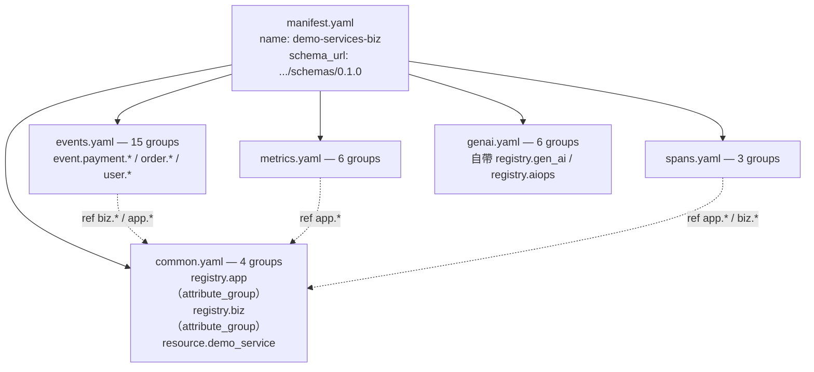
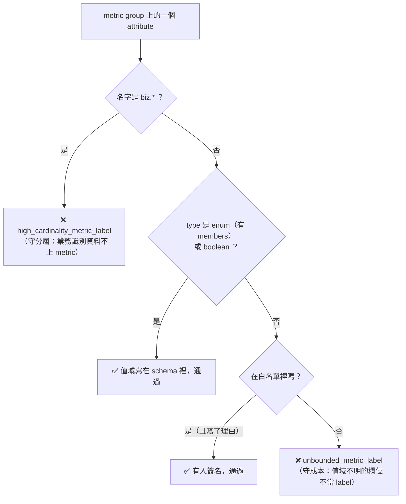

# Day5：Weaver 上手——schema 是團隊共識，第一次 `check`，以及從流量反推草稿

Day3 讓遙測**穩定地產生**，Day4 證明了「注入了不代表送達」。今天換一個問題：資料送出來了，但**每個欄位叫什麼、代表什麼、必不必填，由誰決定？**

Day1 的答案是「沒有人」——`userId` 跟 `user_id` 並存，`status` 在一個地方是業務結果、在另一個地方是 HTTP 整數狀態碼。這種東西不是靠更嚴格的 code review 能解決的，因為 review 看得到「這個 PR 改了什麼」，看不到「系統目前已經有什麼」。

要能回答「已經有什麼」，得先有一個地方把它寫下來。這就是 semantic convention 跟 registry 的位置，而 Weaver 是操作它的工具——**它不是又一個 collector、不是又一個 SDK，角色更接近「telemetry schema 的編譯器與檢查器」。**

程式碼在範例 repo [`OTel_AIOps_Agent`](https://github.com/tedmax100/OTel_AIOps_Agent) 的 [`day07/`](https://github.com/tedmax100/OTel_AIOps_Agent/tree/main/day07)、[`day08/`](https://github.com/tedmax100/OTel_AIOps_Agent/tree/main/day08)、[`day09/`](https://github.com/tedmax100/OTel_AIOps_Agent/tree/main/day09)（資料夾日號沿用原本的編號，見 Day3 的說明）。

## 為什麼 telemetry 需要 schema

先講清楚這裡的 schema **不是**資料庫 schema。它不決定資料怎麼存、不做型別轉換、也不會在 runtime 擋下任何一筆資料。它是「這個 span／metric／attribute 叫什麼、代表什麼、必不必填」的**團隊共識**，寫成機器可讀的形式。

差別看一個欄位就懂。沒有 schema 的時候：

```python
span.set_attribute("status", "created")     # 有人這樣寫
span.set_attribute("status", 502)           # 另一個服務這樣寫
```

兩行都合法，OTel 不會有任何意見。而它們合起來的後果是：`status` 這個名字在你的系統裡同時代表兩種東西，任何一條「依 status 分組」的查詢都是錯的——而且不會有人發現，因為它會回傳資料，只是那些資料沒有意義。

有 schema 的時候，你寫下的是一句宣告：

```yaml
- id: app.outcome
  type:
    members:                    # ← 值域也寫進來
      - { id: created, value: created, brief: "建立成功", stability: development }
      - { id: failed,  value: failed,  brief: "失敗",     stability: development }
  stability: development
  brief: "一次業務操作的終態結果"
```

**這是宣告，不是程式碼**——它不會讓 span 自動變成這樣，但它讓 weaver 有東西可以拿來對照。而後面十天做的每一件事（policy、CI gate、live-check、MCP、意圖），全部是「拿什麼東西去對照這份宣告」的不同變體。

### registry 的結構：一個屬性池 + 一堆引用

registry 裡的基本單位是 `group`，有五種 `type` 值得記住：`span`／`metric`／`event`／`entity` 各對應一種訊號，而第五種 `attribute_group` 不是訊號，是**一包共用屬性**，讓別的 group 用 `ref` 去引用。

這個設計決定了一份 registry 健不健康。`demo-services` 那份 34 個 group 拆在五個檔案裡（怎麼拆 Weaver 不強制），選的是「照訊號種類拆」：



那些虛線是重點：`registry.app` 跟 `registry.biz` 是整份 registry 的共用池，其他檔案幾乎都靠 `ref` 引用它們，而不是各自重寫一次定義。**「屬性定義一次、被多個 signal 共用」這個習慣，在 Day8 分層之後會從「比較整潔」升級成「必要」。**

`genai.yaml` 是唯一的例外——它自帶兩個 attribute_group、`ref` 全部指向自己檔案內部，等於一塊可以整包搬走的獨立區塊。

### 三個欄位決定這份 schema 對 agent 有多少價值

attribute 自己也有很多變化，但有三個欄位值得現在就記住，因為後面每一天都會回頭用到：

**`enum` 的 `members` 把「合法值」也納入治理範圍。** 寫 `type: string` 加兩個 `examples`，意思是「這是個字串，長得像 `created`」——沒有任何東西擋得住有人送 `CREATED` 或 `success`。改寫成 `members` 之後，這幾個值變成 schema 的一部分。**這件事對 AIOps 的意義更直接：agent 要下 `sum by (app_outcome)` 這種查詢時，`members` 是它唯一能事先知道「這個 label 只會有這幾種值」的來源**，否則它只能猜，而猜錯的方式通常是憑空生一個看起來很合理的 `success` 出來。這條線會在 Day10（agent 查 registry）、Day11（生成 enum 常數）、Day12（把這個坑寫成測試）各兌現一次。

**`requirement_level` 有四級，不是二選一**（`required`／`conditionally_required`／`recommended`／`opt_in`）。這是初次寫 registry 最容易草率帶過的欄位，但它決定了 Day7 的 live-check 拿真實流量對照時，缺了這個欄位到底算違規還是算正常。

**`template[string]` 是給「一整族 key」用的**（`app.order.tag.vip`、`app.order.tag.wholesale`…）。這種欄位天生高基數，等一下那條擋 metric label 的 policy 特別容易在這裡被觸發。

### 三種嚴格度：不是每個缺漏都同等對待

同樣是「少寫一個欄位」，weaver 的反應差很多，而這件事直接影響你能不能信任綠燈：

| 少了什麼 | 反應 | 離開碼 |
|---|---|---|
| `stability`（group 層） | ⚠ 警告 | **0** |
| `brief`（attribute 層） | × 硬錯誤 | 1 |
| `examples` | **完全不吭聲** | 0 |

第三列是這系列第一次遇到「工具用安靜表達你少寫了東西」。它會在 Day9 變成一整層驗證模型（`--future`），也會在 Day12 變成一個方法論。

## 先確認「這個檢查真的有在檢查」

第一次跑之前先做一件事，理由是我踩過 `-r .` 那個假綠燈——registry 路徑寫錯，weaver 讀到 0 個 group，然後開心地告訴你沒有違規：

```
$ weaver registry stats -r day06/weaver/registry
Registry
  - 34 groups
    - 5 AttributeGroups
    - 1 Entitys
    - 15 Events
    - 8 Metrics
    - 5 Spans
```

**34 個 group，不是 0——這個檢查是真的有讀到東西。** 有了這個數字打底，下面那個綠燈才有意義。這個「先量一個基準」的習慣，後面會變成 CI 裡一道正式的探針（Day7），以及 checklist 裡的一項（Day13）。

順帶一提，`resource.demo_service` 這個 group 的 `type` 是 `resource`，前面那五種裡沒有它，但 stats 把它算進了 `1 Entitys`——`resource` 在 weaver 內部是當成 entity 處理的。**那五種不是封閉清單，是最常用的五種。**

## 第一次真的跑：乾淨到有點意外

```
$ weaver registry check -r day06/weaver/registry
✔ No `after_resolution` policy violation

$ weaver registry check -r day06/weaver/registry -p day06/weaver/policies
✔ No `after_resolution` policy violation
```

兩次都乾淨。第一次跑就綠燈會讓人懷疑「是不是根本沒認真檢查」，但這符合預期：這份 registry 是照**目標命名**新寫的，不是拿舊的 flat key 硬塞進來。它跟現在程式碼裡的欄位是這樣對應的：

| 現在程式碼裡的 flat key | registry 裡的目標 attribute | 訊號 |
|---|---|---|
| `user_id` | `biz.user.id` | log/span |
| `order_id` | `biz.order.id` | log/span |
| `status`（metric label） | `app.outcome` | metric/span |
| `status`（gateway log，其實是 HTTP 狀態碼） | `app.upstream.status_code` | log ⚠️ 同一個字串在不同地方代表不同東西 |
| `reason` | `app.fail_reason` | metric/log/span |

**所以這個綠燈只證明「這份 schema 定義本身內部一致」，完全不保證「跑起來的服務有照它送資料」。** 那是 Day7 live-check 要揭穿的事。這個「定義對 ≠ 行為對」的區分，是整個第一階段的骨幹。

### `stats` 的另一半：把 schema 設計攤成數字

`stats` 不只用來當探針，它輸出的幾個數字是可以拿來做設計檢討的：

| 數字 | 讀出來的意思 | 該問的問題 |
|---|---|---|
| `deduplicated attributes: 55 (53%)` | 重用率 53% | 太低代表大家各自重寫定義；一半以上被 `ref` 共用是健康的 |
| 18 個 `enum` | 18 個欄位把合法值寫進 schema | 剩下 23 個 `string` 裡，有沒有其實該是 enum 的？ |
| 有一個 enum 有 15 個成員 | 15 個值 | 拿去當 metric label 就是 15 條時間序列起跳 |
| `required: 17`／`recommended: 30` | 必填佔三成 | 必填太多會讓 live-check 噴一堆違規；太少等於沒有承諾 |
| `development: 100%` | 沒有任何 attribute 是 `stable` | 符合現況——這份 registry 沒對任何人承諾「不會再改」。Day9 講 breaking change 時這個 100% 會開始鬆動 |

## 三個示範：管線上三個不同的位置各踩一次

拿一份丟棄式的複製亂改，看錯誤長什麼樣。

**示範一：`ref` 指到不存在的屬性。** 在 metric group 裡塞一行 `- ref: app.nonexistent_attr`——這是 `weaver_resolver` 階段的錯誤，管線根本走不到 policy，輸出是純文字診斷、exit 1。

**示範二：把高基數的業務識別碼拿去當 metric label。** 改成 `- ref: biz.order.id`，這正是自訂 `biz_policies.rego` 要擋的事，輸出是帶 `id`／`level`／`context` 結構的 Finding、exit 1。

**示範三：弄壞、但沒被抓到。** 這個最重要。翻開那條 policy 的規則本體：

```rego
deny contains high_cardinality_metric_label(group.id, attr.name) if {
	group := input.groups[_]
	group.type == "metric"
	attr := group.attributes[_]
	startswith(attr.name, "biz.")     # ← 只認名字前綴
}
```

**它擋的不是「高基數」，是「名字開頭是 `biz.`」。** 這兩件事在這份 registry 裡剛好重疊，因為團隊把所有業務識別碼都收進了 `biz.*`。只要有人繞過這個慣例就會安靜放行。實測——定義一個一樣高基數、但掛在 `app.*` 底下的追蹤碼 `app.order.tracking_id`，掛到同一個 metric 上：

```
$ weaver registry check -r /tmp/weaver-demo/registry -p /tmp/weaver-demo/policies
✔ No `after_resolution` policy violation

$ echo $?
0
```

綠燈。這條 metric 現在每一筆訂單都會生出一條新的時間序列，而檢查完全沒有意見——因為它從頭到尾沒有在看基數，只是在看名字。

這是繼 `-r .` 之後第二次踩到同一類問題的不同版本：**檢查通過，不等於東西是對的。** 但兩者的性質不同，而這個區別值得記住：`-r .` 是**工具用法出錯**（讀不到檔案），可以靠 `stats` 探針發現；這次是**規則本身的能力邊界**（規則寫得比它宣稱要解決的問題窄），只能靠「知道自己這條規則實際在比對什麼」。**命名慣例跟 policy 是一組配套：policy 只認得慣例，慣例一旦破功，policy 就跟著失效。**

### 把規則改對：從「檢查名字」到「檢查值域」

原規則問錯了問題。它問「這個 attribute 叫什麼」，該問的是「**這個 attribute 的值有幾種可能**」——metric label 的成本完全由值域大小決定，跟名字無關。

registry 有辦法回答值域嗎？有，就是前面講的 `enum.members`。所以規則翻轉成一句話：

> **metric label 只能是值域有界的型別——enum 或 boolean。其他一律視為無界，除非被明確列入白名單。**

這是「預設拒絕」而不是「列舉壞東西」。原規則要窮舉所有危險的命名前綴（`biz.`、然後呢？`app.*.id`？`*.tracking_id`？）永遠列不完；新規則只要窮舉**例外**，而例外是有限的、每一條都該有人簽名。



**意外收穫：新規則在沒動過手腳的那份 registry 上抓到一個真的。**

```
✔ All `after_resolution` policies checked (2 violations found)
  - Message : id=unbounded_metric_label, group=metric.gen_ai.client.operation.duration, attr=gen_ai.request.model
  - Message : id=unbounded_metric_label, group=metric.gen_ai.client.token.usage,       attr=gen_ai.request.model
```

`gen_ai.request.model` 是 `type: string`、掛在兩個 GenAI metric 上。這不是我埋的梗，是這份 registry 寫下來就存在、但舊規則永遠看不到的東西（它不叫 `biz.*`）。

**而這正是好規則該有的效果：它逼出一個必須有人做決定的問題，而不是給一個機械式的答案。** 兩條路——寫成 enum（值域進 schema，Day10 的 MCP 也能直接告訴 agent 只有這幾個值），或保持開放但加進白名單並寫上理由。我選後者，因為 model id 會隨供應商更新而變，寫死成 enum 會讓每次換模型都變成一次 registry 改版。

加上白名單之後回到綠燈——但**這次的綠燈跟開頭那個綠燈，意義完全不同**。開頭那個是「沒有任何欄位的名字以 `biz.` 開頭」；現在這個是「每一個 metric label 的值域，要嘛寫在 schema 裡有界，要嘛有人明確簽名允許它無界」。同樣一行 `✔`，保證強度差很多。

那個白名單集合本身也變成一份有用的文件——**它就是「這份 registry 目前承擔的所有 cardinality 風險」的完整清單**，一眼看得完，每一條都有署名的理由。這比散落在註解裡的 `# TODO: 這個可能會爆` 有用得多。

## `infer`：治理不必從一張白紙開始

到這裡有一個很現實的問題沒回答：上面那份 registry 是「照目標命名新寫的」——但如果你手上是一個跑了三年、沒有人知道到底在送什麼欄位的系統，第一步該做什麼？

`weaver registry infer` 就是為這一步存在的，而它有一個容易誤解的地方：**它不是讀你的程式碼或檔案，它是一個 OTLP 接收器。** 你把它跑起來、把真實流量打進去，它從線路上看到什麼就反推什麼。

```
$ weaver registry infer --otlp-grpc-port 14317 --registry-path /tmp/inferred
```

（port 不用預設的 4317，理由 Day7 會講——那個坑很值得單獨記一筆。）

三個指令的分工這樣看最清楚：

| | `registry check` | `registry infer` | `registry live-check`（Day7） |
|---|---|---|---|
| 輸入 | registry YAML | 真實 OTLP 流量 | registry YAML **＋** 真實流量 |
| 輸出 | 通過／違規 | 一份 schema 草稿 | 真實流量違反 registry 的清單 |
| 問的問題 | 「我寫的規範自不自洽？」 | 「**我的系統現在到底在送什麼？**」 | 「送出去的東西有沒有照規範？」 |
| 需要事先有 registry | 要 | **不用** | 要 |
| 典型用途 | CI merge gate | 導入治理的第一天 | 上線後的持續稽核 |

對 Day1 那個服務跑一次，`userId` 跟 `user_id` **兩個名字一字不差地被學了進去**——這是漂移第一次以「資料」而不是「敘述」的形式出現。一份 infer 出來的草稿裡同時有兩個同義欄位，就是一份現成的待辦清單。

### 一個受控的往返實驗：語意不在線路上

更有意思的是拿一份**已知的** registry 做往返：先 `weaver registry emit` 把它照定義發成 OTLP，讓 `infer` 收下來，再比對兩份 YAML 差在哪。

| 資訊 | 往返之後 | 為什麼 |
|---|---|---|
| group 的存在與名字 | ✅ 保住 | 直接寫在 OTLP 裡 |
| metric 的 `instrument`／`unit` | ✅ 保住 | 是 OTLP metric 的欄位 |
| attribute 的名字與基本型別 | ✅ 保住 | 可以從值推斷 |
| `examples` | ⚠️ 部分 | 只有「這次剛好流過去的值」 |
| `brief`／`note` | ❌ 全空 | **語意不在線路上** |
| `requirement_level` | ❌ 一律 `recommended` | 「必不必填」是承諾，不是觀察得到的事實 |
| `enum` 的 `members` | ❌ 退化成 `string` | 只看到用過的值，看不到值域 |

這張表是今天最該帶走的東西，因為它同時定義了**自動化能到哪裡**跟**治理的價值在哪裡**。

前三列可以自動化：名字、型別、結構都在線路上，機器抓得到。後四列不行，而它們剛好是**對 agent 最有價值的四項**：`brief` 是語意、`requirement_level` 是承諾、`members` 是值域。**「觀察」永遠只能給你前三列；後四列必須有人坐下來決定。** 這就是「自動生成的草稿」跟「團隊審過的規範」之間的差距，也是為什麼 `infer` 是治理的**起點**而不是治理本身。

反過來說，這也讓 `infer` 的正確用法很清楚：**它是一份「現況盤點」，用來讓那場對話有素材可以吵**——`userId` 跟 `user_id` 到底留哪一個、`status` 那兩種意思要拆成幾個欄位。沒有這份草稿，這場對話會停在「我覺得應該…」；有了它，對話從「這是我們現在真的在送的 41 個欄位」開始。

## 今天沒做的事

沒有處理 `infer` 出來的 group id 組織方式——它會照自己的規則重新分組，跟人寫的結構不一樣，直接拿去用會得到一份很難讀的 registry。實務上這份草稿要人整理過才能進 repo。

沒有把那條值域規則的 Rego 語法講清楚（`deny contains ... if` 這個 rego v1 寫法、`is_object` 這類內建函式、規則怎麼組合）——明天講命名漂移時會連同三條逐步加難的規則一起還掉。

沒有回答「這份 registry 該不該對 Day1 的現況妥協」。今天那張對照表是「目標命名」，也就是說系統現在送的每一個欄位都不合規。要嘛改程式碼、要嘛改 registry，這個決定會影響接下來所有 gate 的紅綠——而做這個決定需要先知道「不合規的量有多大」，那要等 Day7 的 live-check 給出數字。

明天：命名漂移為什麼靠 code review 擋不住，以及用 Rego policy 把它抓出來——三條逐步加難的規則、實跑 9 個違規、exit 1，順便把今天欠的 Rego 語法還完。
