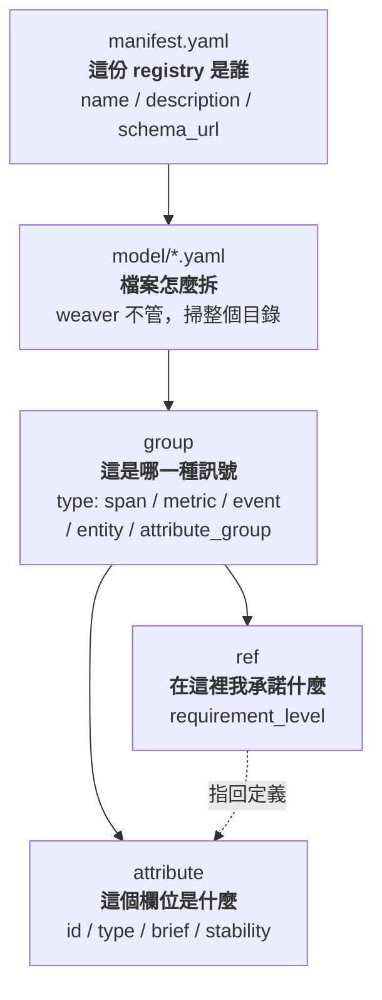
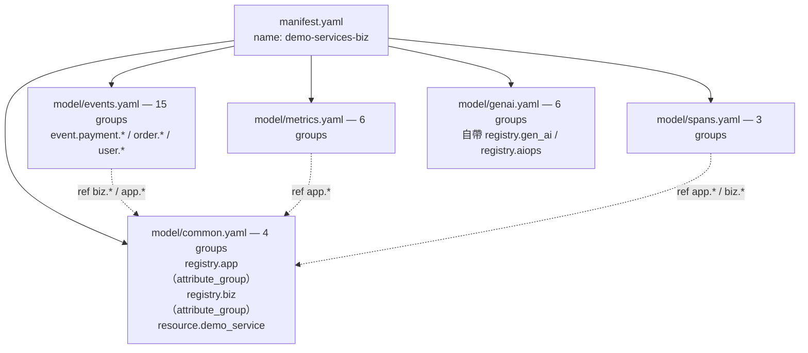
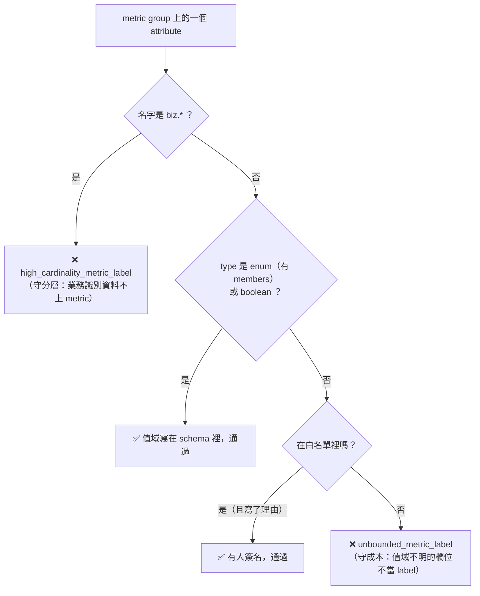

# Day5：Weaver 上手，schema 是團隊共識

前兩天在處理「資料能不能穩定產生、能不能送達」。今天換一個問題：資料送出來了，但**每個欄位叫什麼、代表什麼、值可以是哪些，由誰決定？**

Day1 那隻 agent 給過答案：沒有人決定。

回想它為什麼會把 60 筆 log 看成 0 筆。它下的查詢是 `level="WARN"`，而那套 stack 裡的值是小寫的 `warn`。這不是它笨，是**那個欄位的值域從來沒有被寫在任何一個它拿得到的地方**。它只能猜，而猜錯的懲罰是一個沒有錯誤訊息的空陣列。

同一天的 `job` 跟 `service_name` 也是。兩套 stack 各自都對，只是沒有一個地方寫著「在我們這裡，服務名這個概念叫什麼」。

這種東西不是靠更嚴格的 code review 能解決的。review 看得到「這個 PR 改了什麼」，看不到「系統目前已經有什麼」。要能回答「已經有什麼」，得先有一個地方把它寫下來。

這就是 semantic convention 跟 registry 的位置，而 [Weaver](https://github.com/open-telemetry/weaver) 是操作它的工具。它不是又一個 collector、也不是又一個 SDK，角色更接近 **telemetry schema 的編譯器與檢查器**。

程式碼在範例 repo [`OTel_AIOps_Agent`](https://github.com/tedmax100/OTel_AIOps_Agent) 的 [`ironman-2026/day05/`](https://github.com/tedmax100/OTel_AIOps_Agent/tree/main/ironman-2026/day05)：

```
ironman-2026/day05/
├── registry/          ← 本篇主角，34 個 group
│   ├── manifest.yaml
│   └── model/{common,events,metrics,spans,genai}.yaml
├── policies/          ← Rego policy，含一份改對之後的版本
└── examples/          ← 七份最小可執行的獨立 registry，各示範一種 group type
```

指令一律假設從 repo 根目錄跑。本篇的 weaver 版本是 [**0.25.1**](https://github.com/open-telemetry/weaver/releases/tag/v0.25.1)，這個工具還在快速演進，不同版本的輸出可能不一樣。

## 為什麼 telemetry 需要 schema

先講清楚這裡的 schema **不是**Database的 schema。它不決定資料怎麼存、不做型別轉換、也不會在 runtime 擋下任何一筆資料。它是「這個 span／metric／attribute 叫什麼、代表什麼、必不必填」的**團隊共識**，寫成機器可讀的形式。

差別看一個欄位就懂。沒有 schema 的時候：

```python
span.set_attribute("status", "created")     # 有人這樣寫
span.set_attribute("status", 502)           # 另一個服務這樣寫
```

兩行都合法，OTel 不會有任何意見。而它們合起來的後果是：`status` 這個名字在你的系統裡同時代表兩種東西，任何一條「依 status 分組」的查詢都是錯的。而且不會有人發現，因為它會回傳資料，只是那些資料沒有意義。

有 schema 的時候，你寫下的是一句宣告：

```yaml
- id: app.outcome
  type:
    members:                    # ← 值域也寫進來
      - { id: created, value: created, brief: "建立成功", stability: development }
      - { id: failed,  value: failed,  brief: "失敗",     stability: development }
  stability: development
  brief: "一次業務操作的終態結果"
```

**這是宣告，而不是程式碼**。它不會讓 span 自動變成這樣，但它能讓 weaver 有東西可以拿來對照。而後面十天做的每一件事（policy、CI gate、live-check、MCP、意圖），全部是「拿什麼東西去對照這份宣告」的不同變體。

這些宣告要寫在哪裡、怎麼組織成一個整體，答案就是 **registry**，一堆這樣的宣告收在一起、彼此可以互相引用的集合。schema 是「一句宣告長什麼樣」，registry 是「這些宣告住的地方」。

> 有 schema 能透過像 protobuf 那樣來產生對應語言的程式碼（` weaver registry generate`）。也能透現有運行中的 signal 來產生 schema 也能（`weaver registry infer`）。這都是 weaver 提供的能力。

### registry 的結構：一個屬性池 + 一堆引用

registry 裡的基本單位是 `group`，有五種 `type` 值得記住：`span`／`metric`／`event`／`entity` 各對應一種訊號，而第五種 `attribute_group` 不是訊號，是**一包共用屬性**，讓別的 group 用 `ref` 去引用。

五種各長什麼樣，直接看最小的例子（`ironman-2026/day05/examples/` 底下每個資料夾就是一份可以單獨跑 `check` 的完整 registry）：

```yaml
# span：多一個 span_kind
- id: span.order.create
  type: span
  span_kind: server
  brief: "建立訂單的 Span"

# metric：多三個欄位，metric_name / instrument / unit
- id: metric.app.orders.count
  type: metric
  metric_name: app.orders.count
  instrument: counter          # counter / updowncounter / gauge / histogram
  unit: "{order}"

# event：多一個 name，那是 log event 的名字
- id: event.payment.audit
  type: event
  name: payment.audit

# entity：也用 name，但它描述的是「一個東西」而不是「一件事」
- id: entity.k8s.pod
  type: entity
  name: k8s.pod

# attribute_group：沒有任何訊號專屬欄位，因為它不是訊號
- id: common.resource
  type: attribute_group
```

差別集中在「這種訊號自己需要什麼」：span 要 `span_kind`（server／client／internal…），metric 要 `instrument` 跟 `unit`，event 跟 entity 要一個 `name`。`attribute_group` 什麼都不用，因為它不會被送出去，只是被別人引用。

`entity` 那個容易跟 event 搞混，記法是：**event 是「發生了什麼」，entity 是「這是誰」。** `k8s.pod` 不是一件事，它是一個會被別的訊號指涉的對象。

而 `attribute_group` 存在的意義，把兩個檔案放在一起就看得出來：

```yaml
# common.yaml：定義一次
- id: common.resource
  type: attribute_group
  attributes:
    - id: deployment.environment
      type: string
      examples: ["production", "staging"]

# order.yaml：用 ref 引用，不重寫定義
- id: span.order.create
  type: span
  attributes:
    - ref: deployment.environment        # ← 只引用
    - id: user_id                        # ← 這個是自己定義的
      type: string
      requirement_level: required
```

注意 `ref` 只寫了一個 id，**完全沒提它是哪個 `attribute_group` 裡的**。那會不會有兩包各自定義同名 attribute、然後不知道指到誰？不會，weaver 直接擋掉：

```console
$ weaver registry check -r <兩個 attribute_group 都定義 deployment.environment>
× The attribute id `deployment.environment` is declared multiple times in
│ the following groups:
│ ["common.one", "common.two"]
exit=1
```

**attribute 的 id 是整份 registry 全域唯一的**，不是每個 group 各自一個命名空間。所以 `ref` 不可能有歧義，撞名的東西根本進不了 registry。

> 這個輸出有個容易看走眼的地方：它上面還印了一行 `✔ No after_resolution policy violation`。那只代表 policy 那一關沒事，錯誤是在更早的 resolver 階段爆的。**看到 ✔ 不等於過了，要看 exit code。** 這個「同一次輸出裡綠燈跟紅字並存」的情況，後面拆管線三個階段時會再遇到。

先看整份東西是怎麼疊起來的。從最外層到最裡層總共四層，每一層各回答一個問題：



圖裡 `ref` 那一支是整個設計的關鍵，等一下會單獨展開：**一個屬性的「定義」跟它的「使用承諾」被刻意拆到了兩個地方。** `attribute` 回答「這個欄位是什麼」，`ref` 回答「在這個 group 裡我承諾它必不必填」，而那條虛線代表 `ref` 指回去的那個定義。

`manifest.yaml` 是身分證，這份長這樣（註解略）：

```yaml
name: demo-services-biz
description: >-
  Semantic conventions for the o11y-bench demo-services telemetry ...
schema_url: https://tedmax100.github.io/o11y-bench/demo-services/schemas/0.1.0
```

**注意它沒有列出任何檔案清單。** weaver 不是照 manifest 的索引讀檔，而是**從 `manifest.yaml` 所在的那一層開始往下遞迴掃，掃到的每一份 YAML 都當成 registry 內容**。

所以 `model/` 這個目錄名沒有任何強制力，它只是官方 semantic-conventions repo 的慣例。四種擺法實測，每一份都只有一個 group：

| 擺法 | 結果 |
|---|---|
| YAML 直接平放在 `manifest.yaml` 旁邊 | ✅ 讀到 |
| 放在 `model/` 子目錄 | ✅ 讀到 |
| 放在 `schema/` 子目錄（自己取的名字） | ✅ 讀到 |
| 放在 `model/sub/deep/` 三層深 | ✅ 讀到 |

跟著慣例用 `model/` 的好處只有一個：別人一眼看得懂。除此之外你怎麼擺都行。（那個慣例本身長什麼樣、為什麼是 `model/` 這個名字，留到後面〈拿官方 registry 當對照組〉一起看。）

好處是「新增一個檔案」不必改 manifest。**代價是你放進去的任何東西它都會讀，而它對兩種誤放的反應完全不同。**

第一種：丟進一份根本不是 registry 的 YAML。 在 `model/` 裡放一份 k8s ConfigMap：

```
× Object contains unexpected properties: apiVersion, kind, metadata.
  These properties are not defined in the schema.
```

硬錯誤、exit 1。這種很好，它把話講清楚了，你不可能誤會。

第二種：丟進一份格式正確、但不該在這裡的 YAML。 想像你改 registry 之前手動備份了一份 `oops-backup.yaml`，裡面是合法的 group 定義：

```
$ weaver registry stats -r <registry>
  - 2 groups          ← 從 1 個變成 2 個

$ weaver registry check -r <registry> ; echo $?
0                     ← 綠燈
```

（順帶說明，`-r` 是 `--registry` 的簡寫，用來告訴 weaver「這份 registry 在哪」。所有 `weaver registry *` 的指令都吃這個參數，等一下會看到它指錯地方的兩種後果。）

**group 數悄悄多了一個，check 照樣綠燈，一句話都沒有。** 改副檔名成 `.yml` 也一樣被讀進去。

這兩種反應的差別，就是這篇後面會反覆講的那條線：**第一種是「你用錯了」，工具有能力知道；第二種是「你放錯了」，工具沒有任何依據能判斷**。它怎麼知道那份備份不是你新加的一塊 registry？

而這個「多讀」的後果比想像中大。多出來的 group 會進 resolved schema，於是它會被 policy 檢查、會進後面用 template 生出來的程式碼、也會被之後那個回答 agent 問題的 MCP server 端出去。**一份你以為早就刪掉的備份，最後變成 agent 眼中的事實。**

這也讓 `-r` 這個參數的兩個方向都變得很危險：指錯一層是**少讀**（0 個 group，等一下就會示範那個假綠燈），殘留檔案是**多讀**。兩個方向都沒有錯誤訊息，而唯一能發現的方式，就是下一節那個 `stats` 基準數字。

實務上的建議很直白：**registry 目錄裡不要放任何不是 registry 的東西。** 備份交給 git，臨時實驗丟 `/tmp`。

這也直接決定了 `-r` 該指到哪裡：**指的是「有 `manifest.yaml` 的那一層」，不是「有 YAML 的那一層」。** 這份 registry 的 YAML 在 `ironman-2026/day05/registry/model/`，但指令永遠寫 `-r ironman-2026/day05/registry`。

指錯的話會怎樣？我實際試了兩種指錯法：

```console
$ weaver registry check -r ironman-2026/day05/registry/model
ℹ No registry manifest found: .../model/manifest.yaml
  - 34 groups                      ← 檔案還是讀到了，但這份 registry 沒有身分
exit=0

$ weaver registry check -r .        # 指到 repo 根目錄
ℹ No registry manifest found: ./manifest.yaml
  - 0 groups                       ← 什麼都沒讀到
exit=0
```

**兩種都是 exit 0。** 第二種就是那個假綠燈：你以為 CI 在把關，其實它檢查了一個空集合。

0.25.1 至少會印一行 `ℹ No registry manifest found` 提醒你，比早期版本好一點。但注意那是 `ℹ` 等級，**它不影響離開碼**，所以在 CI 的 log 裡它會被淹掉，而那一格永遠是綠的。

實際攤開來是這樣（[`ironman-2026/day05/registry/`](https://github.com/tedmax100/OTel_AIOps_Agent/tree/main/ironman-2026/day05/registry)）：

```
ironman-2026/day05/registry/          ← -r 指這一層（有 manifest.yaml 的那層）
├── manifest.yaml
└── model/
    ├── common.yaml     4 groups   registry.app / registry.biz / resource.demo_service
    ├── events.yaml    15 groups   event.payment.* / order.* / user.*
    ├── genai.yaml      6 groups   registry.gen_ai / registry.aiops ＋ 2 metric ＋ 2 span
    ├── metrics.yaml    6 groups
    └── spans.yaml      3 groups
                       ─────────
                        34 groups
```

（檔案直接看：[`common.yaml`](https://github.com/tedmax100/OTel_AIOps_Agent/blob/main/ironman-2026/day05/registry/model/common.yaml)、[`events.yaml`](https://github.com/tedmax100/OTel_AIOps_Agent/blob/main/ironman-2026/day05/registry/model/events.yaml)、[`metrics.yaml`](https://github.com/tedmax100/OTel_AIOps_Agent/blob/main/ironman-2026/day05/registry/model/metrics.yaml)、[`spans.yaml`](https://github.com/tedmax100/OTel_AIOps_Agent/blob/main/ironman-2026/day05/registry/model/spans.yaml)、[`genai.yaml`](https://github.com/tedmax100/OTel_AIOps_Agent/blob/main/ironman-2026/day05/registry/model/genai.yaml)）

34 個 group 就是這樣拆在五個檔案裡的。**怎麼拆 Weaver 完全不管**。它掃 `model/` 底下所有 YAML，全部攤平成 34 個 group，你要把它們全塞進一個 `everything.yaml` 也照跑。拆檔案純粹是給人讀的，而這裡選的是「照訊號種類拆」：檔名對應 OTel 的訊號，共用屬性另外收一個 `common.yaml`。



那些虛線是重點：`registry.app` 跟 `registry.biz` 是整份 registry 的共用池，其他檔案幾乎都靠 `ref` 引用它們，而不是各自重寫一次定義。**「屬性定義一次、被多個 signal 共用」這個習慣，在之後 registry 開始分層以後，會從「比較整潔」升級成「必要」。**

`genai.yaml` 是唯一的例外。它自帶兩個 attribute_group、`ref` 全部指向自己檔案內部，等於一塊可以整包搬走的獨立區塊。

順帶一提，**「檔案怎麼拆」跟「type 怎麼分佈」是兩件事**，別把上面那張圖的數字跟 `stats` 的數字對起來看。`metrics.yaml` 有 6 個 group，但 `stats` report 8 個 Metrics，多出來的兩個在 `genai.yaml` 裡。檔案是給人讀的組織方式，weaver 眼裡只有 group。

### 為什麼需要 `attribute_group` 這種「不是訊號」的東西

這個問題我想多講一點，因為它是整份 registry 設計的地基。

假設沒有 `attribute_group`。`biz.user.id` 要同時出現在一個 span 跟一個 event 上，你就得把同一份定義寫兩次，型別、`brief`、`stability`、enum members 全部複製一遍。然後兩份定義會開始各自漂移：有人改了 span 那份的 `brief`，event 那份沒改；有人在 span 那份加了一個 enum member，event 那份沒加。

**於是你為了消滅命名漂移而建的 registry，自己內部長出了漂移。**

`attribute_group` 就是那個屬性池：定義一次，其他 group 用 `ref` 指過來。慣例上這種 group 的 `id` 用 `registry.` 開頭（`registry.app`、`registry.biz`、`registry.gen_ai`），一眼看得出「這裡是定義處，不是訊號」。

這也是為什麼等一下 `stats` 那個 `deduplicated attributes: 55 (53%)` 是設計指標而不只是統計：53% 代表超過一半的屬性是被共用的。這個數字低，代表大家各寫各的，那份 registry 遲早會自相矛盾。

### `ref` 展開之後是什麼

`ref` 不是「指標」，是編譯期的展開。看一個引用方，`model/events.yaml` 裡的宣告只有三行：

```yaml
  - id: event.payment.declined
    type: event
    name: payment.declined
    stability: development
    brief: A charge was declined by validation.
    attributes:
      - ref: biz.order.id
        requirement_level: required
      - ref: app.fail_reason
        requirement_level: recommended
```

跑 `weaver registry resolve` 看它解析之後的樣子：

```yaml
id: event.payment.declined
type: event
brief: A charge was declined by validation.
stability: development
attributes:
- name: app.fail_reason
  type:
    members:
    - id: unknown_product
      value: unknown_product
      brief: Requested product id does not exist.
      stability: development
    - id: auth
      value: auth
      ...          # 13 個 member 全部展開在這裡
```

**那一行 `- ref: app.fail_reason` 展開成了完整的定義，含 13 個 enum member。** 這件事有兩個後果值得記住。

第一，policy 跟 template 看到的是展開後的東西，不是你寫的東西。後面寫 Rego 規則時你操作的是 `input.groups[_].attributes[_].name`。那個 `name` 只存在於展開後的結構裡，原始 YAML 裡的欄位叫 `ref`。這是初次寫 policy 最容易卡住的地方。

第二，`resolve` 是你唯一能確認「我以為的」跟「weaver 認定的」是同一件事的工具。當 `ref` 指錯、或分層 registry 的繼承沒生效時，`check` 可能還是綠的，但 `resolve` 的輸出會直接把真相攤開。**養成習慣：改完 registry 先 `resolve` 看一眼，再談 `check` 過不過。**

### 三個欄位決定這份 schema 對 agent 有多少價值

attribute 自己也有很多變化，但有三個欄位值得現在就記住，因為後面每一天都會回頭用到：

`enum` 的 `members` 把「合法值」也納入治理範圍。 寫 `type: string` 加兩個 `examples`，意思是「這是個字串，長得像 `created`」，沒有任何東西擋得住有人送 `CREATED` 或 `success`。改寫成 `members` 之後，這幾個值變成 schema 的一部分。**這件事對 AIOps 的意義更直接：agent 要下 `sum by (app_outcome)` 這種查詢時，`members` 是它唯一能事先知道「這個 label 只會有這幾種值」的來源**，否則它只能猜，而猜錯的方式通常是憑空生一個看起來很合理的 `success` 出來。這條線會在後面幾天（agent 查 registry、生成 enum 常數、把這個坑寫成測試）各兌現一次。

`requirement_level` 有四級，不是二選一（`required`／`conditionally_required`／`recommended`／`opt_in`）。這是初次寫 registry 最容易草率帶過的欄位，但它決定了之後 live-check 拿真實流量對照時，缺了這個欄位到底算違規還是算正常。

而它還有一個位置上的設計，比四個等級本身更值得理解：**`requirement_level` 寫在引用處，不寫在定義處。**

為什麼？因為**必填程度是「這個訊號的承諾」，不是「這個欄位的本質」**。同一個欄位在不同情境的必填程度天生就不同，而這份 registry 裡剛好有一組教科書等級的例子。`model/spans.yaml` 的建立訂單 span：

```yaml
  - id: span.app.order.create
    attributes:
      - ref: biz.user.id
        requirement_level: required
      - ref: biz.order.id
        requirement_level:
          conditionally_required: when the order was created.
      - ref: app.fail_reason
        requirement_level:
          conditionally_required: when `app.outcome` is not `created`.
```

在**建立訂單**這個 span 上，`biz.order.id` 不可能是 `required`，訂單建立失敗的時候，根本還沒有 order id 可以填。而 `app.fail_reason` 剛好相反，只有失敗時才該有。這兩個 `conditionally_required` 是一組互斥的承諾，而且條件寫成了人看得懂的句子。

同一個 `biz.order.id`，在 `event.payment.requested` 上就是硬性的 `required`（都要付款了不可能沒有訂單），在這個 span 上是 `conditionally_required`。如果 `requirement_level` 綁在定義處，你只能二選一：要嘛 `required`（成功的請求會被誤判違規），要嘛 `recommended`（等於放棄要求）。**定義處回答「這是什麼」，引用處回答「在這裡我承諾什麼」。**

注意 `conditionally_required` 的 YAML 寫法。它是一個帶值的 map，不是一個字串：

```yaml
        requirement_level:                                    # ✅ 正確
          conditionally_required: when the order was created.

        requirement_level: conditionally_required             # ❌ 少了條件
```

這個條件字串不是註解，它會被帶進 resolved schema、進到生成的文件、也進得了後面那個 MCP server 的回答裡。它是少數幾個「寫給人看的句子」會一路流到 agent 面前的欄位之一。所以請把它當成規格寫，不要寫「有時候需要」。

**`template[string]` 是給「一整族 key」用的**（`app.order.tag.vip`、`app.order.tag.wholesale`…）。這種欄位天生高基數，等一下那條擋 metric label 的 policy 特別容易在這裡被觸發。

### 三種嚴格度：不是每個缺漏都同等對待

同樣是「少寫一個欄位」，weaver 的反應差很多，而這件事直接影響你能不能信任綠燈：

| 少了什麼 | 反應 | 離開碼 |
|---|---|---|
| `stability`（group 層） | ⚠ 警告 | **0** |
| `brief`（attribute 層） | × 硬錯誤 | 1 |
| `examples` | **完全不吭聲** | 0 |

第三列是這系列第一次遇到「工具用安靜表達你少寫了東西」。它之後會變成一整層驗證模型（`--future`），最後還會變成一整天的方法論。

### 順帶說明：這份用的是 v1 語法

在跑之前先講一下版本，因為這件事有兩個都叫「v2」的東西，很容易混在一起。

這份 registry 用的是 **v1 語法**，也就是你前面看到的那個 `groups:`。weaver 另外有一套還在 alpha 的 `file_format: definition/2`，把 `groups:` 拆成 `attributes:`／`metrics:`／`spans:`／`entities:` 四塊，attribute 有了自己的身分、`extends:` 換成可以疊很多層的 `ref_group:`。設計上確實比 v1 乾淨，但現在每一個 v2 檔案都會讓 check 噴一行：

```
⚠ File format `definition/2` is not yet stable: registry-v2/payment.yaml
```

exit code 還是 0，CI 會過。但只要你加了 `--future`（想提早抓其他未來規則的時候），它就翻臉變成 `×`、CI 直接紅。**所以這系列一律用 v1**，等它穩定再說。

還有一個很容易搞混的：`weaver registry check --v2` 這個旗標**跟上面那個是兩回事**。它管的是 resolve 之後輸出的形狀（policy 跟 template 看到的那份），跟你怎麼寫檔案完全無關。輸入寫 v1 語法、輸出加 `--v2`，是完全正常而且上游推薦的組合。

| | 是什麼 | 現在的狀態 |
|---|---|---|
| `file_format: definition/2` | 你**手寫**的 YAML 語法 | Alpha，會警告 |
| `--v2` 旗標 | weaver **輸出**的 resolved schema 形狀 | 已是上游標準 |

## 先確認「這個檢查真的有在檢查」

第一次跑之前先做一件事，理由是我踩過 `-r .` 那個假綠燈，registry 路徑寫錯，weaver 讀到 0 個 group，然後開心地告訴你沒有違規：

```
$ weaver registry stats -r ironman-2026/day05/registry
Registry
  - 34 groups
    - 5 AttributeGroups
    - 1 Entitys
    - 15 Events
    - 8 Metrics
    - 5 Spans
```

**34 個 group，不是 0。這個檢查是真的有讀到東西。** 有了這個數字打底，下面那個綠燈才有意義。這個「先量一個基準」的習慣，後面會變成 CI 裡一道正式的探針，以及新服務上線 checklist 裡的一項。

順帶一提，`resource.demo_service` 這個 group 的 `type` 是 `resource`，前面那五種裡沒有它，但 stats 把它算進了 `1 Entitys`，`resource` 在 weaver 內部是當成 entity 處理的。**那五種不是封閉清單，是最常用的五種。**

## 第一次真的跑：乾淨到有點意外

```
$ weaver registry check -r ironman-2026/day05/registry
✔ No `after_resolution` policy violation

$ weaver registry check -r ironman-2026/day05/registry -p ironman-2026/day05/policies
✔ No `after_resolution` policy violation
```

兩次都乾淨。第一次跑就綠燈會讓人懷疑「是不是根本沒認真檢查」，但這符合預期：這份 registry 是照**目標命名**新寫的，不是拿舊的 flat key 硬塞進來。它跟現在程式碼裡的欄位是這樣對應的：

| 現在程式碼裡的 flat key | registry 裡的目標 attribute | 訊號 |
|---|---|---|
| `user_id` | `biz.user.id` | log/span |
| `order_id` | `biz.order.id` | log/span |
| `status`（metric label） | `app.outcome` | metric/span |
| `status`（gateway log，其實是 HTTP 狀態碼） | `app.upstream.status_code` | log ⚠️ 同一個字串在不同地方代表不同東西 |
| `reason` | `app.fail_reason` | metric/log/span |

**所以這個綠燈只證明「這份 schema 定義本身內部一致」，完全不保證「跑起來的服務有照它送資料」。** 那是後面 live-check 要揭穿的事。這個「定義對 ≠ 行為對」的區分，是整個第一階段的骨幹。

### `stats` 的另一半：把 schema 設計攤成數字

`stats` 不只用來當探針。它輸出的最後一段 `Shared Catalog` 是整份 schema 設計的體檢報告：

```
Shared Catalog (after resolution and deduplication):
  - Number of deduplicated attributes: 55 (53%)
    - Attribute types breakdown:
      - boolean: 1
      - double: 1
      - enum(card:001): 2
      - enum(card:002): 6
      - enum(card:004): 1
      - enum(card:005): 2
      - enum(card:008): 1
      - enum(card:013): 5
      - enum(card:015): 1
      - int: 11
      - string: 23
      - string[]: 1
    - Requirement levels breakdown:
      - conditionally_required: 8
      - recommended: 30
      - required: 17
    - Stability breakdown (100%):
      - development: 55
```

一行一行讀出來：

| 數字 | 讀出來的意思 | 該問的問題 |
|---|---|---|
| `deduplicated attributes: 55 (53%)` | 重用率 53% | 太低代表大家各自重寫定義；一半以上被 `ref` 共用是健康的 |
| 18 個 `enum`（把 `card:` 那幾行加總） | 18 個欄位把合法值寫進 schema | 剩下 23 個 `string` 裡，有沒有其實該是 enum 的？ |
| `enum(card:015): 1` | 有一個 enum 有 15 個成員 | 拿去當 metric label 就是 15 條時間序列起跳 |
| `required: 17`／`recommended: 30` | 必填佔三成 | 必填太多會讓 live-check 噴一堆違規；太少等於沒有承諾 |
| `development: 100%` | 沒有任何 attribute 是 `stable` | 符合現況——這份 registry 沒對任何人承諾「不會再改」。之後講 breaking change 時這個 100% 會開始鬆動 |

**`enum(card:NNN)` 這個格式是這份輸出裡最被低估的東西**，因為它是**唯一一個直接把成本攤在你面前的數字**。`card` 就是 cardinality。那個 `enum(card:015)` 是 `app.event`，15 個業務事件名。它單獨當 label 是 15 條時間序列，跟一個 `card:005` 的 label 組合就是 75 條，再乘上 `service.name` 就是幾百條。

這件事現在只是一個數字，但它會在兩個地方回來找你。近的是這篇後半那條 metric label policy，**cardinality 是那條規則真正該問的問題**，而 `stats` 早就把答案算好放在這裡了。遠的是之後分層之後：當 base registry 由平台團隊維護、每個團隊各疊一層，`card` 的乘法會發生在**沒有人擁有的那個交界處**。

`Requirement levels breakdown` 那三行則是一份對未來的預告。`required: 17` 的意思是：**之後的 live-check 一接上真實流量，這 17 個欄位每缺一個就是一條 violation。** 現在寫下的每一個 `required`，都是在替未來的自己制定一條會被執行的規則。這也是為什麼 `conditionally_required: 8` 這個數字讓人安心，它代表有人真的坐下來想過「什麼時候才該有這個欄位」，而不是全部一律 `required` 了事。

而 metric 那一段的 `Unit breakdown` 值得單獨看一眼：

```
      - Unit breakdown:
        - s: 3
        - {charge}: 1
        - {check}: 1
        - {lookup}: 1
        - {order}: 1
        - {token}: 1
```

大括號那種是 UCUM 的「無因次計數單位」寫法，`{order}` 的意思是「這個數字的單位是『筆訂單』」，而不是某個物理單位。它不影響任何計算，純粹是給讀的人（跟 agent）的語意。 一個 counter 如果 unit 是空的，agent 只知道「這是個會變大的數字」；寫了 `{order}` 它才知道這是在數訂單。這是這系列反覆的那條線在單位這個維度上的形狀：**能寫下來的語意，就不要留在腦子裡。**

## 拿官方 registry 當對照組

到這裡，自己這份 34 個 group 的 registry 已經看完、跑過、也拿到了一組基準數字。接下來很自然會想問兩件事：前面那個 `model/` 慣例到底是誰的慣例？以及一份長大之後的 registry 會是什麼樣子？

這兩個問題有同一個答案，而且不用去找，**`-r` 不給值的時候，weaver 預設抓的就是官方那份。** 它是唯一一份被幾百個團隊實際用過、而且每一個設計決定都留有痕跡的 registry，拿來當對照組比任何教學範例都好。

這一整節都是「讀別人的 code」，沒有要你改任何東西。讀完會多出三個關鍵字（`extends`、`opt_in`、結構化的 `deprecated`），它們會在後半那條 policy、以及之後講分層跟 breaking change 時各回來一次。

### `model/` 是誰的慣例：官方 registry 的形狀

先解掉前面留的那個問號。weaver 的 `-r` help 已經把答案寫在預設值裡：

```
-r, --registry <REGISTRY>
    [default: `https://github.com/open-telemetry/semantic-conventions.git[model]`]
```

**你不給 `-r`，weaver 就去抓官方的 [semantic-conventions](https://github.com/open-telemetry/semantic-conventions) repo，而且指定的子目錄是 `[model]`。** 官方那份長這樣：

```
semantic-conventions/
└── model/                    ← registry 的根，manifest 在這裡面
    ├── manifest.yaml
    ├── version.properties
    ├── http/                 ← 先照 namespace 拆
    │   ├── registry.yaml     ← 屬性定義池（attribute_group）
    │   ├── spans.yaml        ← 再照訊號種類拆
    │   ├── metrics.yaml
    │   ├── events.yaml
    │   ├── common.yaml
    │   └── deprecated/
    ├── db/
    ├── k8s/
    ├── jvm/
    └── ...（70 幾個 namespace）
```

有兩件事跟我們這份不一樣。

一、官方的 `model/` 是 registry 的根，`manifest.yaml` 在它「裡面」。 我們這份的根是 `registry/`，`model/` 是它底下的子目錄。所以「`model/`」這個名字在兩邊指的不是同一層，它標記的是「模型檔住在這裡」，不是固定的第幾層。 這也是為什麼前面要強調 `-r` 認的是「有 `manifest.yaml` 的那一層」而不是「叫 `model` 的那一層」，記後者會在讀官方 repo 時整個對不上。

二、官方是兩層拆法：先 namespace，再訊號種類。 我們這份只有一層（直接照訊號拆），因為 34 個 group 全部屬於同一個 `demo-services` 領域，再切 namespace 只會多出一堆只有一兩個檔案的目錄。官方有 70 幾個 namespace、幾千個 attribute，不先切就沒法看了。 這個差異不是誰對誰錯，是規模不同。但它預告了之後的問題：當你的 registry 開始要分層、要跨團隊，你就會需要官方那種拆法。

還有一個細節解釋了前面那個命名慣例的來源：**每個 namespace 底下那份 `registry.yaml`，放的就是該 namespace 的屬性定義池**（`attribute_group`），其他 `spans.yaml`／`metrics.yaml` 用 `ref` 指過來。我們這份把它叫 `common.yaml`，但 group id 仍然沿用 `registry.app`／`registry.biz` 這個前綴，那個 `registry.` 前綴就是從官方這個檔名慣例來的，意思是「這裡是定義處，不是訊號」。

### 快一千個 group：跟自己那份放在一起看

形狀看完了，跑一次。**不帶 `-r`，weaver 會自己去 clone：**

```
$ weaver registry stats
Computing stats for registry `https://github.com/open-telemetry/semantic-conventions.git[model]`
ℹ Found registry manifest: .../model/manifest.yaml
Registry
  - 984 groups
    - 216 AttributeGroups
    - 64 Entitys
    - 32 Events
    - 559 Metrics
    - 113 Spans
```

984 個 group，對照我們那份 34 個。（這個數字每個月都在動。我第一次跑是 982，寫這段的時候變成 984，所以你跑出來大概又是別的數字了。）**這件事本身就值得做一次**，因為它讓「registry 長大之後會變成什麼樣」從想像變成可以直接翻閱的東西。而底下那段 `Shared Catalog` 跟我們那份放在一起看，差異全部是**成熟度的差異**：

| | demo-services（34 groups） | 官方（984 groups） |
|---|---|---|
| `stable` | **0** | 394 |
| `development` | 55（100%） | 1132 |
| `release_candidate` | 0 | 192 |
| `opt_in` | **0** | 127 |
| `template[string]` | 0 | 61（＋13 個 `template[string[]]`） |
| deprecated attributes | 0 | **276（16%）** |

最後一列是最有訊息量的。**一份活著的 registry，會有六分之一的欄位處於「已經不建議用、但還不能刪」的狀態。** 這不是官方沒整理好，這是治理的常態，刪掉一個欄位會打死下游，所以它只能被標記、被冷處理、等它自己死。之後會有一整天在講這件事，而這個 16% 是它最好的證據。

下面挑四個官方的欄位，每一個都是我們前面講過的概念的成熟版本。

一、`http.request.method`，enum 該怎麼留退路。 它有 11 個 member，前 10 個是 RFC 定義的方法，最後一個是：

```yaml
            - id: other
              value: "_OTHER"
              brief: 'Any HTTP method that the instrumentation has no prior knowledge of.'
              stability: stable
```

配的 `note` 寫得很硬：「如果 instrumentation 不認得這個方法，它 **MUST** 把 `http.request.method` 設成 `_OTHER`」，而且要提供一個環境變數讓人覆寫已知清單。

**這是 enum 設計裡最重要的一個模式：有界的值域，加上一個明確的「其他」出口。** 沒有這個出口，enum 只有兩種下場，要嘛 instrumentation 硬送一個沒定義過的值（後面會看到的 `undefined_enum_variant`），要嘛它為了合規而丟掉資訊。有了 `_OTHER`，值域仍然是有界的（metric label 的成本可控），而「有東西掉出去了」這件事本身變成可觀測的。

對 agent 更直接：`sum by (http_request_method)` 的結果最多 11 條，**而且 `_OTHER` 那一條變大就是一個訊號**。這比一個無界的 string label 有用得多。

順帶注意每個 member 各有自己的 `stability`，`query` 是 `development`，其他是 `stable`。**穩定性是 member 級的，不是欄位級的**，因為新增一個 enum member 是一次獨立的相容性決定。

二、`http.request.header`，`template[string]` 的真實用途。 它的型別是 `template[string[]]`：

```yaml
      - id: http.request.header
        type: template[string[]]
        brief: >
          HTTP request headers, `<key>` being the normalized HTTP Header name (lowercase),
          the value being the header values.
```

意思是它不是一個欄位，是**一整族欄位**：`http.request.header.content-type`、`http.request.header.x-forwarded-for`…… 前綴固定、後綴由 runtime 決定。這種東西天生高基數，所以官方的 `note` 第一句就是「Instrumentations SHOULD require an explicit configuration of which headers are to be captured」，理由寫的是資安（全抓會外洩敏感資訊）而不是成本。

三、`server.address` 在 metric 上的 `opt_in`，官方版的 cardinality 警告。 這一段跟這篇後半那條 policy 是同一件事，但官方是用 `requirement_level` 加註解表達的：

```yaml
  - id: metric_attributes.http.server
    type: attribute_group
    extends: attributes.http.server
    attributes:
      - ref: server.address
        requirement_level: opt_in
        note: |
          > [!WARNING]
          > Since this attribute is based on HTTP headers, opting in to it may allow an attacker
          > to trigger cardinality limits, degrading the usefulness of the metric.
```

三件事值得看。第一，`opt_in` 這一級終於有了具體場景，**它的意思是「預設不要，你要的話自己承擔後果」**，正好是這篇後面那個「白名單 + 署名理由」的官方版本。第二，那個警告講的是**攻擊者可以主動觸發 cardinality 爆炸**，這是我們那條 policy 沒想到的威脅模型：高基數不只是成本問題，是攻擊面。第三，同一個 `server.address` 在 span 上是正常的 `recommended`，只有在 metric 上被降級成 `opt_in`，又一次印證「必填程度屬於使用處，不屬於定義處」。

但這段 YAML 有兩個地方，值得比上面三點花更多篇幅：那個 `extends`，還有「一個 `attribute_group` 底下寫 `attributes:` 到底在表達什麼」。

### `attribute_group` 有兩種用法，`id:` 跟 `ref:` 是分界線

前面說 `attribute_group` 是「屬性池」，那是它的第一種用法。上面這個 `metric_attributes.http.server` 是第二種，而兩者的差別就寫在 `attributes:` 底下那一個字：

```yaml
attributes:
  - id: server.address     # 「定義」：這個欄位是什麼、什麼型別、值域多大
  - ref: server.address    # 「決定」：在這個情境下，我對這個欄位承諾什麼
```

`registry.http` 底下全部是 `- id:`。它是**定義池**，欄位的身分證住在這裡。而 `metric_attributes.http.server` 底下全部是 `- ref:`，它一個新欄位都沒定義，它打包的是一組「用哪些欄位、各自什麼 `requirement_level`」的決定。

**所以第二種 `attribute_group` 不是「一包屬性」，是「一包可以被重複使用的決定」。** 它自己不是訊號，也不是定義，是夾在中間的組合層。想不通這件事的時候，會覺得 `attribute_group` 這個名字取得很奇怪，一個「屬性群組」為什麼可以不含任何屬性定義？因為它群組的是**使用方式**，不是屬性本身。

### `extends`：把 `attributes.http.server` 整條鏈追出來

官方那個 HTTP server metric，實際上是一條四層的鏈。從最上面開始：

```yaml
# ① 所有 HTTP 都適用的（model/http/common.yaml）
  - id: attributes.http.common
    type: attribute_group
    attributes:
      - ref: http.request.method
        requirement_level: required
      - ref: http.response.status_code
        requirement_level:
          conditionally_required: If and only if one was received/sent.
      - ref: error.type
        requirement_level:
          conditionally_required: If request has ended with an error.
```

```yaml
# ② server 端專屬的，繼承 ① 再加四個
  - id: attributes.http.server
    type: attribute_group
    extends: attributes.http.common
    attributes:
      - ref: http.route
        requirement_level:
          conditionally_required: If and only if it's available
      - ref: server.address
        brief: Name of the local HTTP server that received the request.
      - ref: server.port
        requirement_level:
          conditionally_required: If available and `server.address` is set.
      - ref: url.scheme
        requirement_level: required
```

```yaml
# ③ 「因為這是 metric」而要改的部分，繼承 ② 只覆寫兩個
  - id: metric_attributes.http.server
    type: attribute_group
    extends: attributes.http.server
    attributes:
      - ref: server.address
        requirement_level: opt_in          # ← 從 ② 的預設降級
        note: |
          > [!WARNING]
          > ...may allow an attacker to trigger cardinality limits...
      - ref: server.port
        requirement_level: opt_in          # ← 同上
```

```yaml
# ④ 真正的 metric，繼承 ③，自己一個 attributes: 都沒有
  - id: metric.http.server.request.duration
    type: metric
    metric_name: http.server.request.duration
    instrument: histogram
    unit: "s"
    stability: stable
    extends: metric_attributes.http.server
```

**第四層那個 group 的宣告裡沒有任何 `attributes:`。** 那它最後有幾個 label？把整份官方 registry `resolve` 出來看：

```
$ weaver registry resolve -r <官方 model/> --format json
   → group: metric.http.server.request.duration | attrs: 10

   error.type                   conditionally_required: If request has ended with an error
   http.request.method          required
   http.response.status_code    conditionally_required: If and only if one was received/sent
   http.route                   conditionally_required: If and only if it's available
   network.protocol.name        conditionally_required: ...
   network.protocol.version     recommended
   server.address               opt_in          ← 被 ③ 覆寫的結果
   server.port                  opt_in          ← 同上
   url.scheme                   required
   user_agent.synthetic.type    opt_in
```

**宣告 0 個，解析出 10 個。**

這裡最重要的一件事是：**`extends` 不只能「加」，還能「改」。** `server.address` 在第 ② 層沒有指定 `requirement_level`（預設 `recommended`），到第 ③ 層被明確降成 `opt_in`。子層重新 `ref` 同一個欄位，就是在覆寫父層對它的決定。

而這整條鏈存在的理由，用另一個查詢就看得出來，同一個欄位，在 span 上完全沒被降級：

```
metric.http.server.active_requests     server.address = opt_in
span.http.server                       server.address = recommended
```

**`server.address` 這個欄位本身從頭到尾沒變，變的是「它當 metric label 的時候成本不一樣」。** 與其在二十幾個 HTTP server metric 上各寫一次 `opt_in` 加同一段 cardinality 警告，不如把這個決定收成第 ③ 層，讓所有 metric `extends` 它。那一層的存在理由，就是「這個決定會被重複很多次」。

### `ref` 跟 `extends` 的分工

| | `ref` | `extends` |
|---|---|---|
| 作用層級 | attribute | group |
| 意思 | 我要用**這一個**欄位 | 我要用**那個 group 的整組決定** |
| 能不能覆寫 | 能（`requirement_level`、`brief`、`note`） | 能（在子 group 重新 `ref` 同一個欄位） |
| 我們那份 34 groups | ✅ 到處都是 | ❌ 一次都沒用 |

我們用不到 `extends`，不是因為簡陋，是因為**沒有「一組會被十幾個 group 共用的決定」**，每個 event、每個 span 的欄位組合都不一樣，硬抽一層出來只會多一次跳轉。官方那快一千個 group 則相反，不用 `extends` 會重複到沒人維護得動。

**判準很簡單：當你發現自己在第三個 group 裡貼上同一組 `ref` ＋ 同一段 `requirement_level` 理由時，那組決定就該被抽成一層。** 在那之前抽，只是在製造一層沒有內容的間接。

這條線之後會再走一次，但問題會變成另一個：`extends` 是同一份 registry 內部的繼承，而之後要處理的是跨 registry 的繼承（`dependencies`），兩者的失敗模式完全不同，`extends` 指錯會直接報錯，跨 registry 的依賴指錯會安靜地少東西。

四、`deprecated/` 目錄，被淘汰的欄位不會消失，會搬家。 官方每個 namespace 底下都有一個 `deprecated/`，裡面長這樣：

```yaml
      - id: http.method
        type: string
        brief: 'Deprecated, use `http.request.method` instead.'
        stability: development
        deprecated:
          reason: renamed
          renamed_to: http.request.method
```

**注意 `deprecated` 是結構化的**（`reason` ＋ `renamed_to`），不是一句寫在 `brief` 裡的散文。這個差別決定了它能不能被自動消費：`reason: renamed` ＋ `renamed_to` 讓工具可以自動產遷移表、讓 MCP server 在 agent 查到舊欄位時直接告訴它新名字、也讓後面講 breaking change 那天 那條「下游還在用 deprecated 欄位」的 policy 寫得出來。

如果這件事只寫在 `brief` 裡，上面三件事一件都做不到。 這就是這系列反覆的那條線在 deprecation 這個維度上的形狀，同樣的資訊，寫成句子只有人看得懂，寫成欄位才能被自動化。

### 該從官方抄什麼、不該抄什麼

看完之後很容易走向一個結論：「那我照官方的結構做就好了」。**不要。** 官方那份的形狀是被它的處境決定的：快一千個 group、幾百個下游 instrumentation、改一個欄位要跑 OTEP 流程。你的 registry 第一天只有十幾個 group，硬套會得到一堆只有一個檔案的目錄跟一份沒人想維護的規範。

該抄的是機制，而不是規模：`_OTHER` 這種 enum 出口、`opt_in` 加上寫明理由的註解、結構化的 `deprecated`。這三個在你有十個 group 的時候就該用，因為它們解決的問題跟規模無關。

不該抄的是分層深度。namespace 目錄、`extends` 繼承鏈、`deprecated/` 獨立目錄，這些是規模到了才需要付的維護成本。過早分層跟過晚分層一樣糟，差別只在前者比較不容易被發現。它看起來很專業。

而這正好是平台團隊最常搞砸的地方：**照著一份「最佳實踐」設計介面，而不是照著使用者現在的處境設計。** 產品團隊接上治理要付的成本，是用「他們要學幾個新概念」算的，不是用「這個結構有多完整」算的。


## 三個示範：管線上三個不同的位置各踩一次

拿一份丟棄式的複製亂改，看錯誤長什麼樣。

示範一：`ref` 指到不存在的屬性。 在 metric group 裡塞一行 `- ref: app.nonexistent_attr`。這是 `weaver_resolver` 階段的錯誤，管線根本走不到 policy，輸出是純文字診斷、exit 1。

示範二：把高基數的業務識別碼拿去當 metric label。 改成 `- ref: biz.order.id`，這正是自訂 `biz_policies.rego` 要擋的事，輸出是帶 `id`／`level`／`context` 結構的 Finding、exit 1。

示範三：弄壞、但沒被抓到。 這個最重要。翻開那條 policy（[`ironman-2026/day05/policies/biz_policies.rego`](https://github.com/tedmax100/OTel_AIOps_Agent/blob/main/ironman-2026/day05/policies/biz_policies.rego)，整份只有 32 行）的規則本體：

```rego
deny contains high_cardinality_metric_label(group.id, attr.name) if {
	group := input.groups[_]
	group.type == "metric"
	attr := group.attributes[_]
	startswith(attr.name, "biz.")     # ← 只認名字前綴
}
```

它擋的不是「高基數」，是「名字開頭是 `biz.`」。 這兩件事在這份 registry 裡剛好重疊，因為團隊把所有業務識別碼都收進了 `biz.*`。只要有人繞過這個慣例就會安靜放行。實測，定義一個一樣高基數、但掛在 `app.*` 底下的追蹤碼 `app.order.tracking_id`，掛到同一個 metric 上：

```
$ weaver registry check -r /tmp/weaver-demo/registry -p /tmp/weaver-demo/policies
✔ No `after_resolution` policy violation

$ echo $?
0
```

綠燈。這條 metric 現在每一筆訂單都會生出一條新的時間序列，而檢查完全沒有意見。因為它從頭到尾沒有在看基數，只是在看名字。

這是繼 `-r .` 之後第二次踩到同一類問題的不同版本：**檢查通過，不等於東西是對的。** 但兩者的性質不同，而這個區別值得記住：`-r .` 是工具用法出錯（讀不到檔案），可以靠 `stats` 探針發現；這次是規則本身的能力邊界（規則寫得比它宣稱要解決的問題窄），只能靠「知道自己這條規則實際在比對什麼」。**命名慣例跟 policy 是一組配套：policy 只認得慣例，慣例一旦破功，policy 就跟著失效。**

### 把規則改對：從「檢查名字」到「檢查值域」

原規則問錯了問題。它問「這個 attribute 叫什麼」，該問的是「這個 attribute 的值有幾種可能」，metric label 的成本完全由值域大小決定，跟名字無關。

registry 有辦法回答值域嗎？有，就是前面講的 `enum.members`。所以規則翻轉成一句話：

> **metric label 只能是值域有界的型別，enum 或 boolean。其他一律視為無界，除非被明確列入白名單。**

這是「預設拒絕」而不是「列舉壞東西」。原規則要窮舉所有危險的命名前綴（`biz.`、然後呢？`app.*.id`？`*.tracking_id`？）永遠列不完；新規則只要窮舉例外，而例外是有限的、每一條都該有人簽名。



**意外收穫：新規則在沒動過手腳的那份 registry 上抓到一個真的。**

```
✔ All `after_resolution` policies checked (2 violations found)
  - Message : id=unbounded_metric_label, group=metric.gen_ai.client.operation.duration, attr=gen_ai.request.model
  - Message : id=unbounded_metric_label, group=metric.gen_ai.client.token.usage,       attr=gen_ai.request.model
```

`gen_ai.request.model` 是 `type: string`、掛在兩個 GenAI metric 上。這不是我埋的梗，是這份 registry 寫下來就存在、但舊規則永遠看不到的東西（它不叫 `biz.*`）。

**而這正是好規則該有的效果：它逼出一個必須有人做決定的問題，而不是給一個機械式的答案。** 兩條路，寫成 enum（值域進 schema，MCP 也能直接告訴 agent 只有這幾個值），或保持開放但加進白名單並寫上理由。我選後者，因為 model id 會隨供應商更新而變，寫死成 enum 會讓每次換模型都變成一次 registry 改版。

加上白名單之後回到綠燈。但**這次的綠燈跟開頭那個綠燈，意義完全不同**。開頭那個是「沒有任何欄位的名字以 `biz.` 開頭」；現在這個是「每一個 metric label 的值域，要嘛寫在 schema 裡有界，要嘛有人明確簽名允許它無界」。同樣一行 `✔`，保證強度差很多。

那個白名單集合本身也變成一份有用的文件，它就是「這份 registry 目前承擔的所有 cardinality 風險」的完整清單，一眼看得完，每一條都有署名的理由。這比散落在註解裡的 `# TODO: 這個可能會爆` 有用得多。

## `infer`：治理不必從一張白紙開始

到這裡有一個很現實的問題沒回答：上面那份 registry 是「照目標命名新寫的」。但如果你手上是一個跑了三年、沒有人知道到底在送什麼欄位的系統，第一步該做什麼？

`weaver registry infer` 就是為這一步存在的，而它有一個容易誤解的地方：**它不是讀你的程式碼或檔案，它是一個 OTLP 接收器。** 你把它跑起來、把真實流量打進去，它從線路上看到什麼就反推什麼。

```
$ weaver registry infer --otlp-grpc-port 14317 --registry-path /tmp/inferred
```

（port 不用預設的 4317，理由後面會講。那個坑很值得單獨講。）

三個指令的分工這樣看最清楚：

| | `registry check` | `registry infer` | `registry live-check`（後面會講） |
|---|---|---|---|
| 輸入 | registry YAML | 真實 OTLP 流量 | registry YAML **＋** 真實流量 |
| 輸出 | 通過／違規 | 一份 schema 草稿 | 真實流量違反 registry 的清單 |
| 問的問題 | 「我寫的規範自不自洽？」 | 「**我的系統現在到底在送什麼？**」 | 「送出去的東西有沒有照規範？」 |
| 需要事先有 registry | 要 | **不用** | 要 |
| 典型用途 | CI merge gate | 導入治理的第一天 | 上線後的持續稽核 |

把 Day1 那組服務跑起來、流量指向它，出來的草稿是 1852 行。在 `span.post__api_orders`（api-gateway 的 `POST /api/orders`）底下，`userId` 跟 `user_id` **兩個名字一字不差地被學了進去**，成為兩個完全獨立的 attribute：

```yaml
- id: userId
  type: string
  brief: ''
  examples: u-5
  requirement_level: recommended
  ...
- id: user_id
  type: string
  brief: ''
  examples:
  - u-4
  - u-2
  - u-7
  - ''
  - u-12
  requirement_level: recommended
  ...
```

這是漂移第一次以「資料」而不是「敘述」的形式出現。`infer` 沒有、也不可能有任何依據說它們是同一件事，它看到的是線路上兩個不同的字串 key，如實記下來。

兩個地方值得多看一眼。`brief` 是空字串而不是缺欄位，它明確地說「這裡什麼都沒有」，這比省略更誠實。而 `user_id` 的 `examples` 裡混進了一個空字串，那不是 `infer` 的 bug，是真的有請求把這個欄位送成空值。一份現況盤點連這種東西都會照實端出來，這正是它的價值。

### 一個受控的往返實驗：語意不在線路上

更有意思的是拿一份已知的 registry 做往返：先 `weaver registry emit` 把它照定義發成 OTLP，讓 `infer` 收下來，再比對兩份 YAML 差在哪。

| 資訊 | 往返之後 | 為什麼 |
|---|---|---|
| group 的存在與名字 | ✅ 保住 | 直接寫在 OTLP 裡 |
| metric 的 `instrument`／`unit` | ✅ 保住 | 是 OTLP metric 的欄位 |
| attribute 的名字與基本型別 | ✅ 保住 | 可以從值推斷 |
| `examples` | ⚠️ 部分 | 只有「這次剛好流過去的值」 |
| `brief`／`note` | ❌ 全空 | **語意不在線路上** |
| `requirement_level` | ❌ 一律 `recommended` | 「必不必填」是承諾，不是觀察得到的事實 |
| `enum` 的 `members` | ❌ 退化成 `string` | 只看到用過的值，看不到值域 |

這張表是今天最該帶走的東西，因為它同時定義了自動化能到哪裡跟治理的價值在哪裡。

前三列可以自動化：名字、型別、結構都在線路上，機器抓得到。後四列不行，而它們剛好是對 agent 最有價值的四項：`brief` 是語意、`requirement_level` 是承諾、`members` 是值域。「觀察」永遠只能給你前三列；後四列必須有人坐下來決定。 這就是「自動生成的草稿」跟「團隊審過的規範」之間的差距，也是為什麼 `infer` 是治理的起點而不是治理本身。

反過來說，這也讓 `infer` 的正確用法很清楚：它是一份「現況盤點」，用來讓那場對話有素材可以吵，`userId` 跟 `user_id` 到底留哪一個、`status` 那兩種意思要拆成幾個欄位。沒有這份草稿，這場對話會停在「我覺得應該…」；有了它，起點變成那 1852 行裡每一個真的在送的欄位，誰都不能說「應該沒有人在用那個吧」。

也因為這樣，那份草稿**不該直接 commit 成 registry**，我也沒有把它放進範例 repo。它的 `requirement_level` 全部是 `recommended`、`brief` 全部是空的，收下來等於宣告「這些欄位我們都沒有意見」。它是丟棄式的，該進的是一個 PR 的描述欄，讓人照著它一條一條決定。


## 小結

今天寫的東西，一行程式碼都沒改到，也還沒有擋下任何一個 PR。registry 到現在為止就只是一份宣告。

但它讓一件事變得可能：命名這種爭議，從「開會的時候誰講話比較大聲」變成一份可以被 diff、被 review 的檔案。以前 `userId` 還是 `user_id` 這種問題吵完就散了，下次有人加新服務又重來一次；現在至少有個地方可以吵，而且吵完的結果會留下來。

對後面的 agent 來說，最有價值的其實是 `enum.members` 那種欄位。Day1 那隻 agent 猜 `WARN` 猜錯，就是因為沒有任何地方告訴過它那個欄位只有 `info`／`warn`／`error` 三種值。這件事寫下來要花五分鐘，但它是機器唯一能事先知道值域的來源。

明天開始讓這份宣告有牙齒，用 Rego policy 把命名漂移抓出來。
