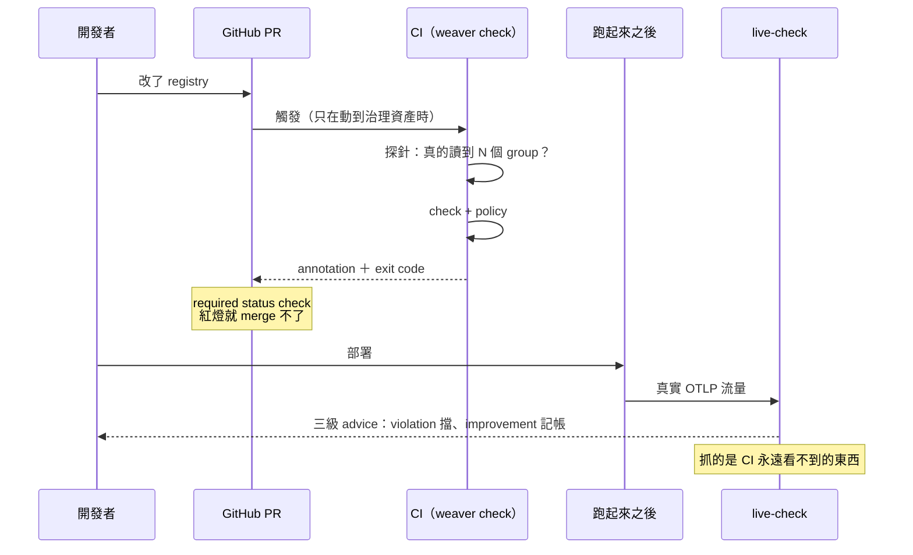

# Day7：治理成為門——CI gate 與 live-check，守在兩個不同的時間點

Day6 寫完了三條 Rego 規則，實跑抓到 9 個違規、exit 1。但那只是「跑得出來」，不是「繞不過去」——**現在任何人都可以不跑它**。

今天要把它變成一道門。而「門」這件事有兩個時間點，缺一個都不完整：

**PR 的那一刻**（CI gate）擋的是「別把壞的定義寫進 registry」。**服務跑起來之後**（live-check）抓的是「程式碼實際送出去的東西有沒有照規範」。這兩件事的關係，是這個階段最重要的一個區分——Day5 第一次跑 check 拿到綠燈時就講過一次：**定義對，不代表行為對。** 今天要把它變成可以量測的東西。

程式碼在範例 repo [`OTel_AIOps_Agent`](https://github.com/tedmax100/OTel_AIOps_Agent) 的 [`day11/`](https://github.com/tedmax100/OTel_AIOps_Agent/tree/main/day11) 與 [`day12/`](https://github.com/tedmax100/OTel_AIOps_Agent/tree/main/day12)（資料夾日號沿用原本的編號，見 Day3 的說明）。

## 「跑得出來」跟「繞不過去」差在哪

一道真正的門要同時滿足三件事，而它們分別落在三個不同的地方：

| 要求 | 落在哪裡 | 沒有它會怎樣 |
|---|---|---|
| **會自己跑** | CI workflow | 靠人記得跑，等於沒有 |
| **擋得住** | branch protection 的 required status check | 紅燈可以直接 merge，只是一個裝飾 |
| **說得清楚** | 診斷輸出格式 | 被擋的人不知道要改哪裡，最後來找你（或繞過你） |

第三項是平台工程的重點，也是這系列反覆的判準：**被擋的人能不能不找你就走出去。** 一道說不清楚的 gate，維護成本會隨團隊數線性成長——十個團隊撞到同一個問題，就是十次來回。



## 第一個時間點：CI gate

### 觸發、釘版本

`paths` 限縮只在動到 registry 或 policy 時跑（改一行 README 不該花 CI 時間）。安裝這一段有三個都是踩出來的細節：

```yaml
env:
  WEAVER_VERSION: 0.24.1
  WEAVER_SHA256: <從 release 的 .sha256 抄過來>
```

**釘死版本，不要用 latest。** weaver 還在 0.x，內建驗證規則會隨版本變嚴——Day9 會重現一次 `0.23.0` 對一個完全合法的欄位直接 hard error 的踩坑，以及一個更難看的方向：舊版對多層依賴直接 panic、exit 134。用浮動版本等於讓 CI 隨時可能因為上游發新版而在一個跟這次 PR 完全無關的地方變紅。**升級 weaver 應該是一個獨立的、有人看著的 PR。**

**用 musl 而不是 gnu。** `weaver-x86_64-unknown-linux-gnu` 需要 GLIBC 2.38/2.39，在稍舊的環境（我的機器是 2.35）直接跑不起來。

**驗 sha256。** 這是從 GitHub release 抓一個可執行檔進 CI。注意校驗檔裡寫的是檔名，所以下載時要用 `-O` 保持原檔名，`sha256sum -c` 才對得上。

### 探針：先確認檢查真的有在檢查

```yaml
- name: Probe — registry 真的有被讀進來
  run: |
    groups=$(weaver registry stats -r "$REGISTRY" \
             | grep -oE '[0-9]+ groups' | head -1 | cut -d' ' -f1)
    echo "resolved ${groups} groups"
    if [ "${groups}" -eq 0 ]; then
      echo "::error::registry 解析出 0 個 group——檢查根本沒讀到檔案，這不是通過"
      exit 1
    fi
```

這五行是 Day5 那個 `-r .` 假綠燈的直接產物。想像沒有它會發生什麼：有人重構目錄結構、路徑寫錯，`check` 找不到東西、乖乖回報 0 groups 然後給綠燈，從此這個 gate 是裝飾品，而且**沒有任何人會發現——因為它的症狀就是「一直都很順利」。**

可以推廣的習慣：**任何自動化檢查都該有一個「我確實檢查了 N 個東西」的斷言**，而不是只看它有沒有報錯。這一項後面會變成 Day13 checklist 裡的一格。

### 三個實測出來的陷阱：共通點是都不會讓你看到錯誤訊息

**一、診斷訊息預設走 stderr，而 GitHub 只讀 stdout。** 這是今天最值錢的發現：

```
$ weaver registry check ... --diagnostic-format gh_workflow_command 2>/dev/null | grep -c "::error"
0

$ weaver registry check ... --diagnostic-format gh_workflow_command 2>&1 >/dev/null | grep -c "::error"
9
```

九行 `::error::` **全部走 stderr**，而 runner 只解析 stdout 上的 workflow command。失效非常隱蔽：job 還是紅的、log 裡看得到違規、一切「看起來都對」，但 **PR 頁面上不會有任何 annotation——而那是作者唯一會看的地方**。加上 `--diagnostic-stdout true` 就對了。而這件事沒有寫在 `--diagnostic-format` 的說明裡：那個選項的說明只寫「送到 stdout 而不是 stderr」，不會告訴你不加它整個 annotation 機制就是壞的。

**二、annotation 落不到程式碼的行上。**

```
::error file=registry, title=semconv_attribute::message=id=missing_namespace, ...
```

`file=registry` 是 `-r` 傳進去的**目錄名**，不是實際出問題的 `model/drift.yaml`，而且完全沒有 `line=`。所以 annotation 不會像 lint 錯誤那樣內嵌在 diff 那一行旁邊，只會出現在 PR 上方的摘要區。另外 `title` 永遠是 `semconv_attribute`——這正是 Day6 講的那個欄位錯位（你在 Rego 裡寫的 `type` 變成 Finding 的頂層 `id`）。**別指望 annotation 能取代 log。**

**三、resolver 錯誤在 gh 格式下完全不會產生 annotation。** 拿一份 `ref` 指到不存在 attribute 的 registry 跑，輸出是一個空的 `::group::`——CI 紅了，但 PR 上什麼都沒有。所以要補一個 `if: failure()` 的步驟，用預設的 ansi 格式再跑一次。

**這三個沒有一個會讓你看到錯誤訊息**，症狀都是「好像成功了、但少了點什麼」——跟 Day5 那個假綠燈、那條只比對名字的 policy 是同一個家族。這也是為什麼我養成一個習慣，而它會在 Day12 變成一整套方法論：**任何自動化機制接好之後，一定要故意讓它失敗一次，確認失敗的樣子跟你想的一樣，而不是只確認成功的樣子。**

### 讓紅燈真的擋得住

required status check **不在 YAML 裡**，要去 branch protection 設。**這是最容易被忘記的一步**——workflow 進了 repo、CI 跑起來、annotation 也漂亮，看起來大功告成，實際上還是一道推得開的門。也因為它不在 repo 裡，Day13 那份 checklist 唯一檢查不到的就是它。

## 第二個時間點：live-check 補上 CI 的盲點

CI gate 守住的是「寫進 registry 的定義」。但 Day5 那個綠燈已經預告了它的盲點：那份 registry 用的是目標命名（`biz.user.id`），而跑在 k3d 裡的服務送的是 `user_id`——**兩者都合法，CI 永遠不會知道它們不一致。**

`live-check` 就是拿真實 OTLP 流量去對照 registry。而它有一個對「可測試性」很關鍵的性質：**它可以直接餵一個 JSON 檔**（`--input-source`），不需要任何服務在跑。這代表「線上流量長什麼樣」可以被固定成一份檔案，變成一個可重複、可進 CI 的測試——Day12 會把這件事推到極致。

### 三種嚴重度終於登場

```
Span POST /api/orders `server`
    user_id = u-5
        - [violation] Attribute 'user_id' does not exist in the registry.
        - [improvement] Attribute key 'user_id' must include a namespace (e.g. '{namespace}.{attribute_key}')
    userId = u-7
        - [violation] Attribute 'userId' does not exist in the registry.
        - [violation] Attribute key 'userId' does not match name formatting rules.

Span span.app.order.create `server`
    biz.user.id = u-5
        - [improvement] Attribute 'biz.user.id' is not stable; stability = development.
    app.outcome = CREATED
        - [information] Enum attribute 'app.outcome' has value 'CREATED' which is not documented.

Metric orders_total `counter`, `{order}`
    - [violation] Metric does not exist in the registry.
```

Day6 找了半天沒找到的那套 `information`／`improvement`／`violation`，就在這裡——`registry check` 的 policy 只有 `deny`、`level` 恆為 `violation`，三級嚴重度屬於 live-check 的 advice 系統。

而這個分級不是裝飾，**它決定離開碼**：有 `violation` 的樣本 exit 1，只有 `improvement`／`information` 的 exit 0。所以你可以在 CI 上要求「不准有 violation」，同時讓 improvement 只是一份看板上的技術債清單。**這條界線後面會一路用到 Day10 跟 Day11**——那時候要決定的是「agent 該對哪一級動作」，而答案就是這一條。

六種內建 advice type，每一個都對得上前面某一天的坑：

| advice type | 等級 | 意思 | 對應 |
|---|---|---|---|
| `missing_attribute` | violation | registry 裡沒有這個 attribute | Day1 的 flat key |
| `missing_metric` | violation | registry 裡沒有這個 metric | `orders_total` vs `app.orders.count` |
| `invalid_format` | violation | 名字不符命名規則 | `userId`——Day6 那條 camelCase 規則的內建版 |
| `missing_namespace` | improvement | 名字沒有 namespace | Day6 規則三的內建版 |
| `not_stable` | improvement | 用到還在 `development` 的定義 | Day5 stats 的 `development: 100%` |
| `undefined_enum_variant` | information | enum 送出一個沒定義過的值 | Day2 的「語意隨時間漂移」 |

兩件事值得停下來看。

**內建的規則跟 Day6 手寫的 Rego 重疊，但守在不同時間點。** `missing_namespace`／`invalid_format` 不用寫就有——這不代表 Day6 白做：那三條跑在**PR 階段的定義上**（別把壞名字寫進 registry），這裡跑在**runtime 的真實資料上**（程式碼實際送了壞名字）。**同一條規則守在兩個時間點，攔到的是不同的東西**，而這正是今天整篇的主題。

**`not_stable` 對「完全正確」的資料也會叫。** 一字不差照 registry 送的 `biz.user.id` 也拿到一條 improvement，因為整份 registry 都還是 `development`。它的意思不是「你送錯了」，而是「你正在依賴一個還沒承諾穩定的定義」——**本質上是一份技術債的即時提醒**，會一直叫到 Day9 開始把定義標成 `stable` 為止。

### 一個很少被問的數字：registry coverage

```
Registry coverage
  - total seen: 3.77%
```

這份 registry 定義的東西，只有 3.77% 在這批流量裡出現過（樣本只有四筆，數字本身沒意義）。但接上真實流量之後它是一個很有用的治理指標：**一份 registry 如果長期 coverage 只有 20%，代表要嘛規範寫得太早、涵蓋了一堆還沒實作的東西，要嘛有一整塊服務根本沒把遙測送過來。** 兩種都是「這份規範描述的不是真實系統」的訊號，而且除了 live-check 沒有別的方法會告訴你。

從平台工程的角度，這個數字比「有幾個服務通過 CI」有用——**它衡量的是規範跟現實的距離，不是合規率。**

### 兩個坑

**一、預設 port 是 4317，會吃到別人的遙測。** live-check 預設在 4317 起一個 OTLP 接收器，而我自己的 coding agent 也在往 4317 送遙測——結果 live-check 收到了一堆不屬於這個系統的資料，**裡面有 PII（包含使用者 email）**。在 demo 或 CI 裡一律指定專用 port，這不只是避免資料混淆，是避免把不該收的東西收進一份會被貼到 PR 上的報告裡。

**二、`--advice-policies` 是覆蓋，不是疊加。** 直覺會以為自訂 advice 是加在內建規則之上。實測：同一份樣本，加上一個「內容不生效」的 advice 目錄之後，內建的六種 advice **全部消失**。這是 override，不是 merge——所以你自訂的第一件事，是先把需要的內建規則重新實作一遍。

這兩個坑跟前面那三個 CI 陷阱的共通點：**工具用「安靜」表達「你設定錯了」。** 所以每接上一個新機制，第一件事都該是先量一個基準（幾個 group、幾條 advice、coverage 多少），之後任何一次數字掉下來才有東西可以比。

## 回到 AIOps：gate 跟 agent 需要的保證不一樣

CI gate 守住的東西，對 agent 來說是一個很具體的承諾：**registry 裡的每一個名字都只有一個意思。** 這是 Day10 讓 agent 直接查 registry 的前提——一份自相矛盾的知識庫比一份不完整的知識庫危險得多，不完整會讓 agent 查不到，矛盾會讓它查到錯的還很有信心。

live-check 守住的是另一半，而這一半對 agent 更致命：**registry 說的跟資料裡真的有的，是同一件事。** 如果 registry 寫 `biz.user.id` 而資料裡是 `user_id`，agent 照著 registry 下查詢會得到**零筆結果**——然後（照 Day6 講的那個模式）它不會說「我不確定」，它會沿著一個空結果往下推理，最可能的結論是「這裡沒有異常」。

**空結果跟「沒有問題」在資料上長得一模一樣。** 這是這個系列反覆出現的那個家族的問題，只是這次踩到的是 agent 而不是工程師——而且沒有任何一道門會擋住它。

## 今天沒做的事

沒有真的被擋下來的 PR 截圖。整份 workflow 的每一段都在本機驗證過（包含那三個陷阱的前後對照），但「一個真的被 required status check 擋住的 PR」需要一個公開 repo，這筆債留到後面補。

沒有把 live-check 接成常駐監聽。今天全部用 `--input-source` 餵固定的 JSON 檔——這是刻意的，因為固定樣本才可重複、才進得了 CI。真的接上跑著的 collector 是另一個題目（也是那個 4317 坑的來源）。

沒有寫任何自訂的 advice policy。發現「是覆蓋不是疊加」之後我就停了，因為要自訂就得先把六種內建規則重新實作一遍，而在還沒有數字證明哪一級真的會影響 agent 判斷之前，那只是用我的主觀分級去換工具的主觀分級。這件事會在 Day10 變成一個具體的需求（`undefined_enum_variant` 只有 `information`，但它對 agent 是致命的）。

明天：把 registry 疊成多層——從零寫一份自己的 semantic convention，然後在它之上疊一層 team-specific 的。核心問題不是「要不要統一」，而是**哪一層統一、哪一層放手**，而 Weaver 在這件事上有四個會安靜讓你以為做到了的地方。
