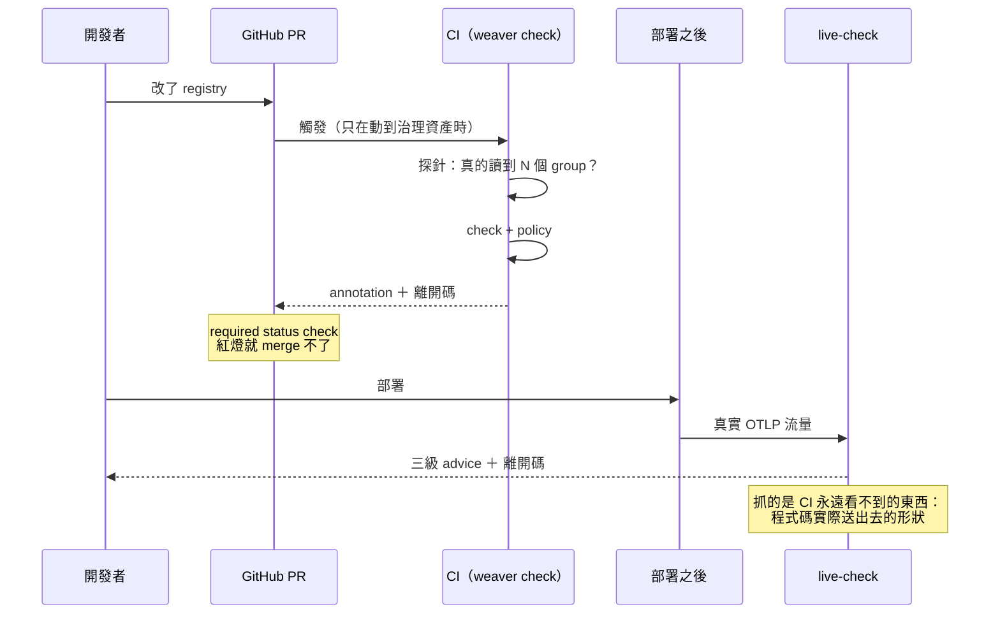
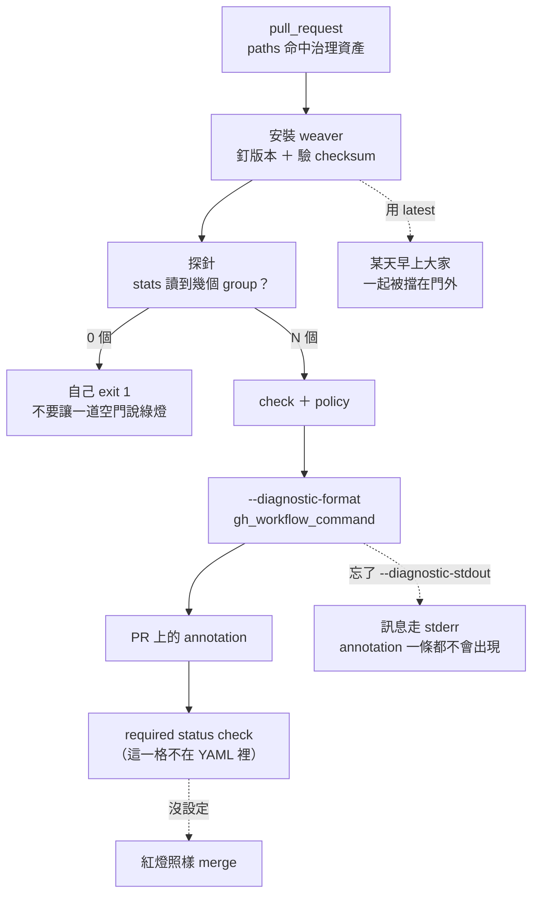
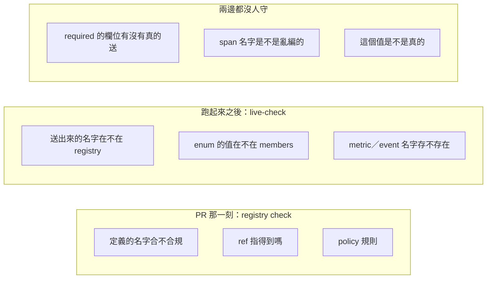

# Day7：治理成為門，CI gate 與 live-check 守在兩個時間點

> 規則存在
> 跟規則會被執行
> 中間差的東西比想像中多

昨天那三條 Rego 規則跑出 9 個違規、離開碼 1，把 `userId` 跟 `user_id` 並存這件事抓了出來。但那份輸出是我在自己筆電上跑出來的，而**現在任何人都可以不跑它**。規則存在，跟規則會被執行，中間差的東西比想像中多。

程式碼在範例 repo [`OTel_AIOps_Agent`](https://github.com/tedmax100/OTel_AIOps_Agent) 的 [`ironman-2026/day07/`](https://github.com/tedmax100/OTel_AIOps_Agent/tree/main/ironman-2026/day07)：

```
ironman-2026/day07/
├── registry/            ← 昨天那份漂移收斂之後的版本
├── policies/naming.rego ← 昨天那三條，一個字都沒改
├── workflows/           ← CI gate，要用的話複製到 .github/workflows/
└── live-check/          ← 樣本、自訂 advice policy
```

指令一律假設從 repo 根目錄跑。驗證環境是 weaver 0.25.1。

## 一道門要成立，需要三件事同時發生

先講清楚今天在做什麼。CI（Continuous Integration，持續整合）跑一條檢查，跟這條檢查真的擋得住人，是兩件事。我把它拆成三個條件，它們分別落在三個不同的地方，而且沒有一個是寫在 `weaver` 指令裡的：

| 要求 | 落在哪裡 | 沒有它會怎樣 |
| --- | --- | --- |
| 會自己跑 | CI workflow | 靠人記得跑，等於沒有 |
| 擋得住 | branch protection 的 required status check | 紅燈照樣可以 merge，那道檢查只是裝飾 |
| 說得清楚 | 診斷的輸出格式 | 被擋的人不知道要改哪裡，最後來找你，或想辦法繞過你 |

第三項是平台團隊最容易低估的一項。一道說不清楚的 gate，維護成本會隨著使用它的團隊數線性成長，十個團隊撞到同一個問題就是十次來回。前面幾天已經反覆出現同一個判準：**一個機制的成本會不會隨團隊數線性成長，決定它能不能活過第三個團隊。**

> 我踩過的版本是：gate 上線第一週，被擋下來的人不是去看錯誤訊息，是直接來問我「你那個東西是不是壞了」。訊息寫得夠清楚之前，gate 的真實效果是把工作量從產品團隊搬到平台團隊身上。

還有一個更根本的區分，是今天真正的骨架。PR（Pull Request）那一刻能檢查的東西，跟服務跑起來之後能檢查的東西，本來就不是同一批：



Day5 第一次跑 `registry check` 拿到綠燈的時候講過一句：那個綠燈只證明這份 schema 定義內部自洽，完全不保證跑起來的服務有照它送資料。今天要把這句話變成兩道分別可以量測的東西。

## 第一個時間點：PR 上的那道門

整份 workflow 只有四步，但每一步都有一個對應的失敗方式，而且那些失敗都不會讓 CI 變紅：



### 觸發條件：只在動到治理資產時跑

```yaml
on:
  pull_request:
    paths:
      - "ironman-2026/day07/registry/**"
      - "ironman-2026/day07/policies/**"
      - ".github/workflows/weaver-gate.yml"
```

改一行 README 不該花 CI 的時間，這個大家都同意。比較少人記得的是第三行：**workflow 自己也要列進 `paths`**，不然改了 gate 本身的邏輯，這次 PR 反而不會跑到它，等於改完沒驗證就進主線了。

### 釘死版本，而且對得起那個 checksum

```yaml
env:
  WEAVER_VERSION: "0.25.1"
  WEAVER_SHA256: "3f28ba9378578c99fcff51c7e489721ecdcc7329c688f8b106c8aac9e5de6443"
```

那串 sha256 不是我算的，是 [v0.25.1 release](https://github.com/open-telemetry/weaver/releases/tag/v0.25.1) 的 `sha256.sum` 裡 `weaver-x86_64-unknown-linux-musl.tar.xz` 那一行抄過來的。安裝那段長這樣：

```yaml
- name: Install weaver (pinned + checksum verified)
  run: |
    set -euo pipefail
    asset="weaver-x86_64-unknown-linux-musl.tar.xz"
    url="https://github.com/open-telemetry/weaver/releases/download/v${WEAVER_VERSION}/${asset}"
    curl -sSfL -o "$asset" "$url"
    echo "${WEAVER_SHA256}  ${asset}" | sha256sum -c -
    tar xf "$asset"
    sudo mv weaver /usr/local/bin/weaver
    weaver --version
```

三個選擇各有理由。**釘死版本**是因為 weaver 還在 0.x，內建的驗證規則會隨版本變嚴，用浮動版本等於讓 CI 隨時可能因為上游發新版而在一個跟這次 PR 毫無關係的地方變紅。升級 weaver 應該是一個獨立的、有人看著的 PR，而不是某天早上大家一起被擋在門外。**對 checksum** 是因為既然都釘版本了，就順手確認拿到的是同一顆二進位檔，這一行的成本大概是零。**選 musl 而不是 gnu** 是因為 musl 版靜態連結，不吃 runner 上的 glibc 版本，換一個 base image 也不會突然跑不動。

### 探針：先確認這道門真的有在看東西

Day5 那個 `-r .` 的假綠燈，在 CI 裡會變成更難發現的形狀，因為沒有人會盯著一個綠燈看。

```console
$ weaver registry stats -r ironman-2026/day07/registry | grep -oE '[0-9]+ groups'
2 groups

$ weaver registry stats -r . | grep -oE '[0-9]+ groups'
0 groups
```

路徑寫錯的那次，`stats` 印的是 `0 groups`，而 `check` 會回報「沒有違規」、離開碼 0。所以 workflow 裡有一步只做一件事：

```yaml
- name: Probe — the gate must actually be reading the registry
  run: |
    set -euo pipefail
    groups=$(weaver registry stats -r "$REGISTRY" \
             | grep -oE '[0-9]+ groups' | head -1 | cut -d' ' -f1)
    echo "resolved ${groups} group(s) from ${REGISTRY}"
    if [ "${groups:-0}" -lt 1 ]; then
      echo "::error title=weaver gate::registry ${REGISTRY} resolved to 0 groups"
      exit 1
    fi
```

這是整份 workflow 裡最便宜的一步，也是最容易被省略的一步。**一道檢查如果沒辦法證明自己有在檢查，它跟不存在的差別只在於你以為它存在。**

公平地說，weaver 不是完全沒吭聲，路徑錯的時候它會印一行 `ℹ No registry manifest found: ./manifest.yaml`。但那是 stderr 上的一行 `ℹ`，離開碼還是 0，CI 上不會有任何人看到它。

### 讓違規變成 PR 上的紅字

`--diagnostic-format gh_workflow_command` 會把 Finding 轉成 GitHub 的 [workflow command](https://docs.github.com/en/actions/reference/workflows-and-actions/workflow-commands)，也就是那些 `::error` 開頭的行。拿昨天那份沒收斂的 registry 當靶子：

```console
$ weaver registry check -r ironman-2026/day06/registry -p ironman-2026/day07/policies \
    --diagnostic-format gh_workflow_command --diagnostic-stdout

::group::Policy violation report
::error file=ironman-2026/day06/registry, title=semconv_attribute::message=id=missing_namespace, category=naming, group=registry.order, attr=status
::error file=ironman-2026/day06/registry, title=semconv_attribute::message=id=camel_case_attribute, category=naming, group=registry.order, attr=userId
::error file=ironman-2026/day06/registry, title=semconv_attribute::message=id=duplicate_concept, category=naming, group=(registry-wide), attr=userId <-> user_id
::endgroup::

$ echo $?
1
```

完整輸出是 9 行 `::error`，跟昨天那 9 個違規一一對應，這裡只留三行代表三種規則。

## 三個實測出來的坑，共通點是都不會讓你看到錯誤訊息

### 一、預設走 stderr，而 workflow command 要在 stdout

這是我第一次接的時候卡了半小時的地方。同一句指令，只差在把哪一個串流丟掉：

```console
$ weaver registry check ... --diagnostic-format gh_workflow_command 2>/dev/null
（什麼都沒有）

$ weaver registry check ... --diagnostic-format gh_workflow_command 2>&1 >/dev/null
Weaver Registry Check
Checking registry `ironman-2026/day06/registry`
✔ All `after_resolution` policies checked (9 violations found)

::group::Policy violation report
::error file=...
```

**weaver 預設把所有診斷寫到 stderr**，包括這些本來就是要給 GitHub 讀的 `::error` 行。而 GitHub 那份文件在講 workflow command 的時候，講的一律是印到 stdout。所以 `--diagnostic-stdout` 這個 flag 不是可選的裝飾，是這個輸出格式能不能發揮作用的前提。

這個坑的形狀跟前面幾天完全一樣：CI 是紅的（離開碼 1 有傳出去），log 裡也看得到違規（stderr 一樣會進 log），唯一消失的是「annotation 貼在 PR 的 diff 上」這件事。你只會覺得「這個功能好像沒什麼用」，而不會覺得「這裡有問題」。

### 二、`file=` 指的是 registry 目錄，而且沒有 `line=`

回頭看那些 `::error` 行：

```
::error file=ironman-2026/day06/registry, title=semconv_attribute::message=id=camel_case_attribute, ...
```

`file=` 的值是 `ironman-2026/day06/registry`，那是一個**目錄**，不是 `model/drift.yaml`；而且整行沒有 `line=`。GitHub 的 annotation 要貼到 diff 的某一行上，靠的就是 `file=` 加 `line=` 這一組。少了它們，這些訊息會落在 workflow 的摘要區，而不是落在那個寫錯名字的 YAML 那一行旁邊。

差別有多大？前者是「這個 PR 有九個違規，自己去找」，後者是「你改的這一行有問題」。對被擋下來的人來說，這決定了他要花三分鐘還是三十分鐘。而 Rego policy 那邊其實有 `group` 跟 `attr` 可以定位，資訊是有的，只是沒有被帶到 annotation 上。

現階段可行的補救是在 workflow 裡多印一段「哪個 group 的哪個 attribute」的摘要，讓人不用點進 log 就看得到。這是平台團隊要自己補的那一段，不是工具送的。

### 三、resolver 錯誤在這個格式下會整段消失

這個最惡劣。我故意在 registry 裡加一行指向不存在屬性的 `ref`：

```yaml
- ref: app.nonexistent
```

預設格式下，訊息很清楚：

```console
$ weaver registry check -r <壞掉的 registry> -p ironman-2026/day07/policies
  × The following attribute reference is not resolved for the group
  │ 'span.order.create'.
  │ Attribute reference: app.nonexistent
```

換成 GitHub 那個格式：

```console
$ weaver registry check -r <壞掉的 registry> -p ironman-2026/day07/policies \
    --diagnostic-format gh_workflow_command --diagnostic-stdout

::group::Diagnostic report

::endgroup::

$ echo $?
1
```

**一個空的 `::group::`。** 離開碼是 1，CI 會紅，但紅的原因一個字都沒印出來。這是三個坑裡最嚴重的一個，前兩個至少還留著資訊，這個是資訊完全不見。

三個坑放在一起看，共通形狀已經很熟悉了：離開碼都對、CI 都紅、log 都有東西，出問題的全是「被擋的人拿不拿得到能自己修好的訊息」這一層。這正好是前面那張表的第三列，也是最不會有人幫你測試的一列，因為寫 gate 的人自己永遠是那個知道答案的人。

> 所以我後來養成一個習慣：gate 寫完之後，找一個沒參與這件事的同事，開一個會被擋的 PR 給他，什麼都不解釋，看他能不能自己走出去。這比任何 code review 都有效。

## 最重要的那一步不在 YAML 裡

workflow 寫完、annotation 也貼上去了，這道門還是可以被繞過，因為**紅燈預設不會阻止 merge**。要讓它擋得住，得去 repo 設定裡把這個 job 加進 branch protection 的 required status check（GitHub 的說明在[這裡](https://docs.github.com/en/repositories/configuring-branches-and-merges-in-your-repository/managing-protected-branches/about-protected-branches)）。

這件事沒有出現在任何一個 `.yml` 檔案裡，所以它不會被 code review 看到、不會進版控、也不會有人在 PR 上問「你這個設定改了什麼」。一個新 repo 照抄了 workflow，很可能整套 gate 都在跑，但一個人都擋不住。

從平台工程的角度，這裡有一個取捨要講清楚：要不要把某條規則設成 required，是一個組織決定，不是技術決定。昨天那三條命名規則，`camel_case_attribute` 跟 `missing_namespace` 幾乎沒有爭議，可以直接擋；但 `duplicate_concept` 抓到的東西，改一次要動好幾個服務跟既有的 dashboard，一上線就設成硬擋，等於要求某個團隊在一個跟他們無關的 PR 裡先去清一筆歷史債。

Day6 已經測過，`registry check` 這一階段沒有「建議」這種中間狀態，只有 `deny`、只有 `violation`。所以分級只能在外面做，拆兩個資料夾、跑兩次 check，一次進 required、一次只印出來給人看。這是平台團隊自己要多維護的成本，不要假裝它不存在。

## 第二個時間點：服務跑起來之後

到這裡，PR 那道門守住的是「寫進 registry 的定義是好的」。但 Day1 那隻 agent 撞到的問題，沒有一個是定義寫壞造成的。`job` 對 `service_name`、`WARN` 對 `warn`，那些都是**程式碼實際送出去的東西**跟規範對不上，而 registry 裡的定義可能一直都是對的。

`weaver registry live-check` 守的就是這個時間點。它接真實的 OTLP 訊息，一筆一筆跟 registry 比對。

### 樣本從哪來

`--input-source` 吃三種來源：一個檔案路徑、`stdin`、或 `otlp`（預設，會起一個 listener）。今天用檔案，因為要示範的東西跟「怎麼把流量導過來」無關，而且檔案版可以進版控、可以進 CI。

輸入是一個 JSON 陣列，每一筆是一個帶標籤的樣本，標籤只能是 `attribute`、`span`、`span_event`、`span_link`、`resource`、`metric`、`log` 其中之一。我把 demo 服務真的在送的形狀寫成六筆（[`live-check/samples.json`](https://github.com/tedmax100/OTel_AIOps_Agent/blob/main/ironman-2026/day07/live-check/samples.json)）：

```json
[
  { "span": { "name": "POST /api/orders", "kind": "server",
              "attributes": [{ "name": "userId", "value": "u-5" }] } },
  { "span": { "name": "order.create", "kind": "server",
              "attributes": [{ "name": "user_id", "value": "u-5" },
                             { "name": "order_id", "value": "ord-1001" }] } },
  { "span": { "name": "order.create", "kind": "server",
              "attributes": [{ "name": "biz.user.id", "value": "u-5" },
                             { "name": "biz.order.id", "value": "ord-1001" },
                             { "name": "app.outcome", "value": "OK" }] } },
  { "log": { "event_name": "payment.declined", "severity_text": "WARN",
             "body": "payment declined for ord-1001",
             "attributes": [{ "name": "event", "value": "payment.declined" }] } },
  { "metric": { "name": "orders_total", "instrument": "counter",
                "unit": "{order}", "data_points": [] } },
  { "resource": { "attributes": [{ "name": "service.name", "value": "api-gateway" },
                                 { "name": "service", "value": "api-gateway" },
                                 { "name": "git_version", "value": "v4.0.0" }] } }
]
```

第一筆是 api-gateway 的下單 span，它是薄代理，前端送什麼 key 就標什麼 key，所以那裡躺著 `userId`。第二筆是 order-service 自己的 span，同一個概念寫成 `user_id`。第三筆是已經照 registry 改過的版本，只剩值送錯。這三筆合起來就是 Day1 那個現場的橫切面。

> 這個 JSON 不接受多餘的欄位。我一開始在每一筆上面加了 `_comment` 說明，直接吃到 `Fatal error during ingest`，因為 `_comment` 不在那七個合法標籤裡面。註解只能寫在 README，不能寫在樣本裡。

### 真實輸出：三級嚴重度終於登場

```console
$ weaver registry live-check -r ironman-2026/day07/registry \
    --input-source ironman-2026/day07/live-check/samples.json

Span POST /api/orders `server`
    userId = u-5
        - [violation] Attribute 'userId' does not exist in the registry.
        - [improvement] Attribute key 'userId' must include a namespace (e.g. '{namespace}.{attribute_key}')
        - [violation] Attribute key 'userId' does not match name formatting rules.

Span order.create `server`
    user_id = u-5
        - [violation] Attribute 'user_id' does not exist in the registry.
        - [improvement] Attribute key 'user_id' must include a namespace (e.g. '{namespace}.{attribute_key}')
    order_id = ord-1001
        - [violation] Attribute 'order_id' does not exist in the registry.
        - [improvement] Attribute key 'order_id' must include a namespace (e.g. '{namespace}.{attribute_key}')

Span order.create `server`
    biz.user.id = u-5
        - [improvement] Attribute 'biz.user.id' is not stable; stability = development.
    app.outcome = OK
        - [improvement] Attribute 'app.outcome' is not stable; stability = development.
        - [information] Enum attribute 'app.outcome' has value 'OK' which is not documented.

Log Event payment.declined
    - [violation] Event 'payment.declined' does not exist in the registry.
    event = payment.declined
        - [violation] Attribute 'event' does not exist in the registry.

Metric orders_total `counter`, `{order}`
    - [violation] Metric does not exist in the registry.
```

Day6 找了半天沒找到的三級嚴重度，在這裡全部到齊，`violation`、`improvement`、`information` 各有實例。這也證實了那天的推論：那套分級屬於 live-check 的 advice 系統，跟 `registry check` 的 policy 是兩套不同的機制。

而且它是有離開碼的：

```console
$ weaver registry live-check ... ; echo $?
1

$ weaver registry live-check ... --fail-on improvement ; echo $?
1

$ weaver registry live-check ... --fail-on none ; echo $?
0
```

`--fail-on` 預設是 `violation`。這個 flag 就是前面那個分級問題在 live-check 這一側的答案：同一份規則，可以在 staging 用 `--fail-on improvement` 逼緊一點，在正式環境只擋 `violation`。

### 三筆值得單獨看的 advice

**`app.outcome = OK` 那個 `information`。** registry 裡 `app.outcome` 是個 enum，成員是 `authorized`／`declined`／`gateway_error`，而樣本送的是 `OK`。這條 advice 抓到的東西，正是 Day1 那隻 agent 猜 `WARN` 猜錯的鏡像版本：一邊是 agent 不知道值域，另一邊是服務自己送了值域外的值，兩邊加起來就是那個「查得到 0 筆」的完美條件。而它只被判成 `information`，預設不會擋，這個嚴重度我覺得偏低。

**`not_stable` 那一串 `improvement`。** 這份 registry 每個 attribute 都是 `development`，所以每一筆合規的資料也會拿到一條「這個欄位還不穩定」。它不是在罵你，是一份即時的技術債清單：你的服務現在正踩在幾個隨時可能改名的欄位上，這個數字就是答案。

**`service.name` 被判成不存在。** 這是我自己種的坑。`service.name` 是官方 semantic convention 的屬性，但 day07 這份 registry 沒有宣告任何 dependency，所以在它眼裡那就是一個沒見過的名字。**一份不宣告 dependency 的 team registry，會把所有標準屬性都判成違規**，這種 gate 上線第一天就會被淹沒在假警報裡，然後大家學會忽略它。分層跟 dependency 怎麼寫，留給後面。

### 兩個 live-check 抓不到的東西

實測時我特地反過來試了兩件事，結果都值得記下來。

第一，亂編的 span 名字它完全沒意見。

```console
$ echo '[{"span":{"name":"totally.made.up.span","kind":"server","attributes":[]}}]' > /tmp/s.json
$ weaver registry live-check -r ironman-2026/day07/registry --input-source /tmp/s.json
Span totally.made.up.span `server`

  - by highest advice level:
    - no advice: 1

$ echo $?
0
```

metric 名字不在 registry 裡會噴 `Metric does not exist in the registry`，log 的 event name 也會噴 `Event ... does not exist`，唯獨 span 名字不會。綠燈、離開碼 0。

第二，缺了必填欄位它也不會說。registry 裡 `span.order.create` 把 `biz.user.id`、`biz.order.id`、`app.outcome` 三個都標成 `required`，但我送一個只帶其中兩個的 span 過去，它一句話都沒有。

把兩道門看得到什麼放在一起畫，邊界就很清楚了：



這兩件事其實是同一個性質：**live-check 只能對它看到的東西發表意見，看不到的東西不在它的視野裡。** 它回答的問題是「你送的這些有沒有不合規的」，不是「規範要求的你有沒有都送到」。這是一個很容易誤讀的邊界，而誤讀的後果是你以為 `required` 這個承諾有人在守，實際上沒有。

`requirement_level` 那個承諾，到這一步還是沒有任何機制去兌現。Day5 寫下 17 個 `required` 的時候我以為那是在替未來的自己制定規則，現在看起來，那個未來還要自己動手做。

### registry coverage：規範跟現實的距離

輸出的最後一段是這個：

```
Registry coverage
  - total seen: 75.0%
```

意思是這份 registry 定義的東西裡，有 75% 在這批樣本裡真的出現過。這個數字**不是合規率**，它跟「有幾筆資料違規」是兩件事。它量的是另一個方向：你寫下來的規範，有多少比例是活的。

一個長期偏低的 coverage 通常代表兩種情況之一，而兩種都值得處理：規範裡有一堆沒人在用的定義（該刪，或者該問為什麼沒人用），或者你的樣本根本沒涵蓋到主要流量（那這次 live-check 的結論就不能當真）。

> 我會把這個數字跟前面那個探針放在一起看，它們回答的是同一種問題：這次檢查到底有沒有在看真的東西。一個是輸入端（registry 讀到了嗎），一個是輸出端（樣本涵蓋了嗎）。

### 自訂 advice：`--advice-policies` 是覆蓋，不是疊加

live-check 的 advice 也可以自己加。這是我試著寫一條「像 PII（Personally Identifiable Information，個人可識別資訊）的欄位不准送成遙測」的規則時撞到的：

```console
$ weaver registry live-check -r ironman-2026/day07/registry \
    --input-source ironman-2026/day07/live-check/pii-samples.json \
    --advice-policies ironman-2026/day07/live-check/advice

user.email = nathan@example.com
    - [violation] Attribute 'user.email' does not exist in the registry.
    - [violation] Attribute 'user.email' looks like PII; it must not leave the process as telemetry.

biz.user.id = u-5
    - [improvement] Attribute 'biz.user.id' is not stable; stability = development.
```

自訂規則生效了。但把這份輸出跟前面那份對照會發現，`missing_namespace` 跟 `invalid_format` 這兩條內建 advice **不見了**。`--advice-policies` 的語意是「覆蓋預設的 advice 目錄」，不是「再加一組」。

有趣的是 `not_stable` 跟「不在 registry 裡」這兩條還在，因為它們是 weaver 用 Rust 實作的，不是 Rego 寫的。所以被覆蓋掉的只有 Rego 那一半。這個切分沒有寫在文件裡，是我把兩次輸出擺在一起 diff 才看出來的。

實務上的意思是：你想加一條規則，就得把內建那幾條一起帶進你的目錄，否則等於用一條新規則換掉兩條舊規則。我是從 weaver 二進位檔裡把預設的 `otel.rego` 撈出來當範本的（`strings $(which weaver) | grep -A30 'package live_check_advice'`），那也是我知道 advice 物件確切形狀的方式：

```rego
package live_check_advice

deny contains make_advice("pii_on_telemetry", "violation", input.sample.attribute.name, message) if {
	input.sample.attribute
	some suffix in pii_suffixes
	endswith(input.sample.attribute.name, suffix)
	message := sprintf("Attribute '%s' looks like PII; ...", [input.sample.attribute.name])
}
```

兩個地方跟 Day6 那個 `after_resolution` 的 policy 不一樣，而且寫錯了都是安靜失敗：輸入是 `input.sample.<訊號型別>` 而不是 `input.groups[_]`；產出的物件要有 `type`／`advice_type`／`advice_level`／`advice_context`／`message` 五個欄位，少一個整條規則就不生效。跟昨天那個「`type` 只能是 `semconv_attribute`」是同一類的東西，**一份沒有寫進文件的欄位合約，而違反它的代價是沉默。**

## 回到 AIOps：兩道門對 agent 的判斷有什麼影響

把今天做的兩件事接回主軸。

CI gate 守的是規範本身的品質。agent 讀 registry 的時候，它拿到的每一個定義都經過那三條規則，所以它不會看到 `userId` 跟 `user_id` 並存、不會看到沒有 namespace 的裸名字。這是它的知識來源可不可信的問題。

live-check 守的是規範跟現實有沒有對上，這件事對 agent 更直接：**它讀到的 registry 是一份承諾，而它查到的資料是現實，兩者對不上的時候，agent 沒有任何辦法知道。** 它會照著 registry 寫 `biz.user.id` 去查，然後拿到空結果，接著開始 Day1 那套：推論「這個欄位可能沒有資料」，或者更糟，編一個數字出來。

放到值班的場景會更具體。凌晨三點，agent 告訴你「查不到任何帶 `biz.user.id` 的 span，這個路徑可能沒有流量」。這句話有兩個完全不同的真相：真的沒流量，或者服務還在送 `userId` 而沒有人發現。你要花多久才能分辨這兩件事？而如果 live-check 一直在跑，這個問題早在部署那天就變成一條 `violation` 了，根本不會留到凌晨三點讓你猜。

這也是為什麼我把這兩件事放在同一天。它們看起來是兩個工具、兩個時間點，但守的是同一件事的兩半：agent 的推論要成立，前提是它讀到的規範是好的，而且那份規範描述的就是現實。缺任何一半，它的每一句結論都建立在一個沒有人驗證過的假設上。

## 今天沒做的事

沒有真的把 live-check 接到跑起來的服務上。今天用的是檔案來源的樣本，形狀是照著服務真的在送的東西寫的，但終究是我手寫的。接 OTLP 那條路要處理取樣、要決定接在 collector 的哪一段，還有一個更現實的問題：預設的 4317 埠很容易吃到本機其他 OTel 程序的遙測，我自己就撞過一次，把不該進來的東西收了進來。這些留給後面。

沒有補上「必填欄位有沒有真的送」這個檢查。前面測出來 live-check 不管這件事，而 `requirement_level` 是 Day5 就寫下去的承諾，要兌現它得自己寫一段對帳。

沒有處理 `service.name` 被判成違規那件事。那是 registry 沒有宣告 dependency 造成的，解法是分層，而分層本身有一堆自己的坑。

也沒有貼一張真的被擋下來的 PR 截圖。這篇的所有輸出都是本機跑出來的，annotation 實際貼在 diff 上長什麼樣，我還欠一張圖。

## 小結

總結來說，今天做的事情說穿了就是把昨天那條指令搬進一個 YAML 檔，再多跑一個子指令。但中間那三個坑，每一個都是「CI 是紅的、log 有東西、離開碼也對，唯獨被擋的人拿不到能自己修好的訊息」，這系列到現在，這種形狀已經出現第四次了。比較意外的收穫則是 live-check 那兩個抓不到的東西，我本來預期它會是那個「終於有人在守 `required`」的角色，結果它守的是另一個方向。其實知道一個工具不做什麼，跟知道它做什麼一樣重要，尤其當你正打算把某個承諾交給它的時候。

> 那個預設 4317 埠吃到我自己 coding agent 遙測的坑，我到現在想起來還是覺得很好笑，也很不妙。
> 一個要拿來稽核別人的工具，第一次跑就把我自己的東西收進去了 XD
>
> 明天開始處理分層，順便回答一個更難的問題：哪一層該統一，哪一層該放手。
