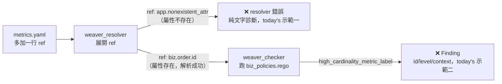

# Day8：Weaver 上手——第一次 `weaver registry check`

Day7 講完 Weaver 內部的管線分工、也列完整張 CLI 速查表，但整天沒跑過一次指令。今天要把那張地圖兌現——但今天不是從零手寫一份範例 registry，而是回去挖 `demo-services` 這條線的程式碼倉庫（`OTel_AIOps_Agent`，本系列的 submodule），發現 Day6 那次提交其實已經先把 `weaver/` 目錄建好了：一份完整的 registry（`registry/model/*.yaml`）加一條自訂 Rego policy（`policies/biz_policies.rego`）。今天要做的事，就是第一次真的對它跑 `weaver registry check`，貼真實輸出，逐條對照 Day7 講的 crate 分工——到底是 `weaver_resolver` 先解析出問題，還是 `weaver_checker` 在報錯，這兩種錯誤長得完全不一樣。

程式碼跟這篇文章對應的完整說明在 submodule 的 [`day08/README.md`](https://github.com/tedmax100/OTel_AIOps_Agent/tree/main/day08)（沿用 `day06/` 的 stack，沒有新增任何檔案），這裡直接講重點跟真實輸出。

## 這份 registry 是「目標命名」，不是抄現在的服務

先講清楚一個容易誤會的地方：`weaver registry check` 檢查的對象是 registry 這份 schema 定義本身自不自洽，不是拿它去比對 `demo-services` 現在實際跑出來的資料。翻開 `weaver/registry/model/common.yaml` 開頭的註解就寫得很白：

> 這份 registry 是**目標標準**——用的是 idiomatic、有 namespace 的命名（`app.*` 給低基數的流程屬性、`biz.*` 給業務識別碼），但現在的服務其實還在送 flat key（`status`、`reason`、`user_id`…）。

也就是說，`user_id` 在這份 registry 裡的目標寫法是 `biz.user.id`，`status`（metric label 上代表業務結果的那個）目標寫法是 `app.outcome`——每一個 attribute 定義下面都有一行 `note`，老實記著「現在程式碼裡的 flat key 叫什麼」。這個落差本身就是一張遷移清單，`weaver/README.md` 整理成一張完整對照表，節錄幾行：

| 現在程式碼裡的 flat key | registry 裡的目標 attribute | 訊號 |
|---|---|---|
| `user_id` | `biz.user.id` | log/span |
| `order_id` | `biz.order.id` | log/span |
| `status`（metric label） | `app.outcome` | metric/span |
| `status`（gateway/webapp log，其實是 HTTP 整數狀態碼） | `app.upstream.status_code` | log ⚠️ 同一個字串在不同地方代表不同東西 |
| `reason` | `app.fail_reason` | metric/log/span |
| `git_repo` / `git_version`（resource） | `vcs.repository.url.full` / `service.version` | resource |

這張表最後一列值得多看一眼：`status` 在 metric label 上是「業務結果」（`created`/`declined`…），但在 `api-gateway`/`webapp` 的 log 裡卻是「HTTP 狀態碼」——同一個 key，兩種完全不同的語意，混在同一個系統裡。這正是 Day7 講的「schema 是團隊共識」最具體的反例：字串一樣不代表意思一樣，這種混淆只有回頭去讀程式碼才會發現，`registry` 把它拆成 `app.outcome`（enum）跟 `app.upstream.status_code`（int）兩個獨立定義，一次性把這個混淆攤開來。

今天先不管這整張表怎麼補齊（那牽涉到改 `o11y_shared` 跟五個服務、還會動到 Loki/Prometheus 的 label，是刻意留到後面的事），先看 `check` 這個指令本身能不能跑、跑出來長什麼樣。

## 第一次真的跑：乾淨到有點意外

```bash
weaver registry check -r weaver/registry
```

```
Weaver Registry Check
Checking registry `weaver/registry`
ℹ Found registry manifest: weaver/registry/manifest.yaml
✔ No `after_resolution` policy violation

Total execution time: 0.021600395s
```

加上自訂的 `biz_policies.rego`（禁止 `biz.*` 這種高基數業務識別碼被拿去當 metric label）：

```bash
weaver registry check -r weaver/registry -p weaver/policies
```

```
Weaver Registry Check
Checking registry `weaver/registry`
ℹ Found registry manifest: weaver/registry/manifest.yaml
✔ No `after_resolution` policy violation

Total execution time: 0.021600395s
```

兩次都乾淨。第一次跑就是綠燈，一開始會讓人有點懷疑「是不是根本沒認真檢查」——但這其實符合預期：這份 registry 是照目標命名新寫的，不是拿舊的 flat key 硬塞進來，自然不會撞上自己定義的規則。乾淨的 check 只證明「這份 schema 定義本身內部一致、符合規則」，完全不保證「真正跑起來的服務有照這份定義送資料」——那正是 Day12 `weaver registry live-check` 要揭穿的事：把真實 OTLP 流量丟進去比對，這時候 `user_id`、`status` 這些 flat key 就會被抓出來，變成一張真正的待辦清單。

## 用一份丟棄式的複製，看兩種錯誤長什麼樣

乾淨的輸出沒辦法示範 Finding 長什麼樣子，所以在 `/tmp` 複製一份、故意弄壞兩次——這兩步都只在本機操作，repo 裡的 `weaver/` 本身完全沒被動過。

**第一種：resolver 階段的錯誤。** 在 `metric.app.orders.count` 這個 metric 群組裡塞一行指到不存在的屬性：`- ref: app.nonexistent_attr`，再跑一次 check：

```
Diagnostic report:

  × The following attribute reference is not resolved for the group
  │ 'metric.app.orders.count'.
  │ Attribute reference: app.nonexistent_attr
  │ Provenance: Some(Provenance { schema_url: SchemaUrl { url: "https://
  │ tedmax100.github.io/o11y-bench/demo-services/schemas/0.1.0", name_range:
  │ 8..60, version_range: 61..66 }, path: "registry/model/metrics.yaml" })
```

完全沒有「Violation」字樣，也沒有 `id`/`level`/`context` 這種 policy Finding 才有的結構——因為 `weaver_resolver` 在展開 `ref` 這一步就直接中止了，根本還沒輪到 `weaver_checker` 上場跑 Rego。

**第二種：checker 階段的 Finding。** 把剛剛那行改成 `- ref: biz.order.id`——讓一個高基數的業務識別碼被拿去當 metric label，這正是 `biz_policies.rego` 要擋的事：

```
✔ All `after_resolution` policies checked (1 violations found)

Violation: semconv_attribute
  - Message   : id=high_cardinality_metric_label, category=attribute, group=metric.app.orders.count, attr=biz.order.id
  - Level     : violation
  - Context   :
    - attr : biz.order.id
    - category : attribute
    - group : metric.app.orders.count
    - id : high_cardinality_metric_label
  - Provenance: registry
```

這次有完整的 Finding 結構了。這條 policy 背後的動機寫在 `o11y_shared/events.py` 的 docstring 裡：「不要把 order_id、user_id 這種動態 id 塞進去——每加一個都會撐大 `sum by (event)` 這類查詢的 label 空間」。`biz_policies.rego` 把這句寫在註解裡、只能靠人記得的警告，變成一條會在 `weaver registry check` 這一步就攔下來的自動化規則。

對照 Day7 的 crate 分工表：第一種錯誤來自 `weaver_resolver`，第二種來自 `weaver_checker`——兩者資料結構完全不同，來源也不同。把今天兩次示範接回 Day7 那張管線圖，實際踩到的兩個節點是這樣：



同一個「多加一行 `ref`」的動作，指到不存在的屬性 vs 指到存在但違規的屬性，會在管線的不同節點被攔下來——這也是為什麼 Day10-11 要分兩天講：一天把 Finding 的完整結構（`id`/`message`/`level`/`context`/`signal_type`）攤開講清楚，一天講怎麼把離開碼（今天兩次示範都是 1）接進 CI Gate，讓這種攔截從「本機手動跑」變成「PR 擋下來」。

## 今天沒做的事

沒有動 `demo-services` 的服務程式碼，也沒有處理 flat key 跟目標命名之間的落差——那需要同時改 `o11y_shared` 跟五個服務，還會動到 Loki/Prometheus 的 label 跟既有的 dashboard/評分查詢，是刻意留到後面的事。也沒有深入 `biz_policies.rego` 用到的 Rego 語法細節（`deny contains ... if` 這個 `rego v1` 語法糖背後的規則機制），今天只講到看得懂輸出在講什麼；語法本身留到真正要自己寫複雜 policy 的 Day10-11。`weaver registry mcp`、`live-check` 這些跟 runtime 流量對話的指令今天也完全沒碰——今天的兩次 check 都是純靜態驗證。

明天：不再看靜態定義，改用 `weaver registry infer` 直接對 Day1 那個服務的 OTLP 流量反推一份 schema 草稿，看看自動生成的結果會不會把 `userId`/`user_id` 這兩套並存的命名一起學進去，跟今天這份手工設計的「目標 registry」放在一起對照，會是完全不同性質的兩份 schema。
