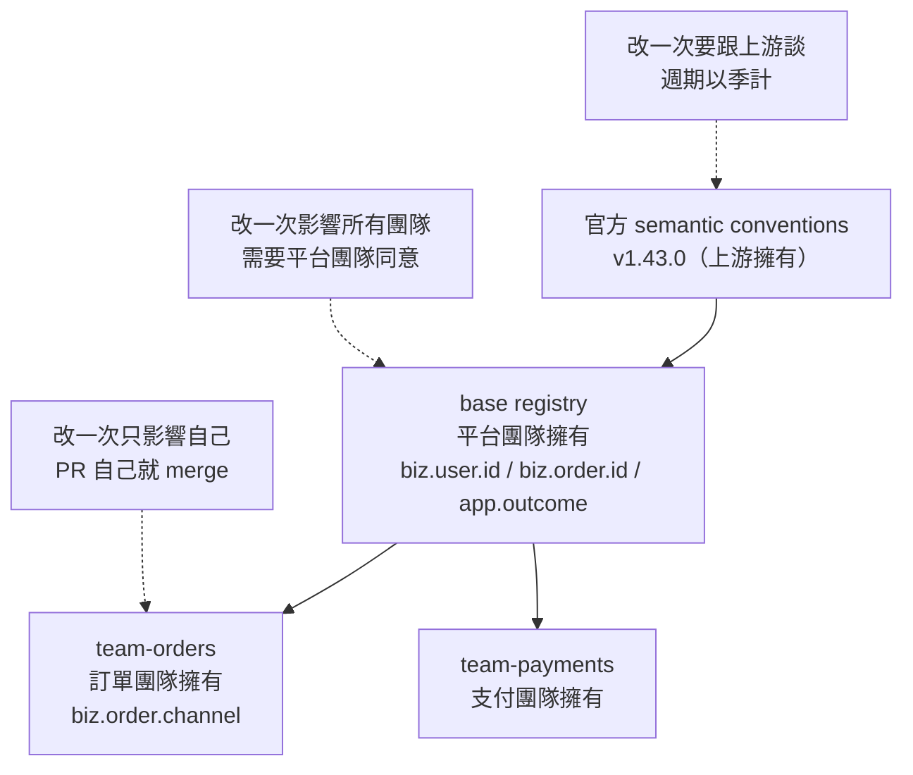
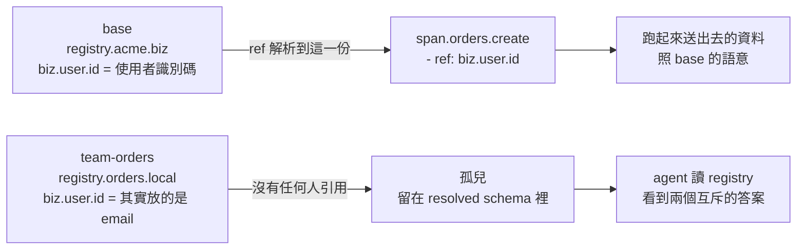
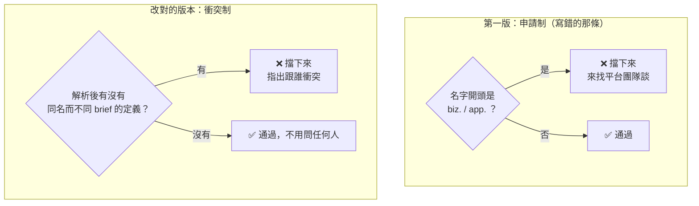

# Day8：分層與所有權，哪一層統一哪一層放手

> 治理的難處從來不是「要不要統一」
> 是「哪一層統一，哪一層放手」
> 前者是立場，後者才是設計

昨天 live-check 對著 `service.name` 說「這個屬性不存在於 registry」。那不是資料的問題，是我那份 registry 沒有宣告任何 dependency，所以在它眼裡，OTel（OpenTelemetry）官方定義了幾百個的標準屬性全部都是陌生人。一份會把 `service.name` 判成違規的 gate，上線第一天就會被淹沒在假警報裡，然後大家學會忽略它。

今天要把那件事解掉。但真正的題目比「補一行 dependency」大得多：**一份 registry 要給幾十個團隊用，它到底該由誰維護？**

程式碼在範例 repo [`OTel_AIOps_Agent`](https://github.com/tedmax100/OTel_AIOps_Agent) 的 [`ironman-2026/day08/`](https://github.com/tedmax100/OTel_AIOps_Agent/tree/main/ironman-2026/day08)：

```
ironman-2026/day08/
├── base/                  ← 平台團隊擁有
├── team-orders/           ← 訂單團隊擁有
├── policies/              ← 正式那條規則
└── policies-prefix-ban/   ← 我第一次寫錯的那條
```

指令一律假設從 repo 根目錄跑。驗證環境是 weaver 0.25.1、semantic-conventions [v1.43.0](https://github.com/open-telemetry/semantic-conventions/releases/tag/v1.43.0)。

## 兩種都會壞掉的極端

先講為什麼需要分層，因為兩個極端我都待過。

一種是**全公司一份 registry**，誰要加欄位都去改那個中央檔案。前三個月很好，第四個月開始，那份檔案變成一個沒有人敢動的東西：你要加一個只有自己團隊在用的 `biz.order.channel`，得先搞懂另外十二個團隊的命名慣例，還要等一個不熟悉你領域的人來 review。這個設計把成本推給了使用者，而且推得很不平均，愈邊緣的團隊付愈多。

另一種是**每個團隊各自一份**，互不相干。這個一開始更快，但它就是 Day1 那個現場：`userId` 跟 `user_id` 並存，不是因為誰不願意統一，而是根本沒有一個東西在盯著。

分層要回答的是中間那條線畫在哪。而畫線這件事本身就是治理最核心的決定：



判準其實只有一句話：**一個定義如果需要跨團隊對齊才有意義，它就該在下面那層；如果只有自己在用，就該在自己那層。** `biz.user.id` 是前者，因為 agent 要跨服務串一個使用者的行為；`biz.order.channel` 是後者，只有訂單團隊在分 web 跟 mobile。

> 這條線我畫錯過。第一版把整個 `biz.*` 收進 base，理由聽起來很正當（業務識別碼要統一）。結果三週內收到四個「我可以加一個 `biz.xxx` 嗎」的 PR（Pull Request），全部要我 review，全部都是只有那個團隊在用的東西。**我不是在治理，我是在當一個人肉的 merge queue。**

## 兩層各自長什麼樣

平台團隊那層，重點在 `dependencies`：

```yaml
# ironman-2026/day08/base/manifest.yaml
name: acme-base
schema_url: https://example.com/schemas/acme-base/0.1.0
dependencies:
  - schema_url: https://opentelemetry.io/schemas/1.43.0
    registry_path: https://github.com/open-telemetry/semantic-conventions@v1.43.0[model]
```

`registry_path` 是「檔案在哪」，`schema_url` 是「這是誰的哪一版」。官方那份 [registry 文件](https://github.com/open-telemetry/weaver/blob/main/docs/registry.md)把這個區分寫得很清楚：`schema_url` 不需要真的下載得到，它是身分識別，provenance 跟版本衝突都靠它來判斷。這裡順手做了昨天講過的那件事，**把版本釘在 `@v1.43.0`**，不要用 `main`，理由跟釘 weaver 版本一模一樣。

產品團隊那層，就是再往上疊一次：

```yaml
# ironman-2026/day08/team-orders/manifest.yaml
name: team-orders
schema_url: https://example.com/schemas/team-orders/0.1.0
dependencies:
  - schema_url: https://example.com/schemas/acme-base/0.1.0
    registry_path: ironman-2026/day08/base
```

團隊的 model 檔裡，來自 base 的東西用 `ref` 引用，自己的東西才用 `id` 定義：

```yaml
  - id: span.orders.create
    type: span
    span_kind: server
    stability: development
    brief: "建立訂單"
    attributes:
      - ref: biz.user.id        # base 的
        requirement_level: required
      - ref: biz.order.id       # base 的
        requirement_level: required
      - ref: app.outcome        # base 的
        requirement_level: required
      - ref: biz.order.channel  # 自己的
```

`ref` 的時候可以就地改 `requirement_level`，這是分層裡很重要的一個彈性：base 決定這個欄位叫什麼、代表什麼，團隊決定在自己這個 span 上它必不必填。語意統一，嚴格度放手。

兩層都是綠的：

```console
$ weaver registry check -r ironman-2026/day08/base
# -r 是 --registry 的短寫
ℹ Found registry manifest: ironman-2026/day08/base/manifest.yaml
ℹ Found registry manifest: /home/nathan/.weaver/vdir_cache/repoYqHwXF/model/manifest.yaml
✔ No `after_resolution` policy violation

$ weaver registry check -r ironman-2026/day08/team-orders
ℹ Found registry manifest: ironman-2026/day08/team-orders/manifest.yaml
ℹ Found registry manifest: ironman-2026/day08/base/manifest.yaml
ℹ Found registry manifest: /home/nathan/.weaver/vdir_cache/repoq1zqSQ/model/manifest.yaml
✔ No `after_resolution` policy violation

Total execution time: 2.201078414s
```

那幾行 `Found registry manifest` 就是分層在跑的證據，一層一層往下讀：base 兩行（自己＋官方 semconv），team-orders 三行（自己＋base＋官方）。最後那個 `vdir_cache` 是 weaver 把官方 semconv clone 下來的快取，第一次會慢一點，後面所有的秒數都是快取熱的情況下量的。

## 四個安靜的坑

### 一、`registry_path` 是相對於你在哪裡跑，不是相對於 manifest

上面那份 team manifest 裡寫的是 `ironman-2026/day08/base`，一個從 repo 根目錄看過去的路徑。換一個工作目錄再跑同一份 registry：

```console
$ cd ironman-2026/day08
$ weaver registry check -r team-orders
  × The following error occurred during the processing of semantic convention
  │ file: IO error for operation on ironman-2026/day08/base: No such file or
  │ directory (os error 2)
```

那個路徑是相對於 `cwd` 解析的，不是相對於 manifest 檔案自己的位置。這件事的後果比看起來大：manifest 進了版控，但它能不能用，取決於執行的人站在哪個目錄。CI（Continuous Integration，持續整合）上跑得好好的，同事在自己的子目錄跑就壞掉，而錯誤訊息只說「找不到檔案」，不會說「你可能站錯地方了」。

這個坑至少是會噴錯的，比後面三個仁慈。實務上的解法是在 README 裡寫死「所有指令從 repo 根目錄跑」，然後在 CI 裡永遠 `cd` 到根目錄。

### 二、依賴不會遞移

base 已經宣告了官方 semconv 的 dependency。那 team-orders 是不是就能直接用 `service.name` 了？我在 span 裡加了一行 `- ref: service.name`：

```console
$ weaver registry check -r ironman-2026/day08/team-orders
  × The following attribute reference is not resolved for the group
  │ 'span.orders.create'.
  │ Attribute reference: service.name
```

**不行。attribute 的 `ref` 只往下看一層。** 你依賴 base，就只 ref 得到 base 自己定義的東西，ref 不到 base 依賴的東西。

範圍我先講清楚，因為我只驗證了 attribute。`metric`、`event`、`entity` 那三種另有一條路叫 `imports`，可以把上游的東西明確拉進來（等一下第三個坑會用到它），**而 attribute 沒有 `imports`，只有 `ref`**。所以要重列一次整條依賴路徑的，就只有 attribute 這一種。

要用就得自己也列一次：

```yaml
dependencies:
  - schema_url: https://example.com/schemas/acme-base/0.1.0
    registry_path: ironman-2026/day08/base
  - schema_url: https://opentelemetry.io/schemas/1.43.0
    registry_path: https://github.com/open-telemetry/semantic-conventions@v1.43.0[model]
```

這樣在 0.25.1 上是可以跑的，`check` 綠燈。但要付兩個代價。近的一個是時間：官方那份 semconv 被載入兩次，執行時間從 2.3 秒變成 4.6 秒，一份不到 40 行的 team registry 花四秒半檢查完。（兩個數字都是 `vdir_cache` 已經有 semconv 的情況下各跑三次取的，冷快取還要再多算 clone 的時間。）

遠的一個更麻煩：**版本號現在被寫在兩個地方了。** 哪天平台團隊把 base 升到 semconv v1.44.0，team-orders 那份 manifest 不會自動跟上，也不會有人提醒你。你的 team registry 會拿著 v1.43.0 的定義去 ref 一個 base 認為是 v1.44.0 的世界，而兩邊都是綠燈。

> 這就是那個老問題換一個地方出現：**一份設定要在兩個地方保持一致，而沒有任何機制檢查它們一不一致。** 前面幾天在 Collector 的版本號上撞過同一件事。

### 三、重複定義不是覆寫，是製造一個沒人用的孤兒

這是四個裡最惡劣的。訂單團隊覺得 base 那個 `biz.user.id` 定義得不夠精確，於是在自己的 registry 裡「補」了一份：

```yaml
  - id: registry.orders.local
    type: attribute_group
    stability: development
    brief: "團隊自己重新定義的屬性"
    attributes:
      - id: biz.user.id
        type: string
        stability: development
        brief: "使用者識別碼（訂單團隊版本：這裡其實放的是 email）"
        examples: ["nathan@example.com"]
```

跑 check：

```console
$ weaver registry check -r ironman-2026/day08/team-orders
✔ No `after_resolution` policy violation

$ echo $?
0
```

綠燈。那到底哪一份生效了？把 resolve 出來的結果撈出來看：

```console
$ weaver registry resolve -r ironman-2026/day08/team-orders --format json | ...

registry.orders.local | biz.user.id | 使用者識別碼（訂單團隊版本：這裡其實放的是 email）
span.orders.create    | biz.user.id | 使用者識別碼
```

**兩份定義同時存在，而 span 上引用到的是 base 那份。** 團隊自己寫的那份沒有被任何東西引用，它是一個孤兒，靜靜地躺在 resolved schema 裡。

整件事的形狀畫出來是這樣：



這比「覆寫失敗」糟糕的地方在於，寫的人得到的訊號是綠燈。他以為自己成功地把定義改精確了，實際上送出去的資料仍然照著 base 的語意，而 registry 裡多了一份說「這裡放的是 email」的定義。**一份自相矛盾的規範，比一份不完整的規範危險得多。**

有一個方式能讓它現形，但要用一個已經被標為 deprecated 的 flag：

```console
$ weaver registry check -r ironman-2026/day08/team-orders --include-unreferenced
  ⚠ The flag `include_unreferenced` is deprecated. Please prefer manually
  │ adding the required imports to your schema files in the future.

  × The attribute id `biz.user.id` is declared multiple times in the following
  │ groups:
  │ ["registry.acme.biz", "registry.orders.local"]

$ echo $?
1
```

訊息非常好，兩個 group 都指出來了。問題是這個 flag 正在被淘汰，而它建議的替代方案（在 schema 檔裡手動寫 `imports`）**對 attribute 不成立**：

```console
$ # 在 model 檔裡加 imports: attributes: [biz.*]
$ weaver registry check -r ironman-2026/day08/team-orders
  × The following YAML snippet does not match any of the allowed schemas.
  │ - Object contains unexpected properties: attributes.
```

`imports` 只吃 `metrics`、`events`、`entities` 三種，attribute 沒有這條路，只能靠 `ref`，就是第二個坑裡那件事的另一面。所以這個檢查目前是走在一條要被拆掉的橋上，而橋的另一頭對 attribute 來說還沒蓋。這也是為什麼後面那條 policy 得自己寫。

### 四、摘要那行綠字，不代表沒有違規

這個是我寫 policy 的時候撞到的。只放一條 `before_resolution` 規則去跑：

```console
$ weaver registry check -r ironman-2026/day08/team-orders -p ironman-2026/day08/policies-prefix-ban
✔ No `after_resolution` policy violation

Violation: semconv_attribute
  - Message   : id=redefines_platform_attribute, category=layering, group=registry.orders, attr=biz.order.channel
  - Level     : violation
Violation: semconv_attribute
  - Message   : id=redefines_platform_attribute, category=layering, group=registry.orders.local, attr=biz.user.id
  - Level     : violation

$ echo $?
1
```

**那句 `✔ No after_resolution policy violation` 只講 `after_resolution` 那一個階段**，`before_resolution` 的違規不會被算進去，但它們照樣印在下面、照樣讓離開碼變成 1。第一次看到的時候我以為是自己 policy 寫錯了，因為畫面上最顯眼的是一個綠色勾勾。

認出來的方法其實就在那句話本身，只是要看過兩種才會發現。weaver 在這裡會印兩種不同的句子：

| 看到的那行 | 真正的意思 |
| --- | --- |
| `✔ No after_resolution policy violation` | 這個階段**一條規則都沒跑到**，綠不綠跟你的 policy 無關 |
| `✔ All after_resolution policies checked (1 violations found)` | 這個階段真的跑了，而且抓到 1 個 |

第二句是等一下那條正式規則會印的。差別在括號——有括號才代表有東西被檢查過。

這個坑本身不嚴重（訊息都在，離開碼也對），但它跟昨天那三個 CI 陷阱是同一個家族：**摘要跟細節講的不是同一件事，而人只看摘要。**

## 那條 policy 我第一次寫錯了

回到孤兒那件事。既然 weaver 預設不管，就自己寫一條。我第一版的想法很直覺：`biz.*` 跟 `app.*` 是平台團隊的 namespace，團隊 registry 只能 `ref`，不能自己定義。

```rego
package before_resolution

platform_owned_prefixes := ["biz.", "app."]

deny contains reserved_namespace(group.id, attr.id) if {
	group := input.groups[_]
	attr := group.attributes[_]
	attr.id                          # 只看定義（有 id:），不看引用（ref:）
	some prefix in platform_owned_prefixes
	startswith(attr.id, prefix)
}
```

`before_resolution` 這個 package 到今天才第一次有真正的用武之地。它跑在解析之前，看到的是 YAML 原本的樣子，所以 `id:` 跟 `ref:` 還分得出來，這正是這條規則需要的視野。跑起來（`-p` 是 `--policy`，吃檔案或整個目錄）：

```console
$ weaver registry check -r ironman-2026/day08/team-orders -p ironman-2026/day08/policies-prefix-ban

  - Message : id=redefines_platform_attribute, group=registry.orders,       attr=biz.order.channel
  - Message : id=redefines_platform_attribute, group=registry.orders.local, attr=biz.user.id
```

第二條是對的，第一條是誤傷。`biz.order.channel` 是訂單團隊自己的新概念，base 裡根本沒有這個東西，但它被擋下來了，理由是「名字開頭是 `biz.`」。

這跟 Day5 那條只認 `biz.` 前綴的 cardinality 規則，是同一個錯誤的第二次上演：**規則問的是「這個名字歸誰管」，該問的是「這個定義跟別人衝不衝突」。**

而它在平台工程上的代價比技術代價大得多。這條規則等於宣告「`biz.` 這個 namespace 整個歸平台團隊」，於是訂單團隊想加一個只有自己在用的欄位，就得先來找我談。我又變回那個人肉 merge queue 了。**一條寫得比問題寬的規則，會把治理變成審批。**

改對的版本問的是衝突，不是名字。這條得跑在 `after_resolution`，因為它需要「解析完之後，全部的定義攤平在一起」的視野：

```rego
package after_resolution

definitions[name] contains attr.brief if {
	group := input.groups[_]
	attr := group.attributes[_]
	name := attr.name
}

deny contains conflicting_definition(name) if {
	briefs := definitions[name]
	count(briefs) > 1        # 同一個名字，兩份不一樣的 brief
}

conflicting_definition(name) := {
	"id": "conflicting_definition",
	"type": "semconv_attribute",
	"category": "layering",
	"group": "(registry-wide)",
	"attr": name,
}
```

用 `brief` 當比較的依據，是因為它就是那個「這個欄位代表什麼」的欄位。同名而 `brief` 不同，意思就是有兩個人對同一個名字有不同的理解，而這正是要抓的東西。

這裡有一個換了 package 就會靜悄悄失效的東西，我卡了一陣子才發現：**上面那條 `before_resolution` 用的是 `attr.id`，這條 `after_resolution` 用的是 `attr.name`。** 解析之後 `ref:` 已經被攤平成一個完整的 attribute 了，`id` 這個欄位不存在，全部都叫 `name`。寫錯不會噴錯，Rego 只是永遠匹配不到，然後你會拿到一句「沒有違規」。跟 Day7 那個 advice 物件少一個欄位一樣，**一份沒有寫進文件的欄位合約，違反它的代價是沉默**，這已經是這系列第三次撞到同一種東西了。

```console
$ weaver registry check -r ironman-2026/day08/team-orders -p ironman-2026/day08/policies
✔ All `after_resolution` policies checked (1 violations found)

  - Message : id=conflicting_definition, category=layering, group=(registry-wide), attr=biz.user.id
```

一條，正好是那個孤兒。`biz.order.channel` 通過了，因為沒有人跟它衝突。



兩條規則的差別，用 platform 的語言講是這樣：前者是**申請制**（這個 namespace 是我的，你要用先問我），後者是**衝突制**（你自己開，撞到別人的時候我才出面）。第二種的維護成本不會隨團隊數成長，因為平台團隊只在真的有衝突時才需要介入。

## 誰維護、誰使用、誰負責演進

分層把所有權寫成了機器可讀的形式，但有幾個問題是機制回答不了的，得先講好。

**base 改一個定義，誰負責通知？** 今天示範的 dependency 是靠 `schema_url` 裡的版本號釘住的，所以平台團隊改 base 的時候，團隊那邊不會有任何事情發生，直到有人手動把版本號往上調。這其實是好事，它讓升級變成一個有人看著的動作。但它也代表**平台團隊有義務主動通知**，因為沒有任何機制會替你通知。

**團隊要付多少成本才接得上？** 這個問題我用實際的行數回答：一份 `manifest.yaml` 五行，加上在自己的 model 檔裡把共用的欄位從 `id:` 改成 `ref:`。要學的新概念只有一個，就是 `ref` 跟 `id` 的差別。如果答案變成「先讀完 registry 規格」，那這個設計就失敗了。

**擋下來的時候，對方修得動嘛？** `conflicting_definition` 那條訊息目前只有名字，沒有講「跟誰衝突」。今天那個 `--include-unreferenced` 的訊息反而好得多，它直接列出 `["registry.acme.biz", "registry.orders.local"]` 兩個 group。這是我這條 policy 該補的，把衝突的另一方也放進 Finding 裡。

## 回到 AIOps：agent 讀到兩份定義會怎樣

分層對 agent 的影響，全部集中在那個孤兒身上。

registry 是 agent 唯一能事先知道「這個欄位代表什麼」的地方。當同一個 `biz.user.id` 在裡面躺著兩份定義，一份說是使用者識別碼、一份說其實放的是 email，agent 沒有任何辦法判斷該信哪一份。它不會說「這裡有矛盾」，它會挑一份用下去，而且挑的方式跟它當初猜 `WARN` 是大寫的方式一樣：看起來合理就好。

放到值班的場景。凌晨三點，agent 要查「使用者 `u-5` 的訂單失敗了幾筆」。它讀到的定義如果是團隊那份，它會認為 `biz.user.id` 裡放的是 email，於是它可能先去找 email、找不到就換一個查法，或者更糟，它在回報裡寫「這個使用者的識別碼格式異常」。**這是一個完全由規範不一致造成的假故障，而系統本身好得很。**

這也是為什麼 `conflicting_definition` 這條規則的價值不只是整潔。**它擋掉的是一份會讓 agent 得到兩個互斥答案的知識庫**，而那種錯誤在下游是無法被偵測的：agent 不會報錯，它只會很有信心地選一邊。

## 今天沒做的事

沒有處理 base 升版之後的通知。今天只講到「版本號釘住了所以不會自動跟上」，但真正的問題是團隊怎麼知道該升、升了會壞掉什麼。這個題目本身值得一整天。

`conflicting_definition` 那條規則還很粗。它用 `brief` 當比較依據，所以兩份定義如果 `brief` 剛好一模一樣、但 `type` 或 `examples` 不同，它抓不到。要做完整得比對更多欄位。

也沒有真的建第二個團隊的 registry。`team-payments` 在圖上出現過，但沒有寫出來，所以「兩個團隊同時定義同一個新概念」這個更有趣的衝突情境，今天沒有實際跑過。

那個「依賴不遞移」的問題，我選了「兩邊都列」這個解法並記下它的代價，但沒有去找有沒有更好的做法。這條留給後面。

## 小結

總結來說，今天寫的東西很少，兩份 manifest 加起來不到二十行，policy 也只有十幾行，但這是這系列第一次，registry 上面有了「誰擁有什麼」這個維度。比較意外的是那條寫錯的 policy，它在技術上完全能跑、也真的擋到了該擋的東西，唯一的問題是它順便擋掉了不該擋的，而那個「順便」的實際後果，是把平台團隊變成每個新欄位的審批關卡。**規則寫得太寬，代價不會出現在 CI 的離開碼上，會出現在三週後那四個等我 review 的 PR 上。**

> 「重複定義不是覆寫，是製造一個沒人引用的孤兒」這件事，我是先寫完文章、再回頭 resolve 才發現的。
> 綠燈、東西在、但沒有人用到它 QQ
>
> 明天處理版本演進：base 改了一個定義，下游怎麼知道自己被打到了。
