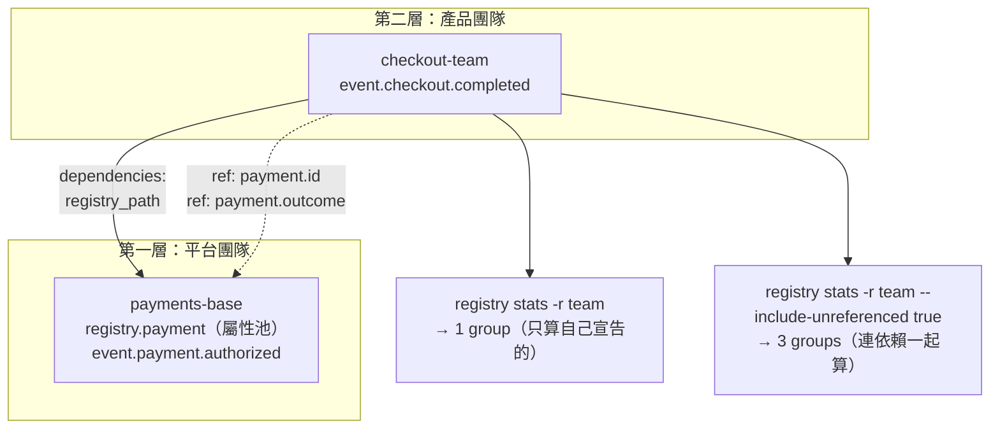

# Day8：自訂 semconv 與多 registry 分層

前面六天都在同一份 registry 上打轉——那份 registry 是 Day3 就準備好的，我只是拿它來跑各種指令。今天要做兩件之前刻意跳過的事：**從零寫一份自己的 semantic convention**，然後**把它疊成多層**。

第二件事才是重點。Day1 那段診斷說得很清楚：問題不是「有人沒跟上版本」，而是每個部門的 OTel 都是各自安裝、各自維護的。但反過來，如果為了統一而要求全公司共用一份 registry、任何一個團隊要加一個欄位都得去改那份中央檔案，那份 registry 會在三個月內變成一個沒有人敢動、也沒有人跟得上的東西。

**治理的難處從來不是「要不要統一」，而是「哪一層統一、哪一層放手」。** 今天要看的就是 Weaver 用什麼機制表達這件事，以及——照這系列的慣例——它在哪些地方會安靜地讓你以為你做到了。

程式碼在範例 repo [`OTel_AIOps_Agent`](https://github.com/tedmax100/OTel_AIOps_Agent) 的 [`day13/`](https://github.com/tedmax100/OTel_AIOps_Agent/tree/main/day13)（五份 registry ＋ 兩條 policy），這裡直接講重點跟真實輸出。

## 先從零寫一份 base registry

分層之前，先有一層。這是一份完全從空白開始的支付領域 registry，只有一個 `manifest.yaml` 加一個 model 檔：

```yaml
# base/manifest.yaml
name: payments-base
description: 支付領域的共用 semantic convention（平台團隊維護）
schema_url: https://example.com/schemas/payments-base/0.1.0
```

```yaml
# base/model/payment-events.yaml
groups:
  - id: registry.payment
    type: attribute_group          # ← 屬性池，不是 signal
    stability: development
    brief: "支付領域的共用屬性"
    attributes:
      - id: payment.id
        type: string
        stability: development
        brief: "支付交易識別碼"
        examples: ["pay-1001"]
      - id: payment.outcome
        type:
          members:                 # ← Day5 講的 enum，值域寫進 schema
            - id: authorized
              value: authorized
              brief: "授權成功"
              stability: development
            - id: declined
              value: declined
              brief: "被拒絕"
              stability: development
        stability: development
        brief: "支付的終態結果"

  - id: event.payment.authorized
    type: event
    name: payment.authorized
    stability: development
    brief: "支付授權成功"
    attributes:
      - ref: payment.id            # ← 只 ref，不重複定義
        requirement_level: required
      - ref: payment.outcome
        requirement_level: required
```

```
$ weaver registry check -r day13/base
✔ No `after_resolution` policy violation

$ weaver registry stats -r day13/base
  - 2 groups
```

這份的結構就是 Day5 那份大 registry 的縮小版，也是寫任何 registry 都該有的骨架：**`attribute_group` 當屬性池，signal group 只用 `ref` 去引用**。屬性定義一次、被多個 signal 共用，改一次全部生效。今天後面會看到，這個「只 ref、不 inline」的習慣在分層之後從「比較整潔」升級成「必要」。

## 分層：`dependencies` 怎麼寫

現在加第二層。結帳團隊要定義自己的 `checkout.completed` 事件，但裡面的支付欄位應該沿用平台團隊那份，不該自己再造一次：

```yaml
# team/manifest.yaml
name: checkout-team
description: 結帳團隊在 payments-base 之上的擴充
schema_url: https://example.com/schemas/checkout-team/0.1.0
dependencies:
  - name: payments-base
    registry_path: day13/base
```

```yaml
# team/model/checkout.yaml
groups:
  - id: event.checkout.completed
    type: event
    name: checkout.completed
    stability: development
    brief: "結帳完成（團隊自訂事件，重用 base 的支付屬性）"
    attributes:
      - ref: payment.id            # ← 這兩個都是 base 定義的
        requirement_level: required
      - ref: payment.outcome
        requirement_level: required
```

```
$ weaver registry check -r day13/team
ℹ Found registry manifest: day13/team/manifest.yaml
ℹ No registry manifest found: ... （第一次會踩坑，見下）
✔ No `after_resolution` policy violation
```

跑得起來之後，有一件事值得先看：這份 team registry「有幾個 group」？

```
$ weaver registry stats -r day13/team
  - 1 groups

$ weaver registry stats -r day13/team --include-unreferenced true
  - 3 groups
    - 1 AttributeGroups
    - 2 Events
```

**預設只算團隊自己宣告的那一個。** base 的兩個 group 有被載入、`ref` 也解得到，但它們不算是這份 registry 的內容——除非加上 `--include-unreferenced true`，才會把依賴裡的東西也一起算進來。

這個差別對 Day7 那個 CI 探針有直接影響：如果你的 gate 檢查「group 數 > 0」，在分層架構下要先想清楚你期待的是哪一個數字，不然這個探針會在某次重構之後失去意義。



## 四個實測出來的陷阱

分層這件事，Weaver 提供的機制很簡潔，但每一個環節都有一個「你以為它會這樣、它其實不是」的地方。四個都是實際撞到的。

### 一、`registry_path` 是相對於「你在哪裡跑」，不是相對於 manifest

最直覺的寫法是 `registry_path: ../base`——manifest 在 `team/` 底下，base 在隔壁，相對路徑當然是 `../base`。實測：

| `registry_path` | 在哪裡跑 | `-r` 給什麼 | 結果 |
|---|---|---|---|
| `../base` | repo 根目錄 | `day13/team` | ❌ 找不到 |
| `day13/base` | repo 根目錄 | `day13/team` | ✅ 通過 |
| `base` | `day13/` | `team` | ✅ 通過 |
| `../base` | `day13/` | `team` | ❌ 找不到 |

**基準點是當下的工作目錄，不是 manifest 檔案的位置。** 也就是說 `manifest.yaml` 這份檔案**不是自足的**——同一份檔案，`cd` 到不同地方跑會得到不同結果。

這件事的實務影響比看起來大：你在本機 `cd day13 && weaver registry check -r team` 跑得好好的，CI 從 repo 根目錄跑就爆掉；或者更糟，反過來——CI 好好的，同事在自己的目錄結構下永遠跑不動。

錯誤訊息本身還算清楚（會告訴你它去哪裡找了）：

```
ℹ Found registry manifest: day13/team/manifest.yaml
ℹ No registry manifest found: ../base/manifest.yaml

  × The following error occurred during the processing of semantic convention
  │ file: IO error for operation on ../base: No such file or directory
```

所以慣例只能是：**路徑一律寫成相對於 repo 根目錄，並且在 README／CI 裡明講「所有 weaver 指令都從 repo 根目錄跑」**。這也跟 Day5 那個 `-r .` 的坑疊在一起——`-r` 不能用 `.`，`registry_path` 又綁 cwd，兩個限制合起來，「固定從 repo 根目錄跑」幾乎是唯一不會出事的用法。

### 二、重複定義不是覆寫，是製造一個沒有人用的孤兒

這是今天最危險的一個。

一個很自然的需求：團隊覺得 base 的 `payment.id` 定成 `string` 不合用，想在自己這層改成 `int`。直覺做法就是在自己的 registry 裡重新定義一次同名的 attribute：

```yaml
# team-collision/model/checkout.yaml
  - id: registry.checkout_override
    type: attribute_group
    stability: development
    brief: "團隊重新定義了一個 base 已經有的 attribute，型別還不一樣"
    attributes:
      - id: payment.id
        type: int                  # ← 想覆寫成整數
        stability: development
        brief: "團隊版：把它改成整數"
        examples: [1001]
```

```
$ weaver registry check -r day13/team-collision
✔ No `after_resolution` policy violation

$ echo $?
0
```

**綠燈。** 沒有「重複定義」的警告，沒有「覆寫」的提示，什麼都沒有。

但它到底覆寫了嗎？寫一條 debug 用的 Rego，把 resolved schema 裡所有叫 `payment.id` 的定義印出來：

```
group=event.checkout.completed      type=string  brief=支付交易識別碼
group=event.payment.authorized      type=string  brief=支付交易識別碼
group=registry.checkout_override    type=int     brief=團隊版：把它改成整數
group=registry.payment              type=string  brief=支付交易識別碼
```

真相是：**兩份定義並存，而所有 `ref: payment.id` 都解到 base 那份 `string`。** 團隊那份 `int` 定義存在於 resolved schema 裡，但沒有任何東西引用它——它是一個孤兒。

後果分三層。**團隊以為改成功了**，實際上每一個 signal 上的 `payment.id` 還是 `string`。**下游拿到的是矛盾的資料**——`registry generate` 產出的程式碼、`registry mcp` 餵給 LLM 的定義、`live-check` 拿去比對的規範，看到的是同一個名字的兩種型別。而**沒有任何一個階段會報錯**。

正確的做法是什麼？Weaver 沒有提供「覆寫」這個動作，因為那本來就不該被允許——`payment.id` 的語意是平台團隊定的，某個團隊單方面把它改成 int，這件事在治理上就是錯的。真正該走的路是回頭跟平台團隊談：要嘛改 base 的定義（所有人一起改），要嘛在自己的 namespace 下定義一個新的欄位（`checkout.payment_ref`）。**分層機制的價值不是讓你能覆寫，是讓你不需要覆寫。**

### 三、依賴不會遞移

三層是很現實的結構：平台 → 事業群 → 小隊。試著把它疊起來：

```yaml
# division/manifest.yaml —— 事業群疊在 base 上
dependencies:
  - name: payments-base
    registry_path: day13/base

# squad/manifest.yaml —— 小隊疊在事業群上
dependencies:
  - name: commerce-division
    registry_path: day13/division
```

小隊的事件同時用到兩層的東西：

```yaml
  - id: event.checkout.completed
    type: event
    attributes:
      - ref: payment.id          # 來自第一層 base
      - ref: commerce.channel    # 來自第二層 division
```

```
$ weaver registry check -r day13/squad
ℹ Found registry manifest: day13/squad/manifest.yaml
ℹ Found registry manifest: day13/division/manifest.yaml
ℹ Found registry manifest: day13/base/manifest.yaml      ← 三份都載入了

  × The following attribute reference is not resolved for the group
  │ 'event.checkout.completed'.
  │ Attribute reference: payment.id

$ echo $?
1
```

注意那三行：**weaver 確實把三份 manifest 都讀進來了**，但 `ref: payment.id` 還是解不到。把那一行 `ref` 拿掉、只留 `commerce.channel`（直接依賴的那一層），立刻就通過。

也就是說：**`ref` 只看得到直接依賴，看不到依賴的依賴。** manifest 鏈會被走完，但可見範圍只有一層。

解法是把用到的每一層都列成直接依賴：

```yaml
# squad/manifest.yaml
dependencies:
  - name: commerce-division
    registry_path: day13/division
  - name: payments-base          # ← 隔一層的也要自己列
    registry_path: day13/base
```

```
$ weaver registry check -r day13/squad
✔ No `after_resolution` policy violation
```

這個限制值得放在心上：它代表**依賴關係不能只描述「我疊在誰上面」，還得把所有實際用到的層都列出來**。層數一多，每個小隊的 manifest 都會長出一份完整的祖先清單，而這份清單沒有列全時的症狀是 resolver 錯誤——好在這個錯誤是硬的、擋得住的，不像前一個陷阱那樣安靜。

### 四、但把所有層都列出來，會撞到重複載入

修好第三個問題之後，跑一次 `--include-unreferenced true`：

```
$ weaver registry stats -r day13/squad --include-unreferenced true

  × The attribute id `payment.outcome` is declared multiple times in the
  │ following groups: ["registry.payment", "registry.payment"]

  × The attribute id `payment.id` is declared multiple times in the following
  │ groups: ["registry.payment", "registry.payment"]
```

`["registry.payment", "registry.payment"]`——同一個 group 出現兩次。因為 base 被載入了兩次：一次是 squad 直接列的，一次是透過 division 傳進來的。

所以第三跟第四個陷阱合起來是一個兩難：

| 做法 | 一般 `check` | `--include-unreferenced true` |
|---|---|---|
| 只列直接依賴（division） | ❌ 隔層的 `ref` 解不到 | — |
| 兩層都列（division + base） | ✅ 通過 | ❌ 重複載入，硬錯誤 |

實務上這代表：**分層架構下要謹慎使用 `--include-unreferenced`**，而它正是前面用來看「依賴裡有什麼」的那個旗標。兩層以內沒事（`team` 那份就好好的），三層以上而且有共同祖先時就會撞到。

這也解釋了為什麼真實世界的 semconv 分層通常很淺——不是因為大家不想分細，是因為工具鏈在深層依賴上還很脆。

## 用 policy 把前兩個坑補起來

第三、四個陷阱會硬報錯，擋得住。第一、二個是安靜的，得自己寫規則。

### `before_resolution` 終於有場景了

Day6 講兩個 package 的差別時說過，`before_resolution` 適合寫「不准 inline 定義、一律要用 ref」這類規則，但當時沒有場景可以掛。今天有了：**inline 定義正是第二個陷阱的成因**。

```rego
package before_resolution

import rego.v1

signal_group_types := {"event", "span", "metric"}

deny contains inline_attribute_in_signal(group.id, attr.id) if {
	group := input.groups[_]
	group.type in signal_group_types
	attr := group.attributes[_]
	attr.id            # inline 定義才有 id；ref 進來的只有 ref
}
```

`attr.id` 那一行是整條規則的支點，而且**只有 `before_resolution` 寫得出來**——Day6 實測過，`before_resolution` 看到的 attribute 保持手寫原樣（inline 的有 `id`，引用的只有 `ref`），而 `after_resolution` 的 `ref` 已經展開，鍵統一變成 `name`，根本分不出來誰是 inline 寫的。

照 Day6 的教訓，規則寫完要**故意讓它失敗一次**，確認它真的會動：

```
# 在 event group 裡故意 inline 定義一個 checkout.cart_size
- Message : id=inline_attribute_in_signal_group, category=layering,
            group=event.checkout.completed, attr=checkout.cart_size
```

### 撞名檢查：跨 registry 的版本

Day6 那條 `duplicate_concept` 抓的是「正規化之後撞名」（`userId` vs `user_id`）。分層之後需要另一種：**同一個名字，兩種型別**。

```rego
package after_resolution

import rego.v1

type_name(t) := t if is_string(t)
type_name(t) := "enum" if is_object(t)

types_of(name) := {type_name(a.type) |
	some g in input.groups
	some a in g.attributes
	a.name == name
}

deny contains conflicting_definition(name) if {
	some g in input.groups
	some a in g.attributes
	name := a.name
	count(types_of(name)) > 1
}
```

`types_of` 是 Day6 講的 comprehension 用法：把散在各 group 的同名 attribute 攤平成一個型別集合，集合大小 > 1 就是衝突。`type_name` 那兩行則是 Day6 講的「同名規則寫兩次 = OR」，順便處理 enum 的 `type` 是物件、其他是字串這件事（Day5 那條值域規則的同一個支點）。

```
$ weaver registry check -r day13/team-collision -p day13/policies
✔ All `after_resolution` policies checked (1 violations found)

  - Message : id=conflicting_attribute_definition, category=layering,
              group=(cross-registry), attr=payment.id

$ echo $?
1
```

原本安靜的綠燈，現在會擋。三份 registry 加上這兩條 policy 的最終行為：

| registry | groups | check + policy |
|---|---|---|
| `base` | 2 | ✅ exit 0 |
| `team` | 1 | ✅ exit 0 |
| `team-collision` | 2 | ❌ exit 1（`conflicting_attribute_definition`）|

順帶一提，`--display-policy-coverage` 在這裡很有用：跑乾淨的 `team` 時，`collision.rego` 顯示 full coverage，`layering.rego` 則會被逐行列出來——因為那條規則沒有被觸發過。這正是 Day6 說的「policy 層的探針」：coverage 報告不只告訴你檔案有沒有被執行，還告訴你哪幾行從來沒跑到。

## 回到 AIOps：分層對 agent 意味著什麼

Day10 會讓 agent 透過 MCP 直接查 registry。分層在那個場景下有一個很具體的影響：**agent 查到的定義，是哪一層的？**

第二個陷阱在這裡會變得特別難處理。如果 `payment.id` 同時有 `string` 跟 `int` 兩份定義存在於 resolved schema 裡，agent 查詢時拿到的是什麼？它會看到兩筆、還是隨機一筆？它有沒有辦法知道「其中一筆是孤兒，永遠不會出現在真實資料裡」？

答案是它沒辦法——因為那份矛盾在 registry 裡是合法的、沒有任何標記說哪一份才算數。Day6 講過 LLM 犯錯的方式很隱蔽：它不會說「這裡有兩個矛盾的定義，我不確定」，它會選一個然後往下推理。而這次它甚至沒做錯什麼——資料本身就是矛盾的。

這也是為什麼今天那條 `conflicting_attribute_definition` 規則的價值不只是「保持整潔」：**它保證的是「這份 registry 對任何一個名字只有一個答案」**，而這正是把 registry 當成 agent 的知識來源時，最基本的前提。一份自相矛盾的知識庫，比一份不完整的知識庫危險得多——不完整會讓 agent 查不到，矛盾會讓它查到錯的還很有信心。

## 今天沒做的事

沒有測那個 10 層依賴深度上限。文件有提到這個限制，但實務上會先撞到的是今天第三、四個陷阱——依賴不遞移、加上共同祖先重複載入，這兩件事讓「疊很多層」在三層就開始不舒服了，10 層對大部分團隊來說不是會碰到的邊界。

沒有用 git URL 當 `registry_path`。weaver 支援從 git repo 或 GitHub release 載入依賴，那才是跨 repo、跨團隊分發的正式做法——今天全部用本機相對路徑，是為了讓範例可以直接跑、也才能把第一個陷阱（路徑基準點）講清楚。真正的發布跟版本控制留到 Day9。

沒有處理「base 改版之後，依賴它的團隊怎麼辦」。今天所有 registry 都是 `development`、都沒有版本演進的概念，`schema_url` 裡那個 `0.1.0` 也還只是個裝飾。這正是明天的主題。

明天：重現一次真實的 breaking change——weaver 0.23.0 對一個完全合法的欄位直接 hard error 的踩坑，講清楚三層驗證模型跟 `weaver registry diff` 的變更分類，以及升級之前該怎麼測。今天這個分層架構會在那裡派上用場：base 改一個欄位，`diff` 能不能告訴你哪些團隊會被打到。
