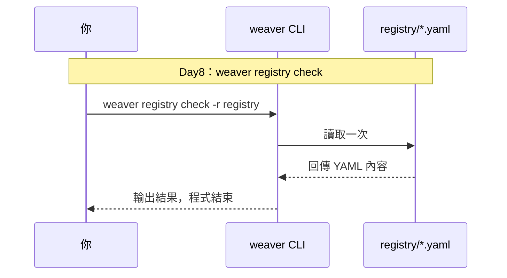
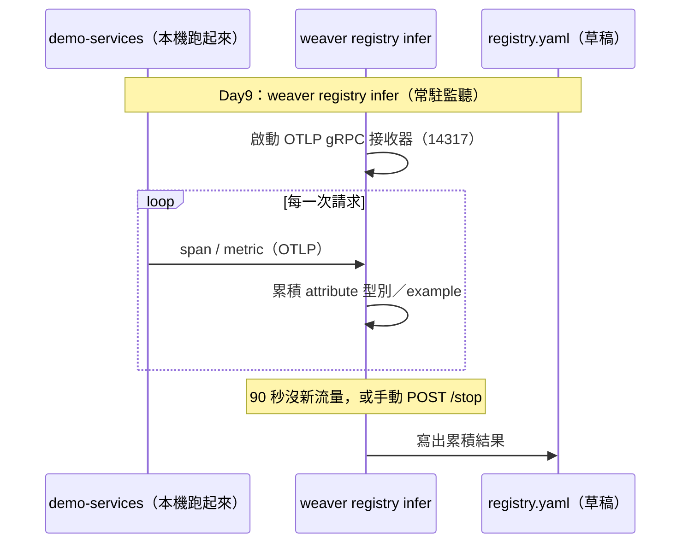
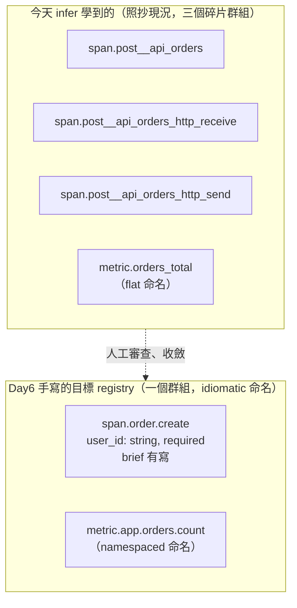

# Day9：`weaver registry infer`——從真實流量反推 schema 草稿

Day8 看的是一份已經手寫好的 registry，`weaver registry check` 檢查的是靜態定義自不自洽。今天反過來：治理不是只能從一張白紙開始手寫，也可以先讓 Weaver 去看真實流量，自動生成一份草稿當起點，再由人工修正。今天要做的事，是把 Day1 那個未治理服務真的跑起來，送真實流量，讓 `weaver registry infer` 去反推，看看自動生成的結果會不會把 `userId`/`user_id` 這兩套並存的命名一起學進去。

程式碼跟完整重現步驟在 submodule 的 [`day09/README.md`](https://github.com/tedmax100/OTel_AIOps_Agent/tree/main/day09)，這裡直接講重點跟真實輸出。

## `infer` 不是讀檔案，是一個 OTLP 接收器

Day8 的 `check` 讀的是一份現成的 YAML；今天的 `infer` 完全是另一種運作方式——它會啟動一個 OTLP gRPC 接收器，等真實遙測資料送進來，即時把看到的 span/metric/attribute 學進一份 schema 草稿，直到收不到新流量一段時間（`--inactivity-timeout`）或手動叫它停下來。這代表今天沒有「跑一次指令看結果」這麼單純，得先把 Day1 那組服務真的跑起來、把它們的 OTLP 輸出指過去。

Day8 的 `check` 跟今天的 `infer`，運作模式畫成圖是這樣的對比——一個是讀靜態檔案跑一次就結束，一個是常駐監聽、隨流量持續累積：





避開預設的 `4317` port——這是刻意的：4317 是很多本機工具（包括 coding agent 自己的遙測）預設會用的 port，Day12 會講一次真的因為這樣把自己的 OTLP 流量意外吃進去的踩坑記錄，今天先養成習慣，用一個不會撞的 port（`14317`）。

```bash
weaver registry infer -o /tmp/day9-infer --grpc-port 14317 --admin-port 18080 --inactivity-timeout 90 &
```

接著把 Day1 的 `api-gateway`、`order-service`、`user-service` 三個服務在本機跑起來（不經過 k3d/collector，直接用 `opentelemetry-instrument` 把 OTLP 指向剛剛那個接收器），送一段跟 `scripts/load.sh` 同一套邏輯的混合流量——大約 1/4 的下單請求送 `userId`，其餘送 `user_id`，模擬 Day1 描述的「前端/後端各自正確」第一次真正碰撞。

## 真實輸出：兩個名字，一字不差地被學了進去

送完流量、停掉接收器，`/tmp/day9-infer/registry.yaml` 生出一份 1852 行的草稿。翻到 `span.post__api_orders`（api-gateway 的 `POST /api/orders` span）底下：

```yaml
- id: userId
  type: string
  brief: ''
  examples: u-5
  requirement_level: recommended
  ...
- id: user_id
  type: string
  brief: ''
  examples:
  - u-4
  - u-2
  - u-7
  - ''
  - u-12
  requirement_level: recommended
  ...
```

`infer` 完全沒有「這兩個搞不好是同一件事」的判斷力——它看到兩個不同的字串鍵，就老老實實學成兩個不同的 attribute 定義，連 `brief` 都是空的（`infer` 沒辦法從資料本身推斷這個欄位的語意，只能推斷型別跟 example 值）。這正好demonstrate 了 Day7 提過的那件事：**schema 是團隊的共識，不是資料本身能自己講出來的東西**。`infer` 能幫你把「目前系統實際在送什麼」攤開來看，但看不看得出「這兩個其實是同一個概念、該收斂成一個」，還是得靠人。

## 草稿有多粗糙

除了這個抓到的重點，這份自動生成的草稿本身也長得很「原始」，值得一併記一筆——這是評估「AI/工具自動生成的東西能不能直接拿去用」時該養成的習慣：

- span 群組數量遠比預期多，光是 `POST /api/orders` 這一個端點，`infer` 就切出了 `span.post__api_orders`、`span.post__api_orders_http_receive`、`span.post__api_orders_http_send` 三個不同的群組——這是 FastAPI auto-instrumentation 底層 ASGI 事件被逐一記錄下來的結果，不是團隊會想要的治理粒度。
- metric 名稱是流量裡看到的原始名字（`orders_total`），不是 Day6 那份手寫「目標 registry」裡的 idiomatic 命名（`app.orders.count`）——`infer` 只會照抄現況，不會幫你設計。
- 幾乎每個 attribute 的 `brief` 都是空字串。Day8 的 policy 有一條規則專門抓「brief 是空的」，這份草稿如果直接拿去跑 `weaver registry check`，會被自己的規則檔出一堆違規——這其實是件好事：草稿跟能過 CI 的規範之間的落差，正好可以拿 Day8 那條 policy 當量尺，一條一條補完。

同一個 `POST /api/orders` 端點，`infer` 看到的原始樣貌跟 Day6 那份人工設計的目標 registry，放在一起對照就很明顯：



`infer` 給的是「觀察報告」，右邊才是「規範」——中間那段收斂，機器做不到，這也是為什麼 Day9 只產草稿、不直接拿去用。

## 今天沒做的事

沒有把這份草稿修成正式規範——挑 `userId` 還是 `user_id`當作canonical寫法、補上每個 attribute 的 brief、決定哪些欄位該收斂進哪個 attribute_group，這些審查工作明天才做。也沒有把這份草稿拿去跑 `weaver registry check`看它會噴出多少違規（雖然上一段已經能預期會噴不少）——那個對照，留到明天處理命名漂移時一起做，才有一個「改之前」的基準可以比較。payment-service 今天也沒接進來（本機那個 port 剛好被另一個既有的 k3d demo cluster佔用），不影響今天要看的重點，因為 `userId`/`user_id` 這個壞味道發生在 `api-gateway`，跟 payment-service 無關。

明天：拿今天這份草稿（或者直接拿 Day8 那份手寫的目標 registry）當基礎，真的把一個 attribute 從 `userId` 改成規範寫法，對照 `docs/validate.md` 的 Finding 完整結構（`id`/`message`/`level`/`context`/`signal_type`）跟三級嚴重度，講清楚同一個命名漂移，在沒有 weaver 的世界怎麼悄悄擴散，在有 weaver 的世界又是在哪一步、用什麼樣的輸出被攔下來。
