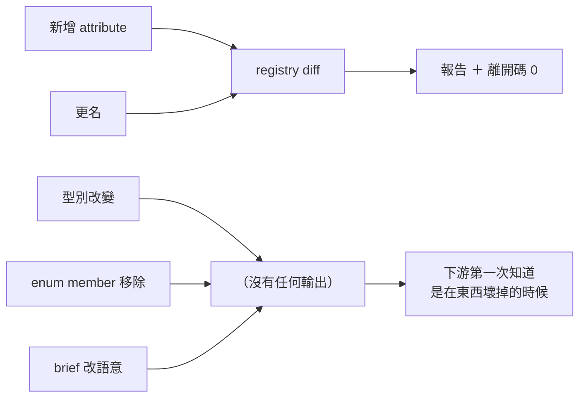
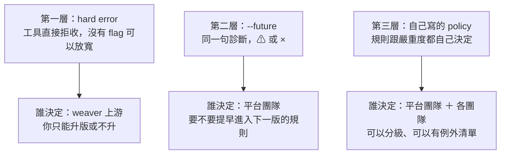
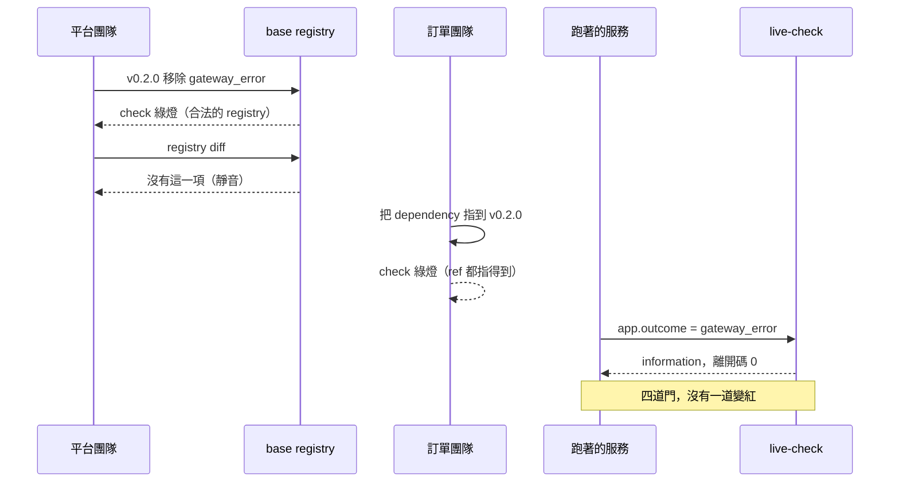

# Day9：breaking change，diff 看得到的跟它看不到的

> 改名字會被看見
> 改名字底下的內容物不會
> 而後者才是會把下游打死的那一種

昨天把 registry 疊成兩層，也留了一個問題：平台團隊改了 base 裡的一個定義，下游那些團隊怎麼知道自己會被打到？

我原本以為這題很好回答，因為 weaver 有 `registry diff`。實際跑過之後，答案是：**它會告訴你新增了什麼、什麼改了名字，但對三種最危險的變更完全不出聲。**

程式碼在範例 repo [`OTel_AIOps_Agent`](https://github.com/tedmax100/OTel_AIOps_Agent) 的 [`ironman-2026/day09/`](https://github.com/tedmax100/OTel_AIOps_Agent/tree/main/ironman-2026/day09)：

```
ironman-2026/day09/
├── base-v1/       ← 昨天那份 base，多一個 biz.cart.id
├── base-v2/       ← 五種變更都在這裡
├── team-orders/   ← 下游團隊，依賴 base-v2
├── policies/      ← 補洞用的三條規則
├── future-demo/   ← --future 的示範
└── live-check/    ← 服務還在送舊值的樣本
```

指令一律假設從 repo 根目錄跑。驗證環境是 weaver 0.25.1、semantic-conventions v1.43.0。

## 一次很平常的改版

先設定情境。平台團隊要出 base 的 0.2.0，這一版做了五件事，每一件單獨看都很合理：

1. 新增 `biz.tenant.id`，因為公司開始做多租戶。
2. `biz.cart.id` 更名成 `biz.basket.id`，統一用詞。
3. `biz.order.id` 的型別從 `string` 改成 `int`，因為資料庫那邊本來就是整數。
4. `app.outcome` 移除 `gateway_error` 這個 enum member，因為那個狀態已經被拆到別的欄位。
5. `biz.user.id` 的 `brief` 從「使用者識別碼」改成「使用者的 email，登入用」，把語意寫精確。

這五件事我全部寫進 `base-v2/`，兩個版本各自跑 check 都是綠的：

```console
$ weaver registry check -r ironman-2026/day09/base-v1
✔ No `after_resolution` policy violation

$ weaver registry check -r ironman-2026/day09/base-v2
✔ No `after_resolution` policy violation
```

這件事本身沒有問題，**它們都是合法的 registry，只是後面那份對前面那份做了一些會痛的事**。合不合法跟會不會痛，是兩個不同的問題，而 `check` 只回答第一個。

## `registry diff` 報得出兩種

```console
$ weaver registry diff -r ironman-2026/day09/base-v2 \
    --baseline-registry ironman-2026/day09/base-v1

Schema Changes between `0.2.0` and `0.1.0`

List of Changes to Registry Attributes
Added Registry Attributes:
  - Add biz.basket.id
  - Add biz.tenant.id

Renamed Registry Attributes:
  - Rename biz.cart.id to biz.basket.id (Note: Replaced by `biz.basket.id`.)

$ echo $?
0
```

新增看得到，更名也看得到，而且更名那條還把 `deprecated` 裡寫的理由帶了出來。這是 `deprecated` 用結構化寫法的好處：

```yaml
      - id: biz.cart.id
        type: string
        stability: development
        brief: "購物車識別碼"
        examples: ["cart-9"]
        deprecated:
          reason: renamed
          renamed_to: biz.basket.id
```

`reason: renamed` 加 `renamed_to` 不只是給人看的註解，它是 diff 能把「刪掉一個舊的、加一個新的」認成「這是同一個東西改了名字」的唯一依據。少了它，讀 diff 的人會看到一個消失、一個冒出來，然後自己去猜兩者是不是同一件事。

離開碼是 0。**`diff` 從來不會因為發現變更而失敗**，它是一個報告工具，不是一道門。這個設計本身沒錯，但如果你以為在 CI 裡跑一下 `diff` 就有防護，那就誤會了。

## 三種它不出聲的變更

那另外三件事呢？型別改變、enum member 移除、`brief` 改語意，一個字都沒有。

先排除「是不是渲染沒印出來」這個可能，直接看資料：

```console
$ weaver registry diff ... --format json

"registry_attributes": [
    { "type": "renamed", "old_name": "biz.cart.id", "new_name": "biz.basket.id", ... },
    { "type": "added", "name": "biz.tenant.id" },
    { "type": "added", "name": "biz.basket.id" }
]
```

三筆，就這樣。**不是沒印出來，是資料模型裡根本沒有這幾種變更。**

而這三種正好是最會痛的三種。把它們跟前面兩種放在一起排：

| 變更 | diff | 下游會怎麼壞 |
| --- | --- | --- |
| 新增 attribute | ✅ Added | 不會壞，最安全的一種 |
| 更名 | ✅ Renamed | 會壞，但至少你看得到 |
| 型別 `string` → `int` | ❌ 靜音 | 舊資料還在後端，查詢跟 dashboard 同時對不上 |
| enum member 移除 | ❌ 靜音 | 值域少一個，但那個值還在歷史資料裡 |
| `brief` 改語意 | ❌ 靜音 | 名字沒變，意思變了，沒有任何東西會發現 |

**diff 看得到的是「名字的變化」，看不到的是「同一個名字底下，內容物的變化」。** 這個界線一旦講明白，後面就全部說得通了：更名是名字變了，所以看得到；型別改變、值域縮小、語意改寫，名字都沒動，所以它全部沉默。



> 第三種對人來說最無感、對 agent 最致命。`biz.user.id` 現在的 `brief` 說它是 email，但半年前的資料裡它是 `u-5`。agent 讀 registry 學到「這是 email」，然後拿去查歷史資料，它不會查不到，它會查到一堆長得不像 email 的東西，然後自己想辦法解釋。

## 三層驗證，各有各的談判空間

在補這個洞之前，先把 weaver 的驗證模型講清楚，因為「這條規則該多嚴」不是一個技術問題，是一個誰來決定的問題。



第一層長這樣。我在 metric group 上寫了一個 weaver 不認得的欄位：

```console
$ weaver registry check -r <那份 registry>
  × Object contains unexpected properties: metric_requirement_level. These
  │ properties are not defined in the schema.

$ echo $?
1
```

沒有任何 flag 可以讓它變成警告。這一層的意思是：**你跟工具之間沒有談判空間，能決定的只有要不要升這個版本。** 這也是昨天講「釘死 weaver 版本」的理由，升級會把這一層整個換掉。

第二層是 `--future`，這個 flag 我覺得是整個工具鏈裡最被低估的設計。同一份 registry、同一句診斷，只差一個 flag：

```console
$ weaver registry check -r ironman-2026/day09/future-demo
  ⚠ The `deprecated` property in `demo.old_field` is invalid. Unstructured
  │ deprecated note is not supported on attributes.

$ echo $?
0

$ weaver registry check -r ironman-2026/day09/future-demo --future
  × The `deprecated` property in `demo.old_field` is invalid. Unstructured
  │ deprecated note is not supported on attributes.

$ echo $?
1
```

一模一樣的句子，`⚠` 變成 `×`，離開碼 0 變成 1。那份 registry 裡寫的是舊式的 `deprecated: "use demo.new_field instead"`，一句話而不是結構化物件，也就是前面說的那種讓 diff 認不出更名的寫法。

這個 flag 的價值不在技術，在於**它把「什麼時候開始變嚴」這個決定交給了平台團隊**。上游先讓規則以警告的形式存在一段時間，平台團隊挑一個自己的時間點，在 CI 裡加上 `--future`，讓所有團隊同時進入下一版的嚴格度。這是一個排程決定，不是技術決定，而工具給了你決定它的空間。

實務上我的做法是：`--future` 進 CI 但不進 required status check，先讓紅字出現一季，讓大家有時間清，下一季才把它變成硬擋。

## 第三層：把 diff 的三個洞補起來

`comparison_after_resolution` 這個 package，是 weaver 三個 policy 階段裡最後一個還沒用到的。它只有在 `registry check` 帶上 `--baseline-registry` 的時候才會跑，而且它的輸入跟前面兩個階段都不一樣：

```rego
# input.groups = 新版（-r 指的那份）
# data.groups  = baseline（--baseline-registry 指的那份）
```

這件事沒寫在文件裡，我是寫了一條只做一件事的探針規則測出來的：讓它印出 `count(input.groups)` 跟 `count(data.groups)`，兩邊都回 1，而 `data.baseline.groups` 這種猜測的路徑則完全不成立。**遇到沒有文件的輸入結構，寫一條會失敗的規則去問它，比猜快得多。**

先把兩邊攤平成「名字對定義」的索引，後面三條規則都靠它：

```rego
new_attr[attr.name] := attr if {
	group := input.groups[_]
	attr := group.attributes[_]
}

old_attr[attr.name] := attr if {
	group := data.groups[_]
	attr := group.attributes[_]
}
```

**規則一，型別改變。**

```rego
deny contains finding("attribute_type_changed", name) if {
	old := old_attr[name]
	new := new_attr[name]
	is_string(old.type)
	is_string(new.type)
	old.type != new.type
}
```

`is_string` 那兩行是必要的，因為 enum 的 `type` 是一個物件（裡面是 `members`），不是字串。少了它，一個 enum 加了新成員也會被判成「型別改變」。

**規則二，enum member 被移除。**

```rego
old_members[name] contains member.value if {
	old := old_attr[name]
	member := old.type.members[_]
}

deny contains finding("enum_member_removed", sprintf("%s: %s", [name, value])) if {
	value := old_members[name][_]
	not new_members[name][value]
}
```

只抓移除，不抓新增。新增一個 member 對已經在跑的服務沒有影響，移除才會讓歷史資料裡的值變成孤兒。

**規則三，名字沒變但語意變了。**

```rego
deny contains finding("brief_changed", name) if {
	old := old_attr[name]
	new := new_attr[name]
	old.brief != new.brief
}
```

這條最有爭議，因為改錯字也會中。我還是留著，理由是它的價值不在自動判斷對錯，在於**逼一次對話**：你改了這個欄位的說明，是修辭，還是這個欄位現在代表別的東西了？前者按一下核准就過，後者應該是一次有版本號的變更。一條規則如果誤報的成本是三十秒，而漏報的成本是 agent 半年後拿著錯的語意去推理，那就讓它誤報。

三條一起跑：

```console
$ weaver registry check -r ironman-2026/day09/base-v2 \
    --baseline-registry ironman-2026/day09/base-v1 \
    -p ironman-2026/day09/policies

✔ All `comparison_after_resolution` policies checked (3 violations found)

  - Message : id=enum_member_removed,    group=(comparison), attr=app.outcome: gateway_error
  - Message : id=attribute_type_changed, group=(comparison), attr=biz.order.id
  - Message : id=brief_changed,          group=(comparison), attr=biz.user.id

$ echo $?
1
```

三個靜音的格子，全部補上了。加上 diff 本來就看得到的兩種，這次改版的五件事現在全部有人講話。

## 下游到底會不會被通知

回到昨天留下的那個問題。base 出了 0.2.0，訂單團隊會怎麼知道？

答案是：**不會知道，除非有人去講。** 我把 `team-orders/` 的 dependency 指向 base-v2，跑 check：

```console
$ weaver registry check -r ironman-2026/day09/team-orders
✔ No `after_resolution` policy violation

$ echo $?
0
```

綠燈。這個綠燈完全正確而且完全沒用：team 的 registry 語法沒問題、`ref` 都指得到東西，所以它沒有理由變紅。但這個團隊的服務現在正在送 `app.outcome=gateway_error`，而那個值在新版的 base 裡已經不存在了。

昨天講過，版本號釘住是好事，它讓升級變成一個有人看著的動作。但這也代表升級那一刻的責任全部落在升的人身上，而**升級的人手上沒有任何工具能告訴他「升上去之後我哪裡會壞」**。除非平台團隊把上面那份 policy 的輸出主動送到他面前。

這就是昨天那句話的完整版：deprecation 是一個宣告，不是一個通知。宣告寫在 registry 裡，等著被讀；通知是有人去敲門。**工具能做到前者，後者到現在為止還是人的責任。**

## 最後一道防線也只是輕輕地提了一下

那如果沒有人去敲門呢？服務照舊跑著，資料照舊送著，前面那三道門（PR 的 check、CI gate、升級時的 diff）全部沒擋住，最後一道是 live-check。

我拿一筆「服務還在送舊值」的樣本去打新的 registry：

```console
$ weaver registry live-check -r ironman-2026/day09/team-orders \
    --input-source ironman-2026/day09/live-check/samples.json

Span order.create `server`
    biz.order.id = ord-1001
        - [violation] Attribute 'biz.order.id' has type 'string'. Type should be 'int'.
    app.outcome = gateway_error
        - [information] Enum attribute 'app.outcome' has value 'gateway_error' which is not documented.
```

型別那個抓得很漂亮，`violation` 級，離開碼 1。這條路走得通：base 改了型別、沒有人通知、服務照舊送 `string`，live-check 在部署後把它抓出來。

但 enum 那個只有 `information`。把樣本縮到只剩那一筆：

```console
$ weaver registry live-check -r ironman-2026/day09/team-orders --input-source <只留 enum 那一筆>
    - [information] Enum attribute 'app.outcome' has value 'gateway_error' which is not documented.

  - by highest advice level:
    - information: 1

$ echo $?
0
```

**綠燈。** 一個 breaking change 從 registry 一路走到 runtime，經過三道門，最後只換來一條資訊級的提示跟一個 0。

把 `gateway_error` 這個值一路走完，經過的四道門是這樣：



那個 `information` 我在前面講 live-check 的時候就說過覺得偏低，現在有了一個具體的場景可以說明為什麼：`undefined_enum_variant` 這條 advice 的意思其實是「你送了一個規範沒有寫過的值」，而它有兩種完全不同的成因。一種是服務亂送，那確實不嚴重；另一種是規範把這個值刪掉了而服務還在送，那是一次沒有被通知到的 breaking change。**兩種成因，同一條訊息，同一個嚴重度。**

要修這個，得在自己的 advice policy 裡把它升級成 `violation`。而那件事的前提是先知道自己在做什麼取捨，這也是今天這些實驗真正的產出。

## 回到 AIOps：版本演進對 agent 的影響

agent 讀 registry，是為了知道「這個欄位叫什麼、代表什麼、有哪些值」。版本演進正好把這三件事各打了一次：

**名字改了**，agent 拿新名字去查歷史資料，查不到。這一種還算好，因為它會得到一個空結果，而空結果至少是一個訊號（雖然 Day1 那隻 agent 示範過它會怎麼誤讀）。

**值域縮小了**，agent 學到 `app.outcome` 只有兩種值。它去查「有多少筆 gateway_error」的時候，會覺得這個問題本身不合法，最合理的行為是回答「這個系統沒有這種狀態」。**而歷史資料裡有一堆。**

**語意改了但名字沒改**，這是最糟的一種，因為 agent 拿到的資料完全正常，查詢也不會失敗，只有解讀是錯的。它會很有信心地告訴你一件錯的事，而錯的來源在半年前的一次 commit 裡。

放到值班的場景。凌晨三點你問 agent「這波失敗裡有多少是下游閘道問題」，它讀到的 registry 說 `app.outcome` 只有 `authorized` 跟 `declined`，於是它回答你「沒有閘道類的失敗」。這句話在字面上完全正確，因為它查的是規範說有的東西。**而真正的答案躺在一個規範已經不承認、但資料裡到處都是的值裡面。**

這就是為什麼今天那三條 policy 值得寫。它們擋的不是格式錯誤，是**規範跟歷史資料之間的裂縫**，而 agent 是唯一一個會完全相信規範、不會自己去問「這個欄位以前是不是別的意思」的使用者。

## 今天沒做的事

沒有把 policy 接進 CI。`comparison_after_resolution` 需要一個 baseline，而 baseline 從哪來（上一個 tag？主線？上一次發布？）是一個要先想清楚的問題，不同答案會讓這條 gate 的行為完全不同。

`brief_changed` 那條沒有辦法區分「改錯字」跟「改語意」。目前是全部報出來讓人判斷，比較好的做法可能是比對語意上的變化，但那要嘛需要人工標記，要嘛需要另一個模型，兩條路都還沒試。

也沒有處理 metric 跟 span 的變更。今天三條規則都只看 attribute，而 `diff` 的 JSON 裡 `metrics`、`spans`、`events`、`entities` 四個陣列今天全部是空的，它們各自會有什麼靜音的變更，我還沒測。

`--future` 只示範了一條規則。它到底涵蓋哪些檢查、上游打算什麼時候把它變成預設，這些我沒有查證，只知道它現在是什麼行為。

## 小結

總結來說，今天最有用的一句話大概是：`diff` 看得到名字的變化，看不到名字底下內容物的變化。知道這條界線在哪，就知道自己還要補什麼。比較值得記的是那個 `information`，一個 breaking change 走完全程只換來一條資訊級提示，這件事本身其實不是工具的錯，工具沒辦法知道那個未記載的值是「服務亂送」還是「規範刪掉了」。**能分辨這兩件事的資訊，只存在於版本之間的差異裡，而那正是今天寫的那三條規則手上有、live-check 手上沒有的東西。** 兩個階段各自看到一半。

> 昨天那個「把所有祖先都列出來」的解法，在 0.23.0 上直接 panic、exit 134。
> 工具升版也是 breaking change 的來源，這句話我是被 exit code 教會的 :(
>
> 明天換個方向，把 registry 交到 agent 手上，讓它自己去查。
