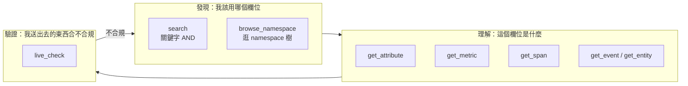
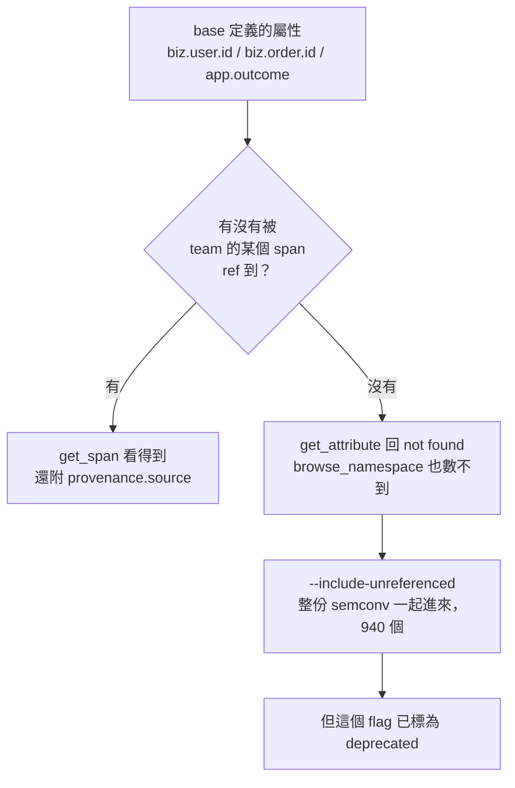
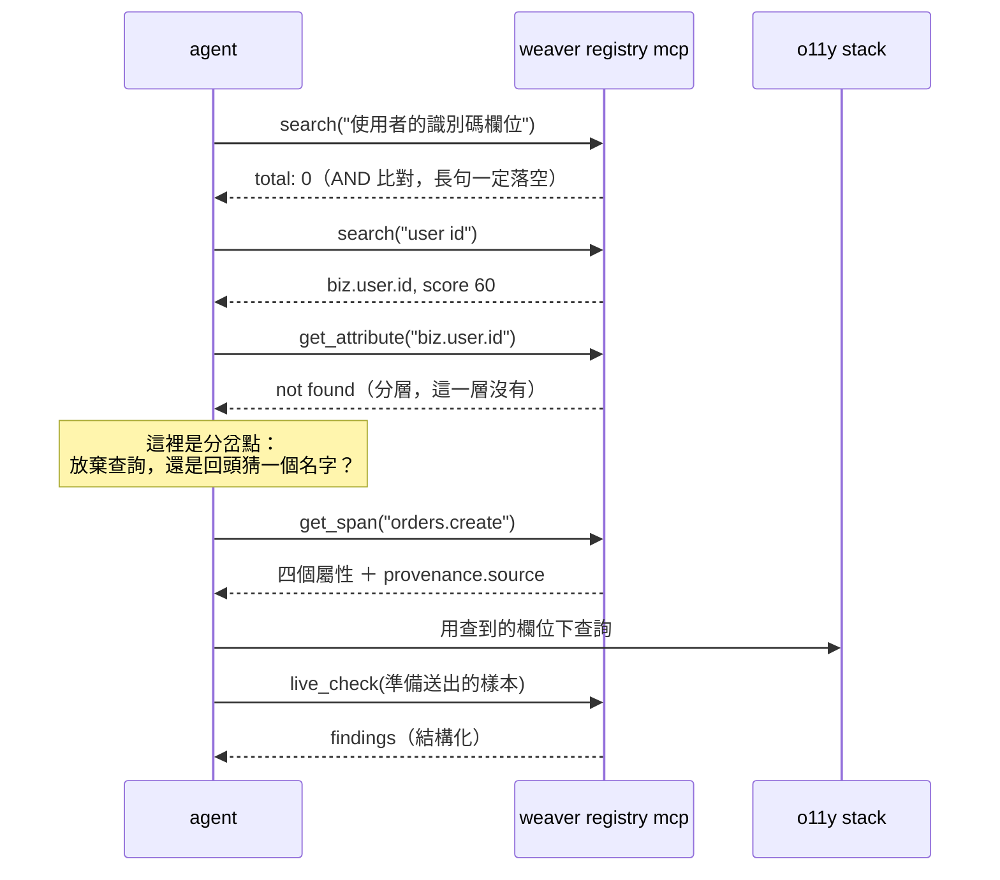

# Day10：把 registry 交到 agent 手上

> 前面做的治理
> 讀者一直只有兩種，人跟 CI
> 今天加第三種

這個階段前面做的每一件事，都是為了讓 registry 裡的東西可信：命名有規則、PR 有 gate、跑起來有 live-check、改版有人比對。但這份 registry 到目前為止只有兩種讀者，一種是人，一種是 CI。

Day1 那隻 agent 從來沒讀過它。它知道的所有 schema 都寫在 prompt 裡，包括那句害它每一次查詢都撈不到東西的 `deployment_environment="demo"`，還有那三個大寫的 `INFO` / `WARN` / `ERROR`。**它不是查不到答案，是它連「去查一下」這個動作都做不到。**

今天要把這條路接起來。`weaver registry mcp` 會把 registry 開成一個 MCP（Model Context Protocol）server，讓 LLM 自己去問「這個欄位叫什麼、有哪些值」。

程式碼在範例 repo [`OTel_AIOps_Agent`](https://github.com/tedmax100/OTel_AIOps_Agent) 的 [`ironman-2026/day10/`](https://github.com/tedmax100/OTel_AIOps_Agent/tree/main/ironman-2026/day10)，只有一支 [`mcp_probe.py`](https://github.com/tedmax100/OTel_AIOps_Agent/blob/main/ironman-2026/day10/mcp_probe.py)。用的 registry 是昨天那兩份。指令一律假設從 repo 根目錄跑，驗證環境是 weaver 0.25.1。

## 先講一件跟 LLM 無關的事

今天最有用的東西可能是這個：**驗證這件事完全不需要接 LLM。**

MCP 說穿了就是一套跑在 stdio 上的 JSON-RPC 協定。`weaver registry mcp` 起來之後，你往它的標準輸入丟 JSON，它從標準輸出回 JSON，中間沒有任何模型參與。所以一支七十行的 Python 就能把整個 server 打過一輪：

```python
self._proc = subprocess.Popen(
    ["weaver", "registry", "mcp", "-r", registry],
    stdin=subprocess.PIPE, stdout=subprocess.PIPE, text=True,
)
self._request("initialize", {...})
self._notify("notifications/initialized")
tools = self._request("tools/list")
```

為什麼要花這個力氣？因為 agent 答錯的時候，**你得先知道是「agent 講錯」還是「registry 教錯」**。這兩件事的修法完全不同，一個要改 prompt 或換模型，一個要改 YAML。沒有這支腳本，你只能盯著一段自然語言回答猜；有了它，你可以先把 registry 那一側釘死，剩下的才是 agent 的問題。

> 這是我在這個系列裡愈來愈常做的事：把一個「要靠 LLM 才能觀察」的東西，想辦法變成一個不用 LLM 就能斷言的東西。它跑得快、結果穩定、可以進 CI，而且不用花錢。

## 八個 tool，三種職責

文件那段介紹講的是三個 tool，實際跑 `tools/list` 回來的是八個：

```console
$ python3 ironman-2026/day10/mcp_probe.py
## tools (8)，registry = ironman-2026/day09/base-v2
  - browse_namespace
  - get_attribute
  - get_entity
  - get_event
  - get_metric
  - get_span
  - live_check
  - search
```

按用途分成三組，剛好對應一個 agent 排查時的三個階段：



前兩組是唯讀的查詢，第三組讓這件事變成一個閉環：agent 不只能問「我該送什麼」，還能把自己準備要送的東西丟回去問「這樣對嗎」。**這是 registry 第一次不只是被讀，而是能回答問題。**

## `search` 是關鍵字 AND，不是語意搜尋

這是最容易誤會的一個，因為它叫 search，而現在講到 search 大家都預期是向量檢索。

```console
  'order'          -> {"total": 1, "results": [{"key": "biz.order.id", "score": 70}]}
  '訂單識別碼'      -> {"total": 1, "results": [{"key": "biz.order.id", "score": 40}]}
  'user id'        -> {"total": 1, "results": [{"key": "biz.user.id", "score": 60}]}
  'order user'     -> {"total": 0, "results": []}
  'identifier'     -> {"total": 0, "results": []}
```

四件事一次看出來。`brief` 有進索引，所以用中文的「訂單識別碼」查得到，這對非英文的 registry 是好消息。分數會反映匹配的品質，key 直接命中比 brief 命中高。`order user` 回 0，因為兩個詞必須**同時**出現在同一個定義裡。而 `identifier` 回 0，證明它完全不做語意擴展，即使 brief 寫著「識別碼」。

有趣的是，這件事其實有寫，但寫在 tool 的 description 裡：

> Query terms are AND-matched (all must appear). Use short queries like 'http.request', 'db system', or 'server duration'.

**tool description 就是 agent 的介面契約。** 人不會去讀它，但模型每一次呼叫前都會讀到。所以這段文字寫得好不好，直接決定 agent 會不會下出一個注定回 0 筆的查詢。反過來說，你自己接 MCP 給團隊用的時候，description 就是你唯一能對 agent 說話的地方。

## 同一份 registry，兩個入口，兩種真相

昨天那個被更名的 `biz.cart.id` 是個好靶子。從 `search` 進去：

```console
## search 對 deprecated 的東西會標記、也會降權
  {"total": 1, "results": [{"key": "biz.cart.id", "score": 7,
    "deprecated": {"reason": "renamed", "renamed_to": "biz.basket.id",
                   "note": "Replaced by `biz.basket.id`."}}]}
```

很理想。`deprecated` 整塊帶出來，包含要改用哪一個，而且分數從一般的 60、70 掉到 **7**，等於在告訴 agent「這個能用，但你大概不想用」。

換 `browse_namespace` 進去：

```console
  {"prefix": "biz",
   "sub_namespaces": ["biz.basket", "biz.cart", "biz.order", "biz.tenant", "biz.user"],
   "attributes": [], "total_attribute_count": 5, "max_depth": 2}
```

`biz.cart` 跟 `biz.basket` 並排躺著，一模一樣的呈現，**沒有任何東西告訴你其中一個已經被另一個取代了**。一個從 namespace 開始逛的 agent，有一半的機率會挑到那個舊的。

這件事本身是個實作缺口，但它示範的問題比缺口本身大：**同一份資料開兩個入口，兩個入口對同一件事說了不同的話。** agent 走哪個入口不是你能控制的，它只會挑當下看起來最合理的那個 tool。所以「這個 tool 的回答完不完整」不能只驗一條路徑。

## 查不到的時候，它不算錯誤

```console
## 查一個不存在的名字：isError 是 false
  isError: False
  content: Attribute 'biz.does.not.exist' not found in registry
```

MCP 協定裡的 `isError` 是給模型看的訊號，用來區分「這次呼叫失敗了」跟「這次呼叫成功，結果是這樣」。weaver 選擇後者：查不到不是錯誤，是一個成功的查詢加上一句散文答案。

這個選擇是對的，但它有一個後果值得知道：**那句「not found」是一段自然語言，不是一個結構化的欄位。** 模型會不會正確理解它、會不會因此改用別的查法，取決於它讀不讀得懂那句話，而不是取決於某個布林值。這跟 Day1 那個空陣列是同一類問題的溫和版本，只是這次至少有一句話而不是一個空結果。

## 分層 registry 預設只看得見自己那層

這個最嚴重，而且只有分層之後才會遇到。

把 MCP 指向昨天那份 `team-orders`，先問它那個 span：

```console
## get_span 拿得到 base 的屬性（注意 type 不帶 span. 前綴）
  app.outcome          required         {"source": "https://example.com/schemas/acme-base/0.2.0"}
  biz.order.channel    recommended      {"path": "ironman-2026/day09/team-orders/model/orders.yaml"}
  biz.order.id         required         {"source": "https://example.com/schemas/acme-base/0.2.0"}
  biz.user.id          required         {"source": "https://example.com/schemas/acme-base/0.2.0"}
```

完美。四個屬性都在，必填標得清清楚楚，而且 `provenance` 直接回答了昨天那個問題：**這三個是 base 的東西，而且是 `acme-base/0.2.0` 這一版。** agent 現在知道自己讀的是哪一版的規範，這在昨天那個「升版沒人通知」的場景裡很重要。

然後同樣那幾個屬性，換個入口問：

```console
## 但同樣那幾個屬性，直接查就是不存在
  biz.user.id          -> Attribute 'biz.user.id' not found in registry
  app.outcome          -> Attribute 'app.outcome' not found in registry
  {"total_attribute_count": 1}
```

**同一個 server、同一份 registry、同一個屬性，從 span 進去看得到，直接查就是不存在。** 而 `browse_namespace` 說整份 registry 只有一個屬性，那個唯一被承認的，是團隊自己定義的 `biz.order.channel`。



原因是前面做分層的時候講過的：dependency 提供的是可以被 `ref` 的定義池，沒有被引用到的部分不會進 resolved schema，而 MCP 讀的就是 resolved schema。所以「有沒有被某個 span 引用」決定了 agent 查不查得到。

加上 `--include-unreferenced` 就會全部出現：

```console
## --include-unreferenced 之後才看得到 base，而且 provenance 變成 source
  {"total_attribute_count": 940}
  {"key": "biz.user.id", "brief": "使用者的 email，登入用",
   "provenance": {"source": "https://example.com/schemas/acme-base/0.2.0"}}
```

940 個，因為官方 semconv 整份都進來了。而這正是分層那個兩難的另一面：這個 flag 已經被標為 deprecated，官方建議改用 `imports`，但 `imports` 不吃 attribute。所以現在要讓 agent 查得到 base 的屬性，你只有兩條路：用一個正在被淘汰的 flag，或者確保每一個屬性都真的被某個 span 或 metric 引用到。

> 第二條路其實不算壞。「沒有任何訊號在用的定義，agent 也不需要知道」聽起來滿合理的。但它有個副作用：team registry 就此無法回答「這個公司有哪些共用欄位」這種問題，只能回答「我這一層用到了哪些」。

順帶一提，`get_span` 要的是 span type，不是 group id：

```console
  span.orders.create -> Span 'span.orders.create' not found in registry
  orders.create      -> （正常回傳）
```

YAML 裡寫的是 `id: span.orders.create`，照抄進去就是 not found，要把 `span.` 拿掉。這種「照著你看到的東西輸入卻拿到 not found」的介面，對 agent 特別不友善，因為它拿到的訊號跟「這個東西不存在」一模一樣。

## 閉環：`live_check` 也在同一個 server 上

前兩組 tool 讓 agent 查得到規範，`live_check` 讓它可以把自己的東西送回去檢查。我用昨天那個被移除的 enum 值試：

```console
## live_check 也在同一個 server 上
{
  "findings": [
    { "attribute_findings": [
        { "name": "app.outcome",
          "findings": [
            { "id": "not_stable", "level": "improvement", ... },
            { "id": "undefined_enum_variant", "level": "information",
              "message": "Enum attribute 'app.outcome' has value 'gateway_error' which is not documented." }
          ] } ],
      "type": "span" } ],
  "samples_with_findings": 1,
  "total_samples_checked": 1
}
```

透過 MCP 拿到的是結構化的 JSON，比終端機那份 ANSI 輸出更適合模型讀。`id`、`level`、`message` 三個欄位都在，agent 可以自己判斷要不要理會 `information` 級的東西。

至於它會不會理會，就回到昨天那個問題了：`undefined_enum_variant` 只有 `information`，而在昨天那個場景裡，它其實是一次沒被通知到的 breaking change。**規範裡的嚴重度，會直接變成 agent 的優先順序。**

## 回到 Day1 那隻 agent

把今天的東西跟第一天那份失敗紀錄擺在一起，缺口就很具體了。

那隻 agent 猜 `WARN` 是大寫，猜錯，60 筆 log 變成 0 筆。它為什麼會猜？因為 prompt 裡寫著 `INFO` / `WARN` / `ERROR`，而它沒有第二個來源可以對照。今天這個 server 上，`get_attribute` 回的東西裡就有 `type.members`，那是**唯一一個機器可以事先知道「這個欄位只有哪幾種值」的地方**。

但今天也很清楚地看到，這條路不是接上去就會變好，它有自己的一整排坑：

| 缺口 | agent 會怎麼踩 |
| --- | --- |
| `search` 是 AND 關鍵字 | 下一個自然語言式的長查詢，回 0 筆，然後以為沒有這個欄位 |
| `browse_namespace` 不標 deprecated | 挑到已經被更名的舊欄位，查歷史資料還真的查得到，更難發現 |
| not found 是一句散文 | 讀得懂就改查法，讀不懂就當作「這個系統沒有這個概念」 |
| 分層預設只看自己那層 | 問一個 base 定義的必填欄位，得到「不存在」 |

把一次排查畫成呼叫序列，會看到那些坑都長在什麼位置：



四種的共同點是**它們全都不會報錯**。這已經是這個系列第五次遇到同一個形狀了，只是這次踩到的不是工程師，是 agent。

放到值班的場景。凌晨三點你問 agent「這個使用者的訂單怎麼了」，它接了 MCP，很負責地先查了一下 `biz.user.id` 是什麼，拿到「not found in registry」。接下來它會做什麼？最可能的是回頭用它預訓練時學到的通用知識去猜一個欄位名，而那個猜測，跟 Day1 那次一模一樣。**接上 registry 沒有讓它變得更誠實，只是多給了它一個可能誤導它的來源。**

所以今天真正的結論不是「接上 MCP 就解決了」，而是：**registry 對 agent 的價值，取決於 agent 從它拿到的每一個答案有多完整，而不是取決於這份 registry 寫得多好。** 中間那層介面會吃掉一部分品質，而那部分現在只能靠自己測出來。

## 今天沒做的事

沒有接真的 LLM。今天全部是 `mcp_probe.py` 打出來的，所以我可以說「這個 tool 回什麼」，但還不能說「agent 拿到這些會怎麼決策」。把它接回 Day1 那組題目、重跑一次分數，是後面的事。

沒有寫自己的 MCP server。weaver 內建這八個 tool 已經夠今天用，但真正要給 agent 用的介面，大概還需要「這個欄位在哪些服務上實際出現過」這種 registry 本身答不出來的東西。

`browse_namespace` 不標 deprecated 這件事，我只驗到現象，沒有去上游看是不是已經有人回報。貼一個 issue 出來會比在文章裡抱怨有用。

也沒有測 `get_metric`、`get_event`、`get_entity` 這三個，因為今天的 registry 裡沒有 metric 跟 event 可以問。它們的行為我一律沒有假設。

## 小結

總結來說，今天寫的程式碼只有一支七十行的探針，沒有做出任何新的治理能力。但它把「這個 server 到底會告訴 agent 什麼」變成一件可以重複跑、跑完就有答案的事，之後每次改 registry 我都會順手打一次。比較意外的是那個 `total_attribute_count: 1`，分層是前面花一整天做對的事，結果它在 agent 這一側的預設行為，是讓大部分共用定義變成查不到，而這兩件事之間沒有任何自動的保證。這也讓我對後面的東西多了一個習慣：做完一層治理，要記得換到 agent 那一側再看一次。

> `search` 是關鍵字 AND、不是語意搜尋這件事，我一開始問了三輪都以為是自己問法不對。
> tool description 就是 agent 的介面契約，寫得含糊，agent 就會很有禮貌地一直查錯 :)
>
> 明天把這條線繼續往前拉，讓 registry 不只描述欄位。
