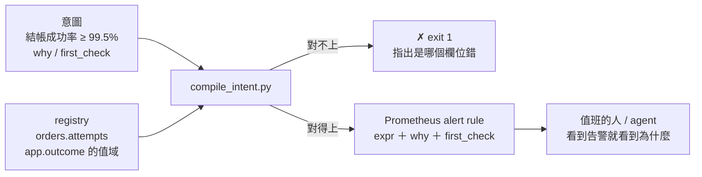
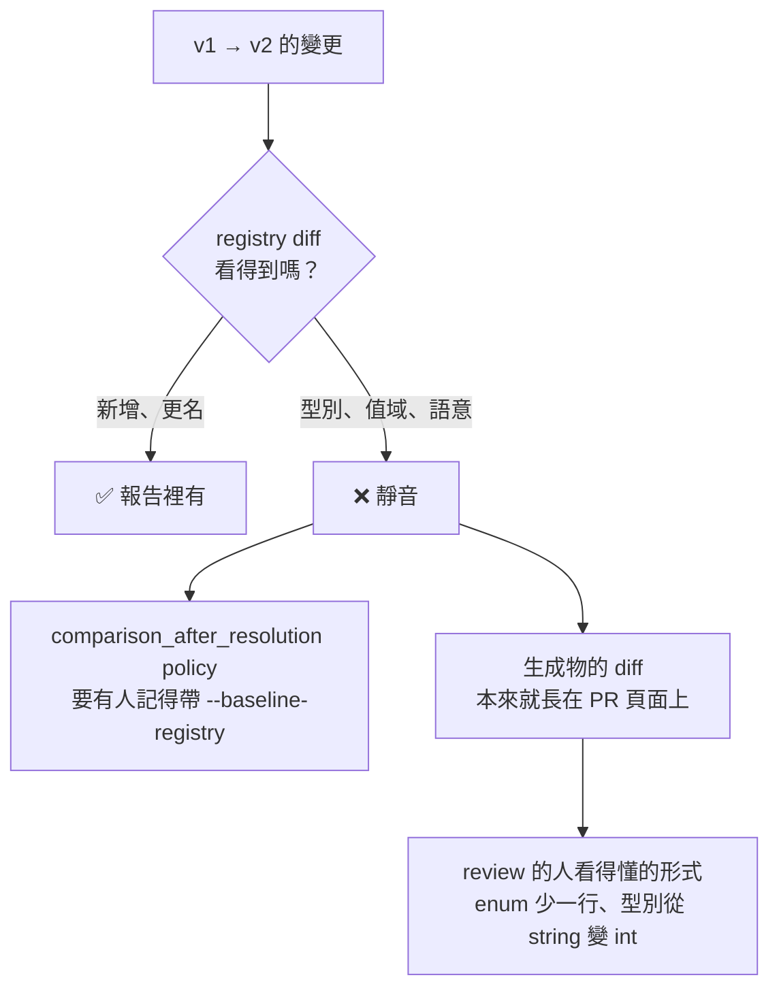
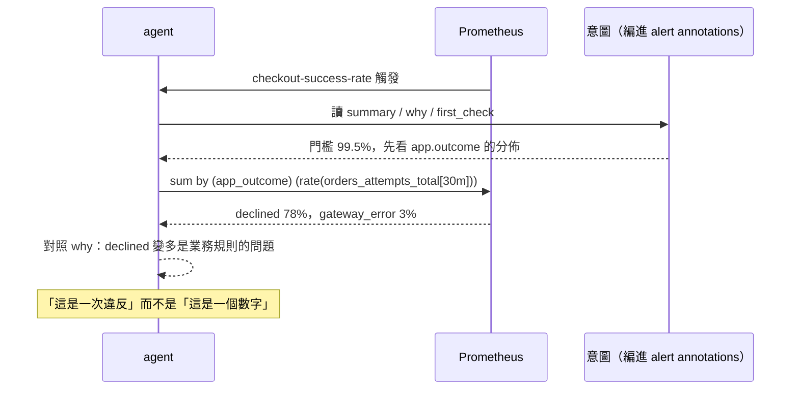

# Day11：機器可讀的意圖，讓 registry 說得出「為什麼」

> 這個欄位有哪些值，registry 答得出來
> 哪一種值代表「這個服務是好的」
> 目前只寫在 dashboard 標題跟幾個人的腦子裡

昨天把 registry 開成一個 MCP（Model Context Protocol）server 交給 agent，它現在查得到「`app.outcome` 有哪三種值」。但它查不到一件更重要的事：**這三種值裡，哪一種代表這個服務正常。**

這件事目前寫在哪裡？寫在一個 Grafana dashboard 的 panel 標題裡、寫在某條 alert rule 的 `expr` 裡、寫在值班手冊的第三段，還有寫在幾個資深工程師的腦子裡。這些地方沒有一個是 agent 讀得到的，也沒有一個會在有人改壞的時候發出聲音。

程式碼在範例 repo [`OTel_AIOps_Agent`](https://github.com/tedmax100/OTel_AIOps_Agent) 的 [`ironman-2026/day11/`](https://github.com/tedmax100/OTel_AIOps_Agent/tree/main/ironman-2026/day11)：

```
ironman-2026/day11/
├── registry/          ← 兩個 metric，attribute 上掛了 annotations
├── intent/            ← 三份意圖，其中一份是故意寫壞的
├── compile_intent.py  ← 拿 registry 驗證意圖，再編譯成 alert rule
├── templates/python/  ← codegen 的樣板
└── generated/         ← 生成物，而且要 commit 進版控
```

指令一律假設從 repo 根目錄跑。驗證環境是 weaver 0.25.1。

## 三層：規則、門檻加註解、意圖

先把「意圖」這個詞講清楚，不然它會聽起來很虛。拿同一件事的三種寫法對照：

| 層次 | 寫出來長這樣 | 機器讀得到什麼 |
| --- | --- | --- |
| 規則 | `rate(orders_attempts_total{app_outcome="declined"}[5m]) > 0.005` | 一個門檻，跟一個沒有人記得為什麼是這個數字的 0.005 |
| 門檻加註解 | 同上，`annotations: summary: "被拒率過高"` | 多一句給人看的描述 |
| 意圖 | 「結帳成功率不得低於 99.5%，因為下單失敗直接等於營收損失」＋它指向 registry 裡哪個 metric、哪個 dimension、哪些值算成功 | 目標、理由、以及**這條規則跟 schema 的哪個部分綁在一起** |

第三層跟前兩層的差別不是寫得比較詳細，是**它可以被驗證**。前兩層的 `expr` 裡那串 `app_outcome="declined"` 是一段字串，沒有任何東西保證 `declined` 這個值真的存在；第三層是一份指向 registry 的宣告，而 registry 知道 `app.outcome` 只有哪三個值。

寫成圖是這樣：



## registry 這一端：`annotations`

weaver 的 group 跟 attribute 都吃一個 `annotations` 欄位，內容是自由的 key-value，它不參與任何驗證，但**會被完整帶進 resolved schema**。這就是掛意圖用的地方：

```yaml
      - id: app.outcome
        stability: development
        brief: "這次業務操作的結果"
        annotations:
          intent:
            role: outcome_dimension
            good_values: [authorized]
        type:
          members:
            - id: authorized
              value: authorized
              brief: "成功"
              stability: development
            - id: declined
              value: declined
              brief: "被業務規則拒絕"
              stability: development
            - id: gateway_error
              value: gateway_error
              brief: "下游回錯"
              stability: development
```

跑 `weaver registry resolve --format json` 撈出來確認它真的還在：

```console
metric.orders.attempts | annotations: {"intent": {"owner": "orders-team", "slo": "checkout-success"}}
   attr app.outcome {"intent": {"role": "outcome_dimension", "good_values": ["authorized"]}}
```

**這是 registry 第一次記錄「這個欄位在業務上扮演什麼角色」**，而不只是它叫什麼、是什麼型別。`role: outcome_dimension` 這種東西 weaver 完全不認得，它只負責原封不動地送過去，認得它的是下一段那支腳本。

## 意圖這一端：兩種形狀

穩定狀態意圖，講的是「這個服務正常的定義」：

```yaml
apiVersion: intent.o11y/v1
kind: SteadyStateIntent
metadata:
  service: orders
  owner: orders-team
  registry: ironman-2026/day11/registry
spec:
  objectives:
    - id: checkout-success-rate
      statement: "結帳的成功率不得低於 99.5%"
      why: >-
        下單失敗直接等於營收損失，而且使用者不會重試第二次。
        這條是這個服務唯一一條會叫醒人的規則。
      first_check: >-
        先看 app.outcome 的分佈：declined 變多是業務規則的問題（例如風控改了門檻），
        gateway_error 變多是下游的問題，兩者的處理方式完全不同。
      signal:
        metric: orders.attempts
        dimension: app.outcome
        good_values: [authorized]
      threshold:
        ratio_min: 0.995
        window: 30m
```

`why` 跟 `first_check` 這兩個欄位是我覺得整份格式裡最有價值的東西，而它們的內容一個字都不是新的，全部是本來就存在、只是散落在別的地方的知識。差別在於現在它們跟那條規則綁在一起，會跟著告警一起送到值班的人面前。

變更意圖是另一種形狀，講的是「這次部署打算改變什麼」：

```yaml
kind: ChangeIntent
spec:
  summary: "把下游支付的 timeout 從 3s 降到 1s，逾時改為重試一次"
  expected:
    - id: latency-drops
      statement: "p99 應該下降"
      direction: down
  unchanged:
    - id: declined-flat
      statement: "被拒的比例不應該改變。如果變了，代表重試把不該重試的請求重試了"
      signal:
        metric: orders.attempts
        dimension: app.outcome
        values: [declined]
      tolerance_ratio: 0.10
```

**`unchanged` 那段才是重點，而它是實務上最少人寫的一段。** 大家都會寫「這次改動要讓 p99 下降」，很少人會寫「這次改動不應該動到被拒率」。但對一個要判斷「這個指標的變化是預期的還是意外的」的 agent 來說，後者才是它唯一的依據。沒有這段，部署後所有的變化看起來都一樣可疑，或者一樣不可疑。

> 這個格式是我自己編的，不是任何標準。重點不在欄位怎麼取名，在於「正常的定義」跟「這次改動的預期」這兩件事，值得從人的腦袋裡搬到一個檔案裡。

## 編譯：意圖要能長出可執行的東西

一份不會被執行的宣告，三個月後就會跟現實脫節。所以 `compile_intent.py` 做兩件事：先拿 registry 當型別檢查器驗一遍，再編譯成 Prometheus 的 rule。

驗證那段是這樣：

```python
members = enum_values(dimension)
for value in signal.get("good_values", []):
    if value not in members:
        errors.append(
            f"{where}: `{dimension_name}` 沒有 `{value}` 這個值。"
            f"合法的是：{', '.join(members)}"
        )
```

跑正常那份：

```console
$ python3 ironman-2026/day11/compile_intent.py ironman-2026/day11/intent/steady-state.yaml
# steady-state.yaml: SteadyStateIntent，2 條，registry = ironman-2026/day11/registry
✔ 每一個 metric、dimension、值都在 registry 裡對得上

groups:
- name: orders
  rules:
  - alert: checkout-success-rate
    expr: sum(rate(orders_attempts_total{app_outcome=~"authorized"}[30m])) / sum(rate(orders_attempts_total[30m]))
      < 0.995
    for: 30m
    labels:
      severity: page
      owner: orders-team
    annotations:
      summary: 結帳的成功率不得低於 99.5%
      why: 下單失敗直接等於營收損失，而且使用者不會重試第二次。 這條是這個服務唯一一條會叫醒人的規則。
      first_check: 先看 app.outcome 的分佈：declined 變多是業務規則的問題（例如風控改了門檻）， gateway_error 變多是下游的問題，兩者的處理方式完全不同。
```

那個 `owner: orders-team` 不是我在意圖裡寫的，是從 registry 那個 metric 的 `annotations.intent.owner` 撈出來的。**誰擁有這個 metric 是 schema 的事實，不該在每一份意圖裡重寫一次。**

第二條 objective 編出來的是 histogram 版本：

```
expr: histogram_quantile(0.99, sum by (le) (rate(orders_duration_bucket[30m]))) > 2
```

那個 `owner` 欄位在這條變成 `unknown`，因為我只在 `orders.attempts` 上掛了 annotation，沒有在 `orders.duration` 上掛。這種缺漏會直接顯示在產物上，比藏在腦子裡好。

## 兩個故意寫壞的意圖

這才是這支腳本真正的價值。我另外寫了一份 `steady-state-broken.yaml`，裡面兩個錯誤各對應 Day1 那隻 agent 犯過的一種：

```console
$ python3 ironman-2026/day11/compile_intent.py ironman-2026/day11/intent/steady-state-broken.yaml
# steady-state-broken.yaml: SteadyStateIntent，2 條

✗ 驗證失敗，2 個問題：

  - objective `checkout-success-rate`: `app.outcome` 沒有 `AUTHORIZED` 這個值。
    合法的是：authorized, declined, gateway_error
  - objective `checkout-error-budget`: registry 裡沒有 metric `orders.errors`。
    有的是：orders.attempts, orders.duration

$ echo $?
1
```

第一個錯是大小寫。這就是 Day1 那隻 agent 把 `warn` 猜成 `WARN`、讓 60 筆 log 變成 0 筆的同一個錯誤，只是這次犯錯的是人，而且是在 PR 階段被抓到，不是在凌晨三點。

第二個錯更值得看：`orders.errors` 跟 `app.error_type` 這兩個名字聽起來都很合理，合理到 code review 的時候不會有人停下來問「我們真的有這個 metric 嗎」。**這正是 LLM 產生幻覺欄位時的長相，它們從來不會編一個離譜的名字。**

兩條錯誤訊息都做到同一件事：不只說哪裡錯，還說合法的有哪些。這是前面做 CI gate 時那條判準的具體實踐，被擋下來的人不用來問你就能自己修好。

## 後半：讓 registry 直接變成程式碼

意圖那半解決的是「規則指向的東西存不存在」。但服務程式碼裡還是到處在手打字串：

```python
span.set_attribute("app.outcome", "AUTHORIZED")   # 又是那個大小寫
```

weaver 的 codegen 可以把 registry 編成程式碼。樣板是 Jinja，資料來源是 resolved schema，中間用 JQ 表達式挑要哪些東西：

```yaml
templates:
  - template: semconv_enums.py.j2
    filter: >
      .groups
      | map(select(.type == "attribute_group"))
      | map(.attributes[])
      | map(select(.type | type == "object"))   # type 是物件的才是 enum
      | unique_by(.name)
      | sort_by(.name)
    application_mode: single
    file_name: "semconv_enums.py"
```

跑一次：

```console
$ weaver registry generate -r ironman-2026/day11/registry \
    --templates ironman-2026/day11/templates python ironman-2026/day11/generated
✔ Generated file "ironman-2026/day11/generated/semconv_enums.py"
✔ Generated file "ironman-2026/day11/generated/semconv_attrs.py"
```

生出來的東西長這樣：

```python
# Code generated by Weaver. DO NOT EDIT.
"""enum attribute 的合法值域。手打字串的機會到這裡為止。"""

from enum import StrEnum


class AppOutcome(StrEnum):
    """這次業務操作的結果"""

    AUTHORIZED = "authorized"    # 成功
    DECLINED = "declined"    # 被業務規則拒絕
    GATEWAY_ERROR = "gateway_error"    # 下游回錯
```

於是那個大小寫的錯誤，現在會在建構的當下就爆掉：

```console
>>> AppOutcome("authorized")
<AppOutcome.AUTHORIZED: 'authorized'>

>>> AppOutcome("AUTHORIZED")
ValueError: 'AUTHORIZED' is not a valid AppOutcome
```

**錯誤從「可以被檢查」變成「說不出來」。** 前面幾天做的事都是「寫錯了會被抓到」，這一步是「根本寫不出錯的東西」，這兩者在工程上差很多：前者需要有人記得跑檢查，後者不需要。

## 意外收穫：生成物的 diff 補上了 `registry diff` 那三個洞

前面講 breaking change 的時候量過一件很不舒服的事：`registry diff` 對型別改變、enum member 移除、`brief` 改寫這三種變更完全靜音，而那三種正好是最會痛的。

今天做完 codegen 之後，我拿前面那兩份 `base-v1`／`base-v2` registry 各生成一次，然後 diff 生成物：

```console
$ weaver registry generate -r ironman-2026/day09/base-v1 --templates ... python /tmp/g1
$ weaver registry generate -r ironman-2026/day09/base-v2 --templates ... python /tmp/g2
$ diff -u /tmp/g1/semconv_attrs.py /tmp/g2/semconv_attrs.py
```

```diff
-# 使用者識別碼
+# 使用者的 email，登入用
 BIZ_USER_ID: str = "biz.user.id"

 ATTRIBUTE_TYPES: dict[str, str] = {
-    "app.outcome": "enum[authorized|declined|gateway_error]",
+    "app.outcome": "enum[authorized|declined]",
-    "biz.order.id": "string",
+    "biz.order.id": "int",
 }

 DEPRECATED_ATTRIBUTES: dict[str, str] = {
+    "biz.cart.id": "renamed → biz.basket.id",
 }
```

```diff
 class AppOutcome(StrEnum):
     AUTHORIZED = "authorized"    # 成功
     DECLINED = "declined"    # 被業務規則拒絕
-    GATEWAY_ERROR = "gateway_error"    # 下游回錯
```



**三種靜音的變更，在生成物的 diff 上全部現形。** 型別、值域、語意，只要它們有出現在生成物裡，`git diff` 就會把它們攤在 PR 上，而且是用 review 的人看得懂的形式。

這件事直接推出一個實務結論：**生成物要 commit 進版控。** 一般的直覺是「這東西反正每次都能重生，不要進 git」，但在這個場景裡，把它放進 git 才是重點，因為 diff 才是那個會說話的東西。生成物在這裡不只是產物，是一份**變更的顯影劑**。

而它同時補上了另一個洞：那條 `comparison_after_resolution` policy 需要有人記得帶 `--baseline-registry` 去跑，生成物的 diff 不需要任何人記得任何事，它就長在 PR 頁面上。

> 這裡有個小陷阱：diff 會不會顯示，完全取決於你的樣板有沒有把那個欄位印出來。`ATTRIBUTE_TYPES` 那個字典是我刻意加的，如果樣板只印名字常數，型別改變一樣是靜音的。**顯影劑只顯影它照得到的東西。**

## 誰來寫這份意圖

從平台工程的角度看，這一天的東西比前幾天更敏感，因為它要求產品團隊寫東西，而不只是照規範命名。

**誰維護？** 意圖一定是產品團隊的，不能是平台團隊。「結帳成功率低於 99.5% 要叫醒人」這種判斷只有懂那個業務的人能下，平台團隊來寫就會變成一堆抄來抄去的 99.9%。平台團隊提供的是格式、編譯器，跟那條「你寫的東西必須指得到 registry 裡真的存在的欄位」的檢查。

**成本落在誰身上？** 我算過這份 `steady-state.yaml`，一條 objective 大概八行，其中有實質內容的是 `statement`、`why`、`first_check` 三段散文，而那三段本來就寫在值班手冊裡。要學的新概念是「意圖要指向 registry 裡的欄位」這一件事。

**擋下來的時候修得動嘛？** 前面那兩條錯誤訊息都附了合法值清單，這是我刻意花力氣做的部分。一條只說「validation failed」的訊息，會把每一次驗證失敗都變成一張給平台團隊的工單。

**這條規則是強制、預設、還是建議？** 我的做法是：意圖檔案本身不強制每個服務都要有，但**一旦有了，它就必須編得過**。這是一條 paved road，走上來之後路很好走，但不走也不會被擋在門外。硬性要求每個服務都寫意圖，只會收到一堆為了通過檢查而複製貼上的 YAML。

## 回到 AIOps：意圖是 agent 的判準

最後接回主軸。今天做的兩件事，對 agent 的意義完全不同。

codegen 那半跟 agent 沒什麼關係，它服務的是寫程式的人。但它間接影響 agent：**資料源頭的品質提高了，agent 讀到的東西才會一致。**

意圖那半才是給 agent 的。Day1 那隻 agent 拿到「過去六小時的錯誤率是 2.98%」這個數字之後，它沒有任何依據判斷這個數字算不算異常。它可以講出這個數字、可以講出趨勢，但「這樣算不算壞掉」這個問題，它答不出來，因為那個判準從來沒有被寫在任何它讀得到的地方。

意圖就是那個判準。有了它，agent 的推理鏈可以變成：查到成功率 99.2% → 讀到意圖說門檻是 99.5% → **這是一次違反，不是一個數字** → 讀到 `first_check` 說要先看 `app.outcome` 的分佈 → 下一步該查什麼不用它自己猜。



放到值班的場景差別更明顯。凌晨三點，agent 說「訂單服務的成功率是 99.2%」，你得自己想這個數字正不正常；agent 說「訂單服務違反了 checkout-success-rate 這條意圖（門檻 99.5%），依照 first_check 我先看了 `app.outcome` 的分佈，declined 佔了 78%，看起來是業務規則的問題不是下游故障」，你可以直接開始處理。**兩句話背後的資料完全一樣，差別只在有沒有那份寫下來的判準。**

而這也是為什麼 `first_check` 那個欄位值得寫。它是資深工程師腦子裡「遇到這種狀況先看哪裡」的那份直覺，而那份直覺目前是這個系統裡最貴、也最沒有被記錄下來的東西。

## 今天沒做的事

沒有把編譯出來的 alert rule 真的部署到 Prometheus 上。今天輸出到 stdout 就停了，接下來那一段（進 GitOps、跟現有的手寫 rule 併存、怎麼處理衝突）沒有做。

沒有做「意圖跟現實對帳」。編譯器只驗證意圖指向的東西存不存在，不驗證那個 metric 現在有沒有資料。一條指向合法欄位、但那個 metric 三個月沒人送資料的意圖，今天完全驗得過。

`ChangeIntent` 的 `expected` 那段只驗證了欄位，沒有編譯成查詢。「p99 應該下降」要編成什麼，需要一個部署前的基準值，那是另一個題目。

生成物只做了 Python。同一份 registry 要生 Go、TypeScript，樣板得各寫一份，而「多語言之間的生成結果一不一致」本身又是一個要處理的問題。

## 小結

總結來說，今天寫的兩支東西看起來沒什麼關係，一個把散文編成告警，一個把 schema 編成程式碼，但它們做的其實是同一件事：**把只存在於人腦裡的東西，搬到一個機器讀得到、而且會在改壞的時候出聲的地方。** 意外的收穫是那份生成物的 diff，我本來只是想讓程式碼別再手打字串，結果它順手補上了 `registry diff` 看不見的那三種變更，而且補得比 policy 更自然，因為 review 的人本來就會看 diff，不需要有人記得多跑一個指令。

> 那兩份故意寫壞的意圖，是照著 agent 真的犯過的兩種錯改的。
> 把自己的失敗紀錄拿來當測資，是我做這系列以來投報率最高的一件事 :)
>
> 明天處理一個一直被我閃過的問題：這一路做出來的東西，怎麼證明它們還在正常運作。
