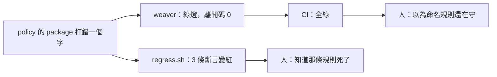
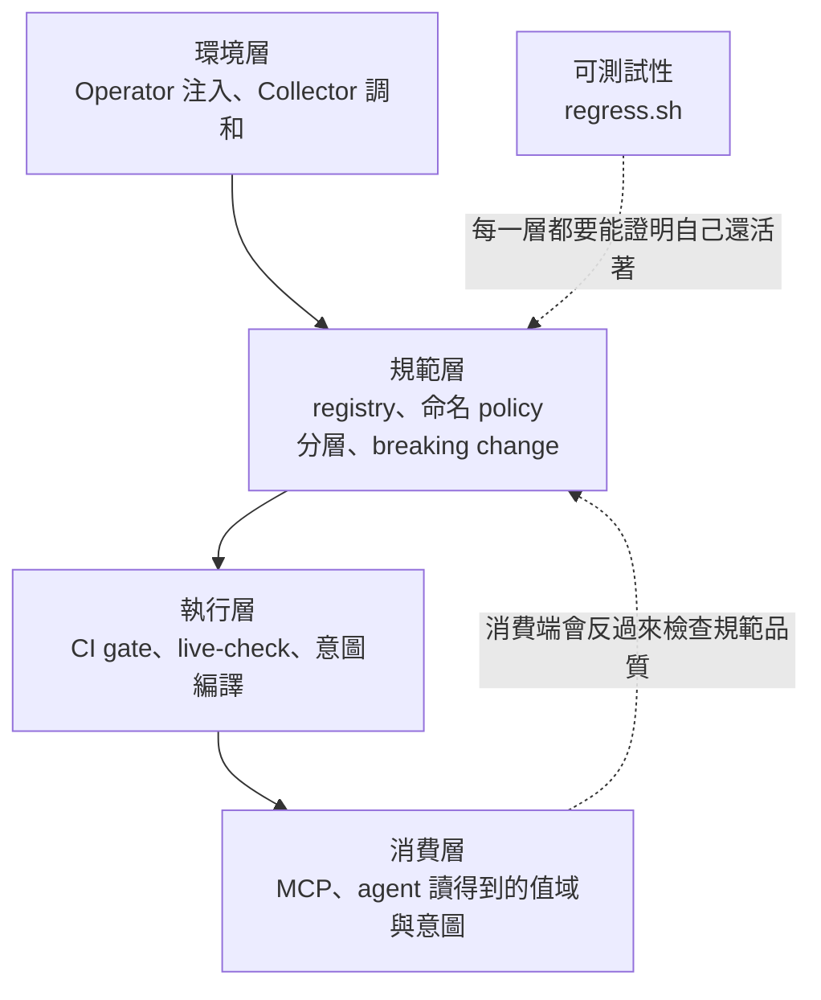
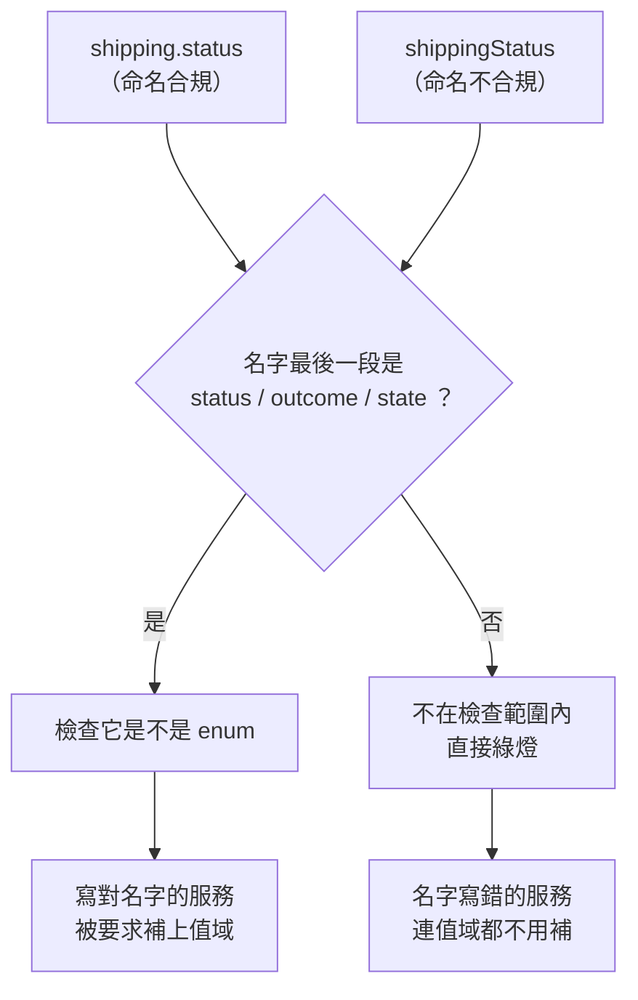
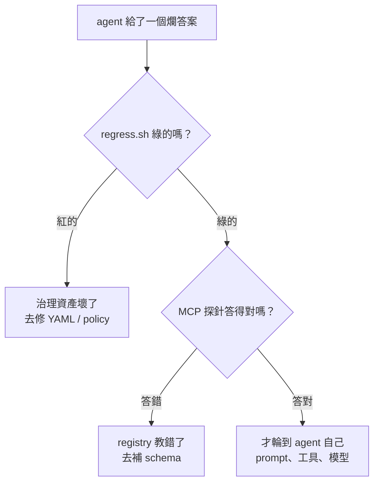

# Day12：不用 LLM 也能驗證治理資產還醒著，與第一階段的收尾

> 你要驗證的不是它會不會通過
> 是它還會不會擋
> 而一份檢查只會在壞掉的東西上
> 顯現自己的 bug

前面做出了一堆會擋人的東西：三條命名規則、一道 CI gate、live-check、分層的衝突檢查、breaking change 的比對規則、意圖編譯器。每一個都在寫出來的當天證明過自己有效。

但沒有任何一個東西，會在它**停止有效**的時候告訴我。而這些東西現在還散在十幾個資料夾裡，一個剛加入的團隊要接上這一整套，得先把整個階段的文章讀完。所以今天做兩件事，它們其實是同一件：先證明那些檢查還醒著，再把它們收成一份新服務照著跑就好的清單。

程式碼在範例 repo [`OTel_AIOps_Agent`](https://github.com/tedmax100/OTel_AIOps_Agent) 的 [`ironman-2026/day12/`](https://github.com/tedmax100/OTel_AIOps_Agent/tree/main/ironman-2026/day12)，兩支主角：`regress.sh` 跟 `verify_onboarding.py`，加上兩份對照用的服務。指令一律假設從 repo 根目錄跑，驗證環境是 weaver 0.25.1。

## 先把前面壞掉的方式列出來

寫測試之前得先知道要防什麼。我把前面每一天真的踩到的坑攤開來排，結果它們的形狀高度一致：

| 哪個環節 | 出了什麼事 | 當下看到的畫面 |
| --- | --- | --- |
| registry 基礎 | `-r .` 路徑寫錯，讀到 0 個 group | `✔ No policy violation`，離開碼 0 |
| cardinality policy | cardinality 規則只比對 `biz.` 前綴 | 綠燈，換個名字就繞過去了 |
| 命名 policy | policy 的 package 名字打錯 | 綠燈，連 coverage 報告都空的 |
| CI gate | 診斷預設走 stderr | CI 是紅的，但 PR 上一條 annotation 都沒有 |
| CI gate | resolver 錯誤配 GitHub 格式 | 一個空的 `::group::`，紅得莫名其妙 |
| live-check | live-check 不管 `required` 有沒有送 | 綠燈 |
| 分層 registry | 重複定義變成沒人引用的孤兒 | 綠燈 |
| 分層 registry | `before_resolution` 的違規 | 摘要行印綠色勾勾，離開碼 1 |
| breaking change | `diff` 對型別／值域／語意改變 | 什麼都不印，離開碼 0 |
| MCP | 分層 registry 查不到 base 的屬性 | 一句 `not found`，`isError` 是 false |

十條裡有七條的症狀是**綠燈**。這就導出今天整篇的那句話：你要驗證的不是「它會不會通過」，是「它還會不會擋」。

一般的測試直覺是「跑一遍，沒壞就好」。但這一整排東西壞掉的時候，跑一遍正好就是沒壞的樣子。所以斷言要反過來寫：拿一份本來就該被擋下來的東西餵給它，如果它放行了，那才是失敗。

## 四個做法

**一、每條規則都要有一個「本來就該紅」的靶子。** 這是最重要的一條。那份命名漂移的 registry、`base-v1` 對 `base-v2`、那份 `steady-state-broken.yaml`，這些檔案我當初都是為了寫文章才留著的，現在它們的正式身分是 fixture。

```bash
expect_exit 1 "day06 命名漂移擋得住" \
  weaver registry check -r ironman-2026/day06/registry -p ironman-2026/day07/policies

expect_exit 1 "day11 意圖裡的大小寫錯誤擋得住" \
  python3 ironman-2026/day11/compile_intent.py ironman-2026/day11/intent/steady-state-broken.yaml
```

**二、先量一個基準。** 每份 registry 在被檢查之前，先用 `weaver registry stats` 確認它真的被讀進來了，group 數小於 1 就直接判失敗。這條斷言便宜到幾乎沒有成本，但它擋掉的是「整套檢查其實什麼都沒在檢查」這種最難發現的狀況。

**三、不接 LLM 也要能驗證。** MCP（Model Context Protocol）server 是 stdio 上的 JSON-RPC，打它不需要模型，所以前面那支探針在這裡變成一條斷言。這條的意義在**歸因**：哪天 agent 給了一個爛答案，我可以先跑這支腳本，綠的就代表 registry 這一側是好的、問題在 agent；紅的就不用去調 prompt，先去修 YAML。把「要靠 LLM 才能觀察」的東西變成「不用 LLM 就能斷言」的東西，是這個系列到目前為止投報率最高的一個習慣。

**四、連「已知的缺口」也寫成斷言。** `registry diff` 對三種變更靜音、live-check 對被移除的 enum 值只給 `information`、MCP 在分層下查不到 base 的屬性，這些今天都是既定行為。我把它們也寫進腳本，斷言的內容是「它現在就是不會擋」：

```bash
echo "== 已知的缺口：這些現在就是不會擋，寫下來才不會誤以為有人在守"
expect_exit 0 "registry diff 對型別／值域／語意改變靜音" \
  weaver registry diff -r ironman-2026/day09/base-v2 --baseline-registry ironman-2026/day09/base-v1
```

這樣做有兩個好處。一是這份清單變成一個看得到的東西，不會有人半年後接手時以為那裡有防護。二是**上游哪天修好了，這幾條會變紅**，而那個紅燈的意思是好消息：可以把自己補的那層拆掉了。一個會因為「事情變好了」而失敗的測試聽起來很怪，但它記錄的是一個當下的事實，而事實會變，與其讓它默默過期，不如讓它出聲。

> 我現在接任何新的檢查機制，第一件事都是先讓它失敗一次給我看。這個習慣是被 `-r .` 那次教會的，那次我對著一個綠燈滿意了大概二十分鐘。

## 跑起來長什麼樣

```console
$ bash ironman-2026/day12/regress.sh

== 探針：這些檢查真的讀得到東西
  ✓ day06 drift registry                     2 groups
  ✓ day08 team-orders（含分層）              3 groups
  ...

== 該紅的還會紅嗎（這一段才是重點）
  ✓ day06 命名漂移擋得住                     exit=1
  ✓ day08 同名兩份定義擋得住                 exit=1
  ✓ day08 孤兒在 include-unreferenced 下現形  exit=1
  ✓ day09 三種靜音變更被 policy 抓到          exit=1
  ✓ day09 --future 把警告變成錯誤             exit=1
  ✓ day11 意圖裡的大小寫錯誤擋得住            exit=1
  ✓ day07 live-check 抓得到型別對不上         exit=1
  ✓ day07 live-check 抓得到還在送的舊欄位     exit=1

== 訊息本身也要能讓人自己修好
  ✓ day06 講得出是哪一條規則        找到「duplicate_concept」
  ✓ day08 講得出跟誰衝突            找到「registry.acme.biz」
  ✓ day11 講得出合法值有哪些        找到「合法的是：authorized, declined, g」
  ✓ day07 產得出 GitHub annotation       找到「::error file=」

────────────────────────────────────────────────────────────
29 條斷言：29 通過，0 失敗
其中預期離開碼非 0 的有 8 條，預期 0 的有 10 條
```

29 條斷言，跑一次 36 秒，零次 LLM 呼叫。那 36 秒裡有大半是分層的那幾份 registry 要去解析官方 semconv，純本地的那些是毫秒級的。

那段「訊息本身也要能讓人自己修好」是我後來才加的。前面講過，一道 gate 說不清楚，維護成本會隨團隊數線性成長。既然這件事這麼重要，那它就該被測試，而不是靠我每次改 policy 的時候記得順手看一眼輸出。**「錯誤訊息夠不夠好」是一個可以被斷言的東西，只要你願意把那個關鍵字寫進測試裡。**

一條永遠不會失敗的斷言等於沒有斷言。所以最後我做了一次自我驗證，把那個 package 名字打錯的坑原樣重現：

```console
$ sed -i 's/^package after_resolution/package mypolicy/' ironman-2026/day07/policies/naming.rego
$ bash ironman-2026/day12/regress.sh

  ✗ day06 命名漂移擋得住                  exit=0（預期 1）
  ✗ day06 講得出是哪一條規則              沒找到「duplicate_concept」
  ✗ day07 產得出 GitHub annotation             沒找到「::error file=」

29 條斷言：26 通過，3 失敗
```

registry 一個字都沒改，policy 檔也還在原地，只是 package 名字錯了，於是那條規則靜悄悄地不執行。三條斷言同時倒下，而在沒有這支腳本的世界裡，這件事的表現形式是「CI 全綠」。



## 那這一整套，新服務怎麼接

確認檢查還醒著之後，接下來的問題是介面：一個新團隊要接上這一整套，他該做什麼。

把前面做的事按因果排一次，會發現它不是十幾個獨立的工具，是四層：



那條回饋虛線是這個階段我最沒預期到的收穫。把 registry 交給 agent 之後才發現，分層做得好好的 registry，在 agent 那一端預設看不到 base 的屬性。**消費端會反過來暴露規範層的問題**，而在沒有消費端之前，那些問題完全看不出來。

checklist 最常見的失敗方式是它變成一份問卷：「你有沒有寫 brief？」「有。」然後沒有人真的去看。所以 `verify_onboarding.py` 的每一項都是去執行一次工具，然後讀它的離開碼或輸出。拿一個「照抄一半」的新服務當靶子，這是很真實的情況：新團隊複製了隔壁團隊的 registry，改了名字，該補的沒補完。

```console
$ python3 ironman-2026/day12/verify_onboarding.py ironman-2026/day12/shipping-v0

# shipping-v0 上線檢查

## 基本
  ✓ 1. registry/manifest.yaml 存在
  ✓ 2. registry 真的被讀進來  2 個 group
  ✓ 3. registry check 通過

## 命名與分層
  ✗ 4. 命名規則通過
      問題：違規的欄位：shippingStatus
      下一步：改成 snake_case、補上 namespace（例如 shipping.status）
  ✗ 5. 有宣告 base registry 的 dependency
      問題：manifest.yaml 裡沒有 dependencies
      下一步：加上 ironman-2026/day08/base，然後把共用欄位改成 ref
  ✓ 6. 沒有跟別人衝突的重複定義

## 對 agent 的可用性
  ✓ 7. 每個 attribute 都有 brief  3 個
  ✓ 8. 狀態類欄位都把值域寫進 schema  enum：（沒有）
  ✗ 9. 每個 metric 都有語意單位
      問題：單位是空的或 1：shipping.dispatched
      下一步：用 UCUM（Unified Code for Units of Measure）的計數單位，例如 {shipment}，agent 才知道這個數字在數什麼
  ✗ 10. 每個 metric 都標了 owner
      問題：沒有 annotations.intent.owner：shipping.dispatched
      下一步：在 metric group 上加 annotations.intent.owner，告警才知道要找誰

## 意圖與產出
  ✗ 11. 有寫下這個服務的穩定狀態意圖
      問題：ironman-2026/day12/shipping-v0/intent 底下沒有任何 YAML
      下一步：從 ironman-2026/day11/intent/steady-state.yaml 抄一份，寫下什麼叫做正常
  ✗ 12. 意圖編得出 alert rule
      問題：沒有意圖可以編
      下一步：先做完第 11 項
  ✓ 13. 生得出型別安全的常數與 enum

────────────────────────────────────────────────────────────
7/13 通過
```

先看第 3 項：**`registry check` 是綠的。** 這個服務在 weaver 眼裡完全合法，YAML 結構正確、該有的欄位都有。但它有六項沒過，而那六項全部落在「合法，但對 agent 沒有用」這個區間。前面講過內建檢查的邊界：少了 `brief` 是硬錯誤，少了 `examples` 完全不吭聲。這份 checklist 補的就是那條邊界之外的東西：工具管的是這份 YAML 合不合法，checklist 管的是這份 schema 好不好用。

每一項失敗都有「下一步」，這是我花最多力氣的部分。所以第 4 項不只說 `shippingStatus` 違規，還說改成 `shipping.status`；第 11 項不只說沒有意圖，還說去哪抄一份。補完之後 `shipping-v1` 拿到 13/13，而它做的事只有四件：`shippingStatus` 改成有 `members` 的 `shipping.status`、接上 base 並把 `biz.user.id` 改成 `ref`、metric 補上 `{shipment}` 跟 `owner`、寫一份意圖，加起來大概三十行 YAML。

## 我自己的 checklist 有兩個洞

這才是今天最值得寫的一段。上面那份 `shipping-v0` 的報告裡，有兩個綠燈是錯的。

**第 8 項放過了 `shippingStatus`。** 那個檢查在做的事是：找出名字最後一段是 `status`、`outcome`、`state`、`result` 的屬性，確認它們都是 enum。而 `shippingStatus` 這個名字裡沒有點，整個名字就是一段，所以它匹配不到任何一個關鍵字。



看清楚這個因果：它因為同時違反了命名規則，反而躲過了值域檢查。一個服務如果命名寫對了，這個檢查會抓到它；命名寫錯的服務反而全身而退。這是我看過最諷刺的一種假綠燈，而它只有在跑一個「兩件事都做錯」的服務時才會現形。

**第 6 項放過了 `biz.user.id`。** `shipping-v0` 裡有一個自己定義的 `biz.user.id`，brief 寫的是「收件人的識別碼」，而 base 裡那個是「使用者識別碼」。這正是分層時那條 `conflicting_definition` 規則要抓的東西，但它是綠的。第一個原因很單純：v0 沒宣告 dependency，base 的定義根本不在視野裡。但我手動補上 dependency 之後，它還是綠的，因為那個屬性沒有被任何 span 或 metric `ref` 到，所以它不會進 resolved schema，而 policy 看的就是 resolved schema。這是「未引用的定義不會進來」那個行為，今天它第三次出現，這次的受害者是我自己的 checklist。加上 `--include-unreferenced` 確實抓得到，但代價是一個真陽性配兩個上游 semconv 自己的同名雜訊，而這個比例只會隨著 registry 長大而變差。

兩個洞的共通點是：**它們都只在壞掉的服務上顯現。** 我拿 `shipping-v1` 跑一百次都不會發現任何一個，因為那份服務每一項都做對了。所以那個照抄一半的 `shipping-v0` 不是教材，它是測試資料，而且是這支腳本唯一的測試資料。

> 這跟前面那句「你要驗證的不是它會不會通過，是它還會不會擋」是同一件事，只是這次要驗證的對象換成了 checklist 自己。我寫完它、跑過 v1 拿到 13/13、很滿意，然後跑 v0 才看到那兩個洞。

## 一份是給自己的門，一份是給別人的清單

從平台工程的角度，今天這兩支腳本的定位完全不同，講不清楚就會被誤用。

`regress.sh` 是**平台團隊自己的測試，不是給產品團隊的 gate**。產品團隊不需要知道它存在，它保護的是平台團隊自己的資產，回答的是「我提供的這些檢查，今天還有效嗎」。這也是治理能不能規模化的一個隱形前提：一個團隊如果沒辦法證明自己的檢查還有效，遲早會不敢改那些檢查，因為每次改動都是在賭；不敢改的規則會慢慢跟現實脫節，然後某一天有人發現它擋掉了不該擋的東西，於是整套被繞過。它一百五十六行 bash，維護成本是「每加一條新規則，順手加一條該紅的斷言」，換到的是改治理資產這件事變得沒有那麼可怕。

`verify_onboarding.py` 反過來是給別人的，而它是清單，不是門。**前面幾項適合擋 PR，後面幾項不適合。** 第 1 到第 6 項是機械的：manifest 在不在、命名對不對、有沒有重複定義，這些沒有討論空間，可以直接進 CI 當 required check。但第 11 項「有沒有寫下什麼叫做正常」不能用擋的，一個被強迫寫意圖的團隊會交出一份複製貼上的 YAML，那比沒有更糟，因為它看起來像有人想過。後面那幾項的正確用法是上線前的一次對話：把報告印出來，跟那個團隊一起看，問他們「你們的服務，什麼情況算不正常」。checklist 在這裡的角色是議程，不是判決。

成本也要講清楚。一個新服務要從 7/13 到 13/13，實際動的是三十行 YAML 跟一份意圖檔，要學的新概念有三個：`ref` 跟 `id` 的差別、enum 的 `members`、意圖要指向 registry 裡真的存在的欄位。如果答案變成「先讀完 registry 規格」，這個設計就失敗了。而每季一次全服務掃描，產出的是**能力覆蓋率，不是合規率**：合規率是拿來要求別人的，能力覆蓋率是拿來回答「我們的 agent 現在能在多少個服務上做出可信的判斷」的。同一份數字，前者製造對立，後者是平台團隊自己的路線圖。

## 回到 AIOps：這是 eval 的前身

這一天跟 agent 的關係比看起來近。第一天那份 bench 做的事，本質上跟今天這兩支腳本一模一樣：**準備一組已知答案的輸入，跑一遍，斷言結果符合預期。** 差別只在那天的受測物是一隻 LLM agent，所以斷言必須寫成容差跟形狀（`tol: 0.15`、`contains`、`grounded`），而今天的受測物是一堆確定性的工具，所以斷言可以寫成離開碼跟字串比對。

兩者放在一起，才拼得出「agent 表現不好」這句話的完整拆解：



沒有前兩層，第三層的每一次調整都是在猜。而我在第一天花了很多時間調 prompt，現在回頭看，那時候真正該做的是先確認那套 stack 送出來的資料跟我 prompt 裡寫的是不是同一件事。這條分流也解釋了為什麼這個系列要把治理放在 agent 前面：不是因為治理比較重要，是因為治理是唯一一層可以被確定性地驗證的東西，而所有不確定的東西都應該站在確定的東西上面。

那這個階段到底替 agent 買到了什麼？把第一天那些失敗一條一條對回來：

| 第一天的失敗 | 現在有什麼 | 還缺什麼 |
| --- | --- | --- |
| 猜 `WARN` 是大寫，60 筆變 0 筆 | `enum.members` 寫進 registry，MCP 查得到 | 沒有量過接上之後分數會不會變好 |
| `deployment_environment` 這個 label 不存在 | live-check 會在部署後抓到送出去的欄位跟規範對不上 | 沒接到真的服務上 |
| 空結果 → 編一個數字 | 完全沒有解決 | 這是 agent 那一側的事 |
| 沒有判準說 2.98% 算不算異常 | 意圖編成 alert rule，帶著 `why` 跟 `first_check` | 沒有測過 agent 讀了會不會用 |
| 「有時候會 discover，有時候不會」 | 沒有解決 | 同上 |

**第一階段沒有讓那隻 agent 變聰明，它做的是讓 agent 面對的世界變得可推斷。** 而「可推斷」現在有了具體的清單：欄位名是唯一的、值域寫下來了、規範跟實際送出去的東西對得上、誰擁有哪一層講清楚了、改版有人比對、agent 查得到、什麼叫正常寫下來了，而且這些東西壞掉的時候會有人知道。至於這些到底讓分數變成幾分，我還沒量。

## 今天沒做的事

- **兩支腳本都沒進 CI。** `regress.sh` 現在是我手動跑的，而一個要靠人記得跑的回歸測試，跟今天整篇在講的問題是同一個；checklist 的前六項其實應該變成 PR 上的 required check。難的是決定它們該多久跑一次，以及「已知的缺口」那幾條變紅的時候該通知誰。
- **checklist 自己沒有被加進回歸腳本。** `shipping-v0` 要跑出 exit 1、`shipping-v1` 要跑出 exit 0，這兩條斷言應該進去，不然哪天有人改壞了第 4 項的判斷邏輯，沒有任何東西會發現。
- **那兩個洞沒有修。** 第 8 項要改成「先確認命名合規，再檢查值域」，或者乾脆改成看 `examples` 裡有幾個相異值；第 6 項在 `--include-unreferenced` 的雜訊被解決之前，只能先誠實記著。修它們需要先想清楚規則該問什麼問題，而那正是分層那條規則教過的事：問「這個名字歸誰管」跟問「這個定義跟別人衝不衝突」，是兩條完全不同的規則。
- **斷言的粒度還很粗。** 目前大部分只驗離開碼，只有四條驗到訊息內容。理想上每一條 policy 都該驗「它抓到的是不是我以為的那一條」。
- **沒有處理效能。** 36 秒裡大部分花在解析官方 semconv 上，真的進 CI 的話這個數字要再看。
- **沒有測那道 CI gate 的 workflow 本身。** 它現在只有被人眼看過，要測它得起一個 act 之類的本地 runner。
- **沒有做多語言。** `shipping-v1` 生的是 Python，一個 Go 的服務要接上這套，樣板得另外寫一份。

## 小結

總結來說，今天沒有做出任何新的治理能力，只是把前面做的東西各戳了一下，確認它們還醒著，然後收成一份新服務照著跑就好的清單。比較有價值的是兩份「壞掉的方式」：前面那張表十條裡有七條的症狀是綠燈，這個比例高到我自己整理的時候都愣了一下；而那份我照著自己踩過的坑一項一項排出來的 checklist，在第一次面對一個真的沒做好的服務時就漏掉了兩件事，其中一件的漏法還是「因為那個服務錯得更徹底，所以躲過了檢查」。

**檢查機制只會在壞掉的東西上顯現自己的缺陷，而我們平常手上大多是好的東西。** 這對後面要做的 agent evaluation 肯定是同一個道理，一組全部答對的題目量不出任何東西，所以那組題目本身也得先想辦法弄壞一次看看。而有了這兩支腳本之後，最實際的改變是我終於敢動那些 policy 了：以前改一條 Rego 要來回手動驗半天，現在改完跑一次三十六秒，紅了就知道自己弄壞了哪一條。第一階段到這裡結束，這一段做的是讓資料值得相信，接下來換一個問題：讓資料能被推理。

> 29 條斷言裡，有 8 條的預期離開碼是 1。一份專門在等紅燈的測試，寫起來有點違反直覺，但那才是這些東西的工作 :)
> 第一階段收在這裡，文戲比我想像中多很多。明天先去把現在手上已經有的東西讀清楚，看看這套系統目前到底長什麼樣。
