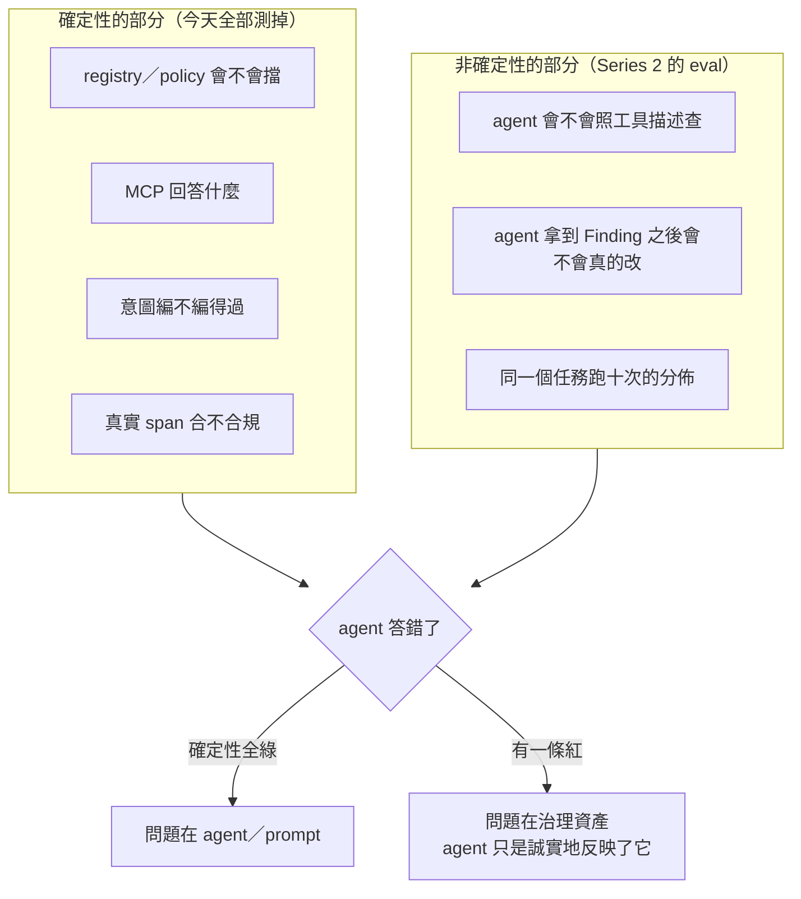

# Day12：可測試性——不用 LLM，也能驗證治理資產還有效

前面十天做出了一堆東西：四條 Rego policy、一道 CI gate、一份分層 registry、一個 MCP server、一組 template、一支意圖編譯器。這些全部是**程式碼**，而它們共同的問題是：**沒有任何東西在測它們。**

這件事在治理上比在一般開發上更危險，理由是這系列反覆撞到的那個家族的問題。回想一下清單：`-r .` 讀到 0 個 group 還給綠燈（Day5）、policy 只比對名字前綴（Day5）、`--diagnostic-stdout` 不加就沒有 annotation（Day7）、`--advice-policies` 是覆蓋不是疊加（Day7）、`diff` 對型別改變完全靜音（Day9）、`browse_namespace` 不標 deprecated（Day10）、我自己的 checklist 漏掉 `shippingStatus`（Day13 會講）。

**這七件事的共同點是：壞掉的時候，症狀是「一切看起來很順利」。** 一份壞掉的 policy 不會報錯，它會給你綠燈。所以「跑一次看看有沒有過」這種驗證方式，對治理資產是無效的——**你要驗證的不是它會不會通過，是它還會不會擋。**

而接上 agent 之後這件事又多一層。今天要處理的第二個問題是：**當 agent 表現不好的時候，你怎麼知道是 agent 的問題，還是你餵給它的東西本來就是錯的？**

程式碼在範例 repo [`OTel_AIOps_Agent`](https://github.com/tedmax100/OTel_AIOps_Agent) 的 [`testability/`](https://github.com/tedmax100/OTel_AIOps_Agent/tree/main/testability)（一支 `regress.sh`，21 條斷言，跑完不到十秒、一次 LLM 呼叫都沒有）。

## 四個做法，一個原則

今天的內容不是新工具，是把前面十天散落的四個做法收斂成方法論。它們共用一個原則：**確定性的部分要先被測到滿，才有辦法歸因非確定性的部分。**



右邊那個分岔就是今天真正的產出。**沒有左邊那組斷言，「agent 表現不好」這句話沒有辦法被歸因**——你會花一整天調 prompt，而真正的原因是 registry 裡有兩個矛盾的定義。

### 做法一：不接 LLM，也要能驗證 agent 拿到什麼

Day10 那個 MCP server 是走 **stdio 上的 JSON-RPC**，所以完全不需要 LLM 就能驅動它：`day15/mcp_probe.py` 就是一支六十行的 python，spawn 一個 `weaver registry mcp`、送 `initialize`、送 `tools/list`、再送你指定的 `tools/call`，把回應原封不動印出來。

這件事的價值不在方便，在**歸因**：如果你只能透過對話測 MCP，那「agent 講錯」跟「registry 教錯」永遠分不開。Day10 那四個坑全部是靠這支腳本挖出來的——`search` 是關鍵字 AND 不是語意搜尋、`browse_namespace` 不標 deprecated、`not found` 回 `isError: false`、分層 registry 預設是空的——**一次 LLM 呼叫都沒有用到**。

而其中最後一個坑特別能說明問題：分層 registry 沒帶 `--include-unreferenced true` 時，`browse_namespace` 回報 0 個 attribute、`get_attribute` 回報「不存在」。如果只用對話測，你看到的現象是「agent 說找不到那個欄位」——**這個現象跟「agent 幻覺」長得一模一樣**，而真相是工具真的回答了「不存在」。

所以這條斷言長這樣，而它是整組測試裡我最想留的一條：

```bash
run_case 0 "MCP 對分層 registry 答得出東西（total_attribute_count > 0）" \
  "$PY day15/mcp_probe.py day13/team '[{\"name\":\"browse_namespace\",\"arguments\":{}}]' \
     --include-unreferenced true | grep -qE 'total_attribute_count[^0-9]+[1-9]'"
```

### 做法二：樣本要從真實輸出抽，不能手打

這一條是我自己被抓到的，所以印象最深。

Day10 要示範「agent 照 Finding 修好 instrumentation」的閉環，我寫了 before／after 兩份程式碼，然後**手打**了一份 live-check 樣本清單去驗證。after 那份的結果很漂亮：只剩 `not_stable`，violation 歸零。

後來把它改成從真實送出的 span 抽樣本——`run_and_extract.py` 設一個 `InMemorySpanExporter`、真的呼叫 `charge()`、把 exporter 收到的 span 轉成樣本，**這支腳本不知道 handler 裡寫了哪些欄位名**。結果：

```
$ python3 day15/run_and_extract.py after --samples \
    | weaver registry live-check -r day14/base-v2 --input-source stdin
    ...
    Span event payment.retried
        retry.count = 2
            - [violation] Attribute 'retry.count' does not exist in the registry.
$ echo $?
1
```

**還是 exit 1，而原因是一個我自己剛加進去的欄位。** 我手打的那份清單裡沒有 `retry.count`，因為我打的是**我腦子裡那份改動**，不是程式碼真的送出的東西——那行 `add_event` 把一個欄位從 attribute 搬到 span event 上、名字也順手改了，而我在驗證的時候完全忘了它的存在。

一般化之後這條教訓很硬：**手打的樣本永遠只涵蓋你記得的那部分，而你會忘記的正是你剛剛動過的地方。** 而「把欄位搬到別的地方」在 registry 眼裡不是搬移，是新增——所以每一個「重構一下遙測結構」的 PR 都是這個坑的候選人。

### 做法三：每一條規則都要有一個「本來就該紅」的 fixture

一條從來沒有紅過的規則，等於一條沒有被測試過的規則。所以前面每一天都留了一份故意壞掉的東西，而它們現在全部是測試資料：

| fixture | 故意壞在哪 | 該擋住的是 |
|---|---|---|
| `day17/services/shipping-v0` | camelCase、缺 stability、inline 定義、沒有意圖 | 命名／分層 policy、checklist |
| `day14/breaking` | 一個規格有、weaver 不收的欄位 | 第一層 hard error |
| `day14/future` | 缺 stability／examples、字串式 deprecated | 第二層 `--future` |
| `day14/base-v3` | 型別 `int` → `string` | 第三層（`diff` 對此靜音） |
| `day14/base-v4` | enum 少一個 member | 第三層（`diff` 也靜音） |
| `day14/team-on-v2` | 下游還在 ref 被改名的欄位 | `deprecated_usage.rego` |
| `day16/intent/steady-state-broken.yaml` | 指到不存在的維度 | 意圖編譯器 |
| `day16/intent/steady-state-broken2.yaml` | enum 值大小寫不符 | 意圖編譯器 |

最後兩個特別值得說，因為它們不是我編的壞例子，是**我自己的 agent 實際犯過的兩種錯**：`payment.status` 是那種「這個欄位應該叫這個名字」的合理猜測，`AUTHORIZED` 大寫則是真實 RCA 任務上的坑——agent 用 `level="ERROR"` 去撈 Loki，資料裡全是 `INFO`，於是它得到零筆結果然後往「系統正常」推理下去。

**把 agent 犯過的錯變成 fixture，是這整套方法裡投資報酬率最高的一件事**，因為它讓同一個坑第二次出現時是紅燈，而不是一次新的除錯。

### 做法四：先量一個基準，數字掉下來才有東西可比

`stats` 的 group 數、live-check 的 advice 條數與 coverage、MCP 的 `total_attribute_count`——這些數字單獨看都沒什麼意義，但它們是唯一能發現「安靜失效」的方式。Day7 那道 CI 探針（`groups > 0`）就是最小版本。

原則：**任何自動化檢查都該有一個「我確實檢查了 N 個東西」的斷言**，而不是只看它有沒有報錯。

## 把四個做法變成一支腳本

`testability/regress.sh` 是表格驅動的：每一行是「預期離開碼 + 說明 + 指令」。跑一次：

```
$ ./testability/regress.sh
治理資產回歸測試（無 LLM）

── 規範本身：定義層的規則還擋得住嗎（Day5-6）
  ✔ 命名 policy 抓到 camelCase／缺 namespace                 exit=1
  ✔ 命名 policy 對乾淨的 registry 放行                       exit=0
  ✔ 分層 policy 抓到 signal group 裡 inline 定義的 attribute  exit=1

── 三層驗證模型：每一層都還在它該在的位置（Day9）
  ✔ 第一層 hard error：metric_requirement_level 進不去        exit=1
  ✔ 第二層預設不擋（三個 ⚠、exit 0）                          exit=0
  ✔ 第二層加 --future 就擋                                    exit=1
  ✔ 第三層：attribute 直接消失（v1→v2）                       exit=1
  ✔ 第三層：型別 int→string（diff 靜音的那一格）              exit=1
  ✔ 第三層：enum member 被拿掉（diff 也靜音）                 exit=1
  ✔ 下游還在用 deprecated 欄位                                exit=1

── 消費端：agent 查得到、意圖編得過（Day10-11）
  ✔ MCP 對分層 registry 答得出東西（total_attribute_count > 0） exit=0
  ✔ 生成物產得出來（含繼承的定義）                            exit=0
  ✔ 穩定狀態意圖編得過                                        exit=0
  ✔ 變更意圖編得過                                            exit=0
  ✔ 意圖指到不存在的維度 → 擋                                 exit=1
  ✔ 意圖用了 enum 裡沒有的值（大小寫）→ 擋                    exit=1

── 真實遙測：程式碼實際送出的東西（Day10）
  ✔ before 的四個欄位有 violation                             exit=1
  ✔ after 仍有 violation：retry.count 是新增，不是搬移         exit=1
  ✔ 把 retry.count 定義出來之後才乾淨                          exit=0

── checklist 自己（Day13）
  ✔ 照抄一半的服務要被擋                                      exit=1
  ✔ 補完的服務要放行                                          exit=0

✔ 21/21 全部符合預期
```

**21 條裡有 12 條的預期離開碼是 1。** 這個比例是刻意的，也是今天最重要的一個設計決定：**這組測試主要在測「它還會不會擋」，不是「它會不會通過」。** 一組全部預期 exit 0 的測試，在治理資產上幾乎沒有價值——因為所有「安靜失效」的壞法都會讓它繼續全綠。

跑完不到十秒，不需要 cluster、不需要 API key、不需要網路。**這件事本身就是一個設計約束**：一份需要環境才能跑的測試，會變成一份沒有人在本機跑的測試。

## 平台工程：治理資產的擁有者，要能證明它還有效

**誰維護這組測試。** 跟 policy 同一批人——它們是同一份資產的兩面。這也帶出一個實際的工作習慣：**新增一條規則的時候，順手在對應的 fixture 裡種一個違規**。Day13 那個 `shipping-v0` 就是這樣長出來的，而它已經抓到過一次真的（我的 enum 檢查漏掉 `shippingStatus`）。

**為什麼這件事對平台團隊比對產品團隊重要。** 產品團隊的程式碼壞掉，他們自己會知道（服務掛了、測試紅了）。**平台團隊的 policy 壞掉，沒有人會知道**——所有人的 CI 都變綠，大家會覺得治理做得很好。一道靜靜失效的 gate 比沒有 gate 更糟，因為它讓所有人以為有人在看。

**這組測試也是一份可以拿出去講的東西。** 當有人問「你們的治理有沒有在運作」，答案不該是「我們有 CI」，而是「這 21 條斷言每天在跑，其中 12 條是在確認規則還擋得住」。**前者描述你裝了什麼，後者描述它現在還有效。**

**沒有做成 gate。** 這組測試自己不該進 merge gate 擋別人的 PR——它該在治理資產自己的 repo 裡跑（改 policy、改範本、升級 weaver 的時候）。這跟 Day9 那個「平台團隊要先讓自己被同一套規則擋住」是同一件事。

## 回到 AIOps：這是 eval harness 的前身

今天這 21 條斷言全部是確定性的：同樣的輸入永遠同樣的離開碼。而 agent 不是這樣——同一個問題問十次，可能有八次照著工具描述查、兩次把整句自然語言丟進 `search` 然後得到零筆。**所以 agent 的品質不能用「跑一次看看」來驗證，只能用分佈來描述。**

那正是後面 eval harness 要做的事，而今天這組測試是它的前提。三個具體的銜接點：

**一、fixture 可以直接升級成 eval case。** 那份「意圖指到不存在的維度」的 YAML，現在測的是編譯器會不會擋；同一份東西可以拿去問 agent「這份意圖對不對」，測的就變成 agent 會不會發現。**輸入完全一樣，被測的對象換了。**

**二、意圖檔案是現成的 ground truth。** Day11 那份意圖已經把「什麼情況該告警、嚴重度多少」寫成機器可讀的判準了。這代表 eval 不需要人工標註「這次算不算 incident」——**意圖已經回答了**。這條線會在 Series 2 講校準的時候變成主題。

**三、確定性的斷言是歸因的前提。** 前面那張圖的右半邊：agent 答錯的時候，先看這 21 條。全綠，問題在 agent；有一條紅，agent 只是誠實地反映了你餵給它的東西是錯的。**我自己在 RCA 任務上拿到 2/9 分的那一次，事後回頭看，有一部分根本不是 agent 的問題**——它查不到資料是因為它照著一份跟真實資料不一致的 schema 在查（Day7 那個「空結果跟沒有問題長得一模一樣」）。如果當時有這組斷言，那一天會少浪費很多時間。

## 今天沒做的事

沒有跑任何 LLM，也沒有量任何分佈。今天證明的是「工具會給出正確答案」，完全沒有證明「agent 真的會去用它、而且照著用」。Day10 那條「一次只查一兩個關鍵字」的指令，實際上有多少比例的對話會照做？這需要跑很多次、看分佈，而那是 eval harness 的工作。**在有那份數字之前，所有結論的正確說法都是「這讓對的事情變得可能」，不是「這樣就不會出錯了」。**

沒有把這支腳本接進 CI。它現在是手動跑的。要進 CI 得先決定一件事：weaver 版本要不要釘死在腳本裡（釘死的話，升級 weaver 就必須改這支腳本；不釘死，某天上游改行為會讓它整組變紅）——而這正是 Day9 那個「跨版本矩陣」該負責的事，兩者要一起設計。

沒有測 template 生成物的內容，只測了「產得出來」。Day11 講過生成物的 diff 能補上 `diff` 的靜音區，那件事該有一條斷言（例如「`ATTRIBUTE_TYPES` 裡 `payment.retry_count` 必須是 `int`」），但那需要先決定生成物要不要 commit 進版控——我認為要，理由 Day11 說過，只是這組測試還沒跟上這個決定。

明天：第一階段的最後一天，把這十二天的結論壓成一份新服務上線 checklist——會自己跑的那種，十三項檢查、每一項都真的執行一次工具。而今天這組斷言會在那裡多一個用途：**checklist 自己也是需要被測試的程式碼。**
