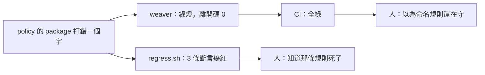
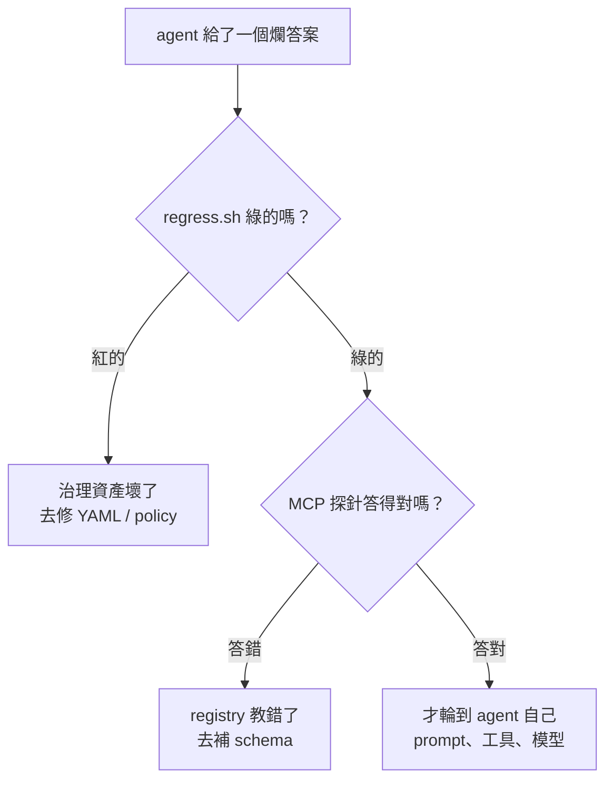

# Day12：不用 LLM，也能驗證治理資產還在擋人

> 你要驗證的不是它會不會通過
> 是它還會不會擋

前面做出了一堆會擋人的東西：三條命名規則、一道 CI gate、live-check、分層的衝突檢查、breaking change 的比對規則、意圖編譯器。每一個都在寫出來的當天證明過自己有效。

但沒有任何一個東西，會在它**停止有效**的時候告訴我。

這不是假設。前面那個 policy 的 package 打錯名字的坑就是這個形狀：`.rego` 檔還在、CI 還在跑、輸出還是綠燈，只是那條規則從來沒有被執行過。今天要做的事，就是讓這種情況不可能安靜地發生。

程式碼在範例 repo [`OTel_AIOps_Agent`](https://github.com/tedmax100/OTel_AIOps_Agent) 的 [`ironman-2026/day12/`](https://github.com/tedmax100/OTel_AIOps_Agent/tree/main/ironman-2026/day12)，主角是一支 [`regress.sh`](https://github.com/tedmax100/OTel_AIOps_Agent/blob/main/ironman-2026/day12/regress.sh)。指令一律假設從 repo 根目錄跑。

## 先把前面壞掉的方式列出來

寫測試之前得先知道要防什麼。我把前面每一天真的踩到的坑攤開來排，結果它們的形狀高度一致：

| 哪個環節 | 出了什麼事 | 當下看到的畫面 |
| --- | --- | --- |
| registry 基礎 | `-r .` 路徑寫錯，讀到 0 個 group | `✔ No policy violation`，離開碼 0 |
| cardinality policy | cardinality 規則只比對 `biz.` 前綴 | 綠燈，換個名字就繞過去了 |
| 命名 policy | policy 的 package 名字打錯 | 綠燈，連 coverage 報告都空的 |
| CI gate | 診斷預設走 stderr | CI 是紅的，但 PR 上一條 annotation 都沒有 |
| CI gate | resolver 錯誤配 GitHub 格式 | 一個空的 `::group::`，紅得莫名其妙 |
| live-check | live-check 不管 `required` 有沒有送 | 綠燈 |
| 分層 registry | 重複定義變成沒人引用的孤兒 | 綠燈 |
| 分層 registry | `before_resolution` 的違規 | 摘要行印綠色勾勾，離開碼 1 |
| breaking change | `diff` 對型別／值域／語意改變 | 什麼都不印，離開碼 0 |
| MCP | 分層 registry 查不到 base 的屬性 | 一句 `not found`，`isError` 是 false |

十條裡有七條的症狀是**綠燈**。這就導出今天整篇的那句話：

**你要驗證的不是「它會不會通過」，是「它還會不會擋」。**

一般的測試直覺是「跑一遍，沒壞就好」。但這一整排東西壞掉的時候，跑一遍正好就是沒壞的樣子。所以斷言要反過來寫：拿一份**本來就該被擋下來**的東西餵給它，如果它放行了，那才是失敗。

## 四個做法

### 一、每條規則都要有一個「本來就該紅」的靶子

這是最重要的一條。那份命名漂移的 registry、`base-v1` 對 `base-v2`、那份 `steady-state-broken.yaml`，這些檔案我當初都是為了寫文章才留著的，現在它們的正式身分是 fixture。

```bash
expect_exit 1 "day06 命名漂移擋得住" \
  weaver registry check -r ironman-2026/day06/registry -p ironman-2026/day07/policies

expect_exit 1 "day11 意圖裡的大小寫錯誤擋得住" \
  python3 ironman-2026/day11/compile_intent.py ironman-2026/day11/intent/steady-state-broken.yaml
```

> 我現在接任何新的檢查機制，第一件事都是先讓它失敗一次給我看。這個習慣是被 `-r .` 那次教會的，那次我對著一個綠燈滿意了大概二十分鐘。

### 二、先量一個基準

前面那個 `stats` 探針的正式版本。每份 registry 在被檢查之前，先確認它真的被讀進來了：

```bash
expect_groups ironman-2026/day08/team-orders   "day08 team-orders（含分層）"
```

底層就是 `weaver registry stats` 撈出 group 數，小於 1 就直接判失敗。這條斷言便宜到幾乎沒有成本，但它擋掉的是「整套檢查其實什麼都沒在檢查」這種最難發現的狀況。

### 三、不接 LLM 也要能驗證

前面那支 `mcp_probe.py` 在這裡變成一條斷言。MCP（Model Context Protocol）server 是 stdio 上的 JSON-RPC，打它不需要模型：

```bash
expect_output "not found in registry" "MCP 對分層 registry 查不到 base 的屬性" \
  python3 ironman-2026/day12/mcp_layered_probe.py
```

這條的意義在**歸因**。哪天 agent 給了一個爛答案，我可以先跑這支腳本：如果它綠的，那 registry 這一側是好的，問題在 agent；如果它紅的，那不用去調 prompt，先去修 YAML。**把「要靠 LLM 才能觀察」的東西變成「不用 LLM 就能斷言」的東西，是這個系列到目前為止投報率最高的一個習慣。**

### 四、連「已知的缺口」也寫成斷言

這條是這次才想清楚的。`registry diff` 對三種變更靜音、live-check 對被移除的 enum 值只給 `information`、MCP 在分層下查不到 base 的屬性，這些今天都是既定行為。我把它們也寫進腳本，斷言的內容是「它現在就是不會擋」：

```bash
echo "== 已知的缺口：這些現在就是不會擋，寫下來才不會誤以為有人在守"
expect_exit 0 "registry diff 對型別／值域／語意改變靜音" \
  weaver registry diff -r ironman-2026/day09/base-v2 --baseline-registry ironman-2026/day09/base-v1
```

這樣做有兩個好處。一是這份清單變成一個看得到的東西，不會有人半年後接手時以為那裡有防護。二是**上游哪天修好了，這幾條會變紅**，而那個紅燈的意思是好消息：可以把自己補的那層拆掉了。

一個會因為「事情變好了」而失敗的測試聽起來很怪，但它記錄的是一個當下的事實，而事實會變。與其讓它默默過期，不如讓它出聲。

## 跑起來長什麼樣

```console
$ bash ironman-2026/day12/regress.sh

== 探針：這些檢查真的讀得到東西
  ✓ day06 drift registry                     2 groups
  ✓ day08 team-orders（含分層）              3 groups
  ...

== 該紅的還會紅嗎（這一段才是重點）
  ✓ day06 命名漂移擋得住                     exit=1
  ✓ day08 同名兩份定義擋得住                 exit=1
  ✓ day08 孤兒在 include-unreferenced 下現形  exit=1
  ✓ day09 三種靜音變更被 policy 抓到          exit=1
  ✓ day09 --future 把警告變成錯誤             exit=1
  ✓ day11 意圖裡的大小寫錯誤擋得住            exit=1
  ✓ day07 live-check 抓得到型別對不上         exit=1
  ✓ day07 live-check 抓得到還在送的舊欄位     exit=1

== 訊息本身也要能讓人自己修好
  ✓ day06 講得出是哪一條規則        找到「duplicate_concept」
  ✓ day08 講得出跟誰衝突            找到「registry.acme.biz」
  ✓ day11 講得出合法值有哪些        找到「合法的是：authorized, declined, g」
  ✓ day07 產得出 GitHub annotation       找到「::error file=」

...

────────────────────────────────────────────────────────────
29 條斷言：29 通過，0 失敗
其中預期離開碼非 0 的有 8 條，預期 0 的有 10 條
```

29 條斷言，跑一次 36 秒，零次 LLM 呼叫。那 36 秒裡有大半是分層的那幾份 registry 要去解析官方 semconv，純本地的那些是毫秒級的。

那段「訊息本身也要能讓人自己修好」是我後來才加的。前面講過，一道 gate 說不清楚，維護成本會隨團隊數線性成長。既然這件事這麼重要，那它就該被測試，而不是靠我每次改 policy 的時候記得順手看一眼輸出。**「錯誤訊息夠不夠好」是一個可以被斷言的東西，只要你願意把那個關鍵字寫進測試裡。**

## 這支腳本自己會不會壞

一條永遠不會失敗的斷言等於沒有斷言。所以最後我做了一次自我驗證，把那個 package 名字打錯的坑原樣重現：

```console
$ sed -i 's/^package after_resolution/package mypolicy/' ironman-2026/day07/policies/naming.rego
$ bash ironman-2026/day12/regress.sh

  ✗ day06 命名漂移擋得住                  exit=0（預期 1）
  ✗ day06 講得出是哪一條規則              沒找到「duplicate_concept」
  ✗ day07 產得出 GitHub annotation             沒找到「::error file=」

29 條斷言：26 通過，3 失敗
```

registry 一個字都沒改，policy 檔也還在原地，只是 package 名字錯了，於是那條規則靜悄悄地不執行。**三條斷言同時倒下，而在沒有這支腳本的世界裡，這件事的表現形式是「CI 全綠」。**

改回來就恢復 29/29。



## 這支腳本該由誰維護

從平台工程的角度，今天做的東西有個容易被忽略的性質：**它是平台團隊自己的測試，不是給產品團隊的 gate。**

產品團隊不需要知道它存在。它保護的是平台團隊自己的資產，回答的是「我提供的這些檢查，今天還有效嗎」。這跟前面幾天做的東西方向相反，前面都是平台團隊對其他人設的門，這一天是平台團隊對自己設的門。

**這也是治理能不能規模化的一個隱形前提。** 一個團隊如果沒辦法證明自己的檢查還有效，那它遲早會不敢改那些檢查，因為每次改動都是在賭。不敢改的規則會慢慢跟現實脫節，然後某一天有人發現它擋掉了不該擋的東西，於是整套被繞過。

從成本上看，這支腳本一百五十六行 bash，維護成本是「每加一條新規則，順手加一條該紅的斷言」。而它換到的是**改治理資產這件事變得沒有那麼可怕**。

## 回到 AIOps：這是 eval 的前身

最後接回主軸，這一天跟 agent 的關係比看起來近。

Day1 那份 bench 做的事，本質上跟今天這支腳本一模一樣：**準備一組已知答案的輸入，跑一遍，斷言結果符合預期。** 差別只在 Day1 的受測物是一隻 LLM agent，所以斷言必須寫成容差跟形狀（`tol: 0.15`、`contains`、`grounded`），而今天的受測物是一堆確定性的工具，所以斷言可以寫成離開碼跟字串比對。

兩者放在一起，才拼得出「agent 表現不好」這句話的完整拆解：



沒有前兩層，第三層的每一次調整都是在猜。而我在 Day1 花了很多時間調 prompt，現在回頭看，那時候真正該做的是先確認那套 stack 送出來的資料跟我 prompt 裡寫的是不是同一件事。

這條分流也解釋了為什麼這個系列要把治理放在 agent 前面。**不是因為治理比較重要，是因為治理是唯一一層可以被確定性地驗證的東西**，而所有不確定的東西都應該站在確定的東西上面。

## 今天沒做的事

沒有把 `regress.sh` 接進 CI。它現在是我手動跑的，而一個要靠人記得跑的回歸測試，跟今天整篇在講的問題是同一個。接進去不難，難的是決定它該多久跑一次，以及「已知的缺口」那幾條變紅的時候該通知誰。

斷言的粒度還很粗。目前大部分只驗離開碼，只有四條驗到訊息內容。理想上每一條 policy 都該驗「它抓到的是不是我以為的那一條」，而不只是「有東西被抓到」。

沒有處理效能。36 秒裡大部分花在解析官方 semconv 上，雖然有快取，但每次都要重新跑一遍解析。真的進 CI 的話這個數字要再看。

也沒有測那道 CI gate 的 workflow 本身。CI gate 的 YAML 現在只有被人眼看過，沒有任何東西驗證它改壞了會怎樣。要測它得起一個 act 之類的本地 runner，那是另一個題目。

## 小結

總結來說，今天沒有做出任何新的治理能力，只是把前面做的東西各戳了一下，確認它們還醒著。比較有價值的是那份「壞掉的方式」清單，十條裡有七條的症狀是綠燈，這個比例高到我自己整理的時候都愣了一下。**一個系統如果它的失敗模式大多是靜默的，那麼「沒有壞消息」就完全不是好消息**，而這其實正是整個可觀測性領域一直在講的那件事，只是這次發生在治理工具自己身上。

而有了這支腳本之後，最實際的改變是我終於敢動那些 policy 了。以前改一條 Rego 要來回手動驗半天，現在改完跑一次三十六秒，紅了就知道自己弄壞了哪一條。

> 29 條斷言裡，有 8 條的預期離開碼是 1。
> 一份專門在等紅燈的測試，寫起來有點違反直覺，但那才是這些東西的工作 :)
>
> 明天做這個階段的收尾。
