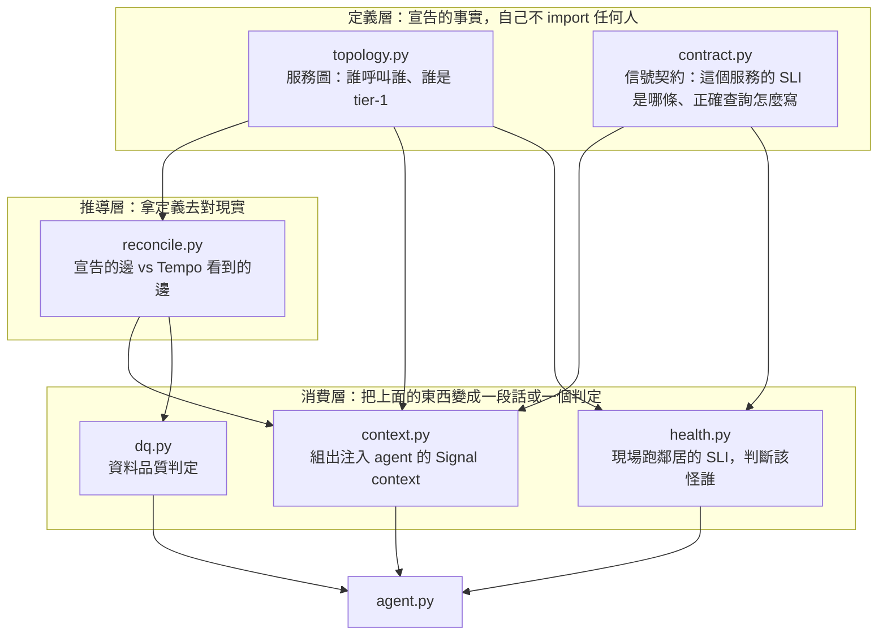
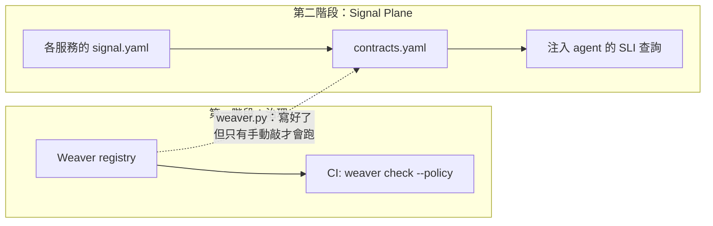

# Day13：讀現況，Signal Plane 到底做到哪一步了

> 設計稿寫的是當初打算做成什麼樣
> 程式碼寫的是後來真的做成什麼樣
> 中間那段沒有人會回頭補

昨天那份上線 checklist 在 `shipping-v0` 上跑出 7/13，而第一階段就停在那裡。前面十二天做的所有事情，回答的是同一個問題：這份資料值不值得相信。從今天開始換一個問題，這份資料能不能被推理。

這兩件事的差別，用第一天那隻 agent 來講最清楚。就算它現在查得到 `app.outcome` 只有三個值、查得到那條 metric 的正確 PromQL，它拿到「order-service 的錯誤率是 3%」之後，還是不知道 order-service 在整個系統裡是什麼位置、它掛掉會影響誰、以及這 3% 到底該怪它自己還是怪它下游的 payment-service。那些東西不在遙測資料裡，在架構圖裡、在值班手冊裡、在資深工程師的腦子裡。

而我手上其實已經有一個寫到一半的東西在處理這件事。agent 服務底下有一個叫 `signals` 的模組，寫的時候是照著一份設計稿走的，但那是好幾個月前的事了。所以第二階段的第一天不做新東西，先搞清楚它現在真正長什麼樣。

程式碼在範例 repo [`OTel_AIOps_Agent`](https://github.com/tedmax100/OTel_AIOps_Agent) 的 [`ironman-2026/day13/`](https://github.com/tedmax100/OTel_AIOps_Agent/tree/main/ironman-2026/day13)，只有一支 `importgraph.py`。今天被讀的那個模組是 agent 服務自己的原始碼，不在範例 repo 裡，重現步驟寫在那個資料夾的 `README.md`。

## 設計文件會過期，import 關係不會

要知道一個模組現在長什麼樣，最沒用的做法是去讀它的設計稿。設計稿寫的是當初打算做成什麼樣，中間砍掉的、順手加的、做到一半放著的，它一個字都不會更新。

所以我寫了一支很短的工具去讀 AST（Abstract Syntax Tree，程式碼被解析之後的語法樹），把 package 內部真實的 import 關係印出來。用 AST 而不是 `grep`，是因為 `grep "^from"` 只抓得到檔案開頭那幾行，而**一個藏在函式內部、或藏在 `if __name__ == "__main__"` 底下的 `import`，一樣是一條真的依賴邊**。今天最重要的那個發現，剛好就藏在這種邊裡面。

```python
for node in ast.walk(tree):
    if not isinstance(node, ast.ImportFrom) or node.level == 0:
        continue
    head = (node.module or "").split(".")[0]
    if node.level == 1 and head in siblings:
        found.add(head)
```

`ast.walk` 會走完整棵樹，不管那個 `import` 縮排幾層。`node.level == 1` 是「同一層的兄弟模組」（`from .topology import ...`），`level == 2` 就指到 package 外面去了，今天不看。

## 八個模組，真正的形狀

```console
$ python3 ironman-2026/day13/importgraph.py aiops-agent/service/app/signals
# aiops-agent/service/app/signals  (8 modules)

module     imports                             imported by
---------------------------------------------------------------------
compile    contract, topology                  —
context    contract, reconcile, topology       —
contract   —                                   compile, context, health, weaver
dq         reconcile                           —
health     contract, topology                  —
reconcile  topology                            context, dq
topology   —                                   compile, context, health, reconcile
weaver     contract                            —

nothing in this package imports: compile, context, dq, health, weaver
  compile    runnable as a CLI: yes
  context    runnable as a CLI: NO
  dq         runnable as a CLI: NO
  health     runnable as a CLI: NO
  weaver     runnable as a CLI: yes
```

（這張表是那支腳本從 AST 直接數出來的，不是我照著檔案開頭抄的。八個模組加起來 1346 行，`wc -l` 數得出來。）

看第二欄跟第三欄的分佈，這八個模組其實是三層：



`topology.py` 跟 `contract.py` 是底，它們誰都不 import，卻被四個模組 import。這其實就是第一階段那個 registry 的形狀在另一個維度上重演一次：**先有一份被宣告下來、大家都指向它的事實，其他東西才有辦法互相對照。** 差別在於 registry 宣告的是「這個欄位叫什麼」，`topology.yaml` 宣告的是「這個服務在哪裡」。

那個 `nothing in this package imports` 的清單有五個，但它們不是同一回事。`context`、`health`、`dq` 是被 package 外面的 `agent.py` 呼叫的，也就是 agent 每跑一次 RCA（Root Cause Analysis，根因分析）就會經過的路；`compile` 跟 `weaver` 這兩個是自己有 `__main__` 的命令列工具，只在有人手動敲的時候才會動。後面那兩個等一下會各出一次事。

## 那兩份定義檔不是手寫的，是編出來的

`topology.yaml` 現在長這樣：五個節點、六條邊、一條叫 `checkout` 的使用者旅程，另外五份服務契約。但這兩份檔案沒有任何一個人在維護：

```console
$ uv run python -c "
from app.signals.compile import load_fragments, compile_signals
f = load_fragments(); t, c = compile_signals(f)
print('fragments:', len(f))
print('nodes:', len(t.nodes), 'edges:', len(t.edges), 'journeys:', list(t.journeys))
print('contracts:', len(c.contracts))
"
fragments: 5
nodes: 5 edges: 6 journeys: ['checkout']
contracts: 5
```

五份 fragment 編出五個節點。來源是每個服務自己 repo 裡的 `signal.yaml`：

```console
$ ls demo-services/services/*/signal.yaml
demo-services/services/api-gateway/signal.yaml
demo-services/services/order/signal.yaml
demo-services/services/payment/signal.yaml
demo-services/services/user/signal.yaml
demo-services/services/webapp/signal.yaml
```

這個設計是照 ARE（Agentic Reliability Engineering，代理式可靠性工程）那本書的立場來的：一個服務有多重要、屬於哪條使用者旅程、它的 SLI（Service Level Indicator，服務水準指標）是哪一條，這些是那個服務的團隊才知道的事，不該是某個中央 wiki 頁面上的一列。所以每個服務自己宣告，`compile.py` 只負責把五份合成兩份。

從平台工程的角度，這裡有個決定值得講清楚：**跨服務的那張圖是「每個服務各自宣告自己打出去的邊」聯集起來的，沒有任何一條邊是中央維護的。** 這樣一來，新加一個服務不需要去改一份公用檔案，也不會有兩個團隊同時改同一行的問題。而 `checkout` 那條旅程的順序，是從邊的集合拓撲排序推出來的，不是有人手排的。

跟第一階段的 registry 對照，這是同一個模式的第二次出現：分散貢獻、集中編譯、產物進版控。前面講 codegen 的時候得出過「生成物要 commit 進版控，因為 diff 才是那個會說話的東西」，這兩份編譯出來的 YAML 同理。

> 這裡有個成本要老實記：多一層編譯，就多一個「來源改了但沒有人重編」的機會。現在沒有任何東西在擋這件事，靠的是我記得。這跟前面那個「policy 檔還在但規則沒被執行」是同一個形狀的坑，只是換了個位置。

## 注入給 agent 的那段話長什麼樣

`context.py` 是純函式，不打任何網路，所以不用起 stack 就跑得出來：

```console
$ uv run python -c "from app.signals.context import build_signal_context; \
    print(build_signal_context(['order-service']))"

## Signal context (topology v1.0.0)
### order-service
- criticality: tier-1 (revenue/edge-critical); journey: checkout (3/4)
- upstream (callers — degrade if this fails): api-gateway
- downstream (dependencies — could be blocking this): payment-service, user-service
- SLI (authoritative — cite these exact queries, don't re-derive):
    error: (sum(rate(orders_total{status="error"}[5m])) or vector(0))
           / clamp_min(sum(rate(orders_total[5m])) or vector(0), 1) [ratio]  target: error_rate < 1%
    latency: histogram_quantile(0.95, sum by (le) (rate(order_create_duration_seconds_bucket[5m]))) [s]
- Logs (authoritative — use THIS selector & event values):
    stream selector: {service_name="order-service"}
    failure events: order.cancelled
    note: order.cancelled carries reason=auth_failed|payment_declined|unknown_product.
          Selector key is service_name (NOT service). No event="order_failed"/"error" exists.
- caveat: status=cancelled is a business outcome, not a service error — exclude it from
  the error SLI; check `reason` to see if a downstream dep is the cause.
```

（這段是原樣貼的，只做了兩件事：把太長的查詢折行，以及刪掉 throughput 那條 SLI 跟開頭那段講給模型聽的說明，不然版面會爆掉。完整輸出照那個資料夾 `README.md` 裡的指令跑得出來。）

把這段跟第一天那份失敗紀錄擺在一起看，前兩缺剛好各被補到一塊。

`缺語意`那一塊，看倒數第三行那句 `Selector key is service_name (NOT service)`。第一天那隻 agent 就是死在這種地方，它猜 `WARN` 是大寫，60 筆 log 變成 0 筆。這裡不只把 selector 的 key 寫死了，連「有哪些 event 值」跟「沒有 `event="error"` 這種東西」都寫進去了。第一階段在 registry 裡做的 `enum` 值域，在這裡變成了一句直接餵給模型的話。

`缺情境`那一塊是 `upstream` 跟 `downstream` 那兩行。這是第一階段完全沒有碰過的東西，registry 再完整也不會告訴你 order-service 的下游是 payment-service。而最後那句 caveat 更直接，它等於預先告訴 agent「你等一下會看到一堆 cancelled，那不是故障」。

> 我以前覺得這種東西寫在 prompt 裡就好，反正都是給模型看的字串。後來發現差別很大：寫在 prompt 裡的是一份對所有服務都一樣的通則，寫在契約裡的是「這個服務的這條 SLI」，而且它可以被程式檢查、可以在服務改版的時候一起改。第一天那段害慘我的 schema 散文，就是前者。

不過這裡也有個不太舒服的細節。那段 SLI 的 PromQL 是寫死在契約裡的，包括 `clamp_min` 那個防除零、包括 histogram 要用 `_bucket` 加 `sum by (le)`。會寫死是因為讓模型每次自己推導，它就會每次都踩同一批坑。**這等於承認一件事：在「讓 agent 自己算對」跟「把算好的答案交給它」之間，我選了後者。** 它換到的是穩定，付出的是那條查詢從此得有人維護。

## 第三缺目前是空的

第一天那三缺裡的第三個是`缺信任度`，也就是「agent 講出來的東西有沒有辦法驗證」。這一塊在 `signals` 模組裡有對應的東西，叫 `dq.py`，DQ 是 Data Quality。它的想法是：宣告出來的那張圖如果跟真實流量對不上，那 agent 拿著它做的判斷就不該被信任。

現在跑起來是這樣：

```console
$ uv run python -c "from app.signals.dq import dq_verdict; print(dq_verdict())"
{'proven_good': False, 'score': None, 'note': 'topology not reconciled against live traces; DQ unproven'}
```

`proven_good` 是 `False`。不是因為圖畫錯了，是因為**從來沒有人跑過那個對帳**，所以它沒有任何證據可以說圖是對的。這個預設值是刻意的：沒有證據就不算通過，可信度要用跑出來的結果換，不是預設就有。

這件事對值班的人為什麼重要，可以想像凌晨三點那個場景。agent 跟你說「order-service 的錯誤是 payment-service 造成的，建議先看 payment」，你要不要照做，取決於那張「order 呼叫 payment」的圖是不是還準。而服務拓撲是整個系統裡最容易悄悄過期的東西之一，某個團隊上週把呼叫改成走訊息佇列了，圖上那條邊還在。**一張過期的圖不會讓 agent 說不出話，只會讓它非常有自信地把你指向錯的地方。**

所以那個 `proven_good: False` 現在的意義是誠實，不是壞掉。它是這個模組目前唯一一個把「我不知道」講出來的地方。

## 那個沒有人呼叫的模組

最後回到 `importgraph.py` 那個清單。`weaver.py` 這個名字看起來就是第一階段的東西接進來的地方，它做的事情也確實是：把 Weaver registry 裡宣告的 metric 名字撈出來，跟這五份契約引用的 metric 比對，看看有沒有對不上。

手動跑一次是會動的：

```console
$ uv run python -m app.signals.weaver
weaver registry declares 6 Prom metrics: ['order_create_duration_seconds', 'orders_total',
  'payment_charge_duration_seconds', 'payment_charges_total', 'user_auth_checks_total',
  'user_lookups_total']
✓ all contract SLIs reference metrics declared in the Weaver registry
```

綠燈，而且是真的綠燈，六個 metric 都對得上。但問題在於，這個綠燈只有在我手動敲那行指令的時候才會出現。

翻一遍 CI 設定，跑的是 `weaver.sh check --policy`，那是第一階段那道 registry 自己的 gate。至於這支把 registry 跟 Signal Plane 接起來的檢查，CI 一次都沒跑過。它有單元測試，但測的是那個正規表示式解析得對不對、那個比對函式行為對不對，用的是 `tmp_path` 裡臨時寫出來的假 registry，不是真的那一份。



所以現在這兩個階段是兩條平行線，中間那條虛線在程式碼裡存在、在流程裡不存在。而它要擋的東西一點都不假設性：registry 裡某個 metric 改了名字，契約裡那條 PromQL 不會有任何反應，agent 照樣拿著一條查不到東西的查詢去問 Prometheus，然後拿回一個 `status: success` 加空陣列。第一天那個坑，會用一模一樣的形狀再發生一次，只是這次它的源頭是兩份檔案沒有對齊。

這也讓我對前面那段「這是同一個模式的第二次出現」的滿意打了折。模式是同一個沒錯，但第一階段那個模式之所以有用，是因為它接了 CI；這一個沒有。**一個沒有被自動跑的檢查，跟一個不存在的檢查，在事情出錯的當下是同一個東西。**

## 攤成一張九宮格

`weaver.py` 這件事讓我想把整個模組重新排一次，因為我懷疑它不是單一個案。

第二天講過 agent 缺的是三件事：`缺語意`（欄位叫什麼、值有哪些，前後服務講不講同一種語言）、`缺情境`（這些訊號彼此的關係是資料自己講清楚的，還是機器腦補出來的）、`缺信任度`（它說「我判斷是這個」的時候，這句話有沒有辦法被驗證）。那是一條軸。

今天讀完程式碼之後，我發現還有另一條軸，而且它跟第一條完全垂直。同一件事在這個系統裡會經過三個階段：先被`宣告`下來（有人坐下來把它寫進一份檔案），再拿去`對帳`（跟真實跑出來的東西比一次，確認它還準），最後才被`消費`（真的送到 agent 面前）。三缺乘上三個階段，就是九格：

|  | 宣告 | 對帳 | 消費 |
| --- | --- | --- | --- |
| **缺語意** | registry、`contract.py` 的 SLI 與 log selector | `weaver.py`（寫好了，沒人跑）、live-check | MCP、注入的那段 `service_name (NOT service)` |
| **缺情境** | `topology.yaml`、`compile.py` 編出來的圖 | `reconcile.py`（寫好了，沒跑過） | `context.py` 的 upstream／downstream、`health.py` |
| **缺信任度** | 意圖：什麼叫正常、門檻是多少 | `dq.py`（`proven_good: False`） | 空的 |

排完之後那個形狀很清楚：**第一欄幾乎滿的，第三欄大致有東西，中間那一欄三格全是「寫好了但沒有在跑」。**

而中間那欄正好是唯一會說「你手上這份東西已經不準了」的一欄。宣告那欄只會告訴你當初打算長怎樣，消費那欄只會把它照實端到 agent 面前，兩邊都沒有能力發現中間差了多少。所以這三格空著的代價不是少了一個功能，是這個系統目前沒有任何一條路徑會主動告訴你資料已經漂掉了，跟第一階段那個「檢查通過但其實是錯的」是同一個形狀，只是換到了另一層。

右下角那一格也要老實講。agent 那邊確實有兩道 LLM-as-a-judge 的守門，其中一道會去驗回答裡的每個 trace id 是不是真的存在，那算是信任度的消費端做了一半。但那兩道守門看的是 agent 講出來的話，不是它讀進去的資料。Signal Plane 這一側沒有任何東西會跟 agent 說「你正在用的這張圖，可信度是多少」。`dq.py` 算得出那個分數，但它現在只送給治理層決定要不要放行自動執行，沒有進到 agent 的推理裡。

> 這張表是我今天讀完程式碼才排出來的，不是設計稿裡本來就有的。排出來之前我對這個模組的印象是「s1 到 s4 都做完了」，排完才看到那一整欄的洞。

## 今天沒做的事

沒有跑 `health.py`。它是這個模組裡唯一一個會打真實查詢的，要一套跑著的 stack 才驗得出來，今天全部是離線就跑得出來的東西。它那個「下游不健康就先查下游」的規則到底準不準，留給後面。

沒有跑拓撲對帳，所以 `dq.py` 那個 `proven_good` 也就只能是 `False`。那張宣告的圖跟 Tempo 裡真的看得到的呼叫關係差多少，今天完全沒有量，只知道沒有人量過。

`weaver.py` 沒有接進 CI，也沒有接進 `contract.py` 的載入流程。要接哪一邊其實是個設計問題，接 CI 是「改壞了 PR 會紅」，接載入流程是「跑起來就會知道」，兩者的失敗時機差很多，留給後面處理。

也沒有處理 `compile.py` 的重編問題。fragment 改了但沒重編，現在沒有任何東西會發現，而這正好是前面那份回歸腳本最擅長的形狀，只是我還沒把它寫進去。

## 小結

總結來說，今天沒有寫任何新功能，只寫了一支七十行的工具去讀自己幾個月前寫的東西。有點無聊，但比我預期的有用。

`topology.yaml` 那五個節點六條邊我本來以為是手寫的，翻完才想起來它是編出來的，而那五份 `signal.yaml` 分散在各個服務底下，是這整個設計裡我最滿意的一段。至於 `weaver.py` 沒有人呼叫這件事，講難聽點就是第一階段那十三天的成果，目前並沒有真的流進第二階段，中間隔著一行沒有人敲的指令。

那張九宮格中間整欄的空白，大概是接下來幾天真正要處理的東西。明天先把那張圖跟真實流量對一次，看看它到底準不準。

> 翻自己幾個月前寫的東西，最尷尬的不是寫得爛。
> 是有一半的我已經忘記自己寫過了 QQ
