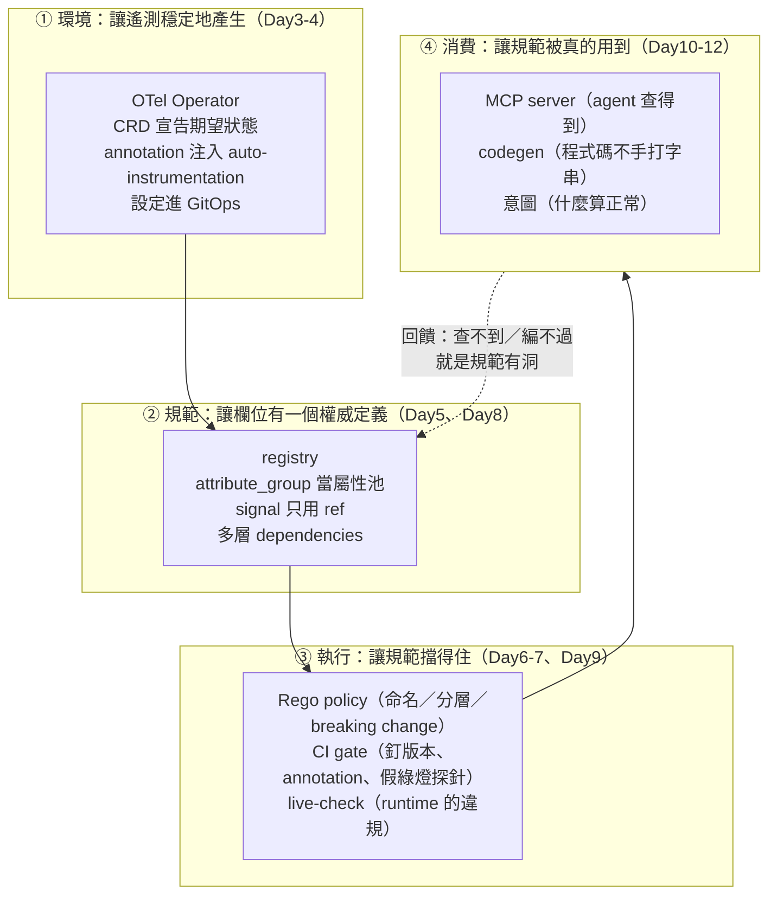

# Day13：新服務上線 checklist——治理環境收尾

十三天前那份 `demo-services` 是故意寫壞的：`userId` 混著 `user.id`、span name 沒有語意、沒有人知道哪個欄位才是對的。中間十一天，我們一件一件把工具鏈疊起來——Operator、registry、policy、CI gate、live-check、分層、breaking change、MCP、意圖。

今天是第一階段的最後一天，要做的事只有一件：**把這十二天的結論壓縮成一份下一個服務可以直接照著走的東西。**

而「可以直接照著走」這句話有一個很高的標準。一份 markdown 上的勾選清單不算——那種東西的命運是被複製到 Confluence，然後在第三個服務上線的時候就跟現實脫節了。今天要做的 checklist 是**會自己跑的**：一支腳本、十三項檢查、每一項都真的去執行一次工具，失敗的那幾項直接告訴你下一步該做什麼。

程式碼在範例 repo [`OTel_AIOps_Agent`](https://github.com/tedmax100/OTel_AIOps_Agent) 的 [`day17/`](https://github.com/tedmax100/OTel_AIOps_Agent/tree/main/day17)：一組新服務範本（registry／intent／`.mcp.json`／CI workflow）、一支 `verify_onboarding.py`，以及兩份 shipping 服務——一份是「照抄了一半」的真實樣子，一份是補完的版本。

## 先回頭看一次這十二天疊了什麼

在講 checklist 之前，先把第一階段的形狀畫出來，因為 checklist 的每一項都是從這張圖上某一格長出來的。



四層的順序不是隨便排的，它是一條**因果鏈**：

**沒有 ①，遙測時有時無。** Day4 那個把 collector 壓到 `OOMKilled` 的實驗就是這一格的反面——annotation 注入了不代表資料穩定送達，而「資料悄悄變少」是後面所有分析的地基被挖空。

**沒有 ②，欄位名是各團隊的方言。** Day1 的命名漂移、Day8 的孤兒定義（團隊以為自己覆寫了 `payment.id`，其實製造了一個沒人引用的定義）都在這一格。

**沒有 ③，規範是一份沒有人遵守的文件。** 這一格最重要的教訓全部關於「安靜失效」：Day5 的 `-r .` 假綠燈、Day7 那三個不會讓你看到錯誤訊息的 CI 陷阱、Day9 那個 `diff` 對型別改變完全靜音。**規範的敵人不是違規，是「看起來過了」。**

**沒有 ④，前面三層是自嗨。** 這是最容易被跳過的一層，也是這系列跟一般 Weaver 教學最不一樣的地方：registry 寫得再漂亮，如果工程師決定欄位名的那三十秒裡它不在現場（Day10），漂移還是會發生。

而第四層那條虛線是今天要特別強調的：**消費端會反過來檢查規範的品質。** Day10 那個「agent 查不到繼承來的欄位」暴露的是 `--include-unreferenced` 的預設值；Day11 那個「意圖編譯失敗」暴露的是欄位名寫錯。這兩件事本來都不會有人發現。

## 十三項檢查，每一項都對應某一天的一個坑

`verify_onboarding.py` 的設計原則只有兩條：**每一項都真的跑一次工具**（不是檢查檔案存不存在就算過），以及**失敗訊息要包含下一步**（Day9 那個結論：一道擋人的 gate 如果不能讓被擋的人自己走出去，維護成本會隨團隊數線性成長）。

先看一個「照抄了一半」的服務。這不是我編的壞例子，是真實會發生的樣子——有人拿了範本，改了服務名，但 `stability` 忘了補、狀態欄位順手寫成 `shippingStatus`、event 裡直接 inline 定義了一個 attribute、`schema_url` 沒有版本號，然後意圖跟 `.mcp.json` 根本沒動：

```
$ python3 day17/verify_onboarding.py day17/services/shipping-v0
新服務上線 checklist：day17/services/shipping-v0

  ✔ [Day8     ] registry 存在（manifest.yaml）            day17/services/shipping-v0/registry
  ✗ [Day9/10  ] schema_url 帶版本號                       https://example.com/schemas/shipping-telemetry
  ✔ [Day5     ] registry check 通過                     exit=0
  ✗ [Day9     ] registry check --future 通過（未來會變嚴的規則）  exit=1，2 條診斷
  ✗ [Day6/8   ] policy 通過：命名（Day6）                    exit=1
  ✗ [Day6/8   ] policy 通過：分層（Day8）                    exit=1
  ✔ [Day5/7   ] 假綠燈探針：group 數 > 0                     2 groups
  ✗ [Day5/10  ] 狀態類欄位都宣告了 enum members                0 個 enum，可疑：shippingStatus
  ✗ [Day11    ] 有宣告穩定狀態意圖                             找不到 intent/steady-state.yaml
  ✗ [Day11    ] 意圖的 why / first_check 有填              （沒有意圖檔案）
  ✗ [Day10    ] 有 .mcp.json（registry 可被 agent 查）      找不到 .mcp.json
  ✔ [Day10    ] MCP 真的答得出來（browse 有東西）                total_attribute_count=2
  ✗ [Day7     ] 有 CI gate workflow                    找不到 semconv-gate.yml

✗ 9/13 項未通過，下一步：
  - schema_url 帶版本號
      → 結尾補上版本，例如 .../shipping-telemetry/0.1.0——diff 拿它當版本標籤，MCP 的 provenance.source 也是它
  - registry check --future 通過（未來會變嚴的規則）
      → 通常是缺 stability、string 缺 examples、或 deprecated 寫成字串
  - policy 通過：命名（Day6）
      → id=camel_case_attribute, category=naming, group=registry.shipping, attr=shippingStatus；id=missing_namespace, category=naming, group=registry.shipping, attr=shippingStatus
  - policy 通過：分層（Day8）
      → id=inline_attribute_in_signal_group, category=layering, group=event.shipping.completed, attr=shipping.carrier
  - 狀態類欄位都宣告了 enum members
      → 把它改成 type.members，那是 LLM 唯一能事先知道值域的來源
  - 有宣告穩定狀態意圖
      → 複製 day17/starter/intent/ 過去；why 跟 first_check 不要留空
  - 意圖的 why / first_check 有填
      → 
  - 有 .mcp.json（registry 可被 agent 查）
      → 複製 day17/starter/.mcp.json 過去
  - 有 CI gate workflow
      → 複製 day17/starter/ci/semconv-gate.yml

$ echo $?
1
```

**注意第三行：`registry check` 是綠的。** 這份 registry 完全合法，用 Day5 那套標準來看它沒有任何問題。九項失敗全部落在「合法但不夠好」的區間裡——而那個區間，正是這十二天真正在處理的東西。

補完之後（`shipping-v1`）：

```
$ python3 day17/verify_onboarding.py day17/services/shipping-v1


  ✔ [Day8     ] registry 存在（manifest.yaml）            day17/services/shipping-v1/registry
  ✔ [Day9/10  ] schema_url 帶版本號                       https://example.com/schemas/shipping-telemetry/0.1.0
  ✔ [Day5     ] registry check 通過                     exit=0
  ✔ [Day9     ] registry check --future 通過（未來會變嚴的規則）  exit=0，0 條診斷
  ✔ [Day6/8   ] policy 通過：命名（Day6）                    exit=0
  ✔ [Day6/8   ] policy 通過：分層（Day8）                    exit=0
  ✔ [Day5/7   ] 假綠燈探針：group 數 > 0                     6 groups
  ✔ [Day5/10  ] 狀態類欄位都宣告了 enum members                5 個 enum
  ✔ [Day11    ] 意圖編譯得過（欄位名對得上 registry）               exit=0
  ✔ [Day11    ] 意圖的 why / first_check 有填（不是範本佔位字）     已填寫
  ✔ [Day10    ] 有 .mcp.json 且設定正確                     registry=✔ include-unreferenced=✔
  ✔ [Day10    ] MCP 真的答得出來（browse 有東西）                total_attribute_count=8
  ✔ [Day7     ] CI gate 包含四個必要元素                      齊全

✔ 13/13 項全部通過，這個服務可以上線了

$ echo $?
0
```

`6 groups` 跟 `total_attribute_count=8` 這兩個數字比 v0 大，是因為 v1 有 `dependencies` 指向平台團隊那份 base，繼承的東西被算進來了（都帶了 `--include-unreferenced true`）。順帶一提，**這個旗標到今天為止已經在四個地方各咬過一次**：Day8 的 `stats` 數字、Day10 的 MCP 查不到欄位、Day11 的生成物少東西、今天 checklist 裡的兩項。一個預設值能製造四種不同的困惑，這件事本身就值得寫進範本的註解裡。

### 幾項值得單獨說的檢查

**「MCP 真的答得出來」跟「有 `.mcp.json`」是兩項，不是一項。** 這是 Day10 第四個坑教出來的：設定檔存在、格式正確、路徑也對，但如果漏了 `--include-unreferenced true`，agent 問任何一個繼承來的欄位都會得到「不存在」。所以 checklist 不能只檢查設定，得真的把 server 叫起來問一個問題，看 `total_attribute_count` 是不是 0。**「設定對」跟「答得出來」之間有一整個坑的距離。**

**「意圖的 `why` 有填」是一項獨立的檢查，而且它檢查的是佔位字有沒有被清掉：**

```python
placeholders = [p for p in ("寫清楚：", "因為這很重要", "<service>", "<team>") if p in text]
```

這一項看起來很笨，但它處理的是 Day11 那個誠實的顧慮：意圖最容易失敗的方式不是沒寫，是**照著範本填了一堆廢話**。範本裡故意寫了「寫清楚：低於這條線時，哪一群使用者會受到什麼影響」這種句子當佔位字——一旦它留在檔案裡，這一項就會紅。抓不到「因為這很重要」這種真人寫的廢話，但至少抓得到「完全沒動過範本」。

**「狀態類欄位都宣告了 enum members」是唯一一項需要語意猜測的檢查**，它去找名字結尾是 `status`／`state`／`outcome`／`result`／`kind`／`type` 但型別是純字串的欄位。理由是 Day5 到 Day10 反覆講的那件事：`members` 是 LLM 唯一能事先知道值域的來源，一個 `type: string` 的狀態欄位對 agent 來說等於沒有資訊。

而這一項在我寫的第一版裡有一個洞，值得完整記下來。

## 我自己的 checklist 有一個洞

第一版的判斷是這樣寫的：

```python
elif any(name.endswith(f".{w}") for w in ("status", "state", "outcome", ...)):
```

拿它去跑 `shipping-v0`，那一項是**綠的**：

```
  ✔ [Day5/10  ] 狀態類欄位都宣告了 enum members                0 個 enum
```

`0 個 enum` 而且沒有任何可疑欄位——但 v0 明明有一個 `shippingStatus`，一個型別是 `string` 的狀態欄位，正是這項檢查存在的理由。

原因是我比對的是 `.status` 這個字尾，而 `shippingStatus` 沒有點。**那個欄位躲過這項檢查的原因，剛好就是它另外違反了兩條命名規則。** 換句話說：一個「命名壞掉」的欄位，會順便躲過「值域宣告」的檢查。

這個洞在 v0 上不致命，因為命名那一項會紅，那個欄位還是會被抓到。但把它換一個寫法就不一樣了——`shippingstatus`（全小寫、沒有點）也一樣沒有點、也一樣躲過 enum 檢查，而它會不會被命名 policy 抓到取決於那條 policy 抓的是 camelCase 還是缺 namespace。**兩道檢查各有一個洞，而兩個洞剛好對得上的時候，就會有東西整個穿過去。**

修法是把 Day6 那個正規化搬過來——先把分隔符去掉再比字尾：

```python
elif any(
    re.sub(r"[._]", "", name).lower().endswith(w)
    for w in ("status", "state", "outcome", "result", "kind", "type")
):
```

```
  ✗ [Day5/10  ] 狀態類欄位都宣告了 enum members                0 個 enum，可疑：shippingStatus
```

這件事的一般教訓比這個 bug 重要：**checklist 本身也是一份會有 bug 的程式碼，而它的 bug 只會在「本來就有問題的服務」上顯現。** 一份永遠只跑在健康服務上的 checklist，等於從來沒有被測試過。所以 `shipping-v0` 這份「壞掉的服務」不是文章的教材，是這支腳本的**測試資料**，得跟腳本一起維護——這也是為什麼我把它 commit 進範例 repo 而不是寫成文章裡的一段範例。

## 範本：把 checklist 的每一項變成可以複製的東西

checklist 只會告訴你缺什麼，不會告訴你怎麼補。所以 `day17/starter/` 是配套的另一半，四份範本，每一份裡面的註解都指回它對應的那一天：

```
day17/starter/
  registry/manifest.yaml        schema_url 帶版本、dependencies 路徑相對於 repo 根目錄
  registry/model/telemetry.yaml attribute_group 屬性池 + signal 只用 ref + enum 展開 members
  intent/steady-state.yaml      why / first_check 用「寫清楚：」當佔位字，逼你動它
  .mcp.json                     帶 --include-unreferenced true
  ci/semconv-gate.yml           版本釘死 + sha256 + diagnostic-stdout + 假綠燈探針 + failure() 補印
```

CI 範本裡那五個必要元素，checklist 會逐一檢查存在性：

```python
required = {
    "版本釘死": "WEAVER_VERSION" in text,
    "sha256 驗證": "sha256sum" in text,
    "--diagnostic-stdout": "--diagnostic-stdout" in text,
    "group 數探針": "stats" in text,
    "failure() 補印": "if: failure()" in text,
}
```

這是很粗糙的字串比對（把 workflow 註解掉它照樣算過），但它抓的是真實會發生的事：**有人為了讓 CI 快一點，把某個步驟刪掉。** 那五項每一項都是踩過的坑，刪掉任何一項的後果都是 gate 安靜失效，而不是變慢。範本裡那段註解就是為了讓下一個想刪的人先看到理由。

還有一件範本沒辦法幫你的事，寫在 workflow 最後一行：

```yaml
# 別忘了：required status check 不在這個 YAML 裡，要去 branch protection 設（Day7 最後那段）
```

**這是整份 checklist 唯一一項自動化檢查不到的東西**，因為它不在 repo 裡，在 GitHub 的設定裡。Day7 說它是最容易被忘記的一步，今天再說一次：workflow 跑得出來不等於擋得住。

## 平台工程：checklist 是清單，不是門

今天這個東西很容易被誤用成一道新的 gate，所以要把它的位置講清楚。

**checklist 不該是 merge gate。** 十三項裡面只有前六項（registry check、`--future`、policy、探針）適合擋 PR——那些是確定性的、訊息也講得清楚該改什麼。後面幾項（有沒有意圖、`why` 有沒有填、`.mcp.json` 在不在）**應該是上線前的一次對話，不是每個 PR 都要過的門**。Day11 講過理由：擋一個「你還沒想清楚什麼算正常」的 PR，只會讓人隨便填一個數字進去。

實際的用法是三個場合，強度各不相同：

| 場合 | 誰跑 | 沒過會怎樣 |
|---|---|---|
| 新服務上線審查 | 服務團隊自己跑，結果貼進 PR | 對話的起點，不是拒絕的理由 |
| 每個 PR 的 CI | 自動 | 前六項擋，後面幾項不擋 |
| 每季一次全服務掃描 | 平台團隊對所有服務跑一輪 | 產出一份「治理現況」清單 |

第三個場合是這支腳本我自己最想用的用途。它不需要任何新工具——`for dir in services/*; do python3 day17/verify_onboarding.py $dir; done`，就是一份平台團隊手上的治理儀表板。而它回答的是一個平常沒有人回答得出來的問題：**我們有幾個服務宣告了意圖？有幾個服務的 registry 是 agent 查得到的？** 這兩個數字比「有幾個服務通過 CI」有用得多，因為它們衡量的是**能力覆蓋率**，不是合規率。

**誰維護這份 checklist。** 平台團隊，而且要接受它會一直改——每次踩到新的坑就多一項。今天這十三項有一個共同點：**沒有一項是我從文件上讀來的**，全部是前十二天實際撞到之後才知道要檢查的。所以這份清單的長度會成長，而成長本身是健康的訊號。反過來說，一份三年沒改過的 checklist 幾乎一定已經跟現實脫節了。

**產品團隊要付多少成本。** 補完 `shipping-v0` 到 `shipping-v1` 的實際工作量：registry 補 `stability`／`examples`／把 `shippingStatus` 改成 `shipping.status` 加 enum members、把 inline 的 `shipping.carrier` 改成 `ref`、`schema_url` 加版本號、複製三份範本、然後寫那份意圖。前面全部是機械性的（訊息已經告訴你改哪一行），**唯一真正花時間的是意圖那份 YAML 裡的 `why`**——而那正是唯一產品團隊以外沒有人寫得出來的東西。這個比例是刻意的：**平台團隊該把所有機械性的部分做成範本跟訊息，讓團隊的時間全部花在只有他們能回答的問題上。**

## 第一階段給了你什麼

如果只帶三件東西離開這個階段，我會選這三個：

**一份跑得動的治理管線。** 不是概念，是 `day17/` 底下那些檔案：registry 範本、五個必要元素齊全的 CI workflow、四條 Rego policy（命名、分層、breaking change、deprecated 使用）、一份 `.mcp.json`、一支會自己跑的 checklist。抄回去改個服務名就能開始用。

**一套判斷「安靜失效」的直覺。** 這個階段最值錢的東西不是任何一個指令，是一組反覆出現的模式：`-r .` 綠燈但什麼都沒檢查（Day5）、annotation 落不到行上（Day7）、重複定義製造孤兒（Day8）、`diff` 對型別改變靜音（Day9）、`browse_namespace` 不標 deprecated（Day10）、`not found` 回 `isError: false`（Day10）、我自己的 checklist 漏掉 `shippingStatus`（今天）。**這七件事的共同點是：出錯的時候沒有人會知道。** 而學會預期這種形狀的失敗，比記住任何一個 flag 都重要。

**一條可以講給別人聽的因果鏈。** 治理 → 資料可信 → agent 的判斷有依據。這句話在十三天前是一個口號，現在每一段都有具體的實作跟具體的失敗案例可以指：欄位名沒有權威來源，agent 就會猜（Day10 那個 `not found` 之後自己命名）；值域沒宣告，agent 就查不到資料然後回報「系統正常」（Day11 那個 `AUTHORIZED`）；registry 改版沒有交代，下游的意圖會編出一條永遠不觸發的 alert（Day11）。

## 今天沒做的事

沒有真的在 GitHub 上跑過那份 CI 範本。裡面的 `WEAVER_SHA256` 是一個佔位字，`git worktree add /tmp/baseline origin/main` 那一段也只在本機驗證過語法。Day7 就欠了一張「真的被擋下來的 PR 截圖」，今天還是沒補上——這件事需要一個公開 repo 跟一個真的會被擋的 PR，我打算等 Series 2 開始之前一次補完。

沒有把 checklist 接上 Day3–4 那一層。十三項全部落在 registry 跟意圖上，完全沒有檢查「這個服務的 Operator 設定對不對」——例如有沒有正確的 `Instrumentation` annotation、collector 的 pipeline 有沒有把它的資料收進來。這一層要檢查得連上真實 cluster，而那會讓這支腳本從「純本機、幾秒跑完」變成「需要 kubeconfig」。**這個取捨是刻意的**：一份需要環境的 checklist，會變成一份沒有人在本機跑的 checklist。真正該做的是把它拆成兩支，而那需要先想清楚哪一支該進 CI。

沒有處理「服務下線」。整個階段都在講怎麼上線，但一個服務被砍掉之後，它的 registry 該留還是該刪、它宣告過的欄位有沒有別人在引用、它的意圖檔案該不該一起消失——這些問題今天完全沒碰。Day9 那條 `deprecated_usage.rego` 是這個方向的一半（誰還在用某個欄位），另一半（誰還在引用某個已經不存在的服務的欄位）要等 Day15 的拓撲對帳才有工具可以查。

明天開始第二階段：**AIOps 核心能力管線**。第一階段做的是「讓資料值得信任」，第二階段要做的是「讓資料能被推理」——先讀現況，把 `signals` 模組實際的資料流畫出來（`topology.py`／`context.py`／`compile.py` 各自在做什麼），對照 Day2 那張 AIOps 九宮格，誠實標出哪幾格已經有東西、哪幾格還是空的。這一段會比第一階段更多「概念 vs 實作現況」的落差，而那個落差本身就是內容。
