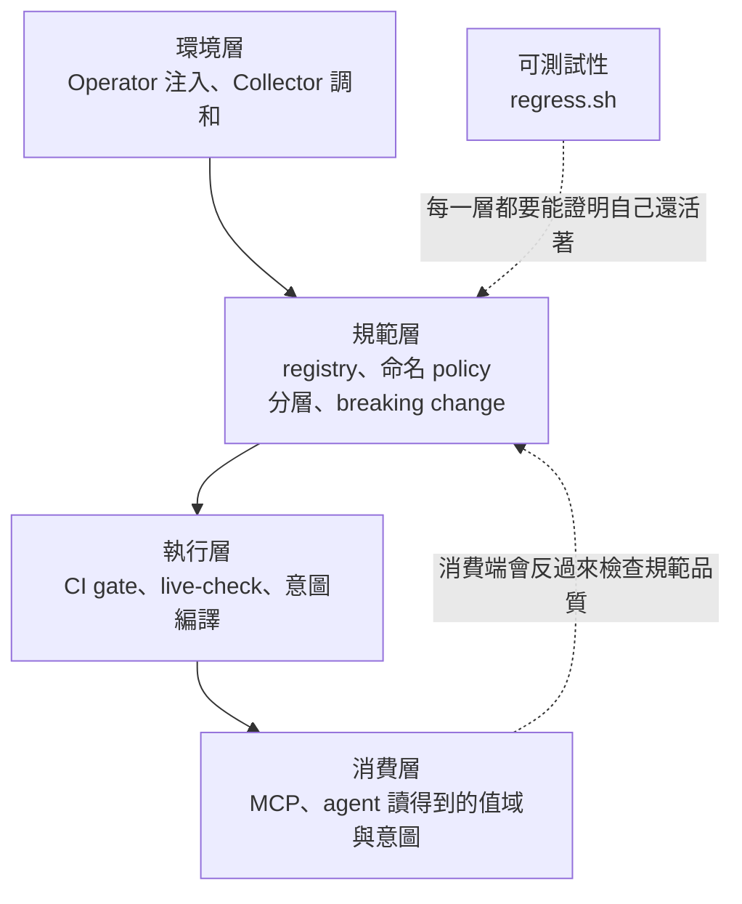
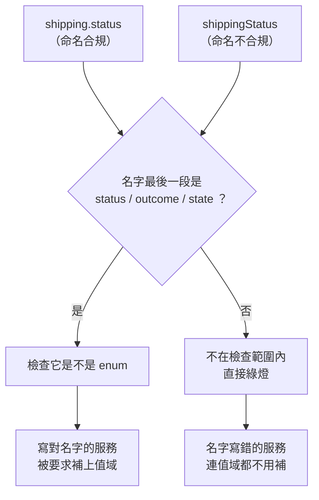

# Day13：新服務上線 checklist，與第一階段的收尾

前面十二天做的每一件事，都是為了同一個場景：**下一個新服務要上線的時候，怎麼讓它一次就做對。**

但到目前為止，這些東西散在十二個資料夾裡。一個剛加入的團隊要接上這一整套，他得先讀完十二篇文章，而那顯然不是一個能規模化的介面。今天把它們收成一份會自己跑的 checklist。

程式碼在範例 repo [`OTel_AIOps_Agent`](https://github.com/tedmax100/OTel_AIOps_Agent) 的 [`ironman-2026/day13/`](https://github.com/tedmax100/OTel_AIOps_Agent/tree/main/ironman-2026/day13)：一支 [`verify_onboarding.py`](https://github.com/tedmax100/OTel_AIOps_Agent/blob/main/ironman-2026/day13/verify_onboarding.py)，加上兩份對照用的服務。指令一律假設從 repo 根目錄跑，驗證環境是 weaver 0.25.1。

## 先看這十二天疊出了什麼形狀

把前面做的事按因果排一次，會發現它不是十二個獨立的工具，是四層：



圖裡「消費層」那一格用的是 MCP（Model Context Protocol），而那條回饋虛線是這十二天我最沒預期到的收穫。把 registry 交給 agent 之後才發現，分層做得好好的 registry，在 agent 那一端預設看不到 base 的屬性。**消費端會反過來暴露規範層的問題**，而在沒有消費端之前，那些問題完全看不出來。

## 十三項檢查，每一項都真的跑一次

checklist 最常見的失敗方式是它變成一份問卷：「你有沒有寫 brief？」「有。」然後沒有人真的去看。所以這支腳本的每一項都是去執行一次工具，然後讀它的離開碼或輸出。

拿一個「照抄一半」的新服務當靶子。這是很真實的情況：新團隊複製了隔壁團隊的 registry，改了名字，該補的沒補完：

```console
$ python3 ironman-2026/day13/verify_onboarding.py ironman-2026/day13/shipping-v0

# shipping-v0 上線檢查

## 基本
  ✓ 1. registry/manifest.yaml 存在
  ✓ 2. registry 真的被讀進來  2 個 group
  ✓ 3. registry check 通過

## 命名與分層
  ✗ 4. 命名規則通過
      問題：違規的欄位：shippingStatus
      下一步：改成 snake_case、補上 namespace（例如 shipping.status）
  ✗ 5. 有宣告 base registry 的 dependency
      問題：manifest.yaml 裡沒有 dependencies
      下一步：加上 ironman-2026/day08/base，然後把共用欄位改成 ref
  ✓ 6. 沒有跟別人衝突的重複定義

## 對 agent 的可用性
  ✓ 7. 每個 attribute 都有 brief  3 個
  ✓ 8. 狀態類欄位都把值域寫進 schema  enum：（沒有）
  ✗ 9. 每個 metric 都有語意單位
      問題：單位是空的或 1：shipping.dispatched
      下一步：用 UCUM（Unified Code for Units of Measure）的計數單位，例如 {shipment}，agent 才知道這個數字在數什麼
  ✗ 10. 每個 metric 都標了 owner
      問題：沒有 annotations.intent.owner：shipping.dispatched
      下一步：在 metric group 上加 annotations.intent.owner，告警才知道要找誰

## 意圖與產出
  ✗ 11. 有寫下這個服務的穩定狀態意圖
      問題：ironman-2026/day13/shipping-v0/intent 底下沒有任何 YAML
      下一步：從 ironman-2026/day11/intent/steady-state.yaml 抄一份，寫下什麼叫做正常
  ✗ 12. 意圖編得出 alert rule
      問題：沒有意圖可以編
      下一步：先做完第 11 項
  ✓ 13. 生得出型別安全的常數與 enum

────────────────────────────────────────────────────────────
7/13 通過
```

先看第 3 項：**`registry check` 是綠的。** 這個服務在 weaver 眼裡完全合法，YAML 結構正確、該有的欄位都有。但它有六項沒過，而那六項全部落在「合法，但對 agent 沒有用」這個區間。

前面講過內建檢查的邊界：少了 `brief` 是硬錯誤，少了 `examples` 完全不吭聲。這份 checklist 補的就是那條邊界之外的東西。**工具管的是這份 YAML 合不合法，checklist 管的是這份 schema 好不好用。**

每一項失敗都有「下一步」，這是我花最多力氣的部分。前面講過那條判準：一道 gate 如果擋下來之後還要平台團隊親自去解釋，它的維護成本會隨團隊數線性成長。所以第 4 項不只說 `shippingStatus` 違規，還說改成 `shipping.status`；第 11 項不只說沒有意圖，還說去哪抄一份。

補完之後：

```console
$ python3 ironman-2026/day13/verify_onboarding.py ironman-2026/day13/shipping-v1
...
13/13 通過
```

`shipping-v1` 做的事只有四件：`shippingStatus` 改成有 `members` 的 `shipping.status`、接上 base 並把 `biz.user.id` 改成 `ref`、metric 補上 `{shipment}` 跟 `owner`、寫一份意圖。加起來大概三十行 YAML。

## 我自己的 checklist 有兩個洞

這才是今天最值得寫的一段。上面那份 `shipping-v0` 的報告裡，有兩個綠燈是錯的。

**第 8 項放過了 `shippingStatus`。** 那個檢查在做的事是：找出名字最後一段是 `status`、`outcome`、`state`、`result` 的屬性，確認它們都是 enum。而 `shippingStatus` 這個名字裡沒有點，整個名字就是一段，所以它匹配不到任何一個關鍵字。



看清楚這個因果：**它因為同時違反了命名規則，反而躲過了值域檢查。** 一個服務如果命名寫對了，這個檢查會抓到它；命名寫錯的服務反而全身而退。這是我看過最諷刺的一種假綠燈，而它只有在跑一個「兩件事都做錯」的服務時才會現形。

**第 6 項放過了 `biz.user.id`。** `shipping-v0` 裡有一個自己定義的 `biz.user.id`，brief 寫的是「收件人的識別碼」，而 base 裡那個是「使用者識別碼」。這正是分層時那條 `conflicting_definition` 規則要抓的東西，但它是綠的。

第一個原因很單純：v0 沒宣告 dependency，base 的定義根本不在視野裡。但我手動補上 dependency 之後，它**還是綠的**：

```console
$ weaver registry check -r ironman-2026/day13/shipping-v0/registry -p ironman-2026/day08/policies
（沒有任何違規）
```

因為那個屬性沒有被任何 span 或 metric `ref` 到，所以它不會進 resolved schema，而 policy 看的就是 resolved schema。這是「未引用的定義不會進來」那個行為，跟「MCP 查不到 base 屬性」是同一件事，今天它第三次出現，這次的受害者是我自己的 checklist。

加上 `--include-unreferenced` 確實抓得到，但代價是這個：

```console
  × The attribute id `biz.user.id` is declared multiple times ...
  - Message : id=conflicting_definition, attr=aws.dynamodb.table_names
  - Message : id=conflicting_definition, attr=biz.user.id
  - Message : id=conflicting_definition, attr=client.port
```

`biz.user.id` 在裡面，但旁邊躺著上游 semconv 自己的同名定義。一個真陽性配兩個雜訊，而這個比例只會隨著 registry 長大而變差。

兩個洞的共通點是：**它們都只在壞掉的服務上顯現。** 我拿 `shipping-v1` 跑一百次都不會發現任何一個，因為那份服務每一項都做對了。所以那個照抄一半的 `shipping-v0` 不是教材，它是測試資料，而且是這支腳本唯一的測試資料。

> 這跟昨天那句「你要驗證的不是它會不會通過，是它還會不會擋」是同一件事，只是這次要驗證的對象換成了 checklist 自己。我寫完它、跑過 v1 拿到 13/13、很滿意，然後跑 v0 才看到那兩個洞。

## checklist 是清單，不是門

從平台工程的角度，這份東西的定位要講清楚，不然它會被誤用。

**前面幾項適合擋 PR，後面幾項不適合。** 第 1 到第 6 項是機械的：manifest 在不在、命名對不對、有沒有重複定義，這些沒有討論空間，可以直接進 CI 當 required check。但第 11 項「有沒有寫下什麼叫做正常」不能用擋的，一個被強迫寫意圖的團隊會交出一份複製貼上的 YAML，那比沒有更糟，因為它看起來像有人想過。

後面那幾項的正確用法是**上線前的一次對話**：把報告印出來，跟那個團隊一起看，問他們「你們的服務，什麼情況算不正常」。checklist 在這裡的角色是議程，不是判決。

**成本落在誰身上。** 一個新服務要從 7/13 到 13/13，實際動的是三十行 YAML 跟一份意圖檔。要學的新概念有三個：`ref` 跟 `id` 的差別、enum 的 `members`、意圖要指向 registry 裡真的存在的欄位。如果答案變成「先讀完 registry 規格」，這個設計就失敗了。

**每季一次全服務掃描，產出的是能力覆蓋率，不是合規率。** 這兩個詞的差別在於你拿這個數字去做什麼。合規率是拿來要求別人的，能力覆蓋率是拿來回答「我們的 agent 現在能在多少個服務上做出可信的判斷」的。同一份數字，前者製造對立，後者是平台團隊自己的路線圖。

## 第一階段換到了什麼

這十三天到底替 agent 買到了什麼？把 Day1 那些失敗一條一條對回來：

| Day1 的失敗 | 現在有什麼 | 還缺什麼 |
| --- | --- | --- |
| 猜 `WARN` 是大寫，60 筆變 0 筆 | `enum.members` 寫進 registry，MCP 查得到 | 沒有量過接上之後分數會不會變好 |
| `deployment_environment` 這個 label 不存在 | live-check 會在部署後抓到送出去的欄位跟規範對不上 | 沒接到真的服務上 |
| 空結果 → 編一個數字 | 完全沒有解決 | 這是 agent 那一側的事 |
| 沒有判準說 2.98% 算不算異常 | 意圖編成 alert rule，帶著 `why` 跟 `first_check` | 沒有測過 agent 讀了會不會用 |
| 「有時候會 discover，有時候不會」 | 沒有解決 | 同上 |

誠實地說，**第一階段沒有讓那隻 agent 變聰明，它做的是讓 agent 面對的世界變得可推斷。** 這兩件事的差別，正好是這個系列一開始就在講的那句話：AIOps 要的不是更多資料，是可推斷的資料。

而「可推斷」現在有了具體的清單：欄位名是唯一的、值域寫下來了、規範跟實際送出去的東西對得上、誰擁有哪一層講清楚了、改版有人比對、agent 查得到、什麼叫正常寫下來了，而且這些東西壞掉的時候會有人知道。

至於這些到底讓分數變成幾分，我還沒量。那是接下來要做的事。

## 今天沒做的事

沒有把這 13 項接進 CI。它現在是上線前手動跑一次的東西，而前六項其實應該變成 PR 上的 required check。

沒有把 checklist 自己加進昨天那支回歸腳本。`shipping-v0` 要跑出 exit 1、`shipping-v1` 要跑出 exit 0，這兩條斷言應該進去，不然哪天有人改壞了第 4 項的判斷邏輯，沒有任何東西會發現。

上面那兩個洞也沒有修。第 8 項要改成「先確認命名合規，再檢查值域」，或者乾脆改成看 `examples` 裡有幾個相異值；第 6 項在 `--include-unreferenced` 的雜訊被解決之前，只能先誠實記著。修它們需要先想清楚規則該問什麼問題，而那正是分層那條規則教過的事：**問「這個名字歸誰管」跟問「這個定義跟別人衝不衝突」，是兩條完全不同的規則。**

也沒有做多語言。`shipping-v1` 生的是 Python，一個 Go 的服務要接上這套，樣板得另外寫一份。

## 小結

今天做的事很無聊，就是把前面十二天的東西寫成一支會自己跑的腳本，然後拿兩個服務跑跑看。

但那兩個洞讓我想了很久。我寫這份 checklist 的時候，是照著自己前面十二天踩過的坑一項一項排的，理論上不會有比這更貼近真實問題的清單了。結果它在第一次面對一個真的沒做好的服務時，就漏掉了兩件事，而且其中一件的漏法是「因為那個服務錯得更徹底，所以躲過了檢查」。

**檢查機制只會在壞掉的東西上顯現自己的缺陷，而我們平常手上大多是好的東西。** 這對後面要做的 agent evaluation 應該是同一個道理，一組全部答對的題目量不出任何東西，所以那組題目本身也得先想辦法弄壞一次看看。

第一階段到這裡結束。這一段做的是讓資料值得相信，接下來換一個問題：讓資料能被推理。明天先去把現在手上已經有的東西讀清楚。
